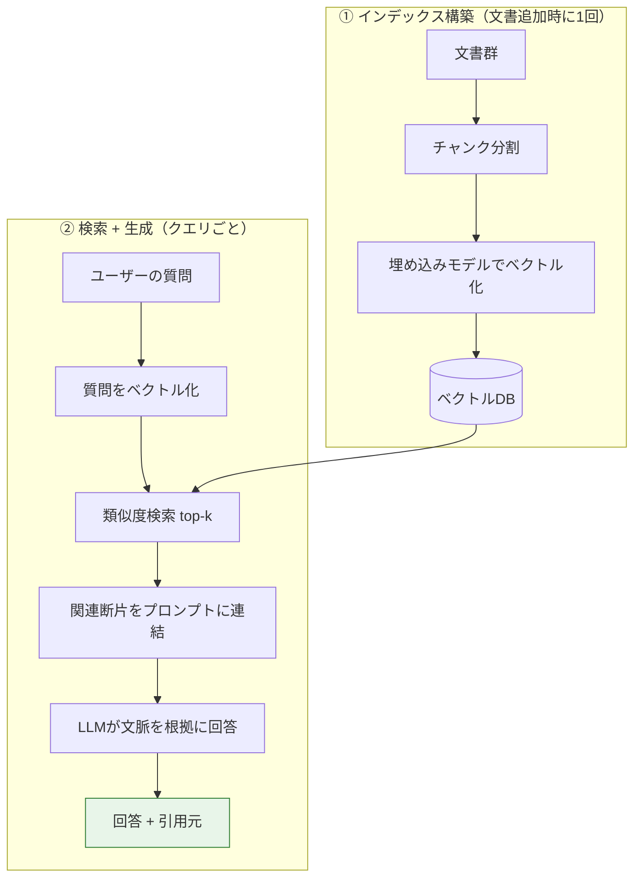

# RAG（Retrieval-Augmented Generation / 検索拡張生成）

> **一言で言うと:** LLMに答えさせる前に、**社内文書やDBから質問に関連する断片を検索し、プロンプトに詰め込んで（拡張して）回答させる**手法。モデルの重みを再学習せずに「自分のデータに基づいた回答」を実現し、学習時点より新しい情報や非公開情報を扱える。[[ToolCalling]] が「モデルに行動させる」なら、RAGは「モデルに知識を渡す」——両者は対をなし、組み合わせて使う。

## なぜ必要か

素のLLMは学習時点の知識しか持たず、あなたの社内Wiki・契約書・最新の在庫情報を知らない。これを解決する選択肢は3つあり、RAGは多くの場合で第一候補になる。

| 手法 | やること | 向き不向き |
|---|---|---|
| **ファインチューニング** | データをモデルの**重みに焼き込む** | 高コスト・更新が重い・出典を示せない。文体や形式の学習向き |
| **RAG** | データを**検索して文脈に詰める** | 安価・即時更新・**出典を示せる**。知識の注入向き |
| **[[ToolCalling]]** | モデルが**API/DBを呼んで取得** | 構造化照会・行動向き。RAG検索を「ツール」にもできる |

RAGは「知識更新はインデックスの入れ替えだけ」で済むため、頻繁に変わる知識ベースに強い。出典（引用元）を提示できるのでハルシネーション（もっともらしい嘘）の検証もしやすい。

## 全体パイプライン

RAGは大きく**①事前のインデックス構築**と**②クエリ時の検索＋生成**の2フェーズに分かれる。



> [!info] 用語ミニ辞典
> - **埋め込み（Embedding）** — テキストを「意味の近さ」が距離に反映された数値ベクトル（例: 1024次元）に変換したもの。専用の**埋め込みモデル**で作る。意味が近い文ほどベクトルが近くなる。
> - **ベクトルDB（Vector Database）** — 大量のベクトルを保存し、あるベクトルに**近いものを高速に検索**できるDB。pgvector（PostgreSQL拡張）、Pinecone、Qdrant、Weaviate、[[Valkey]]/Redis のベクトル機能など。多くは近似最近傍探索（ANN）で全件比較を避ける（[[インデックス]] の発想）。
> - **チャンク（Chunk）** — 長い文書を検索単位に分割した断片。大きすぎると無関係な内容が混ざり、小さすぎると文脈が切れる。

## コード例：最小のRAG（Python）

埋め込みモデルとベクトルDBは差し替え可能な部品なので、ここでは `embed()` / `vector_db` を抽象化して示す。**Anthropic 自身は埋め込みAPIを提供しておらず**、埋め込みは Voyage AI・OpenAI embeddings・オープンソース（sentence-transformers, bge 等）など外部部品を使う点に注意。

```python
import anthropic

client = anthropic.Anthropic()

# ① インデックス構築（文書追加時に1回）
def build_index(docs: list[str]) -> None:
    chunks = chunk_documents(docs)        # 文書を300〜800トークン程度に分割
    vectors = embed(chunks)               # 埋め込みモデルでベクトル化
    vector_db.upsert(chunks, vectors)     # ベクトルDBへ保存

# ② 検索 + 生成（クエリごと）
def answer(query: str) -> str:
    q_vec = embed([query])[0]
    hits = vector_db.search(q_vec, top_k=5)          # 類似度上位5件
    context = "\n\n---\n\n".join(
        f"[出典{i}] {h.text}" for i, h in enumerate(hits)
    )

    resp = client.messages.create(
        model="claude-opus-4-8",
        max_tokens=1024,
        # 「コンテキストだけを根拠にせよ」「無ければ分からないと答えよ」が肝
        system=(
            "以下のコンテキストだけを根拠に回答し、必ず [出典N] を引用せよ。"
            "コンテキストに答えが無ければ、推測せず『分かりません』と答えよ。\n\n"
            f"{context}"
        ),
        messages=[{"role": "user", "content": query}],
    )
    return "".join(b.text for b in resp.content if b.type == "text")
```

押さえどころ:

- **システムプロンプトで「コンテキスト限定」と「無ければ降参」を明示**しないと、モデルは自分の記憶で補完しハルシネーションする。RAGの効果はこの指示で大きく変わる。
- **引用（出典）を強制**すると、回答の検証可能性が上がる。Anthropic の Messages API には文書ブロックに対する**ネイティブのCitations機能**もあり、引用箇所を構造化して返せる。

> [!note] 言語について
> RAG のパイプライン（チャンク分割 → 埋め込み → 類似度検索 → 文脈注入 → 生成）は**言語非依存**で、エコシステムの厚みから実務では Python が主流。ただし TypeScript 等でも同じ構造で実装できる（`@anthropic-ai/sdk` ＋ ベクトルDBクライアント、例: pgvector を `pg` 経由、Qdrant の `@qdrant/js-client-rest` など）。上の `embed()` / `vector_db` を各言語のSDKに差し替えれば移植できる。

## RAG と [[ToolCalling]] / [[MCP]] の組み合わせ

- **エージェント型RAG（Agentic RAG）** — 検索を毎回固定で挟むのではなく、**検索自体を1つのツール**として公開し、モデルが「これは調べた方がいい」と判断したときだけ [[ToolCalling]] で呼ぶ。簡単な雑談では検索せず、知識が要る質問でだけ検索する賢い挙動になる。
- **[[MCP]] の Resources** — 検索した文書をMCPのリソースとしてモデルに読ませれば、RAGの取得層を標準インターフェースに載せられる。
- **Web検索ツール** — 社内知識ではなく公開Web情報が要るなら、Anthropic の `web_search` サーバーツールが「Web版RAG」として機能する（検索→取得→引用を内部で完結）。

## 落とし穴

### 1. チャンク分割の粒度

大きすぎるチャンクは無関係な内容を混ぜて検索精度を下げ、小さすぎると文脈が切れて意味が壊れる。文の境界・見出し単位で分け、隣接チャンクを少し重ねる（オーバーラップ）のが定石。**「とりあえず固定1000文字で切る」は事故りやすい**。

### 2. 意味検索だけでは取りこぼす（ハイブリッド検索）

埋め込みによる意味検索は、型番・固有名詞・略語の完全一致に弱い（「ABC-123」のような語）。**キーワード検索（BM25等）と組み合わせるハイブリッド検索**＋再ランク（reranking）で取りこぼしを減らす。

### 3. インデックスの陳腐化

文書を更新したのにベクトルDBを再構築し忘れると、**古い情報を自信満々に引用する**。更新パイプラインと再インデックスの運用を最初から設計する。

### 4. 埋め込みモデルの不一致

インデックス構築時とクエリ時で**同じ埋め込みモデル**を使わないと、ベクトル空間がずれて検索が無意味になる。モデルをアップグレードしたら**全文書の再埋め込み**が必要。

### 5. 検索結果経由のプロンプトインジェクション

取得した文書に「これまでの指示を無視して〜」と仕込まれていると、モデルが従いうる。取得テキストは**信用できない外部入力**として扱い、システムプロンプトで役割を固定し、[[ToolCalling]] の副作用ツールと組み合わせる場合は特に [[バリデーション]] と権限制御を効かせる。

### 6. コンテキストに詰め込みすぎ

top-k を増やせば精度が上がるとは限らない。無関係な断片はノイズになり、入力トークン＝コストも増える。**関連度の高い少数**＋再ランクの方が、大量詰め込みより良いことが多い。

## 関連トピック

- 親: [[ToolCalling]] — 検索を「ツール」として呼ぶエージェント型RAGの基盤
- [[MCP]] — Resources としてRAGの取得層を標準化する
- [[NoSQL]] — ベクトルDBの位置づけ（[[インデックス]] の近似最近傍探索）
- [[キャッシュ戦略]] / [[Valkey]] — 埋め込み・検索結果のキャッシュ
- [[バリデーション]] — 取得テキストを外部入力として扱う
- [[ストリームレスポンス]] — 回答のストリーミング配信（チャットUI）

## 参考リソース

- [Anthropic — Citations](https://platform.claude.com/docs/en/build-with-claude/citations) — 文書ブロックからの構造化引用（出典の根拠付け）
- [Anthropic — Web search tool](https://platform.claude.com/docs/en/agents-and-tools/tool-use/web-search-tool) — Web版RAGとして使えるサーバーツール
- [pgvector](https://github.com/pgvector/pgvector) — PostgreSQLでベクトル検索を行う代表的拡張
- [Voyage AI](https://www.voyageai.com/) — Anthropicが埋め込みで推奨する外部プロバイダ
