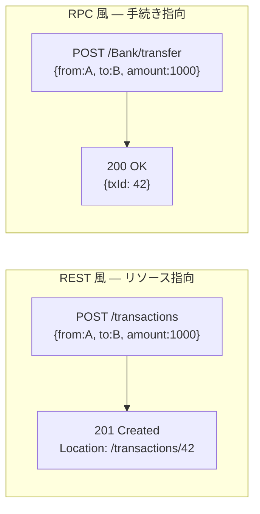
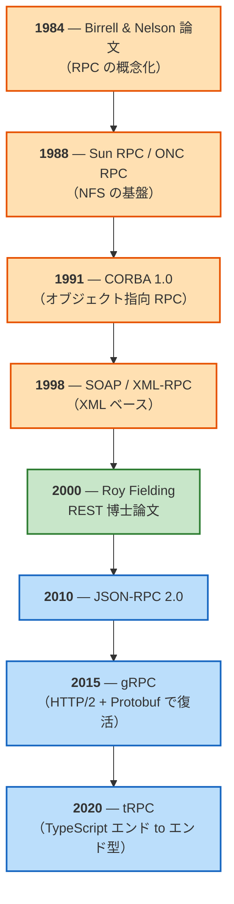
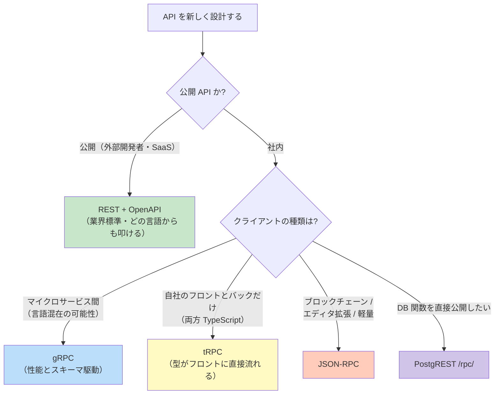

# RESTとRPC（REST and Remote Procedure Call）

> **一言で言うと:** REST は HTTP の意味論を活かしリソース（名詞）を中心に設計する **アーキテクチャスタイル**、RPC（Remote Procedure Call）は遠隔の関数（動詞）をローカル呼び出しのように扱う **通信パラダイム**。「REST API か RPC API か」と二択で語られがちだが、両者は本来「比較する次元が違う」概念で、現代では **gRPC / JSON-RPC / tRPC / PostgREST `/rpc/`** といった具体的な RPC 実装が、REST と棲み分けながら現役で使われている。

## そもそも比較対象として並べてよいのか — 用語のレイヤーが違う問題

REST と RPC を対立軸として語る前に、**両者が指す概念の階層が異なる**ことを押さえておかないと、いつまでも違和感が残る。

- **REST（Representational State Transfer）:** 2000 年に Roy Fielding が博士論文で提唱した、ネットワーク上のソフトウェアのための **アーキテクチャスタイル**（architectural style）。「ステートレス」「統一インターフェース」「クライアント/サーバー」など 6 つの制約セットを満たす設計を指す。**Fielding 自身が HTTP/1.1 の主要設計者の一人** であり、REST は「先に理論があり HTTP がそれを実装した」関係ではなく、**既に成功していた Web/HTTP のアーキテクチャを Fielding が事後的に抽出・命名した** 理論。HTTP はその制約をほぼ満たす最大の実例にあたる
- **RPC（Remote Procedure Call）:** 1984 年の Birrell & Nelson 論文で概念化された、リモートの関数（手続き）をローカル関数のように呼び出す **通信パラダイム**。実装プロトコルではなく「考え方」であり、Sun RPC・CORBA・SOAP・JSON-RPC・gRPC・tRPC はすべてこのパラダイムを具体化した個別プロトコル

つまり「REST と RPC のどちらにする？」という問いは、厳密には次の比較になっている。

> HTTP の意味論（メソッド・ステータスコード・キャッシュ）を **フルに使う設計**（= REST）と、HTTP を **単なる搬送路として使い** その上に関数呼び出しのモデルを載せる設計（= HTTP-based RPC: gRPC / JSON-RPC など）、どちらでサービス間インターフェースを定義するか

このレイヤー差を踏まえると、「REST 風 URL」「RPC 風 URL」と言われる差は、**HTTP の上で何を一級市民として扱うかの違い**であって、技術的優劣ではないと分かる。

## モデリングの軸 — 名詞 vs 動詞

同じ「ユーザ A から B へ 1000 円送金する」処理を、REST 風と RPC 風で書き分けると違いが鮮明になる。



REST は「送金 = transactions リソースを 1 件作成する」と捉え、`POST` の意味（新規作成）とステータス `201 Created`、`Location` ヘッダ（作成されたリソースの URL）といった HTTP 標準語彙で結果を表現する。RPC は「送金 = `transfer` という関数を呼ぶ」と捉え、URL は関数名、ステータスは「呼べたか」しか表現せず、結果はもっぱらボディに載る。

| 観点 | REST | RPC |
|---|---|---|
| 中心概念 | リソース（名詞） | 手続き（動詞） |
| URL の意味 | リソースの識別子（`/users/42`） | 関数名（`/Bank/transfer`） |
| HTTP メソッド | リソース操作の意味で使い分け（GET/POST/PUT/PATCH/DELETE） | 副作用の有無のみ（多くは POST 一択） |
| ステータスコード | 業務結果の表現（201, 204, 404, 409, 422 …） | 通信成功/失敗の表現のみ。業務エラーはボディで返す |
| 状態 | ステートレスを原則とする | サーバー側セッション/状態を扱うこともある |
| キャッシュ | HTTP キャッシュ（プロキシ・CDN）がそのまま使える | URL とボディの組合せで一意なので原則使えない |
| データ形式 | JSON / XML / HAL など | Protobuf / JSON-RPC / MessagePack など |

「動詞 URL（`/getUser`, `/createUser`）は REST のアンチパターン」と言われるのは、**REST を選んだのに RPC 的モデリングを混ぜると HTTP セマンティクスの利点（キャッシュ・冪等性・ステータスコード設計）が全部消える** からであり、RPC そのものが悪いわけではない。

> [!info] 用語ミニ辞典
> - **アーキテクチャスタイル（architectural style）:** システムの構造を制約するパターンの集合。REST は「ステートレス」「統一インターフェース」「キャッシュ可能」「階層化」「クライアント/サーバー」「コードオンデマンド（任意）」の 6 制約からなる
> - **セマンティクス（semantics）:** ギリシャ語 sēmantikos（「意味を表す」）に由来する語で、言語学では「語や文の意味そのもの」を指し、**構文（syntax、書き方のルール）と対になる概念**。技術文脈では「あるコード・操作・データ構造が **何を意味し、どう振る舞うべきか** の規定」を指す（例: SQL の `JOIN` の構文と、それが指す集合演算としての意味は別レイヤー）。「シンタックスは合っているがセマンティクス的に間違っている」とは「書き方は正しいが意味として誤っている」を意味する
> - **HTTP セマンティクス（HTTP semantics）:** HTTP メソッド・ステータスコード・ヘッダのそれぞれに、仕様（RFC 9110 ほか）で「どんな意味を持つか」「どう振る舞うべきか」が定められていること。たとえば GET は「安全（副作用なし）かつ冪等」、PUT は「リソースの完全置換で冪等」、201 は「リソースが作成された」と決まっている。プロキシ・CDN・ブラウザ・モニタリングはこの **取り決められた意味** に従って動作するため、独自に書き換える（例: 全部 200 で返す）と周辺ツールが正しく動かなくなる
> - **冪等（idempotent）:** 同じ操作を何回実行しても結果が同じになる性質。GET/PUT/DELETE は仕様上冪等で、ネットワーク失敗時にクライアントが自動リトライできる。POST は非冪等

## RPC プロトコルの系譜 — なぜ復活したか

RPC は **REST より古い** 1984 年起源の概念で、Web 黎明期にエンタープライズ系の主役だった。2000 年代に REST が広く採用されて一旦下火になったが、2015 年の gRPC で再評価され、現代では役割を分けて共存している。



> 色分けは時代区分: 🟧 旧 RPC 時代（CORBA / SOAP 系）→ 🟩 REST 登場で一旦下火 → 🟦 現代 RPC の復活。下の「3 つの主因」がこの 🟦 期を生んだ。

RPC が再評価された主因は次の 3 つ。

1. **マイクロサービス化** — 1 つのモノリスを 100 のサービスに分けたとき、社内サービス間の通信ボリュームが急増。JSON より小さく・速い Protobuf と、多重化できる HTTP/2 の組合せが性能要件に合った
2. **スキーマ駆動の再評価** — REST + OpenAPI の運用では「実装とスキーマがズレる」問題が常態化。gRPC は `.proto` ファイルからサーバ・クライアントの両方を生成するため、契約違反が起きにくい
3. **TypeScript の普及** — フロントとバックを同じ言語で書く構成が増え、tRPC のようにビルド時に型を共有する RPC が「型安全な API 呼び出し」として支持された

> RPC の歴史的経緯（CORBA / SOAP / Sun RPC など過去のプロトコル）の詳細は、[[PostgREST]] の「RPC とストアドプロシージャ — 2 つの背景概念」節にもう一段詳しい年表とともに整理してある。

## 現代の RPC プロトコル — 4 つの選択肢を並べて見る

実務で出会う現役 RPC は主に 4 種類。それぞれ得意な領域が違うので、用途に応じて選ぶ。

| プロトコル | エンコード | トランスポート | スキーマ言語 | ブラウザ対応 | 主な用途 | 言語制約 |
|---|---|---|---|---|---|---|
| **gRPC** | Protocol Buffers（バイナリ） | HTTP/2 | `.proto` 必須、コード生成 | 不可（gRPC-Web 経由が必要） | 社内マイクロサービス間、Kubernetes 系基盤 | 多言語対応（10+ 公式実装） |
| **JSON-RPC 2.0** | JSON（テキスト） | HTTP / WebSocket | 仕様なし（任意） | 可（普通の `fetch` で叩ける） | ブロックチェーンノード、LSP、軽量 RPC | 任意の言語 |
| **tRPC** | JSON（テキスト） | HTTP / WebSocket | TypeScript 型推論（コード生成不要） | 可（ブラウザクライアント前提） | Next.js + Prisma の Web アプリ、フロント-バック密結合 | TypeScript 同士のみ |
| **PostgREST `/rpc/`** | JSON | HTTP/1.1+ | SQL の `CREATE FUNCTION`（DB スキーマがそのままスキーマ） | 可 | DB 関数を HTTP API として公開（Supabase 基盤） | DB クライアント側はどの言語でも可 |

### それぞれが選ばれる理由

- **gRPC は「サイズと速度」が決定的。** Protobuf のバイナリエンコードは JSON より小さく、HTTP/2 のストリーム多重化でレイテンシも下がる。社内通信なら学習コストを払う価値がある
- **JSON-RPC は「軽さと汎用性」。** 仕様が JSON 数十行で読める。Ethereum クライアント（go-ethereum / Geth）・Solana・VS Code の Language Server Protocol が採用しており、「複雑なツールチェーンを増やしたくないが RPC が欲しい」場面で選ばれる
- **tRPC は「TypeScript エコシステム内での型安全」。** サーバ側のルータ定義から **クライアントの型が自動で推論される**（ビルド時にコード生成しない）。フロントが API を呼ぶときの引数・戻り値が IDE で補完され、契約違反がコンパイルエラーになる。Next.js のサーバアクションとも親和性が高い。ただしクライアントが TypeScript でないと型の恩恵は受けられない
- **PostgREST `/rpc/` は「アプリケーションサーバーを置かない選択」。** DB に書いた `CREATE FUNCTION` がそのまま HTTP エンドポイントになる。Supabase はこの仕組みでバックエンドを省略している（→ [[PostgREST]]）

## REST との使い分け — 判断軸

判断は「公開 / 社内」「クライアントの種類」「言語スタック」「ブラウザ直叩きの必要性」の 4 軸で決まる。



実務の指針として、次の対応関係を覚えておけば外さない。

| シナリオ | 選択 | 理由 |
|---|---|---|
| 外部開発者向け公開 Web API | **REST + OpenAPI** | どの言語クライアントからも素の HTTP で叩ける、ドキュメント文化が成熟 |
| 社内マイクロサービス間（Go / Java / Python 混在） | **gRPC** | バイナリで高速、`.proto` で多言語コード生成 |
| Next.js + Prisma の Web アプリ（フロントもバックも TS） | **tRPC** | サーバの型がクライアントに直接流れる、コード生成不要 |
| Ethereum / Solana のノード操作、VS Code 拡張 | **JSON-RPC** | エコシステムの標準、軽量 |
| 既存 PostgreSQL の関数を HTTP 公開、Supabase 構成 | **PostgREST `/rpc/`** | アプリケーションサーバ不要、RLS との組合せで認可も DB に集約 |
| モバイルアプリ + バックエンド（公開も視野に） | REST（+ GraphQL 検討） | iOS/Android 双方からの安定した HTTP クライアント、CDN キャッシュ |

## コード例

### Go — gRPC サーバ（最小例）

スキーマ `.proto` から自動生成されるコード（型・サーバ骨格・クライアント）で書く。手書きのリクエスト/レスポンス型はないことが gRPC の最大の利点。

```protobuf
// bank.proto — gRPC のサービス定義（スキーマ）
syntax = "proto3";

package bank;
option go_package = "example.com/bank/pb";

service Bank {
  // 送金 RPC（リクエスト/レスポンス型は下で定義）
  rpc Transfer(TransferRequest) returns (TransferResponse);
}

message TransferRequest {
  string from = 1;
  string to = 2;
  int64 amount = 3;
}

message TransferResponse {
  string transaction_id = 1;
}
```

```bash
# protoc で Go コードを生成（一度だけ実行）
# google.golang.org/protobuf と google.golang.org/grpc が必要
protoc --go_out=. --go-grpc_out=. bank.proto
```

```go
// main.go — 生成されたコードを使ったサーバ実装
package main

import (
    "context"
    "log"
    "net"

    "google.golang.org/grpc"
    pb "example.com/bank/pb" // protoc が生成
)

// 生成された UnimplementedBankServer を埋め込むと、未実装メソッドが
// 自動でエラーを返してくれる（前方互換性のための慣例）
type server struct {
    pb.UnimplementedBankServer
}

// Transfer は .proto の rpc Transfer に対応するハンドラ
func (s *server) Transfer(ctx context.Context, req *pb.TransferRequest) (*pb.TransferResponse, error) {
    // 業務ロジック（残高確認・差し引きなど）はここに書く
    log.Printf("transfer %d from %s to %s", req.Amount, req.From, req.To)
    return &pb.TransferResponse{TransactionId: "tx-42"}, nil
}

func main() {
    lis, err := net.Listen("tcp", ":50051")
    if err != nil {
        log.Fatal(err)
    }
    s := grpc.NewServer()
    pb.RegisterBankServer(s, &server{})
    log.Println("gRPC server on :50051")
    s.Serve(lis)
}
```

### TypeScript — tRPC ルータとクライアント

tRPC はビルド時にコード生成せず、**サーバ側のルータの型がそのままクライアント側に流れる** のが特徴。`AppRouter` 型をクライアントが import するだけで、引数・戻り値の補完と型チェックが効く。

```typescript
// server/router.ts — サーバ側のルータ定義（v11 系の記法）
import { initTRPC } from '@trpc/server';
import { z } from 'zod';

const t = initTRPC.create();

// 送金プロシージャ（入力スキーマは Zod で定義）
export const appRouter = t.router({
  transfer: t.procedure
    .input(z.object({
      from: z.string(),
      to: z.string(),
      amount: z.number().int().positive(),
    }))
    .mutation(async ({ input }) => {
      // 業務ロジック
      return { transactionId: 'tx-42' };
    }),
});

// クライアントが import するのは「型」だけ（実行コードは含まない）
export type AppRouter = typeof appRouter;
```

```typescript
// client/index.ts — フロント側
// v11 では createTRPCClient が推奨名（v10 の createTRPCProxyClient は後方互換のため残るが非推奨扱い）
import { createTRPCClient, httpBatchLink } from '@trpc/client';
import type { AppRouter } from '../server/router'; // ← 型を import

const trpc = createTRPCClient<AppRouter>({
  links: [httpBatchLink({ url: 'http://localhost:3000/trpc' })],
});

// この呼び出しは IDE で完全に補完される。
// input の型は { from: string; to: string; amount: number }、
// 戻り値の型は { transactionId: string } として静的に推論される。
const result = await trpc.transfer.mutate({
  from: 'A',
  to: 'B',
  amount: 1000,
});

console.log(result.transactionId); // 補完が効く
```

### Python — JSON-RPC 2.0 のリクエスト/レスポンス

JSON-RPC は仕様が極めて軽量で、生の HTTP クライアントで実装できる。

```python
import requests
import json

# JSON-RPC 2.0 仕様準拠のリクエスト
# id は呼び出しを識別する任意の値（バッチ送信時の対応付けに使う）
request_body = {
    "jsonrpc": "2.0",
    "method": "Bank.transfer",
    "params": {"from": "A", "to": "B", "amount": 1000},
    "id": 1,
}

response = requests.post(
    "https://api.example.com/rpc",
    headers={"Content-Type": "application/json"},
    data=json.dumps(request_body),
)

# レスポンスの形式も JSON-RPC 2.0 仕様に従う
# 成功: {"jsonrpc":"2.0","result":{...},"id":1}
# 失敗: {"jsonrpc":"2.0","error":{"code":-32000,"message":"..."},"id":1}
result = response.json()
if "error" in result:
    print(f"RPC error: {result['error']['message']}")
else:
    print(f"Transaction: {result['result']['transactionId']}")
```

### 対比 — 同じ送金処理を REST で書くと

```typescript
// 同じ「送金」を REST で書くと、リソース作成として表現する
const response = await fetch('https://api.example.com/transactions', {
  method: 'POST', // 「新しい取引リソースを作る」
  headers: {
    'Content-Type': 'application/json',
    'Authorization': 'Bearer ...',
    'Idempotency-Key': crypto.randomUUID(), // 二重送金防止（→ [[データ書き込みの冪等性設計]]）
  },
  body: JSON.stringify({ from: 'A', to: 'B', amount: 1000 }),
});

// REST では HTTP ステータスで業務結果を伝える
if (response.status === 201) {
  const location = response.headers.get('Location'); // /transactions/42
  const tx = await response.json();
  console.log(tx.id);
} else if (response.status === 409) {
  // 残高不足や重複検出など、業務的な競合
} else if (response.status === 422) {
  // バリデーションエラー
}
```

RPC 3 例と REST を並べると、**RPC は「呼んだ関数の戻り値で全部表現する」、REST は「HTTP の語彙（ステータスコード・ヘッダ）と組み合わせて表現する」** という発想の違いが見える。

## よくある落とし穴

### 1. 「RPC は古くて REST が新しい」という誤解

時系列はむしろ逆で、**RPC が 1984 年、REST が 2000 年**。REST が広まったあと一時 RPC は廃れたが、2015 年の gRPC で復活した。「古いから悪い」「新しいから良い」の評価軸では、なぜ Google や Netflix が社内通信を gRPC に統一しているのかが理解できなくなる。

### 2. HTTP セマンティクスを諦めるトレードオフを意識せず RPC を選ぶ

RPC を選ぶと、HTTP キャッシュ（プロキシ・CDN）・標準のリトライ判定（4xx vs 5xx）・冪等性のメソッド規約（GET/PUT/DELETE）といった **HTTP の無料機能をほぼ全部失う**。社内マイクロサービス間ならこれらは不要だが、公開 API でこれを失うと外部の HTTP クライアントやプロキシが利点を活かせず、リトライ判定もすべてアプリ実装が必要になる。

### 3. gRPC をブラウザから直接叩こうとする

gRPC は **呼び出し結果のステータス（gRPC ステータスコード）を、HTTP レスポンスボディの「後ろ」に付く HTTP/2 trailers で送る** 仕様になっている。ストリーミング応答の途中でエラーになっても末尾の trailers で結果を伝えられるよう設計された結果だが、ブラウザの `fetch` / `XMLHttpRequest` API はこの trailers を JS から読み出せない。そのためブラウザは標準では gRPC サーバを直接叩けず、**gRPC-Web**（ステータスをボディ末尾にエンコードし直す変換版）または **Envoy / grpc-gateway** のようなプロキシを挟む必要がある。「フロントから gRPC を直接呼べる」という前提で設計すると後で詰む。

### 4. tRPC を社外公開 API や言語横断のマイクロサービス間に流用する

tRPC の型推論は **TypeScript の型システムに完全に乗っかった仕組み** で、サーバとクライアントの両方が TypeScript でないと型は流れない。Go / Python / Java のクライアントから tRPC API を叩くには結局 JSON スキーマや OpenAPI を別途生成する必要があり、それなら最初から REST や gRPC で設計したほうが素直。tRPC は「同じリポジトリ内のフロントとバックを密結合させて速く動く」用途に絞る。

### 5. JSON-RPC で `Content-Type` を間違える

JSON-RPC 2.0 仕様では `application/json` を期待する実装が大多数だが、稀に `application/json-rpc` を要求するライブラリもある。サーバとクライアントで揃わないと「リクエストは届いているのにパースで弾かれる」現象が起きる。仕様自体は `Content-Type` を厳密には定めていないため、相手側の実装に合わせる。

### 6. 「REST だから RPC 風 URL は禁止」を「RPC は全部悪」と誤読する

`/getUser`・`/createUser` のような URL が NG なのは、**REST を選んでおきながら HTTP セマンティクスを捨てているから**であって、最初から gRPC や JSON-RPC を選んで `Bank.transfer` のような関数 URL にするのは正しい RPC 設計。アンチパターンなのは「REST と RPC を混ぜる」ことだと正しく理解する。

## AI 実装のアンチパターン

LLM 生成コードでよく見るパターン。レビュー時の照合表として使う。

| アンチパターン | なぜ問題か | レビュー観点 / 対策 |
|---|---|---|
| REST を依頼したのに `/users/getProfile`・`/users/update` を生成 | HTTP キャッシュ・冪等性・ステータスコード設計の利点が消失（→ [[API設計-REST-GraphQL]] のアンチパターン表と整合） | リソース名詞 + HTTP メソッドに統一。RPC が必要なら最初から gRPC / JSON-RPC を選ぶ |
| 公開 API なのに gRPC を提案 | 外部開発者は素の HTTP クライアントで叩きたい。Protobuf のスキーマ配布・コード生成・ブラウザ非対応がハードルになる | 公開は REST + OpenAPI、gRPC は社内通信に限定 |
| tRPC のサーバ型を `export type AppRouter` していないクライアント | 型推論が走らず `any` になり、tRPC の最大利点が失われる | サーバ側で必ず型のみ export し、クライアントは `import type` で受ける |
| gRPC を `.proto` なしで実装（手書きの型） | コード生成しないと多言語クライアントが作れず、スキーマ駆動の利点も消える | `.proto` を一次資料とし、サーバ/クライアントとも生成コードを使う |
| JSON-RPC で `id` を毎回 `null` にする / 省略する | JSON-RPC 2.0 仕様では **`id` メンバーを省略した Request が「通知（Notification）」** と定義され、サーバはレスポンスを返してはいけない。`id: null` はサーバがパースエラー時のレスポンスで使う予約値で、クライアントから送ると実装依存の挙動になる。どちらにせよバッチ送信時にレスポンスの対応付けが壊れる | 呼び出しごとにユニークな ID（数値か文字列）を発行。応答不要の通知に限り `id` を完全に省略 |
| PostgREST `/rpc/` 関数を `SECURITY DEFINER` 既定で公開 | 呼び出し元の権限を無視して関数所有者の権限で実行され、RLS をバイパスして全行が見える事故になる | 必要な関数のみ `SECURITY DEFINER`、RLS を関数内で意識して書く（→ [[PostgREST]] / [[RLS（Row-Level-Security）]]） |
| RPC のエラーをすべて HTTP 200 + ボディの `error` で表現 | LB やモニタリングが「全部成功」と扱う。再試行判定も不能 | gRPC は gRPC ステータスコードを使う、JSON-RPC でも HTTP 層では 4xx/5xx を返すか、少なくとも監視は RPC のエラーコードで見る |
| tRPC + Cookie 認証 + クロスサブドメイン構成で `SameSite` 未設定 | tRPC のデフォルト `Content-Type: application/json` はクロスオリジンに対する CORS preflight を強制するため、フォーム submit ベースの素朴な CSRF は実質ブロックされる。ただし **同一サイト内のサブドメインを跨ぐ構成では SameSite=Lax/Strict を明示しないと Cookie が漏れ、CSRF 攻撃面が広がる** | Cookie 認証なら `SameSite=Lax`（最低限）または `Strict` を明示。クロスオリジン構成は `Authorization: Bearer` ヘッダ認証に切り替える |

## 実務での使用シーン

- **gRPC:** Google 社内通信、Netflix のマイクロサービス間、Kubernetes / etcd / containerd / Istio など CNCF 系の基盤ソフトウェア。Protobuf スキーマがそのまま API ドキュメントとなり、多言語クライアントの自動生成が前提
- **JSON-RPC:** Ethereum クライアント（go-ethereum / Geth・Erigon・Nethermind）、Solana RPC ノード、Bitcoin Core（`bitcoind` の JSON-RPC API）、VS Code の Language Server Protocol（言語サーバとエディタの通信）、Core Lightning（c-lightning）。「軽量で、追加ツールチェーンなしで実装できる」が選ばれる理由（同じ Lightning でも LND は gRPC 中心と分かれるなど、エコシステム内でも実装差はある）
- **tRPC:** T3 Stack（Next.js + Prisma + tRPC + Tailwind）の Web アプリ、Vercel デプロイ系のサービス。フロントもバックも TypeScript で書く Web スタートアップで普及
- **PostgREST `/rpc/`:** Supabase の関数 API、Postgres 中心アーキテクチャの SaaS。アプリケーションサーバを置かない構成（→ [[PostgREST]]）

## 関連トピック

- [[API設計-REST-GraphQL]] — 親トピック。REST の設計原則と GraphQL との比較が中心
- [[PostgREST]] — DB 関数を RPC として公開する応用例。RPC の歴史的経緯（CORBA / SOAP など）はこちらに詳細
- [[HTTP-HTTPS]] — gRPC は HTTP/2 を前提とする。HTTP/2 の trailers や多重化を理解しておくと gRPC の制約が腑に落ちる
- [[モノリスvsマイクロサービス]] — マイクロサービス間プロトコルの選択肢として REST / gRPC / イベント駆動が並ぶ
- [[SDKとAPIクライアント]] — RPC は公式 SDK 配布が前提、REST は素の HTTP クライアントで叩けるという違いはクライアント配布戦略にも影響する
- [[OpenAPIとスキーマ駆動開発]] — REST 側のスキーマ駆動。gRPC の `.proto` と発想は同じで、対応する OpenAPI を理解すると両者の比較が立体的になる
- [[データ書き込みの冪等性設計]] — RPC でも REST でも、書き込み系の冪等性は別途設計が必要
