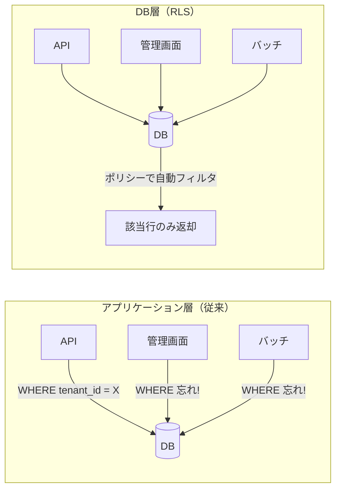

# RLS（Row-Level Security）

> **一言で言うと:** テーブルの行単位でアクセス制御をDB層で強制する仕組み。アプリケーションコードの `WHERE` 句に頼らず、ポリシーの漏れによるデータ漏洩を構造的に防ぐ。

## なぜ必要か

マルチテナントSaaSを例に考える。テナントAのユーザーがテナントBのデータを見られてはいけない。最も素朴な実装は、全クエリに `WHERE tenant_id = :current_tenant` を付けることだが:

- **漏れのリスク**: クエリが数百箇所に散らばる大規模アプリケーションで、1箇所でも `WHERE` を付け忘れると全テナントのデータが見える
- **ORM経由の見落とし**: ORMが生成するクエリに条件が入っているか確認しづらい
- **管理画面・バッチ処理の穴**: Webアプリ本体では対策しても、管理画面やバッチジョブ経由でフィルタなしのクエリが実行される

RLS はこれらの問題を **DB層で根本的に解決** する。ポリシーをテーブルに設定すれば、どのクライアントからアクセスしても行フィルタが自動適用される。



## 仕組み — PostgreSQL の RLS

RLS は PostgreSQL 9.5 で導入された機能である（MySQL には2026年時点で同等の組み込み機能はない）。

### 基本構文

```sql
-- 1. テーブルで RLS を有効化
ALTER TABLE orders ENABLE ROW LEVEL SECURITY;

-- 2. ポリシーを作成（誰が、どの操作で、どの行にアクセスできるか）
CREATE POLICY tenant_isolation ON orders
    FOR ALL                              -- SELECT, INSERT, UPDATE, DELETE 全て
    TO app_user                          -- このロールに適用
    USING (tenant_id = current_setting('app.current_tenant')::int)  -- 既存行の読み取り/更新/削除
    WITH CHECK (tenant_id = current_setting('app.current_tenant')::int);  -- 新規行の挿入/更新
```

### USING と WITH CHECK の違い

| 句 | 適用される操作 | 役割 |
|---|---|---|
| `USING` | SELECT, UPDATE（既存行）, DELETE | 「どの行が見えるか」を制御 |
| `WITH CHECK` | INSERT, UPDATE（新しい値） | 「どの行を書き込めるか」を制御 |

`WITH CHECK` を省略すると `USING` の条件がそのまま使われる。

### セッション変数によるテナント切り替え

```sql
-- アプリケーションがDB接続時にテナントIDをセット
SET app.current_tenant = '42';

-- 以降の全クエリに RLS ポリシーが自動適用される
SELECT * FROM orders;  -- tenant_id = 42 の行だけ返る
```

## マルチテナント実装例

### スキーマ設計

```sql
CREATE TABLE tenants (
    id BIGINT GENERATED ALWAYS AS IDENTITY PRIMARY KEY,
    name VARCHAR(100) NOT NULL,
    created_at TIMESTAMPTZ NOT NULL DEFAULT NOW()
);

CREATE TABLE orders (
    id BIGINT GENERATED ALWAYS AS IDENTITY PRIMARY KEY,
    tenant_id BIGINT NOT NULL REFERENCES tenants(id),
    product_name VARCHAR(200) NOT NULL,
    amount DECIMAL(10,2) NOT NULL,
    created_at TIMESTAMPTZ NOT NULL DEFAULT NOW()
);

-- RLS 有効化
ALTER TABLE orders ENABLE ROW LEVEL SECURITY;

-- テーブルオーナーにも RLS を適用する（デフォルトではオーナーはバイパスする）
ALTER TABLE orders FORCE ROW LEVEL SECURITY;

-- テナント分離ポリシー
CREATE POLICY tenant_isolation ON orders
    FOR ALL
    TO app_user
    USING (tenant_id = current_setting('app.current_tenant')::bigint)
    WITH CHECK (tenant_id = current_setting('app.current_tenant')::bigint);

-- アプリケーション用ロール
CREATE ROLE app_user LOGIN PASSWORD 'secure_password';
GRANT SELECT, INSERT, UPDATE, DELETE ON orders TO app_user;
```

### TypeScript での利用（Node.js + pg）

```typescript
import { Pool } from "pg";

const pool = new Pool({
  user: "app_user",
  database: "myapp",
});

async function getOrders(tenantId: number): Promise<Order[]> {
  const client = await pool.connect();
  try {
    // コネクション取得後にテナントIDをセット
    await client.query("SET app.current_tenant = $1", [tenantId.toString()]);

    // WHERE tenant_id = ... は不要 — RLS が自動適用
    const result = await client.query(
      "SELECT id, product_name, amount FROM orders ORDER BY created_at DESC"
    );
    return result.rows;
  } finally {
    // セッション変数をリセットしてからプールに返す
    await client.query("RESET app.current_tenant");
    client.release();
  }
}
```

### Go での利用（pgx）

```go
package main

import (
	"context"
	"fmt"
	"log"

	"github.com/jackc/pgx/v5/pgxpool"
)

func getOrders(ctx context.Context, pool *pgxpool.Pool, tenantID int64) ([]Order, error) {
	conn, err := pool.Acquire(ctx)
	if err != nil {
		return nil, fmt.Errorf("acquire connection: %w", err)
	}
	defer conn.Release()

	// テナントIDをセッション変数にセット
	_, err = conn.Exec(ctx, "SET app.current_tenant = $1", fmt.Sprintf("%d", tenantID))
	if err != nil {
		return nil, fmt.Errorf("set tenant: %w", err)
	}
	defer conn.Exec(ctx, "RESET app.current_tenant")

	// RLS により自動フィルタされる
	rows, err := conn.Query(ctx, "SELECT id, product_name, amount FROM orders ORDER BY created_at DESC")
	if err != nil {
		return nil, fmt.Errorf("query orders: %w", err)
	}
	defer rows.Close()

	var orders []Order
	for rows.Next() {
		var o Order
		if err := rows.Scan(&o.ID, &o.ProductName, &o.Amount); err != nil {
			return nil, fmt.Errorf("scan: %w", err)
		}
		orders = append(orders, o)
	}
	return orders, rows.Err()
}
```

## Supabase での活用

Supabase は PostgreSQL の RLS を認証・認可の中核として利用している。[[SupabaseのJWT-RLS連携]]で詳しく解説するが、JWT 内のクレームをポリシーで参照することで、バックエンドサーバーなしでもセキュアなデータアクセスが可能になる。

```sql
-- Supabase での典型的な RLS ポリシー
-- auth.uid() は JWT から抽出されたユーザーIDを返す組み込み関数

-- ユーザーは自分のプロフィールだけ読める
CREATE POLICY "Users can read own profile" ON profiles
    FOR SELECT
    USING (auth.uid() = user_id);

-- ユーザーは自分のプロフィールだけ更新できる
CREATE POLICY "Users can update own profile" ON profiles
    FOR UPDATE
    USING (auth.uid() = user_id)
    WITH CHECK (auth.uid() = user_id);

-- 公開投稿は誰でも読める
CREATE POLICY "Anyone can read published posts" ON posts
    FOR SELECT
    USING (published = true);

-- 投稿は作成者だけ編集できる
CREATE POLICY "Authors can edit own posts" ON posts
    FOR UPDATE
    USING (auth.uid() = author_id);
```

## よくある落とし穴

### 1. テーブルオーナーは RLS をバイパスする

RLS はデフォルトでテーブルオーナー（通常は `CREATE TABLE` を実行したロール）には適用されない。アプリケーションがオーナーロールで接続していると RLS が効かない。

```sql
-- 対策: FORCE を指定するとオーナーにも適用される
ALTER TABLE orders FORCE ROW LEVEL SECURITY;
```

あるいは、テーブルオーナーとアプリケーションユーザーを別のロールにする（推奨）。

### 2. ポリシー未設定 + RLS有効 = 全行拒否

RLS を有効化したがポリシーを1つも作成しなかった場合、**全ての行が見えなくなる**（デフォルト拒否）。これは安全側に倒れる設計だが、意図せずデータが消えたように見えてパニックの原因になる。

### 3. `current_setting` のリセット忘れ

コネクションプールを使っている場合、前のリクエストでセットした `app.current_tenant` が次のリクエストに引き継がれる可能性がある。コネクションを返却する前に必ず `RESET` する。

```sql
-- コネクション返却前に必ず実行
RESET app.current_tenant;
-- または
SET app.current_tenant = '';
```

### 4. RLS とインデックスの関係

RLS のポリシー条件は内部的に `WHERE` 句として追加される。`tenant_id` で頻繁にフィルタされるなら、[[Resources/Study/Layer3-データ永続化/インデックス|インデックス]]が必要:

```sql
CREATE INDEX idx_orders_tenant_id ON orders(tenant_id);
```

### 5. EXPLAIN で RLS の影響を確認できない場合がある

テーブルオーナーで `EXPLAIN` を実行するとポリシーが適用されないため、実際のクエリプランと異なる結果になる。アプリケーションロールで `EXPLAIN` を実行すること。

## RLS の限界と代替アプローチ

| 方式 | 特徴 | 適するケース |
|---|---|---|
| **RLS（行レベルセキュリティ）** | DB層で強制、アプリ側の実装ミスを防げる | 同一スキーマのマルチテナント |
| **スキーマ分離** | テナントごとに PostgreSQL スキーマを分ける | テナント数が少なく、カスタマイズ要件がある |
| **データベース分離** | テナントごとに DB インスタンスを分ける | 規制要件でデータの物理的分離が必要 |
| **アプリケーション層 WHERE** | 全クエリにフィルタを追加 | レガシーシステム、MySQL 環境 |

RLS は「共有DB・共有スキーマ」モデルに最適であり、コスト効率と安全性のバランスが良い。ただし PostgreSQL 固有の機能であるため、DB移植性が求められる場合は注意が必要。

なお、RLS ポリシーは全クエリに暗黙の WHERE 句として追加されるため、サブクエリや関数呼び出しを含む複雑なポリシーではパフォーマンスに影響する。ポリシーの条件はできるだけ単純に保ち、参照するカラムには[[Resources/Study/Layer3-データ永続化/インデックス|インデックス]]を設定すること。

## 関連トピック

- [[RDB]] — RLS が適用されるリレーショナルデータベースの基礎
- [[トランザクション]] — RLS はトランザクション内でも一貫して適用される

## 参考リソース

- [PostgreSQL公式: Row Security Policies](https://www.postgresql.org/docs/current/ddl-rowsecurity.html) — 最も正確なリファレンス
- [Supabase公式: Row Level Security](https://supabase.com/docs/guides/database/postgres/row-level-security) — BaaS文脈での実践的な解説
- **書籍**: 『SQLアンチパターン』（Bill Karwin著）— マルチテナント設計のパターンと落とし穴
