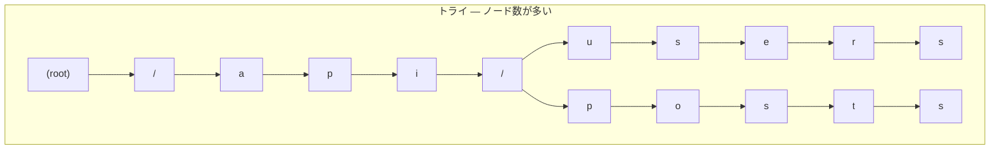
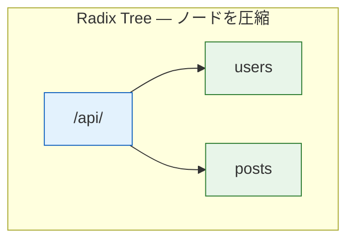
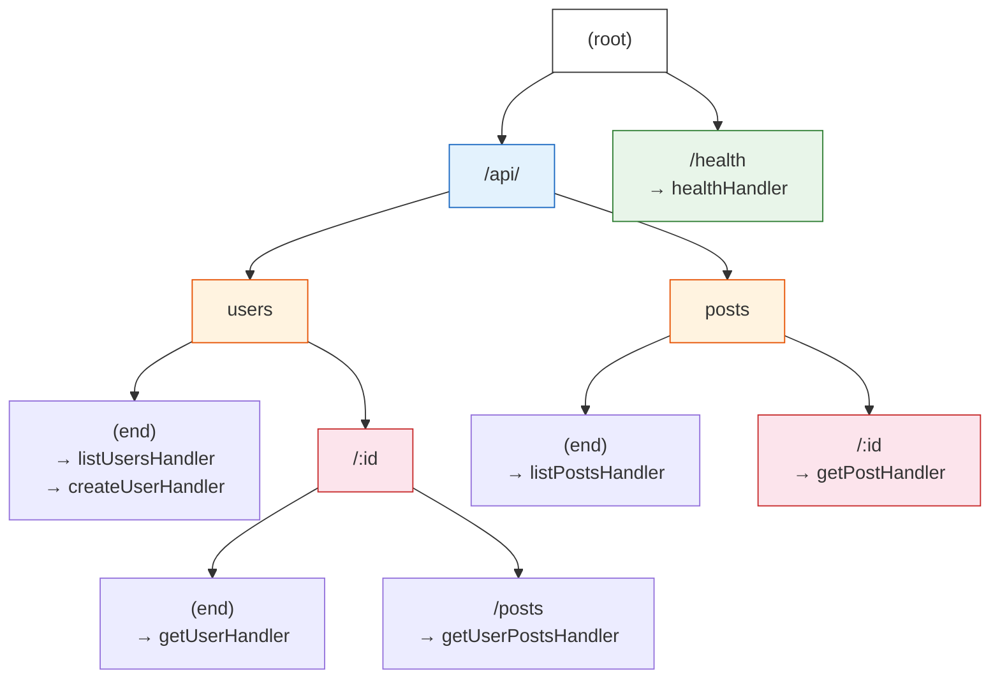
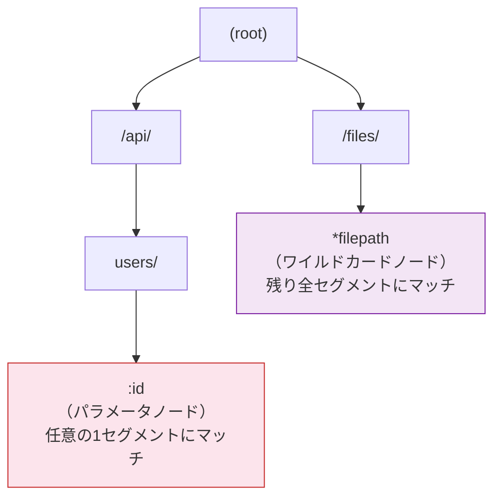

# Radix Treeとルーター（Radix Tree / Compact Trie）

> **一言で言うと:** Radix Tree（基数木）はトライ（Trie）の圧縮版で、共通プレフィックスを1つのノードにまとめることでメモリ効率と探索速度を両立するデータ構造。Go の高性能HTTPルーター（Chi, Gin, Fiber, Echo）はすべてRadix Treeを使ってURLパスをマッチングしている。

## トライ（Trie）からRadix Treeへ

### トライの問題点

トライ（Trie / Prefix Tree）は文字列の検索に特化した木構造で、各ノードが1文字を表す。URLパスのマッチングに使えるが、共通プレフィックスの長い部分で**1文字ごとにノードを作る**ため、無駄が大きい。



### Radix Tree — 共通プレフィックスの圧縮

Radix Tree（Patricia Trie とも呼ばれる）は、**分岐のないノード列を1つのノードに圧縮**する。



15ノードが3ノードに圧縮された。実際のHTTPルーターでは数百のルートを登録しても、共通プレフィックス（`/api/v1/`等）が圧縮されるため、木の深さが浅く保たれる。

## HTTPルーターでの活用

### ルート登録とツリー構築

以下のルートを登録した場合のRadix Treeの構造を見てみる:

```
GET  /api/users
GET  /api/users/:id
POST /api/users
GET  /api/users/:id/posts
GET  /api/posts
GET  /api/posts/:id
GET  /health
```



### ルート検索の流れ

`GET /api/users/42/posts` を検索する場合:


4ノードの走査でハンドラに到達する。ルート数に関わらず、パスの深さ（セグメント数）に比例する計算量で済む。

## 線形探索との性能比較

| 観点 | 線形探索（Express） | Radix Tree（Chi, Gin） |
|------|-------------------|----------------------|
| 検索の計算量 | O(n) — 登録ルート数に比例 | O(k) — URLのセグメント数に比例 |
| 100ルート、パス深さ3 | 最悪100回の比較 | 最悪3〜4ノードの走査 |
| 1000ルート、パス深さ3 | 最悪1000回の比較 | **変わらず** 3〜4ノードの走査 |
| パラメータ抽出 | 正規表現マッチング | ツリー走査中に直接抽出 |
| メモリ使用量 | ルートごとにパターンを保持 | 共通プレフィックスを共有 |

**Expressが線形探索でも問題にならない理由:** 一般的なWebアプリケーションのルート数は数十〜数百程度であり、この規模ではRadix Treeと線形探索の差は数マイクロ秒にすぎない。ルーティングのオーバーヘッドがボトルネックになることは稀。Radix Treeが真に効果を発揮するのは、APIゲートウェイのように数千〜数万のルートを持つシステムや、1秒間に数十万リクエストを処理する高スループット環境。

## パラメータとワイルドカードの実装

Radix Treeベースのルーターは、パスパラメータ（`:id`）やワイルドカード（`*`）を特別なノードとして扱う。



| ノード種別 | パターン例 | マッチ例 | 優先度 |
|-----------|----------|---------|--------|
| 静的（Static） | `/users/new` | `/users/new` のみ | **最高** |
| パラメータ（Param） | `/users/:id` | `/users/42`, `/users/abc` | 中 |
| ワイルドカード（Catch-all） | `/files/*filepath` | `/files/a/b/c.txt` | **最低** |

**優先度の原則:** 静的ノード > パラメータノード > ワイルドカードノード。これにより、`/users/new` と `/users/:id` が共存しても、`/users/new` へのリクエストは常に静的マッチが優先される。Expressの「定義順依存」の問題がRadix Treeでは構造的に解消される。

## コード例

### Go — Radix Treeの簡易実装（ルーターの原理）

```go
package main

import (
	"fmt"
	"strings"
)

type nodeType int

const (
	static   nodeType = iota // "/users"
	param                    // ":id"
	catchAll                 // "*filepath"
)

type node struct {
	path     string
	ntype    nodeType
	children []*node
	handler  string // 簡略化: ハンドラ名を文字列で持つ
}

// ルートを追加する（簡略版）
func (n *node) addRoute(path, handler string) {
	segments := strings.Split(strings.Trim(path, "/"), "/")
	current := n

	for _, seg := range segments {
		var child *node
		for _, c := range current.children {
			if c.path == seg {
				child = c
				break
			}
		}
		if child == nil {
			nt := static
			if strings.HasPrefix(seg, ":") {
				nt = param
			} else if strings.HasPrefix(seg, "*") {
				nt = catchAll
			}
			child = &node{path: seg, ntype: nt}
			current.children = append(current.children, child)
		}
		current = child
	}
	current.handler = handler
}

// パスを検索してハンドラとパラメータを返す
func (n *node) search(path string) (string, map[string]string) {
	segments := strings.Split(strings.Trim(path, "/"), "/")
	params := make(map[string]string)
	current := n

	for _, seg := range segments {
		var matched *node

		// 優先度: static > param > catchAll
		for _, c := range current.children {
			if c.ntype == static && c.path == seg {
				matched = c
				break
			}
		}
		if matched == nil {
			for _, c := range current.children {
				if c.ntype == param {
					params[c.path[1:]] = seg // ":id" → "id"
					matched = c
					break
				}
			}
		}
		if matched == nil {
			return "", nil
		}
		current = matched
	}
	return current.handler, params
}

func main() {
	root := &node{path: "/"}

	root.addRoute("/api/users", "listUsers")
	root.addRoute("/api/users/new", "newUserForm")
	root.addRoute("/api/users/:id", "getUser")
	root.addRoute("/api/posts/:id", "getPost")

	tests := []string{
		"/api/users",
		"/api/users/new",  // staticが優先される
		"/api/users/42",   // paramにマッチ
		"/api/posts/7",
		"/api/unknown",    // マッチしない
	}

	for _, path := range tests {
		handler, params := root.search(path)
		if handler != "" {
			fmt.Printf("%-25s → %s %v\n", path, handler, params)
		} else {
			fmt.Printf("%-25s → 404\n", path)
		}
	}
	// /api/users                → listUsers map[]
	// /api/users/new            → newUserForm map[]
	// /api/users/42             → getUser map[id:42]
	// /api/posts/7              → getPost map[id:7]
	// /api/unknown              → 404
}
```

### TypeScript — Radix Treeベースのルート検索

```typescript
type NodeType = 'static' | 'param' | 'catchAll';

interface RouteNode {
  path: string;
  type: NodeType;
  children: RouteNode[];
  handler?: string;
}

function createNode(path: string, handler?: string): RouteNode {
  let type: NodeType = 'static';
  if (path.startsWith(':')) type = 'param';
  else if (path.startsWith('*')) type = 'catchAll';
  return { path, type, children: [], handler };
}

function addRoute(root: RouteNode, path: string, handler: string): void {
  const segments = path.split('/').filter(Boolean);
  let current = root;

  for (const seg of segments) {
    let child = current.children.find(c => c.path === seg);
    if (!child) {
      child = createNode(seg);
      current.children.push(child);
    }
    current = child;
  }
  current.handler = handler;
}

function search(root: RouteNode, path: string): { handler: string; params: Record<string, string> } | null {
  const segments = path.split('/').filter(Boolean);
  const params: Record<string, string> = {};
  let current = root;

  for (const seg of segments) {
    // 優先度順に探索: static → param → catchAll
    const staticMatch = current.children.find(c => c.type === 'static' && c.path === seg);
    if (staticMatch) {
      current = staticMatch;
      continue;
    }

    const paramMatch = current.children.find(c => c.type === 'param');
    if (paramMatch) {
      params[paramMatch.path.slice(1)] = seg;
      current = paramMatch;
      continue;
    }

    return null; // マッチしない
  }

  return current.handler ? { handler: current.handler, params } : null;
}

// 使用例
const root = createNode('');
addRoute(root, '/api/users', 'listUsers');
addRoute(root, '/api/users/new', 'newUserForm');
addRoute(root, '/api/users/:id', 'getUser');

console.log(search(root, '/api/users'));       // { handler: 'listUsers', params: {} }
console.log(search(root, '/api/users/new'));    // { handler: 'newUserForm', params: {} }
console.log(search(root, '/api/users/42'));     // { handler: 'getUser', params: { id: '42' } }
console.log(search(root, '/api/unknown'));      // null
```

## よくある落とし穴

### 1. パラメータルートと静的ルートの衝突に気づかない

`/users/new`（静的）と `/users/:id`（パラメータ）を両方登録すると、一部のルーターはエラーを出す（Gin）か、優先度ルールで解決する（Chi）。フレームワークごとの衝突解決ルールを把握していないと、意図しないハンドラに到達する。

### 2. 末尾スラッシュの扱い

`/api/users` と `/api/users/` を別のルートとして扱うかどうかはルーターの実装依存。多くの高性能ルーターは自動リダイレクトオプションを提供しているが、デフォルトの挙動を確認しないと404が発生する。

```go
// Chi: 末尾スラッシュの自動リダイレクト
r.Use(middleware.RedirectSlashes)
```

### 3. Radix Treeの制約 — 正規表現パターンの限界

Radix Treeベースのルーターは、パスパラメータに正規表現制約を付けにくい。`/users/:id` で `:id` が数値のみであることを保証するには、ルーターの外（ミドルウェアやハンドラ）で[[バリデーション]]する必要がある。

```go
// ❌ Radix Treeルーターでは一般に正規表現制約を書けない
r.Get("/users/{id:[0-9]+}", handler) // Chiはこの記法をサポート（例外的）

// ✅ バリデーションミドルウェアで対応
r.With(validateNumericID).Get("/users/{id}", handler)
```

### 4. ルーター性能がボトルネックだと思い込む

前述の通り、ルーティングの処理時間は通常マイクロ秒単位。DB クエリ（ミリ秒）や外部API呼び出し（数十〜数百ミリ秒）と比べて無視できるほど小さい。ルーターの性能差を理由にフレームワークを選定するのは、ほとんどの場合で間違い。

## 関連トピック

- [[ルーティングとミドルウェア]] — 親トピック。ルーターの役割と設計パターン
- [[B-TreeとB+Tree]] — 同じ木構造でもB-Treeはディスク I/O 最適化、Radix Treeはメモリ上の文字列検索に特化。問題領域が異なる
- [[データ構造とアルゴリズム]] — トライ、木構造の基礎知識
- [[バリデーション]] — Radix Treeでは表現できないパラメータ制約をミドルウェアで補完する

## 参考リソース

- go-chi/chi ソースコード — `tree.go` にRadix Tree実装がある
- julienschmidt/httprouter — Go初期の高性能ルーター。Radix Tree実装の参考実装として有名
- 『Introduction to Algorithms』（CLRS）— Trie / Radix Tree の理論的背景
