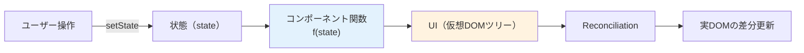
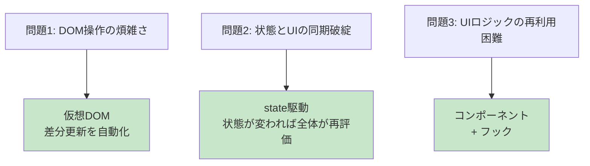
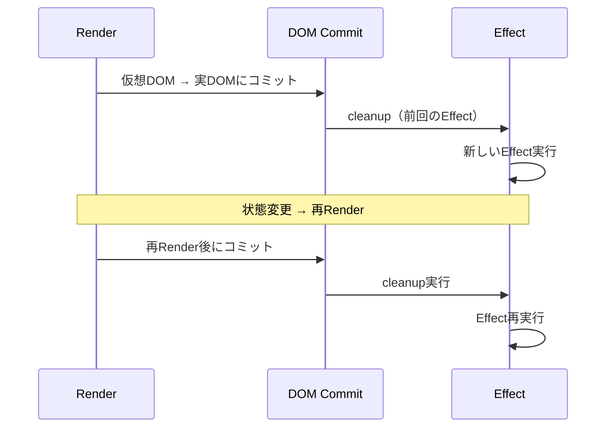
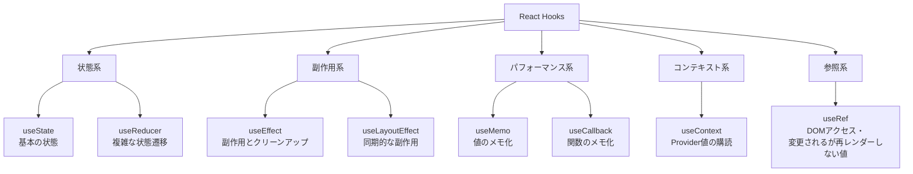
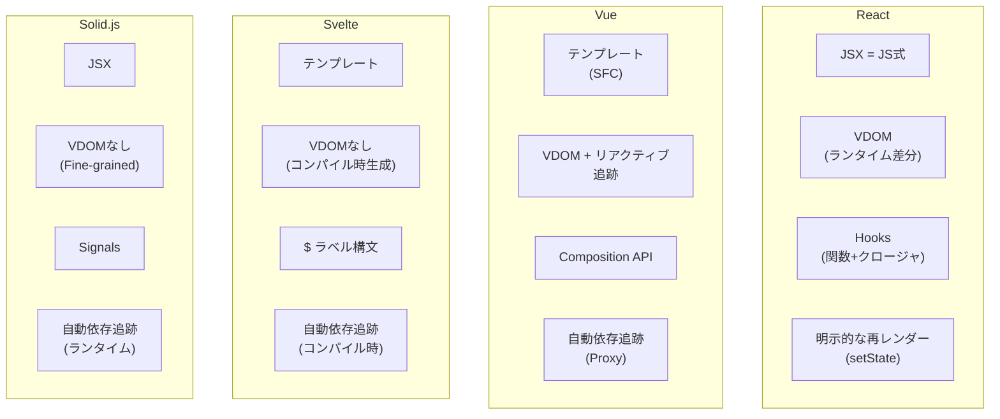

# Reactの設計思想とフック（React: Design Philosophy & Hooks）

> **一言で言うと:** Reactは「UIは状態の純粋関数である（`UI = f(state)`）」という設計思想を中心に、宣言的UIプログラミングと[[DOMツリーとノード|DOM]]の差分更新を組み合わせたライブラリ。`useState` などのフック（Hooks）は状態とライフサイクルをコンポーネント関数の外に持たせる仕組みで、命令的なクラスコンポーネントが抱えていた再利用性と複雑性の問題を解決した。一方で、**Closureの罠・依存配列の管理・無限ループする `useEffect`** など、フック特有の新しい問題群も生み出している。

## Reactの設計思想 — `UI = f(state)`

Reactを理解する鍵は、Facebookが2013年にOSS化した時に掲げた一行のスローガンにある:

> **UIは状態の純粋関数である**



この思想から、Reactの全機能が必然的に導かれる:

| 思想 | 帰結 |
|------|------|
| 状態が決まればUIが決まる | 同じstateなら同じUI（テスト容易・SSR可能） |
| 状態の変更だけがUIを変える | DOM操作の禁止 → 仮想DOMが自動同期 |
| データは上から下へ流れる | 単方向データフロー（[[FluxアーキテクチャとRedux|Flux]]の起源） |
| コンポーネントは関数 | コンポジション・再利用が自然 |

これは[[FluxアーキテクチャとRedux|Flux]]の双方向データフロー批判と同じ問題意識から生まれた。MVCの「ModelとViewの双方向結合」が大規模アプリで破綻する経験が、Reactの片方向設計を生んだ。

### Reactが解決した3つの根本問題



## JSXとコンポーネント — 構造と関数の融合

JSXはJavaScript内にHTMLライクな構文を埋め込む拡張で、ビルド時に `React.createElement()` 呼び出しに変換される:

```jsx
// JSX
const element = <h1 className="title">Hello, {name}</h1>;

// 変換後（実際にブラウザが実行するコード）
const element = React.createElement(
  'h1',
  { className: 'title' },
  'Hello, ',
  name
);

// React.createElement が返すのは「仮想DOMノード」を表すプレーンなJSオブジェクト
// {
//   type: 'h1',
//   props: { className: 'title', children: ['Hello, ', name] },
//   key: null,
//   ref: null
// }
```

**重要な認識:** JSXはテンプレート言語ではなく、**JavaScriptの式**である。条件分岐は三項演算子、ループは `map()`、変数はそのまま埋め込める。これがVue/Angularのテンプレートとの根本的な違い。

### コンポーネントは「propsを受け取り、JSXを返す関数」

```jsx
// コンポーネント = 関数
function Greeting({ name, age }) {
  return <p>{name}（{age}歳）さん、こんにちは</p>;
}

// 使用
<Greeting name="Ryo" age={30} />
// → React.createElement(Greeting, { name: 'Ryo', age: 30 })
```

このシンプルさが、Reactの全エコシステムの土台になっている。

## 状態管理 — useStateの本質

`useState` は最も基本的なフックで、**コンポーネント関数が再実行されても値が保持される状態**を持たせる仕組み（実体はReactのFiber Nodeに紐づいて管理される）。

```jsx
function Counter() {
  const [count, setCount] = useState(0);
  // [現在の値, 更新関数] のタプルが返る

  return (
    <button onClick={() => setCount(count + 1)}>
      {count}
    </button>
  );
}
```

### useStateが解決した問題 — クラスコンポーネントの複雑性

React 16.8（2019年）で登場するまで、状態を持つコンポーネントはクラスで書く必要があった:

```jsx
// 旧: クラスコンポーネント — `this` の扱いが煩雑
class Counter extends React.Component {
  constructor(props) {
    super(props);
    this.state = { count: 0 };
    this.increment = this.increment.bind(this); // bindを忘れるとthisが失われる
  }

  increment() {
    this.setState({ count: this.state.count + 1 });
  }

  render() {
    return <button onClick={this.increment}>{this.state.count}</button>;
  }
}
```

クラスコンポーネントの3大問題:

| 問題 | 詳細 |
|------|------|
| **`this` の混乱** | bindを忘れる、アロー関数で書き直す、constructorに書く ── 3通りのやり方が混在 |
| **ロジックの再利用が困難** | HOC（Higher-Order Component）やRender Propsが必要、ラッパー地獄 |
| **ライフサイクルの分散** | 関連するロジックが `componentDidMount` / `componentDidUpdate` / `componentWillUnmount` に分散 |

フックはこれら全てを「関数とクロージャ」で解決した。

### useStateの内部動作 — フックの順序依存

`useState` がなぜ「コンポーネント関数のトップレベルでしか呼んではいけない」かを理解するには、内部実装の本質を知る必要がある:

```jsx
// Reactの内部実装の概念モデル（実際はFiber Nodeに紐づく）
let hooks = [];
let currentIndex = 0;

function useState(initial) {
  const index = currentIndex;
  // 説明用の簡略化: 実際のReactは「初回マウントか否か」のフラグで判定する
  // （?? を使うと state が正当に null/undefined の場合に毎回初期値に戻ってしまう）
  if (!(index in hooks)) hooks[index] = initial;

  const setState = (newValue) => {
    hooks[index] = newValue;
    rerender(); // コンポーネントを再実行
  };

  currentIndex++;
  return [hooks[index], setState];
}

function MyComponent() {
  currentIndex = 0; // 各レンダーで0にリセット
  const [a, setA] = useState(0); // hooks[0]
  const [b, setB] = useState(''); // hooks[1]
  const [c, setC] = useState([]); // hooks[2]
  // ...
}
```

**フックは呼び出し順序で識別される。** 条件分岐の中で呼ぶと、再レンダー時に順序がずれて状態が壊れる。これがReactの「Rules of Hooks」の根本理由。

```jsx
// ❌ 条件付きフック — 状態が壊れる
function Bad({ show }) {
  if (show) {
    const [name, setName] = useState(''); // 1回目はhooks[0]、次は呼ばれない
  }
  const [count, setCount] = useState(0); // 1回目はhooks[1]、次はhooks[0]に!
}

// ✅ 必ずトップレベルで
function Good({ show }) {
  const [name, setName] = useState('');
  const [count, setCount] = useState(0);
  // 表示の条件分岐はreturn内で
  return show ? <Input value={name} /> : <Counter value={count} />;
}
```

## useEffect — 副作用の管理（と新たな問題の温床）

`useEffect` はDOM操作・API通信・購読など「Reactの管理外への作用」を扱うフック。

```jsx
function UserProfile({ userId }) {
  const [user, setUser] = useState(null);

  useEffect(() => {
    fetch(`/api/users/${userId}`)
      .then(r => r.json())
      .then(setUser);
  }, [userId]); // userIdが変わるたびに再実行

  return user ? <p>{user.name}</p> : <p>Loading...</p>;
}
```

### useEffectのライフサイクル



### useEffectが解決した問題

クラスコンポーネントでは、関連するロジックが3つのライフサイクルメソッドに分散していた:

```jsx
// ❌ クラス: 1つの「購読」ロジックが3箇所に分散
class ChatRoom extends React.Component {
  componentDidMount() {
    chatAPI.subscribe(this.props.roomId, this.handleMessage);
  }

  componentDidUpdate(prevProps) {
    if (prevProps.roomId !== this.props.roomId) {
      chatAPI.unsubscribe(prevProps.roomId, this.handleMessage);
      chatAPI.subscribe(this.props.roomId, this.handleMessage);
    }
  }

  componentWillUnmount() {
    chatAPI.unsubscribe(this.props.roomId, this.handleMessage);
  }
}

// ✅ Hooks: 関連ロジックが1箇所にまとまる
function ChatRoom({ roomId }) {
  useEffect(() => {
    chatAPI.subscribe(roomId, handleMessage);
    return () => chatAPI.unsubscribe(roomId, handleMessage); // cleanup
  }, [roomId]);
}
```

### useEffectが生んだ新しい問題

useEffectは強力だが、**Reactで最も誤用されるフック**でもある。

#### 問題1: 「派生状態」を `useEffect` で計算する

```jsx
// ❌ アンチパターン: stateの派生をuseEffectで
function Cart({ items }) {
  const [total, setTotal] = useState(0);
  useEffect(() => {
    setTotal(items.reduce((sum, i) => sum + i.price, 0));
  }, [items]);
  // 1回余計にレンダーが走る + cascade効果
  return <p>合計: {total}</p>;
}

// ✅ 派生値はレンダー中に計算
function Cart({ items }) {
  const total = items.reduce((sum, i) => sum + i.price, 0);
  return <p>合計: {total}</p>;
}
```

React公式は「**propsやstateから計算できる値はstateにしない**」を強く推奨している（[You Might Not Need an Effect](https://react.dev/learn/you-might-not-need-an-effect)）。

#### 問題2: 依存配列の罠（Stale Closure）

```jsx
// ❌ countをcaptureしてしまうクロージャ
function Timer() {
  const [count, setCount] = useState(0);

  useEffect(() => {
    const id = setInterval(() => {
      setCount(count + 1); // ← クロージャ内の `count` は初回レンダーの 0 のまま固定
    }, 1000);
    return () => clearInterval(id);
  }, []); // 依存配列が空 → effectは1回しか走らない
  // → 毎秒 setCount(0 + 1) が実行され続け、表示は 0 → 1 で止まる
  //   （「永遠に0」ではなく「永遠に1で固定」になる）

  return <p>{count}</p>;
}

// ✅ 関数型更新で最新の値を参照
useEffect(() => {
  const id = setInterval(() => {
    setCount(c => c + 1); // 最新のcountを引数で受け取る
  }, 1000);
  return () => clearInterval(id);
}, []);
```

これが「**Stale Closure**（古いクロージャ）」と呼ばれる、フック特有の悪名高いバグ。詳細は[[JSのクロージャとReactのStale Closure問題]]を参照。

**公式解決策: `useEffectEvent`（React 19.2、2025年10月Stable）** — Effect から呼び出す関数を「常に最新のpropsとstateを参照するイベントハンドラ」として宣言できる。Effect自体は再実行せず、内部から呼ぶイベントだけが最新値を見るため、依存配列の罠と再subscribe問題を同時に解決する:

```jsx
import { useEffectEvent } from 'react';

function ChatRoom({ roomId, theme }) {
  // theme が変わってもEffectは再実行されない
  // しかし onConnected 内では常に最新の theme を参照できる
  const onConnected = useEffectEvent(() => {
    showToast(`Connected to ${roomId} (theme: ${theme})`);
  });

  useEffect(() => {
    const conn = createConnection(roomId);
    conn.on('connected', onConnected); // 最新クロージャを呼ぶ
    conn.connect();
    return () => conn.disconnect();
  }, [roomId]); // theme は依存に入れなくていい
}
```

#### 問題3: 無限ループ

```jsx
// ❌ オブジェクトを依存配列に入れる
function UserList({ filter }) {
  const [users, setUsers] = useState([]);

  useEffect(() => {
    fetchUsers({ ...filter }).then(setUsers);
    // setUsers → 再レンダー → 親の filter オブジェクトが新しい参照に
    // → useEffect が再実行 → 無限ループ
  }, [filter]);
}
```

オブジェクト・配列・関数は毎レンダーで新しい参照になるため、依存配列に入れるとほぼ確実に無限ループを引き起こす。`useMemo` / `useCallback` で参照を安定させるか、プリミティブ値だけを依存に入れる必要がある。

## 主要フックの全体像



### 各フックの使い分け

| フック | 用途 | 注意点 |
|--------|------|--------|
| `useState` | 単純な状態 | オブジェクトのネストが深いと更新が複雑になる |
| `useReducer` | 複雑な状態遷移 | アクションタイプで状態変更を集約 |
| `useEffect` | 外部システムとの同期 | 派生値の計算に使ってはいけない |
| `useLayoutEffect` | DOM測定→同期的な再レンダー | パフォーマンスを損ねるので最終手段 |
| `useMemo` | 重い計算結果のキャッシュ | メモ化自体にコストあり、計測してから使う |
| `useCallback` | 子に渡す関数の参照を固定 | `React.memo` の子と組み合わせる場合のみ意味あり |
| `useContext` | propsバケツリレーの回避 | 値変更時に全Consumer再レンダー |
| `useRef` | DOM参照・mutableな値 | 変更しても再レンダーされない |

### useReducer — 状態遷移の集約

複雑な状態は `useReducer` で扱う。これは [[FluxアーキテクチャとRedux|Redux]] のミニ版:

```jsx
function reducer(state, action) {
  switch (action.type) {
    case 'add': return [...state, { id: Date.now(), text: action.text, done: false }];
    case 'toggle': return state.map(t => t.id === action.id ? { ...t, done: !t.done } : t);
    case 'delete': return state.filter(t => t.id !== action.id);
    default: throw new Error(`Unknown action: ${action.type}`);
  }
}

function TodoApp() {
  const [todos, dispatch] = useReducer(reducer, []);

  return (
    <>
      <button onClick={() => dispatch({ type: 'add', text: 'Buy milk' })}>追加</button>
      {todos.map(t => (
        <button key={t.id} onClick={() => dispatch({ type: 'toggle', id: t.id })}>
          {t.text}
        </button>
      ))}
    </>
  );
}
```

`useState` と `useReducer` の使い分けは「**状態の更新ロジックがコンポーネント外でテストしたいほど複雑か**」が判断基準。

### useMemo / useCallback — メモ化の本質

```jsx
function ExpensiveList({ items, query }) {
  // ❌ 毎レンダーで再計算
  const filtered = items.filter(item => item.name.includes(query));

  // ✅ items / query が変わらなければ前回結果を返す
  const filtered = useMemo(
    () => items.filter(item => item.name.includes(query)),
    [items, query]
  );

  return <List items={filtered} />;
}

// useCallback は useMemo の関数版
const handleClick = useCallback(() => {
  console.log(id);
}, [id]);
// = useMemo(() => () => console.log(id), [id])
```

**重要:** メモ化は**マイクロ最適化**。雑に全部に適用するとpropsの比較コストでかえって遅くなる。

### useContext — Propsバケツリレーの解決

```jsx
const ThemeContext = React.createContext('light');

function App() {
  return (
    <ThemeContext.Provider value="dark">
      <Toolbar /> {/* propsを渡さなくても孫まで届く */}
    </ThemeContext.Provider>
  );
}

function Toolbar() {
  return <Button />;
}

function Button() {
  const theme = useContext(ThemeContext); // 'dark'
  return <button className={theme}>Click</button>;
}
```

**注意:** Contextの値が変わると、それを購読している全コンポーネントが再レンダーする。グローバル状態管理ライブラリ（[[FluxアーキテクチャとRedux|Redux]] / Zustand）は、**選択的購読（selector）** によってこの問題を回避する。

## カスタムフック — フックの最大の発明

カスタムフックはフックの組み合わせを再利用可能にする「ただの関数」。HOCやRender Propsより遥かに直感的。

```jsx
// useFetch — 任意のAPIを取得するカスタムフック
function useFetch(url) {
  const [data, setData] = useState(null);
  const [error, setError] = useState(null);
  const [loading, setLoading] = useState(true);

  useEffect(() => {
    let cancelled = false;
    setLoading(true);
    fetch(url)
      .then(r => r.json())
      .then(d => { if (!cancelled) { setData(d); setLoading(false); } })
      .catch(e => { if (!cancelled) { setError(e); setLoading(false); } });
    return () => { cancelled = true; }; // race condition対策
  }, [url]);

  return { data, error, loading };
}

// 使用 — どのコンポーネントでも同じインターフェースで使える
function UserProfile({ id }) {
  const { data, error, loading } = useFetch(`/api/users/${id}`);
  if (loading) return <p>Loading...</p>;
  if (error) return <p>Error: {error.message}</p>;
  return <p>{data.name}</p>;
}
```

カスタムフックの規則:
- 名前は `use` で始める（Lintルールがフックを識別するため）
- 内部で他のフックを呼べる
- 値・関数・オブジェクトを自由に返せる

これがReactの**ロジック再利用の正解**。ライブラリ（TanStack Query / SWR / React Hook Form 等）はカスタムフックの形で提供される。

## Reactが生んだ新しい問題群

仮想DOMとフックは強力だが、トレードオフも持ち込んだ。**「Reactを使いこなす」とは、これらの問題を意識して回避できることを意味する。**

### 問題1: 不要な再レンダリングと連鎖

```jsx
// 親が再レンダーすると、メモ化されていない子も全て再レンダー
function App() {
  const [count, setCount] = useState(0);
  return (
    <div>
      <button onClick={() => setCount(count + 1)}>{count}</button>
      <ExpensiveTree /> {/* countが変わるたびに再レンダー */}
    </div>
  );
}
```

これに対する手段:
- `React.memo` で子をメモ化
- 状態を必要な範囲に閉じ込める（state colocation）
- Contextの分割（高頻度更新と低頻度更新を分ける）

### 問題2: メモ化地獄

`React.memo` を使うには子に渡すpropsの参照が安定している必要がある:

```jsx
// ❌ メモ化が無効化される
function Parent() {
  const [count, setCount] = useState(0);

  // 毎レンダーで新しい関数 → ChildのReact.memoが意味を成さない
  const handleClick = () => doSomething();

  // 毎レンダーで新しいオブジェクト
  const config = { theme: 'dark', size: 'lg' };

  return <Child onClick={handleClick} config={config} />;
}

// ✅ useCallback / useMemo で参照を固定
const handleClick = useCallback(() => doSomething(), []);
const config = useMemo(() => ({ theme: 'dark', size: 'lg' }), []);
```

結果として、コンポーネントが `useCallback` / `useMemo` だらけになり、**「メモ化のためのコード」がビジネスロジックを上回る**現象が起きる。

**この問題は React Compiler 1.0（2025年10月7日Stable、旧React Forget）が解決した。** ビルド時にコンポーネントとフックを解析し、自動メモ化を行う。Meta Quest Storeでは初期ロード/ナビゲーションが最大12%、特定インタラクションは2.5倍以上高速化された。React 17以降と互換、Next.js 16・Expo SDK 54・Vite で標準/オプションサポート。手書きの `useMemo` / `useCallback` は今後不要になる方向。

### 問題3: useEffectのcleanup忘れ

非同期処理・購読・タイマーは必ずcleanupが必要:

```jsx
useEffect(() => {
  const id = setInterval(tick, 1000);
  return () => clearInterval(id); // ← 忘れるとメモリリーク

  const ws = new WebSocket(url);
  ws.onmessage = handle;
  return () => ws.close(); // ← 忘れると接続が増殖

  fetch(url).then(setData);
  // ← Race conditionの可能性: cleanupでキャンセル必要
}, [url]);
```

特に **fetch のRace condition** は厄介で、コンポーネントがアンマウントされた後に `setState` を呼んで警告が出る。AbortController または `cancelled` フラグで対処する。

### 問題4: Strict ModeでEffectが2回走る

React 18のStrict Modeは開発時にEffectを意図的に2回実行する（マウント→アンマウント→再マウント）。これは「Effectのcleanupが正しく書かれているか」を強制的にテストする仕組み:

```jsx
// 開発時の挙動: cleanupが不完全だとバグが顕在化
useEffect(() => {
  console.log('subscribe');
  // cleanupなし
}, []);
// → "subscribe" が2回出力される（StrictMode下）
// → 本来1回だけ実行したい場合、cleanupで対処すべきというReactチームのメッセージ
```

これに反発する声もあるが、**「Effectは何度実行されても安全であるべき」**というReactの哲学を強制する仕組みでもある。

### 問題5: コンポーネントの責務肥大化

フックの導入後、1つのコンポーネントに大量の `useState` / `useEffect` が積み重なって読めなくなる「Hookスープ」現象が発生する:

```jsx
function MonsterComponent() {
  const [a, setA] = useState();
  const [b, setB] = useState();
  // ... 20個の useState
  useEffect(() => {/* ... */}, [a, b]);
  useEffect(() => {/* ... */}, [c]);
  // ... 10個の useEffect
  // → 何が何に依存しているか追えない
}
```

カスタムフックへの抽出と適切なコンポーネント分割が必須となる。

## Reactの進化 — Concurrent FeaturesとReact Server Components

### Concurrent Features（React 18, 2022）

「**レンダーは中断可能であるべき**」という思想に基づく機能群:

```jsx
// useTransition: 重い更新を「優先度低」とマーク
function SearchResults({ query }) {
  const [isPending, startTransition] = useTransition();
  const [filter, setFilter] = useState('');

  const handleChange = (e) => {
    setFilter(e.target.value); // 緊急: 入力欄を即更新

    startTransition(() => {
      // 非緊急: 検索結果は遅れてもOK
      runHeavySearch(e.target.value);
    });
  };

  return (
    <>
      <input onChange={handleChange} value={filter} />
      {isPending && <Spinner />}
      <Results query={filter} />
    </>
  );
}
```

```jsx
// Suspense: データ取得中のフォールバック表示を宣言的に
<Suspense fallback={<Skeleton />}>
  <UserProfile id={userId} />
</Suspense>
```

これにより、**入力の即時反応**と**重い処理の表示**を両立できる。詳細は[[ReactのConcurrent FeaturesとSuspense]]を参照。

### React 19（2024年12月Stable） — `use()` フックとActions

React 19は本ドキュメントが扱った「フックの問題」群に対する公式の回答を多数導入した、フック史における第二の大改革:

#### `use()` フック — useEffect/useStateによるデータ取得の置き換え

`use()` はPromiseとContextを直接読み取れる新プリミティブ。`useEffect` + `useState` + ローディングフラグ管理という冗長なパターンを駆逐する:

```jsx
// ❌ React 18以前 — useEffect + useState のお決まりパターン
function UserProfile({ userId }) {
  const [user, setUser] = useState(null);
  const [loading, setLoading] = useState(true);
  const [error, setError] = useState(null);

  useEffect(() => {
    let cancelled = false;
    setLoading(true);
    fetch(`/api/users/${userId}`)
      .then(r => r.json())
      .then(d => { if (!cancelled) { setUser(d); setLoading(false); } })
      .catch(e => { if (!cancelled) { setError(e); setLoading(false); } });
    return () => { cancelled = true; };
  }, [userId]);

  if (loading) return <p>Loading...</p>;
  if (error) return <p>Error</p>;
  return <p>{user.name}</p>;
}

// ✅ React 19 — use() + Suspense + Error Boundary に責務分離
function UserProfile({ userPromise }) {
  const user = use(userPromise); // Promiseが解決するまでSuspendする
  return <p>{user.name}</p>;
}

function App({ userId }) {
  const userPromise = fetch(`/api/users/${userId}`).then(r => r.json());
  return (
    <ErrorBoundary fallback={<p>Error</p>}>
      <Suspense fallback={<p>Loading...</p>}>
        <UserProfile userPromise={userPromise} />
      </Suspense>
    </ErrorBoundary>
  );
}
```

`use()` は他のフックと違い、**条件分岐の中でも呼べる**唯一のフック（順序ではなく値で動作するため）。

#### Actions — フォーム送信の宣言化

`useActionState` / `useFormStatus` / `useOptimistic` がフォーム周りの `useEffect` 地獄を解消する:

```jsx
// ✅ React 19 — Actionsで送信状態・エラー・楽観的更新を一気に処理
function CommentForm({ postId }) {
  const [state, formAction, isPending] = useActionState(
    async (prevState, formData) => {
      try {
        await postComment(postId, formData.get('text'));
        return { success: true, error: null };
      } catch (e) {
        return { success: false, error: e.message };
      }
    },
    { success: false, error: null }
  );

  return (
    <form action={formAction}>
      <input name="text" />
      <button disabled={isPending}>{isPending ? '送信中...' : '送信'}</button>
      {state.error && <p>{state.error}</p>}
    </form>
  );
}
```

#### その他のReact 19の主な変更

| 機能 | 内容 |
|------|------|
| `ref` がprops化 | `forwardRef` が不要に。関数コンポーネントが直接 `ref` をpropとして受け取れる |
| Document Metadata | `<title>` / `<meta>` をコンポーネント内で宣言、Reactが `<head>` にホイスト |
| Resource Preloading | `preload()` / `preinit()` でフォント・CSS・スクリプトの先行読み込み |
| Server Components | **Stable昇格**（後述） |

### React Server Components（RSC, 2024年12月Stable）

最新の方向性は「**サーバーで実行されるコンポーネント**」。Next.js 13でApp Routerと共に試験導入され、**React 19（2024年12月）でStable昇格**。Next.js 16ではApp Routerがデフォルト・React Compilerも安定サポート:

```jsx
// === app/users/[id]/page.tsx（サーバーコンポーネント）===
// デフォルトでサーバーコンポーネント。"use client" は付けない
async function UserPage({ params }) {
  // サーバー側でDBに直接アクセス可能
  const user = await db.users.findUnique({ where: { id: params.id } });
  // ↓ クライアントには「レンダー結果」だけが送られる（JSバンドル削減）
  return <UserCard user={user} />;
}
```

```jsx
// === app/components/LikeButton.tsx（クライアントコンポーネント）===
'use client'; // ← ファイルの最初の非コメント行に書く必要がある

import { useState } from 'react';

export function LikeButton({ initialLikes }) {
  const [likes, setLikes] = useState(initialLikes);
  return <button onClick={() => setLikes(l => l + 1)}>{likes}</button>;
}
```

RSCの本質: **「サーバーで動くべきコード」と「クライアントで動くべきコード」を境界で分離する**。バンドルサイズの削減・SEO・データ取得のシンプル化を狙う。詳細は[[ReactServerComponentsとNext.js]]を参照。

## 他フレームワークとの設計比較



| 観点 | React | Vue | Svelte | Solid |
|------|-------|-----|--------|-------|
| レンダリング戦略 | VDOM差分 | VDOM + リアクティブ | コンパイル時生成 | Fine-grained |
| 状態の依存追跡 | 手動（依存配列） | 自動（Proxy） | 自動（コンパイル時） | 自動（Signal） |
| 再レンダー単位 | コンポーネント全体 | コンポーネント | 影響範囲のみ | 影響を受ける式のみ |
| 学習コスト | 中（フックの罠） | 低 | 低 | 低 |
| 表現の自由度 | 高（JS全部使える） | 中（テンプレート） | 中 | 高 |

Reactの「コンポーネント全体を再実行する」モデルが、Stale Closure・依存配列の罠・メモ化地獄の根本原因。SolidやSvelteは依存追跡を自動化することでこれらを回避するが、JSXの自由度・エコシステムの大きさではReactが優位。

## よくある落とし穴

### 1. setStateは非同期

```jsx
function Counter() {
  const [count, setCount] = useState(0);

  const handleClick = () => {
    setCount(count + 1); // count: 0 → 1
    setCount(count + 1); // ❌ countはまだ0、結果は1
    setCount(count + 1); // ❌ 同上、最終結果は1
  };

  // ✅ 関数型更新
  const handleClick = () => {
    setCount(c => c + 1); // 0 → 1
    setCount(c => c + 1); // 1 → 2
    setCount(c => c + 1); // 2 → 3
  };
}
```

### 2. オブジェクト・配列のミューテーション

```jsx
// ❌ 直接変更 → 再レンダーされない
const [user, setUser] = useState({ name: 'A', age: 30 });
user.age = 31;
setUser(user); // 参照が同じなのでReactは変更を検知しない

// ✅ 新しいオブジェクトを作る
setUser({ ...user, age: 31 });
```

### 3. keyにindexを使う

```jsx
// ❌ 並び替え・削除で他の要素も再マウント
{items.map((item, i) => <Item key={i} data={item} />)}

// ✅ 安定したID
{items.map(item => <Item key={item.id} data={item} />)}
```

詳細は[[DOMと仮想DOM]]の「keyの重要性」セクション参照。

### 4. Effect内でstateを更新して無限ループ

```jsx
// ❌ 無限ループ
useEffect(() => {
  setCount(count + 1); // 再レンダー → 再度Effect → 再度setCount...
}); // 依存配列なし

// ✅ 条件を付ける、または依存配列を正しく設定
useEffect(() => {
  if (data && !processed) {
    setProcessed(processData(data));
  }
}, [data, processed]);
```

### 5. Context Providerを再レンダーごとに再生成

```jsx
// ❌ 毎レンダーで新しいオブジェクト → 全Consumer再レンダー
<UserContext.Provider value={{ name, role }}>

// ✅ useMemoで参照固定
const value = useMemo(() => ({ name, role }), [name, role]);
<UserContext.Provider value={value}>
```

## AIによる実装のアンチパターン

| アンチパターン | なぜ問題か | 対策 |
|---|---|---|
| `useState` の派生値を `useEffect` で計算 | 不要な再レンダー、cascade、状態の二重管理 | レンダー中に直接計算（`const total = items.reduce(...)`） |
| 全コンポーネントを `React.memo` で包む | propsの比較コスト > 再レンダーコストになる場合あり | DevToolsで再レンダリング原因を計測してから |
| `useEffect` の依存配列にオブジェクト・関数を直接入れる | 毎レンダーで新参照 → 無限ループ | プリミティブ値か `useMemo`/`useCallback` で安定化 |
| `useCallback` を全関数に適用 | 子がメモ化されていなければ無意味、コードが汚れる | `React.memo` の子に渡す関数のみ |
| `useRef` の `.current` を JSX 内で参照 | レンダー中の参照は推奨されない、変更が再レンダーをトリガしない | 状態には `useState`、可変参照のみ `useRef` |
| クラスコンポーネントを新規生成 | 公式は関数 + フックを推奨、エコシステムも関数前提 | 新規は関数コンポーネントのみ |
| `setCount(count + 1)` 直後に `count` を更新後の値として参照する | setStateは非同期、当該レンダー中の `count` は古い値のまま | `setCount(c => c + 1)` の関数型更新を使い、Effect等で続く処理は次のレンダーで行う |
| `useEffect` でフェッチして cleanup を書かない | アンマウント後の `setState` 警告、Race condition | AbortController または `cancelled` フラグ |
| 巨大コンポーネントに `useState` を10個以上 | 可読性が崩壊、テスト不可能 | カスタムフックに抽出、`useReducer` で集約 |
| `dangerouslySetInnerHTML` に未サニタイズ入力 | XSSの直接的な原因 | DOMPurifyでサニタイズ、または使用回避 |

## 関連トピック

- [[DOMと仮想DOM]] — 親トピック。仮想DOMによる差分更新の仕組み
- [[FluxアーキテクチャとRedux]] — Reactと共によく使われる状態管理の考え方
- [[状態管理]] — 状態管理の段階的アプローチ全般
- [[コンポーネント設計]] — 再利用性と単一責任原則
- [[SSR-SSG-CSR]] — RSCの位置づけとレンダリング戦略
- [[CoreWebVitals]] — Reactアプリのパフォーマンス指標

## 参考リソース

- [React公式ドキュメント（react.dev）](https://react.dev/) — 2023年に全面刷新、フック中心の解説
- [React v19 リリースノート](https://react.dev/blog/2024/12/05/react-19) — `use()` / Actions / Server Components Stable / `ref` props化
- [React 19.2 リリースノート](https://react.dev/blog/2025/10/01/react-19-2) — `useEffectEvent` Stable等
- [React Compiler 1.0](https://react.dev/blog/2025/10/07/react-compiler-1) — 自動メモ化の到達点
- [You Might Not Need an Effect](https://react.dev/learn/you-might-not-need-an-effect) — useEffect誤用パターンの公式まとめ
- [Rules of Hooks](https://react.dev/reference/rules/rules-of-hooks) — フックの規則と理由
- [A Complete Guide to useEffect (Dan Abramov)](https://overreacted.io/a-complete-guide-to-useeffect/) — useEffectの本質を最も深く解説した記事
- 書籍:『りあクト！TypeScriptで始めるつらくないReact開発』— 日本語でのReact内部構造の解説
