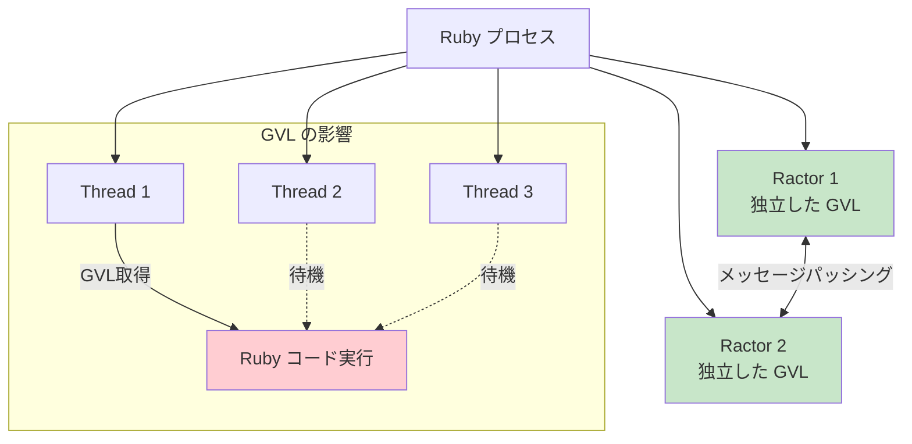
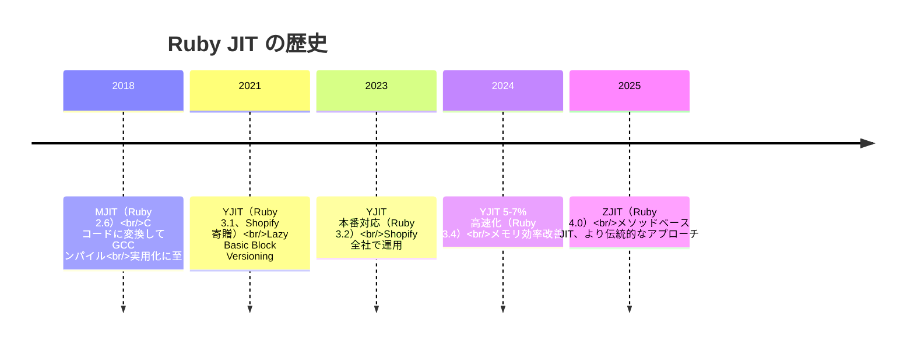

# Ruby（Ruby）

> **一言で言うと:** Ruby は1993年に **まつもとゆきひろ（Matz）** が「**プログラマの幸福**」を最優先に設計した言語で、**Smalltalk の純粋なオブジェクト指向と Perl の実用性を融合**させた。**「最小驚き原則」**（Principle of Least Surprise）と**「すべてはオブジェクト**」（数値も `nil` もメソッド呼び出し可能）が言語の世界観を決め、**ブロックとメタプログラミング**による DSL 構築力が **Ruby on Rails**（2004, DHH）を生んだ。長らく弱点だった性能は YJIT（Shopify 製、2022〜）で劇的に改善され（ベンチマーク幾何平均で90%超、Shopify 本番では20-30%の end-to-end 高速化）、Ruby 4.0（2025-12-25、誕生30周年）で実験的な ZJIT 追加・Ractor 安定化が進む。**「言語仕様で開発者の喜びを設計する」という稀有な思想**を体現する言語。

## 誕生と歴史的経緯

| 年月 | 主な転換点 |
|---|---|
| 1993-02 | まつもとゆきひろ（Matz）が Ruby 開発開始（Perl の実用性 + Smalltalk の純粋 OOP） |
| 1995-12 | Ruby 0.95 公開（クリスマス、以降 12/25 リリースが伝統に） |
| 2000 | 『プログラミング Ruby』（PickAxe）英訳で海外へ普及 |
| 2004 | Ruby on Rails 1.0（DHH）、Convention over Configuration |
| 2007 | Twitter / Shopify / GitHub 等が採用 |
| 2013 | Ruby 2.0 / キーワード引数 / Refinements |
| 2018 | Ruby 2.6 / MJIT 実験的導入 |
| 2020-12 | Ruby 3.0（3倍速く目標達成）、Ractor 実験的 / RBS / パターンマッチ |
| 2022-12 | Ruby 3.2 / YJIT 本番投入（Shopify で実証） |
| 2024-12 | Ruby 3.4 / Prism パーサーデフォルト化、Modular GC |
| **2025-12** | **Ruby 4.0（30周年）、ZJIT 実験的 / Ractor::Port / Ruby::Box** |

### 設計者と動機

設計者の **まつもとゆきひろ**（1965-、Matz）は日本人の言語設計者として最も国際的に知られる人物。Ruby 以前に Perl・Python・Lisp・Smalltalk を使い込み、「**もっと書いていて楽しい言語**」を求めて Ruby の設計を始めた。

#### Matz の動機

> **「プログラミングは思考の表現であるべきで、コンパイラの機嫌を取る作業ではない。プログラマが幸福であれば、結果として良いコードが書かれる」**

これは [[Go]] の "Less is exponentially more" や [[Python]] の "There should be one obvious way" と対照的:

| 言語 | 哲学 | やり方の数 |
|------|------|----------|
| [[Go]] | シンプルさで正解を導く | 1つ |
| [[Python]] | 明示的にやり方を1つに絞る | 1つ（できれば） |
| **Ruby** | **書き手の自由を最大化** | **何通りもある（TIMTOWTDI）** |

[[Perl]] と並んで「**やり方は何通りもある**」（There Is More Than One Way To Do It）を採用する数少ない言語。これが「**Ruby らしさ**」と「**コードベース間の方言化**」の両方を生む。

### 命名と日本発という事実

**「Ruby」は宝石の Ruby**（誕生石）から。**Perl が Pearl（真珠）由来**であることへの対抗。Matz が Perl の影響を強く受けつつも超えたいという意図。

Ruby は**日本人が設計し国際的に普及した極めて稀な言語**。コミュニティのバイリンガル化と国際化に Matz と日本人開発者たちが大きな役割を果たした。RubyKaigi（年次国際カンファレンス、日本開催）は今も国際 Ruby コミュニティの中心。

### Rails ブームと反動

2004年の **Ruby on Rails 1.0（David Heinemeier Hansson、DHH）** は、「**フルスタック・少ない設定・規約が決まっている**」という方針で Web 開発の生産性を劇的に改善し、**スタートアップの標準言語**となった（Twitter / GitHub / Shopify / Airbnb / Stripe など）。

2010年代後半、**性能問題と運用コスト**を理由に Twitter が Scala に、GitHub が一部を Go に移行する事例が報じられ「**Ruby は終わった**」論が広がった。しかし:

- Shopify が Rails で巨大スケール運用を続け、**YJIT を内製で開発**（2022〜）
- GitHub も Rails メインを維持、Ruby コアコミッタを多数雇用
- Stripe が Ruby + Sorbet（型）で運用継続

**「Ruby は遅い」は YJIT 以前の話**。**ベンチマーク（yjit-bench）の幾何平均で90%超のスピードアップ、Shopify 本番のストアフロントレンダラーでは 20-30% の end-to-end 高速化**を達成（数値の文脈は分けて理解する必要がある）。

### バージョン進化の山場

| バージョン | 年 | 主な貢献 |
|---|---|---|
| 1.0 | 1996 | 初の安定版 |
| 1.8 | 2003 | 海外普及期の主要バージョン |
| 1.9 | 2007 | YARV VM 導入で性能向上、文字エンコーディング刷新 |
| 2.0 | 2013 | キーワード引数、Refinements |
| 2.6 | 2018 | MJIT（実験的） |
| 3.0 | 2020-12 | **「Ruby 3x3」目標達成**、**Ractor**（実験的）、**RBS**（型シグネチャ）、パターンマッチ |
| 3.1 | 2021-12 | **YJIT** 導入（Shopify 寄贈） |
| 3.2 | 2022-12 | **YJIT 本番対応**、WASI ビルド |
| 3.3 | 2023-12 | YJIT 性能改善、M:N スレッドスケジューラ |
| 3.4 | 2024-12 | **Prism パーサーデフォルト化**、**Modular GC**、YJIT 5-7%高速化 |
| **4.0** | **2025-12** | **ZJIT 新JIT（実験的、本番投入は次バージョン以降）**、Ractor::Port、Ractor.shareable_proc、**Ruby::Box（実験的、名前空間隔離）** |

## 設計思想

### 1. プログラマの幸福（Programmer Happiness）

Ruby の設計判断は**「書き手が気持ち良いか」**で決まる:

```ruby
# 自然な英語に近い表現
5.times do |i|
  puts "Hello #{i}"
end

users.each do |user|
  puts user.name if user.active?
end

# 「if 文を後置」できる
puts "緊急" if priority > 5

# 整数も nil もメソッド呼び出し可能
3.times { puts "hi" }
nil.to_s  # ""
nil.respond_to?(:to_s)  # true
```

**「nil もオブジェクト」**というのが特徴的。Java や Go の `null` / `nil` が「型システムの穴」として扱われるのに対し、Ruby の `nil` は `NilClass` のシングルトンインスタンスで、メソッドも持つ。

### 2. 最小驚き原則（Principle of Least Surprise, POLS）

> **「Ruby は私を驚かせない」** — Matz

ただし「**誰の驚きが最小か**」は **Matz 自身の驚き**であって、初学者の驚きではない。`<=>`（spaceship operator）や `||=` のような略記法は、慣れれば便利だが初見は驚く。

```ruby
# よく使う慣用句
x ||= default  # x が nil/false なら default を代入
arr << item    # 配列末尾に追加
hash.each { |k, v| ... }  # ハッシュの全要素

# ブロックで処理を渡す（クロージャ）
[1, 2, 3].map { |n| n * 2 }  # [2, 4, 6]
[1, 2, 3].select { |n| n.odd? }  # [1, 3]
```

### 3. すべてがオブジェクト

```ruby
# 数値も String もオブジェクト、メソッドを持つ
1.class       # Integer
"a".class     # String
nil.class     # NilClass
true.class    # TrueClass

# クラスもオブジェクト
String.class  # Class
Class.class   # Class（Class 自身も Class のインスタンス）

# メソッドもオブジェクト
m = "hello".method(:upcase)
m.call  # "HELLO"
```

[[Python]] や [[JavaScript]] も「ほぼすべてがオブジェクト」だが、Ruby ほど徹底していない。Ruby では**プリミティブ型と参照型の区別がない**。

### 4. メタプログラミングと DSL

Ruby は**メタプログラミング**（コードがコードを書く）に最も寛容な言語の一つ:

```ruby
# 動的なメソッド定義
class User
  [:name, :email, :age].each do |attr|
    define_method(attr) { instance_variable_get("@#{attr}") }
    define_method("#{attr}=") { |v| instance_variable_set("@#{attr}", v) }
  end
end
```

これが**DSL**（Domain Specific Language）構築の力を生む:

```ruby
# Rails の routes.rb — ほぼ DSL
Rails.application.routes.draw do
  resources :users do
    member do
      post :follow
      delete :unfollow
    end
  end

  namespace :admin do
    resources :posts
  end
end

# RSpec — テストフレームワーク
describe Calculator do
  context 'with positive numbers' do
    it 'adds correctly' do
      expect(Calculator.add(2, 3)).to eq(5)
    end
  end
end
```

これらは Ruby の文法そのままだが、**英語のように読める**。 [[JavaScript]] / [[TypeScript]] / [[Go]] では到底達成できない領域。

## 核心的な特性

### ブロック・Proc・Lambda — クロージャの3形態

```ruby
# ブロック — メソッドに渡す匿名コード
[1, 2, 3].each do |n|
  puts n
end

# 短い場合は { } 構文
[1, 2, 3].each { |n| puts n }

# Proc — オブジェクトとして保存可能
greeter = Proc.new { |name| puts "Hello, #{name}" }
greeter.call('Alice')  # "Hello, Alice"

# Lambda — 引数チェックが厳格
add = lambda { |a, b| a + b }
# または ->(a, b) { a + b }
add.call(2, 3)  # 5

# Proc と Lambda の違い
p1 = Proc.new { |a, b| [a, b] }
p1.call(1, 2, 3)  # [1, 2] — 余分な引数は無視

l1 = lambda { |a, b| [a, b] }
l1.call(1, 2, 3)  # ❌ ArgumentError — 厳格
```

ブロックは Ruby らしさの源泉。`map`/`select`/`reduce` 等の高階関数が自然に書ける。

### 並行モデル — GVL と Ractor

Ruby の並行性は3つの層がある:



#### GVL（Global VM Lock）

[[Python]] の GIL と同じ問題（命名は若干違う）:

- **複数 Thread を作っても CPU 並列性は出ない**
- I/O 待ち中は GVL を解放する → I/O 並行性は OK
- C 拡張内（NumPy 相当のライブラリ）も GVL を解放可能

#### Ractor（Ruby 3.0+）— Actor モデルの並行性

```ruby
# 各 Ractor は独立した GVL を持つ → 真の CPU 並列
ractors = 4.times.map do |i|
  Ractor.new(i) do |id|
    sum = 0
    1_000_000.times { |n| sum += n }
    sum
  end
end

results = ractors.map(&:take)  # 4倍速くなる（CPU が 4コア以上なら）

# Ractor 間はメッセージパッシングで通信（共有メモリは禁止）
producer = Ractor.new do
  10.times { |i| Ractor.yield(i) }
  :done
end

consumer = Ractor.new(producer) do |p|
  while (val = p.take) != :done
    puts "受信: #{val}"
  end
end
```

**Ruby 4.0 で `Ractor::Port` 導入**：メッセージ送受信の安全性とエラー処理が改善された。「experimental」のラベル除去は近い。

ただし**現実問題として、Rails アプリで Ractor を使うのはまだ難しい**（多くの gem が Ractor 安全でない）。Web リクエストの並列化は通常 **Puma**（マルチスレッド or マルチプロセス）か **GVL を解放する I/O 並行性**で扱う。

### 型シグネチャ — RBS と Sorbet

Ruby は伝統的に動的型だが、Stripe が **Sorbet** を、Ruby 3.0 で公式の **RBS** を導入:

```ruby
# RBS（外部ファイル user.rbs）
class User
  attr_reader name: String
  attr_reader age: Integer

  def initialize: (name: String, age: Integer) -> void
  def adult?: () -> bool
end
```

```ruby
# Sorbet（コード内に inline でアノテーション）
require 'sorbet-runtime'

class User
  extend T::Sig

  sig { params(name: String, age: Integer).void }
  def initialize(name, age)
    @name = name
    @age = age
  end

  sig { returns(T::Boolean) }
  def adult?
    @age >= 18
  end
end
```

**RBS が公式標準**だが、**Sorbet（Stripe 製）の方が普及している**。ランタイムでも型チェックできる点が Stripe の本番運用で重要。

### YJIT と ZJIT — 性能改善の歴史



YJIT は**Lazy Basic Block Versioning**（LBBV）という独特の手法。コードの実行時に「型の組み合わせ」を学習し、それぞれに最適化されたバージョンを生成する。Shopify の本番では**インタプリタの 92% 高速化**を達成。

ZJIT は YJIT チームが新しく書き直した**メソッドベース JIT**。Ruby 4.0 では実験的だが、将来的にデフォルト JIT になる可能性。

## 代表的なイディオム

### イテレータの連鎖

```ruby
result = users
  .select { |u| u.active? }
  .map(&:name)
  .uniq
  .sort
  .first(10)

# `&:name` は `{ |u| u.name }` の略記
# `:name.to_proc` を渡している
```

### nil 処理 — Safe Navigation

```ruby
# &. — Safe Navigation Operator（2.3+）
country = user&.address&.country  # 途中が nil なら nil

# ||= — nil/false なら代入
@cache ||= compute_expensive_value

# 三項
display_name = user.name.present? ? user.name : 'ゲスト'

# Rails の `presence` メソッド
display_name = user.name.presence || 'ゲスト'
```

### パターンマッチ（Ruby 3.0+）

```ruby
case response
in { status: 200, data: { name: String => name } }
  puts "成功: #{name}"
in { status: 404 }
  puts "Not Found"
in { status: code } if code >= 500
  puts "Server Error: #{code}"
in [first, *rest]
  puts "List: first=#{first}, rest=#{rest}"
end
```

[[Python]] 3.10+ の match 文や [[Rust]] の match に近い構文。

### モンキーパッチング — 既存クラスへの追加

```ruby
# Ruby では、既存クラスに後から動的にメソッドを追加できる
class String
  def shout
    upcase + "!!!"
  end
end

"hello".shout  # "HELLO!!!"

# Refinements（2.0+）— スコープを限定したパッチ
module StringExtension
  refine String do
    def shout
      upcase + "!!!"
    end
  end
end

# refinements を有効にする
class MyClass
  using StringExtension

  def call
    "hello".shout  # ここでのみ有効
  end
end
```

**モンキーパッチは諸刃の剣**。Rails の `String#blank?` `String#present?` のように便利だが、無秩序なパッチは保守性を破壊する。Refinements は影響範囲を限定する解。

### Symbol vs String

```ruby
# Symbol — 不変な識別子（同じ名前は常に同じオブジェクト）
:name.object_id == :name.object_id  # true

# String — 可変、毎回新しいオブジェクト
"name".object_id == "name".object_id  # false（Ruby 3.0+ frozen の場合は true）

# Hash のキーに Symbol を使うのが慣習
user = { name: 'Alice', age: 30 }  # キーは :name と :age
user[:name]  # 'Alice'

# Rails での内部表現の違い
params[:user]    # Symbol アクセス
params['user']   # String アクセス
# Rails の HashWithIndifferentAccess は両方で OK
```

## エコシステム

### Bundler — 依存管理

```ruby
# Gemfile
source 'https://rubygems.org'

ruby '3.4.0'

gem 'rails', '~> 8.0'
gem 'pg', '~> 1.5'
gem 'puma'

group :development, :test do
  gem 'rspec-rails'
  gem 'rubocop'
end
```

```bash
$ bundle install
$ bundle exec rails server  # Gemfile の依存で実行
```

[[JavaScript]] の npm より早く、依存解決とロックファイルを実装した先駆け。

### Rails — フルスタックフレームワーク

```ruby
# モデル
class User < ApplicationRecord
  has_many :posts
  validates :email, presence: true, uniqueness: true
  scope :active, -> { where(active: true) }
end

# コントローラー
class UsersController < ApplicationController
  before_action :authenticate_user!

  def index
    @users = User.active.includes(:posts).page(params[:page])
  end
end

# ルーティング
Rails.application.routes.draw do
  resources :users
  root 'home#index'
end

# ビュー（ERB テンプレート）
<%# app/views/users/index.html.erb %>
<h1>Users</h1>
<ul>
  <% @users.each do |user| %>
    <li><%= link_to user.name, user %></li>
  <% end %>
</ul>
```

**Convention over Configuration（規約優先）**: 設定よりも規約に従えば動く設計。

#### Rails 8 と Hotwire 2.0

```ruby
# Hotwire = Turbo + Stimulus
# JavaScript をほぼ書かずに SPA 風 UI

# モデルの変更を即座にブロードキャスト
class Message < ApplicationRecord
  broadcasts_to ->(message) { [message.room, "messages"] }
end
```

**Hotwire は [[Reactの設計思想とフック|React]] / Vue へのオルタナティブ**。サーバーが HTML を返し、Turbo がフレームを差し替える。SPA より遥かにシンプルで、多くの中規模アプリには十分。

### 主要 gem

| 用途 | 主要 gem |
|------|--------|
| Web フレームワーク | Rails / Sinatra / Hanami |
| API サーバー | Grape |
| ORM | ActiveRecord（Rails標準）/ Sequel |
| テスト | RSpec / Minitest |
| 静的解析 | RuboCop / Sorbet / Steep |
| バックグラウンドジョブ | Sidekiq / Resque / Solid Queue（Rails 8 標準） |

## よくある落とし穴

### 1. `nil` と `false` だけが falsy

```ruby
# 多くの言語と異なり、0 や "" は truthy
if 0
  puts "実行される"  # ✅ 0 は truthy
end

if ""
  puts "実行される"  # ✅ "" は truthy
end

if nil
  puts "実行されない"
end

if false
  puts "実行されない"
end
```

[[JavaScript]] / [[Python]] / [[PHP]] と挙動が違うので要注意。

### 2. `puts` と `p` と `print` の違い

```ruby
puts "hello"        # 改行付き、配列は1要素ずつ改行
print "hello"       # 改行なし
p "hello"           # inspect 経由（"hello" と表示、デバッグ用）
pp some_object      # pretty print（ネストを綺麗に表示）

puts [1, 2, 3]
# 1
# 2
# 3

p [1, 2, 3]
# [1, 2, 3]
```

### 3. 文字列の immutable / mutable 切り替え

```ruby
# Ruby 3.0+ ではマジックコメントで frozen を有効化
# frozen_string_literal: true

s = "hello"
s.upcase!  # ❌ FrozenError（frozen_string_literal: true なら）

# 明示的に複製
s = "hello".dup
s.upcase!  # OK
```

### 4. `Array(x)` と `[x]` の違い

```ruby
Array(nil)        # []
Array([1, 2])     # [1, 2]
Array(1..3)       # [1, 2, 3]
Array({a: 1})     # [[:a, 1]]

[nil]             # [nil]
[[1, 2]]          # [[1, 2]]
[1..3]            # [1..3]
```

### 5. `===`（Case Equality）

```ruby
# Ruby の === は他言語と違う「Case Equality」
Integer === 1       # true（Integer のインスタンスか）
(1..10) === 5       # true（範囲に含まれるか）
/^\d+$/ === "123"   # true（正規表現マッチ）

# case/when は内部的に === を使う
case x
when Integer then "整数"
when 1..10 then "範囲内"
when /^\d+$/ then "数字文字列"
end
```

[[JavaScript]] や [[TypeScript]] の `===`（厳密等価）とは全く違う意味。

### 6. メソッドの引数とローカル変数の同名

```ruby
def foo
  bar = 1
  baz  # メソッド呼び出しか、未定義変数か？
end

def foo
  baz = 10  # ローカル変数として優先される
  baz       # 10（同名メソッドがあっても、代入後はローカル変数）
end
```

ローカル変数とメソッド呼び出しの**曖昧性**が Ruby の設計上の課題。明示的に `self.method_name` や `method_name()` で区別する。

### 7. `Hash` と `Hash.new(default)` の違い

```ruby
h = {}
h[:foo] += 1  # ❌ NoMethodError: undefined method `+' for nil

h = Hash.new(0)
h[:foo] += 1  # ✅ 1 — 存在しないキーには 0 が返る

# 注意: ブロック形式とリテラル形式
h = Hash.new { |hash, key| hash[key] = [] }
h[:foo] << 1
h[:foo] << 2
# h: { foo: [1, 2] }
```

### 8. ブロック内の return とメソッド全体の return

```ruby
def foo
  [1, 2, 3].each do |n|
    return n if n > 1  # ❗ メソッド foo 全体から return（Lambda なら違う挙動）
  end
  "通過しない"
end

foo  # 2

# Lambda は自分の中で return（メソッドは抜けない）
def bar
  l = lambda { return 'inside' }
  l.call
  'after'  # ✅ ここを通過
end

bar  # 'after'
```

## AIによる実装のアンチパターン

| アンチパターン | なぜ問題か | 対策 |
|---|---|---|
| Java/C# 風のクラス階層 | Ruby らしくない、メタプログラミングの良さを活かせない | 動的な属性定義・モジュール mixin を使う |
| `if x == nil` のような書き方 | 冗長、Ruby らしくない | `if x.nil?` または `if x` |
| `each_with_index` でなく自前カウンタ | Ruby のイテレータ思想を活かせない | `each_with_index` / `map.with_index` |
| `for i in 0..n` ループ | Ruby ではブロック形式が慣用句 | `n.times { |i| ... }` |
| 文字列を `+=` で連結 | 大量のオブジェクト生成、性能劣化 | `<< push` または `String#join` |
| Symbol と String を混在使用 | Hash キーで `params[:user]` と `params['user']` が違うものに | Rails の `HashWithIndifferentAccess` か明示統一 |
| モンキーパッチを無秩序に | 名前空間衝突、保守性破壊 | Refinements でスコープを限定 |
| `attr_accessor` の濫用 | 全プロパティを公開してしまう | 必要なものだけ `attr_reader`/`attr_accessor` |
| Ractor を Thread のように使う | Ractor 間でオブジェクトを共有しようとする | メッセージパッシング前提で設計、shareable オブジェクトのみ送信 |
| RBS/Sorbet の型なしで大規模化 | 動的型のリスクが規模で爆発 | 大規模プロジェクトは型シグネチャを導入 |
| `eval` を使う | セキュリティリスク・最適化阻害 | `define_method` / `instance_eval` で代替 |

## 関連トピック

- [[プログラミング言語の系譜と選択]] — 親トピック
- [[PHP]] — Web 系の対比、Laravel vs Rails の対比
- [[Python]] — 動的型・コミュニティ哲学（明示 vs 自由）の対比
- [[JavaScript]] — クロージャの活用度の比較
- [[並行性の基本概念]] — GVL / Ractor の理解
- [[インタプリタ・コンパイラ・JIT]] — YJIT / ZJIT の位置づけ
- [[認証と認可]] — Rails の Devise / Authentication
- [[StripeによるSaaS決済実装]] — Rails での実装パターン
- [[エラーハンドリングとフォールバックの設計戦略]] — Ruby の例外設計

## 参考リソース

- [Ruby 公式サイト](https://www.ruby-lang.org/ja/)
- [Ruby 4.0 リリースノート](https://www.ruby-lang.org/en/news/2025/12/25/ruby-4-0-0-released/)
- [Ruby 3.4 リリースノート](https://www.ruby-lang.org/en/news/2024/12/25/ruby-3-4-0-released/)
- [Ruby on Rails Guides](https://guides.rubyonrails.org/) — Rails の公式ガイド
- [The Pragmatic Programmer's Guide to Ruby (PickAxe)](https://pragprog.com/) — 古典の英語入門書
- [Ruby スタイルガイド](https://github.com/rubocop/ruby-style-guide) — RuboCop の元
- [Shopify Engineering Blog](https://shopify.engineering/) — YJIT/Ruby 性能の最前線
- 書籍:『プログラミング言語 Ruby』(Matz, Flanagan) — 言語仕様の詳細
- 書籍:『メタプログラミング Ruby 第2版』(Paolo Perrotta) — メタプロの教科書
- 書籍:『Ruby のしくみ — Ruby Under a Microscope』 — 実装内部の解説

## 学習メモ

- **「Ruby は遅い」は YJIT 以前の話**。Ruby 3.2+ ではベンチマーク幾何平均で90%超、Shopify 本番のストアフロントで 20-30% の end-to-end 高速化、Ruby 4.0 の ZJIT も実用化に向けて進む。Shopify は Ruby + YJIT で世界規模 EC を運用している
- **Rails の生産性は依然世界最高クラス**。MVPの立ち上げ速度では FastAPI / Express / Spring を凌ぐ。スタートアップで Ruby on Rails を選ぶのは今も合理的
- **Hotwire（Turbo + Stimulus）は SPA 疲れへの解**。[[Reactの設計思想とフック|React]] が要らない多くのアプリで、HTML over the wire モデルが現実的選択肢に
- **メタプログラミング**は強力だが諸刃。AI コード生成では誤って濫用しがち。型シグネチャ（RBS/Sorbet）と組み合わせて制御するのが現代的
- AI コード生成が苦手とする領域: 「**Ruby らしいイディオム**」「**ブロックとイテレータの自然な活用**」「**メタプログラミングの適切な範囲**」。表面的な構文は生成できるが、Ruby の「**幸福**」哲学はコードレビューで人間が判断する必要がある
- **30周年（2025-12-25）の Ruby 4.0** リリースは、Matz が「言語の楽しさは時代を超える」と示した節目。次の30年は ZJIT・Ractor・名前空間（Ruby::Box）でさらなる進化が続く
