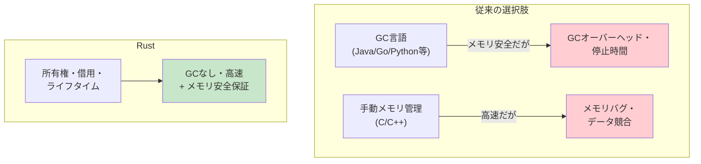
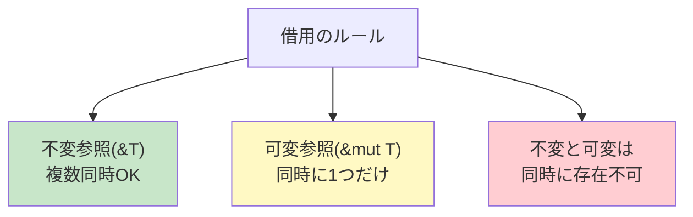
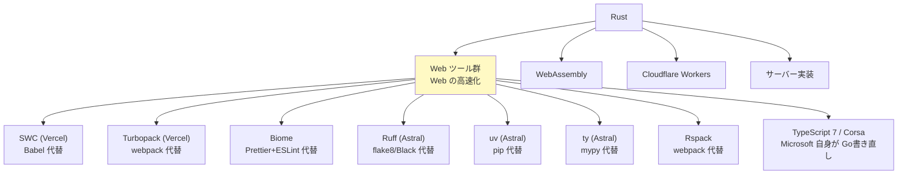

# Rust（Rust）

> **一言で言うと:** Rust は2006年に **Graydon Hoare** が Mozilla で個人プロジェクトとして開発を始め、「**ガベージコレクションなしでメモリ安全**」という不可能と思われた目標を実現した言語。**所有権（Ownership）・借用（Borrowing）・ライフタイム（Lifetimes）** という3つの仕組みでメモリ安全とデータ競合フリーをコンパイル時に保証する。Stack Overflow の年次調査で **2016〜2022年は7年連続「最も愛される言語（most loved）」、2023年以降も「最も賞賛される言語（most admired）」として継続的に1位** に選ばれ、近年は Web 領域で **SWC・Turbopack・Biome・Ruff・uv・ty**（[[Python]] / [[JavaScript]] エコシステムを置き換える Rust 製ツール群）として爆発的に普及した。**Cloudflare Workers の標準言語**の一つでもあり、Wasm でブラウザ・エッジ・組込みまでカバーする「**システムプログラミングの民主化**」を実現した。Rust 1.85（2025-02）で 2024 Edition が安定化、async closure・improved lifetime capture が入った。

## 誕生と歴史的経緯

| 年月 | 主な転換点 |
|---|---|
| 2006 | Graydon Hoare が個人プロジェクトとして Mozilla で開発開始 |
| 2009 | Mozilla が正式スポンサーに（Servo ブラウザエンジン目的） |
| 2010 | 公式アナウンス / OSS 化（最初のコンパイラは OCaml 製） |
| 2012 | セルフホスティング開始（Rust 自身でコンパイラを書き直し） |
| 2015-05 | Rust 1.0 リリース（後方互換の約束開始） |
| 2018 | Rust 2018 Edition / NLL、Cloudflare Workers / AWS Firecracker / Discord 採用 |
| 2020 | Mozilla レイオフ後 Rust Foundation 設立（AWS / Microsoft / Google / Huawei 支援） |
| 2021 | Rust 2021 Edition |
| 2022-12 | Linux 6.1 で Rust 正式マージ（C 独占以来初の言語追加）、Windows カーネルでも採用 |
| 2024 | SWC / Turbopack / Biome / Ruff / uv / ty で Web ツール群が Rust 化 |
| **2025-02** | **Rust 1.85 / 2024 Edition 安定化 / async closure** |
| 2026 | async-trait を言語機能で代替、generators 進行中 |

### 設計者と動機

設計者の **Graydon Hoare**（カナダの計算機科学者）は、Mozilla の Researcher として勤務する傍ら、**2006年に個人プロジェクトとして Rust の設計を開始**。直接の契機は、**自宅アパート（バンクーバー、21階）のエレベータのソフトウェアがクラッシュして動かなくなり、階段を登りながら「多くのソフトウェアクラッシュはメモリ管理の問題に起因する」と考えた**ことだったと Hoare 自身が語っている（クラッシュしたソフトウェアの実装言語そのものは特定されていない）。

Hoare の問題意識:

> **「2010年代にもなって、なぜソフトウェアはバッファオーバーフローやデータ競合で落ち続けるのか。GC なしで、コンパイル時にこれらを排除できる言語を作れないか」**

2009年に Mozilla が業務として正式に Rust を支援開始。次世代ブラウザエンジン **Servo**（後の一部が Firefox の **Stylo** や **WebRender** として採用）の実装言語として実用化された。

#### 名前の由来

「**Rust**（錆）」は **Rust菌**（さび病菌）にちなむ。この菌類は「**極めて堅牢な多段ライフサイクル**」を持つことで知られ、Hoare は「言語にも同じような堅牢さを求めた」と説明している。一説には「**最先端ではなく、地道に実用的な技術**」を象徴しているとも。

### Mozilla 撤退と Rust Foundation

2020年8月、Mozilla の大規模レイオフで Rust 開発の多くが影響を受けた。コミュニティは **Rust Foundation**（2021年設立）として独立し、AWS / Microsoft / Google / Huawei / Meta が主要スポンサーとなった。

これは**「単一企業に依存しない言語ガバナンス」の成功例**として注目される。[[Go]] が Google 主導である状況と対照的。

### Linux カーネルと Windows での採用

2022年10月のマージを経て、**2022年12月リリースの Linux 6.1 で Rust が正式サポート**された（Rust for Linux の RFC 提出は2020年、議論は数年に及んだ）。これは Linux 史上**最大の言語追加**（C の独占以来初）で、Linus Torvalds が「メモリ安全性のために必要」と認めた歴史的決定。

Microsoft も同時期に **Windows のカーネルコンポーネントを Rust で書き直し**を開始。AWS は **Firecracker**（Lambda の仮想化技術）を Rust で実装。**システムプログラミングの新標準**として地位を確立した。

### バージョン進化の山場

| バージョン | 年 | 主な貢献 |
|---|---|---|
| 0.1 | 2012-01 | 最初の公開リリース（自己ホスト） |
| **1.0** | **2015-05** | **後方互換の約束**（Stability Without Stagnation） |
| 1.0+Edition 2015 | 2015 | 初版エディション |
| 1.31+Edition 2018 | 2018 | **NLL**（Non-Lexical Lifetimes）、モジュールシステム改善 |
| 1.39 | 2019-11 | **async/await** 安定化 |
| 1.56+Edition 2021 | 2021 | disjoint capture、`format_args!` の改善 |
| 1.65 | 2022-11 | **GAT**（Generic Associated Types） |
| 1.75 | 2023-12 | **async fn in traits** 安定化 |
| 1.80 | 2024-07 | LazyLock / LazyCell 安定化 |
| **1.85+Edition 2024** | **2025-02** | **async closures**、improved async lifetime capture、`Future`/`IntoFuture` を prelude に |

**Edition** は破壊的変更を許容するためのオプトイン機構（[[Python]] 2→3 の失敗から学んだ）。同じバイナリ内で異なる Edition のクレートが混在できる。

## 設計思想

### 1. Memory Safety Without Garbage Collection

Rust の核心的な約束:

> **「C/C++ 並みの性能で、メモリ安全とデータ競合フリーをコンパイル時に保証する」**



これを実現する3つの仕組みが**所有権・借用・ライフタイム**。詳細は後述。

### 2. Zero-Cost Abstractions

Bjarne Stroustrup（C++ 設計者）の格言:

> **「使わない機能の対価は払わない。使う機能を、これより手書きで書いても速くできない」**

Rust は高水準の抽象（イテレータ、クロージャ、トレイトオブジェクト）を持つが、**コンパイル後は手書き C と同等のコード**になる:

```rust
// 高水準の表現
let sum: i32 = (1..=1000)
    .filter(|n| n % 2 == 0)
    .map(|n| n * n)
    .sum();

// コンパイル後は単純なループに最適化される（C と同等の機械語）
```

### 3. Fearless Concurrency

並行プログラミングの**データ競合をコンパイル時に検出**:

```rust
use std::thread;

let mut data = vec![1, 2, 3];

// ❌ コンパイルエラー — data を複数スレッドで共有しようとしている
let handle1 = thread::spawn(|| {
    data.push(4);
});

let handle2 = thread::spawn(|| {
    data.push(5);
});
// error[E0373]: closure may outlive the current function
```

データ競合は実行時バグの中で最も発見が困難（Heisenbug）。Rust はこれをコンパイル時に防ぐ。

### 4. Stability Without Stagnation

Rust 1.0 以降、**後方互換の約束**を厳守。同時に新機能は積極的に追加する。Edition 機構によりこれを両立:

```toml
# Cargo.toml
[package]
edition = "2024"  # この crate は 2024 Edition の構文を使う
```

異なる Edition の crate が同じバイナリで混在できる。**[[Python]] 2→3 の失敗から学んだ設計**。

## 核心的な特性 — 所有権モデル

### 1. 所有権（Ownership）

**全ての値には1つだけ所有者がいる**。所有者がスコープを抜けると値は破棄される（drop）:

```rust
fn main() {
    let s = String::from("hello"); // s が "hello" の所有者
    takes_ownership(s);             // 所有権を関数に「移動」
    // s は使えなくなる（コンパイルエラー）
    println!("{}", s); // ❌ error: borrow of moved value
}

fn takes_ownership(s: String) {
    println!("{}", s);
} // ここで s は drop される（メモリ解放）
```

これにより**メモリ解放のタイミングが静的に決まる**。GC が不要なのは、コンパイラが「いつ解放すべきか」を完全に追跡できるから。

### 2. 借用（Borrowing）

所有権を渡したくない場合、**参照（&）で借用**する:

```rust
fn main() {
    let s = String::from("hello");
    let len = calculate_length(&s); // 参照を渡す
    println!("{}: {}", s, len); // s はまだ使える
}

fn calculate_length(s: &String) -> usize {
    s.len()
}
```

借用には**厳格なルール**がある:



```rust
let mut s = String::from("hello");

let r1 = &s;     // 不変参照
let r2 = &s;     // 不変参照（複数OK）
println!("{} {}", r1, r2);

let r3 = &mut s; // 可変参照
// let r4 = &s; // ❌ 不変と可変は同時不可
r3.push_str(" world");
```

このルールが**データ競合をコンパイル時に防ぐ**。複数スレッドで同じデータを変更しようとすると、必ず可変参照が複数になり、コンパイラが弾く。

### 3. ライフタイム（Lifetimes）

参照が**いつまで有効か**をコンパイラに伝える:

```rust
// ❌ コンパイルエラー — 借用元が早く解放される
fn dangling() -> &String {
    let s = String::from("hello");
    &s  // s はこの関数を抜けると drop される → 参照が宙吊り（dangling）
}

// ✅ ライフタイム注釈で関係を明示
fn longest<'a>(x: &'a str, y: &'a str) -> &'a str {
    if x.len() > y.len() { x } else { y }
}
// 戻り値は引数 x または y と同じライフタイムを持つ
```

ライフタイム注釈は**初学者の最大の壁**だが、コンパイラが多くのケースで省略を許容する（lifetime elision）。

### 4. Drop Trait — RAII

**スコープを抜けるときに自動実行される処理**:

```rust
struct File {
    handle: FileHandle,
}

impl Drop for File {
    fn drop(&mut self) {
        self.handle.close(); // スコープを抜けると自動で呼ばれる
    }
}

fn main() {
    let file = File::open("data.txt");
    // ... 処理 ...
} // ここで file.drop() が自動的に呼ばれる
```

C++ の RAII（Resource Acquisition Is Initialization）と同じ。**try-finally や defer が不要**。

## 型システム

### 代数的データ型（ADT）

```rust
// enum は ML 系の代数的データ型
enum Shape {
    Circle { radius: f64 },
    Rectangle { width: f64, height: f64 },
    Triangle(f64, f64, f64), // 3辺
}

fn area(shape: &Shape) -> f64 {
    match shape {
        Shape::Circle { radius } => std::f64::consts::PI * radius * radius,
        Shape::Rectangle { width, height } => width * height,
        Shape::Triangle(a, b, c) => {
            // ヘロンの公式
            let s = (a + b + c) / 2.0;
            (s * (s - a) * (s - b) * (s - c)).sqrt()
        }
    }
}
```

### Option と Result — null と例外を排除

Rust には `null` も**例外もない**。代わりに型で表現:

```rust
// nullable は Option<T>
fn find_user(id: u64) -> Option<User> {
    if id == 0 {
        None
    } else {
        Some(User { id, name: String::from("Alice") })
    }
}

let user = find_user(1);
match user {
    Some(u) => println!("見つかった: {}", u.name),
    None => println!("見つからない"),
}

// ? 演算子でエラー伝播
fn read_config() -> Result<Config, Error> {
    let content = std::fs::read_to_string("config.toml")?; // 失敗なら early return
    let config: Config = toml::from_str(&content)?;
    Ok(config)
}
```

[[Go]] の `if err != nil` 地獄が `?` 演算子1文字に。[[TypeScript]] の `try-catch` のような分散した制御フローもない。**エラーは型に乗っている**。

### トレイト（Traits）

[[Go]] の interface に近いが、より強力:

```rust
trait Summary {
    fn summarize(&self) -> String;

    // デフォルト実装
    fn summarize_default(&self) -> String {
        String::from("(read more...)")
    }
}

struct Article { title: String, content: String }

impl Summary for Article {
    fn summarize(&self) -> String {
        format!("{}: {}", self.title, &self.content[..50])
    }
}

// ジェネリクスとトレイト境界
fn notify<T: Summary>(item: &T) {
    println!("Breaking news! {}", item.summarize());
}

// impl Trait 構文（戻り値）
fn returns_summary() -> impl Summary {
    Article { /* ... */ }
}
```

**孤児ルール**（Orphan Rule）: 自分のクレートで定義した型か、自分のクレートで定義したトレイトのどちらかでないと `impl` できない。これがエコシステム全体の整合性を保つ。

### パターンマッチング

```rust
let value = Some(7);

match value {
    Some(n) if n > 10 => println!("大きい: {}", n),
    Some(n) => println!("小さい: {}", n),
    None => println!("なし"),
}

// if let で簡潔に
if let Some(n) = value {
    println!("値: {}", n);
}

// while let で繰り返し
let mut stack = vec![1, 2, 3];
while let Some(top) = stack.pop() {
    println!("{}", top);
}
```

[[Python]] や [[Ruby]] の最新版にもパターンマッチが入ったが、Rust の網羅性チェック（exhaustive check）は最も厳格。

## 並行モデル — async/await + Tokio

```rust
use tokio::time::{sleep, Duration};

#[tokio::main]
async fn main() {
    // 並行に複数のタスクを実行
    let task1 = tokio::spawn(async {
        sleep(Duration::from_secs(1)).await;
        "task1 done"
    });

    let task2 = tokio::spawn(async {
        sleep(Duration::from_secs(2)).await;
        "task2 done"
    });

    let (r1, r2) = tokio::join!(task1, task2);
    println!("{:?}, {:?}", r1, r2);
}
```

**Rust の async は実行時を持たない**。`tokio` / `async-std` / `smol` などの**ランタイムをユーザーが選ぶ**。これが「Rust の async は難しい」と言われる原因の一つ。

### Rust 1.85（2024 Edition）での改善

```rust
// 旧来 — ライフタイム指定が必要
fn process<'a>(data: &'a str) -> impl Future<Output = String> + 'a {
    async move { process_async(data).await }
}

// 2024 Edition — ライフタイムが自動推論
fn process(data: &str) -> impl Future<Output = String> {
    async move { process_async(data).await }
}

// async closure（1.85+）
let async_closure = async |x: i32| { x + 1 };
let result = async_closure(5).await; // 6
```

**Future / IntoFuture が prelude に**入り、import 不要に。

## なぜ Web 領域で Rust が爆発的に普及したか



**Rust 製ツールが [[JavaScript]] / [[Python]] エコシステムを置き換えていく**現象は2022年頃から急激に加速:

| 旧来のツール | Rust 製代替 | 高速化 |
|---|---|---|
| Babel | **SWC**（Vercel） | 20-70倍 |
| webpack | **Turbopack**（Vercel）/ Rspack | 10倍以上 |
| Prettier + ESLint | **Biome** | 10倍以上 |
| flake8 + Black + isort | **Ruff**（Astral） | 10-100倍 |
| pip + virtualenv | **uv**（Astral） | 10-100倍 |
| mypy | **ty**（Astral、開発中） | 大幅高速化見込み |

**理由**: [[JavaScript]] / [[Python]] 自身で書かれた開発ツールは、ホスト言語の遅さ・並列性の限界（GVL/GIL）を引き継ぐ。Rust で書き直すことで**1桁〜2桁の高速化**が可能。

### WebAssembly（Wasm）

```rust
// Rust → Wasm にコンパイル可能
use wasm_bindgen::prelude::*;

#[wasm_bindgen]
pub fn fibonacci(n: u32) -> u32 {
    if n < 2 { n } else { fibonacci(n-1) + fibonacci(n-2) }
}
```

Rust は **Wasm の事実上の第一級言語**。Figma の重い計算処理、Photoshop on Web、Photopea などが Rust + Wasm で実装されている。

### Cloudflare Workers

```rust
use worker::*;

#[event(fetch)]
async fn main(req: Request, _env: Env, _ctx: Context) -> Result<Response> {
    Response::ok("Hello from Rust on Cloudflare!")
}
```

Cloudflare Workers では V8 isolate 上で Rust 製の Wasm が動く。**コールドスタート < 1ms** で世界中のエッジで実行される。

### サーバーフレームワーク

| フレームワーク | 特徴 |
|---|---|
| **Axum** | Tokio チーム製、現代的・型安全・人気急上昇 |
| **Actix Web** | 性能トップクラス、安定運用実績 |
| **Rocket** | 学習容易、マクロ多用 |
| **Leptos** | フルスタック（[[Reactの設計思想とフック\|React]]/Solid 風）、SSR + Hydration |

```rust
// Axum の例 — 現代的でシンプル
use axum::{routing::get, Json, Router};
use serde::Serialize;

#[derive(Serialize)]
struct User { id: u64, name: String }

async fn get_user() -> Json<User> {
    Json(User { id: 1, name: String::from("Alice") })
}

#[tokio::main]
async fn main() {
    let app = Router::new().route("/user", get(get_user));
    let listener = tokio::net::TcpListener::bind("0.0.0.0:3000").await.unwrap();
    axum::serve(listener, app).await.unwrap();
}
```

## エコシステム — Cargo

```bash
# Cargo は Rust の唯一の標準ツール
$ cargo new myapp        # プロジェクト作成
$ cargo add serde tokio  # 依存追加
$ cargo build            # ビルド
$ cargo test             # テスト
$ cargo run              # 実行
$ cargo clippy           # Linter
$ cargo fmt              # フォーマット
$ cargo doc              # ドキュメント生成
```

**[[Python]] の uv や [[JavaScript]] の pnpm が目指すべき姿**として、Cargo は他言語のパッケージマネージャに大きな影響を与えた。

### 主要 crate

| 用途 | crate |
|---|---|
| 非同期ランタイム | tokio / async-std / smol |
| HTTP クライアント | reqwest |
| シリアライズ | **serde**（事実上の標準）+ serde_json / toml / yaml |
| Web フレームワーク | axum / actix-web / rocket |
| ORM | sqlx（生 SQL + 型チェック）/ diesel / sea-orm |
| CLI | clap / structopt |
| 並列計算 | rayon（自動並列イテレータ） |
| WASM | wasm-bindgen / wasm-pack / yew / leptos |

## よくある落とし穴

### 1. 借用チェッカーとの戦い

```rust
// ❌ 借用チェッカーに弾かれる典型例
let mut v = vec![1, 2, 3];
let first = &v[0];  // 不変借用
v.push(4);          // 可変借用しようとする
println!("{}", first); // ← v.push の後で first を使う

// ✅ first のスコープを早く終わらせる
let mut v = vec![1, 2, 3];
{
    let first = &v[0];
    println!("{}", first);
} // first のスコープ終了
v.push(4);

// ✅ そもそも値をコピーする（プリミティブ型なら）
let first = v[0]; // i32 は Copy なのでコピーされる
v.push(4);
println!("{}", first);
```

### 2. ライフタイムの理解

```rust
// ❌ 構造体に参照を持たせるとライフタイム必須
struct Container {
    data: &str,  // error: missing lifetime specifier
}

// ✅ ライフタイム注釈
struct Container<'a> {
    data: &'a str,
}

// 多くの場合、所有権を持つ型（String / Vec）を使う方がシンプル
struct Container {
    data: String,  // 所有権を持つ
}
```

**初学者は構造体に参照を持たせず、`String`/`Vec` などの所有型を使う**のが鉄則。

### 3. Send / Sync トレイトの混乱

```rust
// Send: 別スレッドへ移動できる
// Sync: 複数スレッドから参照できる

use std::sync::{Arc, Mutex};
use std::thread;

let counter = Arc::new(Mutex::new(0));

let mut handles = vec![];
for _ in 0..10 {
    let counter = Arc::clone(&counter);
    handles.push(thread::spawn(move || {
        let mut num = counter.lock().unwrap();
        *num += 1;
    }));
}

for h in handles { h.join().unwrap(); }
println!("{}", *counter.lock().unwrap()); // 10
```

`Rc` と `Arc`、`RefCell` と `Mutex` の使い分けが初学者を混乱させる。

### 4. `String` と `&str` の使い分け

```rust
// String: ヒープ確保、所有権あり、変更可能
let s1: String = String::from("hello");

// &str: 文字列スライス、参照、不変
let s2: &str = "hello"; // string literal は &'static str

// 関数の引数では &str が柔軟（String も &String 経由で渡せる）
fn print_str(s: &str) { println!("{}", s); }
print_str(&s1);   // String → &str
print_str(s2);    // &str
print_str("hi");  // string literal
```

### 5. Option / Result の `unwrap()` 濫用

```rust
// ❌ unwrap は失敗時 panic（プロセス停止）
let value = some_function().unwrap();

// ✅ ? でエラー伝播
let value = some_function()?;

// ✅ パターンマッチで明示処理
let value = match some_function() {
    Ok(v) => v,
    Err(e) => return Err(e.into()),
};

// ✅ unwrap_or でデフォルト値
let value = some_option.unwrap_or(0);

// ✅ expect で説明付き panic（テストや絶対失敗しない箇所）
let value = some_function().expect("config file must exist");
```

### 6. async のランタイム不在問題

```rust
// ❌ Rust の async は実行時がない
fn main() {
    async_function(); // ❌ 何も起きない（Future が返るだけ）
}

// ✅ ランタイムで実行
#[tokio::main]
async fn main() {
    async_function().await;
}
```

[[JavaScript]] や [[Python]] と異なり、`async` 関数を呼んだだけでは実行されない。**Future は怠惰**で、`.await` か実行時の `block_on` が必要。

### 7. trait オブジェクトの動的ディスパッチ

```rust
// 静的ディスパッチ（高速、コンパイル時に展開）
fn process<T: Display>(item: T) { /* ... */ }

// 動的ディスパッチ（柔軟、ランタイムオーバーヘッド）
fn process(item: Box<dyn Display>) { /* ... */ }

// 多くの場合は impl Trait（静的）が望ましい
fn process(item: impl Display) { /* ... */ }
```

### 8. クロージャと `move`

```rust
let s = String::from("hello");

// ❌ クロージャがスレッドより長く生きる可能性 → 借用エラー
thread::spawn(|| {
    println!("{}", s);
});

// ✅ move で所有権をクロージャに移す
thread::spawn(move || {
    println!("{}", s);
});
```

## AIによる実装のアンチパターン

| アンチパターン | なぜ問題か | 対策 |
|---|---|---|
| `clone()` の濫用 | 性能ペナルティ、Rust の所有権モデルを無視 | 借用 `&T` を最優先、必要な箇所のみ clone |
| `unwrap()` の多用 | panic で本番停止 | `?` 演算子か明示的なエラーハンドリング |
| `Rc<RefCell<T>>` を多用 | 所有権モデルの恩恵を捨てている | データ構造を再設計、所有関係を整理 |
| 過剰なライフタイム注釈 | コンパイラが推論できる場合まで書く | lifetime elision に任せ、必要時のみ書く |
| `Vec<&T>` のような借用コレクション | ライフタイム地獄 | `Vec<T>` で所有権を持たせる |
| async fn を勘違い | Future を返すだけで実行されない | `.await` か `tokio::spawn` で実行 |
| 自前 Mutex 実装 | 高度な並行プリミティブを誤用 | `tokio::sync::Mutex` / `parking_lot` を使う |
| 巨大な単一 trait | インターフェース汚染 | 小さく分けてコンポジション |
| `String` ではなく `String::new` を使い続ける | 慣用句から外れる | `String::from` / `to_string()` / `format!` |
| `match` の網羅性を `_` で逃げる | 新しいバリアント追加で気付けない | 全ケース明示、必要な場合のみ `_` |
| Send/Sync 境界の手動実装 | unsafe で正しく書くのは極めて困難 | 既存の同期プリミティブを使う |

## 関連トピック

- [[プログラミング言語の系譜と選択]] — 親トピック
- [[JavaScript]] / [[TypeScript]] — Rust 製ツールが置き換えた既存エコシステム
- [[Python]] — Astral 革命（Ruff / uv / ty）の対象
- [[Go]] — 並行性モデルの対比（CSP vs 所有権ベース）
- [[並行性の基本概念]] / [[ロック]] — Send/Sync の理解
- [[メモリリーク]] / [[ダングリングポインタ]] — Rust が排除する典型的バグ
- [[モジュールバンドラ-webpackとTurbopack]] — Turbopack/Rspack の文脈
- [[Dockerイメージ]] — Rust の単一バイナリ + scratch イメージ
- [[エッジコンピューティング]] — Cloudflare Workers + Rust + Wasm

## 参考リソース

- [The Rust Programming Language](https://doc.rust-lang.org/book/) — 公式の入門書（"The Book"）。日本語訳あり
- [Rust 1.85 リリースノート](https://blog.rust-lang.org/2025/02/20/Rust-1.85.0/)
- [Rust by Example](https://doc.rust-lang.org/rust-by-example/) — コード例で学ぶ
- [Rustlings](https://github.com/rust-lang/rustlings) — インタラクティブ演習
- [The Rust Reference](https://doc.rust-lang.org/reference/) — 言語仕様
- [The Rustonomicon](https://doc.rust-lang.org/nomicon/) — unsafe Rust の暗黒面
- [Rust Foundation](https://rustfoundation.org/) — 公式財団
- 書籍:『Programming Rust, 2nd ed.』(Jim Blandy, O'Reilly) — 包括的な定番
- 書籍:『Rust for Rustaceans』(Jon Gjengset) — 中級者向け、深い設計
- 書籍:『プログラミング Rust 第2版』(オライリー・ジャパン) — 上記の日本語訳

## 学習メモ

- **Rust の学習曲線は他言語と質的に違う**。「**最初の1ヶ月でコンパイラと戦い、2ヶ月目で借用チェッカーが内面化される**」という体験は、Rustaceans（Rust 開発者の自称）の通過儀礼
- **2025年以降、Web 開発で Rust を「直接書く」ではなく「Rust 製ツールを使う」が普通に**。ESLint → Biome、Babel → SWC、pip → uv の移行は今後も続く。これは Rust が Web 開発の**裏方インフラ**として確立した証
- **Cloudflare Workers + Rust + Wasm** の組み合わせは、サーバーレス・エッジコンピューティングの次世代標準になりつつある。コールドスタート < 1ms は Node.js では不可能な数値
- **`async` の難しさ**は依然として Rust の弱点。Python の asyncio や JavaScript の async/await ほど直感的ではない。Rust 1.85 の async closure と 2024 Edition の lifetime 改善で大幅に楽になったが、本格的な async コードは中級者以上の領域
- **AI コード生成が苦手とする領域**: 「**所有権・借用の自然な設計**」「**ライフタイムが必要かどうかの判断**」「**unsafe を使わずに済む API 設計**」。表面的な構文は生成できるが、Rust らしい設計はコードレビューでの人間判断が必須
- **Rust は「[[Go]] と並ぶ次世代システム言語」ではなく「[[Go]] とは別領域の言語」**。Go は「**シンプルさで速く書ける**」、Rust は「**正しく書く負担を払って性能と安全を得る**」。両方を学んで使い分けるのが現代エンジニアの理想
