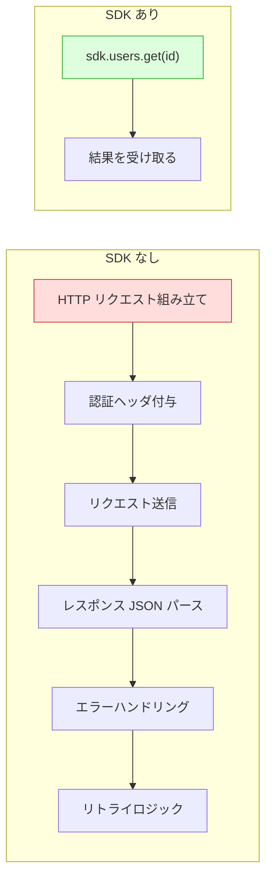
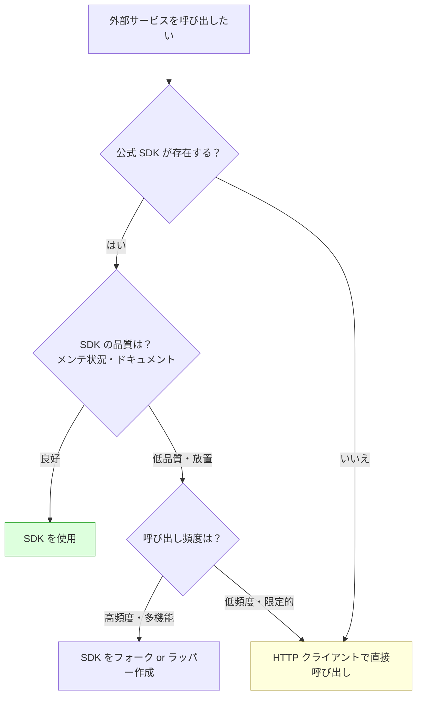

# SDKとAPIクライアント（Software Development Kit / API Client）

> **一言で言うと:** SDK は外部サービスの API を「自分の言語のメソッド呼び出し」に変換するライブラリ。HTTP リクエストの組み立て・認証・リトライ・型変換を隠蔽し、開発者がビジネスロジックに集中できるようにする。

## SDK とは何か

SDK（Software Development Kit）は、特定のプラットフォームやサービスと連携するためのライブラリ・ツール・ドキュメントの集合体。Web 開発の文脈では、外部 API を呼び出すための**言語別クライアントライブラリ**を指すことが多い。

### 素の HTTP 呼び出しと SDK の比較



SDK は以下を内部で処理する：

| 責務 | SDK なし（自前実装） | SDK あり |
|------|-------------------|---------|
| 認証 | トークンの取得・更新・ヘッダ付与を自前で管理 | 初期化時に設定すれば自動管理 |
| リクエスト構築 | URL・メソッド・ボディ・クエリパラメータを手動で組み立て | メソッド引数として渡すだけ |
| 型安全性 | レスポンスは `any` / `interface{}` — 手動でパース | 戻り値の型が定義済み |
| リトライ | 一時的エラー（429, 5xx）に対するリトライを自前で実装 | エクスポネンシャルバックオフが組み込み |
| ページネーション | `next_page` トークンのループ処理を自前で実装 | イテレータ / ヘルパーが提供される |
| エラー分類 | HTTP ステータスコードを自分で分岐 | 型付きの例外 / エラー型に変換済み |

## SDK の種類

Web 開発で頻繁に使う SDK は大きく3つに分類できる。

### 1. クラウドプロバイダー SDK

AWS・GCP・Azure 等のクラウドサービスを操作するための SDK。インフラとアプリケーションの両方で使用する。

| プロバイダー | SDK 名 | 対応言語例 |
|-------------|--------|-----------|
| AWS | AWS SDK（v3 for JS, boto3 for Python） | TypeScript, Python, Go, Java, PHP, Ruby |
| GCP | Google Cloud Client Libraries | 同上 |
| Azure | Azure SDK | 同上 |

### 2. SaaS / API サービス SDK

Stripe、Twilio、SendGrid 等、特定のサービスが提供する SDK。[[StripeによるSaaS決済実装]]で扱うような決済連携が典型例。

### 3. フレームワーク / プラットフォーム SDK

Firebase SDK、Supabase SDK のように、バックエンド機能一式を提供するもの。認証・データベース・ストレージ等を統合的に扱える。

## コード例 — AWS S3 操作

### TypeScript（AWS SDK v3）

```typescript
import { S3Client, PutObjectCommand, GetObjectCommand } from '@aws-sdk/client-s3';

// SDK の初期化 — リージョンと認証情報を設定
// 認証は環境変数 or IAM ロールから自動で解決される
const s3 = new S3Client({ region: 'ap-northeast-1' });

// ファイルアップロード
async function uploadFile(bucket: string, key: string, body: Buffer): Promise<string> {
  await s3.send(new PutObjectCommand({
    Bucket: bucket,
    Key: key,
    Body: body,
    ContentType: 'application/octet-stream',
  }));
  return `s3://${bucket}/${key}`;
}

// ファイル取得
async function getFile(bucket: string, key: string): Promise<string> {
  const response = await s3.send(new GetObjectCommand({
    Bucket: bucket,
    Key: key,
  }));
  return await response.Body!.transformToString();
}
```

### Python（boto3）

```python
import boto3

# SDK の初期化 — 認証は環境変数 or IAM ロールから自動解決
s3 = boto3.client('s3', region_name='ap-northeast-1')

# ファイルアップロード
def upload_file(bucket: str, key: str, body: bytes) -> str:
    s3.put_object(Bucket=bucket, Key=key, Body=body)
    return f"s3://{bucket}/{key}"

# ファイル取得
def get_file(bucket: str, key: str) -> str:
    response = s3.get_object(Bucket=bucket, Key=key)
    return response['Body'].read().decode('utf-8')

# ページネーション — SDK が自動でトークン管理する
def list_all_objects(bucket: str) -> list[str]:
    paginator = s3.get_paginator('list_objects_v2')
    keys = []
    for page in paginator.paginate(Bucket=bucket):
        for obj in page.get('Contents', []):
            keys.append(obj['Key'])
    return keys
```

### Go（AWS SDK v2）

```go
package main

import (
	"context"
	"io"
	"strings"

	"github.com/aws/aws-sdk-go-v2/aws"
	"github.com/aws/aws-sdk-go-v2/config"
	"github.com/aws/aws-sdk-go-v2/service/s3"
)

func main() {
	cfg, err := config.LoadDefaultConfig(context.TODO(),
		config.WithRegion("ap-northeast-1"),
	)
	if err != nil {
		panic(err)
	}

	client := s3.NewFromConfig(cfg)

	// ファイルアップロード — aws.String() でポインタを生成
	_, err = client.PutObject(context.TODO(), &s3.PutObjectInput{
		Bucket: aws.String("my-bucket"),
		Key:    aws.String("data/file.txt"),
		Body:   strings.NewReader("hello"),
	})

	// ファイル取得
	output, err := client.GetObject(context.TODO(), &s3.GetObjectInput{
		Bucket: aws.String("my-bucket"),
		Key:    aws.String("data/file.txt"),
	})
	if err != nil {
		panic(err)
	}
	defer output.Body.Close()
	data, _ := io.ReadAll(output.Body)
	_ = string(data)
}
```

## SDK と素の HTTP クライアントの使い分け



**SDK を使うべき場合：**
- 公式 SDK がメンテナンスされている
- 認証フローが複雑（OAuth2、署名付きリクエスト等）
- ページネーション・リトライ等の定型処理が多い
- 型安全性が欲しい

**素の HTTP で十分な場合：**
- 呼び出すエンドポイントが1-2個だけ
- シンプルな API キー認証のみ
- SDK が古い / メンテナンスされていない
- SDK のバンドルサイズが大きすぎる（フロントエンドの場合）

## よくある落とし穴

### 1. SDK バージョンの放置

SDK のメジャーバージョンアップ（例：AWS SDK v2 → v3）で API が大きく変わることがある。AWS SDK for JavaScript は v2（モノリシック）から v3（モジュラー）で import 方法が完全に変わった。古いバージョンのコード例をそのまま使うと動作しない。

```typescript
// NG: AWS SDK v2 の書き方（v3 では動かない）
const AWS = require('aws-sdk');
const s3 = new AWS.S3();

// OK: AWS SDK v3 の書き方
import { S3Client } from '@aws-sdk/client-s3';
const s3 = new S3Client({});
```

### 2. SDK の全機能を import する

ツリーシェイキング（Tree Shaking）に対応していない SDK や、モジュラー設計の SDK で全体を import すると、バンドルサイズが不必要に大きくなる。

```typescript
// NG: 全サービスを import（バンドルに全 AWS サービスが含まれる）
import AWS from 'aws-sdk';

// OK: 必要なサービスだけ import
import { S3Client } from '@aws-sdk/client-s3';
import { DynamoDBClient } from '@aws-sdk/client-dynamodb';
```

### 3. SDK のデフォルト設定を無条件に信頼する

リトライ回数、タイムアウト、リージョン等のデフォルト値がアプリケーションの要件に合っているとは限らない。特にタイムアウトはデフォルトが長すぎることが多く、連鎖的な障害の原因になる。

```typescript
import { NodeHttpHandler } from '@smithy/node-http-handler';

// タイムアウトとリトライを明示的に設定する
const s3 = new S3Client({
  region: 'ap-northeast-1',
  requestHandler: new NodeHttpHandler({
    connectionTimeout: 3000,  // 接続タイムアウト 3秒
    requestTimeout: 5000,     // レスポンスタイムアウト 5秒
  }),
  maxAttempts: 3,  // リトライ回数
});
```

### 4. 認証情報のハードコード

SDK の初期化時に認証キーを直接コードに書くのは最も多い事故パターン。環境変数・IAM ロール・シークレットマネージャーを使う。

```python
# NG: 認証情報をハードコード
s3 = boto3.client('s3',
    aws_access_key_id='AKIA...',       # git に残る
    aws_secret_access_key='secret...',  # git に残る
)

# OK: 環境変数 or IAM ロールから自動解決（明示的な認証情報の指定が不要）
s3 = boto3.client('s3', region_name='ap-northeast-1')
```

## AIによる実装のアンチパターン

| アンチパターン | なぜ問題か | 対策 |
|---|---|---|
| 廃止されたSDKバージョンのコード例を生成 | 学習データのカットオフ以降にメジャーバージョンアップが行われている場合、動かないコードが生成される | 公式ドキュメントで最新のAPIを確認する |
| SDK を使いつつ素の HTTP でも同じ処理を実装 | SDK と直接呼び出しが混在し、認証やリトライのロジックが二重管理になる | 1つのサービスに対しては SDK か HTTP のどちらかに統一する |
| SDK の薄いラッパーを過剰に作成 | `myS3Upload()` のようなラッパーが SDK のメソッドを1:1で呼ぶだけ。SDK 自体がすでに十分な抽象化を提供している | SDK のメソッドを直接呼ぶ。ラッパーはビジネスロジックの凝集がある場合のみ |
| エラーを全て同じ catch で握りつぶす | SDK が分類してくれたエラー型（レート制限、認証エラー、リソース未検出等）の情報が失われる | SDK が提供するエラー型で分岐し、適切に処理する |

## 実務での使用シーン

| シーン | SDK 例 | 用途 |
|--------|--------|------|
| ファイルストレージ | AWS SDK（S3）、Google Cloud Storage | ユーザーアップロードの保存・配信 |
| 決済処理 | Stripe SDK、PayPal SDK | [[StripeによるSaaS決済実装\|サブスクリプション・一回払い]] |
| メール送信 | SendGrid SDK、AWS SES SDK | トランザクションメール・マーケティングメール |
| プッシュ通知 | Firebase Admin SDK | モバイル・Web プッシュ通知 |
| 認証連携 | Auth0 SDK、Firebase Auth SDK | [[認証と認可\|OAuth2 / OIDC による認証]] |
| 監視・ログ | Datadog SDK、Sentry SDK | エラートラッキング・APM |

## 関連トピック

- [[API設計-REST-GraphQL]] — SDK が呼び出す対象の API 設計
- [[OpenAPIとスキーマ駆動開発]] — OpenAPI 定義から SDK を自動生成するアプローチ
- [[StripeによるSaaS決済実装]] — SDK を使った外部サービス統合の実例
- [[認証と認可]] — SDK の認証フロー（OAuth2、API キー、IAM ロール）
- [[IaCとクラウドインフラ管理]] — クラウド SDK はインフラ操作にも使われる（[[AWS-CDKのコンストラクトモデル|AWS CDK]] は内部で CloudFormation SDK を使用）

## 参考リソース

- [AWS SDK for JavaScript v3 Developer Guide](https://docs.aws.amazon.com/sdk-for-javascript/v3/developer-guide/) — モジュラー設計の SDK の使い方
- [boto3 Documentation](https://boto3.amazonaws.com/v1/documentation/api/latest/) — Python での AWS SDK リファレンス
- [Stripe API Reference](https://stripe.com/docs/api) — SDK 設計の模範例（優れた DX で知られる）
