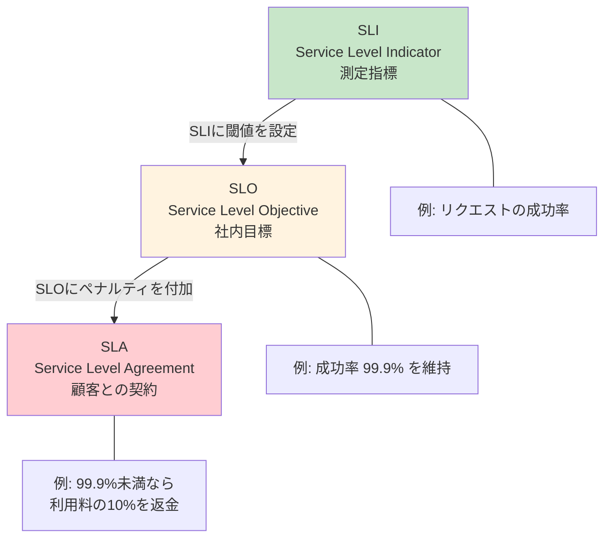
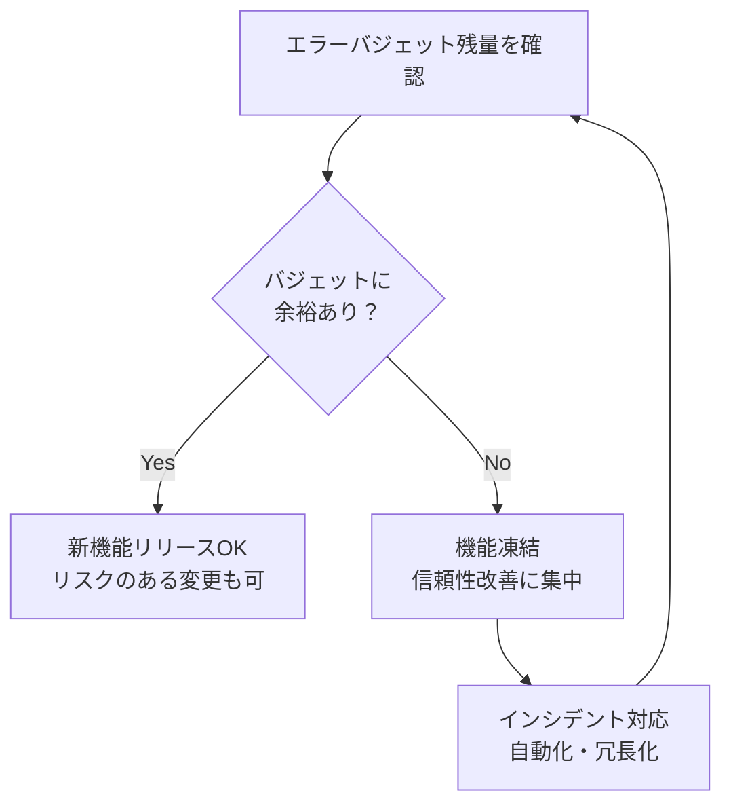
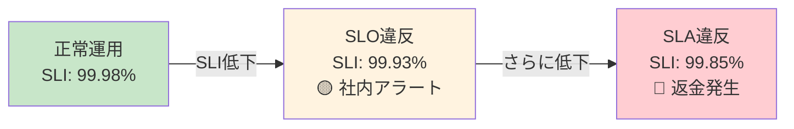

# SLI・SLO・SLA（Service Level Indicators, Objectives, and Agreements）

> **一言で言うと:** SLI（何を測るか）→ SLO（どこまで許容するか）→ SLA（守れなかったらどうなるか）の3層構造で、サービスの信頼性目標を定量的に定義・運用する枠組み。Google SREが体系化した。

## なぜ3つに分かれているのか

「サービスの信頼性」を議論するとき、以下の3つの問いは本質的に異なる:

1. **何を測定するか？** → SLI
2. **どの水準を目標とするか？** → SLO
3. **目標を守れなかったとき、ビジネス上の責任は？** → SLA

これらを混同すると「99.99%の可用性」という数字だけが一人歩きし、何をもって可用性とするのか、誰に対する約束なのかが曖昧になる。



## SLI（Service Level Indicator）--- 何を測るか

SLIはサービスの健全性を定量的に表す**測定指標**。良いSLIは「ユーザー体験に直結する数値」である。

### 代表的なSLI

| SLI | 定義 | 測定方法 |
|-----|------|---------|
| **可用性（Availability）** | 成功したリクエスト数 / 総リクエスト数 | HTTPステータスコード 5xx の割合 |
| **レイテンシ（Latency）** | リクエストの処理時間 | p50, p90, p99 のレスポンスタイム |
| **スループット（Throughput）** | 単位時間あたりの処理量 | req/sec |
| **エラー率（Error Rate）** | 失敗リクエストの割合 | 5xx / total requests |
| **正確性（Correctness）** | 正しい結果を返した割合 | テスト注入やデータ検証で測定 |
| **鮮度（Freshness）** | データが最新であるまでの遅延 | 最終更新からの経過時間 |

### 良いSLIの条件

- **ユーザー体験に直結する**: CPU使用率は内部メトリクスであり、SLIとしては不適切。ユーザーが感じる「レスポンスの速さ」「エラーの少なさ」を測る
- **測定が安定している**: 再現性があり、ノイズが少ない
- **改善可能**: 値が悪化したとき、エンジニアリングで改善できる指標

```python
# SLIの計算例: 可用性
# Prometheusクエリ（PromQL）

# 直近30日間の可用性SLI
# = 成功リクエスト数 / 総リクエスト数
availability_sli = """
  sum(rate(http_requests_total{status!~"5.."}[30d]))
  /
  sum(rate(http_requests_total[30d]))
"""
# 結果例: 0.9995 → 99.95%

# レイテンシSLI（p99が300ms以内のリクエストの割合）
latency_sli = """
  sum(rate(http_request_duration_seconds_bucket{le="0.3"}[30d]))
  /
  sum(rate(http_request_duration_seconds_count[30d]))
"""
# 結果例: 0.998 → 99.8%のリクエストが300ms以内
```

## SLO（Service Level Objective）--- どこまで許容するか

SLOはSLIに対する**社内目標値**。「可用性SLIを99.9%以上に維持する」という形で定義する。SLOは顧客との契約ではなく、チーム内のエンジニアリング判断の基準。

### SLOの決め方

**100%を目標にしてはいけない。** 100%の可用性は、変更を一切加えない（デプロイしない）ことを意味する。SLOの本質は「どこまでの障害を許容するか」を明示すること。

| SLO | 月間許容ダウンタイム | 年間許容ダウンタイム |
|-----|-------------------|-------------------|
| 99%（two nines） | 7時間12分 | 3日15時間 |
| 99.9%（three nines） | 43分12秒 | 8時間46分 |
| 99.95% | 21分36秒 | 4時間23分 |
| 99.99%（four nines） | 4分19秒 | 52分34秒 |
| 99.999%（five nines） | 26秒 | 5分15秒 |

### エラーバジェット（Error Budget）

SLOから導出される「許容される障害の量」がエラーバジェット。SLOが99.9%なら、エラーバジェットは0.1%。

```
エラーバジェット = 1 - SLO目標値
```

**エラーバジェットの使い方:**



エラーバジェットは「開発速度と信頼性のバランス」を定量的に取るための仕組み。バジェットが残っていれば積極的にリリースし、枯渇したら信頼性改善に集中する。

### SLO設定の実装例

```typescript
// SLOモニタリングの概念的な実装（Node.js）
interface SLOConfig {
  name: string;
  sliQuery: string;    // PromQL等のクエリ
  target: number;       // 目標値（0-1）
  windowDays: number;   // 計測ウィンドウ（日）
}

const slos: SLOConfig[] = [
  {
    name: 'API Availability',
    sliQuery: 'sum(rate(http_requests_total{status!~"5.."}[30d])) / sum(rate(http_requests_total[30d]))',
    target: 0.999,     // 99.9%
    windowDays: 30,
  },
  {
    name: 'API Latency (p99 < 300ms)',
    sliQuery: 'sum(rate(http_request_duration_seconds_bucket{le="0.3"}[30d])) / sum(rate(http_request_duration_seconds_count[30d]))',
    target: 0.99,      // 99%
    windowDays: 30,
  },
];

function calculateErrorBudget(slo: SLOConfig, currentSli: number) {
  const totalBudget = 1 - slo.target;           // 0.001（0.1%）
  const consumed = Math.max(0, slo.target - currentSli); // 目標との差分
  const remainingRatio = 1 - (consumed / totalBudget);

  return {
    name: slo.name,
    target: `${(slo.target * 100).toFixed(2)}%`,
    current: `${(currentSli * 100).toFixed(3)}%`,
    budgetTotal: `${(totalBudget * 100).toFixed(2)}%`,
    budgetRemaining: `${(remainingRatio * 100).toFixed(1)}%`,
    canRelease: remainingRatio > 0.25,  // バジェット25%以上残っていればリリースOK
  };
}

// 使用例
console.log(calculateErrorBudget(slos[0], 0.9985));
// {
//   name: 'API Availability',
//   target: '99.90%',
//   current: '99.850%',
//   budgetTotal: '0.10%',
//   budgetRemaining: '50.0%',    ← バジェットの半分消費
//   canRelease: true
// }
```

### Prometheus + Grafana でのSLOアラート

```yaml
# Prometheus アラートルール
groups:
  - name: slo_alerts
    rules:
      # エラーバジェットの消費速度が速すぎる場合のアラート
      # （Burn Rate Alert — Google SRE Workbook推奨）
      - alert: HighErrorBudgetBurn
        expr: |
          (
            sum(rate(http_requests_total{status=~"5.."}[1h]))
            /
            sum(rate(http_requests_total[1h]))
          ) > (14.4 * 0.001)
        for: 5m
        labels:
          severity: critical
        annotations:
          summary: "エラーバジェットの消費速度が14.4倍 — 1時間以内の対応が必要"
          runbook_url: "https://wiki.example.com/runbooks/high-error-rate"

      # 長期的なバジェット消費（緩やかだが持続的な劣化）
      - alert: SlowErrorBudgetBurn
        expr: |
          (
            sum(rate(http_requests_total{status=~"5.."}[6h]))
            /
            sum(rate(http_requests_total[6h]))
          ) > (6 * 0.001)
        for: 30m
        labels:
          severity: warning
        annotations:
          summary: "エラーバジェットの消費が通常の6倍 — 調査が必要"
```

## SLA（Service Level Agreement）--- 守れなかったらどうなるか

SLAはSLOに**法的拘束力のあるペナルティ**を付加した顧客との契約。SLAはビジネス/法務の領域であり、エンジニアが直接設定するものではない。

### SLAの一般的な構造

| 項目 | 内容 |
|------|------|
| **対象指標** | 月間可用性（Monthly Uptime Percentage）が最も一般的 |
| **計測方法** | `100% - (ダウンタイム分数 / 月間総分数)` |
| **ペナルティ** | SLA未達時のサービスクレジット（利用料の返金） |
| **除外事項** | 計画メンテナンス、顧客起因の障害、不可抗力 |

### 主要クラウドサービスのSLA例

| サービス | SLA | ペナルティ |
|---------|-----|----------|
| **AWS EC2** | 99.99%（マルチAZ） | < 99.99%: 10%返金、< 99.0%: 30%返金 |
| **AWS S3** | 99.9% | < 99.9%: 10%返金、< 99.0%: 25%返金 |
| **GCP Compute Engine** | 99.99%（マルチゾーン） | < 99.99%: 10%返金、< 99.0%: 50%返金 |
| **Azure VM** | 99.99%（Availability Zone利用時） | 段階的な返金 |

### SLO と SLA の関係

**SLOはSLAより厳しく設定する。** SLAが99.9%なら、SLOは99.95%程度に設定する。SLO違反の時点で対応を開始することで、SLA違反（ペナルティ発生）を未然に防ぐ。



## よくある落とし穴

### 1. SLOを「可用性99.99%」だけで定義する

可用性は1つの側面に過ぎない。API自体が動いていても、レスポンスに5秒かかればユーザー体験は壊れている。可用性 + レイテンシ + 正確性など、複数のSLIに対してSLOを設定すべき。

### 2. SLOを100%に設定する（または限りなく100%に近づける）

100%のSLOは「一切の障害を許さない」を意味し、以下の問題を生む:
- デプロイが恐怖になる（1回の障害でSLO違反）
- エラーバジェットが常にゼロ → 新機能開発が永久停止
- 非現実的な期待をステークホルダーに与える

### 3. SLAとSLOを同じ値にする

SLAはペナルティを伴う契約であり、SLOはチーム内の目標。SLOをSLAと同じにすると、SLO違反 = 即ペナルティとなり、バッファがない。SLOはSLAより厳しい値にして、SLA違反前に対応する猶予を確保する。

### 4. SLIの計測方法がSLOの定義と一致しない

「可用性99.9%」と定義しても、計測方法が「5分間隔のヘルスチェックの成功率」なら、ヘルスチェック間の短時間障害は検知されない。SLOの定義と整合する計測方法（全リクエストベース、RUMベース等）を選択する。

## 関連トピック

- [[モニタリング]] --- 親トピック。SLI/SLOはモニタリング戦略の中核
- [[ロードバランシング]] --- LBのメトリクス（5xxレート、レイテンシ）はSLIの主要なデータソース
- [[CoreWebVitals]] --- フロントエンドのSLIとしてCore Web Vitalsを採用するケースがある
- [[非同期処理とメッセージキュー]] --- キューの処理遅延もSLIの対象になりうる

## 参考リソース

- [Google SRE Book - Chapter 4: Service Level Objectives](https://sre.google/sre-book/service-level-objectives/) --- SLI/SLO/SLAの原典。無料公開
- [Google SRE Workbook - Chapter 2: Implementing SLOs](https://sre.google/workbook/implementing-slos/) --- SLOの実装ガイド。エラーバジェットとBurn Rateアラートの詳細
- [The Art of SLOs（Google Cloud）](https://cloud.google.com/blog/products/management-tools/practical-guide-to-setting-slos) --- SLO設定の実践ガイド
