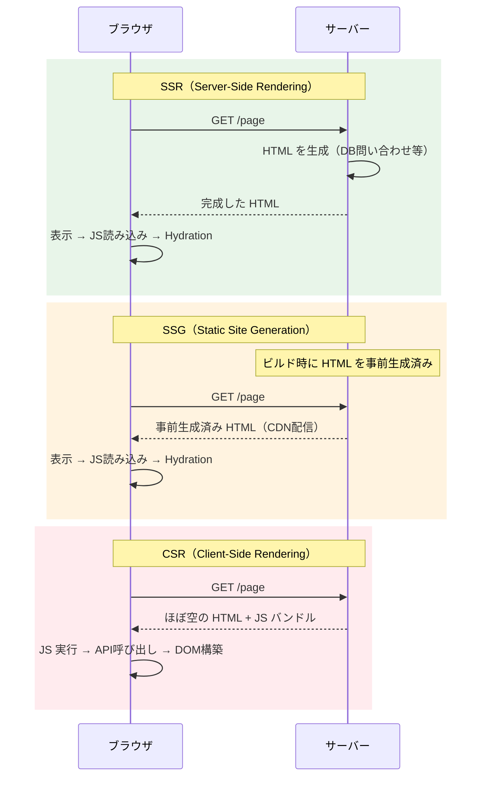
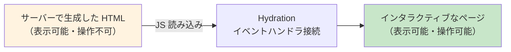
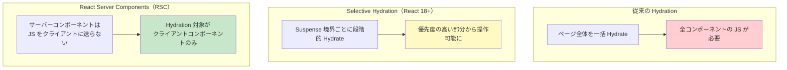

# SSR・SSG・CSR（Server-Side Rendering / Static Site Generation / Client-Side Rendering）

> **一言で言うと:** Webページの HTML を「どこで・いつ生成するか」の3つの戦略。SSR はリクエスト時にサーバーで、SSG はビルド時に事前生成、CSR はブラウザ上で JavaScript が DOM を構築する。選択は初期表示速度・動的性・インフラコストのトレードオフ。

## 概念

ブラウザが表示する HTML の[[DOMツリーとノード|DOMツリー]]は、どこかで生成されなければならない。その「どこで・いつ」を決めるのがレンダリング戦略である。



### 比較表

| 観点 | SSR | SSG | CSR |
|------|-----|-----|-----|
| HTML 生成タイミング | リクエスト時 | ビルド時 | ブラウザ上（実行時） |
| 初回表示速度（LCP） | 速い | 最速（CDN配信） | 遅い（JS実行待ち） |
| SEO | 良好 | 良好 | 不利（クローラがJSを実行しない場合） |
| 動的コンテンツ | 対応（リクエストごとに生成） | 不得意（再ビルドが必要） | 得意 |
| サーバー負荷 | 高い（リクエストごとにレンダリング） | 低い（静的ファイル配信） | 低い（API のみ） |
| TTFB | サーバー処理時間に依存 | 非常に短い | 短い（空HTML） |
| 代表的フレームワーク | Next.js, Nuxt, Rails | Next.js, Astro, Hugo | React SPA, Vue SPA |

## Hydration（ハイドレーション）

SSR/SSG で配信された HTML は「見た目はあるがインタラクティブでない」静的な状態。ブラウザ側で JavaScript がこの HTML に**イベントハンドラやステートを接続する**プロセスが Hydration。



**Hydration の問題点:**

- **TTI（Time to Interactive）の遅延** — HTML は表示されているのにボタンが反応しない「不気味の谷」が発生する
- **JS バンドルの二重コスト** — サーバーでレンダリングした HTML と同じコンポーネントツリーをクライアントでも再構築する

### Selective Hydration と React Server Components

この問題に対する最新のアプローチ:



## コード例

### Next.js での SSR（App Router）

```typescript
// app/products/[id]/page.tsx — サーバーコンポーネント（デフォルト）
// リクエストのたびにサーバーで実行される

interface Props {
  params: Promise<{ id: string }>;
}

export default async function ProductPage({ params }: Props) {
  const { id } = await params;
  // サーバー上で直接 DB にアクセスできる（API エンドポイント不要）
  const product = await db.product.findUnique({ where: { id } });

  if (!product) notFound();

  return (
    <main>
      <h1>{product.name}</h1>
      <p>{product.description}</p>
      <p>¥{product.price.toLocaleString()}</p>
      {/* クライアントコンポーネントはここだけ Hydration される */}
      <AddToCartButton productId={product.id} />
    </main>
  );
}
```

```typescript
// app/products/[id]/AddToCartButton.tsx
"use client"; // クライアントコンポーネントとして明示

import { useState } from "react";

export function AddToCartButton({ productId }: { productId: string }) {
  const [added, setAdded] = useState(false);

  const handleClick = async () => {
    await fetch("/api/cart", {
      method: "POST",
      body: JSON.stringify({ productId }),
    });
    setAdded(true);
  };

  return (
    <button onClick={handleClick} disabled={added}>
      {added ? "追加済み" : "カートに追加"}
    </button>
  );
}
```

### Nuxt 3 での SSR

```vue
// pages/products/[id].vue
<script setup lang="ts">
const route = useRoute();

// useFetch はサーバー上で実行され、結果がシリアライズされてクライアントに渡される
const { data: product } = await useFetch(`/api/products/${route.params.id}`);
</script>

<template>
  <main v-if="product">
    <h1>{{ product.name }}</h1>
    <p>{{ product.description }}</p>
    <p>¥{{ product.price.toLocaleString() }}</p>
  </main>
</template>
```

### Go での SSR（html/template）

```go
package main

import (
	"html/template"
	"net/http"
)

type Product struct {
	ID    string
	Name  string
	Price int
}

var tmpl = template.Must(template.ParseFiles("product.html"))

func productHandler(w http.ResponseWriter, r *http.Request) {
	id := r.PathValue("id")
	product, err := db.FindProduct(id)
	if err != nil {
		http.NotFound(w, r)
		return
	}
	// サーバー上で HTML を生成してレスポンスに書き込む
	tmpl.Execute(w, product)
}
```

## よくある落とし穴

### 1. SSR で `window` / `document` にアクセスする

SSR はサーバー（Node.js / Deno）で実行されるため、ブラウザ API は存在しない。

```typescript
// ❌ サーバーで実行されるとクラッシュ
export default function Page() {
  const width = window.innerWidth; // ReferenceError: window is not defined
  return <div>Width: {width}</div>;
}

// ✅ クライアントでのみ実行されるようにガードする
"use client";
import { useState, useEffect } from "react";

export function WindowWidth() {
  const [width, setWidth] = useState(0);
  useEffect(() => {
    setWidth(window.innerWidth);
  }, []);
  return <div>Width: {width}</div>;
}
```

### 2. Hydration Mismatch

サーバーで生成した HTML とクライアントの初回レンダリング結果が一致しないと、React が警告を出し、最悪の場合ページ全体を再レンダリングする。

```typescript
// ❌ サーバーとクライアントで異なる結果になる
export default function Page() {
  return <p>現在時刻: {new Date().toLocaleTimeString()}</p>;
  // サーバーの時刻とクライアントの時刻が異なる → Mismatch
}

// ✅ 動的な値はクライアントでのみ設定する
"use client";
import { useState, useEffect } from "react";

export function Clock() {
  const [time, setTime] = useState<string | null>(null);
  useEffect(() => {
    setTime(new Date().toLocaleTimeString());
  }, []);
  return <p>現在時刻: {time ?? "読み込み中..."}</p>;
}
```

### 3. SSR + シングルトンの状態汚染

サーバーサイドでモジュールスコープの変数（[[シングルトンパターン|シングルトン]]）を使うと、異なるリクエスト間で状態が共有されてしまう。

```typescript
// ❌ モジュールスコープのキャッシュがリクエスト間でリークする
const cache = new Map<string, User>();

app.get("/users/:id", async (req, res) => {
  if (!cache.has(req.params.id)) {
    cache.set(req.params.id, await db.findUser(req.params.id));
  }
  res.json(cache.get(req.params.id));
  // cache が際限なく成長し、メモリリーク + 古いデータを返し続ける
});
```

### 4. SSG で動的データに依存する

SSG はビルド時に HTML を生成するため、頻繁に変わるデータには不向き。在庫数や価格が古いまま表示されるリスクがある。ISR（Incremental Static Regeneration）で緩和できるが、データの鮮度要件を見極めること。

## 実務での使用シーン

| シーン | 推奨戦略 | 理由 |
|--------|---------|------|
| ブログ・ドキュメントサイト | SSG | コンテンツが静的。CDN で高速配信 |
| ECサイトの商品ページ | SSR or ISR | SEO重要 + 在庫・価格が動的 |
| 管理画面（ダッシュボード） | CSR | SEO不要。認証後のみアクセス |
| SNSのタイムライン | SSR + Streaming | 初回表示を速くしつつリアルタイム性も必要 |
| LP（ランディングページ） | SSG | 最速の LCP が必要。[[CoreWebVitals]] に直結 |

## 関連トピック

- [[DOMと仮想DOM]] — SSR はサーバー上で仮想DOMをHTMLに変換し、クライアントで Hydration により仮想DOMを再接続する
- [[CoreWebVitals]] — SSR/SSG は LCP の改善に直結する。CSR は LCP が悪化しやすい
- [[コンポーネント設計]] — Server Components と Client Components の境界設計は、SSR 時代のコンポーネント設計の新たな関心事
- [[メモリリーク]] — SSR 環境でのシングルトンやモジュールスコープ変数は、リクエスト間の状態リークの原因になる
- [[CDN]] — SSG との親和性が高い。SSR でも Edge Runtime で CDN エッジでレンダリングする戦略がある

## 参考リソース

- [Next.js - Rendering](https://nextjs.org/docs/app/building-your-application/rendering) — App Router のレンダリング戦略の公式解説
- [Patterns.dev - Rendering Patterns](https://www.patterns.dev/react/rendering-introduction/) — SSR/SSG/CSR/ISR を含むレンダリングパターンの体系的解説
- [web.dev - Rendering on the Web](https://web.dev/articles/rendering-on-the-web) — Google による各レンダリング戦略の比較と推奨
