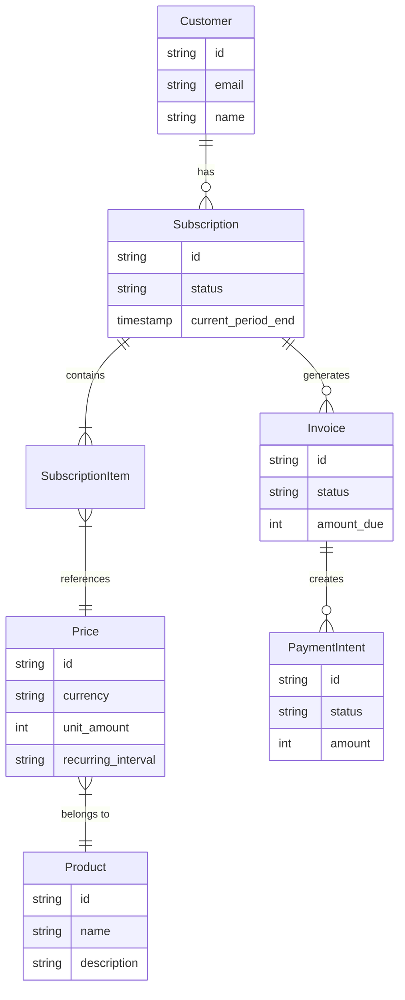
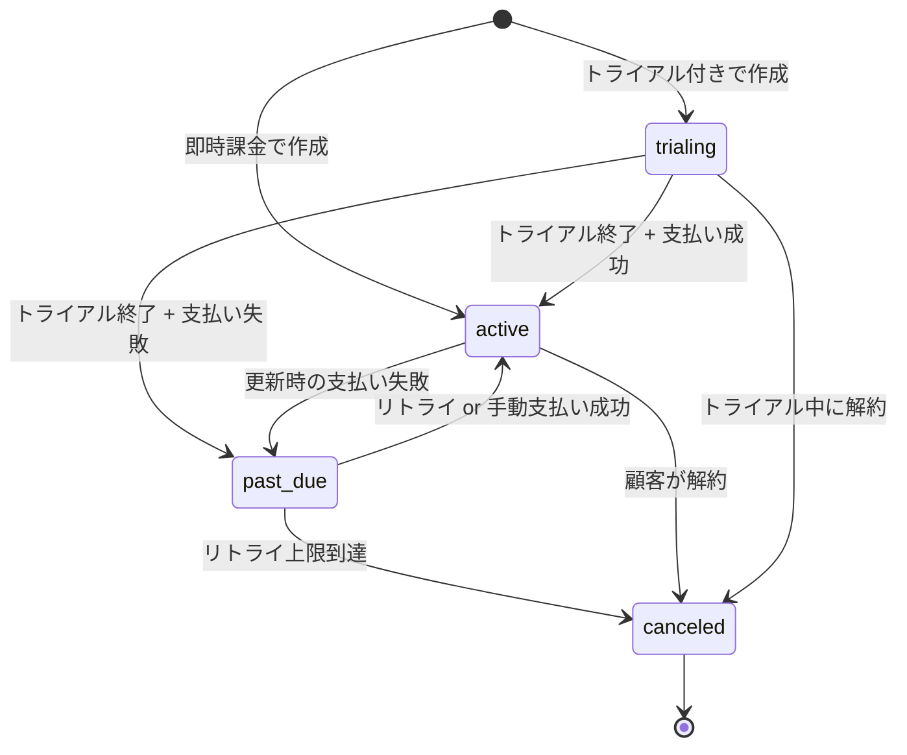
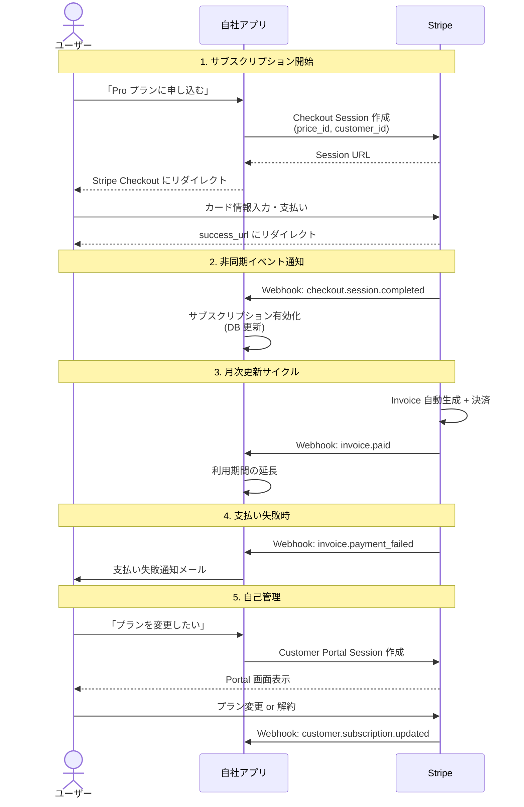
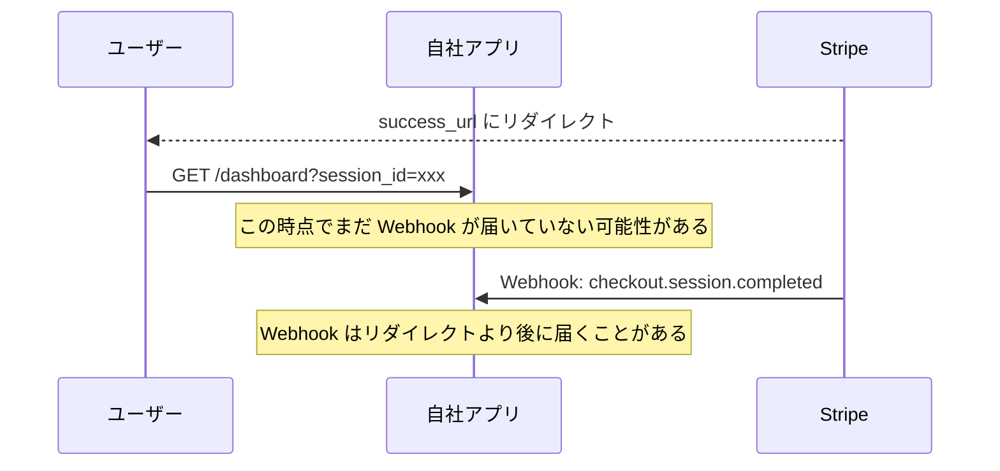

# Stripe による SaaS 決済実装（Stripe Billing Integration）

> **一言で言うと:** Stripe は決済インフラを API として提供するプラットフォームで、SaaS アプリケーションのサブスクリプション課金を「Checkout Session の作成 → Webhook でのイベント受信 → Customer Portal での自己管理」という3つの統合ポイントで実現する。開発者はカード情報を一切扱わずに、定額・従量・階段型など多様な課金モデルを実装できる。

## Stripe の全体像

Stripe は「決済のための REST API」として設計されている。SaaS 開発者が主に利用するのは以下の機能群:

| 機能 | 役割 | 使いどころ |
|------|------|-----------|
| **Checkout** | ホスト型決済ページ | サブスクリプション申込み、アップグレード |
| **Billing** | サブスクリプション管理・請求書自動発行 | 月次/年次の定期課金 |
| **Customer Portal** | 顧客がプラン変更・解約を自己管理する画面 | カスタマーサポート工数の削減 |
| **Elements** | 埋め込み型決済 UI コンポーネント | 自社ブランドの決済体験が必要な場合 |
| **Webhooks** | サーバーへのイベント通知 | 支払い成功/失敗の非同期処理 |
| **Payment Intents** | 個別決済の作成・確認 | 単発決済、3D セキュア対応 |

### 主要オブジェクトの関係



## 主要オブジェクトモデル

### Product と Price — 「何を」「いくらで」売るか

Stripe は「商品」と「価格」を分離している。1つの Product に複数の Price を紐付けることで、同じ商品の月額/年額プランや通貨違いを表現する。

| オブジェクト | 役割 | 例 |
|-------------|------|-----|
| **Product** | 販売する商品やサービスの定義 | 「Pro プラン」「Enterprise プラン」 |
| **Price** | 具体的な価格設定（通貨・間隔・金額） | 「Pro プラン 月額 ¥2,980」「Pro プラン 年額 ¥29,800」 |

**価格モデルの種類:**

| モデル | 説明 | 例 |
|--------|------|-----|
| **定額（flat_rate）** | 固定金額の定期課金 | 月額 ¥980 |
| **従量課金（metered）** | 使用量に応じた課金 | API コール 1,000回あたり ¥100 |
| **段階型（tiered）** | 使用量の段階で単価が変わる | 1-100ユーザー: ¥500/人、101-500: ¥400/人 |
| **ユーザー数課金（per_seat）** | ユーザー数 × 単価 | ¥1,000/ユーザー/月 |

### Customer — 「誰が」支払うか

Stripe 上の顧客情報。自社アプリのユーザーと 1:1 で対応させ、自社 DB に `stripe_customer_id` を保存して紐付ける。

### Subscription — 課金の状態機械

Subscription は以下の状態遷移を持つ。特に `past_due` → `canceled` の自動遷移がビジネスロジックに大きく影響する。



### Invoice と PaymentIntent — 「いつ」「いくら」請求するか

- **Invoice**: サブスクリプションの更新時に自動生成される請求書。明細行（line items）を持つ
- **PaymentIntent**: Invoice に紐づく実際の決済試行。3D セキュア等の認証フローを管理する

## SaaS 決済フローの全体像

典型的な SaaS サブスクリプションの流れ:



### Hosted Checkout vs Embedded Elements

| 観点 | Hosted Checkout | Embedded Elements |
|------|----------------|-------------------|
| 実装コスト | 低い（URL にリダイレクトするだけ） | 高い（UI コンポーネントの埋め込み + JS 統合） |
| ブランド体験 | Stripe のデザイン（カスタマイズ限定的） | 完全にカスタム可能 |
| PCI 準拠の負担 | 最小（SAQ A） | 最小（SAQ A）— Payment Element は iframe 経由のため Checkout と同等 |
| 3D セキュア | 自動対応 | 自分で PaymentIntent の確認フローを実装 |
| 推奨ケース | MVP・初期リリース・管理画面 | ブランド体験が重要なプロダクト |

**実務での推奨:** まず Hosted Checkout で始め、ブランド体験が重要になった段階で Elements に移行する。

## 実装例: サブスクリプション決済

### TypeScript（Node.js）— Checkout Session の作成

```typescript
import Stripe from 'stripe';
import express from 'express';

const stripe = new Stripe(process.env.STRIPE_SECRET_KEY!);
const app = express();

// Checkout Session を作成し、Stripe の決済ページにリダイレクトさせる
app.post('/api/checkout', async (req, res) => {
  const { priceId, customerId } = req.body;

  const session = await stripe.checkout.sessions.create({
    customer: customerId,           // 自社DBのユーザーに紐づく Stripe Customer ID
    mode: 'subscription',
    line_items: [{ price: priceId, quantity: 1 }],
    success_url: `${process.env.APP_URL}/dashboard?session_id={CHECKOUT_SESSION_ID}`,
    cancel_url: `${process.env.APP_URL}/pricing`,
    subscription_data: {
      // トライアルを設定する場合
      trial_period_days: 14,
    },
  });

  res.json({ url: session.url });
});
```

### TypeScript（Node.js）— Webhook エンドポイント

```typescript
// 重要: Webhook エンドポイントでは express.json() ではなく express.raw() を使う
// 署名検証に生のリクエストボディが必要なため
app.post(
  '/webhooks/stripe',
  express.raw({ type: 'application/json' }),
  async (req, res) => {
    const sig = req.headers['stripe-signature']!;
    let event: Stripe.Event;

    try {
      // 署名を検証 — これを省略すると誰でも偽のイベントを送れる
      event = stripe.webhooks.constructEvent(
        req.body,
        sig,
        process.env.STRIPE_WEBHOOK_SECRET!
      );
    } catch (err) {
      console.error('Webhook signature verification failed:', err);
      return res.status(400).send('Invalid signature');
    }

    // イベント種別ごとに処理を分岐
    switch (event.type) {
      case 'checkout.session.completed': {
        const session = event.data.object as Stripe.Checkout.Session;
        // 自社DBでユーザーのサブスクリプションを有効化
        await activateSubscription(session.customer as string, session.subscription as string);
        break;
      }
      case 'invoice.paid': {
        const invoice = event.data.object as Stripe.Invoice;
        // 利用期間を延長
        await extendSubscriptionPeriod(invoice.customer as string);
        break;
      }
      case 'invoice.payment_failed': {
        const invoice = event.data.object as Stripe.Invoice;
        // 支払い失敗をユーザーに通知
        await notifyPaymentFailure(invoice.customer as string);
        break;
      }
      case 'customer.subscription.deleted': {
        const subscription = event.data.object as Stripe.Subscription;
        // サブスクリプションを無効化
        await deactivateSubscription(subscription.customer as string);
        break;
      }
    }

    // Stripe に 200 を返す（返さないとリトライされる）
    res.json({ received: true });
  }
);
```

### TypeScript（Node.js）— Customer Portal

```typescript
// 顧客がプラン変更・カード更新・解約を自分で行える画面
app.post('/api/portal', async (req, res) => {
  const { customerId } = req.body;

  const session = await stripe.billingPortal.sessions.create({
    customer: customerId,
    return_url: `${process.env.APP_URL}/dashboard`,
  });

  res.json({ url: session.url });
});
```

### Go — Webhook エンドポイント

```go
package main

import (
	"encoding/json"
	"io"
	"log"
	"net/http"
	"os"

	"github.com/stripe/stripe-go/v84"
	"github.com/stripe/stripe-go/v84/webhook"
)

func handleWebhook(w http.ResponseWriter, r *http.Request) {
	// リクエストボディの上限を設定（大きすぎるペイロードを拒否）
	r.Body = http.MaxBytesReader(w, r.Body, 65536)
	body, err := io.ReadAll(r.Body)
	if err != nil {
		http.Error(w, "read error", http.StatusBadRequest)
		return
	}

	// 署名検証
	sigHeader := r.Header.Get("Stripe-Signature")
	event, err := webhook.ConstructEvent(body, sigHeader, os.Getenv("STRIPE_WEBHOOK_SECRET"))
	if err != nil {
		log.Printf("Webhook signature verification failed: %v", err)
		http.Error(w, "invalid signature", http.StatusBadRequest)
		return
	}

	switch event.Type {
	case "checkout.session.completed":
		var session stripe.CheckoutSession
		if err := json.Unmarshal(event.Data.Raw, &session); err != nil {
			log.Printf("parse error: %v", err)
			http.Error(w, "parse error", http.StatusBadRequest)
			return
		}
		// 自社DBでサブスクリプションを有効化
		activateSubscription(session.Customer.ID, session.Subscription.ID)

	case "invoice.paid":
		var invoice stripe.Invoice
		if err := json.Unmarshal(event.Data.Raw, &invoice); err != nil {
			log.Printf("parse error: %v", err)
			http.Error(w, "parse error", http.StatusBadRequest)
			return
		}
		extendSubscriptionPeriod(invoice.Customer.ID)

	case "invoice.payment_failed":
		var invoice stripe.Invoice
		if err := json.Unmarshal(event.Data.Raw, &invoice); err != nil {
			log.Printf("parse error: %v", err)
			http.Error(w, "parse error", http.StatusBadRequest)
			return
		}
		notifyPaymentFailure(invoice.Customer.ID)

	case "customer.subscription.deleted":
		var sub stripe.Subscription
		if err := json.Unmarshal(event.Data.Raw, &sub); err != nil {
			log.Printf("parse error: %v", err)
			http.Error(w, "parse error", http.StatusBadRequest)
			return
		}
		deactivateSubscription(sub.Customer.ID)
	}

	w.WriteHeader(http.StatusOK)
	w.Write([]byte(`{"received": true}`))
}

func main() {
	stripe.Key = os.Getenv("STRIPE_SECRET_KEY")
	http.HandleFunc("/webhooks/stripe", handleWebhook)
	log.Fatal(http.ListenAndServe(":8080", nil))
}
```

### Go — Checkout Session の作成

```go
package main

import (
	"encoding/json"
	"net/http"
	"os"

	"github.com/stripe/stripe-go/v84"
	"github.com/stripe/stripe-go/v84/checkout/session"
)

type CheckoutRequest struct {
	PriceID    string `json:"priceId"`
	CustomerID string `json:"customerId"`
}

func handleCheckout(w http.ResponseWriter, r *http.Request) {
	var req CheckoutRequest
	if err := json.NewDecoder(r.Body).Decode(&req); err != nil {
		http.Error(w, "invalid request", http.StatusBadRequest)
		return
	}

	trialDays := int64(14)
	params := &stripe.CheckoutSessionParams{
		Customer: stripe.String(req.CustomerID),
		Mode:     stripe.String(string(stripe.CheckoutSessionModeSubscription)),
		LineItems: []*stripe.CheckoutSessionLineItemParams{
			{Price: stripe.String(req.PriceID), Quantity: stripe.Int64(1)},
		},
		SuccessURL: stripe.String(os.Getenv("APP_URL") + "/dashboard?session_id={CHECKOUT_SESSION_ID}"),
		CancelURL:  stripe.String(os.Getenv("APP_URL") + "/pricing"),
		SubscriptionData: &stripe.CheckoutSessionSubscriptionDataParams{
			TrialPeriodDays: &trialDays,
		},
	}

	s, err := session.New(params)
	if err != nil {
		http.Error(w, "checkout session creation failed", http.StatusInternalServerError)
		return
	}

	w.Header().Set("Content-Type", "application/json")
	json.NewEncoder(w).Encode(map[string]string{"url": s.URL})
}
```

## Webhook の設計と信頼性

Webhook は Stripe → 自社サーバーへの HTTP POST 通知であり、SaaS 課金システムの**最も重要な統合ポイント**。

### 署名検証の仕組み

Stripe は Webhook 送信時に `Stripe-Signature` ヘッダを付与する。これは Webhook Secret（`whsec_...`）を鍵とした HMAC-SHA256 署名で、ペイロードの改ざんとリプレイ攻撃を防ぐ。

```
Stripe-Signature: t=1714123456,v1=5257a869e7e...
```

- `t`: タイムスタンプ（リプレイ攻撃防止に使用。SDK のデフォルトでは5分以上前の署名を拒否）
- `v1`: HMAC-SHA256 署名

**署名検証を省略した場合のリスク:**
- 攻撃者が偽の `checkout.session.completed` を送信し、支払いなしでサブスクリプションを有効化できる
- 偽の `invoice.paid` で無限に利用期間を延長できる

### 冪等性（Idempotency）

同じ Webhook イベントが**複数回配信される可能性がある**（ネットワーク障害、タイムアウト等）。処理の重複を防ぐために、`event.id` を記録して重複チェックする。

```typescript
async function handleWebhookEvent(event: Stripe.Event) {
  // event.id でDB検索し、処理済みならスキップ
  const existing = await db.webhookEvent.findUnique({
    where: { stripeEventId: event.id },
  });
  if (existing) {
    console.log(`Event ${event.id} already processed, skipping`);
    return;
  }

  // イベント処理（トランザクション内で処理記録も同時に保存）
  await db.$transaction(async (tx) => {
    await tx.webhookEvent.create({
      data: { stripeEventId: event.id, type: event.type },
    });
    await processEvent(tx, event);
  });
}
```

### リトライ挙動

| 条件 | Stripe の動作 |
|------|--------------|
| エンドポイントが 2xx を返す | 成功。リトライなし |
| 2xx 以外のレスポンス | 本番環境では最大**3日間**、指数バックオフでリトライ（サンドボックスでは数時間以内に3回） |
| 接続タイムアウト | 速やかに（数秒以内が推奨）レスポンスを返さないとタイムアウト扱い |
| エンドポイントが連続失敗 | Stripe Dashboard で警告、最終的に Webhook が無効化される |

**重要:** 重い処理（メール送信、外部 API 呼び出し等）は Webhook ハンドラ内で直接実行せず、メッセージキューに入れて非同期処理する。Webhook ハンドラ自体は即座に 200 を返す。

### 処理すべき主要イベント

| イベント | トリガー | 推奨アクション |
|---------|---------|---------------|
| `checkout.session.completed` | Checkout 完了 | サブスクリプション有効化、ウェルカムメール |
| `invoice.paid` | 請求書の支払い成功 | 利用期間の延長、領収書メール |
| `invoice.payment_failed` | 請求書の支払い失敗 | ユーザーへの通知、猶予期間の開始 |
| `customer.subscription.updated` | プラン変更・ステータス変更 | DB のプラン情報を同期 |
| `customer.subscription.deleted` | サブスクリプション終了 | 機能制限、データのアーカイブ |
| `customer.subscription.trial_will_end` | トライアル終了3日前 | リマインダーメール |

## テスト戦略

### Stripe CLI によるローカル Webhook テスト

```bash
# Stripe CLI をインストール後、ローカルにイベントを転送
stripe listen --forward-to localhost:3000/webhooks/stripe

# 別のターミナルからテストイベントを発火
stripe trigger checkout.session.completed
stripe trigger invoice.paid
stripe trigger customer.subscription.deleted
```

### テストモード API キー

Stripe はテスト環境と本番環境を API キーで完全に分離する:

| キー種別 | プレフィックス | 用途 |
|---------|--------------|------|
| テスト秘密鍵 | `sk_test_` | サーバーサイドのテスト |
| テスト公開鍵 | `pk_test_` | クライアントサイドのテスト |
| 本番秘密鍵 | `sk_live_` | 本番環境のみ |
| Webhook Secret | `whsec_` | Webhook 署名検証 |

### テストカード番号

| カード番号 | シナリオ |
|-----------|---------|
| `4242 4242 4242 4242` | 支払い成功 |
| `4000 0000 0000 3220` | 3D セキュア認証が必要 |
| `4000 0000 0000 0002` | カード拒否 |
| `4000 0000 0000 0341` | カード番号は通るが、支払い時に拒否 |

有効期限は未来の任意の日付、CVC は任意の3桁を使用する。

### Test Clocks — サブスクリプションのライフサイクルテスト

Test Clocks は Stripe 上の時間を仮想的に進める機能。通常は1ヶ月待たないと確認できない「更新」「トライアル終了」「支払い失敗のリトライ」を数分でテストできる。

```typescript
// Test Clock を作成し、時間を進める
const testClock = await stripe.testHelpers.testClocks.create({
  frozen_time: Math.floor(Date.now() / 1000),
});

// Test Clock に紐づく Customer を作成
const customer = await stripe.customers.create({
  test_clock: testClock.id,
  email: 'test@example.com',
});

// サブスクリプションを作成後、時間を1ヶ月先に進める
await stripe.testHelpers.testClocks.advance(testClock.id, {
  frozen_time: Math.floor(Date.now() / 1000) + 30 * 24 * 60 * 60,
});
// → invoice.paid イベントが自動発火される
```

## 落とし穴と注意点

### 1. 通貨の最小単位

Stripe の金額は**通貨の最小単位**で指定する。ゼロデシマル通貨（日本円など）はそのまま、その他はセント換算が必要。

| 通貨 | ¥1,000 の場合 | $10.00 の場合 |
|------|--------------|--------------|
| JPY（ゼロデシマル） | `amount: 1000` | — |
| USD | — | `amount: 1000`（= 10.00 ドル） |

```typescript
// ❌ よくあるミス: ドルをそのまま渡す
await stripe.prices.create({
  unit_amount: 10,    // $0.10 になってしまう
  currency: 'usd',
  // ...
});

// ✅ 正しい: セント単位で渡す
await stripe.prices.create({
  unit_amount: 1000,  // $10.00
  currency: 'usd',
  // ...
});
```

### 2. Webhook の順序保証がない

Stripe は `checkout.session.completed` が `customer.subscription.created` より先に届くことを保証しない。各イベントは**独立して冪等に処理できる**設計にする。

### 3. リダイレクトと Webhook のレースコンディション

Checkout 完了後、ユーザーが `success_url` にリダイレクトされるタイミングと `checkout.session.completed` Webhook が届くタイミングは不定。



**対策:** `success_url` 到達時に `session_id` で Checkout Session を API から直接取得し、ステータスを確認する。Webhook 到着を待たない。

```typescript
app.get('/dashboard', async (req, res) => {
  const sessionId = req.query.session_id as string;
  if (sessionId) {
    // Webhook を待たずに直接確認
    const session = await stripe.checkout.sessions.retrieve(sessionId);
    if (session.payment_status === 'paid') {
      await activateSubscription(session.customer as string, session.subscription as string);
    }
  }
  // ...
});
```

### 4. サブスクリプション状態遷移の複雑さ

`subscription.status` を単純な `active` / `inactive` の2値で管理すると、`past_due`（支払い失敗だがリトライ中）や `trialing`（無料トライアル中）の扱いで破綻する。Stripe のステータスをそのまま DB に保存し、ビジネスロジックで判定する。

```typescript
function hasAccess(status: Stripe.Subscription.Status): boolean {
  // trialing と active はアクセス可能
  // past_due は猶予期間としてアクセスを許可する場合もある
  return ['trialing', 'active', 'past_due'].includes(status);
}
```

### 5. PCI コンプライアンス

Stripe Checkout や Elements を使う限り、自社サーバーにカード情報が到達しない。以下を守れば PCI DSS の最も軽い準拠レベル（SAQ A）で済む:

- カード番号を自社サーバーに送信・保存しない
- Stripe.js / Checkout を経由して決済する
- HTTPS を使用する
- Stripe のダッシュボードで「PCI コンプライアンス」セクションを完了する

### 6. 冪等性キー（API 呼び出し側）

Webhook の冪等性とは別に、**Stripe API を呼び出す側**でもネットワーク障害で二重リクエストが発生しうる。`Idempotency-Key` ヘッダを使う。

```typescript
// 同じ Idempotency-Key で複数回リクエストしても1回だけ実行される
const session = await stripe.checkout.sessions.create(
  { /* params */ },
  { idempotencyKey: `checkout_${userId}_${priceId}_${Date.now()}` }
);
```

## AI による実装のアンチパターン

| アンチパターン | なぜ問題か | 対策 |
|---|---|---|
| Webhook 署名検証を省略する | テスト環境では動くが、本番で偽イベントによる不正アクセスが可能に | 署名検証を必ず実装し、テストでも Stripe CLI 経由で検証する |
| カード情報を自社サーバーで受け取る | PCI DSS 準拠の範囲が大幅に拡大し、監査コストが跳ね上がる | Checkout または Elements を使い、カード情報をサーバーに到達させない |
| Webhook 処理を同期的に実行し重い処理を含める | 20秒のタイムアウトでリトライの嵐が発生する | 即座に 200 を返し、実処理はキューに委譲する |
| success_url のリダイレクトだけでサブスクリプションを有効化する | ユーザーが URL を直接アクセスして不正に有効化できる | Webhook または API 直接確認で支払い状態を検証する |
| 全ての Subscription ステータスを boolean（active/inactive）で管理する | past_due, trialing 等の中間状態を表現できず、ビジネスロジックが破綻する | Stripe のステータス文字列をそのまま保存して判定する |

## 関連トピック

- [[API設計-REST-GraphQL]] — Stripe API 自体が REST API 設計の好例（リソース指向、一貫したエラー形式、バージョニング）
- [[認証と認可]] — API キー管理、Webhook 署名検証は認証の実践例
- [[エラーハンドリング]] — Stripe のエラーオブジェクト（`type`, `code`, `message`）はエラー設計のリファレンス
- [[バリデーション]] — Webhook ペイロードの検証、金額・通貨の整合性チェック

## 参考リソース

- Stripe 公式ドキュメント — Billing / Subscriptions セクション
- Stripe 公式ドキュメント — Webhooks のベストプラクティス
- Stripe 公式ドキュメント — Testing セクション（テストカード・Test Clocks）
- 「SaaS Billing Best Practices」 — Stripe の SaaS 向けガイド

## 学習メモ

- Stripe の API 設計は「良い REST API とは何か」の実例として非常に参考になる。リソース名の一貫性、展開可能なオブジェクト（`expand`）、カーソルベースのページネーション等、[[API設計-REST-GraphQL]]で学んだ原則が体現されている
- MVP では Hosted Checkout + Customer Portal の組み合わせが最も費用対効果が高い。自前の決済 UI は後回しにすべき
- Webhook の信頼性設計（署名検証・冪等性・非同期処理）は Stripe に限らず、外部サービス連携全般に適用できるパターン
