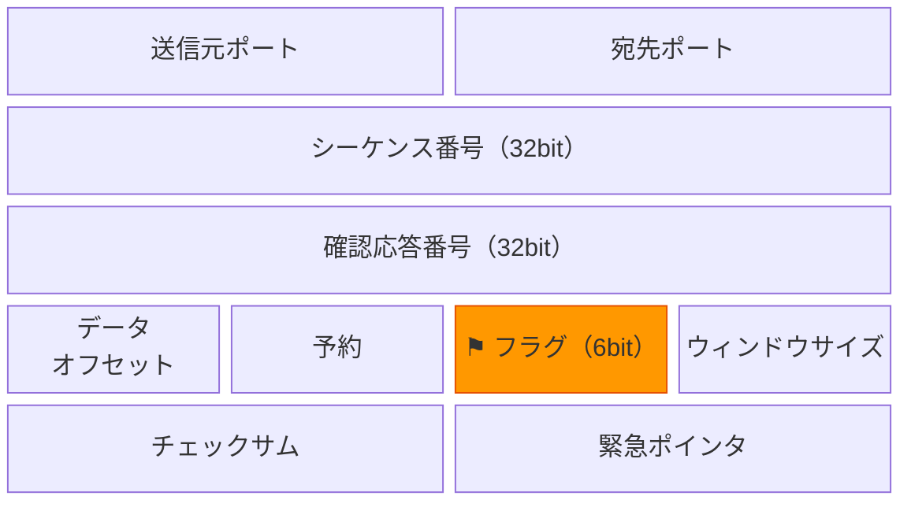
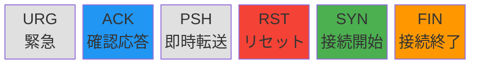
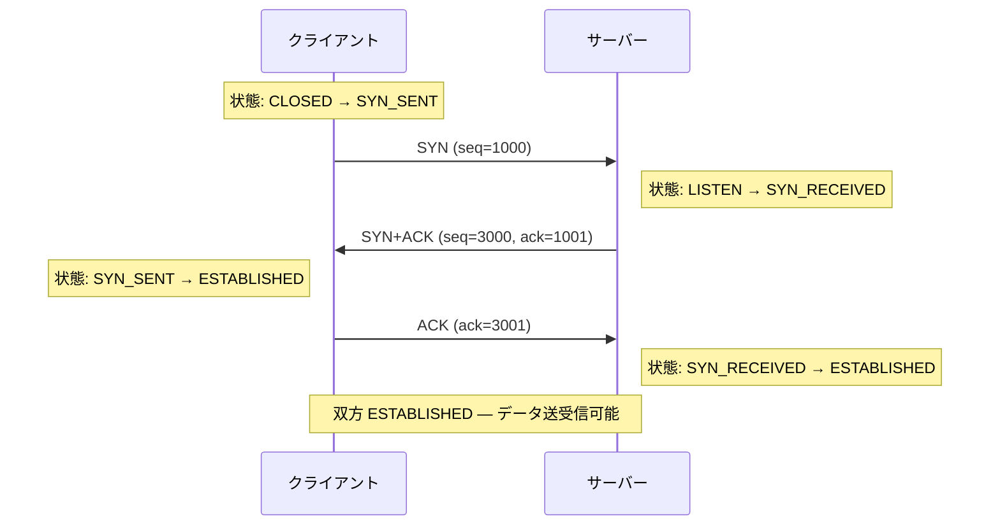
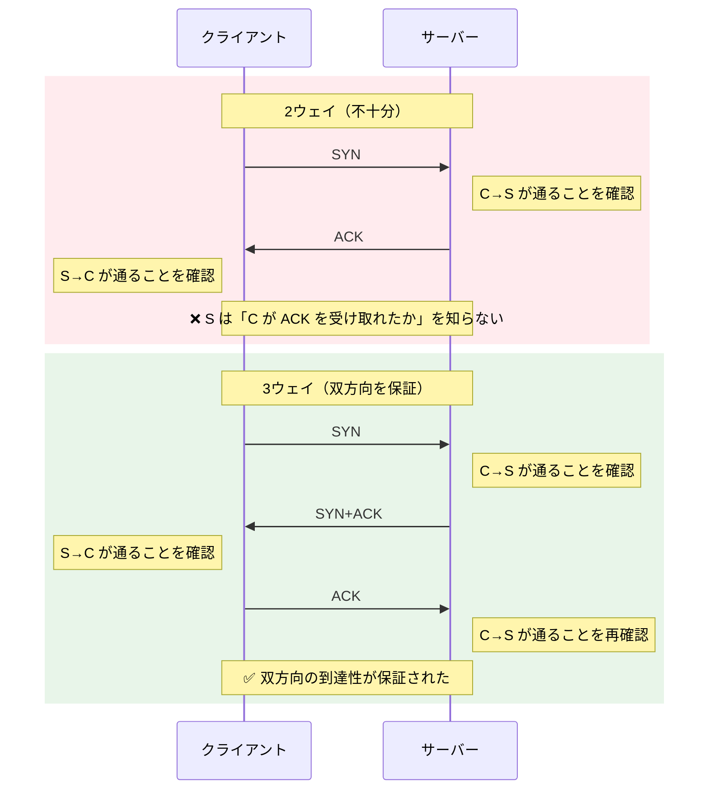
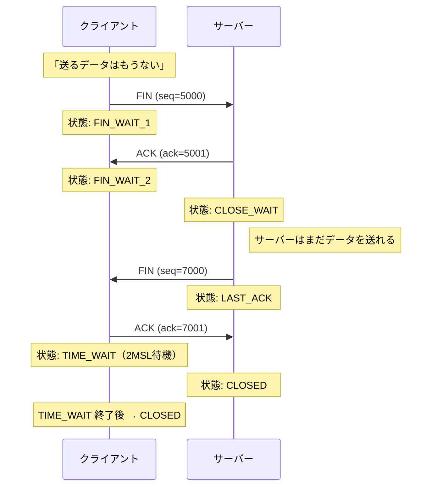
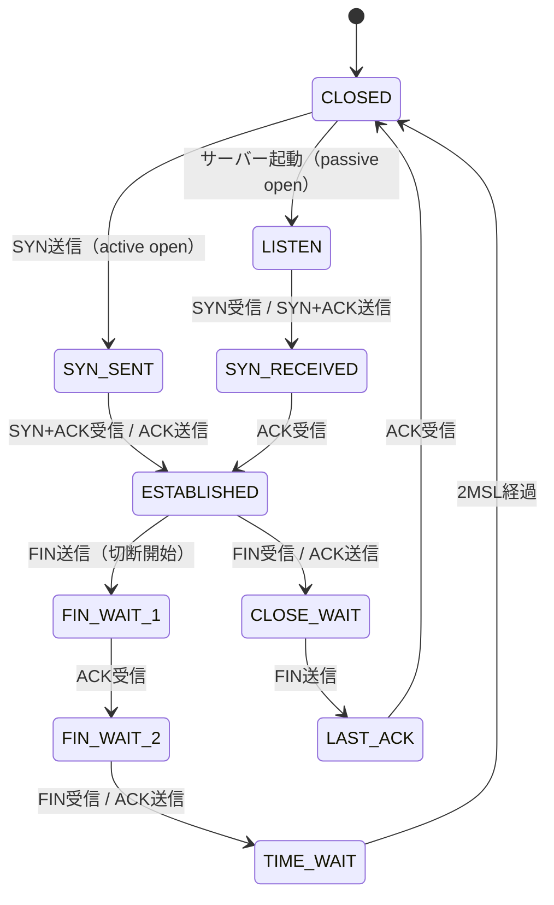

# TCPフラグとコネクション状態遷移（TCP Flags and Connection State Machine）

> **一言で言うと:** TCPヘッダには6つの制御フラグ（SYN, ACK, FIN, RST, PSH, URG）があり、これらの組み合わせでコネクションの確立・データ転送・切断という一連のライフサイクルを制御している。

## TCPヘッダの中のフラグ

TCPセグメント（パケット）のヘッダには、データの送受信を制御するための**フラグビット**が含まれている。各フラグは1ビット（オン/オフ）で、複数を同時にセットできる。



**⚑ フラグ部分の拡大:**



> 色付きの4つ（**SYN** / **ACK** / **FIN** / **RST**）がWeb開発で重要なフラグ。灰色の URG・PSH はアプリケーション開発者が意識する場面はほぼない。

## 6つのフラグの役割

| フラグ | 正式名 | 意味 | いつ使うか |
|--------|--------|------|-----------|
| **SYN** | Synchronize | 「接続を始めたい」 | コネクション確立の最初の合図 |
| **ACK** | Acknowledge | 「受け取った」 | ほぼすべてのセグメントに付く確認応答 |
| **FIN** | Finish | 「送信を終了したい」 | コネクション切断の合図 |
| **RST** | Reset | 「異常終了・拒否」 | 存在しないポートへの接続や強制切断 |
| **PSH** | Push | 「バッファに溜めず即座に渡せ」 | 対話型通信（SSH等）でレイテンシを下げる |
| **URG** | Urgent | 「緊急データあり」 | 実務ではほぼ使われない（Telnet の Ctrl+C が歴史的な例） |

Web開発で重要なのは **SYN・ACK・FIN・RST** の4つ。PSH と URG はアプリケーション開発者が意識する場面はほぼない。

## 3ウェイハンドシェイク — 各ステップの意味

3ウェイハンドシェイクは「SYN → SYN+ACK → ACK」の3ステップだが、各ステップで**何を合意しているのか**を理解することが重要。



### ステップ1: SYN（クライアント → サーバー）

- **何をしているか**: 「接続したい。私のシーケンス番号は1000から始める」
- **シーケンス番号（seq）**: データのバイト位置を追跡するためのカウンタ。ランダムな初期値（ISN: Initial Sequence Number）から始まる
- **なぜランダムか**: 予測可能だと、第三者がコネクションを乗っ取る**TCPシーケンス番号予測攻撃**が可能になる

### ステップ2: SYN+ACK（サーバー → クライアント）

- **何をしているか**: 2つのことを同時に伝える
  - **ACK**（ack=1001）: 「あなたの seq=1000 を受け取った。次は1001番目のバイトから送ってくれ」
  - **SYN**（seq=3000）: 「了解。私のシーケンス番号は3000から始める」
- **2つのフラグが同時に立つ理由**: サーバーは「相手の確認応答」と「自分の接続開始」を1パケットにまとめて効率化している

### ステップ3: ACK（クライアント → サーバー）

- **何をしているか**: 「あなたの seq=3000 を受け取った」
- **これが必要な理由**: ステップ2だけではサーバーの SYN がクライアントに届いたかサーバー側で確認できない。この最後の ACK で**双方向の通信が可能であること**が確認される

### なぜ「3ウェイ」なのか — 2ウェイではダメな理由



3ステップで初めて**双方向の到達性**が確認される。これはネットワークが非対称（行きと帰りで経路が異なる）な場合に特に重要。

## 4ウェイハンドシェイク — コネクション切断

接続の終了は4ステップ。確立より1ステップ多いのは、**各方向の送信終了を独立に通知する**必要があるため。



### なぜ4ステップか（3ステップに縮められない理由）

FIN は「自分はもう送らない」という宣言であり、「相手も送り終わった」ことは意味しない。サーバーが FIN を受け取った後もまだ送りたいデータがある場合がある（例: レスポンスの残りのチャンク）。そのため ACK と FIN を別のタイミングで送る必要があり、4ステップになる。

## TIME_WAIT 状態 — なぜ待つのか

切断を開始した側（上図のクライアント）は、最後の ACK を送った後すぐに CLOSED にならず、**TIME_WAIT** 状態で一定時間（通常60秒〜120秒）待機する。

**理由1: 最後の ACK が消失した場合のリカバリ**

最後の ACK がネットワーク上で消失すると、サーバーは FIN を再送する。TIME_WAIT 中であれば ACK を再送できる。

**理由2: 古いパケットとの混同を防ぐ**

直後に同じ送信元ポート/宛先ポートの組み合わせで新しいコネクションが作られると、ネットワーク上を漂っている前のコネクションの遅延パケットが新しいコネクションに紛れ込む可能性がある。TIME_WAIT はこれを防ぐ。

### 実運用での問題

大量の短命コネクションを処理するサーバー（リバースプロキシ等）では TIME_WAIT ソケットが蓄積し、ポート枯渇を起こすことがある。

```bash
# TIME_WAIT 状態のソケット数を確認
ss -tan state time-wait | wc -l

# 大量に溜まっている場合の確認
ss -tan state time-wait | awk '{print $4}' | sort | uniq -c | sort -rn | head
```

対策:
- **Keep-Alive を有効にする** — コネクションを使い回してそもそも切断回数を減らす
- **`tcp_tw_reuse` の有効化** — TIME_WAIT ソケットを新しい接続に再利用する（Linux カーネルパラメータ）
- **コネクションプーリング** — アプリケーション層で接続を管理する

## RST — 異常系で遭遇するフラグ

RST（Reset）は「このコネクションは無効だ」と即座に通知するフラグ。FIN による正常な切断手順を踏まず、即時に接続を破棄する。

### RST が送られるケース

| ケース | 例 |
|--------|-----|
| 存在しないポートへの接続 | サーバーで Nginx が起動していないのにポート80に接続 |
| 既に閉じたコネクションへの送信 | サーバーがクラッシュ後に再起動し、古いコネクションの状態を失った |
| ファイアウォールによる遮断 | セキュリティグループがトラフィックを拒否 |
| アプリケーションの強制終了 | `kill -9` でプロセスを殺した場合、FIN ではなく RST が送られる |

```bash
# RST を観察する — 閉じているポートに接続を試みる
# tcpdump でキャプチャしながら
sudo tcpdump -i lo tcp port 9999 -nn &

# 閉じているポートに接続（RST が返る）
curl http://localhost:9999 2>/dev/null

# 出力例:
# IP 127.0.0.1.54321 > 127.0.0.1.9999: Flags [S], ...
# IP 127.0.0.1.9999 > 127.0.0.1.54321: Flags [R.], ...  ← RST
```

## コネクション状態の全体像



`ss` や `netstat` の出力に表示される状態名（ESTABLISHED, TIME_WAIT, CLOSE_WAIT 等）は、この状態遷移図の状態にそのまま対応している。

### トラブルシュートで注目すべき状態

| 状態 | 大量に見られたら | 考えられる原因 |
|------|-----------------|---------------|
| **TIME_WAIT** | ポート枯渇のリスク | 短命コネクションが多すぎる。Keep-Alive やコネクションプーリングを検討 |
| **CLOSE_WAIT** | コネクションリーク | アプリケーションが `close()` を呼んでいない。コード側のバグ |
| **SYN_RECEIVED** | SYN Flood 攻撃の可能性 | 大量の SYN が来るが ACK が返らない。SYN Cookie で対策 |

## よくある落とし穴

### 1. CLOSE_WAIT と TIME_WAIT を混同する

- **TIME_WAIT**: 切断を**開始した側**に発生する。正常な状態（時間経過で自然に消える）
- **CLOSE_WAIT**: 相手から FIN を受け取ったが**自分がまだ FIN を送っていない**状態。アプリケーションが接続を閉じ忘れている可能性が高く、**バグの兆候**

### 2. RST をエラーハンドリングの手段として使う

RST は「異常事態」を示すシグナルであり、正常な切断には FIN を使うべき。`close()` の代わりにソケットを放棄すると RST が送られ、相手側でデータロスが発生しうる。

### 3. SYN Flood 攻撃を知らずにサーバーを公開する

攻撃者が大量の SYN を送りつけ、サーバーの SYN_RECEIVED 状態のキュー（バックログ）を溢れさせる DoS 攻撃。**SYN Cookie**（サーバーが状態を保持せずに SYN+ACK を返す仕組み）が有効な対策。Linux ではデフォルトで有効になっている。

```bash
# SYN Cookie が有効か確認（Linux）
cat /proc/sys/net/ipv4/tcp_syncookies
# 1 = 有効
```

## 関連トピック

- [[TCP-IP]] — 親トピック。3ウェイハンドシェイクの概要とRTTコスト
- [[IPv4がなぜ今も使われるのか]] — ポート枯渇は TIME_WAIT と NAT の両方で発生しうる
- [[HTTP-HTTPS]] — Keep-Alive や HTTP/2 のコネクション多重化が、ハンドシェイクコストを回避する手段
- [[TLS-SSL]] — TCPハンドシェイク完了後にTLSハンドシェイクが追加される
