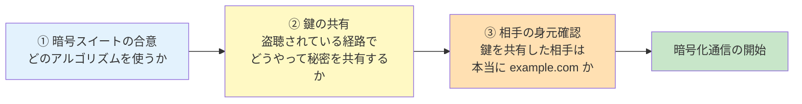
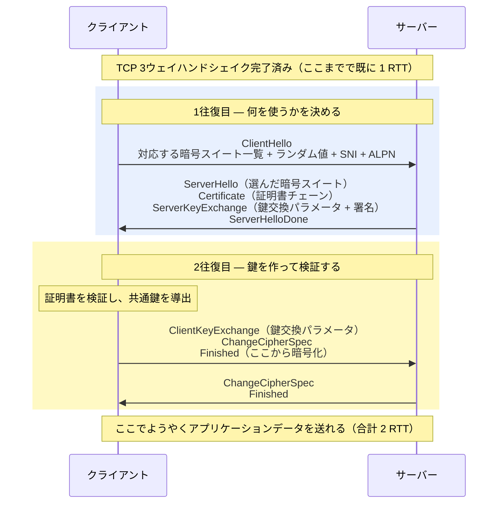
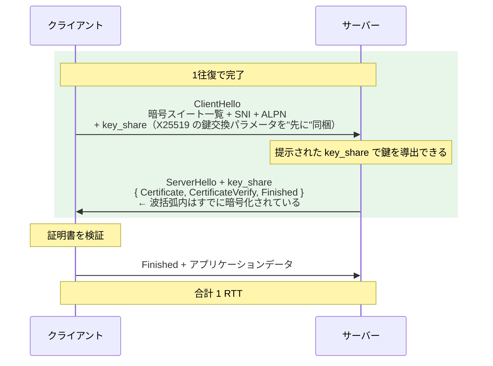
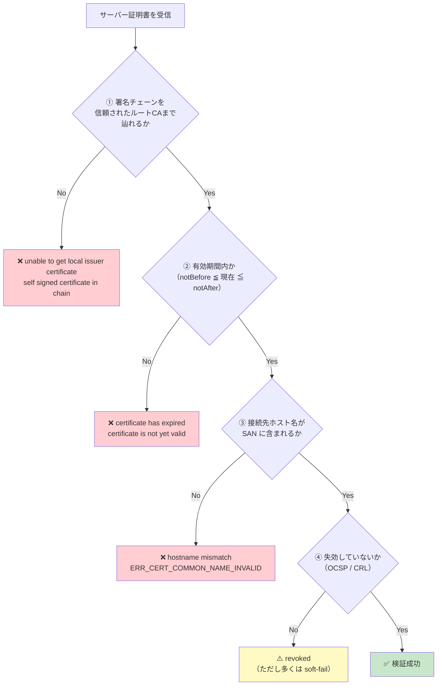

# TLSハンドシェイクと証明書検証（TLS Handshake and Certificate Validation）

> **一言で言うと:** TLS ハンドシェイクとは「**どの暗号を使うか**」「**共通鍵をどう作るか**」「**相手は本物か**」の3つを、盗聴されている経路の上で合意する手続きであり、TLS 1.3 はこの3つを **1往復**にまとめた。証明書検証は3つ目の「本物か」を判定する部分で、実務のトラブルはほぼここに集中する。

## ハンドシェイクは何を合意しているのか

TLS が保証する3つ（機密性・完全性・真正性）は、通信を始める前に**3つの合意**が済んでいることを前提にしている。



**③ が最も重要で、最も見落とされる。** ①②だけなら、通信は暗号化されるが「攻撃者と暗号化通信している」可能性が残る。中間者（MITM）が自分の鍵で両側と暗号化通信を張れば、盗聴は完全に成立してしまう。証明書検証は、この「暗号化された盗聴」を防ぐ唯一の砦である。コードで `verify=False` / `InsecureSkipVerify: true` を書くと消えるのが、まさにこの砦にあたる。

> [!info] 用語ミニ辞典
> - **暗号スイート（Cipher Suite）** — 「鍵交換方式 + 認証方式 + 暗号化方式 + ハッシュ方式」の組み合わせを1つの名前で表したもの。例: `ECDHE-RSA-AES256-GCM-SHA384`
> - **鍵交換（Key Exchange）** — 盗聴されている経路上で、両者だけが知る共通の秘密値を作り出す手続き。ECDHE が現在の主流
> - **ephemeral（一時的）** — 鍵交換のたびに使い捨ての鍵を生成すること。ECDHE の末尾の E がこれ。前方秘匿性の源
> - **RTT（Round Trip Time）** — 往復時間。「送って返ってくる」までの1往復。ハンドシェイクのコストは RTT の回数で数える

## TLS 1.2 — なぜ2往復かかったのか



**なぜ2往復必要だったのか。** 原因は**逐次依存**にある。TLS 1.2 では、鍵交換方式（ECDHE か RSA か、どの楕円曲線か）が **暗号スイートの選択によって決まる**。つまり、

1. まずサーバーに暗号スイートを選んでもらう（1往復目）
2. 選ばれた方式に合わせて鍵交換パラメータを送る（2往復目）

という順序が避けられない。「決めてから、それに従って送る」という素直な設計が、そのまま2往復のコストになっていた。

TCP の3ウェイハンドシェイク（1 RTT）と合わせると、**HTTPS で最初のリクエストを送り出せるまでに 3 RTT** かかる（レスポンスの最初の1バイトが届くのは、さらに片道分あと）。東京〜米国西海岸の RTT を 100ms とすると、リクエストを送る前に 300ms が消える。ページを開いた瞬間の「もたつき」の正体はここにある。

## TLS 1.3 — 「先に推測して送る」ことで1往復に

TLS 1.3（RFC 8446, 2018）は、逐次依存を **投機（speculation）** で断ち切った。



クライアントは「どうせ X25519 が選ばれるだろう」と**当たりをつけて、鍵交換パラメータを ClientHello に同梱する**。サーバーがその推測を受け入れれば、1往復で鍵が確定する。

**推測が外れたら？** サーバーは `HelloRetryRequest` を返し、「その曲線ではなく、こちらを使え」と指示する。この場合は往復が1回増えて 2 RTT に戻る。

**なぜ推測がほぼ当たるのか。** 現在は **X25519** が事実上の標準として広く実装されており、クライアントがこれを第一候補に置けば、まず外れないからである。ここで重要なのは、**当たり外れを決めているのが暗号スイートではない**という点だ。TLS 1.2 では鍵交換方式が暗号スイート名に埋め込まれていた（`ECDHE-RSA-AES256-GCM-SHA384` の先頭部分）ため、暗号スイートが決まるまで鍵交換方式が確定しなかった。TLS 1.3 はこれを**分離**し、

- **暗号スイート** — `TLS_AES_256_GCM_SHA384` のように、暗号化とハッシュだけを表す（鍵交換を含まない。全部で5種類）
- **鍵交換グループ** — `supported_groups` 拡張で独立に交渉する（X25519, secp256r1 など）

という2本立てにした。`key_share` の投機が成立するのは、この分離によって「鍵交換グループだけを先回りで決め打ちできる」ようになったからである。**逐次依存を断ち切ったのは、選択肢を減らしたことではなく、依存関係そのものを解いたこと**にある。

> [!info] 用語ミニ辞典
> **`supported_groups` / `key_share`** — `supported_groups` は「自分が対応している鍵交換グループの一覧」を伝える拡張。`key_share` はそのうち1つ以上について、**実際の鍵交換パラメータまで先に送ってしまう**拡張。前者だけなら交渉、後者を付けて初めて投機になる

さらに TLS 1.3 では、**ServerHello 以降がすべて暗号化される**。TLS 1.2 では証明書が平文で流れていたため、経路上の観測者は「誰がどのサイトに繋いだか」を証明書から読み取れた。1.3 ではこれが隠れる。

### 0-RTT（Early Data）— 速さと引き換えのリスク

一度接続したサーバーへの再訪では、前回のセッション情報（PSK: Pre-Shared Key）を使って、**ハンドシェイクの完了を待たずに最初のリクエストを送れる**。これが 0-RTT。

ただし 0-RTT データには **前方秘匿性がなく、リプレイ攻撃を防げない**。攻撃者が 0-RTT のパケットをそのまま記録して再送すると、サーバーは同じリクエストをもう一度処理してしまう。TLS のプロトコル内には、これを完全に防ぐ手段が存在しない（サーバーが状態を持たずに応答できることが 0-RTT の前提なので、原理的に重複を検知できない）。

したがって運用ルールは明快である: **0-RTT は GET のような冪等な操作に限る。** 状態を変える POST を 0-RTT で受け付けると、二重決済のような事故に直結する（→ [[データ書き込みの冪等性設計]]）。

### ハンドシェイクで一緒に決まる2つのこと

| 拡張 | 役割 | 実務での意味 |
|---|---|---|
| **SNI**（Server Name Indication） | ClientHello で「どのホスト名に繋ぎたいか」を伝える | 1つの IP で複数ドメインをホストするために必須。**TLS 1.3 でも平文**で送られるため、経路上の観測者に接続先が漏れる。これを暗号化する **ECH**（Encrypted Client Hello）が標準化途上 |
| **ALPN**（Application-Layer Protocol Negotiation） | 「この接続で HTTP/2 を話すか、HTTP/1.1 か」を交渉する | HTTP/2 への切り替えに追加の往復が不要なのはこの仕組みのおかげ（→ [[HTTP-2とHTTP-3]]） |

## 証明書検証 — 実務のトラブルはここに集中する

クライアントがサーバー証明書を受け取ったあと、**4つのチェック**を順に行う。どれか1つでも落ちれば接続は失敗する。



### ① 署名チェーンの構築 — 中間証明書という落とし穴

信頼の連鎖は「ルート CA → 中間 CA → サーバー証明書」の3段が典型である。クライアントが持っているのは **ルート CA だけ**。中間 CA の証明書は**サーバーが送る責任**がある。

ここで頻出するのが **中間証明書の配信忘れ**である。

```bash
# Let's Encrypt が出力するファイル
#   cert.pem      → サーバー証明書のみ         ← これだけ設定すると事故る
#   chain.pem     → 中間証明書のみ
#   fullchain.pem → サーバー証明書 + 中間証明書 ← Nginx にはこちらを指定する
#   privkey.pem   → 秘密鍵
```

厄介なのは、**この設定ミスがブラウザでは再現しないことがある**点だ。多くのブラウザは、証明書内の **AIA（Authority Information Access）** 拡張に書かれた URL から中間証明書を自動でダウンロードして補完する（AIA チェイシング）。一方で **curl、Java、Go、多くのモバイルアプリはこの補完を行わない**。結果として「ブラウザでは見られるのに、API クライアントからだけ繋がらない」という切り分けの難しい障害になる。

```bash
# チェーンが正しく配信されているかを確認する
# Certificate chain の項に 0(サーバー), 1(中間) が並んでいれば正常
openssl s_client -connect example.com:443 -servername example.com </dev/null 2>/dev/null \
  | sed -n '/Certificate chain/,/---/p'

# 検証結果を明示的に見る（"Verify return code: 0 (ok)" が正常）
openssl s_client -connect example.com:443 -servername example.com </dev/null 2>/dev/null \
  | grep "Verify return code"
```

### ② 有効期間 — 短命化が進んでいる背景

証明書には `notBefore` / `notAfter` が記録されている。期限切れは**サービス全停止**に直結する、最も頻度の高い TLS 障害である。

「なぜ有効期間はどんどん短くなるのか」には理由がある。**失効の仕組みが実質的に機能していない**からだ（後述の④を参照）。鍵が漏洩しても失効通知が確実に届かない以上、**証明書自体を短命にして、被害の窓を物理的に狭める**しかない。この考え方に基づき、CA/Browser Forum は 2025年に証明書の最大有効期間を段階的に短縮する方針を可決しており、数年かけて数十日規模まで縮められていく方向にある。Let's Encrypt が 90日という短い有効期間を選び、ACME プロトコルで自動更新を前提にしたのも同じ発想である。

**帰結は運用側にとって明確で、「手動更新」という選択肢は消滅する。** certbot / ACM / cert-manager による自動更新と、期限監視のアラートが必須になる。

さらに見落とされがちなのが**クライアント側の時刻**である。`notBefore ≦ 現在時刻 ≦ notAfter` の判定はクライアントの時計で行われるため、**時計が大きくずれているデバイスでは正しい証明書でもエラーになる**。コンテナやIoT機器で NTP が動いていない場合の典型的な症状で、証明書側をいくら調べても原因に辿り着けない（→ [[CA証明書とタイムゾーンデータ]]）。

### ③ ホスト名の一致 — CN ではなく SAN

「接続しようとしたホスト名」が証明書に記載されているかを確認する。ここで参照されるのは **SAN（Subject Alternative Name）** 拡張であり、**Subject の CN（Common Name）ではない**。

歴史的には CN にホスト名を書いていたが、CN は本来「主体の名前」を入れる自由記述欄であり、複数ホスト名を書けない・意味が曖昧といった問題があった。RFC 2818 の時点で SAN が優先と定められ、Chrome は 2017年（Chrome 58）に CN へのフォールバックを完全に廃止した。**現在、SAN のない証明書はブラウザで一切使えない。**

```bash
# SAN に何が入っているかを確認する
openssl s_client -connect example.com:443 -servername example.com </dev/null 2>/dev/null \
  | openssl x509 -noout -ext subjectAltName

# 出力例:
# X509v3 Subject Alternative Name:
#     DNS:example.com, DNS:www.example.com
```

ワイルドカード証明書（`*.example.com`）は **1階層のみ**にマッチする。`api.example.com` にはマッチするが、`v1.api.example.com` にはマッチしない。「ワイルドカードなら全部カバーされるはず」という思い込みは事故のもとである。

### ④ 失効確認 — 建前と現実が最も乖離している部分

秘密鍵が漏洩した証明書は、有効期限内であっても「失効（revoke）」させる必要がある。しかしこの仕組みは、**設計通りには動いていない**。

| 方式 | 仕組み | 実際の問題 |
|---|---|---|
| **CRL**（Certificate Revocation List） | CA が失効証明書の一覧を公開し、クライアントが取得して照合 | リストが巨大化し、ダウンロードコストが現実的でない |
| **OCSP**（Online Certificate Status Protocol） | クライアントが CA に「この証明書は生きているか」を都度問い合わせる | **CA に「誰がどのサイトを見たか」が筒抜けになる**（プライバシー問題）。CA が落ちると全サイトに影響 |
| **OCSP Stapling** | サーバーが事前に取得した OCSP レスポンスをハンドシェイク中に添付する | プライバシーと速度は解決。ただし**サーバーが添付しなければ何も起きない** |

そして決定的な問題が **soft-fail** である。ブラウザは OCSP の問い合わせがタイムアウトした場合、**「失効していない」とみなして接続を許可する**。そうしないと CA の障害でインターネット全体が止まるためだ。

しかしこれは、攻撃者にとって好都合を意味する。**中間者攻撃を仕掛けている攻撃者は、OCSP への通信を遮断するだけで失効チェックを無効化できる。** 「失効させたから安全」は成り立たない。

この行き詰まりへの対応として、ブラウザベンダは独自路線を採った。Chrome は自前で集約した失効リスト（CRLSets）を配信し、Firefox は圧縮された失効情報（CRLite）を配信する。**CA の応答に依存せず、ブラウザ更新で失効情報を配る**という方式である。一方 CA 側では、プライバシーとコストの問題から OCSP の提供を終了し CRL へ回帰する動きが進んでいる（Let's Encrypt がその代表例）。

**そして冒頭の「有効期間の短縮」に戻る。** 失効が信頼できないなら、証明書が自然に死ぬまでの時間を短くする — これが業界の到達した結論である。個々の技術の是非ではなく、こうした**制約の連鎖**を追えることが、シニアレベルの理解にあたる。

> [!info] 用語ミニ辞典
> - **soft-fail / hard-fail** — 検証情報が取得できなかったときに、接続を許可するのが soft-fail、拒否するのが hard-fail。可用性を取るか安全性を取るかのトレードオフ
> - **OCSP Must-Staple** — 証明書に「この証明書は必ず Stapling を伴って提示されること」と刻む拡張。Stapling がなければクライアントは接続を拒否する（hard-fail 化）。ただし Stapling の取得に失敗した瞬間にサイトが落ちるため、運用難度が高く普及していない
> - **Certificate Transparency（CT）** — 発行されたすべての証明書を公開ログに記録する仕組み。CA が不正に発行した証明書を**事後に検知**できる。現在のブラウザは CT ログに載っていない証明書を拒否する

## コード例

### Go — 証明書検証をカスタマイズする

```go
package main

import (
	"crypto/tls"
	"crypto/x509"
	"fmt"
	"net/http"
	"os"
	"time"
)

// 社内 CA が発行した証明書を使う内部 API に接続する例。
// よくある誤りは InsecureSkipVerify: true で済ませること。
// 正しくは「信頼するルート CA を追加する」——検証は有効なまま維持する。
func newInternalClient(caPath string) (*http.Client, error) {
	// システムのルート CA を土台にする（公開 CA への接続も同じクライアントで扱えるように）
	pool, err := x509.SystemCertPool()
	if err != nil {
		return nil, fmt.Errorf("システム証明書ストアの読み込みに失敗: %w", err)
	}

	caPEM, err := os.ReadFile(caPath)
	if err != nil {
		return nil, fmt.Errorf("社内 CA 証明書の読み込みに失敗: %w", err)
	}
	// AppendCertsFromPEM は「1件でも追加できたか」を bool で返す。
	// 戻り値を捨てると、CA ファイルが壊れていても気付けない
	if !pool.AppendCertsFromPEM(caPEM) {
		return nil, fmt.Errorf("社内 CA 証明書を読み込めませんでした（PEM 形式か確認）")
	}

	transport := &http.Transport{
		TLSClientConfig: &tls.Config{
			RootCAs:    pool,
			MinVersion: tls.VersionTLS12, // TLS 1.0/1.1 を明示的に拒否する
			// InsecureSkipVerify はデフォルトの false のまま = 検証有効
		},
	}
	return &http.Client{Transport: transport, Timeout: 10 * time.Second}, nil
}

// 接続先証明書の有効期限を調べる（期限監視の実装に使える）
func daysUntilExpiry(host string) (int, error) {
	conn, err := tls.Dial("tcp", host+":443", &tls.Config{
		ServerName: host, // SNI。これを省くと仮想ホスト環境で別の証明書が返る
		MinVersion: tls.VersionTLS12,
	})
	if err != nil {
		return 0, err
	}
	defer conn.Close()

	// PeerCertificates[0] がサーバー証明書、[1] 以降が中間証明書
	chain := conn.ConnectionState().PeerCertificates
	if len(chain) == 0 {
		return 0, fmt.Errorf("証明書が取得できませんでした")
	}
	if len(chain) < 2 {
		// 中間証明書が配信されていない可能性が高い（fullchain.pem を確認）
		fmt.Fprintf(os.Stderr, "警告: %s は中間証明書を送っていない可能性があります\n", host)
	}

	remaining := time.Until(chain[0].NotAfter)
	return int(remaining.Hours() / 24), nil
}
```

### TypeScript（Node.js）— 検証結果を自分で確かめる

```typescript
import tls from "node:tls";

/**
 * 指定ホストに TLS 接続し、ネゴシエーション結果と証明書情報を取得する。
 * 監視スクリプトやデプロイ後の検証に使える形にしてある。
 */
function inspectTls(host: string, port = 443): Promise<void> {
  return new Promise((resolve, reject) => {
    const socket = tls.connect(
      {
        host,
        port,
        servername: host, // SNI。省略すると仮想ホストで意図しない証明書が返る
        minVersion: "TLSv1.2",
        // rejectUnauthorized はデフォルト true。false にすると検証が消えるので触らない
      },
      () => {
        // authorized が false なら検証に失敗している
        if (!socket.authorized) {
          reject(new Error(`証明書の検証に失敗: ${socket.authorizationError}`));
          socket.end();
          return;
        }

        const cert = socket.getPeerCertificate(true); // true = チェーンも辿る
        console.log("プロトコル:", socket.getProtocol());       // 'TLSv1.3' など
        console.log("暗号スイート:", socket.getCipher().name);
        console.log("ALPN:", socket.alpnProtocol);              // 'h2' など
        console.log("発行者:", cert.issuer.CN);
        console.log("SAN:", cert.subjectaltname);               // ホスト名の一致はここで確認
        console.log("有効期限:", cert.valid_to);

        // issuerCertificate が自分自身を指すとチェーンの終端（ルート）
        const hasIntermediate =
          cert.issuerCertificate && cert.issuerCertificate.fingerprint !== cert.fingerprint;
        if (!hasIntermediate) {
          console.warn("警告: 中間証明書が配信されていない可能性があります");
        }

        socket.end();
        resolve();
      },
    );

    socket.on("error", reject);
  });
}

inspectTls("example.com").catch((err) => {
  console.error(err.message);
  process.exit(1);
});
```

### openssl — 障害切り分けの定番コマンド

```bash
# 1. TLS 1.3 で接続できるか（できなければサーバー設定かクライアント側が古い）
openssl s_client -connect example.com:443 -servername example.com -tls1_3 </dev/null

# 2. TLS 1.0 が無効化されているか（接続できてしまったら設定不備）
openssl s_client -connect example.com:443 -servername example.com -tls1 </dev/null

# 3. OCSP Stapling が有効か（"OCSP Response Status: successful" が出れば有効）
openssl s_client -connect example.com:443 -servername example.com -status </dev/null 2>/dev/null \
  | grep -A 5 "OCSP response"

# 4. 手元の証明書ファイルと秘密鍵が対になっているか
#    （両方のハッシュが一致すればペア。デプロイ時の取り違え検出に有効）
#    公開鍵を取り出して比較するので、RSA でも ECDSA でも同じ手順で使える。
#    よく見かける `openssl rsa -modulus` を使う版は RSA 専用で、
#    ECDSA 証明書（Let's Encrypt でも選択可能）では失敗する
openssl x509 -in cert.pem    -pubkey -noout | openssl md5
openssl pkey -in privkey.pem -pubout        | openssl md5

# 5. SNI を送らずに接続する（仮想ホスト環境で何が返るかの確認）
openssl s_client -connect example.com:443 </dev/null 2>/dev/null \
  | openssl x509 -noout -subject
```

## よくある落とし穴

### 1. `verify=False` / `InsecureSkipVerify` / `rejectUnauthorized: false` で「解決」する

エラーが消えるので解決したように見えるが、実際には**中間者攻撃への防御をすべて捨てている**。しかもこの1行は、開発環境から本番へそのまま持ち込まれやすい。

エラーの原因は、ほぼ次のいずれかである。それぞれに正しい対処がある。

| エラー | 実際の原因 | 正しい対処 |
|---|---|---|
| `unable to get local issuer certificate` | 中間証明書が配信されていない、または社内 CA が信頼ストアにない | サーバーに `fullchain.pem` を設定 / クライアントに CA 証明書を追加 |
| `certificate has expired` | 証明書の期限切れ、**またはクライアントの時計のずれ** | 証明書を更新 / NTP を確認 |
| `hostname mismatch` | SAN に接続先ホスト名がない、SNI を送っていない | 証明書を再発行 / クライアントに `servername` を設定 |
| `self signed certificate` | 自己署名証明書を使っている | 開発環境は mkcert（ローカル CA を信頼ストアに登録）、本番は正規 CA |

### 2. SNI を送らずに接続し、別サイトの証明書を受け取る

1つの IP アドレスで複数ドメインをホストしている環境（CDN、共用ホスティング、Kubernetes Ingress）では、SNI がなければサーバーはどの証明書を返すべきか判断できず、既定の証明書を返す。結果としてホスト名不一致エラーになる。IP アドレス直打ちでの疎通確認が失敗するのは、多くの場合この理由である。

### 3. 証明書ピンニング（Certificate Pinning）を安易に導入する

「特定の証明書 / 公開鍵以外は拒否する」という手法。CA が侵害された場合でも守れる強力な防御だが、**運用の硬直と引き換え**である。証明書を更新したときにピンの更新を配布し忘れると、**アプリが一斉に通信不能になり、アプリストア経由の更新を待つしかなくなる**。

Web ではブラウザ向けの HPKP（HTTP Public Key Pinning）が同じ理由で失敗し、廃止された。導入するなら、モバイルアプリで**バックアップピンを必ず併記**し、緊急時にピンを無効化できる経路を用意しておく。

### 4. ルート CA 自体の期限切れを想定していない

2021年、Let's Encrypt が使っていたルート証明書 **DST Root CA X3** の有効期限が切れ、証明書ストアを更新していない古い Android 端末や古い OpenSSL を使うサーバーで、正しく更新されたはずのサイトへの接続が一斉に失敗した。

**証明書を正しく運用していても、クライアント側の信頼ストアが古ければ壊れる。** サーバー側で完結しない障害があることを、切り分けの選択肢として持っておく必要がある。コンテナイメージの `ca-certificates` パッケージを更新していないケースが典型（→ [[CA証明書とタイムゾーンデータ]]）。

### 5. 「TLS 1.3 なら設定は不要」と考える

TLS 1.3 の暗号スイートは安全なものだけに絞られているため、そこは確かに考えなくてよい。しかし **TLS 1.2 との併用設定は残る**し、証明書の管理、OCSP Stapling、HSTS、SNI/ECH の扱いは何も自動化されない。「バージョンを上げれば安全」は、HTTP/2 の「速くなる」と同じ種類の誤解である。

## AI実装のアンチパターン

| アンチパターン | なぜ問題か | レビュー観点 / 対策 |
|---|---|---|
| エラー解決として `verify=False` / `InsecureSkipVerify: true` / `rejectUnauthorized: false` を追加 | 中間者攻撃への防御が消える。TLS を使う意味そのものが失われる。AI が「動かすため」に最も入れやすい1行 | CI や lint でこれらの文字列を検出して落とす。原因別（中間証明書 / 時刻 / SAN）に正しく対処 |
| `ssl_certificate` に `fullchain.pem` ではなく `cert.pem` を指定 | 中間証明書が配信されず、ブラウザでは繋がるのに API クライアントからは失敗する。切り分けが難しい障害になる | `openssl s_client` の Certificate chain に 0 と 1 が並ぶことを確認 |
| クライアント実装で `servername` / SNI を設定しない | 仮想ホスト環境で別ドメインの証明書が返り、ホスト名不一致になる | HTTPS クライアントを自作する場合は SNI の設定を必ずレビュー |
| ホスト名の照合を CN（Common Name）で行う独自実装 | CN は廃止済み。SAN を見ないと正しく検証できない。そもそも検証の自前実装は避けるべき | 言語標準 / OS の検証機構に任せる。自前の `VerifyPeerCertificate` は最小限に |
| 証明書ピンニングをバックアップピンなしで実装 | 証明書更新時にアプリが一斉に接続不能になり、復旧に更新配布が必要 | バックアップピンを併記し、リモートで無効化できる仕組みを用意 |
| 0-RTT / Early Data を全メソッドで有効化 | リプレイ攻撃で POST が二重処理される（二重決済） | 冪等な GET のみに限定。サーバー側のリプレイ検知も併用 |
| 証明書の更新を cron の手動スクリプトで組む | 更新失敗時に誰も気付かず、期限切れでサービス全停止 | certbot / ACM / cert-manager による自動更新 + 期限の外形監視アラート |
| 秘密鍵をリポジトリや Docker イメージに含める | `git log` / `docker history` に永久に残り、削除しても消えない | シークレットマネージャー / ボリュームマウントで分離（→ [[dotenvx]]） |

→ レイヤー横断のアンチパターン索引: [[_anti-patterns/_index|AIアンチパターン索引]]

## 参考リソース

- **RFC 8446**: The Transport Layer Security (TLS) Protocol Version 1.3 — https://datatracker.ietf.org/doc/html/rfc8446
- **RFC 6125**: 証明書におけるホスト名検証の指針 — https://datatracker.ietf.org/doc/html/rfc6125
- **書籍**: 『プロフェッショナル SSL/TLS』（Ivan Ristić） — 証明書検証と失効の実情を最も詳しく扱っている
- **Web**: Mozilla SSL Configuration Generator — https://ssl-config.mozilla.org/
- **Web**: SSL Labs Server Test — https://www.ssllabs.com/ssltest/ — チェーン欠落・プロトコル・OCSP Stapling をまとめて診断できる
- **Web**: Illustrated TLS 1.3 Connection — https://tls13.xargs.org/ — ハンドシェイクを1バイトずつ図解した教材

## 関連トピック

- [[TLS-SSL]] — 親トピック。信頼の連鎖、前方秘匿性、HSTS などの全体像
- [[暗号アルゴリズム]] — 暗号スイートを構成する共通鍵暗号・公開鍵暗号・ハッシュの中身
- [[CA証明書とタイムゾーンデータ]] — クライアント側の信頼ストアと時刻が検証結果を左右する
- [[HTTP-2とHTTP-3]] — ALPN によるプロトコル交渉、HTTP/3 における TLS 1.3 の統合
- [[TCPフラグとコネクション状態遷移]] — TLS ハンドシェイクの前提となる TCP 接続の確立
- [[HTTPとHTTPSの違い]] — TLS レイヤーの有無という観点からの整理
- [[データ書き込みの冪等性設計]] — 0-RTT のリプレイに耐えるための冪等性
