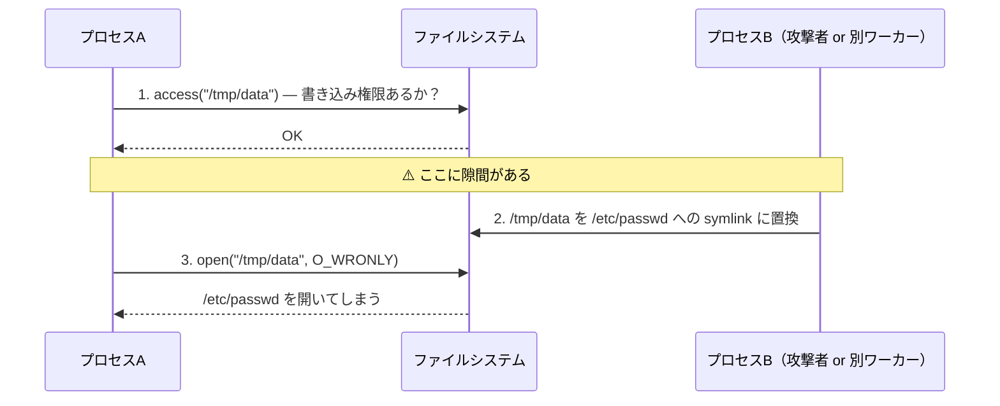

# TOCTOU（Time-of-Check to Time-of-Use）

> **一言で言うと:** 「条件をチェックした時点」と「その結果に基づいて操作する時点」の間に状態が変わってしまう競合状態（race condition）の総称。check と use が別のシステムコール／クエリに分かれているとき、その隙間に他のプロセス・スレッド・リクエストが割り込むことで発生する。

## 概念

TOCTOU は「2 段階に分かれた処理は原子的ではない」というシンプルな事実から生まれる脆弱性パターン。`check(x)` で安全だと判断しても、その判断は `use(x)` の時点では古い情報になっている可能性がある。



ポイントは **「チェックの結果」は「操作の前提」を保証しない** ということ。チェックと操作の間に状態を変えられる余地があるかぎり、攻撃者や並行プロセスはその窓を突ける。

### TOCTOU が起きる条件

以下が同時に成立すると TOCTOU の窓が開く。

| 条件 | 内容 |
|------|------|
| **チェックと操作が別の呼び出し** | `access()` + `open()`、`SELECT` + `INSERT` のように 2 ステップに分かれている |
| **チェック対象が共有リソース** | 自プロセス専用のメモリではなく、他からも変更可能な状態（ファイル、DB行、グローバル状態） |
| **間に割り込める並行主体がいる** | 他プロセス、他スレッド、他リクエスト、攻撃者など |

逆にこのいずれかを崩せば TOCTOU は起きない。

## 古典例 — symlink race 攻撃

UNIX の SUID プログラムが `access(2)` で「実ユーザーが書き込めるか」を確認してから `open(2)` で開く、という古典的なパターンには深刻な脆弱性がある。`man 2 access` には access() を権限チェックに使うことが security hole であり race condition の代表例だと明確に警告がある。

```c
// ❌ 脆弱なコード（典型的なTOCTOU）
if (access("/tmp/userfile", W_OK) == 0) {
    // ここで攻撃者が /tmp/userfile を /etc/shadow への symlink に置換
    int fd = open("/tmp/userfile", O_WRONLY);
    write(fd, attacker_data, len);  // /etc/shadow を破壊
}

// ✅ 正解: 実ユーザー権限を一時的に有効化してからアトミックに open
//    SUIDプロセスでは effective UID が root のため、単に open しただけでは
//    本来書き込み権限のないファイルにも書けてしまう。実 UID に降ろした上で
//    open することで「権限チェック + ファイル取得」を1つの原子的操作にできる。
if (setresuid(getuid(), getuid(), -1) != 0) abort();
int fd = open("/tmp/userfile", O_WRONLY | O_NOFOLLOW);
// O_NOFOLLOW で symlink を辿らない追加防御
```

`access(2)` はパス名から権限を判断する古い API であり、チェックの瞬間と open の瞬間でパスが指す先が変わってしまう。`open()` 系は fd（ファイルディスクリプタ）を返した時点で inode と紐付くため、その後パスがすり替えられてもすでに開いた fd は元のオブジェクトを指し続ける。

## どこで発生するか

TOCTOU はファイルシステムの話だと思われがちだが、本質は「check と use の間に割り込まれる」こと全般を指す。

| 領域 | チェック | 使用 | 割り込まれると |
|------|---------|------|--------------|
| ファイルシステム | `access()`, `stat()`, `exists()` | `open()`, `unlink()` | symlink 置換、ファイル差し替え |
| 認可 | `if user.canEdit(post)` | `post.update(...)` | 権限取り消し後も操作完了 |
| 冪等性 | `SELECT idempotency_key WHERE ...` | `INSERT INTO orders ...` | 同じリクエストが二重実行（→ [[データ書き込みの冪等性設計]]） |
| 在庫・残高 | `SELECT stock FROM products` | `UPDATE stock = stock - 1` | 在庫マイナス、二重売り |
| ロック獲得 | `if not exists lockfile` | `create lockfile` | 二重起動（→ [[ファイルの排他制御]]） |
| キャッシュ | `if cache.get(key) == null` | `cache.set(key, expensiveComputation())` | キャッシュスタンピード |

## 解決パターン — アトミック操作にまとめる

TOCTOU の根本対策は **チェックと使用を 1 つの原子的操作に統合する** こと。「2 つのシステムコールを 1 つにできないか」を考える。

### 1. アトミックなシステムコール／API を使う

| やりたいこと | TOCTOU パターン | アトミックな代替 |
|-------------|---------------|---------------|
| ファイルが無いときだけ作成 | `if not exists: create` | `open(O_CREAT \| O_EXCL)` |
| ファイルがあるときだけ削除 | `if exists: unlink` | `unlink()` 直接（ENOENT を許容） |
| ロックファイル | `if not exists: touch lock` | `mkdir lockdir`（mkdir はアトミック） |
| 安全な一時ファイル | `tmpnam` → `open` | `mkstemp` |
| 原子的な書き込み | 直接書き込み | `tmp に書く → rename`（同一FS内のrenameはアトミック） |

```python
# ❌ TOCTOU: 存在チェック → 作成
import os
if not os.path.exists('/tmp/lock'):
    # ← ここで他プロセスが先に作るかも
    open('/tmp/lock', 'w').close()

# ✅ アトミック: O_CREAT | O_EXCL で「作成 or 失敗」を1ステップに
import errno
try:
    fd = os.open('/tmp/lock', os.O_CREAT | os.O_EXCL | os.O_WRONLY, 0o644)
    os.close(fd)
except OSError as e:
    if e.errno == errno.EEXIST:
        print("既にロック取得済み")
    else:
        raise
```

```typescript
// Node.js — wx フラグが O_CREAT | O_EXCL に対応
import { open } from 'fs/promises';

async function createIfAbsent(path: string, content: string) {
  try {
    const fh = await open(path, 'wx');  // 'wx' = write + exclusive
    await fh.writeFile(content);
    await fh.close();
  } catch (err: any) {
    if (err.code === 'EEXIST') {
      // 既に存在 — 期待した競合状態
      return;
    }
    throw err;
  }
}
```

```go
// Go — os.O_EXCL で同様にアトミック作成
package main

import (
    "errors"
    "os"
)

func createIfAbsent(path string) error {
    f, err := os.OpenFile(path, os.O_CREATE|os.O_EXCL|os.O_WRONLY, 0644)
    if err != nil {
        if errors.Is(err, os.ErrExist) {
            return nil // 既に存在
        }
        return err
    }
    defer f.Close()
    return nil
}
```

### 2. パスではなく fd を持ち回す

一度開いた fd は inode に紐づくため、その後パスが書き換えられても影響を受けない。複数のステップに渡る操作は「最初に open した fd」を使い回すと TOCTOU を避けられる。

`openat(2)`, `fstatat(2)`, `unlinkat(2)` などの `*at` 系システムコールは、ベースとなるディレクトリの fd を起点に相対パスを解決するため、ディレクトリのすり替えに対して堅牢になる。

### 3. DB ではトランザクション + 一意制約 / ロックで一体化する

```sql
-- ❌ TOCTOU: SELECT してから INSERT
SELECT id FROM users WHERE email = 'foo@example.com';  -- 存在しない
-- ← 別リクエストが同じ email で INSERT できる
INSERT INTO users (email) VALUES ('foo@example.com');

-- ✅ 一意制約 + ON CONFLICT で「無ければ挿入」を1文に
INSERT INTO users (email) VALUES ('foo@example.com')
ON CONFLICT (email) DO NOTHING;

-- ✅ あるいは SELECT ... FOR UPDATE で行ロック
BEGIN;
SELECT stock FROM products WHERE id = 1 FOR UPDATE;  -- 行ロック
UPDATE products SET stock = stock - 1 WHERE id = 1;
COMMIT;

-- ✅ さらにシンプル: アトミックな UPDATE で条件と操作を一体化
UPDATE products SET stock = stock - 1 WHERE id = 1 AND stock > 0;
-- 影響行数が 0 なら在庫不足 — 1つの文の中で check と use が原子的
```

DB の一意制約・チェック制約・行ロックは TOCTOU の最強の防御線。アプリケーションコードで `if exists` を書きたくなったら、まず制約に押し込めないか考える。

### 4. ロックでチェックと操作を保護する

アトミック操作にまとめられない場合は、`flock()` などのロックでチェックと操作の全体をクリティカルセクションにする（→ [[ファイルの排他制御]]）。ただしロックは性能を犠牲にするため、可能ならアトミックAPIを優先する。

## よくある落とし穴

### 1. 防御的に存在チェックを足してしまう

「念のため」と書かれた `if file.exists()` のほぼすべては TOCTOU を生んでいる。`open()` は失敗すれば例外を投げる — 例外で十分な場合がほとんど。

```python
# ❌ よく見るが TOCTOU
if os.path.exists(path):
    with open(path) as f:
        return f.read()
else:
    return None

# ✅ EAFP（"Easier to Ask Forgiveness than Permission"）
try:
    with open(path) as f:
        return f.read()
except FileNotFoundError:
    return None
```

Python コミュニティが推奨する EAFP スタイルは、TOCTOU 回避と意味的に一致している。

### 2. `access(2)` を権限チェックに使う

`access(2)` は実ユーザーIDで判定するため、SUID プログラムが「ユーザーがこのファイルを書ける権利を持つか」を確認する目的で歴史的に使われてきた。だがチェック後に symlink がすり替えられるため脆弱。`man 2 access` には security hole であり race condition の典型例だと明確な警告がある。代わりに `setresuid()` で権限を一時的に実ユーザーに降ろして `open()` するのが正解（`faccessat()` の `AT_EACCESS` フラグは API の改善版だが、check と use の分離自体は残るため TOCTOU の対策にはならない）。

### 3. アプリ層の冪等キーチェックを別トランザクションで行う

```typescript
// ❌ TOCTOU: チェックと挿入が別トランザクション
const existing = await prisma.idempotencyKey.findUnique({ where: { key } });
if (existing) return existing.result;
// ← 同じキーの別リクエストがここに到達できる
await prisma.$transaction(async (tx) => {
  await tx.idempotencyKey.create({ data: { key, result } });
  await tx.order.create({ ... });
});

// ✅ 一意制約 + 例外ハンドリングで一体化
try {
  return await prisma.$transaction(async (tx) => {
    await tx.idempotencyKey.create({ data: { key } });  // 一意制約違反なら例外
    const order = await tx.order.create({ ... });
    return order;
  });
} catch (e) {
  if (isUniqueConstraintViolation(e)) {
    return await prisma.idempotencyKey.findUnique({ where: { key } });
  }
  throw e;
}
```

詳細は [[データ書き込みの冪等性設計]] 参照。

### 4. 読み込み時に `stat()` でサイズを取って `read()` する

ファイルサイズを `stat()` で取得して、その分だけ `read()` するパターンは、間にファイルが伸びる／縮むと正しく読めない。`read()` の戻り値（実際に読んだバイト数）でループするのが正解。

### 5. キャッシュスタンピード

複数のリクエストが同時に「キャッシュ無し → 重い処理を実行 → キャッシュ書き込み」を行うと、同じ重い処理が並行して走る（cache stampede / dog-pile とも呼ばれる）。厳密な TOCTOU とは別系統だが、「check（キャッシュミス）と use（再計算 + 格納）の隙間に並行処理が割り込む」という構造は同じ。シングルフライト（singleflight）パターンや、キャッシュミス時にロックを取って先頭リクエストだけが計算する、といった対策が必要。

## AIによる実装のアンチパターン

| アンチパターン | なぜ問題か | 対策 |
|---|---|---|
| `if (!fs.existsSync(path)) fs.writeFileSync(path, ...)` | 古典的TOCTOU。LLMは「存在しなければ書く」を素直にコード化する | `open(path, 'wx')` でアトミックに |
| 「ユーザーが操作可能か」をビジネスロジックでチェックしてから DB 更新 | 認可と更新が別呼び出しで TOCTOU。権限変更レースに弱い | 認可条件を `WHERE` 句に含める（`UPDATE ... WHERE owner_id = ?`） |
| 残高や在庫を `SELECT` で確認してから `UPDATE` する | 並行リクエストで二重消費の可能性 | `UPDATE balance = balance - 1 WHERE id = ? AND balance >= 1` |
| 一時ファイルを `Date.now()` で命名してから `writeFile` | パス予測 + 競合の二重リスク | `mkstemp` 系（Node.jsなら `fs.mkdtemp`）を使う |
| `try { findUnique } catch { create }` の代わりに `if (!findUnique) create` | 「事前チェック」がそのまま TOCTOU を作る | upsert / ON CONFLICT に変える |

LLM は「分かりやすく書く」傾向があり、check と act を分けるコードを生成しがち。レビュー時は「このチェックと操作の間に何かが起きたら？」と必ず問う。

## 関連トピック

- [[ファイルシステムとIO]] — 親トピック。`O_CREAT | O_EXCL` などアトミックAPIの基盤
- [[ファイルの排他制御]] — ロックで TOCTOU の窓を保護する手段
- [[並行性の基本概念]] — 競合状態の理論的背景
- [[データ書き込みの冪等性設計]] — DB 層での TOCTOU 回避
- [[トランザクション]] — `SELECT FOR UPDATE` や ACID 特性による check-and-act の保護
- [[デッドロック]] — TOCTOU 対策で過剰なロックを取ると別の問題（デッドロック）に転化する

## 参考リソース

- `man 2 access` — access() を権限チェックに使うことが security hole であるという警告と TOCTOU の説明
- CWE-367: Time-of-check Time-of-use (TOCTOU) Race Condition — MITRE による公式分類
- *Secure Programming Cookbook for C and C++*（O'Reilly）— Chapter 1 にファイルシステム TOCTOU の詳細
- POSIX `openat(2)` / `fstatat(2)` — fd ベースのパス解決でディレクトリすり替えを防ぐ
