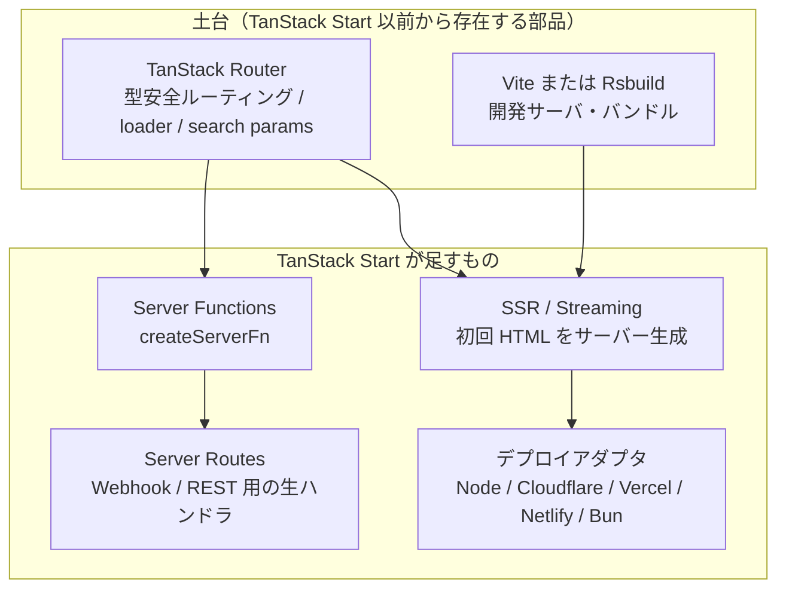
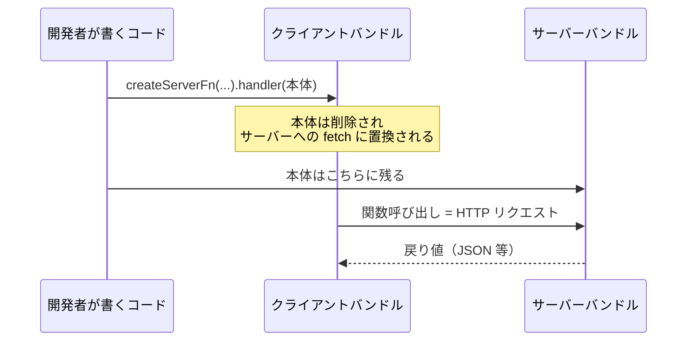
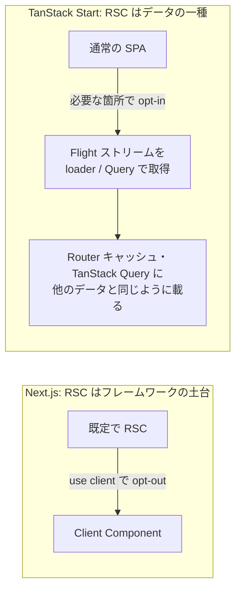

# TanStack Start

> **一言で言うと:** TanStack Router（型安全ルーター）の上に「サーバー実行」を足したフルスタック React フレームワーク。Next.js App Router が **コンポーネント単位**（React Server Components）でサーバー / クライアント境界を引くのに対し、TanStack Start は **関数単位**（Server Functions）で境界を引き、既定構成ではアプリ本体が Hydration 後も純粋な SPA のまま動く。

> [!info] バージョンの現在地（2026年8月時点）
> 2025年9月に v1.0 RC（機能凍結・API 安定宣言）、**2026年3月に v1.0 stable** が出ている。「まだ実験段階の新顔」ではないが、v1 到達の前後で API 名が動いた箇所があり（後述）、ネット上の記事や AI の出力には古い形が残っている。バージョンを確認しながら読むこと。

## なぜ「もう一つの React フレームワーク」が必要だったのか

React でフルスタックを組むなら Next.js がある。それでも TanStack Start が生まれた背景には、**Next.js App Router が選んだ設計上のトレードオフ** への反発がある。ここを理解しないと「流行りのフレームワーク」という以上の意味が見えない。

### 動機① URL は最初から存在する状態管理装置である

TanStack Router の出発点は、作者 Tanner Linsley の「**URL はアプリで最も古く、最も共有しやすい状態ストアなのに、型が付いていない**」という問題意識にある。

```typescript
// 従来のルーター（React Router v6 / Next.js Pages Router）
const { id } = useParams();          // id: string | undefined —— 型は string 止まり
const [sp] = useSearchParams();
const page = Number(sp.get('page')); // 手で parse、手で検証、NaN の可能性
```

`?page=2&sort=desc&status=active` のようなクエリ文字列（search params）は、実質的にアプリケーション状態そのものだ。にもかかわらず、多くのルーターはこれを「文字列の辞書」としてしか扱わない。結果として、**同じクエリの parse / validate / シリアライズが画面ごとに手書きで散る**。

TanStack Router はここに **スキーマ** を持ち込んだ。ルートごとに `validateSearch` を宣言すると、その戻り値の型がアプリ全体に伝播する。

```typescript
// src/routes/posts.tsx
import { createFileRoute } from '@tanstack/react-router'
import { z } from 'zod'

export const Route = createFileRoute('/posts')({
  // クエリ文字列の「型定義」。ここが単一の真実の源になる
  validateSearch: z.object({
    page: z.number().int().min(1).default(1),
    sort: z.enum(['asc', 'desc']).default('desc'),
  }),
  component: PostList,
})

function PostList() {
  // page: number, sort: 'asc' | 'desc' として推論される（string ではない）
  const { page, sort } = Route.useSearch()
  const navigate = Route.useNavigate()

  return (
    <button
      // 存在しないキーや型違いはコンパイルエラーになる
      onClick={() => navigate({ search: (prev) => ({ ...prev, page: prev.page + 1 }) })}
    >
      次のページ
    </button>
  )
}
```

> [!info] 用語ミニ辞典
> - **search params（クエリパラメータ）:** URL の `?` 以降の部分。`?page=2&sort=desc` など。HTTP 上はただの文字列で、型情報を持たない
> - **型推論の伝播:** TanStack Router はファイルベースのルート定義から `routeTree.gen.ts` という型定義ファイルを自動生成する。`<Link to="/posts/$postId" params={{ postId: '1' }} />` のように、**存在しないパスや不足している params がコンパイル時に落ちる**。「型安全なルーティング」とはこの状態を指す

### 動機② SPA を捨てずに SSR が欲しかった

Next.js App Router の中核は **React Server Components（RSC）** である。RSC はコンポーネントを「サーバーでのみ実行され、クライアントの JS バンドルに含まれないもの」と「両方で実行されるもの（`"use client"` を宣言したもの）」に二分する。バンドルサイズの削減とデータ取得の単純化という強力な利点があるが、代償もある。

- サーバー / クライアント境界が **コンポーネントツリーの構造そのもの** に埋め込まれるため、既存の SPA から段階的に移行しづらい
- ナビゲーションのたびにサーバーへ RSC ペイロードを取りに行く設計が基本になり、「一度読み込んだら以後クライアントだけで完結する」古典的な SPA の体験とは別物になる
- クライアント側のキャッシュ制御（TanStack Query / Redux 等）と Next.js 独自の多層キャッシュが **二重管理** になりやすい

TanStack Start は逆側から攻めた。**土台は SPA。そこに「初回リクエストだけサーバーで HTML を作る」SSR を後付けする** という順序である。Hydration が終わったあとのアプリは、TanStack Router が支配する普通のクライアントサイド SPA として動く。既存の TanStack Query ベースの SPA を持っている現場にとって、これは移行コストの差として直接効く。

なお RSC を**捨てた**わけではない。後述の通り TanStack Start も RSC をサポートするが、**既定で有効ではなく、使いたい場所に自分で差し込む（opt-in）** 設計になっている。「既定で付いてきて opt-out する」Next.js との違いは、機能の有無ではなく **主導権をどちらが握るか** にある。

> [!note]- なぜ Vite だったのか（歴史的経緯）
> TanStack Start は当初 **Vinxi**（Vite の上にフルスタック機能を載せるメタフレームワーク層）を使っていたが、Vite 自身に **Environment API**（1 つの Vite プロセスで「クライアント環境」「SSR 環境」など複数のビルド環境を第一級に扱う仕組み）が入ったことで、Vinxi を捨てて素の Vite プラグインへ移行した。
>
> 同時期に Remix も Vite へ移行し、最終的に React Router v7 へ統合された。つまり「**React フルスタックの土台は Vite に収束し、Next.js（Turbopack）だけが独自路線**」という構図が 2024〜2025 年に固まった。フレームワーク選定でビルドツールの話題が必ず出るのはこのためで、Vite 系はプラグイン資産（Vitest / Storybook / 各種プラグイン）をそのまま持ち込める点が実務上のメリットになる。
>
> ただし v1 以降、Start は **ビルドツール非依存の方向へ動いている**。2026 年には **Rsbuild 2**（Rust 製バンドラ Rspack ベースのビルドツール）が first-class サポートに加わり、Server Functions / SSR / Streaming / HMR / RSC まで機能同等で使える。プラグインの入口が `@tanstack/react-start/plugin/vite` か Rsbuild 版かの違いに収まっており、「Vite でなければ動かないフレームワーク」ではなくなった。
> → [[モジュールバンドラ-webpackとTurbopack]]

## 全体像



TanStack Start は「ルーターに機能を足したもの」であって、独自のコンポーネントモデルを持たない。**学習コストの大半は Start ではなく TanStack Router 側にある** というのが実感に近い。

### Next.js App Router / React Router v7 との比較

| 観点 | TanStack Start | Next.js App Router | React Router v7（旧 Remix） |
|---|---|---|---|
| サーバー境界の単位 | **関数**（`createServerFn`） | **コンポーネント**（RSC / `"use client"`） | **ルート**（`loader` / `action`） |
| パスの型安全性 | ルート定義から自動生成（`routeTree.gen.ts`） | `typedRoutes` で生成（15.5 で stable 化） | typegen で params は型付く |
| **search params の扱い** | **スキーマ検証・パース・シリアライズをルーターが担う** | 文字列の辞書。検証は自前 | 文字列の辞書。検証は自前 |
| Hydration 後の姿 | 純粋な SPA（RSC を使わない既定構成の場合） | RSC ペイロードを都度サーバーから取得 | SPA（クライアントルーティング） |
| データ取得の置き場所 | ルートの `loader`（**サーバーでもクライアントでも走る**） | Server Component 内で直接 `await` | ルートの `loader`（サーバーのみ） |
| ビルドツール | Vite または Rsbuild | Turbopack | Vite |
| キャッシュ | Router のローダーキャッシュ + TanStack Query | フレームワーク組込みの多層キャッシュ | 明示的（自前 or Query） |
| RSC | 対応済み。**既定 OFF の opt-in**（データとして合成） | **既定 ON の opt-out**（中核） | 実験的 |
| デプロイ先 | アダプタで各種ランタイムへ（Nitro 経由も可） | Vercel が最適。他は self-host 可 | アダプタで各種 |

> [!note] 「型安全なルーティング」の差は思ったより狭い
> かつては「Next.js はパスすら型が付かない」と言えたが、**Next.js 15.5 で `typedRoutes` が stable 化**し、`.next/types` に生成された型で `<Link href>` や無効なパスがコンパイル時に落ちるようになった。両者の差は「パスの型付けの有無」ではなく、**`?page=2&sort=desc` のような search params をフレームワークが構造化データとして扱うかどうか** に狭まっている。
>
> これは Next.js の怠慢ではなく設計判断でもある。クエリ文字列はユーザーが自由に書き換えられる以上、TypeScript が「値は必ず `number`」を保証することは原理的にできない。**TanStack が入れたのは型ではなく「実行時の検証（`validateSearch`）と、その結果から型を導く仕組み」** である。この順序を取り違えると「型を書けば安全」という誤解に落ちる。

**読み取るべき本質:** どのフレームワークも「サーバーとクライアントの境界をどの粒度で引くか」を決めているに過ぎない。粒度が細かい（関数単位）ほど既存コードに馴染むが境界の見落としが起きやすく、粒度が粗い（コンポーネント / ルート単位）ほど構造は明快だが自由度が下がる。**この一行がフレームワーク選定の中心軸** であり、機能表の突き合わせではない。

## Server Functions — 「RPC をコンパイラが作る」

TanStack Start の最も特徴的な機能が `createServerFn` である。**サーバーでのみ実行される関数を書くと、ビルド時にその本体がサーバーバンドルへ切り出され、クライアント側には同名の `fetch` 呼び出しだけが残る**。



```typescript
// src/server/posts.ts —— サーバー専用の処理を集めるファイル
import { createServerFn } from '@tanstack/react-start'
import { z } from 'zod'
import { db } from './db'          // ← この import はクライアントバンドルから消える

export const getPost = createServerFn({ method: 'GET' })
  // 入力は必ず検証する。クライアントから届く値は信用できない
  .validator(z.object({ postId: z.string().uuid() }))
  .handler(async ({ data }) => {
    // ここはサーバーでのみ実行される
    return db.post.findUnique({ where: { id: data.postId } })
  })
```

```typescript
// src/routes/posts.$postId.tsx —— 画面側。getPost を「ただの関数」として呼ぶ
import { createFileRoute } from '@tanstack/react-router'
import { getPost } from '../server/posts'

export const Route = createFileRoute('/posts/$postId')({
  // loader は SSR 時はサーバーで、クライアント遷移時はブラウザで実行される
  loader: ({ params }) => getPost({ data: { postId: params.postId } }),
  component: PostPage,
})

function PostPage() {
  const post = Route.useLoaderData()   // 型は handler の戻り値から推論される
  return <article>{post?.title}</article>
}
```

型は `handler` の戻り値からルートの `useLoaderData()` まで、**手書きの型注釈ゼロで** 流れる。これが「RPC をコンパイラが作る」と言われる所以である。同じ発想は SolidStart の `server$`、Next.js の Server Actions にもあり TanStack Start 固有の発明ではないが、**Router の型推論と噛み合っている点** が差になっている。

> [!warning] Server Function は「公開 HTTP エンドポイント」である
> コンパイル後の実体は、**どの画面から呼ばれるかとは無関係に到達できる URL** である。公式ドキュメントも "Server functions are API endpoints reachable independently of whichever route renders the calling UI" と明言している。「クライアントの UI 上でしか呼ばれないから安全」は成立しない。**認証・認可チェックは、そのデータを配る側（= handler 側）に置く。**
>
> ただし丸腰ではない。**CSRF 対策は既定で有効** で、`Sec-Fetch-Site` / `Origin` / `Referer` のいずれも持たないリクエストは既定で拒否される（明示的に無効化しない限り）。つまり「他サイトのページから勝手に叩かれる」経路は塞がれている一方、**「攻撃者が自分で用意したクライアントから、正しいヘッダを付けて叩く」経路は塞がれていない**。この2つを混同しないこと — 前者は CSRF、後者は認可の問題である。
>
> 裏を返すと、**同一オリジン前提の CSRF 保護があるということは、公開 API やクロスオリジンから叩かせたいエンドポイントには server function は向かない**。その用途には後述の Server Routes を使う、というのが公式の使い分け指針である。
> → [[認証と認可]] / [[CSRF]]

### Server Routes — 生の HTTP が要るとき

Webhook 受信、OAuth コールバック、ヘルスチェックなど「React を通さず生の `Request` / `Response` を扱いたい」場面のために、ファイルベースの HTTP ハンドラも書ける。

```typescript
// src/routes/api/stripe-webhook.ts
import { createFileRoute } from '@tanstack/react-router'

export const Route = createFileRoute('/api/stripe-webhook')({
  server: {
    handlers: {
      POST: async ({ request }) => {
        const signature = request.headers.get('stripe-signature')
        // ... 署名検証 → 処理
        return new Response(null, { status: 204 })
      },
    },
  },
})
```

> [!warning] API 名の変遷に注意 — 「新しそうな名前」が正しいとは限らない
> TanStack Start は v1 到達の前後で API 名が動いており、**ネット上の記事や AI の出力に出てくる形が現在の正解とは限らない**。代表例:
>
> | 項目 | 現在の正 | 見かける古い形 |
> |---|---|---|
> | Server Routes | `createFileRoute(...)({ server: { handlers: {...} } })` | `createServerFileRoute(...).methods({...})` |
> | 入力検証 | `.validator(schema)` | `.inputValidator(schema)` |
>
> 入力検証は特にややこしい。**一度 `.validator()` → `.inputValidator()` へ改名されたあと、v1 までに `.validator()` へ差し戻された**。つまり `.inputValidator()` は「古い名前」ではなく「一時期だけ正しかった名前」で、現在は非推奨として `createServerFn().inputValidator() is deprecated. Use createServerFn().validator() instead.` の警告が出る（TanStack Start 1.168.x 系で確認）。
>
> **教訓:** 「より新しく・より説明的な名前のほうが現行だろう」という直感は当てにならない。`@tanstack/react-start` の実際のバージョンと公式ドキュメントを突き合わせ、迷ったら型定義（`node_modules` 内の `.d.ts`）を直接見るのが最短で確実。新しめのフレームワークを扱うときの一般則でもある。

## 選択的 SSR（Selective SSR）

「SEO が要るページは SSR、認証後の管理画面は CSR」という [[レンダリング戦略]] の使い分けを、ルート単位のフラグで宣言できる。

```typescript
// 認証後のダッシュボード: SEO 不要なので SSR しない
export const Route = createFileRoute('/dashboard')({
  ssr: false,
  component: Dashboard,
})

// 商品ページ: データ取得だけサーバーで先行させ、描画はクライアントに任せる
export const Route = createFileRoute('/products/$id')({
  ssr: 'data-only',
  component: Product,
})
```

`'data-only'` の存在理由が理解の勘所である。SSR の利点は大きく「**HTML が最初から埋まっていること（SEO / LCP）**」と「**データ取得のウォーターフォールが消えること**（ブラウザが JS を実行してから API を叩く直列を、サーバー側で先回りして潰す）」の 2 つに分解できる。後者だけが欲しい（描画コストはサーバーで払いたくない）というケースは実務で頻繁にあり、そこを狙った中間モードが `'data-only'` である。
→ [[SSR-SSG-CSR]] / [[CoreWebVitals]]

## RSC —「使わない」ではなく「主導権をこちらが持つ」

TanStack Start は 2026年4月に React Server Components に対応した。「RSC がないフレームワーク」という理解は既に古い。ただし **入り方が Next.js と根本的に違う** ので、そこが理解の勘所になる。

Next.js では RSC が既定であり、クライアント側の対話性が必要な箇所を `"use client"` で **opt-out** していく。TanStack Start は逆で、既定は普通の SPA、RSC は使いたい場所に **opt-in** で差し込む。

さらに設計思想として、TanStack Start は **RSC を「特別なコンポーネント」ではなく「データ」として扱う**。RSC の実体は React Flight ストリーム（サーバーが返す、UI ツリーを表す特殊なシリアライズ形式）であり、Start はこれを他の loader データと同じ扱いにする。



**この設計が効く理由:** RSC を「データ」に落とすと、**キャッシュのモデルを1つに保てる**。Next.js では RSC 用の多層キャッシュとクライアント側のキャッシュ（TanStack Query 等）が並存し、二重管理になりやすい（本 detail 冒頭の動機②で挙げた不満そのもの）。Start では RSC も `queryKey` で無効化できる普通のデータになる。

一方で制約もある。Start 独自のカスタムシリアライズは server components 内ではまだ使えず、RSC は**既定で無効なため手動セットアップが要る**。「Next.js と同じ感覚で RSC を書き始められる」状態ではない点は押さえておくこと。

> [!important] 「Hydration 後は純粋な SPA」の前提条件
> 本 detail が繰り返している「Hydration 後は普通の SPA として動く」は、**RSC を使わない既定構成での話**である。RSC を差し込んだ箇所は、当然そこだけサーバーとの往復が発生する。**SPA 性を保つか捨てるかを箇所ごとに選べる** ことが Start の主張であって、「SPA だから RSC は使えない」ではない。

## よくある落とし穴

### 1. loader をサーバー専用だと思い込む

**最も事故が多い誤解。** React Router / Remix の `loader` はサーバーでのみ実行されるが、**TanStack Router の `loader` はサーバーでもクライアントでも実行される**（isomorphic、同型）。初回アクセスは SSR 中にサーバーで、その後のクライアント遷移ではブラウザで走る。

```typescript
// ❌ クライアント遷移時にブラウザで DB を触ろうとして壊れる
//    （最悪、接続文字列がクライアントバンドルに混入する）
export const Route = createFileRoute('/posts')({
  loader: async () => db.post.findMany(),
})

// ✅ サーバー専用処理は必ず server function 越しに呼ぶ
export const Route = createFileRoute('/posts')({
  loader: () => listPosts(),   // listPosts は createServerFn 製
})
```

### 2. Server Function に認可チェックがない

前述の通り、server function は公開エンドポイントである。

```typescript
// ❌ 「呼び出し側の画面で権限を見ているから大丈夫」は成立しない
export const deletePost = createServerFn({ method: 'POST' })
  .validator(z.object({ id: z.string() }))
  .handler(({ data }) => db.post.delete({ where: { id: data.id } }))

// ✅ handler 内でセッションを取り、所有者かどうかまで確認する
export const deletePost = createServerFn({ method: 'POST' })
  .validator(z.object({ id: z.string() }))
  .handler(async ({ data }) => {
    const user = await requireUser()                              // 認証: 未ログインなら throw
    const post = await db.post.findUnique({ where: { id: data.id } })
    if (post?.authorId !== user.id) throw new Error('Forbidden')  // 認可: 所有者確認
    return db.post.delete({ where: { id: data.id } })
  })
```

> [!info] 用語ミニ辞典
> **IDOR（Insecure Direct Object Reference / 安全でない直接オブジェクト参照）:** 「ログイン済みか」だけを見て「そのリソースの持ち主か」を見ない実装。ID を差し替えるだけで他人のデータを読み書きできてしまう、典型的な認可欠陥。上の ❌ 例がそのまま該当する。

ただし ✅ の書き方には弱点がある。**「全部の server function に書く」という運用は必ずどこかで漏れる**。公式も「private なデータを読み書きする **すべての** server function に authMiddleware か同等の handler 内チェックを適用せよ」と全件適用を求めており、これは人間の注意力ではなく仕組みで担保すべき性質のものだ。そこでミドルウェアに切り出す。

```typescript
// src/server/middleware.ts —— 認証を1か所に集約する
import { createMiddleware } from '@tanstack/react-start'

export const authMiddleware = createMiddleware({ type: 'function' })
  .server(async ({ next }) => {
    const user = await getUserFromSession()
    if (!user) throw new Error('Unauthorized')
    // next() に渡した値は、後続の handler で context として受け取れる
    return next({ context: { user } })
  })
```

```typescript
// 適用側: .middleware([...]) を挟むだけ。user は型付きで context から降ってくる
export const deletePost = createServerFn({ method: 'POST' })
  .middleware([authMiddleware])
  .validator(z.object({ id: z.string() }))
  .handler(async ({ data, context }) => {
    const post = await db.post.findUnique({ where: { id: data.id } })
    // 認証はミドルウェアが済ませた。handler に残るのは「認可」だけ
    if (post?.authorId !== context.user.id) throw new Error('Forbidden')
    return db.post.delete({ where: { id: data.id } })
  })
```

**設計上の要点:** ミドルウェアに寄せられるのは **認証**（誰か）までで、**認可**（このリソースを触ってよいか）は原則 handler に残る。リソースの所有関係は関数ごとに違うからだ。「ミドルウェアを付けたから安全」と思い込むのが次の落とし穴になる。

### 3. loader と TanStack Query の二重取得

両方が同じデータを別々にキャッシュし、初回に fetch が 2 回飛ぶ。`loader` で `queryClient.ensureQueryData()` を呼び、コンポーネント側は `useSuspenseQuery` で **同じキャッシュを読む** 形に揃える。

```typescript
export const Route = createFileRoute('/posts')({
  // loader がキャッシュを温める（SSR 時はサーバーで先行取得される）
  loader: ({ context }) => context.queryClient.ensureQueryData(postsQueryOptions),
  component: () => {
    // 同じ queryKey を読むだけなので追加の fetch は発生しない
    const { data } = useSuspenseQuery(postsQueryOptions)
    return <List items={data} />
  },
})
```

→ [[状態管理]]（サーバー状態とクライアント状態の分離）

### 4. SSR でのブラウザ API 参照 / Hydration ミスマッチ

`window` `document` `localStorage` の参照や、`Date.now()` をそのままレンダリングに使う書き方は、フレームワークが変わっても同じように壊れる。TanStack Start でも例外ではない。
→ [[SSR-SSG-CSR]]（同じ議論を「よくある落とし穴 1・2」で扱っている）

### 5. サーバー専用モジュールがクライアントに漏れる

`createServerFn` の handler 本体はクライアントバンドルから除去されるが、**同じファイルのトップレベルに書いたコード**（モジュール読み込み時に環境変数を読んで何かを初期化する等）は除去対象にならないことがある。除去は「handler の中身を切り出す」変換であって、「サーバーっぽいコードを自動判別して消す」機能ではないためだ。

これを人力のレビューで防ぐのは無理があるので、TanStack Start は **Import Protection**（新規プロジェクトでは既定で有効）という仕組みを持つ。ビルドツールのプラグインとして全 import を検査し、境界違反を **import チェーンごと** 報告する。

| 手段 | 書き方 | 効き方 |
|---|---|---|
| ファイル名規約 | `db.server.ts` / `analytics.client.ts` | `*.server.*` はクライアント環境から、`*.client.*` はサーバー環境から import 禁止。設定不要 |
| 副作用 import | ファイル先頭に `import '@tanstack/react-start/server-only'` | 命名を変えられない既存ファイルをサーバー専用と宣言する |
| 実行時ガード | `createServerOnlyFn(fn)` / `createClientOnlyFn(fn)` | 誤った環境で **呼ばれたら** クラッシュさせる（ビルド時ではなく実行時の最後の砦） |

```typescript
// src/server/db.server.ts —— ファイル名だけでクライアントからの import が禁止される
import { PrismaClient } from '@prisma/client'
export const db = new PrismaClient({ datasourceUrl: process.env.DATABASE_URL })
```

**なぜ3層あるのか:** ファイル名規約は最も安いが、既存コードの改名コストがかかる。副作用 import は改名なしで宣言できるが、書き忘れる。実行時ガードは確実だが、本番で初めて落ちる可能性がある。**静的に防げるものは静的に、防ぎきれないものだけ実行時に** という多層防御の典型で、この考え方自体はフレームワークを問わず使える。
→ [[サプライチェーンセキュリティ]]

### 6. `validateSearch` を書かずに済ませる

書かなければ search params はただの文字列辞書のままで、TanStack を選んだ最大の理由が消える。

```typescript
// ❌ URL とコンポーネント状態が二重管理になる
function PostList() {
  const [page, setPage] = useState(1)
  // リロードすると 1 に戻る / この画面の URL を同僚に送っても再現しない
  //  → 「2ページ目のバグ」を報告する手段がなくなる
}

// ✅ URL を単一の真実の源にする
export const Route = createFileRoute('/posts')({
  validateSearch: z.object({ page: z.number().int().min(1).default(1) }),
})
function PostList() {
  const { page } = Route.useSearch()      // リロードしても共有しても同じ画面が出る
  const navigate = Route.useNavigate()
  const setPage = (n: number) => navigate({ search: (p) => ({ ...p, page: n }) })
}
```

**「URL に載せる状態には必ずスキーマを書く」** をチーム規約にすること。副次効果として、`useState` と URL で同じ状態を二重管理する事故も減る。

## AI 実装のアンチパターン

| AI がやりがちなこと | なぜ起きるか / 何が問題か | 正しい方向 |
|---|---|---|
| `"use client"` / `getServerSideProps` を混ぜてくる | 学習データが Next.js に偏っている。TanStack Start にこれらの概念はない | ルート定義 + `createServerFn` に書き換える |
| `useEffect` + `fetch` でデータ取得 | React 入門記事の最頻出パターン。SSR の恩恵もローダーキャッシュも失う | ルートの `loader` / TanStack Query に寄せる |
| `loader` 内で ORM や `process.env` を直接使う | 「loader ＝ サーバー」という Remix 由来の思い込み | server function を挟む（落とし穴 1） |
| server function に認可チェックがない | プロンプトに書かれていない要件は補完されない | handler 内で認証 + 所有者確認（落とし穴 2） |
| search params を `useState` にコピーして管理 | 汎用的な React の書き方に引き寄せられる | `validateSearch` + `Route.useSearch()` を単一の真実の源に |
| 古い / 一時期だけ正しかった API 形式を出力（`createServerFileRoute` / `.inputValidator`） | 学習時点のバージョンで知識が固定されている。改名が往復した箇所は特に混ざりやすい | 使用中のバージョンの型定義とドキュメントで確認（前掲の変遷表） |
| サーバー専用ファイルを `*.server.ts` にせず普通の名前で置く | 命名規約はプロンプトに書かれない限り再現されない | Import Protection の規約に沿ってファイル名を決める（落とし穴 5） |

→ [[_anti-patterns/_index|AIアンチパターン索引]]

## いつ選ぶか / いつ選ばないか

| 状況 | 判断 | 理由 |
|---|---|---|
| 既存の React SPA（TanStack Query 利用）に SSR を足したい | **向く** | SPA のまま SSR を後付けできる。境界が関数単位なので段階移行しやすい |
| 検索条件・フィルタが複雑な業務アプリ / 管理画面 | **向く** | search params の検証と型付けをルーターが担う。最大の差別化点 |
| Vite / Vitest 前提のツールチェーンを維持したい | **向く** | Vite・Rsbuild いずれもプラグインとして載る |
| コンテンツ主体のサイト（ブログ・LP・メディア） | Next.js / Astro が有力 | SSG・ISR・画像最適化の成熟度で優位。TanStack Start は静的生成まわりが手薄 |
| RSC を **既定** とした設計にしたい | Next.js | Start も RSC 対応済みだが opt-in・手動セットアップ。全面 RSC 前提なら Next.js のほうが素直 |
| 大規模チームで採用実績・求人・情報量を重視 | Next.js | エコシステムの厚みは依然として大きな差 |

**判断の型:** 「新しいから」「型安全だから」で選ばない。**次の 3 つの問い** に答えられるかで決める — ① サーバー境界は関数単位とコンポーネント単位のどちらが自分たちのコードベースに馴染むか、② URL に載る状態の複雑さはスキーマを導入する価値があるほどか、③ エコシステムの成熟度と採用リスク（情報の少なさ・API 名の変遷）を許容できるか。

v1.0 stable（2026年3月）に到達した今、①②が「はい」なら採用は十分に現実的な選択肢になった。逆に①②が「どちらでもよい」程度なら、③の差がそのまま効いてくる。

## 関連トピック

- [[レンダリング戦略]] — 親トピック。CSR / SSR / SSG / ISR の使い分けを、TanStack Start ではルートの `ssr` フラグで表現する
- [[SSR-SSG-CSR]] — SSR / Hydration の基礎。落とし穴の多くはフレームワーク非依存
- [[Reactの設計思想とフック]] — TanStack Query / Router はカスタムフックの形で提供される
- [[状態管理]] — 「URL も状態ストアである」という視点は状態管理の分類そのものに関わる
- [[モジュールバンドラ-webpackとTurbopack]] — Vite / Rsbuild と Turbopack の分岐がフレームワーク選定に影響する
- [[認証と認可]] — server function を公開エンドポイントとして守るための前提知識
- [[CSRF]] — server function の既定の CSRF 保護が何を防ぎ、何を防がないかの理解に必要
- [[コンポーネント設計]] — Server / Client 境界の引き方はコンポーネント設計と直結する

## 参考リソース

- [TanStack Start Docs: Server Functions](https://tanstack.com/start/latest/docs/framework/react/guide/server-functions) — `createServerFn` / ミドルウェア / セキュリティ指針の一次情報
- [TanStack Start Docs: Execution Model](https://tanstack.com/start/latest/docs/framework/react/guide/execution-model) — loader が isomorphic であることの公式説明。落とし穴 1 の根拠
- [TanStack Start Docs: Selective SSR](https://tanstack.com/start/latest/docs/framework/react/guide/selective-ssr) — `ssr: true / false / 'data-only'` の正確な挙動
- [TanStack Start Docs: Import Protection](https://tanstack.com/start/latest/docs/framework/react/guide/import-protection) — 落とし穴 5 の仕組みの詳細
- [TanStack Blog: React Server Components Your Way](https://tanstack.com/blog/react-server-components) — 「RSC をデータとして扱う」設計思想の説明
- [TanStack Router 公式ドキュメント](https://tanstack.com/router/latest) — 型安全ルーティングと `validateSearch` の詳細
- [Next.js Documentation: Rendering](https://nextjs.org/docs/app/building-your-application/rendering) — 比較対象としての RSC モデル
- [React Router 公式ドキュメント](https://reactrouter.com/) — Remix 統合後の loader / action モデル
