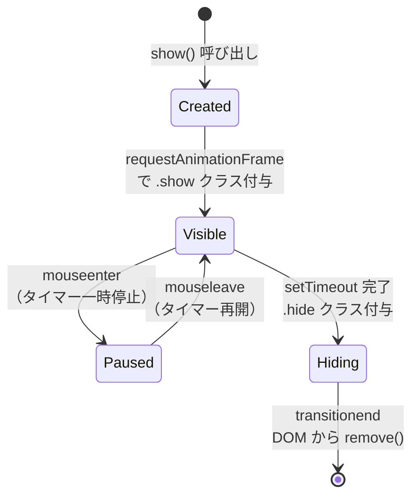

# Toast通知（Toast Notification）

> **一言で言うと:** ユーザーの操作を中断せずに、画面の端に短時間表示されて自動的に消える軽量な通知UI。モーダルと異なりフォーカスを奪わず、ユーザーが無視できる「非侵入型フィードバック」であることが設計上の本質。

## 概念

Toast通知は「パンがトースターから飛び出す」比喩に由来する。画面の端（通常は右下や上部中央）からスライドイン／フェードインし、数秒後に自動消滅する。

### 通知UIパターンの比較

| パターン | フォーカス奪取 | 操作ブロック | 自動消滅 | 用途 |
|---------|:----------:|:----------:|:-------:|------|
| **Toast** | ✗ | ✗ | ✓ | 保存完了、送信成功などの軽い確認 |
| **Snackbar** | ✗ | ✗ | ✓ | Toastと類似、Material Designの用語。アクション（「元に戻す」等）を1つ持てる |
| **Banner** | ✗ | ✗ | ✗ | ページ上部に固定表示。メンテナンス告知など |
| **Modal / Dialog** | ✓ | ✓ | ✗ | 削除確認など、ユーザーの明示的な応答が必要な場面 |
| **Inline Message** | ✗ | ✗ | ✗ | フォームバリデーション等、特定の要素に紐づくフィードバック |

**設計判断の基準:** ユーザーが内容を見逃しても問題ないか？ → Yes なら Toast、No ならモーダルや Inline Message を使う。

### Toast のライフサイクル



このライフサイクルの各段階で HTML（構造）、CSS（アニメーション）、JS（状態遷移）がそれぞれの責務を担う。

## HTML/CSS/JSによる実装

Toast通知はブラウザにネイティブ要素がなく、HTML/CSS/JSの3層で構築する。これは [[HTML-CSS-JS]] の責務分離が実践される典型的なUIパターンである。

### HTML — 構造とセマンティクス

Toast通知のアクセシビリティには **ARIA Live Region** が不可欠。`role="status"` または `role="alert"` を使うことで、スクリーンリーダーが動的に挿入されたコンテンツを読み上げる:

```html
<!-- Toastコンテナ — 画面の固定位置に配置 -->
<div id="toast-container" class="toast-container" aria-live="polite">
  <!-- JSで動的にToast要素を挿入 -->
</div>
```

- `aria-live="polite"` — 現在の読み上げが終わった後にToastの内容を通知する（一般的な成功・情報通知向け）
- `aria-live="assertive"` — 現在の読み上げを中断して即座に通知する（エラー通知向け）
- `role="status"` — 暗黙的に `aria-live="polite"` と `aria-atomic="true"` を持つ。情報やステータス更新に適切
- `role="alert"` — 暗黙的に `aria-live="assertive"` と `aria-atomic="true"` を持つ。エラーや重要な警告に適切

### CSS — 配置とアニメーション

```css
/* Toastコンテナ — ビューポートの右上に固定 */
.toast-container {
  position: fixed;
  top: 1rem;
  right: 1rem;
  z-index: 1000;
  display: flex;
  flex-direction: column;
  gap: 0.5rem;
  pointer-events: none; /* コンテナ自体はクリックを透過 */
}

/* 個々のToast */
.toast {
  pointer-events: auto; /* Toast自体はクリック可能 */
  min-width: 280px;
  max-width: 420px;
  padding: 0.75rem 1rem;
  border-radius: 0.5rem;
  background: var(--toast-bg, #323232);
  color: var(--toast-color, #fff);
  box-shadow: 0 4px 12px rgba(0, 0, 0, 0.15);
  font-size: 0.875rem;
  line-height: 1.5;

  /* アニメーション — transform + opacity で Reflow を回避 */
  transform: translateX(100%);
  opacity: 0;
  transition: transform 0.3s ease, opacity 0.3s ease;
}

.toast.show {
  transform: translateX(0);
  opacity: 1;
}

.toast.hide {
  transform: translateX(100%);
  opacity: 0;
}

/* バリアント */
.toast--success { --toast-bg: #2e7d32; }
.toast--error   { --toast-bg: #c62828; }
.toast--warning { --toast-bg: #e65100; }
.toast--info    { --toast-bg: #1565c0; }
```

**ポイント:** アニメーションに `transform` と `opacity` を使うことで、[[DOMツリーとノード]] の Reflow/Repaint を回避し、GPU のコンポジターレイヤーで処理させる。`top`/`right` のアニメーションは Reflow を引き起こすため避ける。

### TypeScript — 生成・表示・自動消滅

```typescript
type ToastVariant = 'success' | 'error' | 'warning' | 'info';

interface ToastOptions {
  variant?: ToastVariant;
  duration?: number;
}

class ToastManager {
  #container: HTMLElement;
  #defaultDuration: number;

  constructor(containerId = 'toast-container', defaultDuration = 4000) {
    this.#container = document.getElementById(containerId)!;
    this.#defaultDuration = defaultDuration;
  }

  show(message: string, { variant = 'info', duration = this.#defaultDuration }: ToastOptions = {}): void {
    const toast = document.createElement('div');
    toast.className = `toast toast--${variant}`;
    toast.textContent = message;
    // role を設定してスクリーンリーダーに通知
    toast.setAttribute('role', variant === 'error' ? 'alert' : 'status');

    this.#container.appendChild(toast);

    // アニメーション開始（次フレームまで待つ）
    requestAnimationFrame(() => {
      toast.classList.add('show');
    });

    // 自動消滅
    setTimeout(() => this.#dismiss(toast), duration);
  }

  #dismiss(toast: HTMLElement): void {
    toast.classList.replace('show', 'hide');
    toast.addEventListener('transitionend', () => toast.remove(), { once: true });
  }
}

// 使用例
const toastManager = new ToastManager();
toastManager.show('変更を保存しました', { variant: 'success' });
toastManager.show('ネットワークエラーが発生しました', { variant: 'error', duration: 6000 });
```

### React（TypeScript）での実装

```typescript
import { useState, useCallback, useRef } from 'react';

type ToastVariant = 'success' | 'error' | 'warning' | 'info';

interface Toast {
  id: string;
  message: string;
  variant: ToastVariant;
}

function useToast(duration = 4000) {
  const [toasts, setToasts] = useState<Toast[]>([]);
  const counterRef = useRef(0);

  const show = useCallback((message: string, variant: ToastVariant = 'info') => {
    const id = `toast-${++counterRef.current}`;
    setToasts(prev => [...prev, { id, message, variant }]);

    // 注意: 実務では useEffect のクリーンアップで clearTimeout し、
    // アンマウント時のタイマーリークを防ぐ必要がある
    setTimeout(() => {
      setToasts(prev => prev.filter(t => t.id !== id));
    }, duration);
  }, [duration]);

  return { toasts, show };
}

// コンポーネント
function ToastContainer({ toasts }: { toasts: Toast[] }) {
  return (
    <div className="toast-container" aria-live="polite">
      {toasts.map(t => (
        <div key={t.id} className={`toast toast--${t.variant} show`} role="status">
          {t.message}
        </div>
      ))}
    </div>
  );
}

// 使用例
function App() {
  const { toasts, show } = useToast();

  return (
    <>
      <button onClick={() => show('保存しました', 'success')}>保存</button>
      <ToastContainer toasts={toasts} />
    </>
  );
}
```

## Popover API との関係

2024年以降、ブラウザに Popover API（`popover` 属性）が実装され、Toast的なUIをよりネイティブに実装できるようになった:

```html
<!-- Popover API を使った Toast -->
<div id="toast" popover="manual" role="status" class="toast toast--success">
  保存が完了しました
</div>

<script>
const toast = document.getElementById('toast');

function showToast() {
  toast.showPopover();      // トップレイヤーに表示（z-index 管理不要）
  setTimeout(() => {
    toast.hidePopover();
  }, 4000);
}
</script>
```

Popover API の利点:
- **トップレイヤー（Top Layer）** に表示されるため、`z-index` の管理が不要
- `::backdrop` 擬似要素でスタイルを適用可能（ただしデフォルトは透明で、`<dialog showModal()>` と異なりインタラクションは遮断されない）
- `popover="auto"` なら外部クリックで自動的に閉じる
- ブラウザネイティブのフォーカス管理

ただし Toast は通常「自動消滅 + 複数同時表示」が必要であり、Popover API 単体ではスタック表示や自動消滅のタイマー管理はカバーされない。実務ではカスタム実装やライブラリとの併用が現実的。

## よくある落とし穴

### 1. `aria-live` の配置ミス

`aria-live` は**コンテナに事前に設定**しておく必要がある。動的に作成した要素に `aria-live` を付けても、スクリーンリーダーは変更を検知しない:

```javascript
// ❌ 動的要素に aria-live を付けても通知されない
const toast = document.createElement('div');
toast.setAttribute('aria-live', 'polite');
toast.textContent = '保存しました';
document.body.appendChild(toast);

// ✅ 事前にDOMに存在するコンテナに要素を追加する
// <div id="toast-container" aria-live="polite"></div> ← HTML に事前配置
const container = document.getElementById('toast-container');
const toast = document.createElement('div');
toast.textContent = '保存しました';
container.appendChild(toast);  // コンテナ内の変更が通知される
```

### 2. 重要な情報を Toast で表示する

Toast は自動消滅するため、ユーザーが見逃す可能性がある。以下のケースでは Toast を使うべきではない:

- **エラーの詳細** — フォームのバリデーションエラーは Inline Message で表示する
- **取り消し不能な操作の確認** — 削除確認はモーダルダイアログを使う
- **長いテキスト** — 4秒で読みきれない内容は Toast に適さない

### 3. `transition` のタイミングと DOM 操作の競合

要素を DOM に追加した直後にクラスを付けても、ブラウザがスタイルをバッチ処理するためアニメーションが発火しない:

```javascript
// ❌ アニメーションが発火しない場合がある
container.appendChild(toast);
toast.classList.add('show');  // 追加と同じフレームで処理される

// ✅ requestAnimationFrame で次フレームまで待つ
container.appendChild(toast);
requestAnimationFrame(() => {
  toast.classList.add('show');
});
```

### 4. 自動消滅のタイマーが操作中でも走り続ける

ユーザーが Toast にホバーしている間は「読んでいる最中」と見なし、タイマーを一時停止するのが良いUXパターン:

```javascript
let timerId;
let remaining = duration;
let startTime = Date.now();

function startTimer() {
  startTime = Date.now();
  timerId = setTimeout(() => dismiss(toast), remaining);
}

toast.addEventListener('mouseenter', () => {
  clearTimeout(timerId);
  remaining -= Date.now() - startTime; // 経過分を差し引く
});
toast.addEventListener('mouseleave', () => startTimer());

startTimer();
```

### 5. Toast の z-index 管理

`position: fixed` と高い `z-index` を使うが、モーダルやドロップダウンとの重なり順が問題になりやすい。Popover API のトップレイヤーを使うか、アプリケーション全体で z-index の設計方針を統一する必要がある。

## AIによる実装のアンチパターン

| アンチパターン | なぜ問題か | 対策 |
|---|---|---|
| ライブラリ丸ごと導入（react-toastify 等）を小規模アプリに使う | バンドルサイズ肥大、カスタマイズが困難 | 30行程度のカスタム実装で十分な場合が多い |
| 全 Toast に `role="alert"` を設定 | assertive な読み上げが頻発し、スクリーンリーダーユーザーの操作を妨害 | 情報通知は `role="status"`、エラーのみ `role="alert"` |
| `setTimeout` のみでアニメーション管理 | トランジション完了前に DOM から削除され、アニメーションが途切れる | `transitionend` イベントで削除タイミングを制御 |
| 固定の `top`/`left` でアニメーション | Reflow が発生しパフォーマンスが悪化 | `transform: translate()` を使う |
| Toast 内にフォームや複雑な操作を配置 | Toast は非侵入型の通知であり、操作UIはモーダルの責務 | アクションは「元に戻す」等の単一リンクに留める |

## 関連トピック

- [[HTML-CSS-JS]] — Toast は HTML（構造 + ARIA）、CSS（配置 + アニメーション）、JS（生成 + タイマー）の責務分離を実践する典型的なUIパターン
- [[DOMツリーとノード]] — Toast の動的挿入・削除は DOM 操作そのもの。`requestAnimationFrame` によるバッチ化が重要
- [[CoreWebVitals]] — Toast のアニメーションが CLS を発生させないよう `transform` を使う。大量の Toast 挿入は INP にも影響する
- [[イベントループ]] — `setTimeout` と `requestAnimationFrame` のタイミングはイベントループの理解が前提

## 参考リソース

- [ARIA Live Regions (MDN)](https://developer.mozilla.org/en-US/docs/Web/Accessibility/ARIA/Attributes/aria-live) — `aria-live` の仕様と使い方
- [Popover API (MDN)](https://developer.mozilla.org/en-US/docs/Web/API/Popover_API) — ブラウザネイティブのポップオーバー機能
- [Inclusive Components: Notifications](https://inclusive-components.design/notifications/) — アクセシビリティを考慮した通知パターンの設計ガイド
