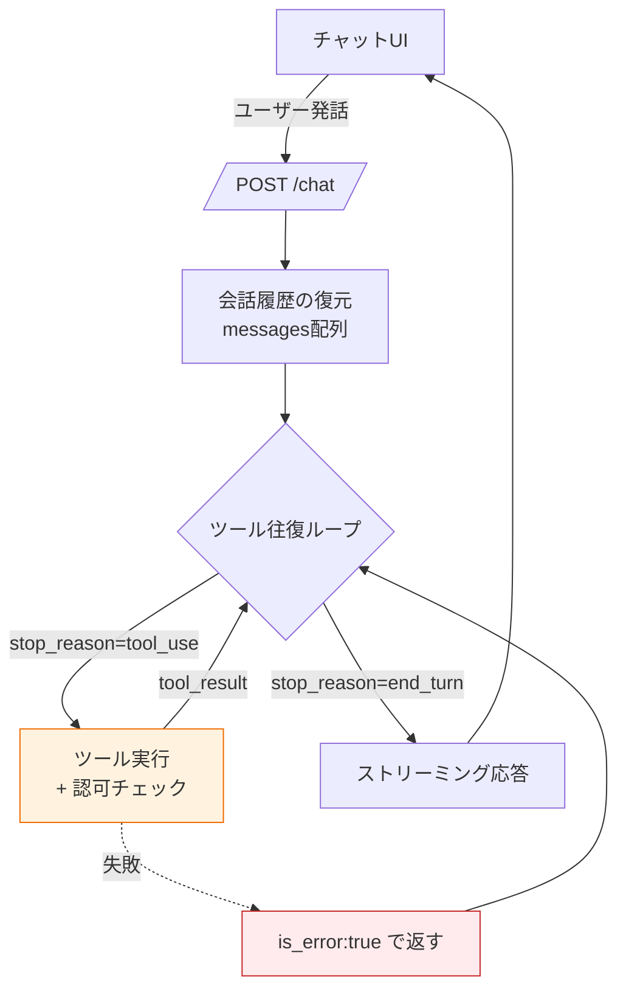

# Tool Calling — AIチャットボット実装（実用版）

> **一言で言うと:** [[ToolCalling]] の概念を、**実際に動くAIチャットボット**に落とし込む実装ガイド。マルチターン会話の状態管理・ストリーミングUI・ツール往復・OpenAIとAnthropicのフォーマット差分・本番で踏む落とし穴を、TypeScript を主軸にまとめる。「在庫を照会して注文をキャンセルできるサポートBot」を題材にする。

## このドキュメントの位置づけ

親トピック [[ToolCalling]] で「ツール呼び出しの原理と往復ループ」を理解した前提で、**プロダクトとして成立させるための実装の肉付け**を扱う。具体的には:

- 会話履歴（マルチターン）をどう保持するか
- ツール実行中をユーザーにどう見せるか（[[ストリームレスポンス]]）
- OpenAI と Anthropic のコードはどこが違うか
- 本番でハマる箇所（並列ツール・部分失敗・コンテキスト肥大）

## チャットボットの全体構造



要は親トピックの往復ループを、**(1) 会話履歴の永続化**と**(2) ストリーミング出力**で挟む構造になる。

## マルチターン会話の状態管理

LLM の Messages API は**ステートレス**だ。サーバーは前回の会話を覚えていないので、**毎回フル履歴を送る**必要がある。

```typescript
// 会話1セッション分の状態。DB/Redis などに保存して復元する
type Conversation = {
  sessionId: string;
  messages: Anthropic.MessageParam[]; // user / assistant の往復が全部入る
};

// ツール往復で追加した assistant ターン（tool_use 含む）と
// user ターン（tool_result 含む）も messages に積まれていく点に注意。
// これらを捨てると、次ターンでモデルが文脈を失う。
```

> [!warning] tool_use / tool_result も履歴に残す
> 「ユーザーに見せる文章だけ保存して、tool_use と tool_result は捨てる」とやりがちだが、捨てると**次ターンでモデルが「さっき何を調べたか」を忘れる**。`messages` 配列に積んだものは（コスト対策で要約しない限り）全部保存する。肥大化対策は後述の「コンテキスト管理」。

## ストリーミングでツール実行中を見せる

チャットUIでは回答をトークンごとに流す（[[ストリームレスポンス]]）。ツール往復があると「考え中 → ツール実行中 → 回答」の3段階をユーザーに見せたい。SSE（Server-Sent Events）でフロントにイベントを流す。

```typescript
import Anthropic from "@anthropic-ai/sdk";

const client = new Anthropic();

async function* chatStream(
  conv: Conversation,
  userText: string,
  userId: number,
): AsyncGenerator<{ type: string; data: string }> {
  conv.messages.push({ role: "user", content: userText });

  for (let i = 0; i < 10; i++) {
    const stream = client.messages.stream({
      model: "claude-opus-4-8",
      max_tokens: 1024,
      tools,
      messages: conv.messages,
    });

    // 文章トークンをそのままフロントへ流す
    for await (const event of stream) {
      if (
        event.type === "content_block_delta" &&
        event.delta.type === "text_delta"
      ) {
        yield { type: "token", data: event.delta.text };
      }
    }

    const resp = await stream.finalMessage();
    conv.messages.push({ role: "assistant", content: resp.content });

    if (resp.stop_reason !== "tool_use") return; // 完了

    // ツール実行（UIに「実行中」を表示）
    const toolResults: Anthropic.ToolResultBlockParam[] = [];
    for (const block of resp.content) {
      if (block.type !== "tool_use") continue;
      yield { type: "tool_start", data: block.name };

      const r = await runTool(block.name, block.input, userId); // 認可は中で
      toolResults.push({
        type: "tool_result",
        tool_use_id: block.id,
        content: r.content,
        is_error: r.isError,
      });
      yield { type: "tool_end", data: block.name };
    }
    conv.messages.push({ role: "user", content: toolResults });
  }
}
```

フロント側は `token` でテキストを追記し、`tool_start` / `tool_end` で「在庫を確認しています…」のようなスピナーを出す。

## 認可とバリデーションを実装の中心に置く

親トピックの最重要点の再掲: **モデル生成の input は外部入力**。ツール実装の本体は「処理」より「ガード」だと考える。

```typescript
async function runTool(
  name: string,
  input: any,
  userId: number,
): Promise<{ content: string; isError: boolean }> {
  try {
    switch (name) {
      case "get_order_status": {
        // ① 型・範囲の検証（モデルは負数や巨大値を出しうる）
        const orderId = Number(input.order_id);
        if (!Number.isInteger(orderId) || orderId <= 0) {
          return { content: "不正な注文番号です", isError: true };
        }
        // ② 認可（その注文がこのユーザーのものか）
        const order = await repo.findOrder(orderId);
        if (!order || order.userId !== userId) {
          return { content: "この注文は参照できません", isError: true };
        }
        return { content: JSON.stringify({ status: order.status }), isError: false };
      }
      case "cancel_order": {
        // 副作用の大きい操作。承認フラグが立っているときだけ実行する設計に
        // （UI側で「本当にキャンセルしますか？」を挟む / 確認トークンを検証）
        return await cancelWithGuard(input, userId);
      }
      default:
        return { content: `未知のツール: ${name}`, isError: true };
    }
  } catch (e) {
    // 失敗は throw せず is_error で返す → モデルがリカバリできる
    return { content: `エラー: ${(e as Error).message}`, isError: true };
  }
}
```

## OpenAI と Anthropic のフォーマット差分

概念は同じ（定義 → 呼び出し → 結果の往復）だが、構造名が違う。ベンダー抽象化を自作する前にこの差を把握する。

| 観点 | Anthropic (Claude) | OpenAI (GPT) |
|---|---|---|
| ツール定義のキー | `input_schema` | `parameters`（`{type:"function", function:{...}}` でラップ） |
| 呼び出しの在り処 | アシスタント `content` 内の `tool_use` ブロック | `message.tool_calls` 配列（`function.arguments` は**JSON文字列**） |
| 引数の形 | `block.input`（パース済みオブジェクト） | `tool_calls[].function.arguments`（**文字列なので `JSON.parse` が要る**） |
| 結果の返し方 | `role:"user"` の `tool_result` ブロック | `role:"tool"` のメッセージ（`tool_call_id` 指定） |
| 終了シグナル | `stop_reason === "tool_use"` | `finish_reason === "tool_calls"` |
| 並列呼び出し | 既定で複数 `tool_use` ブロック | 既定で複数 `tool_calls` 要素 |

### Anthropic 形式（再掲・簡略）

```typescript
// 定義
{ name, description, input_schema: { type: "object", properties, required } }
// 呼び出し: resp.content の中の { type:"tool_use", id, name, input }
// 結果: { role:"user", content:[{ type:"tool_result", tool_use_id, content }] }
```

### OpenAI 形式

```typescript
// 定義
{ type: "function", function: { name, description, parameters /* JSON Schema */ } }
// 呼び出し: resp.choices[0].message.tool_calls[] の
//   { id, function: { name, arguments /* JSON文字列！ */ } }
const args = JSON.parse(toolCall.function.arguments); // ← パースが必須
// 結果: { role:"tool", tool_call_id: toolCall.id, content: result }
```

> [!info] なぜ引数が文字列なのか（OpenAI）
> OpenAI は `arguments` をJSON**文字列**で返す。`JSON.parse` を忘れると `args.order_id` が `undefined` になる定番バグ。Anthropic はパース済みオブジェクト（`block.input`）で返すのでこの手間がない。どちらも**生成されたJSONの検証は自分で**行う必要がある点は共通。

## 本番で踏む落とし穴

### 1. 並列ツール結果の分割

モデルが3つのツールを同時に要求したとき、結果を**3つの別メッセージ**に分けて返すと、モデルが「並列呼び出しは効かない」と学習し、以降逐次呼び出しに退化する。**全 tool_result を1つの user メッセージに**まとめる。

### 2. 部分失敗の握りつぶし

3ツール中1つが失敗したとき、その1つの `tool_result` を**ドロップしてはいけない**。`is_error: true` を付けてでも、要求された全 `tool_use_id` に対応する結果を返す。1つでも欠けると400エラー（id不整合）になる。

### 3. コンテキストの肥大化

ツール往復が増えると `messages` が膨らみ、入力トークン＝コストが増える。対策:

- **プロンプトキャッシュ** — 変化しないシステムプロンプト/ツール定義をキャッシュし、再送コストを下げる。
- **古いツール結果の刈り取り（コンテキスト編集）** — もう参照しない巨大なツール出力を会話から除去する。
- **要約（コンパクション）** — 会話が長くなったら過去を要約に置き換える。

いずれも「会話履歴を全部素直に送り続けると破綻する」長時間エージェントの定番対策。

### 4. ループの暴走

ツールが常に同じ結果を返す等で、モデルが永遠に同じツールを呼び続けることがある。**最大反復回数**（例: 10）で必ず打ち切る。打ち切ったらユーザーに「うまく処理できませんでした」と返す。

### 5. tool_result への機密混入

DBから取った行をまるごと `tool_result` に詰めると、内部ID・他人の情報・トークンがモデル出力経由で漏れうる。**返すフィールドを最小限に絞る**（[[最小権限の原則]]の発想をデータにも適用）。

## ツールランナー（SDKヘルパー）を使う場合の注意

SDK の `toolRunner`（TS）/ `tool_runner`（Python）は往復ループを肩代わりしてくれるが、**モデルが要求したら登録関数を自動実行する**。つまり:

- 承認ゲート（「本当に削除しますか？」）を挟みたい副作用ツールには**不向き**。手動ループを使う。
- 認可・バリデーションは**関数の中に自分で書く**。ランナーは安全性を肩代わりしない。

読み取り専用ツール中心のBotならランナーで十分。書き込み・課金・削除が絡むなら手動ループで承認を挟む、と使い分ける。

## チェックリスト（実装レビュー用）

- [ ] `stop_reason`（/ `finish_reason`）を見てから content を走査しているか
- [ ] モデル生成 input を型・範囲・認可で検証しているか
- [ ] 並列ツール結果を**1つの user メッセージ**にまとめているか
- [ ] 失敗ツールも `is_error:true` で**全件**返しているか（id 欠落なし）
- [ ] ループ上限があるか
- [ ] 副作用ツールに承認ゲートがあるか（ランナー自動実行に注意）
- [ ] tool_result に機密を混入していないか
- [ ] コンテキスト肥大対策（キャッシュ / 刈り取り / 要約）を入れたか

## 関連トピック

- 親: [[ToolCalling]] — ツール呼び出しの原理と往復ループの基礎
- [[MCP]] — ツール群をサーバーとして標準化し複数クライアントで再利用する
- [[RAG]] — 検索した知識を文脈に渡す、ツール呼び出しと対をなす手法
- [[JSON-Schema]] — `input_schema` / `parameters` の文法と `additionalProperties:false`
- [[ストリームレスポンス]] — SSE によるトークン/イベントのストリーミング配信
- [[バリデーション]] — モデル生成 input を外部入力として検証する
- [[エラーハンドリング]] — `is_error` でモデルにリカバリさせる失敗前提の設計
- [[最小権限の原則]] — ツール権限と tool_result に渡すデータの最小化
- [[非同期処理とメッセージキュー]] — 重いツールを同期実行せずジョブに逃がす
