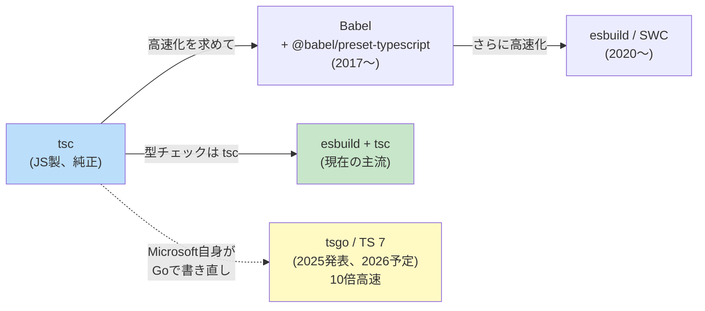

# TypeScript（TypeScript）

> **一言で言うと:** TypeScriptはJavaScriptに「ビルド時の静的型チェック」を後付けした言語で、JSの巨大エコシステムを活かしながら大規模開発の保守性を担保するために生まれた。**JSのスーパーセット**・**Gradual typing**・**構造的部分型**という3つの設計判断が言語の世界観を決め、トランスパイル後はただのJSとして動く（実行時の型保証はない）。2025年3月に Anders Hejlsberg がコンパイラのGo書き直し（TypeScript 7 / Corsa）を発表し、**2026年4月21日に TypeScript 7.0 Beta が `@typescript/native-preview`（tsgo）として公開**された。約10倍の高速化が現実になりつつある。

## 誕生と歴史的経緯

| 年月 | 主な転換点 |
|---|---|
| 2010 | 開発開始（Anders Hejlsberg、C#/Delphi/Turbo Pascal 設計者） |
| 2012 | 0.8 公開・OSS化、JS への段階的型付けを提案 |
| 2014 | Angular 2 採用で爆発的に普及 |
| 2017 | Babel + TS 統合、React コミュニティへ拡大しフロント標準化 |
| 2019 | Deno が TS を標準採用、サーバーサイドへ |
| 2022 | 4.9 / `satisfies` operator |
| 2023 | 5.0 / Decorators Stage 3 |
| 2024-11 | 5.7 / エラー報告改善 |
| 2025-03 | 5.8 / `require()` で ESM 対応、TypeScript 7（Go 書き直し / Corsa）発表 |
| **2026-04** | **TypeScript 7.0 Beta 公開（tsgo 配布開始）、約10倍高速ビルド** |

### 設計者と動機

設計者の **Anders Hejlsberg** は Microsoft の Technical Fellow で、Turbo Pascal（1983）・Delphi（1995）・C#（2000）を設計してきた言語設計の大家。Hejlsberg が C# で確立した「**型システムは大規模ソフトウェアの保守性を支える**」という信念を、Microsoft 内部の大規模 JavaScript コードベース（Bing / Office Web 等）の保守難に直面したことで JS にも適用しようとした、それが TypeScript の起源。

当時の選択肢は3つあった:

1. **新しい言語を作る** — Dart のように JS と非互換な代替言語を出す
2. **JS を直接拡張する標準化を待つ** — TC39 の動きに依存（遅い）
3. **JS のスーパーセットとして型を後付けする** — TypeScript の道

Microsoft は3番を選んだ。これにより**既存の JS コードはそのまま valid な TS コード**であり、エコシステム移行のハードルが極端に低かった。これが Dart / CoffeeScript / Flow（Facebook）と決定的に異なる成功要因。

### バージョン進化の山場

| バージョン | 主な貢献 |
|---|---|
| 0.8 (2012) | 初版OSS化。基本的な型注釈・interface・class |
| 1.5 (2015) | ES6 modules 構文サポート |
| 2.0 (2016) | `--strict` 導入。`null` と `undefined` を別の型として扱う `strictNullChecks` |
| 2.8 (2018) | **Conditional types** 導入。型の条件分岐が可能に |
| 3.0 (2018) | Project references。モノレポ対応 |
| 3.7 (2019) | Optional chaining (`?.`) と Nullish coalescing (`??`)、TC39先取り |
| 4.0 (2020) | Variadic tuple types |
| 4.9 (2022) | **`satisfies` operator** — 型を満たすかチェックしつつ推論を保つ |
| 5.0 (2023) | Decorators Stage 3 準拠、`const` type parameters |
| 5.7 (2024-11) | エラーメッセージ改善 |
| 5.8 (2025-03) | `require()` で ESM を読める、`--module node18` 安定化 |
| **7.0 Beta (2026-04)** | **コンパイラを Go で書き直し（Corsa）、`@typescript/native-preview`（tsgo）として公開、約10倍高速化** |

## 設計思想

TypeScript の設計判断は3つの哲学に集約される。

### 1. JavaScriptのスーパーセット（Strict superset of JS）

**すべての valid な JS は valid な TS でもある**。これは哲学であると同時に厳格な制約で、JS の挙動と矛盾する型システムは導入しない。例えば:

```typescript
// JSとして動くコードはそのままTS
function add(a, b) {
  return a + b;
}

// 型注釈を後から追加できる（gradual typing）
function add(a: number, b: number): number {
  return a + b;
}
```

`.js` ファイルを `.ts` にリネームしただけで TS プロジェクトの一部にできる。これが**JSプロジェクトの段階的TS移行**を可能にし、業界の事実上の標準言語にした最大の理由。

### 2. Gradual Typing（段階的型付け）

すべての箇所に型を書く必要はなく、**書かない部分は `any` 相当として扱われる**（`noImplicitAny: false` の場合）。型を書く労力と得られる安全性のトレードオフをプログラマが選べる:

```typescript
// 型を一切書かない（JSと同じ）
function process(data) {
  return data.items.map(item => item.value);
}

// 部分的に型を書く
function process(data: { items: { value: number }[] }) {
  return data.items.map(item => item.value); // 戻り値は推論される
}

// 厳密に書く
function process(data: ApiResponse): number[] {
  return data.items.map((item: Item): number => item.value);
}
```

ただし**推論が効く範囲**では型注釈を最小限にすべき。冗長な型注釈は可読性を下げる。

### 3. Structural Subtyping（構造的部分型）

これがTSが他の静的型言語（[[Go]] を除く）と決定的に違う点。**型の互換性は「名前」ではなく「形」で決まる**:

```typescript
interface Point {
  x: number;
  y: number;
}

interface Vector {
  x: number;
  y: number;
}

function distance(p: Point): number { /* ... */ return 0; }

const v: Vector = { x: 1, y: 2 };
distance(v); // ✅ OK — Point と Vector は構造が同じ
```

[[Go]] の interface も構造的だが、Go では**メソッドの集合**で判定する。TS は**プロパティの集合**で判定する点で異なる。Java/C# の名前的部分型（nominal subtyping）と対比すると:

```java
// Java（名前的）— 明示的に implements が必要
class Vector implements Point { /* ... */ }
```

```typescript
// TS（構造的）— 形が同じなら自動的に互換
const v: Point = { x: 1, y: 2, z: 3 } as Vector; // OK
```

構造的部分型のおかげで、**JSの「ダックタイピング」をそのまま型レベルで表現できる**。これが TS のゆるさと実用性の源。

## 型システムの核心

### 型推論（Type Inference）

TS は積極的に型を推論する。**多くの場面で型注釈は不要**:

```typescript
// 戻り値・変数・配列要素の型はすべて推論される
const numbers = [1, 2, 3]; // number[]
const doubled = numbers.map(n => n * 2); // number[]
const obj = { name: 'Alice', age: 30 }; // { name: string; age: number }

// const assertion で「リテラル型」として推論
const tuple = [1, 'a'] as const; // readonly [1, 'a']
```

ベストプラクティスは「**関数の引数と公開APIの戻り値だけ型を書き、内部はTSに推論させる**」。

### Narrowing（制御フロー解析）

TSは制御フローを解析して、ブロック内の型を絞り込む:

```typescript
function process(value: string | number | null) {
  if (value === null) {
    return; // この時点で value は string | number から null が除かれる
  }

  if (typeof value === 'string') {
    return value.toUpperCase(); // ここで value は string
  }

  return value.toFixed(2); // ここで value は number
}

// in 演算子による narrowing
type Bird = { fly: () => void };
type Fish = { swim: () => void };

function move(animal: Bird | Fish) {
  if ('fly' in animal) {
    animal.fly(); // animal は Bird
  } else {
    animal.swim(); // animal は Fish
  }
}
```

#### Discriminated Unions — 最重要パターン

タグ付きユニオンで網羅的な状態遷移を表現する:

```typescript
type Result<T> =
  | { status: 'loading' }
  | { status: 'success'; data: T }
  | { status: 'error'; error: Error };

function render(r: Result<User>) {
  switch (r.status) {
    case 'loading':
      return 'Loading...';
    case 'success':
      return r.data.name; // status === 'success' なので data が存在
    case 'error':
      return r.error.message;
    // exhaustive check — 全ケース処理した後の到達不能チェック
    default:
      const _exhaustive: never = r;
      throw new Error(_exhaustive);
  }
}
```

**`never` 型を使った網羅性チェック**は TS 設計の精髄。新しいバリアントを追加すると、対応漏れがビルドエラーで検出される。

### type vs interface

似て非なる2つの型宣言:

| 観点 | `type` | `interface` |
|------|--------|------------|
| プリミティブ・ユニオン・タプル | ✅ 可能 | ❌ 不可 |
| 拡張 | `&` (intersection) | `extends` |
| **宣言マージ** | ❌ 不可 | ✅ 可能（同名で複数定義可） |
| 関数オーバーロード | ❌ | ✅ |
| 自己参照型 | 制約あり | 自由 |
| 性能（型チェッカー内部） | やや劣る | やや優れる（大規模） |

```typescript
// type — ユニオンや関数型に強い
type ID = string | number;
type Handler = (event: Event) => void;
type ReadOnly<T> = { readonly [K in keyof T]: T[K] };

// interface — クラスやライブラリ型定義に強い
interface User {
  id: number;
  name: string;
}

interface User {
  email: string; // 宣言マージで User に email が追加される
}
// User は { id, name, email } として扱われる
```

**ベストプラクティス**:
- ライブラリの公開API → `interface`（利用者が宣言マージで拡張可能）
- アプリ内部 → `type`（より柔軟・ユニオンが書ける）

### Generics

```typescript
// 基本的なジェネリクス
function identity<T>(value: T): T {
  return value;
}

// 制約付き
function pluck<T, K extends keyof T>(obj: T, key: K): T[K] {
  return obj[key];
}

const user = { name: 'Alice', age: 30 };
pluck(user, 'name'); // string
pluck(user, 'age');  // number
pluck(user, 'foo');  // ❌ Error: 'foo' は user のキーではない
```

詳細は[[ジェネリクス]]を参照。

### Conditional Types — 型レベルの三項演算子

```typescript
type IsString<T> = T extends string ? true : false;

type A = IsString<'hello'>; // true
type B = IsString<42>;       // false

// 実用例: 関数の戻り値型を抽出（TSの組み込み型 ReturnType の実装）
type ReturnType<T> = T extends (...args: any[]) => infer R ? R : never;

function getUser() { return { name: 'Alice' }; }
type User = ReturnType<typeof getUser>; // { name: string }
```

`infer` キーワードは「型から部分を抽出する」強力な道具。

### Mapped Types — 型を変換する

```typescript
// 既存型の全プロパティを optional にする
type Partial<T> = { [K in keyof T]?: T[K] };

// 全プロパティを readonly にする
type Readonly<T> = { readonly [K in keyof T]: T[K] };

// 特定キーだけ抽出
type Pick<T, K extends keyof T> = { [P in K]: T[P] };

interface User {
  id: number;
  name: string;
  email: string;
}

type PartialUser = Partial<User>; // { id?: number; name?: string; email?: string }
type UserPreview = Pick<User, 'id' | 'name'>; // { id: number; name: string }
```

これら（`Partial` / `Pick` / `Omit` / `Record` 等）は標準ライブラリで提供される。**実装を読むだけで TS の型システムの威力が分かる**。

### `satisfies` Operator（TS 4.9+）

「型を満たすかチェックしたいが、推論される型は具体的なまま保ちたい」という長年の要望を解決:

```typescript
type Colors = 'red' | 'green' | 'blue';

// ❌ 型注釈すると、推論結果が広くなる
const palette: Record<Colors, string> = {
  red: '#ff0000',
  green: '#00ff00',
  blue: '#0000ff',
};
palette.red.toUpperCase(); // OK だが、palette.red の型は string

// ✅ satisfies — チェックしつつ具体的な型を保つ
const palette = {
  red: '#ff0000',
  green: '#00ff00',
  blue: '#0000ff',
} satisfies Record<Colors, string>;
palette.red.toUpperCase(); // OK、型は '#ff0000'（リテラル型）
```

### Template Literal Types

文字列リテラルの型レベル操作:

```typescript
type EventName<T extends string> = `on${Capitalize<T>}`;

type ClickEvent = EventName<'click'>; // 'onClick'
type HoverEvent = EventName<'hover'>; // 'onHover'

// 実用例: APIエンドポイントの型生成
type ApiPath = `/api/${string}`;
const path: ApiPath = '/api/users'; // OK
const bad: ApiPath = '/users';      // ❌ Error
```

## 実行時の型保証はない（Type Erasure）

**TSの最大の落とし穴**: コンパイル時の型情報は、ビルド後に**完全に消える**:

```typescript
// TS
interface User {
  id: number;
  name: string;
}

function isUser(value: unknown): value is User {
  return typeof value === 'object' && value !== null
    && 'id' in value && 'name' in value;
}

// ↓ ビルド後（型情報なし）
function isUser(value) {
  return typeof value === 'object' && value !== null
    && 'id' in value && 'name' in value;
}
```

外部入力（API レスポンス、フォーム、`localStorage`、`JSON.parse`）は、**型システムの管轄外**。境界では必ずランタイムバリデーションが必要:

```typescript
// ❌ 危険 — APIが嘘をついていたら検出できない
const user: User = await fetch('/api/me').then(r => r.json());

// ✅ Zod でランタイム検証
import { z } from 'zod';

const UserSchema = z.object({
  id: z.number(),
  name: z.string(),
});
type User = z.infer<typeof UserSchema>; // 型もスキーマから生成

const user: User = UserSchema.parse(await fetch('/api/me').then(r => r.json()));
// JSONが想定外なら例外が投げられる
```

ライブラリ選択肢: **Zod**（最普及）/ **Valibot**（軽量）/ **io-ts**（fp-ts エコシステム）/ **ArkType**（高速）。

## ツールチェーンの進化と TypeScript 7（Corsa）



### 現状（〜2026前半）の主流

- **型チェック** = tsc（JS 製、遅いが正確）
- **トランスパイル** = esbuild / SWC（10〜100倍高速だが型チェックなし）
- **dev server** = Vite（内部で esbuild）/ Turbopack（内部で SWC）

参考: [[モジュールバンドラ-webpackとTurbopack]]

### TypeScript 7（コードネーム Corsa）

2025年3月、**Microsoft 公式が tsc を Go で書き直す**ことを発表。Hejlsberg 自ら陣頭指揮:

- VS Code（約150万行）の型チェックが **約77.8秒 → 約7.5秒（10.4倍）**
- 小規模プロジェクトでも 2-5倍高速化
- **2026年4月21日に TypeScript 7.0 Beta が公開**（`@typescript/native-preview` パッケージとして配布、コマンドは `tsgo`）
- 既存の型システムは完全互換（書き直しは実装のみ）

「**tsc は遅いから別ツールで補う**」というエコシステムの前提が、Microsoft 自身によって解消されつつある。今後 `tsgo` への移行が進む見込み。

## エコシステムとtsconfig

### tsconfig.json の主要オプション

```jsonc
{
  "compilerOptions": {
    // 言語レベル
    "target": "ES2022",
    "module": "NodeNext",
    "moduleResolution": "NodeNext",
    "lib": ["ES2023", "DOM"],

    // 型チェック厳格化（必須）
    "strict": true,                   // 全 strict オプションを有効化
    "noUncheckedIndexedAccess": true, // 配列アクセスを T | undefined として扱う
    "exactOptionalPropertyTypes": true,
    "noImplicitOverride": true,

    // 出力制御
    "outDir": "./dist",
    "declaration": true,              // .d.ts 生成
    "sourceMap": true,
    "isolatedModules": true,          // SWC/esbuild 互換に必要
    "isolatedDeclarations": true,     // TS 5.5+ — .d.ts を高速生成

    // モジュール相互運用
    "esModuleInterop": true,
    "skipLibCheck": true              // node_modules の型チェックをスキップ（推奨）
  },
  "include": ["src/**/*"],
  "exclude": ["node_modules", "dist"]
}
```

`"strict": true` は実質必須。「strict なしの TS」はもはや TS と呼べない。

### DefinitelyTyped（@types）

JS ライブラリに後付けで型を提供するコミュニティリポジトリ:

```bash
pnpm add lodash
pnpm add -D @types/lodash  # 型定義
```

近年は型をライブラリ内に同梱する流れ（特に新規ライブラリ）。`@types/*` が必要なのは古い JS ライブラリのみになりつつある。

## 代表的なイディオム

### Branded Types（公称型のエミュレート）

構造的型のゆるさを補う:

```typescript
type Brand<T, B> = T & { __brand: B };

type UserId = Brand<number, 'UserId'>;
type PostId = Brand<number, 'PostId'>;

function getUser(id: UserId) { /* ... */ }

const userId = 123 as UserId;
const postId = 456 as PostId;

getUser(userId); // OK
getUser(postId); // ❌ Error — 数値だが別の型
getUser(789);    // ❌ Error — naked number は UserId ではない
```

### Builder パターン with chained types

```typescript
class QueryBuilder<T> {
  private filters: Array<(item: T) => boolean> = [];

  where<K extends keyof T>(key: K, value: T[K]): this {
    this.filters.push(item => item[key] === value);
    return this;
  }

  execute(items: T[]): T[] {
    return items.filter(item => this.filters.every(f => f(item)));
  }
}

interface User { id: number; name: string; role: 'admin' | 'user'; }

const result = new QueryBuilder<User>()
  .where('role', 'admin')   // ✅ role の値型に合致
  .where('name', 'Alice')   // ✅
  .where('foo', 'bar')      // ❌ 'foo' は User のキーではない
  .execute(users);
```

### Type Predicate（is）と Assertion Function

```typescript
// is 述語 — 型ガード関数
function isString(value: unknown): value is string {
  return typeof value === 'string';
}

const x: unknown = 'hello';
if (isString(x)) {
  x.toUpperCase(); // x は string にナローイング
}

// assertion function — 検証失敗で例外を投げる
function assertIsString(value: unknown): asserts value is string {
  if (typeof value !== 'string') throw new Error('Not a string');
}

const y: unknown = getValue();
assertIsString(y);
y.toUpperCase(); // y は string
```

## よくある落とし穴

### 1. `any` と `unknown` の混同

```typescript
// any — 型チェックを完全に無効化（危険）
let a: any = 'hello';
a.foo.bar.baz(); // 何でもコンパイルが通る → 実行時エラー

// unknown — 「何かわからない」を明示（安全）
let u: unknown = 'hello';
u.toUpperCase(); // ❌ Error — 型を絞る必要がある
if (typeof u === 'string') {
  u.toUpperCase(); // OK
}
```

外部入力には必ず `unknown`、`any` は最終手段。

### 2. 構造的型による意図しない代入

```typescript
interface Person { name: string; }
interface User { name: string; password: string; }

const user: User = { name: 'Alice', password: 'secret' };

// ❌ 型システム的にはOKだが、論理的にはまずい
function greet(p: Person) {
  console.log(p.name);
}
greet(user); // password も渡してしまう
```

機密情報は **Branded types** で公称型化するか、**`Pick<T, K>` でDTOを明示**する。

### 3. 関数の bivariance（メソッドと function プロパティの違い）

```typescript
// メソッド構文 — bivariant（緩い）
interface A {
  handler(arg: string | number): void;
}

// 関数プロパティ構文 — contravariant（厳密）
interface B {
  handler: (arg: string | number) => void;
}

const a: A = { handler: (arg: string) => {} };  // ✅ OK（緩い）
const b: B = { handler: (arg: string) => {} };  // ❌ Error（厳密）
```

`strictFunctionTypes` 下でも**メソッド構文だけは bivariant**。これは過去のJSコード資産との互換性のため意図的に残されている。**関数プロパティ構文の方が型安全**。

### 4. enum の落とし穴

```typescript
// numeric enum は逆引きできて便利だが、型としては緩い
enum Status {
  Active = 1,
  Inactive = 2,
}

const s: Status = 999; // ✅ コンパイル通る！数値ならどれでも

// const enum は埋め込まれてバンドル後消えるが isolatedModules と非互換
const enum Color { Red, Green, Blue }

// ✅ 推奨: union of literal types
type Status = 'active' | 'inactive';

// ✅ 推奨: as const オブジェクト
const Status = {
  Active: 'active',
  Inactive: 'inactive',
} as const;
type Status = typeof Status[keyof typeof Status];
```

**TS 5.0以降、enum 自体を避け literal union を使うのが現代的**。

### 5. `useState<T>` の初期値での型推論失敗

```tsx
// ❌ never[] と推論されてしまう
const [items, setItems] = useState([]);
setItems([1, 2, 3]); // Error: number[] is not assignable to never[]

// ✅ 明示的にジェネリクスを指定
const [items, setItems] = useState<number[]>([]);
```

### 6. 型注釈と `satisfies` の使い分け

```typescript
type Theme = { primary: string; secondary: string; };

// ❌ 注釈 — 推論が広がる、typoも検出されない
const myTheme: Theme = {
  primary: '#ff0000',
  secondary: '#00ff00',
  primaray: '#0000ff', // ← typo に気付かない（excess property check に依存）
};

// ✅ satisfies — チェックしつつリテラル型を保つ
const myTheme = {
  primary: '#ff0000' as const,
  secondary: '#00ff00' as const,
} satisfies Theme;
// myTheme.primary は '#ff0000'（より具体的）
```

## AIによる実装のアンチパターン

| アンチパターン | なぜ問題か | 対策 |
|---|---|---|
| `any` を多用する | 型システムを実質無効化、実行時エラーが頻発 | 不明な型は `unknown` を使い、型ガードで絞る |
| 過度に冗長な型注釈 | 推論可能な箇所まで書いて可読性が下がる | 関数引数と公開APIの戻り値だけ書き、内部は推論に任せる |
| ランタイムバリデーションを省略 | `as User` で型を主張しても、API レスポンスの実体は不明 | Zod / Valibot で境界を守る |
| 列挙には `enum` を使う | numeric enum は型安全性が低い、tree-shaking 困難 | `as const` オブジェクトか literal union を使う |
| `Function` 型を使う | あらゆる関数を許容してしまい型安全性なし | `(arg: T) => U` のような具体的な関数型を書く |
| 全ての型を `interface` で書く | type の方が適切な場面（union, mapped, conditional）でも使ってしまう | type と interface の使い分けを意識 |
| 型引数を全部明示する | 推論できる場合も冗長な `<T>` を書く | 推論に任せ、必要な箇所のみ明示 |
| `as` キャストで型を強制する | 型システムをバイパスし、実行時エラーの原因 | 型ガード関数（`is`）か satisfies を使う |
| TypeScript の標準ユーティリティ型を再実装 | `Partial` / `Pick` / `Omit` / `ReturnType` 等を独自に書いてしまう | `lib.es5.d.ts` の組み込み型を確認 |
| `@ts-ignore` で型エラーを抑制 | 後から見ると何が問題だったか分からない | `@ts-expect-error` を使い、説明コメントを必ず付ける |

## 関連トピック

- [[プログラミング言語の系譜と選択]] — 親トピック
- [[JavaScript]] — TS の基盤、TS が解決しようとした問題の発生源
- [[ジェネリクス]] — TS の Generics の詳細
- [[インターフェース]] — TS interface と他言語の比較
- [[Node.js]] — TS の主要なサーバーサイドランタイム
- [[モジュールバンドラ-webpackとTurbopack]] — TS のビルドツールチェーン
- [[OpenAPIとスキーマ駆動開発]] — API 境界での型生成
- [[Reactの設計思想とフック]] — TS と React の組み合わせ

## 参考リソース

- [TypeScript公式ドキュメント](https://www.typescriptlang.org/docs/) — 公式ハンドブック
- [TypeScript 5.8 リリースノート](https://devblogs.microsoft.com/typescript/announcing-typescript-5-8/)
- [TypeScript 7 Progress (Dec 2025)](https://devblogs.microsoft.com/typescript/progress-on-typescript-7-december-2025/) — Go 書き直しの最新状況
- [Effective TypeScript (Dan Vanderkam)](https://effectivetypescript.com/) — 実践パターン集の決定版
- [Type Challenges](https://github.com/type-challenges/type-challenges) — 型レベルプログラミングの問題集
- [Total TypeScript (Matt Pocock)](https://www.totaltypescript.com/) — 高度な型テクニック
- 書籍: 『プログラミングTypeScript』(Boris Cherny, O'Reilly) — 言語仕様と設計思想の網羅
- 書籍: 『型システム入門』(Pierce, Benjamin C.) — TS の理論的背景（structural typing 等）

## 学習メモ

- TS は「JavaScript の型注釈」ではなく、**「型レベルでプログラミングできる独立した言語」** として捉えると理解が進む。Conditional types / Mapped types / Template literal types を組み合わせると、ほぼ任意の型変換が書ける
- `satisfies` は2022年末に登場した比較的新しいオペレーターで、TSのコードベースの「型注釈の書き方」が大きく変わった。レビューする AI 生成コードでは古いパターン（型注釈で広がる推論）が混在しがち
- TypeScript 7（Go 版）は2026年中に出る見込み。これにより「tsc が遅いから esbuild/SWC で代用」というエコシステムの前提が崩れ、`tsc` 単体に回帰する可能性がある
