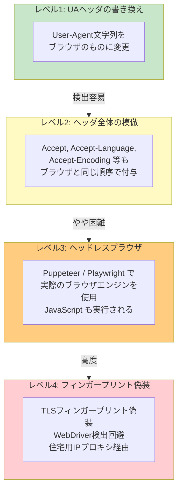
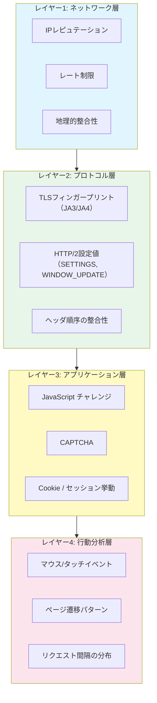

# UA偽装とボット検出（User-Agent Spoofing and Bot Detection）

> **一言で言うと:** UA偽装はスクレイパーやクローラーがブラウザのUser-Agent文字列を模倣してアクセス制限を回避する手法。サーバー側はUA文字列だけでなく、ヘッダ順序・TLSフィンガープリント・JavaScript実行・行動パターンなど多層的なシグナルを組み合わせてボットを検出する。

## なぜUA偽装が行われるのか

多くのWebサーバーはUser-Agentヘッダを見てリクエストの送信元を判別し、ボットからのアクセスを制限している。スクレイパーがブラウザのUA文字列を偽装する動機は以下の通りである。

| 動機 | 説明 |
|------|------|
| **robots.txt 回避** | ボット用UAで識別されると `Disallow` ルールでブロックされる |
| **コンテンツの出し分け回避** | ボットに対して簡易版HTMLや空ページを返すサイトがある |
| **レート制限の回避** | ボット判定されると厳しいレート制限が適用される |
| **CAPTCHAの回避** | ボット判定でCAPTCHAチャレンジが表示される |

```
# スクレイパーのデフォルトUA → すぐにブロックされる
User-Agent: python-requests/2.31.0
User-Agent: Go-http-client/1.1
User-Agent: curl/8.4.0

# UA偽装 → ブラウザからのアクセスに見せかける
User-Agent: Mozilla/5.0 (Windows NT 10.0; Win64; x64) AppleWebKit/537.36 (KHTML, like Gecko) Chrome/125.0.0.0 Safari/537.36
```

## UA偽装の手法と段階

スクレイピングにおけるUA偽装は単純なヘッダ書き換えから高度なブラウザエミュレーションまで段階がある。



### レベル1: UA文字列の書き換え

最も単純な偽装。HTTPライブラリのデフォルトUAをブラウザのものに差し替える。

```python
import requests

# ❌ デフォルトUA → 即座にボット判定される
response = requests.get('https://example.com')
# User-Agent: python-requests/2.31.0

# UA偽装
headers = {
    'User-Agent': 'Mozilla/5.0 (Windows NT 10.0; Win64; x64) AppleWebKit/537.36 (KHTML, like Gecko) Chrome/125.0.0.0 Safari/537.36',
}
response = requests.get('https://example.com', headers=headers)
```

```go
package main

import (
	"fmt"
	"net/http"
	"io"
)

func main() {
	client := &http.Client{}
	req, _ := http.NewRequest("GET", "https://example.com", nil)

	// デフォルト: Go-http-client/1.1
	// UA偽装
	req.Header.Set("User-Agent",
		"Mozilla/5.0 (Windows NT 10.0; Win64; x64) AppleWebKit/537.36 (KHTML, like Gecko) Chrome/125.0.0.0 Safari/537.36")

	resp, _ := client.Do(req)
	defer resp.Body.Close()
	body, _ := io.ReadAll(resp.Body)
	fmt.Printf("受信バイト数: %d\n", len(body))
}
```

### レベル2: HTTPヘッダ全体の模倣

ブラウザは特定の順序でヘッダを送信する。UAだけ変えても他のヘッダがHTTPライブラリのデフォルトのままだと矛盾が生じる。

```python
# ブラウザが実際に送信するヘッダ構成を模倣
headers = {
    'User-Agent': 'Mozilla/5.0 (Windows NT 10.0; Win64; x64) AppleWebKit/537.36 ...',
    'Accept': 'text/html,application/xhtml+xml,application/xml;q=0.9,image/avif,image/webp,*/*;q=0.8',
    'Accept-Language': 'ja,en-US;q=0.7,en;q=0.3',
    'Accept-Encoding': 'gzip, deflate, br',
    'Connection': 'keep-alive',
    'Upgrade-Insecure-Requests': '1',
    'Sec-Fetch-Dest': 'document',
    'Sec-Fetch-Mode': 'navigate',
    'Sec-Fetch-Site': 'none',
    'Sec-Fetch-User': '?1',
}
```

ポイントは **ヘッダの順序** である。Chrome と Firefox ではヘッダの送信順が異なり、UAが Chrome を名乗りながら Firefox の順序でヘッダを送ると不整合が検出される。

### レベル3: ヘッドレスブラウザ

Puppeteer（Node.js）や Playwright で実際のブラウザエンジンを制御する。JavaScript が実行されるため、SPAのレンダリング結果も取得できる。

```typescript
import puppeteer from 'puppeteer';

const browser = await puppeteer.launch({
  headless: true,  // Puppeteer v22 以降のデフォルト（新ヘッドレスモード）
  args: ['--no-sandbox'],
});

const page = await browser.newPage();

// UA の上書き（ヘッドレス検出を回避するため）
await page.setUserAgent(
  'Mozilla/5.0 (Windows NT 10.0; Win64; x64) AppleWebKit/537.36 (KHTML, like Gecko) Chrome/125.0.0.0 Safari/537.36'
);

await page.goto('https://example.com', { waitUntil: 'networkidle2' });
const content = await page.content();
console.log(content.length);

await browser.close();
```

ただし、ヘッドレスブラウザには検出ポイントが多数存在する（後述の「ボット検出」参照）。

## サーバー側のボット検出技術

UA偽装に対するサーバー側の防御は多層的である。単一の手法では不十分であり、複数のシグナルを組み合わせるのが現代の標準的アプローチ。



### TLSフィンガープリント（JA3/JA4）

TLSハンドシェイク（ClientHello）の中身は、クライアントの実装ごとに異なる。対応する暗号スイートの一覧、拡張（Extensions）の順序、サポートする楕円曲線グループなどからフィンガープリントを計算する。

```
# Chrome のJA3フィンガープリント（説明用のダミー値）
TLS Version: 0x0303 (TLS 1.2)
Ciphers: 4865,4866,4867,49195,49199,...
Extensions: 0,23,65281,10,11,35,...
→ JA3 Hash: xxxxxxxxxxxxxxxxxxxxxxxxxxxxxxxx（実値はChromeバージョンで変動）

# Python requests のJA3フィンガープリント（説明用のダミー値）
TLS Version: 0x0303
Ciphers: 49195,49199,49196,49200,...
Extensions: 0,23,65281,10,11,...
→ JA3 Hash: yyyyyyyyyyyyyyyyyyyyyyyyyyyyyyyy ← Chrome と異なる
```

**UA が Chrome を名乗っているのに TLS フィンガープリントが Python のものであれば、偽装と判定できる。** この検出はアプリケーションコードではなくリバースプロキシやCDN（Cloudflare, Akamai等）のレベルで行われる。

### HTTP/2フィンガープリント

HTTP/2 の接続初期化時に送信される SETTINGS フレームや WINDOW_UPDATE の値もブラウザ実装ごとに異なる。UA偽装では見落とされがちなシグナルであり、TLSフィンガープリントと組み合わせることで検出精度が上がる。

### ヘッドレスブラウザの検出

ヘッドレスブラウザ（Headless Browser）には以下の検出ポイントがある。

| 検出手法 | 説明 |
|---------|------|
| `navigator.webdriver` | ヘッドレスブラウザでは `true` になる。Puppeteer は自動で設定を回避するが、検出スクリプトとの競争が続く |
| `navigator.plugins` の長さ | 通常のブラウザにはプラグイン配列が存在するが、ヘッドレスでは空になりやすい |
| `window.chrome` の有無 | Chrome 固有のオブジェクト。ヘッドレスでの挙動が異なる場合がある |
| WebGL レンダリング | GPU 情報やレンダリング結果でヘッドレス環境が識別される |
| Canvas フィンガープリント | Canvas API による描画結果のハッシュが環境ごとに異なる |
| タイミング分析 | ボットは人間と異なる速度でページを読む。リクエスト間隔が均等すぎると不自然 |

```javascript
// サーバー側に送信されるクライアント検出スクリプトの例
const signals = {
  webdriver: navigator.webdriver,
  plugins: navigator.plugins.length,
  languages: navigator.languages,
  hardwareConcurrency: navigator.hardwareConcurrency,
  // Chrome固有のオブジェクトの存在確認
  hasChrome: !!window.chrome,
  // 通知権限の初期状態（ヘッドレスでは挙動が異なる場合あり）
  notificationPermission: Notification.permission,
};
// → サーバーに送信して整合性を検証
```

### 行動分析（Behavioral Analysis）

最も回避が困難な検出手法。ユーザーの行動パターンを統計的に分析する。

- **リクエスト間隔**: 人間は不規則な間隔でページ遷移するが、ボットは均等な間隔や極端に速い間隔になりやすい
- **マウスの動き**: 人間のマウス軌跡はベジェ曲線的に滑らかだが、プログラムによる `moveTo(x, y)` は直線的
- **ページ遷移パターン**: 人間は関連ページ間を往来するが、ボットはサイトマップを機械的に順番に辿る
- **CSS/画像の読み込み**: 人間のブラウザは CSS や画像を読み込むが、単純なスクレイパーは HTML だけを取得する

## 防御側のコード例

### Express — 多層ボット検出ミドルウェア

```typescript
import { Request, Response, NextFunction } from 'express';

// 既知のボットUA（ブロック対象）
const KNOWN_BOT_UAS = [
  'python-requests', 'Go-http-client', 'curl/', 'wget/',
  'scrapy', 'httpclient', 'java/', 'libwww-perl',
];

// ヘッダの整合性を検証
function validateHeaderConsistency(req: Request): boolean {
  const ua = req.headers['user-agent'] ?? '';

  // Chrome を名乗るなら Sec-Fetch-* ヘッダが存在するはず
  if (ua.includes('Chrome/') && !req.headers['sec-fetch-mode']) {
    return false;
  }

  // Accept-Language がない GET リクエストはブラウザではありえない
  if (req.method === 'GET' && !req.headers['accept-language']) {
    return false;
  }

  return true;
}

function botDetection(req: Request, res: Response, next: NextFunction) {
  const ua = req.headers['user-agent'] ?? '';

  // レベル1: 既知のボットUAをブロック
  if (KNOWN_BOT_UAS.some(bot => ua.toLowerCase().includes(bot))) {
    return res.status(403).json({ error: 'Automated access not permitted' });
  }

  // レベル2: ヘッダ整合性チェック
  if (!validateHeaderConsistency(req)) {
    // 即座にブロックせず、CAPTCHA チャレンジにリダイレクト
    return res.status(429).json({ error: 'Please verify you are human' });
  }

  next();
}
```

### Python（FastAPI）— レート制限とUA検証の組み合わせ

```python
from fastapi import FastAPI, Request, HTTPException
from collections import defaultdict
import time

app = FastAPI()

# IP単位のアクセス記録
access_log: dict[str, list[float]] = defaultdict(list)

RATE_LIMIT_WINDOW = 60  # 秒
RATE_LIMIT_MAX = 30     # ウィンドウ内の最大リクエスト数

SUSPICIOUS_UAS = ['python-requests', 'Go-http-client', 'curl/', 'scrapy']

@app.middleware("http")
async def bot_detection(request: Request, call_next):
    ua = request.headers.get('user-agent', '')
    ip = request.client.host

    # 既知のスクレイパーUA
    if any(bot in ua.lower() for bot in SUSPICIOUS_UAS):
        raise HTTPException(status_code=403, detail='Automated access not permitted')

    # レート制限
    now = time.time()
    access_log[ip] = [t for t in access_log[ip] if now - t < RATE_LIMIT_WINDOW]
    if len(access_log[ip]) >= RATE_LIMIT_MAX:
        raise HTTPException(status_code=429, detail='Rate limit exceeded')
    access_log[ip].append(now)

    return await call_next(request)
```

## Webスクレイピングの法的・倫理的側面

UA偽装による[[Webスクレイピング]]は技術的な問題だけでなく、法的・倫理的な論点も伴う。利用規約違反は契約責任のリスクを伴い、UA偽装はこの制限を意図的に迂回する行為とみなされうる。法的フレームワーク（著作権法30条の4、不正アクセス禁止法、hiQ Labs v. LinkedIn 判例、GDPR 等）の詳細は [[Webスクレイピング#法的・倫理的フレームワーク|Webスクレイピングの法的・倫理的フレームワーク]] を参照。

なお、robots.txt の無視自体は日本の不正アクセス禁止法の直接的な対象ではない（同法は ID/パスワード等の **アクセス制御機能** を回避する行為を対象とする）。ただし、業務妨害や利用規約違反の観点で問題になる可能性はある。

## よくある落とし穴

### 1. UAだけ変えて他のシグナルを見落とす

UA文字列をブラウザに変えても、TLSフィンガープリントやヘッダ順序が HTTPライブラリのデフォルトのままだと簡単に検出される。現代の商用ボット検出サービス（Cloudflare Bot Management, Akamai Bot Manager 等）はUA以外の数十のシグナルを分析している。

### 2. ボット検出を過剰に実装して正規ユーザーをブロックする

厳しすぎるボット検出は正規ユーザー（古いブラウザ、アクセシビリティツール、スクリーンリーダー）を誤検出する。特に `navigator.webdriver` チェックだけに頼ると、Selenium を使った自動テストも影響を受ける。

### 3. robots.txt とサーバーサイド制御を混同する

robots.txt は「守ってほしいルール」であり、技術的な制御ではない。本気でスクレイピングを防ぎたい場合は、サーバーサイドでのレート制限、認証、ヘッダ検証を実装する必要がある。

### 4. 固定のUA文字列を使い続ける

ブラウザのバージョンは頻繁に更新される。1年前の Chrome バージョンをUA文字列に使い続けると、古すぎるバージョンとしてフラグが立つ。防御側はUAのバージョン番号も検証している。

## 関連トピック

- [[HTTP-HTTPS]] — 親トピック。User-Agentを含むHTTPヘッダの仕様
- [[User-Agentと生成AIクローラー]] — 生成AIのUA文字列とAIクローラーの制御
- [[レート制限]] — ボット検出と組み合わせたリクエスト頻度の制限
- [[TLS-SSL]] — TLSフィンガープリント（JA3/JA4）による検出の基盤
- [[CORS]] — オリジン検証によるクロスサイトリクエストの制御

## 参考リソース

- **Cloudflare: Bot Management** — https://www.cloudflare.com/products/bot-management/
- **JA3 フィンガープリント（Salesforce）** — https://github.com/salesforce/ja3
- **CreepJS（ブラウザフィンガープリント検出テスト）** — https://abrahamjuliot.github.io/creepjs/
- **Puppeteer Stealth Plugin** — https://github.com/berstend/puppeteer-extra/tree/master/packages/puppeteer-extra-plugin-stealth
