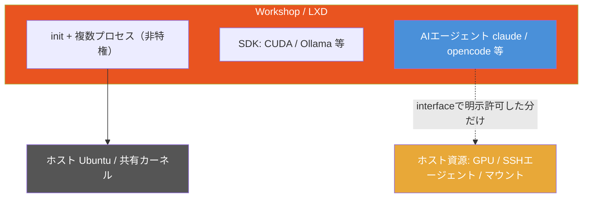
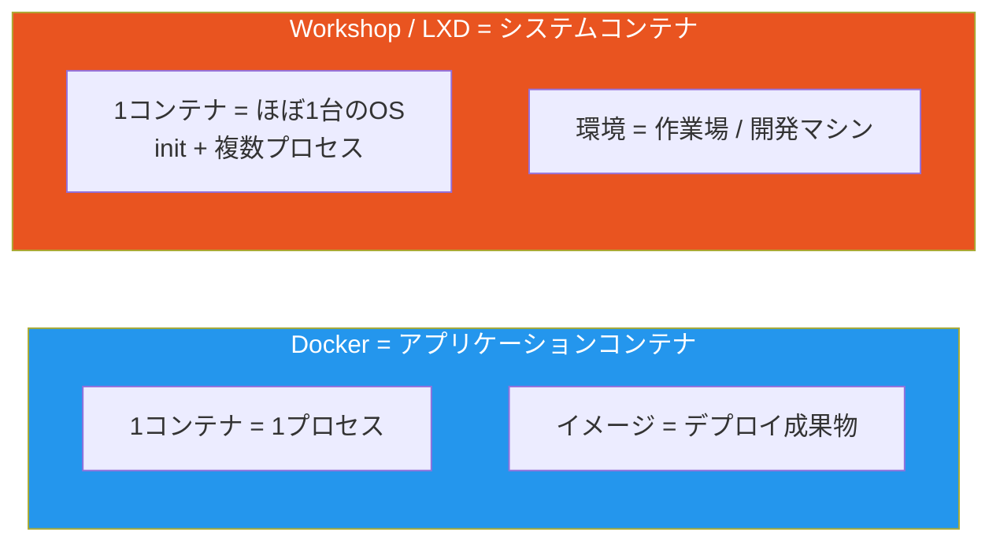
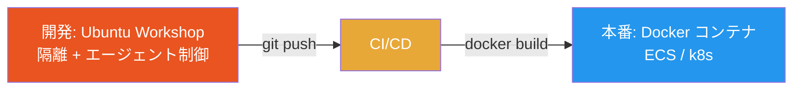

# Ubuntu Workshopによるサンドボックス開発環境

> **一言で言うと:** Ubuntu Workshop は、1枚の YAML から「隔離された開発環境（作業場）」を丸ごと立ち上げる Canonical 製ツール。中身は LXD の**システムコンテナ**で、Docker の**アプリケーションコンテナ**とは隔離の単位が違う。最大の特徴は snapd 由来の「インターフェースシステム」で、**AIエージェントがホストの何に触れてよいかを明示的に制御**できる点にある。Docker の代替ではなく、AI協働時代の「開発マシンそのものを隔離する」レイヤーを担う。

Canonical が 2026年5月に公開した。`workshop.yaml` という1ファイルに「ベースOS・必要なSDK・ホストへのアクセス権」を宣言し、`workshop launch` の1コマンドで再現可能な開発環境が立ち上がる。狙いは、依存関係・SDK・マシン固有のツール設定に開発者が費やす時間を削減し、**特にエージェント型AIツールを使う開発**を安全に隔離することにある。

## なぜ生まれたか — AIエージェント時代の「開発環境の隔離」

従来、開発環境の再現性は [[Docker]] や [[DockerとNix-Flakeによる開発環境管理|Nix Flake]] が担ってきた。Workshop が解こうとするのは、それらの少し外側にある新しい課題だ。

- **AIエージェントにホスト全体を触らせたくない** — `claude`, OpenCode, Aider のようなエージェントは、シェルを握ってファイルを書き換え、コマンドを実行する。ローカルで直接動かすと、ホームディレクトリの鍵・他プロジェクト・SSHエージェントまで攻撃/誤操作の射程に入る（→ [[生成AIコーディングエージェントのセキュリティリスク]]）
- **「開発者の利便性」と「エージェントのアクセス権」を分けたい** — Workshop の設計思想は明確で、*「開発者にとっての使いやすさが、そのままAIエージェントの使いやすさ（=権限）になってはいけない」*。人間は広く触れてよいが、エージェントには絞る、という非対称な制御が要る
- **GPU・SDK込みの環境を毎回作り直したくない** — CUDA / ROCm / Ollama を含むAI開発環境は構築が重い。YAML で宣言して使い回したい

## 仕組み — LXDシステムコンテナ + snap + インターフェース

Workshop は snap アプリ（classic）として配布され、Canonical の [[Docker|コンテナ技術]]基盤である **LXD** の上に乗る。

```bash
# 前提: LXD 6.8 以降が必要
sudo snap install --channel=6/stable lxd
sudo snap install --classic workshop
```

技術的な核は3つ。

1. **非特権（unprivileged）LXDシステムコンテナ** — プロセス・ファイルシステム・ネットワークのすべてのレベルでホストから隔離されるが、[[Docker|カーネルはホストと共有]]する（この点は Docker と同じ）。非特権コンテナなので、コンテナ内の root はホストの root ではなく、攻撃表面が小さい
2. **snap 形式での配布** — Workshop 本体も、その上に乗る SDK も snap のエコシステムで管理される
3. **インターフェースシステム（interface system）** — snapd のインターフェース機構を手本にした仕組み。GPU・マウント・ネットワーク・デバイス・デスクトップアクセス・ホストの SSH エージェントといった「ホスト資源」へのアクセスを、**統一的かつ明示的に**許可/拒否する。実際の接続は `workshop connect <plug> <slot>`（snapd と同じ plug/slot モデル）で行い、従来の「複雑なマッピングスクリプトやファイルシステムパスの受け渡し」を置き換える



## YAML の構造とコマンド

環境は YAML で宣言する。配置場所は、単一なら `workshop.yaml`（または隠しファイル `.workshop.yaml`）をプロジェクト直下に、複数なら `.workshop/<名前>.yaml` に置く。`workshop init` を使うと `.workshop/<名前>.yaml` が雛形生成される。このファイルをバージョン管理すれば、貢献者全員が同じ環境を再現できる。

```yaml
# .workshop/dev.yaml — 環境の設計図。name が exec / run などで使う識別子になる
name: dev
base: ubuntu@22.04           # ubuntu@20.04 / 22.04 / 24.04 / 26.04 から選ぶ
sdks:
  - name: ollama
    channel: cpu/stable      # snap形式 <TRACK>/<RISK>/<BRANCH>。既定は latest/stable
actions:
  pull: ollama pull "$@"     # workshop run dev -- pull <model> で呼べる定義済み操作
```

雛形生成と内容確認は次のとおり。`--sdks` フラグでは `<名前>/<チャネル>` 形式を使う（YAML 内の `name:` / `channel:` とは書式が異なる点に注意）。

```bash
# 定義ファイルを雛形生成（.workshop/dev.yaml が作られる）
workshop init dev --sdks ollama/cpu/stable --base ubuntu@22.04

# workshop と利用可能な SDK / チャネルの詳細を確認
workshop info
```

主要コマンドは、Docker の `compose up` / `exec` / `down` に対応づけて覚えると早い。

| Workshop | やること | Docker での近い操作 |
|---|---|---|
| `workshop init <name>` | 定義ファイルの雛形を生成 | （`Dockerfile` を手で用意） |
| `workshop launch` | 定義から環境を構築・起動 | `docker compose up -d` |
| `workshop start` / `stop` | 環境を保持したまま起動/停止 | `docker compose start` / `stop` |
| `workshop refresh` | 定義変更を環境に適用 | イメージ再ビルド + 再作成 |
| `workshop restore` | 直前の安定状態に戻す | （Docker に直接の対応なし） |
| `workshop exec <name> -- <cmd>` | コンテナ内でコマンド実行 | `docker compose exec` |
| `workshop run <name> -- <action>` | 定義済み action を実行 | （Makefile / npm scripts 相当） |
| `workshop shell` | `workshop` ユーザーで対話シェルに入る | `docker compose exec app sh` |
| `workshop connect <plug> <slot>` | interface を接続しホスト資源を許可 | bind mount / `--device` 指定 |
| `workshop list` / `info` | 環境一覧 / 詳細・SDK 情報 | `docker compose ps` |

定義を書き換えたら `refresh` で適用し、不調なら `restore` で直前の安定状態に戻す——この **「環境を一個の生きた状態として巻き戻す」運用**は、Docker のイメージ運用（コンテナ内変更は揮発し、再現はイメージから）にはない、システムコンテナならではの発想だ。

## Docker との違い — 隔離の単位が違う

両者とも「ホストのカーネルを共有するコンテナ」だが、**何を1コンテナに入れるか**の思想が根本的に違う。



| 観点 | Docker | Ubuntu Workshop (LXD) |
|---|---|---|
| コンテナの種類 | **アプリケーションコンテナ**（1プロセス＝1コンテナが原則） | **システムコンテナ**（init + 複数プロセス、ほぼ仮想マシンのように使える） |
| 主な用途 | 開発〜**本番デプロイの成果物**（[[AWSコンテナサービスとDockerの実運用\|ECS]]/k8s で動かす） | **開発時の作業環境（workshop=作業場）の隔離**。デプロイ成果物ではない |
| 環境定義 | `Dockerfile` + `compose.yaml` | `workshop.yaml`（base + sdks + interface） |
| カーネル | ホストと共有 | ホストと共有（同じ） |
| ホスト資源へのアクセス | bind mount / `--device` / 環境変数を都度指定 | **インターフェースシステム**で宣言的・統一的に許可 |
| AIエージェントの権限制御 | 標準機能としては持たない（自前で工夫） | **中核機能**。人間とエージェントで非対称に絞れる |
| プラットフォーム | Linux / macOS / Windows（[[WSL2とDocker\|WSL2]]やVM経由） | Ubuntu（LXD）前提 |
| 状態の巻き戻し | イメージ単位（コンテナ内変更は揮発） | スナップショット復元（`restore`）が前提 |

ポイントは、**競合ではなくレイヤーが違う**こと。Docker は「アプリを箱詰めして本番まで運ぶ」道具、Workshop は「開発という作業を安全な箱の中でやる」道具だ。[[DockerとNix-Flakeによる開発環境管理|Nix]] が「パッケージの純粋関数的な再現」を狙うのに対し、Workshop は「OSごと隔離した作業場 + エージェント権限制御」を狙う、と整理すると区別しやすい。

## 活用方法（こう使う）

### 1. AIエージェントを隔離された作業場に閉じ込める

最も Workshop らしい使い方。エージェントに広い権限を渡すリスク（[[生成AIコーディングエージェントのセキュリティリスク]]）を、ホストではなくコンテナ境界で受け止める。

- ホスト鍵・他プロジェクト・本番認証情報を **interface で渡さない**限り、エージェントから触れない
- ネットワークも必要な宛先だけに絞れば、不審な外部通信を抑止できる
- 暴走しても `workshop restore` で作業場ごと巻き戻せる

### 2. GPU込みのAI/ML開発環境を YAML で配る

CUDA / ROCm / Ollama を YAML に書いておけば、チームの各マシンで `workshop launch` 一発。GPU は interface で明示的にコンテナへ通す。

### 3. 「開発は Workshop、本番は Docker」の併用



Workshop は本番成果物を生まない。開発者は Workshop の中で安全に作り、デプロイは従来どおり [[Dockerイメージ]] をビルドして本番へ出す。両者は素直に共存する。

## よくある落とし穴

### 1. Docker の「代替」だと思い込む

Workshop はアプリを本番に運ぶ仕組みではない。本番デプロイにはやはり Docker/k8s が要る。「開発の隔離」と「デプロイの箱詰め」は別レイヤーの問題だと切り分ける。

### 2. システムコンテナとアプリケーションコンテナを混同する

「1コンテナ=1プロセス」という [[Docker]] の作法をそのまま持ち込むと、Workshop（システムコンテナ）の使い方を誤る。Workshop の中は「ほぼ1台の開発マシン」として複数プロセスを動かしてよい。

### 3. interface を緩めすぎて隔離が形骸化する

利便性優先で SSH エージェント・全マウント・ホストネットワークを丸ごと許可すると、エージェント隔離の意味が薄れる。**人間には広く、エージェントには最小限**という非対称設計を崩さない。

### 4. Ubuntu/LXD 前提を忘れる

LXD 6.8 以降が必須で、土台は Ubuntu。macOS や Windows のローカルでそのまま動くわけではない（[[WSL2とDocker|WSL2]] の Ubuntu 上で検討する余地はある）。Docker のクロスプラットフォーム性とは前提が違う。

## 参考リソース

- [Canonical 公式ブログ — Introducing Workshop](https://canonical.com/blog/introducing-workshop-sandboxed-development-environments) — 設計思想とインターフェースシステムの説明
- [Linuxiac — Ubuntu Gets Workshop for Reproducible Development Environment](https://linuxiac.com/ubuntu-gets-workshop-for-reproducible-development-environment/)
- [9to5Linux — Canonical Launches Ubuntu Workshop](https://9to5linux.com/canonical-launches-ubuntu-workshop-for-sandboxed-development-environments)
- [LXD 公式ドキュメント](https://documentation.ubuntu.com/lxd/) — システムコンテナの基盤
