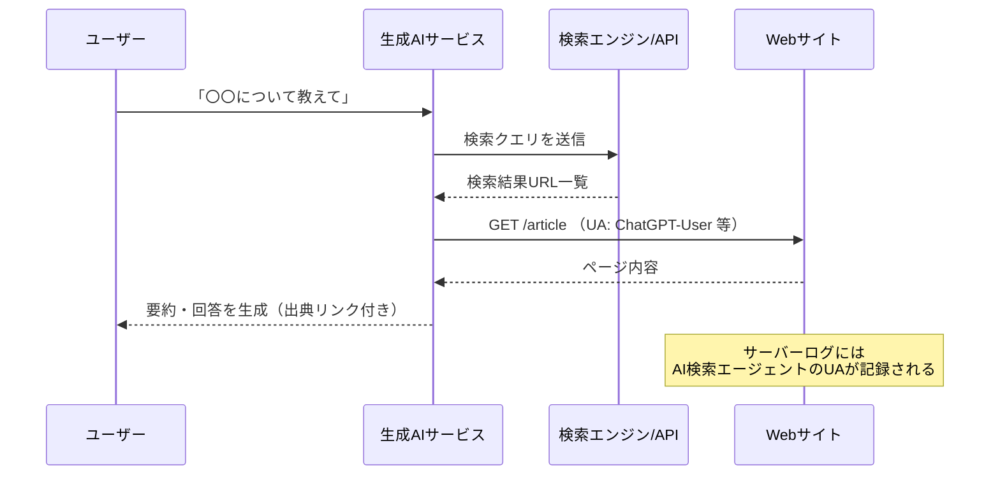
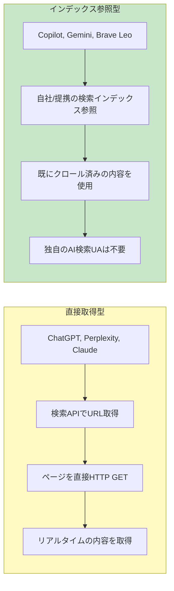
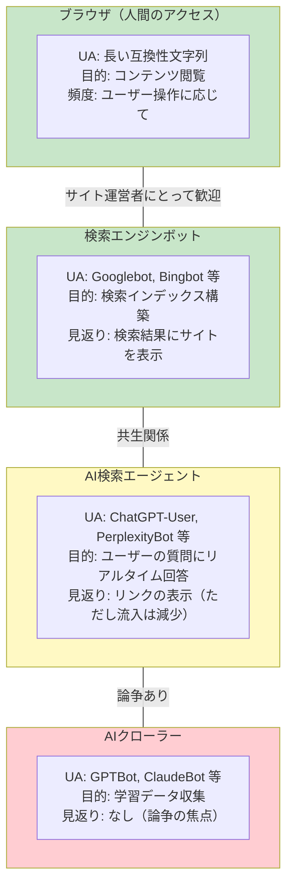

# User-Agentと生成AIクローラー（User-Agent and AI Crawlers）

> **一言で言うと:** User-Agent はHTTPリクエストヘッダの一つで「自分は何者か」をサーバーに伝える名刺のようなもの。生成AIの台頭により、AIクローラー専用のUser-Agent文字列が急増し、robots.txt によるアクセス制御の新たな論点が生まれている。

## User-Agent とは

User-Agent（UA）はHTTPリクエストに含まれるヘッダで、クライアントのソフトウェア情報をサーバーに伝える。RFC 9110 で定義されており、サーバーはこの値に基づいてコンテンツの出し分け、アクセス制御、統計収集を行う。

```
GET /index.html HTTP/1.1
Host: example.com
User-Agent: Mozilla/5.0 (Windows NT 10.0; Win64; x64) AppleWebKit/537.36 ...
            ^^^^^^^^^^^^^^^^^^^^^^^^^^^^^^^^^^^^^^^^^^^^^^^^^^^^^^^^^^^^^^^^
            ↑ この部分がUser-Agent文字列
```

### ブラウザのUA文字列 — なぜこんなに長いのか

現代のブラウザのUA文字列は歴史的経緯で冗長になっている。

```
Mozilla/5.0 (Windows NT 10.0; Win64; x64) AppleWebKit/537.36 (KHTML, like Gecko) Chrome/125.0.0.0 Safari/537.36
```

| 部分 | 意味 | なぜ含まれるか |
|------|------|--------------|
| `Mozilla/5.0` | Mozillaとの互換性表明 | Netscape時代の互換性ハック。すべてのブラウザが付与する |
| `(Windows NT 10.0; Win64; x64)` | OS情報 | コンテンツの出し分け用 |
| `AppleWebKit/537.36` | レンダリングエンジン | Safari互換を示すために全Chromium系ブラウザが付与 |
| `(KHTML, like Gecko)` | KHTML互換を表明 | さらに古い互換性ハック |
| `Chrome/125.0.0.0` | 実際のブラウザ名 | ここだけが真の情報 |
| `Safari/537.36` | Safari互換表明 | Safari向けの出し分けを受けるため |

この「嘘の積み重ね」は、サーバーが特定のUA文字列にしかコンテンツを返さなかった時代のなごりである。各ブラウザは先行ブラウザのUA文字列を含めることで、コンテンツのブロックを回避してきた。

### Client Hints — UA文字列の代替

UA文字列の冗長さとプライバシー問題を解決するため、**User-Agent Client Hints**（UA-CH）が策定された。Chromium系ブラウザ（Chrome 89以降、2021年〜）では既に実装されており、W3C で標準化が進行中である。

```http
# サーバーが必要な情報だけをリクエスト
Accept-CH: Sec-CH-UA, Sec-CH-UA-Platform, Sec-CH-UA-Mobile

# ブラウザが構造化された情報を返す
Sec-CH-UA: "Chromium";v="125", "Google Chrome";v="125"
Sec-CH-UA-Platform: "Windows"
Sec-CH-UA-Mobile: ?0
```

UA-CHにより、必要な情報だけを構造化された形式で送信でき、フィンガープリンティングのリスクも軽減される。

## 生成AIクローラーのUser-Agent

生成AIの登場により、学習データ収集や検索拡張（RAG）のためにWebをクロールするボットが急増した。各社は独自のUA文字列を使用する。

### 主要なAIクローラーのUA一覧

| 運営 | UA トークン | 目的 | UA文字列の例 |
|------|-----------|------|------------|
| OpenAI | `GPTBot` | 学習データ収集 | `GPTBot/1.0 (+https://openai.com/gptbot)` |
| OpenAI | `ChatGPT-User` | ChatGPTのリアルタイムWeb検索 | `ChatGPT-User/1.0 (+https://openai.com/bot)` |
| OpenAI | `OAI-SearchBot` | ChatGPT Search用 | `OAI-SearchBot/1.0 (+https://openai.com/searchbot)` |
| Anthropic | `ClaudeBot` | 学習データ収集 | `ClaudeBot/1.0 (anthropic.com/claude)` |
| Google | `Google-Extended` | Gemini学習・AI Overview用（robots.txt専用トークン） | — （Googlebotとして動作） |
| Perplexity | `PerplexityBot` | AI検索・回答生成 | `PerplexityBot/1.0 (+https://perplexity.ai/perplexitybot)` |
| Apple | `Applebot-Extended` | Apple Intelligence学習用 | — （Applebotの拡張トークン） |
| Meta | `Meta-ExternalAgent` | AI学習用クロール | `Meta-ExternalAgent/1.0 (+https://www.meta.com/help/...)` |
| Bytedance | `Bytespider` | TikTok/AI学習用 | `Bytespider` |
| Common Crawl | `CCBot` | オープンデータセット（多くのAI企業が利用） | `CCBot/2.0 (https://commoncrawl.org/faq/)` |
| Amazon | `Amazonbot` | Alexa / AI学習 | `Amazonbot/0.1` |

### ユーザー起点のAI検索エージェント — 生成AIが代理でWebを読む

ユーザーが生成AIに質問すると、AIサービスがユーザーの代わりにWebページを取得して回答を生成する。このとき送信されるHTTPリクエストのUser-Agentが「AI検索エージェント」のUAである。学習用クローラーとは目的もUAも異なる。



#### 主要サービスのリアルタイム検索UA

| サービス | 検索時のUA | 学習用UAとの区別 | ページを直接取得するか | 備考 |
|---------|-----------|----------------|-------------------|------|
| **ChatGPT**（OpenAI） | `ChatGPT-User` / `OAI-SearchBot` | ✅ `GPTBot`（学習用）と明確に分離 | ✅ 直接取得 | 検索API→ページ取得の2段階。最も文書化が充実 |
| **Perplexity AI** | `PerplexityBot` | ❌ 学習用と同一トークン | ✅ 直接取得 | 検索特化型AI。積極的なクロールで批判を受けた |
| **Claude**（Anthropic） | `ClaudeBot`（検索用UAの公式名は未公開） | ✅ 学習用とは用途が異なるが、公開情報が限定的 | ✅ 直接取得 | Web検索機能は2025年に追加。正確なUAトークンは Anthropic の公式ドキュメントで要確認 |
| **Copilot**（Microsoft） | Bingインフラ経由 | — Copilot専用UAは非公開 | ❌ Bingの検索インデックスを利用 | 内部的にBing Search APIを使用 |
| **Gemini**（Google） | 専用UA非公開 | — | ❌ Googleの検索インデックスを利用 | 自社インデックスからコンテンツを取得 |
| **Grok**（xAI） | 専用UA非公開 | — | 不明 | X（旧Twitter）プラットフォーム上で動作 |
| **You.com** | `YouBot` | ❌ 学習用と同一の可能性 | ✅ 直接取得 | AI検索エンジン |
| **Brave Leo** | なし（自社インデックス利用） | — | ❌ | Brave Search の既存インデックスを参照 |

#### 2つのアーキテクチャ — 直接取得型 vs インデックス参照型



**直接取得型**はリアルタイム性が高いが、サイト運営者からはボットアクセスとして扱われる。**インデックス参照型**は既存の検索エンジンインフラを流用するため、追加のアクセス負荷がないが、情報の鮮度はインデックスの更新頻度に依存する。

サイト運営者にとって重要なのは、直接取得型のAI検索エージェントをブロックすると、そのAIサービス経由でのサイト参照が完全に失われるという点である。従来の検索エンジンでは robots.txt でクローラーをブロックしても、他の経路（SNS共有、直接リンク等）でユーザーがサイトにアクセスできた。しかしAI検索では、AIがページ内容を読めなければ回答に含めることも出典として表示することもできない。

### AIクローラー vs ブラウザ vs 検索エンジンボット



重要な違いは「学習用クロール」と「リアルタイム検索」と「インデックス参照」の3区分である:

| 区分 | 例 | 動作 | robots.txt で制御可能か |
|------|-----|------|----------------------|
| **学習用クローラー** | GPTBot, ClaudeBot, CCBot | サイト全体を巡回し学習データとして蓄積 | ✅ 各ボット名で制御 |
| **リアルタイム検索（直接取得型）** | ChatGPT-User, PerplexityBot | ユーザーの質問に応じて特定ページを直接取得 | ✅ ただしブロックするとAI検索結果に表示されない |
| **リアルタイム検索（インデックス参照型）** | Copilot, Gemini, Brave Leo | 自社の検索インデックスから既存データを参照 | ❌ 個別のAI検索UAが存在しない（検索エンジン本体のクローラーを止めるしかない） |
| **robots.txt 専用トークン** | Google-Extended, Applebot-Extended | 検索インデックスは許可しつつAI学習だけ拒否 | ✅ 親ボットと分離して制御可能 |

## robots.txt によるAIクローラー制御

```
# 学習用クローラーをすべてブロック
User-agent: GPTBot
Disallow: /

User-agent: ClaudeBot
Disallow: /

User-agent: CCBot
Disallow: /

User-agent: Meta-ExternalAgent
Disallow: /

User-agent: Bytespider
Disallow: /

# Google検索には表示するが、Geminiの学習やAI Overviewには使わせない
User-agent: Google-Extended
Disallow: /

# ChatGPTのリアルタイム検索は許可（ブロックするとChatGPT経由での流入がゼロになる）
User-agent: ChatGPT-User
Allow: /

# 従来の検索エンジンは許可
User-agent: Googlebot
Allow: /

User-agent: Bingbot
Allow: /
```

### サーバー側でのUA判定

```typescript
// Express ミドルウェア: AIクローラーの検出とブロック
const AI_CRAWLERS = [
  'GPTBot', 'ChatGPT-User', 'ClaudeBot', 'CCBot',
  'PerplexityBot', 'Meta-ExternalAgent', 'Bytespider',
  'anthropic-ai', 'Amazonbot', 'OAI-SearchBot',
];

function blockAICrawlers(req, res, next) {
  const ua = req.headers['user-agent'] ?? '';
  const isAICrawler = AI_CRAWLERS.some(bot => ua.includes(bot));

  if (isAICrawler) {
    // 403 ではなく 429 を返すことで「一時的な制限」として扱う手もある
    return res.status(403).json({ error: 'AI crawler access not permitted' });
  }
  next();
}

app.use(blockAICrawlers);
```

```python
# Django ミドルウェア: AIクローラーの検出
AI_CRAWLERS = [
    'GPTBot', 'ChatGPT-User', 'ClaudeBot', 'CCBot',
    'PerplexityBot', 'Meta-ExternalAgent', 'Bytespider',
]

class BlockAICrawlerMiddleware:
    def __init__(self, get_response):
        self.get_response = get_response

    def __call__(self, request):
        ua = request.META.get('HTTP_USER_AGENT', '')
        if any(bot in ua for bot in AI_CRAWLERS):
            from django.http import HttpResponseForbidden
            return HttpResponseForbidden('AI crawler access not permitted')
        return self.get_response(request)
```

## 論争と課題

### 1. UA偽装（UA Spoofing）の問題

一部のAIクローラーが一般的なブラウザのUA文字列を偽装してクロールしていると報告されている。2024年6月、Wired 等の報道で Perplexity が住宅用IPプロキシを経由しブラウザのUAを偽装して robots.txt を回避していたと指摘された。Perplexity側は「第三者のキャッシュサービスがコンテンツを取得していた」と説明しており、直接的な偽装かどうかは見解が分かれている。

```
# 正直なAIクローラー → 検出・制御可能
User-Agent: PerplexityBot/1.0

# UA偽装 → 通常のブラウザアクセスと区別できない
User-Agent: Mozilla/5.0 (Windows NT 10.0; Win64; x64) AppleWebKit/537.36 ...
```

UA文字列は自己申告であり、技術的に偽装を完全に防ぐ手段はない。サーバー側ではUA以外にも、TLSフィンガープリント・アクセス頻度・IPレンジ・行動パターン（JavaScriptの実行有無など）を組み合わせた[[UA偽装とボット検出|多層的なボット検出]]が必要になる。

### 2. オプトアウト負担の問題

現状ではサイト運営者が新しいAIクローラーごとに個別に robots.txt を更新する必要がある。新規のAIサービスが登場するたびに対応が必要で、「デフォルト許可」モデルの限界が指摘されている。

### 3. 標準化の動き

| 提案 | 概要 | 現状 |
|------|------|------|
| **TDMRep** | W3Cコミュニティ提案。HTTPヘッダや `.well-known/tdmrep.json` でテキスト・データマイニングのポリシーを宣言 | 提案段階 |
| **ai.txt** | robots.txt のAI版。AI学習用途に特化した許可・拒否を記述 | コミュニティ提案段階 |
| **robots.txt 拡張** | 既存のrobots.txtに「学習用途」と「検索用途」を区別するディレクティブを追加 | 議論中 |

## よくある落とし穴

### 1. UA文字列のパースに正規表現を使って過剰マッチする

```typescript
// ❌ "bot" を含むすべてのUAをブロック → 正規のユーザーも巻き込む
const isBot = /bot/i.test(ua);
// "cubot"（スマホブランド）や "Habot"（社名）など、
// 意図しないUA文字列にもマッチし正規ユーザーをブロックしてしまう

// ✅ 既知のボット名を明示的にリストで判定する
const isAIBot = AI_CRAWLERS.some(bot => ua.includes(bot));
```

### 2. robots.txt でブロックすれば安全だと思い込む

robots.txt は**紳士協定**であり、強制力はない。悪意あるクローラーやUA偽装するクローラーには効果がない。重要なコンテンツを保護するには、認証・アクセス制御を併用する必要がある。

### 3. 生成AIの「Web検索機能」と「学習用クロール」を混同する

ChatGPTの `ChatGPT-User` をブロックすると、ChatGPT経由でサイトが参照されなくなる。一方、`GPTBot` はモデル学習用なのでブロックしても検索結果には影響しない。目的に応じて制御を分けるべきである。

### 4. User-Agentだけに依存したアクセス制御

UAは自己申告のため偽装が容易。重要なリソースの保護には、UAチェックだけでなく以下を組み合わせる:
- レート制限（[[レート制限]]）
- 認証・認可（[[認証と認可]]）
- CAPTCHAやJavaScriptチャレンジ
- IPレピュテーションデータベース

## 関連トピック

- [[HTTP-HTTPS]] — 親トピック。User-AgentはHTTPリクエストヘッダの一つ
- [[CORS]] — Originヘッダとの関係。CORSプリフライトではブラウザのUAが送信される
- [[レート制限]] — UA判定と組み合わせたボットのレート制限
- [[DNS]] — DNSの逆引きによるクローラーの正当性検証（Googlebot の検証方法）

## 参考リソース

- **RFC 9110 Section 10.1.5**: User-Agent ヘッダの仕様 — https://datatracker.ietf.org/doc/html/rfc9110#section-10.1.5
- **OpenAI GPTBot ドキュメント** — https://platform.openai.com/docs/bots
- **Google: Google-Extended の制御** — https://developers.google.com/search/docs/crawling-indexing/overview-google-crawlers
- **W3C TDMRep** — https://www.w3.org/community/tdmrep/
- **MDN: User-Agent** — https://developer.mozilla.org/ja/docs/Web/HTTP/Headers/User-Agent
- **Client Hints** — https://developer.mozilla.org/en-US/docs/Web/HTTP/Client_hints
