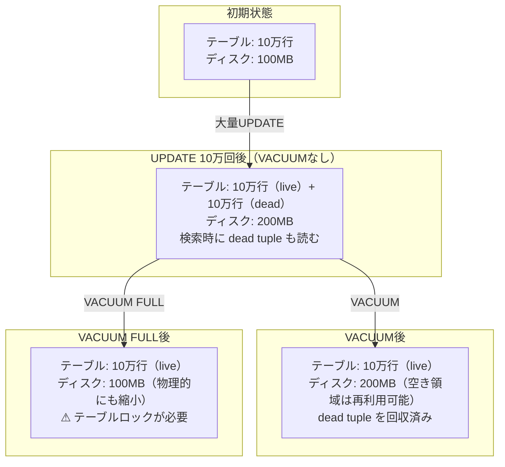
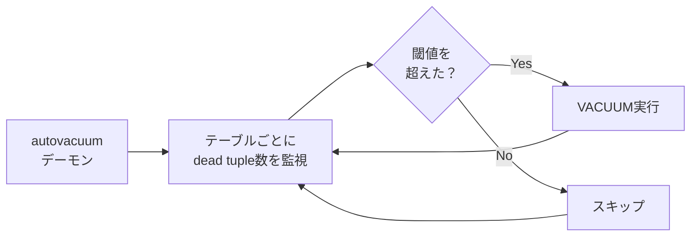
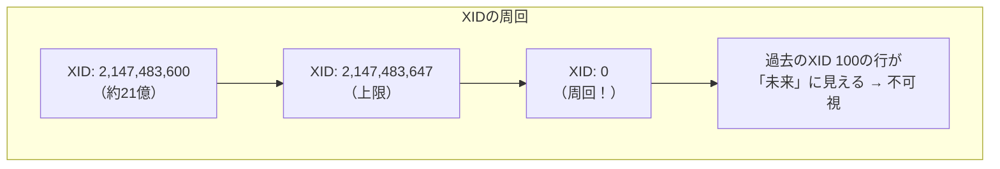

# VACUUM（バキューム）

> **一言で言うと:** PostgreSQLのMVCC（追記型）アーキテクチャで蓄積される不要な古い行バージョン（dead tuple）を回収し、テーブルの肥大化を防ぐメンテナンス処理。MySQLのInnoDB（Undoログ型）には同等の仕組みは不要。

## なぜVACUUMが必要か

[[PostgreSQLとMySQLの比較]]で触れた通り、PostgreSQLはUPDATE/DELETEの際に古い行を即座に削除せず、テーブル内に「dead tuple（不要な行バージョン）」として残す。これはMVCCのスナップショット分離を実現するためだが、放置すると深刻な問題を引き起こす。



VACUUMを怠ると:
- **テーブル肥大化（bloat）** — dead tuple がディスク容量を食い続ける
- **検索性能の劣化** — Seq Scan時にdead tupleも読み込まれる
- **インデックス肥大化** — dead tuple を指すインデックスエントリも残る
- **トランザクションIDの周回（wraparound）** — 最悪の場合、データベースが自動停止する

## VACUUMの種類

### 通常のVACUUM

dead tuple を回収し、その領域を**将来のINSERT/UPDATE用に再利用可能**としてマークする。テーブルの物理サイズは縮小しない。

```sql
-- 特定テーブルをVACUUM
VACUUM users;

-- 統計情報も同時に更新（推奨）
VACUUM ANALYZE users;

-- 進捗を確認しながら実行（verbose）
VACUUM (VERBOSE, ANALYZE) users;
```

**重要な特性:**
- テーブルに対する**読み書きをブロックしない**（通常の操作と並行実行可能）
- 回収した領域はOSに返却されない（テーブルファイルのサイズは変わらない）
- 日常的なメンテナンスとして頻繁に実行すべき

### VACUUM FULL

テーブル全体を新しいファイルに書き直し、物理的にサイズを縮小する。

```sql
-- テーブルの物理サイズを縮小（⚠ 排他ロック）
VACUUM FULL users;
```

**重要な特性:**
- **AccessExclusiveLock を取得** — 実行中はそのテーブルへの一切の読み書きが不可
- テーブルサイズの2倍のディスク空き容量が必要（新旧のコピーが共存するため）
- 本番環境での実行は極めてリスクが高い — 代替手段として `pg_repack` を検討する

### autovacuum — 自動VACUUMデーモン

PostgreSQLにはVACUUMを自動実行する **autovacuum** デーモンが組み込まれている。デフォルトで有効。



**発動条件（デフォルト）:**

```
dead tuple数 > autovacuum_vacuum_threshold + autovacuum_vacuum_scale_factor × テーブル行数
```

デフォルト値:
- `autovacuum_vacuum_threshold` = 50
- `autovacuum_vacuum_scale_factor` = 0.2

つまり「dead tupleがテーブル全体の20%を超えたら」発動する。100万行のテーブルでは20万行のdead tupleが溜まるまで動かない。

### autovacuumのチューニング

更新頻度の高いテーブルではデフォルト設定では追いつかないことがある。テーブル単位で設定を変更できる。

```sql
-- 更新頻度の高い orders テーブルに対して、autovacuum を積極的に設定
ALTER TABLE orders SET (
    autovacuum_vacuum_threshold = 100,        -- 最低 dead tuple 数
    autovacuum_vacuum_scale_factor = 0.05,    -- 5%で発動（デフォルト20%）
    autovacuum_vacuum_cost_delay = 2,         -- I/Oスロットリングを緩和（ms）
    autovacuum_analyze_threshold = 50,        -- ANALYZE の閾値
    autovacuum_analyze_scale_factor = 0.02    -- 2%で統計情報を更新
);

-- 設定を確認
SELECT relname, reloptions
FROM pg_class
WHERE relname = 'orders';
```

## トランザクションIDの周回問題（Transaction ID Wraparound）

PostgreSQLのトランザクションID（XID）は32ビット整数（約42億）で、周回する。周回が起きると「過去のトランザクション」と「未来のトランザクション」の区別がつかなくなり、データが消えたように見える。



これを防ぐため、PostgreSQLは **aggressive VACUUM**（freeze処理）を実行し、古いXIDを「frozen（永久に可視）」状態にマークする。

```sql
-- XIDの残り余裕を確認（定期的に監視すべき）
SELECT
    datname,
    age(datfrozenxid) AS xid_age,
    -- 20億を超えると危険域
    CASE
        WHEN age(datfrozenxid) > 1500000000 THEN '⚠ WARNING'
        WHEN age(datfrozenxid) > 1000000000 THEN '⚡ ATTENTION'
        ELSE '✓ OK'
    END AS status
FROM pg_database
ORDER BY age(datfrozenxid) DESC;

-- テーブル単位で確認
SELECT
    schemaname,
    relname,
    age(relfrozenxid) AS xid_age,
    last_autovacuum,
    last_vacuum
FROM pg_stat_user_tables
ORDER BY age(relfrozenxid) DESC
LIMIT 10;
```

autovacuumが正常に動いていれば周回問題は発生しない。しかし **autovacuumを無効にしたり、長時間トランザクションがVACUUMをブロックしたり** すると危険な状態に陥る。

## 監視クエリ集

### テーブルの肥大化（bloat）を確認

```sql
-- dead tuple の状況を確認
SELECT
    schemaname || '.' || relname AS table_name,
    n_live_tup AS live_rows,
    n_dead_tup AS dead_rows,
    CASE WHEN n_live_tup + n_dead_tup > 0
        THEN round(100.0 * n_dead_tup / (n_live_tup + n_dead_tup), 1)
        ELSE 0
    END AS dead_pct,
    pg_size_pretty(pg_total_relation_size(relid)) AS total_size,
    last_autovacuum,
    last_autoanalyze
FROM pg_stat_user_tables
WHERE n_dead_tup > 1000
ORDER BY n_dead_tup DESC;
```

### autovacuumがブロックされていないか確認

```sql
-- 長時間実行中のトランザクション（autovacuumをブロックする原因）
SELECT
    pid,
    now() - xact_start AS duration,
    state,
    query
FROM pg_stat_activity
WHERE state != 'idle'
  AND xact_start < now() - interval '5 minutes'
ORDER BY xact_start;
```

## コード例

### TypeScript — 接続プールとVACUUM監視

```typescript
import { Pool } from "pg";

const pool = new Pool({ connectionString: process.env.DATABASE_URL });

// dead tuple が多いテーブルを検出するヘルスチェック
async function checkBloat(thresholdPct: number = 20): Promise<void> {
  const result = await pool.query(`
    SELECT
      schemaname || '.' || relname AS table_name,
      n_dead_tup AS dead_rows,
      CASE WHEN n_live_tup + n_dead_tup > 0
        THEN round(100.0 * n_dead_tup / (n_live_tup + n_dead_tup), 1)
        ELSE 0
      END AS dead_pct
    FROM pg_stat_user_tables
    WHERE n_dead_tup > 1000
    ORDER BY n_dead_tup DESC
  `);

  for (const row of result.rows) {
    if (parseFloat(row.dead_pct) > thresholdPct) {
      console.warn(
        `⚠ ${row.table_name}: ${row.dead_pct}% dead tuples (${row.dead_rows} rows)`
      );
    }
  }
}

// XID の周回余裕を確認
async function checkXidAge(warningThreshold = 1_000_000_000): Promise<void> {
  const result = await pool.query(`
    SELECT datname, age(datfrozenxid) AS xid_age
    FROM pg_database
    WHERE datistemplate = false
    ORDER BY age(datfrozenxid) DESC
  `);

  for (const row of result.rows) {
    if (parseInt(row.xid_age) > warningThreshold) {
      console.error(
        `🚨 Database ${row.datname}: XID age ${row.xid_age} — vacuum freeze needed!`
      );
    }
  }
}
```

### Go — VACUUM監視のヘルスチェックエンドポイント

```go
package main

import (
	"context"
	"database/sql"
	"encoding/json"
	"fmt"
	"log"
	"net/http"

	_ "github.com/lib/pq"
)

type BloatInfo struct {
	Table    string  `json:"table"`
	DeadRows int64   `json:"dead_rows"`
	DeadPct  float64 `json:"dead_pct"`
}

func checkBloat(db *sql.DB) ([]BloatInfo, error) {
	rows, err := db.QueryContext(context.Background(), `
		SELECT
			schemaname || '.' || relname,
			n_dead_tup,
			CASE WHEN n_live_tup + n_dead_tup > 0
				THEN round(100.0 * n_dead_tup / (n_live_tup + n_dead_tup), 1)
				ELSE 0
			END
		FROM pg_stat_user_tables
		WHERE n_dead_tup > 1000
		ORDER BY n_dead_tup DESC
		LIMIT 10
	`)
	if err != nil {
		return nil, err
	}
	defer rows.Close()

	var results []BloatInfo
	for rows.Next() {
		var info BloatInfo
		if err := rows.Scan(&info.Table, &info.DeadRows, &info.DeadPct); err != nil {
			return nil, err
		}
		results = append(results, info)
	}
	return results, nil
}

func main() {
	db, err := sql.Open("postgres", "postgres://localhost/mydb?sslmode=disable")
	if err != nil {
		log.Fatal(err)
	}
	defer db.Close()

	http.HandleFunc("/health/vacuum", func(w http.ResponseWriter, r *http.Request) {
		bloats, err := checkBloat(db)
		if err != nil {
			http.Error(w, err.Error(), 500)
			return
		}
		w.Header().Set("Content-Type", "application/json")
		json.NewEncoder(w).Encode(bloats)
	})

	fmt.Println("Listening on :8080")
	log.Fatal(http.ListenAndServe(":8080", nil))
}
```

## よくある落とし穴

### 1. autovacuumを無効にする

「VACUUMが負荷をかけるから」と autovacuum を無効にするのは極めて危険。dead tuple が蓄積し、最終的にXID周回問題でデータベースが停止する。負荷が気になる場合は無効にせず、`autovacuum_vacuum_cost_delay` でI/Oスロットリングを調整する。

### 2. VACUUM FULLを定期的に実行する

VACUUM FULL はテーブルを排他ロックするため、本番環境で定期実行するとダウンタイムが発生する。通常のVACUUMで十分なケースがほとんど。物理的にサイズを縮小したい場合は `pg_repack` を使えばロックなしで実行できる。

### 3. 長時間トランザクションの放置

長時間開いたままのトランザクションがあると、そのトランザクション開始時点のスナップショットが必要なため、VACUUMがdead tupleを回収できなくなる。アイドル接続やデバッグ中に `BEGIN` したまま放置するのが典型的な原因。

```sql
-- アイドルのまま5分以上開いているトランザクションを検出
SELECT pid, now() - xact_start AS duration, state, query
FROM pg_stat_activity
WHERE state = 'idle in transaction'
  AND xact_start < now() - interval '5 minutes';

-- 必要に応じて強制終了
-- SELECT pg_terminate_backend(pid);
```

### 4. VACUUM ANALYZEを忘れる

VACUUMだけでなく `ANALYZE`（統計情報の更新）も重要。テーブルのデータ分布が変わると、クエリプランナが最適でない実行計画を選択する。`VACUUM ANALYZE` をセットで実行するのが基本。

## 関連トピック

- [[RDB]] — 親トピック。MVCCの追記型アーキテクチャがVACUUMの存在理由
- [[PostgreSQLとMySQLの比較]] — PostgreSQLの追記型MVCCとMySQLのUndoログ型の違い
- [[Resources/Study/Layer3-データ永続化/インデックス|インデックス]] — dead tuple を指すインデックスエントリもVACUUMで回収される
- [[ファイルシステムとIO]] — VACUUMのI/O負荷はディスク特性に依存する

## 参考リソース

- [PostgreSQL: Routine Vacuuming](https://www.postgresql.org/docs/current/routine-vacuuming.html) — 公式ドキュメント
- [PostgreSQL: autovacuum](https://www.postgresql.org/docs/current/routine-vacuuming.html#AUTOVACUUM) — autovacuumの設定パラメータ
- [pg_repack](https://reorg.github.io/pg_repack/) — ロックなしでテーブルを再編成する拡張
