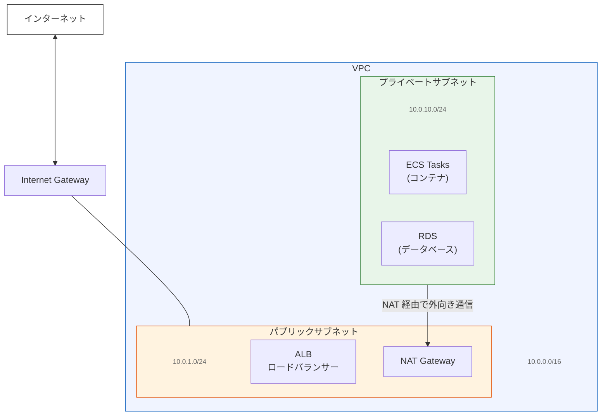
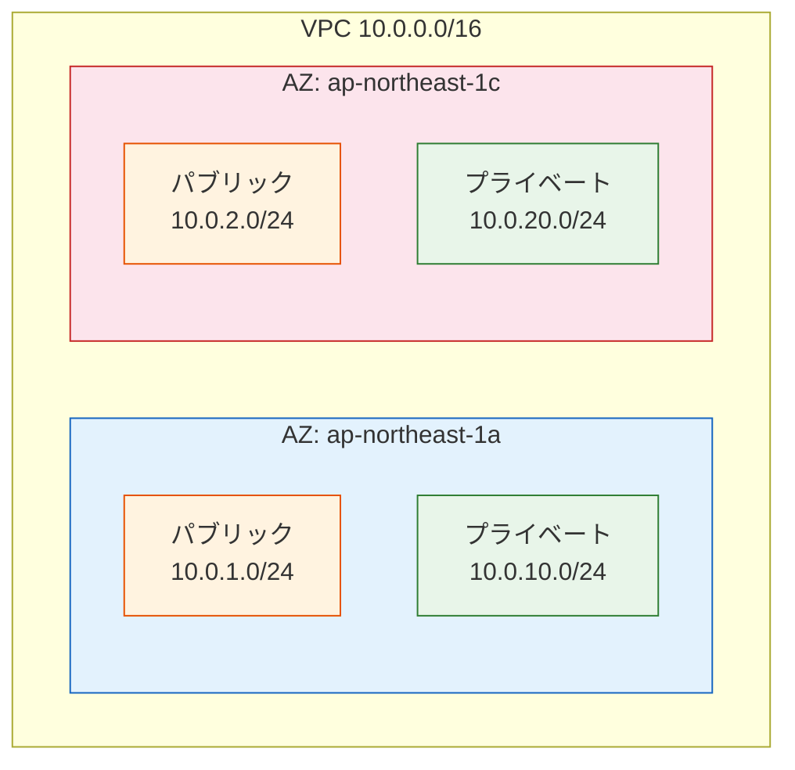
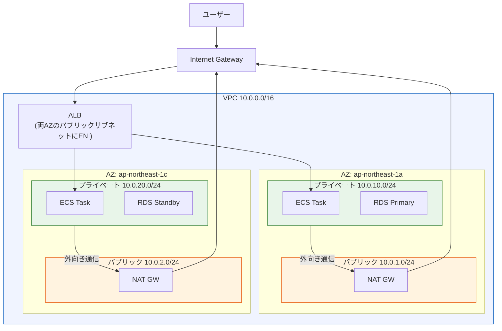

# VPC・サブネット・NAT（Virtual Private Cloud Networking）

> **一言で言うと:** VPCは「クラウド上に自分専用のネットワークを作る」仕組み。サブネットで通信範囲をパブリック/プライベートに分割し、NAT Gatewayでプライベートなコンテナが安全にインターネットへ出られるようにする。[[Docker]]コンテナをECSで本番運用する際、この3つがコンテナの「住所と通信経路」を決定する基盤になる。

## なぜコンテナエンジニアにVPCの理解が必要か

ローカル開発では `docker compose up` 一発で全てが同じブリッジネットワーク上に起動する。しかし本番の AWS 環境では、コンテナは VPC 内のサブネットに配置され、ネットワーク設計が直接コンテナの動作に影響する。

| 観点 | ローカル（Docker Compose） | 本番（AWS VPC） |
|------|--------------------------|----------------|
| ネットワーク | 単一ブリッジネットワーク | VPC + 複数サブネット |
| サービス間通信 | サービス名でDNS解決 | サービスディスカバリ / ALB |
| 外部アクセス | `ports` マッピング | ALB + セキュリティグループ |
| 可用性 | 単一ホスト | 複数AZに分散配置 |
| インターネット接続 | ホストのネットワークを共有 | NAT Gateway / VPC エンドポイント |

VPC を理解していないと、以下のような本番特有のトラブルに対処できない：

- **`CannotPullContainerError`** — ECS タスクが ECR からイメージを取得できない（NAT Gateway やルートテーブルの不備）
- **タスクが外部 API に接続できない** — プライベートサブネットからのアウトバウンド経路がない
- **ALB のヘルスチェックが失敗する** — セキュリティグループやサブネットの設定ミス

## VPC（Virtual Private Cloud）

VPC は、AWS のクラウド基盤上に作る**論理的に隔離されたプライベートネットワーク**。物理的にはAWSの共有インフラ上にあるが、他のアカウントのリソースとは完全に分離される。

オフィスビルに例えると：
- **VPC** = 自分が借りたフロア全体（`10.0.0.0/16` — 約65,000個のIPアドレス）
- **サブネット** = フロア内の部屋（用途ごとに区切る）
- **Internet Gateway** = ビルの正面玄関（外部との出入口）
- **NAT Gateway** = 郵便ポスト（中から外へは送れるが、外から中へは直接来られない）

VPC を作る際に指定する CIDR ブロック（例: `10.0.0.0/16`）がネットワーク全体のアドレス空間を決定する。CIDR 表記の詳細は[[プライベートIPとパブリックIP]]を参照。



## サブネット — パブリックとプライベート

サブネットは VPC の CIDR ブロックを細分化した小さなネットワーク範囲で、各サブネットは特定の**アベイラビリティゾーン（AZ）**に配置される。パブリックとプライベートの違いは、**ルートテーブル**に Internet Gateway への経路があるかどうかで決まる。

| 観点 | パブリックサブネット | プライベートサブネット |
|------|-------------------|---------------------|
| ルートテーブル | `0.0.0.0/0` → Internet Gateway | `0.0.0.0/0` → NAT Gateway |
| パブリック IP | 自動付与可能 | なし |
| 配置するもの | ALB, NAT Gateway, Bastion Host | ECS Tasks, RDS, ElastiCache |
| インターネットから到達 | 可能 | 不可 |
| 用途 | 外部との接点 | アプリケーション・データ層 |

### なぜ複数AZに分散するか

ALB は最低2つの AZ にサブネットを要求する。また、1つの AZ が障害を起こしても別の AZ でサービスを継続できる。本番環境では各 AZ にパブリック/プライベートサブネットのペアを配置するのが標準。



## NAT Gateway — プライベートサブネットからの外向き通信

プライベートサブネットのリソース（ECS タスクなど）はパブリック IP を持たないため、そのままではインターネットに出られない。NAT Gateway（Network Address Translation Gateway）は、プライベートサブネットからのアウトバウンド通信を中継する。NAT の一般的な概念は[[プライベートIPとパブリックIP]]を参照。

**動作の仕組み：**

1. プライベートサブネットの ECS タスクが外部 API にリクエストを送る
2. ルートテーブルに従い、トラフィックは NAT Gateway に転送される
3. NAT Gateway は自身の Elastic IP（パブリック IP）に送信元アドレスを書き換えて Internet Gateway 経由で送出
4. レスポンスは NAT Gateway が受け取り、元の ECS タスクに返す

**重要:** NAT Gateway はアウトバウンド（内→外）のみ。外部からプライベートサブネットへの一方的なインバウンド接続は不可。

### NAT Gateway vs NAT Instance

| 観点 | NAT Gateway（推奨） | NAT Instance（レガシー） |
|------|-------------------|----------------------|
| 可用性 | AZ 内で自動冗長化 | 自前でフェイルオーバー構成が必要 |
| 帯域 | 最大 100 Gbps（自動スケール） | インスタンスタイプ依存 |
| 運用 | フルマネージド | OS パッチ・監視が必要 |
| コスト | 〜$0.045/時間 + $0.045/GB（us-east-1）<br>東京は〜$0.062 | 小規模なら安い（t3.nano 等） |
| ユースケース | 本番環境の標準選択 | 極小規模・学習・コスト最優先 |

**コストの注意:** NAT Gateway は時間課金に加えてデータ処理量でも課金される。ECR からのイメージプルや外部 API 通信が多いと、想定外のコストになりやすい。VPC エンドポイント（後述）で AWS サービスへの通信を NAT Gateway 経由から外すことが重要。

## 典型的な2層アーキテクチャ

ECS でコンテナを本番運用する際の標準的なネットワーク構成を示す。



### トラフィックフロー

1. **ユーザー → コンテナ（インバウンド）:** ユーザー → Internet Gateway → ALB（パブリックサブネット）→ ECS Task（プライベートサブネット）
2. **コンテナ → 外部API（アウトバウンド）:** ECS Task → NAT Gateway（パブリックサブネット）→ Internet Gateway → インターネット
3. **コンテナ → AWSサービス（最適化）:** ECS Task → VPC エンドポイント → ECR / S3 / CloudWatch（NAT Gateway を経由しない）

## コード例

### Terraform — 完全な2層VPC構成

```hcl
# 利用可能な AZ を取得
data "aws_availability_zones" "available" {
  state = "available"
}

# VPC
resource "aws_vpc" "main" {
  cidr_block           = "10.0.0.0/16"
  enable_dns_support   = true
  enable_dns_hostnames = true
  tags = { Name = "app-vpc" }
}

# Internet Gateway
resource "aws_internet_gateway" "main" {
  vpc_id = aws_vpc.main.id
}

# パブリックサブネット（2 AZ）
resource "aws_subnet" "public" {
  count                   = 2
  vpc_id                  = aws_vpc.main.id
  cidr_block              = "10.0.${count.index + 1}.0/24"
  availability_zone       = data.aws_availability_zones.available.names[count.index]
  map_public_ip_on_launch = true
  tags = { Name = "public-${count.index + 1}" }
}

# プライベートサブネット（2 AZ）
resource "aws_subnet" "private" {
  count             = 2
  vpc_id            = aws_vpc.main.id
  cidr_block        = "10.0.${count.index + 10}.0/24"
  availability_zone = data.aws_availability_zones.available.names[count.index]
  tags = { Name = "private-${count.index + 1}" }
}

# NAT Gateway 用の Elastic IP
resource "aws_eip" "nat" {
  domain = "vpc"
}

# NAT Gateway（パブリックサブネットに配置）
resource "aws_nat_gateway" "main" {
  allocation_id = aws_eip.nat.id
  subnet_id     = aws_subnet.public[0].id  # パブリックサブネットに配置
  tags = { Name = "app-nat" }

  depends_on = [aws_internet_gateway.main]  # IGW アタッチ後に作成
}

# パブリック用ルートテーブル — IGW への経路
resource "aws_route_table" "public" {
  vpc_id = aws_vpc.main.id
  route {
    cidr_block = "0.0.0.0/0"
    gateway_id = aws_internet_gateway.main.id
  }
}

# プライベート用ルートテーブル — NAT GW への経路
resource "aws_route_table" "private" {
  vpc_id = aws_vpc.main.id
  route {
    cidr_block     = "0.0.0.0/0"
    nat_gateway_id = aws_nat_gateway.main.id
  }
}

# ルートテーブルの関連付け
resource "aws_route_table_association" "public" {
  count          = 2
  subnet_id      = aws_subnet.public[count.index].id
  route_table_id = aws_route_table.public.id
}

resource "aws_route_table_association" "private" {
  count          = 2
  subnet_id      = aws_subnet.private[count.index].id
  route_table_id = aws_route_table.private.id
}
```

### AWS CDK（TypeScript）— 同等構成をL2コンストラクトで

Terraform で約70行必要な構成が、CDK の L2 コンストラクト（`ec2.Vpc`）では内部的にサブネット・ルートテーブル・NAT Gateway を自動生成する。IaC ツールの比較は[[IaCとクラウドインフラ管理]]を参照。

```typescript
import * as ec2 from "aws-cdk-lib/aws-ec2";
import { Stack, StackProps } from "aws-cdk-lib";
import { Construct } from "constructs";

export class NetworkStack extends Stack {
  public readonly vpc: ec2.Vpc;

  constructor(scope: Construct, id: string, props?: StackProps) {
    super(scope, id, props);

    this.vpc = new ec2.Vpc(this, "AppVpc", {
      ipAddresses: ec2.IpAddresses.cidr("10.0.0.0/16"),
      maxAzs: 2,
      natGateways: 1, // 開発: 1（コスト削減）、本番: AZ 数と同じに
      subnetConfiguration: [
        {
          cidrMask: 24,
          name: "Public",
          subnetType: ec2.SubnetType.PUBLIC,
        },
        {
          cidrMask: 24,
          name: "Private",
          subnetType: ec2.SubnetType.PRIVATE_WITH_EGRESS,
        },
      ],
    });
  }
}
```

### ECS タスクのサブネット配置（CDK）

VPC を定義したら、ECS Fargate サービスをプライベートサブネットに配置する。詳細は[[AWSコンテナサービスとDockerの実運用]]を参照。

```typescript
import * as ecs from "aws-cdk-lib/aws-ecs";
import * as ec2 from "aws-cdk-lib/aws-ec2";

// Fargate サービス — プライベートサブネットに配置
const service = new ecs.FargateService(this, "ApiService", {
  cluster,
  taskDefinition,
  desiredCount: 2,
  vpcSubnets: {
    subnetType: ec2.SubnetType.PRIVATE_WITH_EGRESS, // NAT GW 経由で外部通信可能
  },
  // ALB はパブリックサブネットに自動配置される
});
```

## VPC エンドポイント — NAT を経由しない AWS サービスアクセス

VPC エンドポイントを使うと、NAT Gateway を経由せずに AWS サービスへ直接アクセスできる。NAT Gateway のデータ処理コストを削減し、通信が AWS ネットワーク内に留まるためセキュリティも向上する。

| 種類 | 対象サービス | コスト | 仕組み |
|------|------------|--------|--------|
| **Gateway 型** | S3, DynamoDB | 無料 | ルートテーブルにエントリ追加 |
| **Interface 型** | ECR, CloudWatch Logs, Secrets Manager 等 | 〜$0.01/時間/AZ + $0.01/GB | サブネット内に ENI を作成 |

### ECS Fargate に必要なエンドポイント

プライベートサブネットの Fargate タスクが NAT Gateway なしで動くには、以下のエンドポイントが必要：

| エンドポイント | 用途 |
|-------------|------|
| `com.amazonaws.{region}.ecr.api` | ECR API（イメージメタデータ取得） |
| `com.amazonaws.{region}.ecr.dkr` | ECR Docker Registry（イメージプル） |
| `com.amazonaws.{region}.s3`（Gateway型） | イメージレイヤーの取得（ECR は S3 にレイヤーを保存） |
| `com.amazonaws.{region}.logs` | CloudWatch Logs へのログ送信 |
| `com.amazonaws.{region}.secretsmanager` | Secrets Manager からのシークレット取得（使用時） |

**実務上の判断:** NAT Gateway 1台（〜$33–45/月、リージョンにより異なる）で全てのアウトバウンドをまかなうか、VPC エンドポイント複数台で NAT Gateway を不要にするかは、通信量とコストで判断する。少量の外部 API 通信があるなら NAT Gateway も併用するのが現実的。

## よくある落とし穴

### 1. `CannotPullContainerError` — 最も多い VPC 関連の ECS エラー

プライベートサブネットの ECS タスクが ECR からイメージをプルできない。原因の大半はネットワーク経路の不備。

**チェックリスト:**
- プライベートサブネットのルートテーブルに `0.0.0.0/0 → NAT Gateway` があるか
- NAT Gateway がパブリックサブネットに配置されているか
- パブリックサブネットのルートテーブルに `0.0.0.0/0 → Internet Gateway` があるか
- セキュリティグループがアウトバウンド 443（HTTPS）を許可しているか

### 2. NAT Gateway のコストが予想外に高い

NAT Gateway は時間課金（〜$33–45/月、リージョンにより異なる）に加え、処理データ量で課金される。ECR からの頻繁なイメージプル、外部サービスとの大量通信があると月数万円になることもある。

**対策:** S3 Gateway エンドポイント（無料）と ECR 用 Interface エンドポイントで AWS サービスへの通信を NAT Gateway から外す。

### 3. NAT Gateway を1つの AZ にしか配置しない

NAT Gateway は AZ スコープのリソース。AZ-a に1つだけ配置し、AZ-c のプライベートサブネットからもそこを経由させる構成だと、AZ-a の障害時に AZ-c のタスクも外部通信不能になる。

**本番:** 各 AZ に NAT Gateway を配置。**開発:** コスト削減のため1つでも許容。

### 4. パブリックサブネットにコンテナを直接配置する

NAT Gateway のコストを避けるためにコンテナをパブリックサブネットに置くと、コンテナにパブリック IP が付与され、インターネットから直接到達可能になる。セキュリティグループで制限できるが、多層防御（Defense in Depth）の観点からプライベートサブネットに配置すべき。

### 5. VPC の CIDR 範囲が小さすぎる

`/24`（256 IP）で始めると、サービスの成長やサブネット追加ですぐに枯渇する。VPC の CIDR は後から拡張可能だが、セカンダリ CIDR の追加は制約が多い。最初から `/16`（65,536 IP）で作り、サブネットを `/24` で切るのが安全。また、VPC Peering では CIDR が重複する VPC 同士を接続できないため、複数環境で同じ CIDR を使わないよう計画すること。

## 関連トピック

- [[Docker]] — 親トピック。コンテナの本番運用基盤として VPC が必要になる文脈
- [[プライベートIPとパブリックIP]] — CIDR 表記、RFC 1918 レンジ、NAT の基本概念
- [[AWSコンテナサービスとDockerの実運用]] — ECS/EKS のオーケストレーション。VPC 上で動くコンテナサービスの詳細
- [[IaCとクラウドインフラ管理]] — VPC を Terraform/CDK で宣言的に構築するプラクティス
- [[L4とL7ロードバランサーの違い]] — パブリックサブネットに配置する ALB（L7）の詳細

## 参考リソース

- [AWS VPC ユーザーガイド](https://docs.aws.amazon.com/vpc/latest/userguide/) — VPC、サブネット、ルートテーブル、NAT Gateway の公式ドキュメント
- [terraform-aws-modules/vpc/aws](https://registry.terraform.io/modules/terraform-aws-modules/vpc/aws/) — 本番品質の Terraform VPC モジュール。2層構成がデフォルトで組み込まれている
- [AWS Well-Architected Framework — Networking](https://docs.aws.amazon.com/wellarchitected/latest/framework/networking.html) — VPC 設計のベストプラクティス
