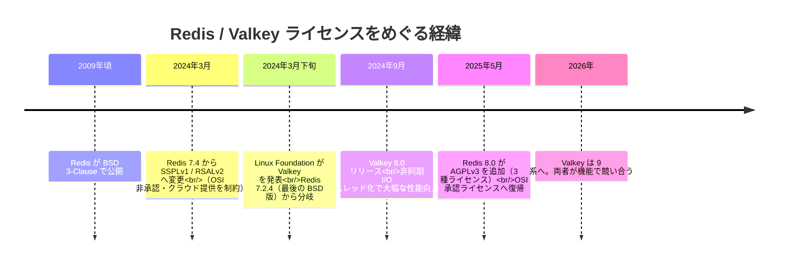
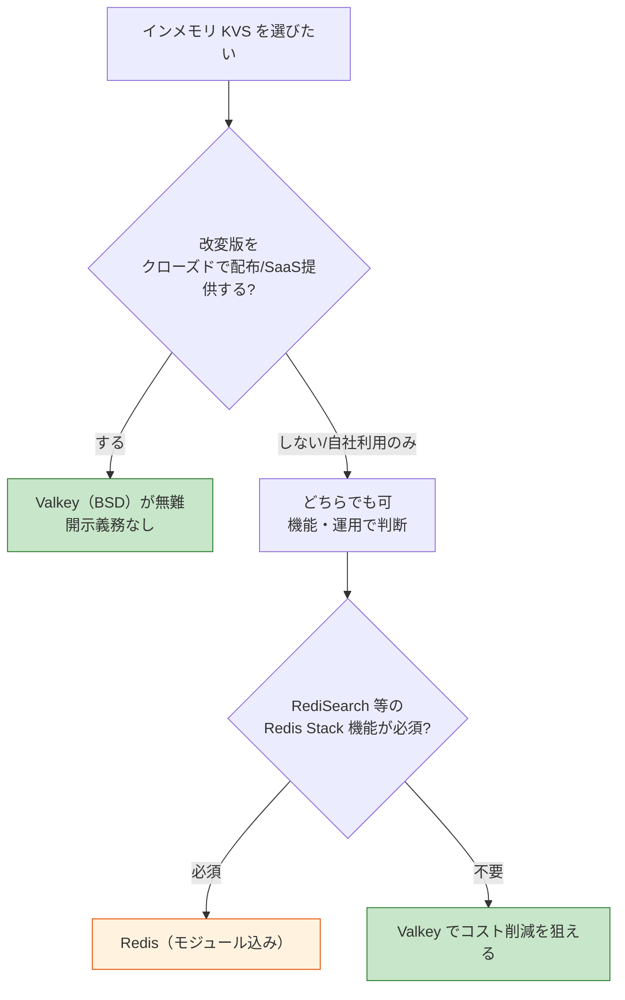
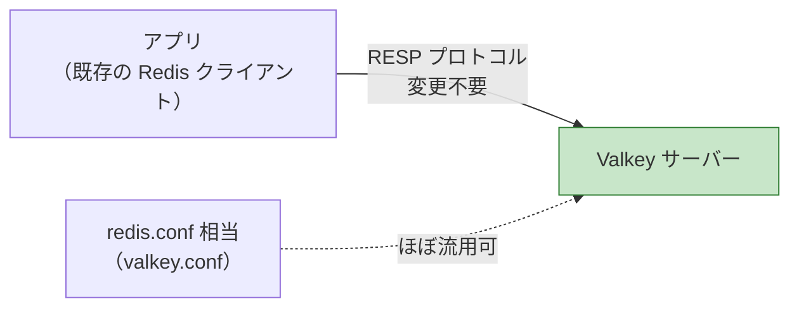

# Valkey（Redis の BSD ライセンス・フォーク）

> **一言で言うと:** Valkey（ヴァルキー）は、Redis が 2024 年にライセンスを変更したことを契機に、最後の BSD ライセンス版（Redis 7.2.4）から分岐（フォーク）して生まれたインメモリ KVS（Key-Value Store）である。Linux Foundation が主導し、BSD 3-Clause ライセンスで開発される。Redis と**プロトコル・コマンド互換**のため、多くのケースで設定を変えるだけで差し替えられる「ドロップイン代替」として使える。

## なぜ Valkey が生まれたのか — ライセンス変更という事件

Valkey を理解するには、まず **Redis のライセンス変更**という背景を知る必要がある。これは技術的な優劣の話ではなく、**オープンソースの統治（ガバナンス）と商用クラウドの利害**が衝突して起きた事件である。

Redis は長らく **BSD 3-Clause ライセンス**で公開されていた。BSD は「商用利用・改変・再配布のすべてが自由」な**パーミッシブ（寛容な）ライセンス**で、AWS や Google Cloud がマネージドサービス（ElastiCache 等）として Redis を提供できたのもこのためである。

しかし 2024 年 3 月、Redis を開発する Redis Ltd. は、ライセンスを **SSPLv1（Server Side Public License）** と **RSALv2（Redis Source Available License）** のデュアルライセンスへ変更した。これらは **OSI（Open Source Initiative）非承認**の「ソース閲覧可能（source-available）」ライセンスで、特にクラウド事業者が Redis を**マネージドサービスとして商用提供すること**に強い制約を課す。狙いは「クラウド大手が Redis でビジネスをするなら相応の対価を」という構図だった。

これに対し、Redis のコミッターやクラウド事業者が反発。**Linux Foundation** の下に、最後の BSD ライセンス版である **Redis 7.2.4** を起点としてフォークしたのが Valkey である。バックには **AWS・Google Cloud・Oracle・Ericsson・Snap** といった企業が付いた。



> [!info] 用語ミニ辞典
> - **フォーク（fork）:** 既存のオープンソースのソースコードを丸ごと複製し、**独立した別プロジェクト**として開発を続けること。元プロジェクトとは別の意思決定・リリースサイクルを持つ。
> - **パーミッシブ・ライセンス:** 改変版を**ソース非公開のまま再配布してよい**寛容なライセンス（BSD, MIT, Apache 2.0 等）。対して **コピーレフト（AGPL, GPL 等）**は改変版にも同じライセンスでのソース公開を義務づける。
> - **source-available:** ソースコードは閲覧できるが、OSI の「オープンソースの定義」を満たさないライセンス。「オープンソース」とは呼べない点が論争の核心だった。

## ライセンスの違い — ここが選定の最重要ポイント

技術スペックよりも先に、**ライセンスがプロジェクトの制約を決める**。シニアとして押さえるべきは「どのライセンスだと自社の使い方が縛られるか」である。

| 観点 | Valkey | Redis（8.0 以降） |
|------|--------|-------------------|
| ライセンス | **BSD 3-Clause** のみ（パーミッシブ） | **AGPLv3 / RSALv2 / SSPLv1** の 3 択 |
| OSI 承認 | あり | AGPLv3 はあり（RSALv2/SSPLv1 はなし） |
| 統治 | Linux Foundation（中立・コミュニティ主導） | Redis Ltd.（単一ベンダー主導） |
| クラウド提供 | 制約なし | RSALv2/SSPLv1 では制約。AGPLv3 はコピーレフト |
| 改変版の扱い | 非公開のまま再配布可 | AGPLv3 を選ぶと**ネットワーク提供時もソース開示義務** |

ポイントは、**Redis は 2025 年 5 月の Redis 8.0 で AGPLv3 を追加**し、OSI 承認ライセンスとして「オープンソースに復帰」したこと。ただし AGPLv3 は**コピーレフト**であり、「改変した Redis を SaaS としてネットワーク越しに提供する場合、その改変ソースを利用者に開示する義務」が生じる。自社で Redis を魔改造して製品に組み込むなら、この義務の有無が Valkey（BSD）との決定的な差になる。



## 技術的にはどう違うのか — 「互換だが性能で先行」

Valkey の設計思想は **「Redis と互換を保ちつつ、コミュニティの力で性能と効率を伸ばす」**。互換性を壊さないので移行は容易だが、フォーク後の改良で**性能面ではむしろ先行**した時期がある。

- **互換性:** 通信プロトコル **RESP（REdis Serialization Protocol）** と各種コマンド（`GET`/`SET`/`HSET`/`EXPIRE` 等）が互換。データ型（String, List, Set, Sorted Set, Hash, Stream）も共通。
- **Valkey 8.0（2024 年 9 月）:** **非同期 I/O のマルチスレッド化**を強化。データ操作はシングルスレッドのまま、ネットワークの読み書きを複数コアに分散することでスループットを大幅に向上させた。AWS Graviton3 系インスタンスでのベンチマークでは、7.2 系比で数倍のリクエスト/秒（RPS）を記録したとされる。
- **Valkey 8.1（2025 年）:** 同世代の Redis OSS と比べ、**おおむね +8% のスループット・P99 レイテンシ −22%・メモリ使用量 −20%** といった改善が報告された。AWS ElastiCache では Valkey が **約 20% 安い**料金で提供される。

> [!warning] ベンチマーク数値は鵜呑みにしない
> 上記の「+8%」「−20%」はいずれも**特定バージョン・特定構成（CPU・ペイロード・並列度）での測定値**であり、自社のワークロードでそのまま再現するとは限らない。Redis 側も 8.0 以降で性能を改善しており、両者は世代ごとに追い越し合っている。シニアの判断は「ベンチ記事の数字」ではなく**自分の代表的ワークロードで実測する**こと。

### 機能の分岐に注意

互換からスタートしたが、フォーク後は**それぞれ独自機能を足し始めている**。

- **Redis 8** は **ベクトル集合（vector sets）**、**ハッシュフィールド単位の TTL**、Redis Functions 2.0 などを追加。
- **Valkey** は `valkey-search`（ベクトル検索）など独自モジュールをコミュニティで開発。
- かつての **Redis Stack 機能（RediSearch・RedisJSON・RedisTimeSeries 等）はそのままでは Valkey に存在しない**。これらに依存していると単純な差し替えはできない。

つまり「**今は互換でも、将来は別物に育つ**」前提でアーキテクチャを組むのが安全である。

## 移行 — 多くのケースは「ドロップイン」

Valkey は Redis のクライアント・設定資産をほぼそのまま使える。



- **既存の Redis クライアント（`redis-py`, `go-redis`, `ioredis` 等）はそのまま接続できる。** 加えて Valkey 公式の `valkey-py` / `valkey-go` / `valkey-glide`（多言語対応）も提供される。
- **設定ファイル**は `redis.conf` の項目をほぼ流用できる。
- **AWS ElastiCache / MemoryDB** は「for Valkey」を選ぶだけで、より安い料金で同等運用が可能。

### コード例：既存の Redis クライアントで Valkey へ接続（Python）

```python
# redis-py はそのまま Valkey に接続できる（プロトコル互換のため）
# pip install redis
import redis

# 接続先を Valkey サーバーに向けるだけ。コードの書き換えは不要
r = redis.Redis(host="localhost", port=6379, decode_responses=True)

# セッションやキャッシュの読み書きは Redis と完全に同じ API
r.set("session:abc123", "user_id=7", ex=86400)  # TTL 24時間
print(r.get("session:abc123"))                   # → "user_id=7"

# Valkey 公式クライアント valkey-py を使う場合（API はほぼ同形）
# pip install valkey
# import valkey
# r = valkey.Valkey(host="localhost", port=6379, decode_responses=True)
```

### コード例：Valkey 公式クライアントで接続（Go）

```go
// Valkey 公式の高性能クライアント valkey-go を使う例
// go get github.com/valkey-io/valkey-go
package main

import (
	"context"
	"fmt"

	"github.com/valkey-io/valkey-go"
)

func main() {
	// クライアント初期化（接続先は Valkey サーバー）
	client, err := valkey.NewClient(valkey.ClientOption{
		InitAddress: []string{"localhost:6379"},
	})
	if err != nil {
		panic(err)
	}
	defer client.Close()

	ctx := context.Background()

	// SET key value EX 86400 をビルダ API で組み立てる
	err = client.Do(ctx,
		client.B().Set().Key("session:abc123").Value("user_id=7").ExSeconds(86400).Build(),
	).Error()
	if err != nil {
		panic(err)
	}

	// GET で取得
	val, _ := client.Do(ctx, client.B().Get().Key("session:abc123").Build()).ToString()
	fmt.Println(val) // → user_id=7
}
```

> 既存の `go-redis` を使っているなら接続先を Valkey に変えるだけで動く。`valkey-go` はパイプライン最適化に強く、新規採用時の選択肢になる。

## よくある落とし穴

### 1. 「Valkey は Redis とは別物」と身構えすぎる

互換性が極めて高いため、**多くのキャッシュ／セッションストア用途では設定変更だけで差し替えられる**。「学習し直し」「全面書き換え」を前提に身構えると、不要なコストを見積もってしまう。まずは PoC で既存クライアントを向けてみるのが速い。

### 2. 逆に「完全互換」と過信して Redis Stack 依存を見落とす

`RediSearch`（全文・ベクトル検索）、`RedisJSON`、`RedisTimeSeries` などの **Redis Stack 由来機能は標準の Valkey にない**。これらに依存したコードは差し替えで壊れる。移行前に「使っているのは素の Redis コマンドか、モジュール機能か」を棚卸しすること。

### 3. ライセンスの影響を「無料だから関係ない」と軽視する

どちらも無料で使えるが、**改変して再配布・SaaS 提供する場合**に差が出る。Redis の AGPLv3 を選ぶと**ネットワーク提供時のソース開示義務**が生じる。「製品に Redis を組み込んで魔改造し、それを SaaS で売る」なら、BSD の Valkey の方が義務が軽い。法務確認が必要な領域。

### 4. ベンチマーク記事の数字で結論を出す

「Valkey は N% 速い」はバージョンと構成に強く依存する。Redis も世代ごとに改善しており、優劣は固定ではない。**自社の代表ワークロードで実測**してから決める。

### 5. 将来の機能分岐を考えずに独自機能へロックインする

Valkey 独自モジュールや Redis 8 の vector sets など、**フォーク後の独自機能に深く依存すると、もう一方へ戻れなくなる**。素の KVS 機能に留めておけば、両者の間で乗り換え余地を保てる。

## AI 実装のアンチパターン

| アンチパターン | なぜ問題か | 正しい方向 |
|---|---|---|
| AI が「Redis = Valkey、完全に同じ」と断言 | Redis Stack 機能・独自拡張・ライセンスの差を見落とす | 「素のコマンドは互換、モジュール機能とライセンスは要確認」と前提を明示させる |
| 最新ベンチ値を根拠に「Valkey 一択」と推す | 数値は構成依存で、Redis も改善している | 「自社ワークロードで実測する」前提を制約に入れる |
| ライセンスを考慮せず採用を提案 | SaaS 提供時の AGPL コピーレフトを見逃す | 配布・提供形態をプロンプトの前提に含める |
| `valkey-py` 等の最新クライアントを無検証で生成 | バージョン差で API が古い/存在しない場合がある | 既存の `redis-py` 流用も選択肢として提示させ、バージョンを確認 |

→ [[_anti-patterns/_index|AIアンチパターン索引]]

## 関連トピック

- [[キャッシュ戦略]] — 親トピック。Valkey/Redis/Memcached はいずれも分散キャッシュの実体
- [[MemcachedとRedis]] — インメモリ KVS の使い分け。Valkey は Redis 互換の第 3 の選択肢として加わる
- [[NoSQL]] — Valkey は Redis 同様、Key-Value 型 NoSQL の代表
- [[セッションとJWT]] — セッションストアとして Redis 同様に利用できる
- [[npmとpnpmの比較]] — OSS のライセンス・統治が選定に効く別の事例として対比できる

## 参考リソース

- Valkey 公式サイト（valkey.io）/ valkey-io GitHub — リリースノート、クライアント一覧
- Linux Foundation ブログ「Forking Ahead: A Year of Valkey」— フォーク 1 年の総括
- Redis 公式ブログ「What is Valkey?」— Redis 側から見た比較
- 各種比較記事（Dragonfly, Better Stack 等）— Valkey 8.1 vs Redis 8.0 のベンチマーク（数値は構成依存と理解して読む）
