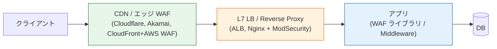
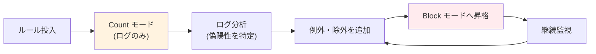

# WAF（Web Application Firewall）

> **一言で言うと:** WAF は HTTP/HTTPS トラフィックをアプリケーション層（L7）で解析し、SQLi・XSS・不審なペイロード・Bot・HTTP Flood などを検知・遮断する「アプリ専用のファイアウォール」。ただし本質的にはシグネチャ／ルールによる**パターン防御**であり、プリペアドステートメントやエスケープといった**構造的防御の代替にはならない**。

## 従来型ファイアウォールとの違い

WAF は名前こそ「ファイアウォール」だが、L3/L4 のパケットフィルタとは別物である。

| 項目 | L3/L4 ファイアウォール | WAF（L7） |
|------|----------------------|----------|
| 見る対象 | IP・ポート・TCP フラグ | HTTP メソッド・URL・ヘッダ・ボディ・Cookie |
| 検知できる攻撃 | ポートスキャン、SYN Flood、不正送信元 | SQLi、XSS、パス走査、HTTP Flood、Bot |
| TLS の扱い | 復号不要（L4 で素通し） | 復号が必要（終端 or SSL/TLS 鍵共有） |
| 主な配置 | ネットワーク境界 | CDN エッジ／LB 前段／アプリ前段 |
| 代表製品 | iptables／nftables、AWS Security Group、Cloud NGFW | Cloudflare WAF、AWS WAF、ModSecurity+CRS、Coraza |

L3/L4 FW は「誰が来ているか」しか見えず、正規の HTTP リクエストに偽装された攻撃（例: `?id=1' OR '1'='1`）は完全に素通しする。WAF はそれを補完する層である。

## どこに座るか



| 配置 | メリット | デメリット |
|------|---------|-----------|
| **エッジ型（CDN）** | オリジン到達前に遮断でき、帯域消費とスケールコストを最小化。[[DoS攻撃とDDoS攻撃\|DDoS]] 対策と同一層で運用できる | 自社の ASN 外にトラフィックが流れる・ベンダーロックイン |
| **ネットワーク型（LB / リバースプロキシ）** | オンプレや VPC 内で完結、カスタムルール自由度 | DDoS には自前容量が必要、スケールが重い |
| **ホスト/アプリ型（ModSecurity、ライブラリ）** | アプリ固有の文脈を使える、既存スタックに統合しやすい | アプリと同じ CPU・プロセスを消費し、Slowloris 系には無力 |

実務では「CDN WAF（広範な既知攻撃） + アプリ層のバリデーション（業務ロジック）」を重ねるのが定石。

## 検知モデル：ネガティブ vs ポジティブ

WAF の内部モデルは大きく 2 種類あり、運用スタイルが大きく変わる。

| モデル | 発想 | 例 | 長所 | 短所 |
|--------|------|-----|------|------|
| **ネガティブセキュリティ（ブラックリスト）** | 悪いパターンを列挙して遮断 | OWASP CRS、Cloudflare Managed Rules | 導入が容易、即座に広範な既知攻撃を止められる | 未知攻撃・難読化・0day に弱く、偽陽性も出やすい |
| **ポジティブセキュリティ（ホワイトリスト）** | 許可するリクエスト形式を列挙し、それ以外を全拒否 | OpenAPI/JSON Schema ベース、スキーマ駆動 WAF | 未知攻撃にも強い、意図外のパラメータ混入を遮断 | スキーマ作成・保守コストが高い、仕様変更のたびに更新が必要 |

実運用では「CRS をベースにしつつ、重要 API だけスキーマバリデーション」のようにハイブリッドで使うことが多い。スキーマ駆動の話は [[OpenAPIとスキーマ駆動開発]] と接続する。

## OWASP CRS（Core Rule Set）

OSS WAF の事実上の共通ルールセット。ModSecurity（Apache/Nginx モジュール）、Coraza（Go 実装）、AWS WAF Managed Rules、Cloudflare Managed Ruleset などがベースに採用している。

- **パラノイアレベル（PL1〜PL4）** — PL1 は偽陽性を最小化した「一般サイト向け」、PL4 は金融・行政向けの最大保護。段階的に上げるのが推奨
- **Anomaly Scoring** — 単一ルール一致で即ブロックせず、複数ルールのスコアを合算してしきい値超過でブロック。偽陽性を減らす工夫
- **Phase 分離** — リクエストヘッダ（phase 1）→ リクエストボディ（phase 2）→ レスポンスヘッダ（phase 3）→ レスポンスボディ（phase 4）→ ロギング（phase 5）の5段階でフックでき、フェーズごとにルールを書き分けられる

## 動作モード：Detect → Block

WAF 導入の鉄則は「最初は必ず検知モード（log only / count）で稼働し、統計を取ってから遮断モードに切り替える」こと。いきなり block モードで入れると偽陽性で正規ユーザーを締め出す。



## コード例

### AWS WAF を CDK（TypeScript）で ALB 前段に配置

```typescript
import * as cdk from "aws-cdk-lib";
import * as wafv2 from "aws-cdk-lib/aws-wafv2";

const webAcl = new wafv2.CfnWebACL(stack, "WebAcl", {
  scope: "REGIONAL",
  defaultAction: { allow: {} },
  visibilityConfig: {
    cloudWatchMetricsEnabled: true,
    metricName: "appWebAcl",
    sampledRequestsEnabled: true,
  },
  rules: [
    {
      name: "AWS-Common",
      priority: 0,
      overrideAction: { count: {} }, // ← 最初は count で偽陽性を観測
      statement: {
        managedRuleGroupStatement: {
          vendorName: "AWS",
          name: "AWSManagedRulesCommonRuleSet",
        },
      },
      visibilityConfig: {
        cloudWatchMetricsEnabled: true,
        metricName: "common",
        sampledRequestsEnabled: true,
      },
    },
    {
      name: "RateLimit",
      priority: 1,
      action: { block: {} },
      statement: {
        // limit は評価ウィンドウ内のリクエスト数。evaluationWindowSec を
        // 省略すると既定の 300 秒（5 分）で 2000 リクエストを閾値にする。
        rateBasedStatement: {
          limit: 2000,
          aggregateKeyType: "IP",
          evaluationWindowSec: 300,
        },
      },
      visibilityConfig: {
        cloudWatchMetricsEnabled: true,
        metricName: "rateLimit",
        sampledRequestsEnabled: true,
      },
    },
  ],
});
```

### ModSecurity + OWASP CRS（Nginx 設定抜粋）

```nginx
load_module modules/ngx_http_modsecurity_module.so;

http {
    modsecurity on;
    modsecurity_rules_file /etc/nginx/modsec/main.conf;

    server {
        listen 443 ssl http2;

        location / {
            # 特定パスのみ厳格モード
            modsecurity_rules '
                SecRuleEngine On
                Include /etc/nginx/modsec/crs/crs-setup.conf
                Include /etc/nginx/modsec/crs/rules/*.conf
                SecAction "id:900110,phase:1,nolog,pass,\
                    setvar:tx.inbound_anomaly_score_threshold=5,\
                    setvar:tx.paranoia_level=2"
            ';
            proxy_pass http://backend;
        }
    }
}
```

`/etc/nginx/modsec/main.conf` で `SecRuleEngine DetectionOnly` にすると検知モード、`On` でブロックモード。運用開始時は必ず `DetectionOnly` から。

### Coraza を Go アプリに埋め込む（ライブラリ型 WAF）

ModSecurity 互換のルールを Go 製アプリに直接組み込む例。サイドカーやエッジを持たないシンプルな構成でも WAF を導入できる。

```go
package main

import (
	"net/http"

	"github.com/corazawaf/coraza/v3"
	corazahttp "github.com/corazawaf/coraza/v3/http"
)

func main() {
	waf, err := coraza.NewWAF(
		coraza.NewWAFConfig().
			WithDirectivesFromFile("/etc/coraza/coraza.conf").
			WithDirectivesFromFile("/etc/coraza/crs-setup.conf").
			WithDirectivesFromFile("/etc/coraza/rules/*.conf"),
	)
	if err != nil {
		panic(err)
	}

	app := http.HandlerFunc(func(w http.ResponseWriter, r *http.Request) {
		w.Write([]byte("ok"))
	})

	// WAF ミドルウェアでアプリをラップする
	http.ListenAndServe(":8080", corazahttp.WrapHandler(waf, app))
}
```

Coraza は OWASP CRS v4 をそのまま読み込めるため、「ModSecurity のルール資産を Go スタックで再利用する」用途で採用が進んでいる。

## よくある落とし穴

### 1. WAF は SQLi の「根本対策」ではない

SQLi は **プリペアドステートメント** という構造的解決が存在する脆弱性である。WAF はあくまで多層防御の1層であり、アプリ側のバインドパラメータ使用を怠ると、WAF のシグネチャを難読化で回避された瞬間に破綻する。親トピックと [[SQLインジェクション]] の両方で同じ警告がある。

### 2. TLS 終端位置を考えないと WAF が「何も見えない」

End-to-End 暗号化（クライアント → オリジンまで TLS 維持）の構成では、エッジ WAF は暗号化ペイロードしか見えず機能しない。WAF を効かせるには **WAF 位置で一度 TLS を終端する** 必要があり、これは鍵管理・PCI DSS の要件と絡む設計上の重要ポイント。

### 3. 「WAF を入れたから脆弱性診断は不要」は誤り

WAF はシグネチャベースで、**ビジネスロジックの欠陥**（権限昇格、IDOR、価格改ざん）は原理的に検知できない。OWASP API Top 10 の大半はロジック系で、WAF ではなく設計・認可制御の問題。

### 4. 偽陽性の定量化なしに block モードへ昇格する

OWASP CRS の PL3 以上は「`<` や `'` を含む正規入力」（例: フォーラムのコード投稿、名前に `O'Brien`）を巻き込みやすい。count モードで **事前に決めた偽陽性許容率**（サービス特性に応じて、誤遮断されるユーザー数が事業上許容できる水準）を満たしてから block に切り替えるのが実務の定石。数値は一律ではなく、ログイン失敗・決済失敗のような致命度の高いフローでは平常系より一段厳しい基準を設ける。

### 5. WAF ルールの LLM 網羅生成

LLM に「CRS 風の WAF ルールを網羅的に作って」と頼むと、偽陽性だらけのルールが生成される。WAF ルールは既存の成熟したセット（CRS / Managed Rules）を起点にし、自作は「自社固有のビジネス制約」に限定すべき。親トピックの [[DoS攻撃とDDoS攻撃]] の AI アンチパターン表にも同じ指摘がある。

## AIによる実装のアンチパターン

| アンチパターン | なぜ問題か | 対策 |
|---|---|---|
| 正規表現で SQLi/XSS を独自検知する WAF モドキをアプリ内に実装 | CRS が何年もかけて磨いた網羅性に遠く及ばず、偽陽性だらけ | 実績ある Managed Rules を採用し、自作はビジネス固有ルールに限定 |
| WAF を理由にアプリ側のエスケープ・バインドを省く | WAF バイパスが1つ見つかった瞬間に全面陥落 | WAF は補助、構造的防御は必須という多層防御の原則を明示 |
| WAF ログを保存せず block 即時切り替え | 偽陽性の原因特定ができず、障害時に切り分け不能 | WAF ログを S3/BigQuery 等に長期保存し、サンプル付きで確認可能に |
| WAF の Managed Rule をバージョン固定せず自動更新 | ベンダーがルール更新した瞬間に本番で偽陽性バーストが発生 | ステージングで先行検証 → 段階的ロールアウト（canary 相当） |

## 関連トピック

- 親: [[DoS攻撃とDDoS攻撃]] — WAF は L7 DDoS（HTTP Flood、Bot）対策の中核で、多層防御の階層2を担当
- [[SQLインジェクション]] — WAF は補助的防御、プリペアドステートメントが根本対策
- [[XSS]] / [[CSRF]] — OWASP CRS の代表的な検知対象
- [[CDN]] — エッジ型 WAF の実行基盤。WAF と CDN は実質的に一体運用
- [[L4とL7ロードバランサーの違い]] — WAF は L7 で動作するため TLS 終端位置の設計と直結
- [[レート制限]] — Rate-based rule として WAF に組み込まれることが多い
- [[OpenAPIとスキーマ駆動開発]] — ポジティブセキュリティ WAF の源泉となるスキーマ

## 参考リソース

- [OWASP ModSecurity Core Rule Set](https://coreruleset.org/) — デファクト標準のルールセット、パラノイアレベルの概念
- [AWS WAF Developer Guide](https://docs.aws.amazon.com/waf/latest/developerguide/waf-chapter.html) — Managed Rules・Rate-based rule の実装パターン
- [Cloudflare: What is a WAF?](https://www.cloudflare.com/learning/ddos/glossary/web-application-firewall-waf/) — 概念・配置パターンの解説
- [OWASP API Security Top 10](https://owasp.org/API-Security/editions/2023/en/0x11-t10/) — WAF では検知しづらいロジック系脆弱性の整理
