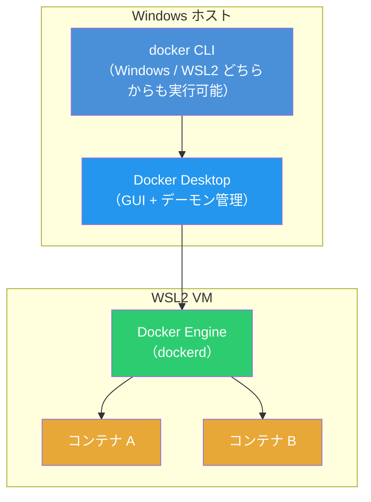
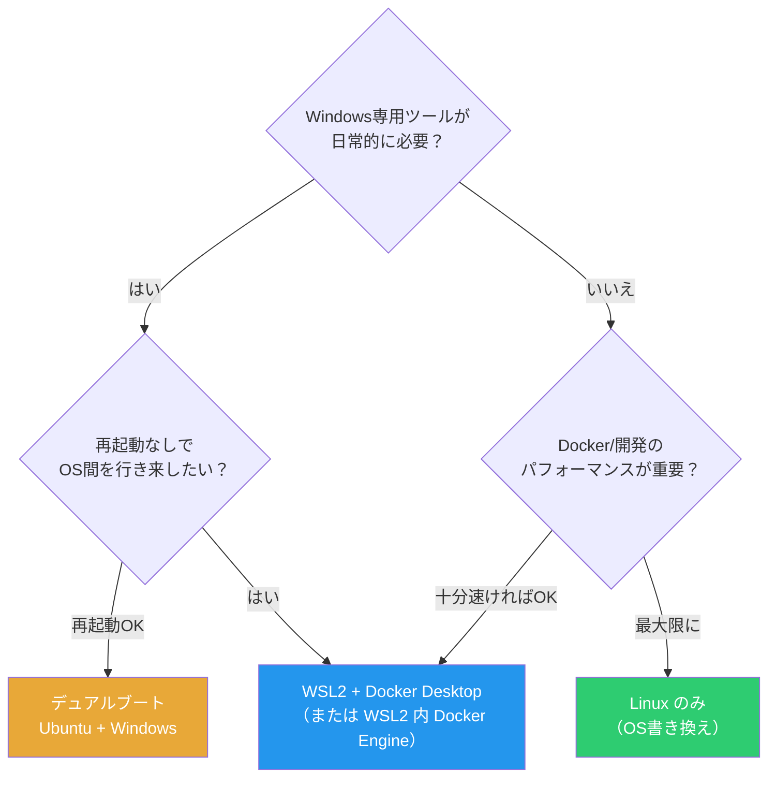

# WSL2とDocker（Windows Subsystem for Linux 2）

> **一言で言うと:** WSL2はWindows上で本物のLinuxカーネルを軽量VM内で動かす仕組み。Docker DesktopはこのWSL2を基盤として利用することで、WindowsでもLinuxコンテナをほぼネイティブのパフォーマンスで実行できる。

## WSL2とは何か

WSL（Windows Subsystem for Linux）はWindows上でLinux環境を利用するための仕組み。WSL1とWSL2は根本的にアーキテクチャが異なる。

### WSL1 vs WSL2

| 項目 | WSL1 | WSL2 |
|------|------|------|
| **カーネル** | Linuxカーネルなし（Windowsカーネルがシステムコールを翻訳） | 本物のLinuxカーネル（軽量VM内で動作） |
| **システムコール互換性** | 一部非対応（inotify、fuse等に制約） | 完全互換（実際のLinuxカーネル） |
| **ファイルI/O（Linux FS内）** | 遅い（NTFSへの変換が必要） | 高速（ext4上でネイティブ動作） |
| **ファイルI/O（Windows FS）** | 高速（直接アクセス） | 遅い（9Pプロトコル経由） |
| **メモリ使用量** | 少ない | VM分のメモリが必要（動的に縮小可能） |
| **Dockerサポート** | 非対応 | 完全対応 |


WSL2が「軽量VM」と呼ばれるのは、従来のVMと違い起動が数秒で済み、メモリを動的に確保・解放し、Windowsとファイルシステムやネットワークを透過的に共有するため。ユーザーの操作感はVMというより「Windowsに統合されたLinux環境」に近い。

## Docker DesktopとWSL2の連携

Docker DesktopはWindows上でDockerを動かすための公式ツール。WSL2バックエンドを使用する構成が現在の標準。

### アーキテクチャ



Docker DesktopはWSL2ディストリビューション `docker-desktop` と `docker-desktop-data` を内部的に作成し、その中でDocker Engineを動かす（Docker Desktop 4.30以降では単一ディストリビューションへの統合が進行中）。ユーザーが追加したWSL2ディストリビューション（Ubuntu等）からも `docker` コマンドが使えるよう統合（Integration）設定が用意されている。

### WSL2バックエンド vs 旧Hyper-Vバックエンド

| 項目 | WSL2バックエンド | 旧Hyper-Vバックエンド |
|------|----------------|---------------------|
| **起動速度** | 数秒 | 数十秒 |
| **メモリ** | 動的確保・解放 | 固定割り当て |
| **ファイル共有** | WSL2ファイルシステム内は高速 | Windowsとのファイル共有が常にオーバーヘッド |
| **WSLとの統合** | WSL2ディストロ内から直接dockerコマンド使用可能 | 別途Docker CLIのインストールが必要 |
| **Windows要件** | Windows 10 version 1903以降（x64。ARM64は version 2004以降） + WSL2有効化 | Windows 10 Pro/Enterprise（Hyper-V対応必須） |

## ファイルシステムのパフォーマンス — 最大の落とし穴

WSL2でDockerを使う際に最も重要なのが**ファイルの配置場所**。9Pプロトコル（Plan 9 Filesystem Protocol）によるWindows ↔ Linux間のファイル共有は大きなオーバーヘッドがある。

### パフォーマンス比較

```
プロジェクトの配置場所と相対的なI/O速度:

\\wsl$\Ubuntu\home\user\project   → Linux FS内（ext4）  → ★★★★★ 最速
/mnt/c/Users/user/project         → Windows FS（NTFS）  → ★★☆☆☆ 3〜5倍遅い
```

### 実測の目安（npm install の例）

| 配置場所 | npm install 所要時間（目安） |
|----------|---------------------------|
| Linux FS（`~/project`） | 10秒 |
| Windows FS（`/mnt/c/...`） | 30〜50秒 |

この差は `node_modules` のように大量の小さいファイルを扱う操作で顕著になる。

### 推奨構成

```bash
# ★ 推奨: WSL2のLinuxファイルシステム内にプロジェクトを配置
cd ~
mkdir -p projects
git clone https://github.com/example/myapp.git ~/projects/myapp
docker compose up  # Linux FS内なのでバインドマウントも高速

# ✗ 非推奨: Windows側のファイルをバインドマウント
cd /mnt/c/Users/charl/projects/myapp
docker compose up  # 9P経由で大幅に遅くなる
```

Windows側のエディタ（VS Code等）からWSL2内のファイルを編集する場合は、VS Codeの**WSL拡張機能**（旧 Remote - WSL）を使えばWSL2ファイルシステム内のファイルをシームレスに編集できる。

## WSL2のリソース管理

WSL2はデフォルトでホストマシンのメモリの50%（最大8GB）を使用する。Docker コンテナがメモリを大量に消費する場合は `.wslconfig` で調整する。

```ini
# %USERPROFILE%\.wslconfig（Windowsのホームディレクトリに配置）
[wsl2]
memory=8GB          # WSL2に割り当てる最大メモリ
swap=4GB            # スワップサイズ
processors=4        # 使用するCPUコア数
localhostForwarding=true  # localhost でWSL2内のポートにアクセス可能にする
```

```powershell
# 設定変更後はWSL2の再起動が必要
wsl --shutdown
```

Docker Desktop側でもSettings → Resources → WSL integrationからリソース設定が可能だが、WSL2バックエンド使用時は `.wslconfig` の設定が優先される。

## よくある落とし穴

### 1. バインドマウントが遅い原因を理解していない

`/mnt/c/...` 配下のファイルをDocker の `volumes` でバインドマウントすると、9Pプロトコルの変換が二重に発生する（Windows → WSL2 → コンテナ）。ホットリロード（ファイル変更の検知）も `inotify` が `/mnt/c` 経由では機能しないため、ポーリングにフォールバックしてCPU使用率が上がる。

```yaml
# ✗ /mnt/c 経由のバインドマウント — 遅い + inotify不可
services:
  app:
    volumes:
      - /mnt/c/Users/charl/project:/app

# ★ Linux FS 内のプロジェクトをマウント — 高速 + inotify動作
services:
  app:
    volumes:
      - /home/user/project:/app
```

### 2. WSL2のディスク容量が膨張する

WSL2の仮想ディスク（`.vhdx`）は自動で拡張されるが、Docker イメージやボリュームを削除しても**自動では縮小されない**。定期的な手動圧縮が必要。

```powershell
# WSL2のディスク使用量を確認
wsl --system -d docker-desktop df -h /

# 未使用のDockerリソースを削除してからディスクを圧縮
docker system prune -a --volumes

wsl --shutdown
# PowerShell (管理者権限) で仮想ディスクを圧縮
Optimize-VHD -Path "$env:LOCALAPPDATA\Docker\wsl\disk\docker_data.vhdx" -Mode Full
# Hyper-Vモジュールがない場合は diskpart を使用:
# diskpart → select vdisk file="パス" → compact vdisk → exit
```

### 3. localhost のポートフォワーディングが効かない

WSL2は独自のネットワークアダプタを持つため、コンテナが `0.0.0.0` でリッスンしていてもWindowsの `localhost` からアクセスできない場合がある。Docker Desktopは通常これを自動で解決するが、Docker Desktopを使わずに WSL2 内で直接 Docker Engine を動かしている場合は手動設定が必要になることがある。

```bash
# WSL2のIPアドレスを確認
ip addr show eth0 | grep inet
# → 172.x.x.x 系のアドレスが返る

# .wslconfig で localhostForwarding=true にしておけば
# Windows の localhost → WSL2 へ自動転送される
```

### 4. WSL2とDocker Desktopのライセンス

Docker Desktopは大規模な商用利用（従業員250人以上 or 年間収益 $10M以上）では有料ライセンスが必要。代替として WSL2 内に直接 Docker Engine をインストールする方法がある。

```bash
# Docker Desktop を使わずに WSL2 (Ubuntu) 内に Docker Engine を直接インストール
# 公式リポジトリの追加
curl -fsSL https://download.docker.com/linux/ubuntu/gpg | sudo gpg --dearmor -o /usr/share/keyrings/docker-archive-keyring.gpg
echo "deb [arch=amd64 signed-by=/usr/share/keyrings/docker-archive-keyring.gpg] https://download.docker.com/linux/ubuntu $(lsb_release -cs) stable" | sudo tee /etc/apt/sources.list.d/docker.list
sudo apt-get update && sudo apt-get install -y docker-ce docker-ce-cli containerd.io

# systemd が有効な WSL2 (Windows 11) なら通常通り起動
sudo systemctl start docker
sudo usermod -aG docker $USER
```

## 実務での使用シーン

| シーン | 構成 |
|--------|------|
| **フロントエンド開発** | WSL2のLinux FS内にプロジェクト配置 + VS Code Remote WSL + `docker compose up` でAPI/DBを起動 |
| **バックエンド開発** | WSL2内でコーディング + Docker ComposeでDB・Redis・メールサーバー等を起動 |
| **CI/CDパイプラインのローカル再現** | WSL2 + Docker でGitHub Actionsのワークフローをローカルテスト（[act](https://github.com/nektos/act)等） |
| **レガシー環境の分離** | 古いバージョンの言語/ランタイムをコンテナ内に閉じ込め、ホストWSL2環境を汚さない |

## ネイティブLinuxという選択肢 — WSL2のオーバーヘッドからの解放

WSL2は「Windows上でLinuxを使う」ための優れた妥協点だが、あくまでHyper-V VM上でLinuxカーネルを動かしている。デュアルブートやOS書き換えでLinuxをネイティブ実行すれば、この仮想化レイヤーのオーバーヘッドは完全に消える。

### WSL2 vs ネイティブLinux のDocker パフォーマンス

| 項目 | WSL2上のDocker | ネイティブLinux上のDocker |
|------|---------------|------------------------|
| **カーネル** | Hyper-V VM内のLinuxカーネル | ホストのLinuxカーネルそのもの |
| **ファイルI/O** | ext4だが仮想ディスク（`.vhdx`）経由 | ext4/xfsに直接アクセス |
| **ネットワーク** | 仮想NIC + NATまたはブリッジ | ホストのNICを直接使用（`--network host` が真に機能） |
| **メモリ管理** | Windows + VM + コンテナの三重管理 | ホストOS + コンテナの二重管理のみ |
| **cgroup/namespace** | VM内のカーネルが提供 | ホストカーネルが直接提供（オーバーヘッドゼロ） |
| **起動速度** | WSL2 VM起動 + Docker Engine起動 | Docker Engine起動のみ |
| **ディスク** | `.vhdx` 仮想ディスク（自動縮小されない） | 実ファイルシステム上に直接格納 |

特にファイルI/Oの差は実測で体感できるレベルになる。WSL2のext4は仮想ディスク上にあるため、ネイティブLinuxのext4と比較して `docker build` やバインドマウントを多用するワークロードで10〜20%程度のオーバーヘッドが生じるケースがある。

### 導入方法と形態

| 形態 | 概要 | 向いているケース |
|------|------|----------------|
| **デュアルブート** | Windows と Linux を同一マシンにインストールし、起動時に選択 | Windowsの機能（Office、Adobe等）も必要。開発時だけLinuxに切り替えたい |
| **OS書き換え** | Windowsを削除してLinuxのみインストール | 開発専用マシン。Windows依存のツールが不要 |
| **外付けSSDブート** | USBの外付けSSDにLinuxをインストールして起動 | 既存環境を一切変更せずに試したい。持ち運び可能 |

```bash
# デュアルブートの一般的な手順（概要）
# 1. Windowsのディスク管理でパーティションを縮小し、空き領域を作る
# 2. Ubuntu等のISOをUSBに書き込み（Rufus, Etcher等）
# 3. USBから起動し、空き領域にLinuxをインストール
# 4. GRUBブートローダーが自動でデュアルブートメニューを構成

# ネイティブLinuxでのDocker導入はシンプル
curl -fsSL https://get.docker.com | sh
sudo usermod -aG docker $USER
# 再ログイン後すぐに使える — Docker DesktopもWSL2も不要
```

### デュアルブート/OS書き換えのトレードオフ

**WSL2を超えるメリット:**
- Docker のパフォーマンスが最大化される（仮想化レイヤーなし）
- `.vhdx` の膨張問題が存在しない
- `--network host` がホストのネットワークスタックに直接アクセスする
- `inotify` が全てのファイルシステムで正常動作する（ホットリロードが確実）
- Docker Desktop のライセンス問題が完全に不要
- systemd、cgroup v2、eBPF など Linux の最新機能がフルに利用できる

**考慮すべきデメリット:**
- デュアルブートは**OS切り替えに再起動が必要**（WSL2は即座に行き来できる）
- Windows専用ソフト（Office、Adobe系、一部ゲーム）がLinux上では動かない（Wineで一部対応可能だが完全ではない）
- ハードウェアドライバの対応状況がWindowsより限定的（特にGPU、Wi-Fi、指紋認証）
- BitLocker等のWindows暗号化とデュアルブートの共存に注意が必要
- チーム全体がWindowsの場合、環境差異によるトラブルシューティングのコストが増える

### 判断の指針



多くのWeb開発者にとってWSL2は十分な選択肢だが、CI/CDのローカル実行やコンテナを多用するマイクロサービス開発など**Docker のI/O性能がボトルネック**になる場合は、ネイティブLinux環境への移行を検討する価値がある。

## 関連トピック

- [[Docker]] — 親トピック。コンテナの仕組み全般
- [[Dockerイメージ]] — イメージのレイヤー構造とビルド最適化
- [[DockerとNix-Flakeによる開発環境管理]] — Nix Flakeとの開発環境管理の比較
- [[Linux基本操作]] — WSL2内での操作にLinuxコマンドの知識が必須
- [[プロセスとスレッド]] — コンテナの本質であるプロセス隔離の基礎
- [[ファイルシステムとIO]] — WSL2の9Pプロトコルやext4/NTFSのパフォーマンス特性に関連
