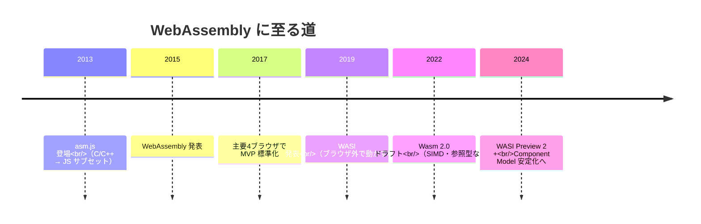
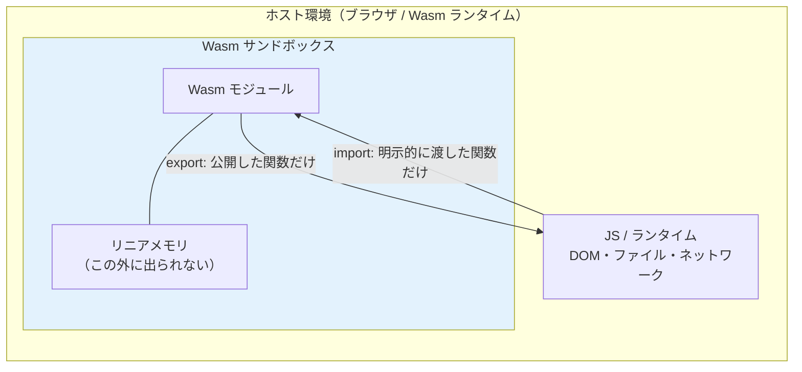
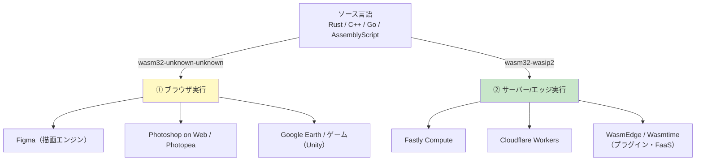
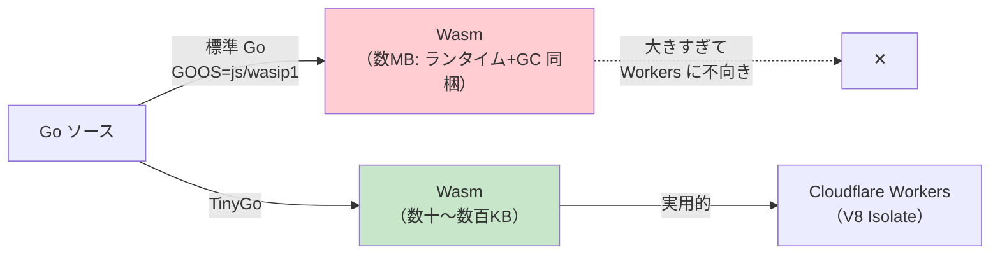
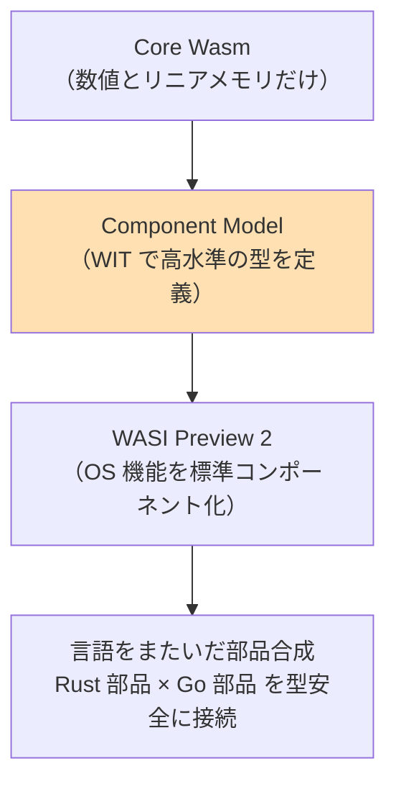

# WebAssembly（Wasm）

> **一言で言うと:** WebAssembly（略称 Wasm）は、ブラウザでもサーバー/エッジでも動く **可搬（portable）なバイナリ命令フォーマット**。C/C++/Rust/Go などで書いたコードをコンパイルして得る「擬似 CPU の機械語」で、**JavaScript を置き換えるのではなく、JS が苦手な重い計算を高速かつ安全に実行する補完役**として設計された。2017年に主要ブラウザで標準化され、現在はブラウザの外（WASI による サーバーサイド実行）にも領域を広げている。

## 名前の整理 — 「Wasm」とは何の略でもない

最初に用語を固めておく。誤解が多い領域なので、語が指す範囲を明確にする。

| 用語 | 指すもの |
|---|---|
| **WebAssembly / Wasm** | 仕様の正式名称。`Wasm` は「WebAssembly」の短縮表記であって頭字語ではない（"WASM" と全大文字で書くのは慣習的には非推奨）。**バイナリ命令フォーマットそのもの**を指す |
| **`.wasm` ファイル** | コンパイル結果のバイナリ。スタックマシン（後述）向けの命令列が詰まっている |
| **`.wat` ファイル** | WebAssembly Text Format。`.wasm` を人間が読めるテキストに変換したもの。デバッグ・学習用 |
| **Wasm ランタイム** | `.wasm` を実行する処理系。ブラウザの JS エンジン（V8/SpiderMonkey）や、サーバー用の Wasmtime / Wasmer / WasmEdge など |
| **WASI**（ワジ） | WebAssembly System Interface。**ブラウザの外**でファイル・ネットワーク・時刻などの OS 機能を Wasm から使うための標準 API。「ブラウザに依存しない Wasm の libc」のような位置づけ |

> [!info] 用語ミニ辞典
> - **バイナリ命令フォーマット (binary instruction format):** CPU が直接読む機械語に似た、命令を並べたバイナリ表現。ただし Wasm は**実機の CPU 命令ではなく仮想的な命令セット**で、実行時にランタイムが実機の命令へ変換する。これにより「どの CPU でも同じバイナリが動く」可搬性を得る
> - **可搬 (portable):** 一度ビルドしたバイナリが、x86 でも ARM でも、Windows でも Linux でも、ブラウザでもサーバーでも、再ビルドなしに動くこと

## なぜ生まれたか — JavaScript の限界という背景

ブラウザで動く言語は長く JavaScript（[[JavaScript]]）一択だった。JS は柔軟で書きやすいが、**動的型・GC（ガベージコレクション）・JIT 最適化の予測困難さ**という性質上、画像処理・動画エンコード・3D ゲーム・暗号計算のような **CPU を限界まで使う処理では遅く、性能が安定しない**。

この問題に対し、2010年代前半に2つの前段階があった。

1. **Emscripten + asm.js（2013頃）** — C/C++ を LLVM 経由で「JS の極めて限定的なサブセット」に変換し、エンジンが特別最適化できるようにした。動いたが、所詮は JS のテキストをパースする必要があり、起動が遅く表現にも限界があった
2. **WebAssembly（2015 発表 → 2017 標準化）** — asm.js の発想を「専用のコンパクトなバイナリフォーマット」として作り直したもの。**パースが速く（テキストでなくバイナリ）、検証が速く、実行が速い**。主要4ブラウザ（Chrome/Firefox/Safari/Edge）のベンダーが共同で策定した稀有な標準



ここで重要な設計判断は、**「JS を置き換えない」と最初から決めていた**こと。Wasm は DOM を直接触れず、UI を組むのには向かない。JS が UI とイベントを担い、Wasm が計算を担う **役割分担** が前提になっている。この線引きを誤解すると「Wasm で全部書けば速い」という的外れな期待につながる（→ 後述の落とし穴）。

## 仕組み — スタックマシンとサンドボックス

### スタックマシンとしての実行モデル

Wasm の命令は **スタックマシン (stack machine)** 向けに設計されている。レジスタ（CPU 内の高速な変数置き場）を直接指定する代わりに、値を「スタック」に積んだり降ろしたりして計算する。

> [!info] 用語ミニ辞典
> - **スタックマシン:** 計算途中の値を後入れ先出し（LIFO）の「スタック」に積んで処理する仮想機械のモデル。`2 と 3 を積む → add 命令でその2つを取り出し 5 を積む`、という具合。命令がコンパクトになり、ランタイムが検証・最適化しやすい

```wat
;; .wat（テキスト形式）で書いた「2つの i32 を足す」関数
(module
  (func (export "add") (param $a i32) (param $b i32) (result i32)
    local.get $a   ;; $a をスタックに積む
    local.get $b   ;; $b をスタックに積む
    i32.add))      ;; スタック上の2値を足し、結果を積む
```

このコンパクトさが「ダウンロードが小さい・パースが速い・起動が速い」という Wasm の強みの源泉になっている。

### サンドボックス — 安全性が最初から組み込まれている

Wasm のもう一つの核心は **サンドボックス (sandbox)** だ。Wasm モジュールは、**自分専用に与えられた連続したメモリ領域（リニアメモリ）の外には一切アクセスできない**。OS のシステムコールも直接は呼べず、ファイルやネットワークに触れるには「ホスト（JS やランタイム）が明示的に渡した関数」を通すしかない。

> [!info] 用語ミニ辞典
> - **サンドボックス:** プログラムを隔離された箱の中で動かし、外部（ホストのメモリ・ファイル・ネットワーク）への影響を遮断する仕組み。砂場（sandbox）の外を汚さないイメージ
> - **リニアメモリ (linear memory):** Wasm モジュールに与えられる「0 番地から連続した1本のバイト配列」としてのメモリ。モジュールはこの範囲内でしかメモリを読み書きできず、範囲外アクセスは即座にトラップ（実行停止）する。これがメモリ安全性を担保する



この「**デフォルトで何もできない（capability-based security）**」設計が、信頼できないコードを安全に実行できる根拠になっている。Cloudflare Workers や Fastly Compute がエッジで無数のテナントのコードを同居させられるのも、この隔離性ゆえだ（→ [[エッジコンピューティング]]）。

## 2つの実行系統 — ブラウザとサーバー/エッジ

Wasm は今や2つの世界で動く。混同しやすいので分けて理解する。



### ① ブラウザ実行 — JS と組んで重い処理を担う

最も成熟した使い道。**JS から `.wasm` を読み込み、計算だけ Wasm に委ねる**。

- **Figma** — デザインツールの描画・レイアウト計算を **C++ → Wasm**（当初は asm.js）で実行。これが「ブラウザなのにネイティブアプリ並み」の体感を実現した代表例
- **Adobe Photoshop on Web** — 既存の巨大な **C++ コードベースを Emscripten で Wasm 化**して移植した事例。フルスクラッチを避け、20年以上積み上げた資産をそのまま Web に持ち込んだ
- **Google Earth、Unity / Unreal 製ゲーム** — C++ 系の 3D エンジンを丸ごと Wasm に

> [!warning] 「Wasm = Rust」と短絡しない
> ブラウザの代表的アプリ（Figma・Photoshop）は、いずれも**既存の C++ 資産を Emscripten で Wasm 化**した例であって Rust ではない。Rust が真価を発揮するのは「**ゼロから書く新規の Wasm コード**」（後述の wasm-bindgen / Cloudflare 例）であり、既存 C/C++ 資産の移植は Emscripten 経由が主流。コンパイル元の言語は「何を Wasm 化するか」で決まる。

### ② サーバー/エッジ実行 — WASI で OS 機能を使う

ブラウザの外で Wasm を動かすには、ファイルや時刻などの OS 機能を呼ぶ標準が要る。それが **WASI** だ。

- **Fastly Compute** — エッジ上で Rust/Go/JS をコンパイルした Wasm を実行（→ [[エッジコンピューティング]] のランタイム比較表）
- **Cloudflare Workers** — V8 Isolate 上で JS と Wasm を動かす。Rust 製 Wasm が **コールドスタート < 1ms** で世界中のエッジで走る（→ [[Rust]] の Cloudflare Workers 節）
- **WasmEdge / Wasmtime** — サーバーサイド FaaS やアプリのプラグイン機構として。Wasm の隔離性を活かし「ユーザー投稿コードを安全に実行する」用途に向く

サーバーサイドで Wasm が注目される理由は、コンテナ（Docker）と比べた **起動の速さ・軽さ・隔離性** にある。

| 観点 | コンテナ（[[Dockerイメージ]]） | Wasm モジュール |
|---|---|---|
| 起動時間 | 数百ms〜数秒 | < 1ms（コールドスタートがほぼゼロ） |
| サイズ | 数十MB〜 | 数KB〜数MB |
| 隔離単位 | OS プロセス + 名前空間 | 言語ランタイムのサンドボックス |
| 可搬性 | CPU アーキ依存（要マルチアーキビルド） | 1バイナリがどこでも動く |
| 適性 | 任意の OS プロセス・既存資産 | 短命・高密度・信頼境界をまたぐ実行 |

### ケーススタディ — Cloudflare で Go を動かすと Wasm になる

「Cloudflare Workers で Go を使うと Wasm になるのか？」— **答えは Yes**。そしてその理由を辿ると、Wasm の本質と GC 言語の制約が一気に見えてくる。

出発点は **Workers のランタイムが V8 Isolate であり、実行できるのは JavaScript と Wasm の2つだけ** という事実だ。ネイティブの Go バイナリも Docker コンテナも、Workers 本体（`workerd`）はそのままでは動かさない。したがって Go のコードをエッジで動かすには、**Go → Wasm にコンパイルして、それを JS から読み込ませる**しか道がない。Rust が `wasm32` ターゲットで Wasm になるのと同じ構図だ。



ここで問題になるのが **バイナリサイズ**だ。標準の Go コンパイラ（`GOOS=js GOARCH=wasm` あるいは Go 1.21+ の `GOOS=wasip1 GOARCH=wasm`）は、**Go のスケジューラと GC（ガベージコレクタ）をまるごと `.wasm` に詰め込む**。その結果、最小の Hello World でも数MB級になり、コールドスタートとロードが重く、Workers のサイズ上限にも当たりやすい。これは前述の落とし穴「GC 言語の単純移植」がそのまま現れた形だ。

> [!info] 用語ミニ辞典
> - **V8 Isolate（V8 アイソレート）:** V8 は Google が開発した JavaScript エンジン（Chrome や Node.js の心臓部）。その中で **Isolate は「独立した1つの JS 実行環境」の単位**で、専用のヒープ（メモリ領域）とグローバル変数を持ち、他の Isolate とは完全に隔離される。重要なのは、**Isolate はコンテナや OS プロセスよりはるかに軽い**こと。コンテナは「OS ごと小さく立ち上げる」イメージで起動に数百ms〜秒かかるのに対し、Isolate は「1つのプロセス内に何千個も同居できる薄い箱」で、起動はほぼ一瞬（< 1ms）。Cloudflare Workers はリクエストごとにコンテナを起動する代わりに、1プロセス内の Isolate を切り替えることで**コールドスタートをほぼゼロ**にし、世界中のエッジで無数のテナントのコードを安全に同居させている。Isolate が実行できるのは V8 が解釈できるもの、すなわち **JS と Wasm の2つだけ** — これが「Workers で Go を動かすには Wasm にするしかない」理由の根っこ
> - **TinyGo:** Go の代替コンパイラ。LLVM を使い、組込み・Wasm 向けに **極めて小さなバイナリ**を生成する。標準 Go の数MBに対し数十〜数百KBに収まる。代償として Go の全機能はサポートせず（リフレクションの一部・一部の標準ライブラリに制限）、別物として扱う必要がある
> - **`workerd`:** Cloudflare Workers のオープンソースなランタイム本体。V8 Isolate を基盤に JS と Wasm を実行する

そのため Go を Workers で使う現実的なルートは **TinyGo でコンパイルする**ことになる。`syumai/workers` のようなライブラリは TinyGo → Wasm を前提に、`fetch` ハンドラを Go で書けるようにしている。

```go
// Cloudflare Workers 上で動く Go（TinyGo でビルドする前提）
// syumai/workers ライブラリが Wasm 化と JS グルーを肩代わりする
package main

import (
	"net/http"

	"github.com/syumai/workers"
)

func main() {
	handler := http.HandlerFunc(func(w http.ResponseWriter, _ *http.Request) {
		// このハンドラは TinyGo で .wasm にコンパイルされ、
		// V8 Isolate 上の JS グルーから呼び出される
		w.Write([]byte("Hello from Go on Cloudflare (compiled to Wasm)"))
	})
	workers.Serve(handler) // 内部で fetch イベントに橋渡し
}
```

ビルドは `tinygo build -o build/app.wasm -target wasm ...` のように **Wasm ターゲット**を明示し、`wrangler` でデプロイする。`.wasm` であることがここで顕在化する。

**この一例から汲み取るべき判断軸:**

- **「エッジで動く ≒ Wasm（または JS）に落ちる」** — Workers のような V8 Isolate 系プラットフォームでは、どの言語も最終的に JS か Wasm になる。言語選択は「Wasm にしたとき軽く速いか」を含む（→ [[プログラミング言語の系譜と選択]]）
- **GC の有無がサイズを決める** — Rust が Cloudflare で好まれるのは、GC を持たず Wasm が小さく済むから。Go は TinyGo で軽量化できるが機能制約とのトレードオフになる
- **同じ「Go on Cloudflare」でも文脈で別物** — Workers は Wasm 経由。一方 Cloudflare の **Containers**（コンテナ実行のサービス）ならネイティブ Go バイナリをそのまま動かせる。「Cloudflare で Go」と言ったときに Workers（=Wasm）か Containers（=ネイティブ）かを区別するのがシニアの目線

## JS との相互運用 — wasm-bindgen とメモリの壁

ブラウザで Wasm を使う最大の難所が **JS と Wasm のデータの受け渡し** だ。なぜなら Wasm が直接扱えるのは **数値（i32 / i64 / f32 / f64）だけ**で、文字列・オブジェクト・配列のような構造はそのままでは渡せないから。

これは「Wasm のリニアメモリは数値のバイト列でしかない」という設計の必然的な帰結だ。文字列を渡すには、**JS 側で文字列をバイト列にしてリニアメモリへ書き込み、その先頭アドレスと長さ（数値）を Wasm に渡す**、という手作業が要る。

この煩雑さを自動化するのが **wasm-bindgen**（[[Rust]] の場合）だ。

> [!info] 用語ミニ辞典
> - **wasm-bindgen:** Rust と JS の間で文字列・構造体・クロージャなどを自動で橋渡しするツール／ライブラリ。生成されたグルーコード（接着用の JS）が、リニアメモリへの書き込み・読み出しを肩代わりしてくれる。Rust + Wasm が「事実上の第一級」と言われる理由の一つ

```rust
// Rust 側: #[wasm_bindgen] を付けるだけで JS から呼べる関数になる
use wasm_bindgen::prelude::*;

#[wasm_bindgen]
pub fn greet(name: &str) -> String {
    // 文字列の受け渡しは wasm-bindgen が自動でメモリ橋渡ししてくれる
    format!("Hello, {name}! (computed in Wasm)")
}

#[wasm_bindgen]
pub fn sum_of_squares(n: u32) -> u64 {
    // 重い数値計算こそ Wasm の本領
    (1..=n as u64).map(|x| x * x).sum()
}
```

```typescript
// JS/TS 側: wasm-pack が生成したグルーコードを import して呼ぶだけ
import init, { greet, sum_of_squares } from "./pkg/my_wasm.js";

async function main() {
  await init(); // .wasm のロードと初期化（非同期）
  console.log(greet("world"));        // "Hello, world! (computed in Wasm)"
  console.log(sum_of_squares(100000)); // 重い計算は Wasm に委ねる
}
main();
```

`#[wasm_bindgen]` と数行の JS だけで連携できているが、**裏ではメモリのコピーが起きている**点は意識しておきたい。大きなデータを毎フレーム JS ⇄ Wasm でやり取りすると、その境界通過（コピー）自体がボトルネックになる。

## Component Model と WASI Preview 2 — 次の標準

ここからはシニア視点で押さえたい「これからの動向」。

初期の Wasm（Core Wasm）には2つの根深い課題があった。

1. **数値しか渡せない** — 文字列・レコード・リストといった「高水準の型」を、言語をまたいで安全に受け渡す共通の仕組みがない。wasm-bindgen は Rust↔JS 限定の場当たり的解決でしかない
2. **モジュールの合成が弱い** — 異なる言語で書いた Wasm 同士を「部品」として組み合わせにくい

これに答えるのが **Component Model（コンポーネントモデル）** と、その上に立つ **WASI Preview 2**（2024年に安定化が進んだ）だ。

> [!info] 用語ミニ辞典
> - **Component Model:** Core Wasm の上に「高水準の型を持つ部品（component）」という層を載せる仕様。**WIT（WebAssembly Interface Types）**というインターフェース定義言語で「この部品は文字列を受け取りレコードを返す」と宣言でき、Rust 製部品と Go 製部品を型安全に接続できる。マイクロサービスの IDL（[[API設計-REST-GraphQL]] の Protocol Buffers のような契約）を Wasm の世界に持ち込むイメージ
> - **WASI Preview 2:** Component Model を基盤に再設計された WASI。ファイル・ネットワーク・時刻などの OS 機能が「標準のコンポーネントインターフェース」として整理された。Preview 1（関数の寄せ集め）からの大きな前進



実務でいま全面採用するのは時期尚早だが、「Wasm の将来は単なる高速化ではなく、**言語非依存の部品エコシステム**にある」という方向性は知っておく価値がある。

## どんなワークロードに向くか / 向かないか

Wasm を採用すべきかの判断軸。「速そうだから」で入れると失敗する。

### 向く

- **CPU バウンドな純粋計算** — 画像/動画処理、暗号、圧縮、物理シミュレーション、ゲームエンジン。JS の数倍速く、性能が安定する
- **既存の C/C++/Rust 資産のブラウザ移植** — ネイティブライブラリ（ffmpeg、SQLite、OpenCV 等）をブラウザで動かす
- **信頼できないコードの隔離実行** — プラグイン機構、ユーザー投稿スクリプト、マルチテナントなエッジ FaaS。サンドボックスが効く
- **エッジでの超軽量・超高速起動** — コンテナでは重すぎる短命処理

### 向かない

- **DOM 操作中心の UI** — Wasm は DOM を直接触れず、JS 経由になりむしろ遅くなる。React/Vue を Wasm で置き換える動機は薄い
- **JS ⇄ Wasm の往復が多い処理** — 境界通過のコピーコストが計算の利得を食い潰す
- **ちょっとした処理** — `.wasm` のロードと初期化のオーバーヘッドの方が大きい
- **GC 言語の単純移植** — Go や C# も Wasm 化できるが、ランタイム/GC ごとバイナリに含むためサイズが膨らむ。Rust が好まれるのは「GC なし＝小さく速い」から

## よくある落とし穴

| 落とし穴 | 何が起きるか | 対処 |
|---|---|---|
| **「Wasm で全部書けば速くなる」** | DOM 操作や I/O 中心のコードを Wasm 化しても、JS 境界の往復で逆に遅くなる | Wasm は「重い純粋計算」に限定し、UI と I/O は JS に任せる役割分担を守る |
| **JS⇄Wasm の境界でデータを毎回コピー** | 大きな配列/文字列を頻繁に渡すと、コピーが支配的になり高速化が消える | データはリニアメモリ上に置きっぱなしにし、ポインタ（数値）だけやり取りする設計に |
| **`.wasm` のロードを同期と勘違い** | `WebAssembly.instantiate` は非同期。初期化前に関数を呼ぶと落ちる | `await init()` の完了を待ってから呼ぶ。ストリーミングコンパイル（`instantiateStreaming`）も検討 |
| **バイナリサイズの軽視** | GC 言語をそのまま Wasm 化するとランタイム同梱で数MBに膨らみ、初回ロードが遅い | `wasm-opt`（最適化）・`twiggy`（サイズ分析）でダイエット。サイズ重視なら Rust/C |
| **メモリは勝手に縮まないと知らない** | Wasm のリニアメモリは増える一方で OS に返らない。長時間動かすとメモリが張り付く | 大量確保を避け、必要なら専用インスタンスを使い捨てる設計に |
| **ブラウザ用ビルドを WASI ランタイムで動かそうとする** | `wasm32-unknown-unknown` 向けと `wasm32-wasip2` 向けはターゲットが別。動かない | 実行先（ブラウザ / WASI）に合わせて正しいターゲットでビルドする |

## AI実装のアンチパターン

LLM（Claude / Copilot / Cursor 等）に Wasm 関連コードを書かせると頻出するパターン。レビュー時の照合表。

| アンチパターン | なぜ問題か | レビュー観点 / 対策 |
|---|---|---|
| 軽い処理まで Wasm 化する提案 | ロード・初期化・境界コストが利得を上回り、むしろ遅くなる | 「本当に CPU バウンドか」をベンチで確認。計算量の小さい処理は素の JS のままに |
| JS⇄Wasm で毎回大きなデータをコピーするコード | 境界通過コストが支配的になり高速化が消える | リニアメモリ上にデータを保持し、ポインタ授受に変える設計を指示する |
| 初期化の `await` 漏れ | `await init()` 前に exports を呼んでランタイムエラー | 非同期初期化の完了待ちが入っているか必ず確認 |
| 古い Emscripten/asm.js 前提のコード | 学習データの古さで、現行の wasm-pack / wasm-bindgen でない手順を出す | 最新のツールチェーン（wasm-pack, wasm-bindgen, WASI Preview 2）と照合 |
| `unsafe` や生ポインタを多用したメモリ操作 | Wasm の安全性の利点を自ら捨て、境界外アクセスのバグを誘発 | wasm-bindgen の安全な抽象に任せ、`unsafe` の必然性を問う（→ [[Rust]]） |
| サイズを無視した GC 言語のフル移植 | バイナリが数MBに膨らみ初回ロードが致命的に遅い | サイズ要件を前提に渡し、必要なら Rust/C を選ぶ判断を人間が下す |

→ レイヤー横断のアンチパターン索引: [[_anti-patterns/_index|AIアンチパターン索引]]

## 関連トピック

- [[プログラミング言語の系譜と選択]] — 親トピック。Wasm は「コンパイル先（ターゲット）」であり言語選択の一軸
- [[Rust]] — Wasm の事実上の第一級言語。wasm-bindgen / wasm-pack、Figma・Photoshop on Web の実装基盤
- [[エッジコンピューティング]] — Fastly Compute（WASM）/ Cloudflare Workers（V8 Isolate + WASM）のランタイム比較
- [[Dockerイメージ]] — サーバーサイド Wasm がコンテナと比較される文脈（起動速度・サイズ・隔離）
- [[JavaScript]] — Wasm が「置き換えず補完する」相手。UI と I/O は JS、計算は Wasm の役割分担
- [[API設計-REST-GraphQL]] — Component Model の WIT は「Wasm 世界の IDL（契約）」として対比できる

## 参考リソース

- [WebAssembly 公式サイト](https://webassembly.org/) — 仕様・ロードマップ
- [MDN: WebAssembly](https://developer.mozilla.org/ja/docs/WebAssembly) — ブラウザでの使い方の入門
- [WASI 公式](https://wasi.dev/) — WebAssembly System Interface とその Preview 2
- [The Rust and WebAssembly Book](https://rustwasm.github.io/docs/book/) — Rust + wasm-bindgen の定番チュートリアル
- [Bytecode Alliance](https://bytecodealliance.org/) — Wasmtime / Component Model を推進する団体
