# Webサーバーとランタイムのリクエスト処理モデル

> **一言で言うと:** Webサーバー/ランタイムは「リクエストをどの実行単位で処理するか」によって、マルチプロセス・マルチスレッド・イベント駆動・サーバーレスに分類できる。それぞれにスループット・メモリ効率・開発容易性のトレードオフがある。

## 全体マップ

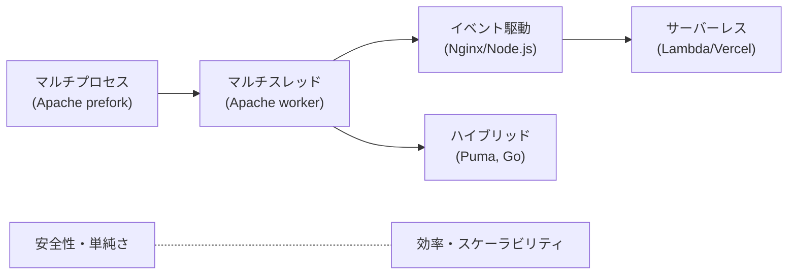

---

## 1. マルチプロセスモデル

### Apache prefork MPM

リクエストごとに独立したプロセスで処理する、最も古典的なモデル。

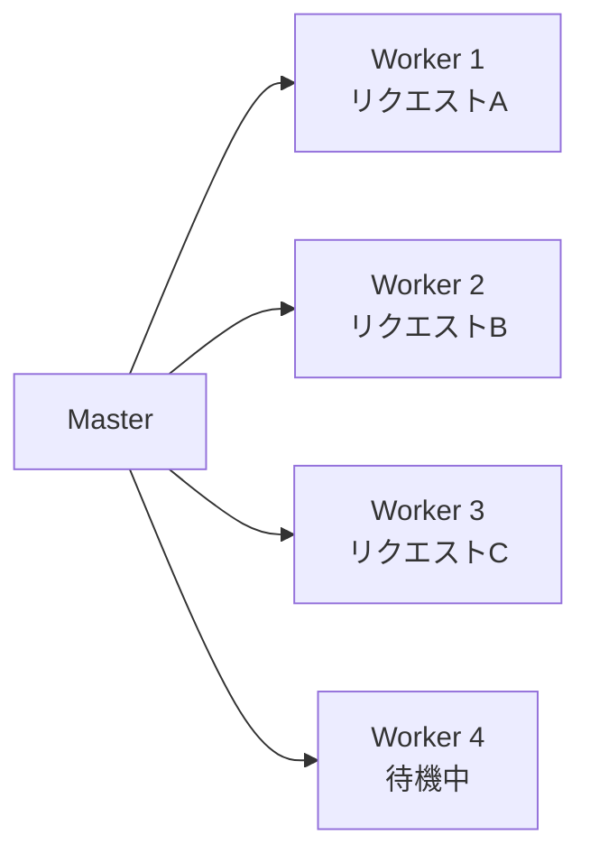

> 各プロセスは独立したメモリ空間を持つ

**仕組み:**
- Master プロセスがリクエストを受け付け、事前に fork しておいた Worker プロセスに振り分ける
- 各 Worker は1リクエストを処理し、完了したら次のリクエストを待つ
- プロセス間でメモリを共有しない（Shared Nothing）

**メリット:**
- 1つの Worker がクラッシュしても他に影響しない
- [[ロック]]や[[デッドロック]]を考慮する必要がほぼない
- mod_php のようにスレッドセーフでないモジュールも安全に動作する

**デメリット:**
- プロセスあたり数十MBのメモリを消費（1000同時接続 = 数十GBのメモリ）
- プロセス生成・コンテキストスイッチのコストが高い

```apache
# Apache prefork MPM の設定例
<IfModule mpm_prefork_module>
    StartServers          5     # 起動時のプロセス数
    MinSpareServers       5     # 待機プロセスの最小数
    MaxSpareServers      10     # 待機プロセスの最大数
    MaxRequestWorkers   150     # 最大同時リクエスト数（= 最大プロセス数）
    MaxConnectionsPerChild 0    # プロセスが処理するリクエスト数の上限（0=無制限）
</IfModule>
```

### PHP-FPM

Apache prefork と同じマルチプロセスモデルだが、Nginx と組み合わせて使うのが現代の標準構成。

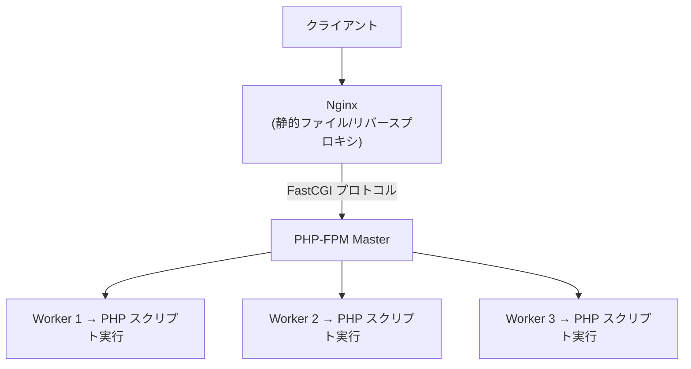

Nginx が静的ファイルやコネクション管理を高効率に処理し、PHP のビジネスロジック部分だけを PHP-FPM に委譲する。この分業により、純粋な prefork モデルよりはるかに効率がよい。

```ini
; php-fpm.conf
[www]
pm = dynamic
pm.max_children = 50          ; 最大プロセス数
pm.start_servers = 5
pm.min_spare_servers = 5
pm.max_spare_servers = 35
pm.max_requests = 500         ; メモリリーク対策: 500リクエストでプロセス再生成

; メモリ試算: 1プロセス約40MB × 50 = 約2GB
```

---

## 2. マルチスレッドモデル

### Apache worker MPM

プロセスの中に複数のスレッドを作り、スレッド単位でリクエストを処理する。

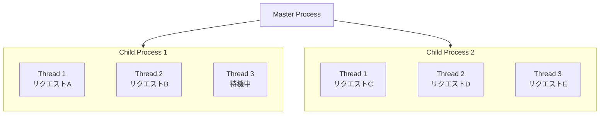

prefork と比べてメモリ効率が良い（スレッドはプロセス内のメモリを共有するため）。ただし、スレッドセーフでないモジュールは使えない。

### Java (Tomcat / Spring Boot)

Java の Web サーバーは伝統的にスレッドプールモデルを採用してきた。

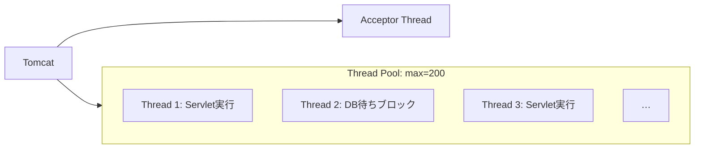

```java
// Spring Boot の組み込み Tomcat 設定
// application.yml
// server:
//   tomcat:
//     threads:
//       max: 200       # 最大スレッド数
//       min-spare: 10  # 最小待機スレッド数
//     max-connections: 8192
//     accept-count: 100  # 全スレッド使用時のキュー長

// 従来型: 1リクエスト = 1スレッド（ブロッキング）
@RestController
public class UserController {
    @GetMapping("/users/{id}")
    public User getUser(@PathVariable Long id) {
        // このスレッドはDB応答を待つ間ブロックされる
        return userRepository.findById(id).orElseThrow();
    }
}
```

**課題:** DB問い合わせやAPI呼び出しの待ち時間中、スレッドが何もせずブロックされる。200スレッドが全てI/O待ちなら、201番目のリクエストは待たされる。

**Java 21 Virtual Threads による進化:**

```java
// Virtual Threads（Java 21+）— 軽量スレッドで大量の並行処理
// application.yml
// spring:
//   threads:
//     virtual:
//       enabled: true  # これだけで Virtual Threads が有効化

// 内部の仕組み:
// - OS スレッド（キャリアスレッド）の上に数百万の Virtual Thread を多重化
// - I/O ブロック時に自動で別の Virtual Thread に切り替え
// - Go の Goroutine と同じ発想
```

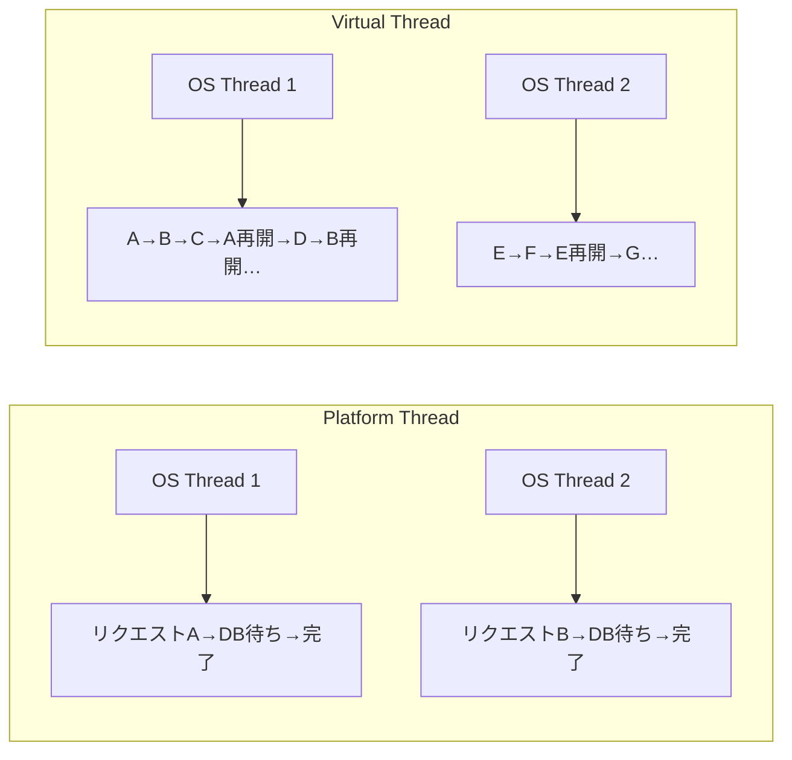

> **Platform Thread:** 200リクエスト = 200 OS スレッド必要 / **Virtual Thread:** 数千リクエストを数個の OS スレッドで処理

---

## 3. イベント駆動モデル

### Nginx

Nginx は Apache の「C10K問題」（同時1万接続を処理できない）を解決するために設計された。

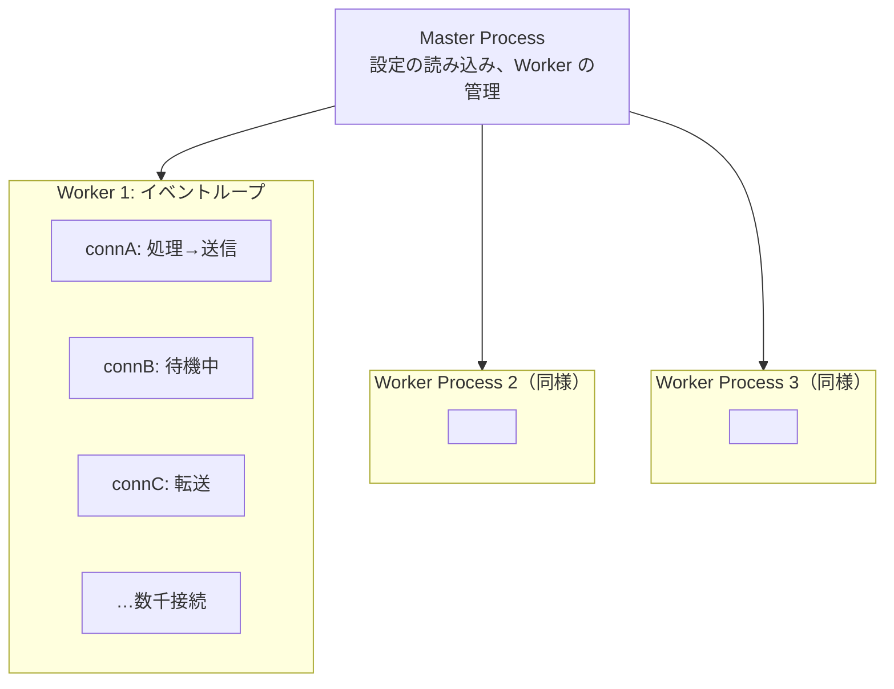

**仕組み:**
- Worker プロセスはCPUコア数分だけ起動する（通常 `worker_processes auto;`）
- 各 Worker 内はシングルスレッドのイベントループ
- I/O をノンブロッキングで行い、OS の epoll (Linux) / kqueue (BSD) でイベントを監視
- リクエスト処理中にI/O待ちが発生しても、スレッドはブロックされず他のリクエストを処理し続ける

```nginx
# nginx.conf
worker_processes auto;          # CPUコア数分の Worker を起動
worker_connections 1024;        # 1 Worker あたりの最大接続数

# 4コアなら 4 × 1024 = 4096 同時接続が可能
# Apache prefork の 150 プロセスとは桁が違う
```

**Nginx vs Apache の本質的な違い:**

| 観点 | Apache prefork | Nginx |
|------|---------------|-------|
| 接続あたりのコスト | プロセス1つ（数十MB） | イベントループのエントリ1つ（数KB） |
| 1万同時接続時のメモリ | 約100GB（現実的に不可能） | 約数十MB |
| CPUバウンドな処理 | 各プロセスで並列実行可 | Worker 内でブロックすると全接続に影響 |
| 用途 | 動的コンテンツ処理 | リバースプロキシ、静的ファイル配信 |

### Node.js

Nginx と同じイベント駆動モデルを、アプリケーション実行まで含めて実現する。

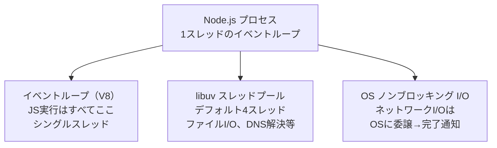

```javascript
// Node.js のイベントループの本質
// 1つのスレッドで複数のリクエストを「交互に」処理する
import http from 'node:http';

const server = http.createServer(async (req, res) => {
  // DB 問い合わせ中、このスレッドは「待たない」
  // → イベントループが他のリクエストを処理する
  const user = await db.query('SELECT * FROM users WHERE id = ?', [req.params.id]);
  res.end(JSON.stringify(user));
});

server.listen(3000);
// → 1プロセスで数千の同時リクエストを処理可能
```

**落とし穴: CPUバウンドな処理がイベントループをブロックする**

```javascript
// NG: イベントループを数秒間ブロックし、全リクエストが停止する
app.get('/hash', (req, res) => {
  const hash = crypto.pbkdf2Sync(password, salt, 1000000, 64, 'sha512');
  res.send(hash);
});

// OK: Worker Thread に逃がす
import { Worker } from 'node:worker_threads';

app.get('/hash', (req, res) => {
  const worker = new Worker('./hash-worker.js', { workerData: { password, salt } });
  worker.on('message', (hash) => res.send(hash));
});
```

---

## 4. ハイブリッドモデル

### Puma (Ruby)

マルチプロセス × マルチスレッドのハイブリッドで、Ruby の GVL（Global VM Lock）制約を克服する。

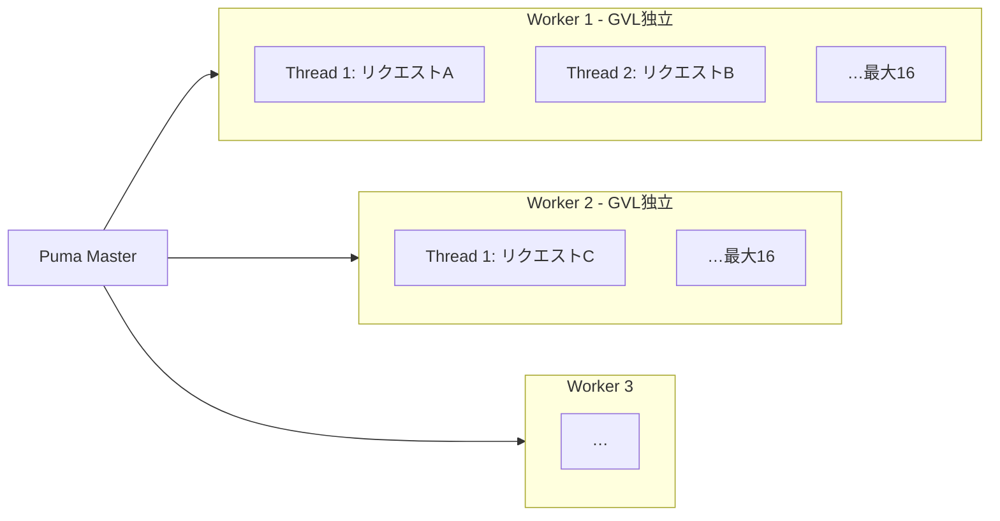

```ruby
# config/puma.rb
workers 4           # プロセス数（CPUコア数に合わせる）
threads 5, 16       # スレッド数（min, max）

preload_app!        # CoW を活用してメモリ節約
                    # fork 前にアプリを読み込み、各 Worker でメモリページを共有

on_worker_boot do
  ActiveRecord::Base.establish_connection  # DB接続はプロセスごとに作り直す
end
```

**なぜハイブリッドか:**
- プロセス間は独立した GVL → CPUバウンド処理の並列化
- プロセス内はマルチスレッド → I/Oバウンド処理の並行化（I/O待ち中はGVL解放）
- 詳細は [[シングルコア・マルチコアとスレッドモデル]] の Ruby セクションを参照

### Go (net/http)

Go は言語レベルでハイブリッドモデルを実現する。開発者はプロセスやスレッドを意識する必要がない。

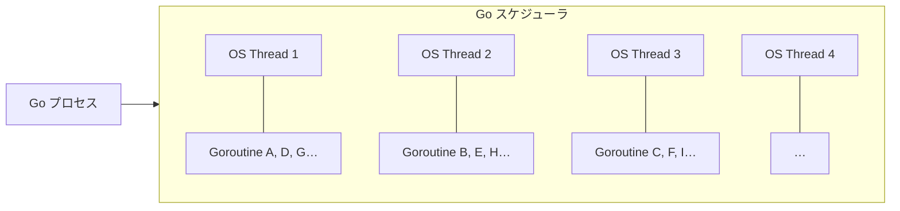

```go
package main

import (
    "fmt"
    "net/http"
)

func handler(w http.ResponseWriter, r *http.Request) {
    // この関数は Goroutine 上で実行される
    // I/O待ちでブロックしても、ランタイムが自動的に別の Goroutine を実行
    // → 開発者は同期的なコードを書くだけでよい
    user, err := db.Query("SELECT * FROM users WHERE id = ?", r.URL.Query().Get("id"))
    if err != nil {
        http.Error(w, err.Error(), 500)
        return
    }
    fmt.Fprintf(w, "User: %v", user)
}

func main() {
    http.HandleFunc("/user", handler)
    // 内部的に: 接続ごとに Goroutine を生成
    // 10万同時接続でも OS スレッドはCPUコア数分だけ
    http.ListenAndServe(":8080", nil)
}
```

**Go の net/http が優れている点:**
- 1 Goroutine ≒ 2KB（スレッドの1/1000以下のメモリ）
- 数十万の Goroutine を同時実行可能
- I/O 待ちの Goroutine は自動的にパーキングされ、OS スレッドを解放
- 開発者は同期的なコードを書くだけで、ランタイムが並行性を管理

### Rust (Tokio / Actix Web)

Rust は async/await とランタイム（Tokio）で、Go に近いモデルをゼロコスト抽象化で実現する。

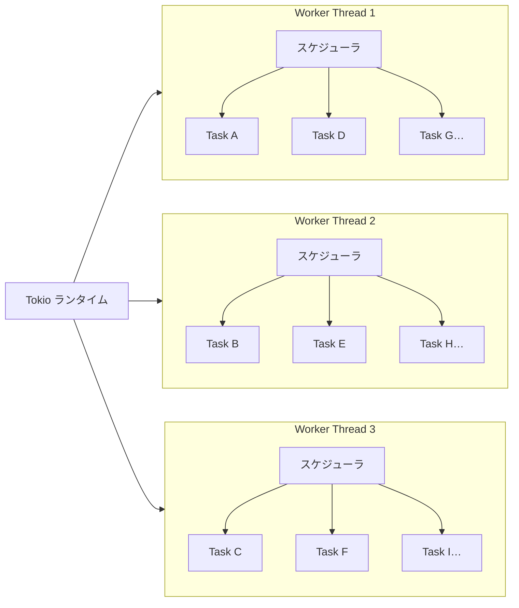

```rust
use actix_web::{web, App, HttpServer, HttpResponse};

async fn get_user(path: web::Path<u32>) -> HttpResponse {
    // await 中は Worker Thread が他のタスクを実行
    let user = db::find_user(path.into_inner()).await;
    HttpResponse::Ok().json(user)
}

#[actix_web::main]
async fn main() -> std::io::Result<()> {
    HttpServer::new(|| {
        App::new().route("/users/{id}", web::get().to(get_user))
    })
    .workers(num_cpus::get())  // CPUコア数分の Worker スレッド
    .bind("0.0.0.0:8080")?
    .run()
    .await
}
```

**Rust の特徴:**
- コンパイル時にデータ競合を検出（所有権システム）→ [[ロック]]の誤用が原理的に起きない
- async Task は Future ベースで、ランタイムオーバーヘッドがほぼゼロ
- メモリ安全性と高パフォーマンスを両立

---

## 5. サーバーレスモデル

### AWS Lambda

「サーバーを管理しない」のではなく、**リクエスト単位でプロセスのライフサイクルをクラウドが管理する**モデル。

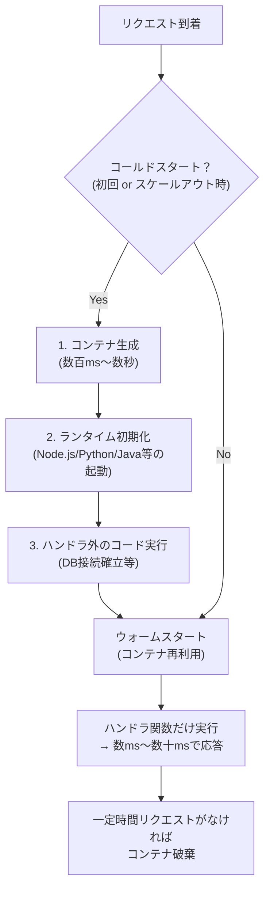

```javascript
// AWS Lambda ハンドラ (Node.js)

// ハンドラ外 → コールドスタート時に1回だけ実行される
// DB接続はここで確立し、ウォームスタート時に再利用
import { DynamoDBClient } from '@aws-sdk/client-dynamodb';
const client = new DynamoDBClient({});

// ハンドラ → リクエストごとに実行される
export const handler = async (event) => {
  const userId = event.pathParameters.id;
  const result = await client.send(/* ... */);
  return {
    statusCode: 200,
    body: JSON.stringify(result.Item),
  };
};
```

**従来モデルとの本質的な違い:**

| 観点 | 従来のサーバー | Lambda |
|------|--------------|--------|
| スケーリング単位 | サーバー/プロセス | 関数呼び出し |
| 同時実行の管理 | 自分で設定 | AWSが自動管理（デフォルト上限1000） |
| 課金単位 | 時間（起動している間） | 実行回数 × 実行時間 |
| コールドスタート | なし | あり（Java: 数秒、Node.js: 数百ms） |
| 常駐プロセス | あり | なし（リクエスト間で状態を持てない） |

**コールドスタート対策:**
- ランタイム選択: Node.js / Python は起動が速い、Java は遅い（ただし GraalVM Native Image で改善可能）
- Provisioned Concurrency: 事前にコンテナをウォームアップしておく（追加コスト）
- 関数のバンドルサイズを小さく保つ

### Vercel (Edge Functions / Serverless Functions)

Vercel は Lambda の上に**フロントエンド開発者向けの抽象化**を構築したプラットフォーム。

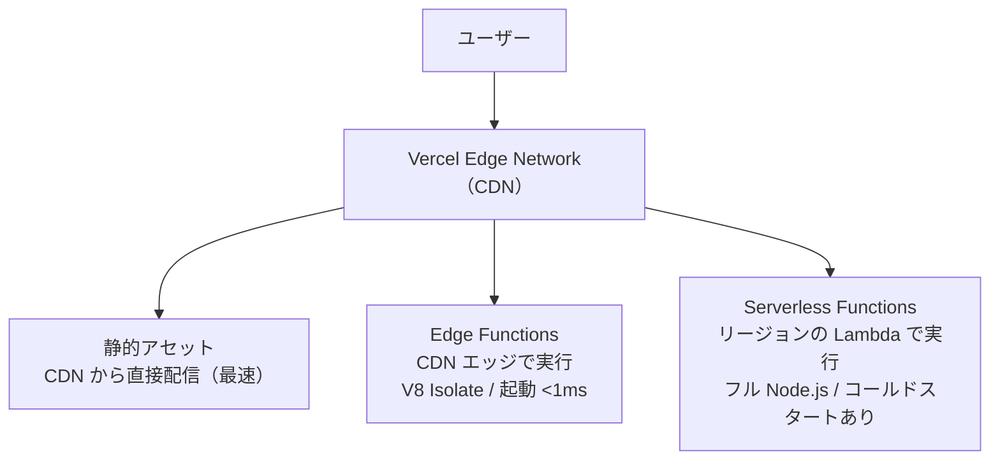

```typescript
// Vercel Edge Function (middleware.ts)
// → CDN エッジで実行、コールドスタートほぼなし
import { NextResponse } from 'next/server';
import type { NextRequest } from 'next/server';

export function middleware(request: NextRequest) {
  // 地理情報に基づくルーティング、認証チェックなど
  // 全リクエストで実行しても十分高速
  const country = request.geo?.country;
  if (country === 'JP') {
    return NextResponse.rewrite(new URL('/ja', request.url));
  }
  return NextResponse.next();
}

export const config = { matcher: '/' };
```

```typescript
// Vercel Serverless Function (app/api/users/route.ts)
// → リージョンの Lambda 上で実行
import { NextResponse } from 'next/server';

export async function GET(request: Request) {
  // フル Node.js 環境 — DB接続やファイルI/O可能
  const users = await prisma.user.findMany();
  return NextResponse.json(users);
}
```

**Edge Functions vs Serverless Functions:**

| 観点 | Edge Functions | Serverless Functions |
|------|---------------|---------------------|
| 実行場所 | CDN エッジ（ユーザーに近い） | 特定リージョン |
| ランタイム | V8 Isolate（Web API ベース） | フル Node.js |
| コールドスタート | ほぼなし（<1ms） | あり（数百ms〜） |
| 実行時間制限 | 短い（Hobby: 25秒） | 長い（Hobby: 60秒） |
| 用途 | ルーティング、認証、A/Bテスト | DB操作、重いビジネスロジック |

---

## モデル比較の総まとめ

| モデル | 代表例 | 同時接続の上限要因 | メモリ効率 | 開発の容易さ | 適するワークロード |
|--------|--------|-------------------|-----------|------------|-------------------|
| マルチプロセス | Apache prefork, PHP-FPM | プロセス数 × メモリ | 低 | 高（共有状態なし） | 従来型Webアプリ |
| マルチスレッド | Java Tomcat (従来) | スレッドプールサイズ | 中 | 中（スレッドセーフ必要） | エンタープライズ |
| イベント駆動 | Nginx, Node.js | FD数、イベントループの処理能力 | 高 | 中（非同期の理解必要） | I/Oバウンド、リアルタイム |
| ハイブリッド | Go, Puma, Java 21+ | Goroutine/VT数（実質無制限） | 高 | 高（同期的に書ける） | 汎用 |
| サーバーレス | Lambda, Vercel | 同時実行数の上限設定 | -（管理不要） | 高（インフラ不要） | イベント駆動、変動負荷 |

## 選定の指針

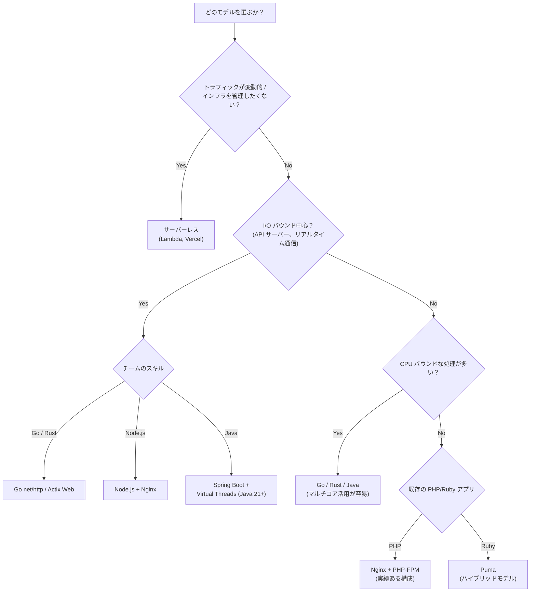

## 落とし穴

### 1. 「Nginx は速い、Apache は遅い」という短絡

Nginx が高速なのは**静的ファイル配信とリバースプロキシ**においてであり、動的コンテンツの処理自体は行わない。PHP の処理速度は Nginx でも Apache でも同じ — 変わるのはコネクション管理の効率。現代では Nginx + PHP-FPM が標準構成だが、Apache が明確に劣るわけではない。

### 2. サーバーレスの「無限スケール」神話

Lambda は同時実行数に上限がある（デフォルト1000）。急激なスパイクでは上限に達してスロットリングされる。また、RDBとの接続数問題（Lambda 1000個 × DB接続 = 1000コネクション）は深刻で、RDS Proxy のような接続プーリング層が必要になる。

### 3. 「Go / Rust なら何でも速い」

言語の理論上のパフォーマンスとアプリケーション全体のスループットは別。ボトルネックがDBやネットワークI/Oにある場合（大半のWebアプリ）、言語の実行速度は誤差になる。言語選定はチームのスキル・エコシステム・開発速度も含めて判断すべき。

## 参考リソース

- Nginx 公式「Inside NGINX: How We Designed for Performance & Scale」
- *Systems Performance* — Brendan Gregg（OS レベルのパフォーマンス分析）
- AWS Lambda 公式「Lambda execution environment」— コールドスタートの仕組み
- Vercel 公式「Edge Functions vs Serverless Functions」
- Go 公式ブログ「Go's work-stealing scheduler」— Goroutine のスケジューリング
