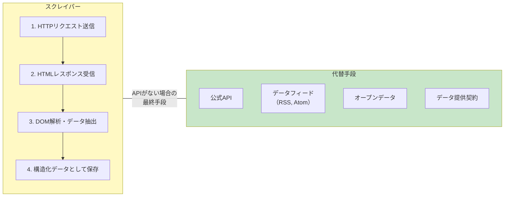
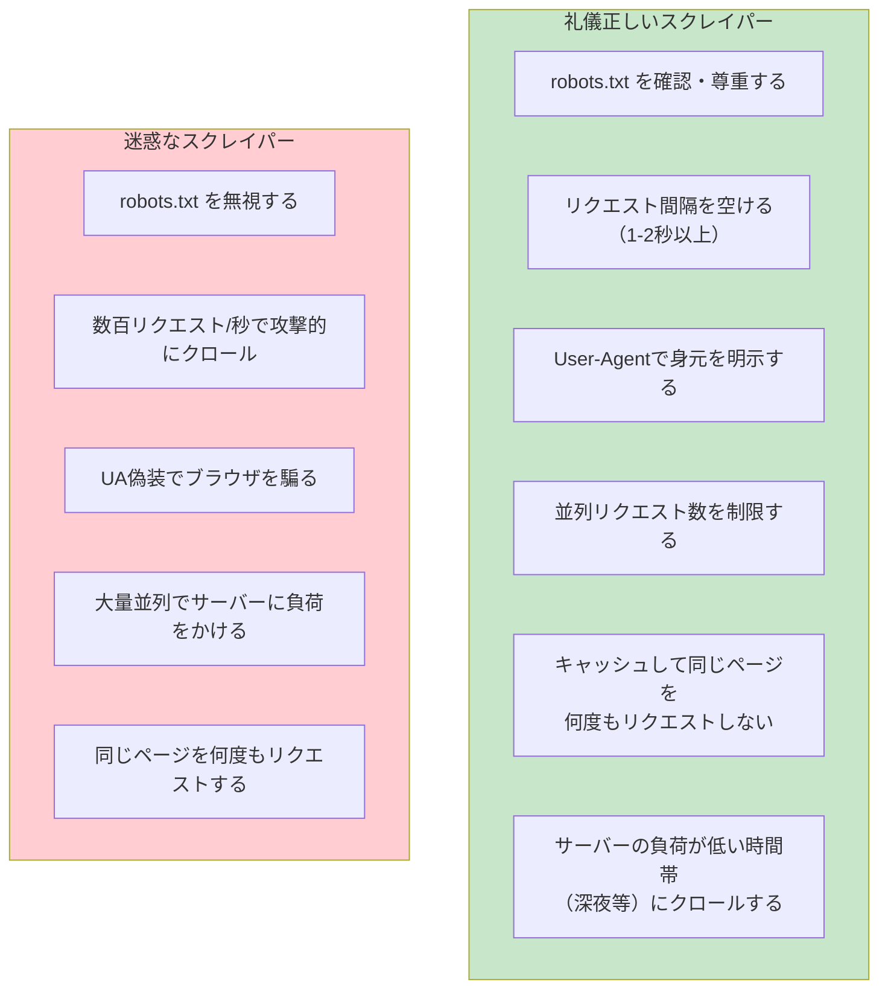
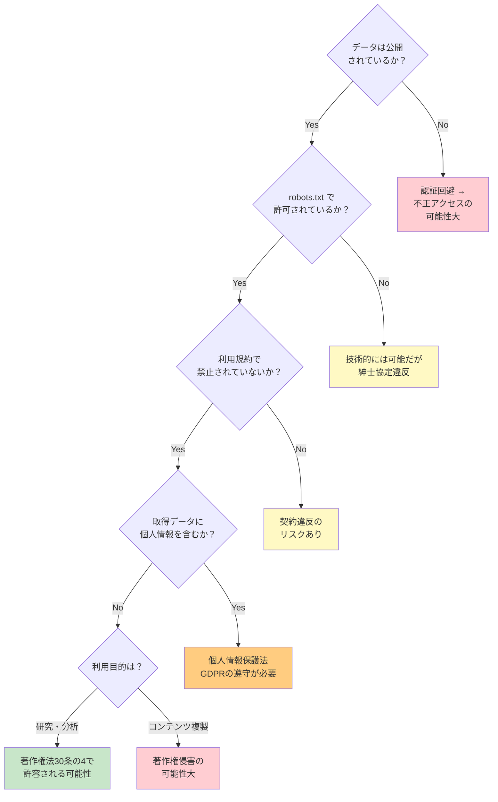

# Webスクレイピング（Web Scraping）

> **一言で言うと:** WebスクレイピングはHTTPリクエストでWebページを取得し、HTMLを解析して構造化データを抽出する技術。正当な用途（価格比較、学術研究、公開データ収集）と問題のある用途（コンテンツの無断複製、利用規約違反）の境界はHTTPの仕組みではなく法と倫理で決まる。

## スクレイピングとは何か

スクレイピングの本質は「人間がブラウザで行う操作をプログラムで自動化する」ことである。技術的にはHTTP GETリクエストを送信してHTMLレスポンスを受け取り、DOMを解析して必要なデータを抽出する — HTTPの仕組みそのものの応用に過ぎない。



**スクレイピングは最終手段である。** 公式APIやデータフィードが提供されている場合は、それを使うべきである。APIは構造化されたデータを返し、レート制限や認証のルールが明確で、サイト構造の変更に影響されない。

## スクレイピングの目的 — 正当な用途と問題のある用途

| カテゴリ | 具体例 | 正当性の判断ポイント |
|---------|--------|-------------------|
| **価格比較・市場調査** | ECサイトの価格モニタリング、不動産データの収集 | 公開データかつ利用規約に違反しなければ一般的に許容 |
| **学術研究** | SNSの投稿分析、言語コーパスの構築 | 研究目的は著作権法で保護される場合が多い（日本: 著作権法30条の4） |
| **検索エンジン** | Google、Bingのインデックス構築 | robots.txt を尊重する相互利益モデル |
| **AIの学習データ収集** | [[User-Agentと生成AIクローラー|GPTBot, ClaudeBot]] によるクロール | robots.txt での制御が可能だが、オプトアウトモデルへの批判がある |
| **SEOモニタリング** | 自社サイトの検索順位・被リンク調査 | 自社データの監視は正当。競合分析は利用規約次第 |
| **アーカイブ** | Internet Archive（Wayback Machine）によるWeb保存 | 公益目的として広く受容されている |
| **コンテンツの無断複製** | 記事のコピーサイト、画像の無断転載 | 著作権侵害。明確に違法 |
| **チケット・限定品の自動購入** | 転売目的のbot購入 | 多くの国で法規制あり（日本: チケット不正転売禁止法） |
| **個人情報の大量収集** | SNSプロフィールの一括取得 | プライバシー法（GDPR, 個人情報保護法）に抵触する可能性 |

## スクレイピングの技術的手法

### 手法の比較

| 手法 | 仕組み | JavaScript対応 | 速度 | 検出されやすさ |
|------|--------|--------------|------|--------------|
| **HTTPクライアント + HTMLパーサー** | HTTP GET → HTML解析 | ❌ | 非常に速い | 中〜高（UAは偽装可能だがTLSフィンガープリント等では検出される） |
| **ヘッドレスブラウザ** | 実ブラウザエンジンで描画 | ✅ | 遅い（DOM構築+JS実行） | 中（WebDriver検出あり） |
| **API直接呼び出し** | サイト内部のJSON APIを叩く | — | 速い | 低 |
| **RSS / Atomフィード** | サイト提供のフィードを取得 | — | 速い | なし（公式手段） |
| **ブラウザ拡張** | ユーザーのブラウザ内で動作 | ✅ | ユーザー操作速度 | なし（通常のアクセス） |

### 手法1: HTTPクライアント + HTMLパーサー

最も基本的なアプローチ。静的HTMLを解析する。

```python
import requests
from bs4 import BeautifulSoup

response = requests.get(
    'https://example.com/products',
    headers={'User-Agent': 'MyBot/1.0 (+https://example.com/bot)'},
    timeout=10,
)
response.raise_for_status()

soup = BeautifulSoup(response.text, 'html.parser')

# CSSセレクタでデータを抽出
products = []
for item in soup.select('.product-card'):
    products.append({
        'name': item.select_one('.product-name').get_text(strip=True),
        'price': item.select_one('.price').get_text(strip=True),
        'url': item.select_one('a')['href'],
    })
```

```typescript
// Node.js: cheerio（サーバーサイドjQuery）
import * as cheerio from 'cheerio';

const response = await fetch('https://example.com/products', {
  headers: { 'User-Agent': 'MyBot/1.0 (+https://example.com/bot)' },
});
const html = await response.text();
const $ = cheerio.load(html);

const products = $('.product-card').map((_, el) => ({
  name: $(el).find('.product-name').text().trim(),
  price: $(el).find('.price').text().trim(),
  url: $(el).find('a').attr('href'),
})).get();
```

**限界:** JavaScriptで動的にレンダリングされるSPA（Single Page Application）では、HTMLソースにデータが含まれないため使えない。

### 手法2: ヘッドレスブラウザ

Puppeteer や Playwright で実際のブラウザエンジンを制御し、JavaScriptの実行後にDOMを取得する。

```typescript
import { chromium } from 'playwright';

const browser = await chromium.launch();
const page = await browser.newPage();

await page.goto('https://example.com/products', {
  waitUntil: 'networkidle',
});

// JavaScript で描画された後の DOM から抽出
const products = await page.$$eval('.product-card', (cards) =>
  cards.map((card) => ({
    name: card.querySelector('.product-name')?.textContent?.trim(),
    price: card.querySelector('.price')?.textContent?.trim(),
  }))
);

await browser.close();
```

```python
from playwright.sync_api import sync_playwright

with sync_playwright() as p:
    browser = p.chromium.launch()
    page = browser.new_page()
    page.goto('https://example.com/products', wait_until='networkidle')

    products = page.eval_on_selector_all(
        '.product-card',
        '''cards => cards.map(card => ({
            name: card.querySelector('.product-name')?.textContent?.trim(),
            price: card.querySelector('.price')?.textContent?.trim(),
        }))'''
    )
    browser.close()
```

### 手法3: 内部APIの直接呼び出し

多くのSPAは内部的にJSON APIを呼び出してデータを取得している。ブラウザのDevTools（Network タブ）でAPIのエンドポイントを特定し、直接呼び出す方が効率的。

```python
import requests

# DevToolsのNetworkタブで発見したAPIエンドポイント
response = requests.get(
    'https://example.com/api/v1/products',
    params={'page': 1, 'limit': 50},
    headers={
        'Accept': 'application/json',
        'User-Agent': 'MyBot/1.0',
    },
    timeout=10,
)

data = response.json()
for product in data['items']:
    print(f"{product['name']}: {product['price']}")
```

この方法はHTML解析が不要で、構造化されたデータを直接取得できる。ただし内部APIは予告なく変更されることがあり、公式APIではないため利用規約に注意が必要。

## 礼儀正しいスクレイピング — Polite Scraping

正当な目的でスクレイピングを行う場合でも、サイトに過度な負荷をかけないための作法がある。



### robots.txt の確認

```python
from urllib.robotparser import RobotFileParser

rp = RobotFileParser()
rp.set_url('https://example.com/robots.txt')
rp.read()

# クロール可能かチェック
url = 'https://example.com/products'
if rp.can_fetch('MyBot/1.0', url):
    print(f'クロール可能: {url}')
else:
    print(f'クロール禁止: {url}')

# Crawl-Delay ディレクティブの取得
delay = rp.crawl_delay('MyBot/1.0')
print(f'推奨間隔: {delay}秒')
```

### リクエスト間隔の制御

```python
import time
import random

urls = ['https://example.com/page/1', 'https://example.com/page/2', ...]

for url in urls:
    response = requests.get(url, headers=headers, timeout=10)
    # 処理...

    # 1〜3秒のランダムな間隔（均等な間隔はボット検出される）
    time.sleep(random.uniform(1.0, 3.0))
```

```go
package main

import (
	"math/rand"
	"net/http"
	"time"
)

func politeGet(client *http.Client, url string) (*http.Response, error) {
	req, err := http.NewRequest("GET", url, nil)
	if err != nil {
		return nil, err
	}
	req.Header.Set("User-Agent", "MyBot/1.0 (+https://example.com/bot)")

	resp, err := client.Do(req)
	if err != nil {
		return nil, err
	}

	// ランダムな間隔で待機
	delay := 1.0 + rand.Float64()*2.0
	time.Sleep(time.Duration(delay * float64(time.Second)))

	return resp, nil
}
```

## 法的・倫理的フレームワーク

スクレイピングの合法性は取得方法・データの種類・利用目的の3軸で判断される。



| 法律・判例 | 国 | 要点 |
|-----------|-----|------|
| **著作権法 第30条の4** | 日本 | 情報解析目的の著作物の利用を一定条件下で許容。ただし「著作権者の利益を不当に害する場合」は除外 |
| **不正アクセス禁止法** | 日本 | ID/パスワード等のアクセス制御機能を回避する場合に適用。公開ページへの通常のHTTPアクセスや robots.txt の無視は同法の直接的な対象外 |
| **CFAA（コンピュータ詐欺・濫用法）** | 米国 | hiQ Labs v. LinkedIn: 2021年に米最高裁が差戻し、2022年4月に第9巡回控訴裁判所が「公開データのスクレイピングはCFAA違反に当たらない」と判断 |
| **GDPR** | EU | 個人データの収集には法的根拠が必要。スクレイピングで個人情報を大量取得するとGDPR違反の可能性 |
| **チケット不正転売禁止法** | 日本 | 転売目的のbot購入を規制 |

## スクレイピング vs API vs データフィード

最終的に「データを取得する」という目的に対して、スクレイピングは選択肢の一つに過ぎない。

| 観点 | スクレイピング | 公式API | データフィード |
|------|-------------|---------|-------------|
| **データの安定性** | サイト構造変更で壊れる | バージョニングで安定 | フォーマットが安定 |
| **レート制限** | 自主規制が必要 | 明確なルールあり | なし（購読型） |
| **取得できるデータ** | 表示されているすべて | 提供されているもののみ | 配信されているもののみ |
| **認証** | 不要（公開データ） | APIキーが必要 | 不要〜認証あり |
| **サイトへの影響** | 負荷を与える | 設計された負荷範囲内 | 負荷なし |
| **合法性リスク** | 利用規約・法律に依存 | 利用規約で合意済み | 契約で合意済み |
| **保守コスト** | 高（DOM変更への追従） | 低（API仕様に準拠） | 低 |

## よくある落とし穴

### 1. CSSセレクタに強く依存して壊れやすいスクレイパーを作る

```python
# ❌ サイトのCSS変更で壊れる
price = soup.select_one('div.sc-1234abcd > span.text-lg')

# ✅ セマンティックな属性を優先する
price = soup.select_one('[data-testid="product-price"]')
price = soup.select_one('[itemprop="price"]')  # Schema.org の構造化データ
```

サイトはCSSクラス名を予告なく変更するが、`data-testid` やSchema.orgのマイクロデータは意味的に安定している。

### 2. エラーハンドリングを省略して大量リクエストが失敗する

```python
# ❌ エラー処理なし → 429（レート制限）で全体が止まる
for url in urls:
    response = requests.get(url)
    data = response.json()

# ✅ リトライとバックオフ
for url in urls:
    for attempt in range(3):
        response = requests.get(url, headers=headers, timeout=10)
        if response.status_code == 200:
            break
        if response.status_code == 429:
            retry_after = int(response.headers.get('Retry-After', 60))
            time.sleep(retry_after)
        else:
            response.raise_for_status()
```

### 3. 認証が必要なページを無断でスクレイピングする

ログインが必要なページのスクレイピングは、認証を迂回する行為として不正アクセス禁止法に抵触する可能性がある。自分のアカウントのデータをエクスポートする場合でも、利用規約でスクレイピングが禁止されていれば契約違反になりうる。

### 4. 取得したデータのライセンスを確認しない

データが公開されているからといって自由に再利用できるわけではない。クリエイティブ・コモンズ等のライセンスを確認し、利用条件に従う必要がある。

## 関連トピック

- [[HTTP-HTTPS]] — 親トピック。スクレイピングはHTTP GETリクエストの応用
- [[UA偽装とボット検出]] — スクレイパーに対するサーバー側の検出技術
- [[User-Agentと生成AIクローラー]] — AIクローラーによるスクレイピングと robots.txt 制御
- [[レート制限]] — スクレイパーの負荷から API/サイトを保護する仕組み
- [[DOMと仮想DOM]] — HTMLパーサーが解析するDOM構造の基礎

## 参考リソース

- **MDN: robots.txt** — https://developer.mozilla.org/ja/docs/Glossary/Robots.txt
- **Beautiful Soup ドキュメント** — https://www.crummy.com/software/BeautifulSoup/bs4/doc/
- **Playwright ドキュメント** — https://playwright.dev/
- **著作権法 第30条の4（e-Gov）** — https://elaws.e-gov.go.jp/document?lawid=345AC0000000048
- **RFC 9309: Robots Exclusion Protocol** — https://datatracker.ietf.org/doc/html/rfc9309
