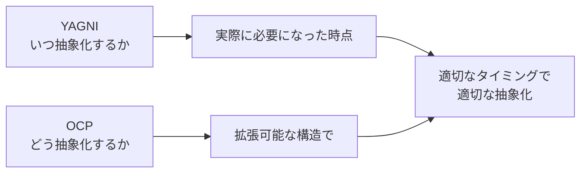

# YAGNI（You Aren't Gonna Need It）

> **一言で言うと:** 「今必要でない機能を先回りして作るな」という原則。実際に必要になった時点で実装する方が、総コストは低い。

## 概念

YAGNI は Extreme Programming（XP）から生まれた原則で、Ron Jeffries が提唱した。

> Always implement things when you actually need them, never when you just foresee that you need them.

ソフトウェア開発では「将来こうなるかもしれない」という予測に基づいて、今は不要な柔軟性・汎用性・拡張ポイントを作り込みがちである。しかし、そうした予測は大半が外れ、作り込んだコードは:

- **理解を困難にする** — 今の要件を読み解くだけでなく、存在しない要件のための抽象も理解しなければならない
- **メンテナンスコストが発生する** — 使われていなくても、テスト・レビュー・リファクタリングの対象になり続ける
- **実際の要件と噛み合わない** — 予測と実際の要件が異なると、先回りした設計がむしろ足かせになる

## 具体例

### 過剰な汎用化

```typescript
// ❌ YAGNI違反: 「将来他のデータソースに切り替えるかもしれない」
interface DataSourceAdapter<T> {
  connect(config: ConnectionConfig): Promise<void>;
  disconnect(): Promise<void>;
  find(query: Query<T>): Promise<T[]>;
  save(entity: T): Promise<T>;
  delete(id: string): Promise<void>;
}

interface ConnectionConfig {
  type: 'postgres' | 'mysql' | 'mongodb' | 'dynamodb'; // 使うのはpostgresだけ
  host: string;
  port: number;
  credentials: Credentials;
  options?: Record<string, unknown>;
}

class PostgresAdapter<T> implements DataSourceAdapter<T> {
  // 200行の実装...
}

// ✅ 今必要なものだけ
class UserRepository {
  constructor(private db: Pool) {} // PostgreSQLのコネクションプール

  async findById(id: string): Promise<User | null> {
    const result = await this.db.query(
      'SELECT * FROM users WHERE id = $1', [id]
    );
    return result.rows[0] ?? null;
  }

  async save(user: User): Promise<User> {
    const result = await this.db.query(
      'INSERT INTO users (name, email) VALUES ($1, $2) RETURNING *',
      [user.name, user.email]
    );
    return result.rows[0];
  }
}
```

上の例で `DataSourceAdapter` を作ったとして:
- MongoDB への切り替えが実際に起きる確率は低い
- 起きたとしても、インターフェースの設計が実際の要件と合わない可能性が高い
- その時点でリファクタリングした方が、正しい抽象を作れる

### 不要な設定の外部化

```typescript
// ❌ YAGNI違反: 「将来変更するかもしれない」値を全て設定ファイルに
const config = {
  pagination: {
    defaultPageSize: 20,
    maxPageSize: 100,
    pageSizeOptions: [10, 20, 50, 100],
  },
  validation: {
    nameMinLength: 2,
    nameMaxLength: 50,
    emailRegex: /^[^\s@]+@[^\s@]+\.[^\s@]+$/,
  },
  ui: {
    primaryColor: '#3B82F6',
    borderRadius: '8px',
    animationDuration: 200,
  },
};

// ✅ 定数として直接定義。変更が必要になったらその時に外部化する
const PAGE_SIZE = 20;

function validateName(name: string): boolean {
  return name.length >= 2 && name.length <= 50;
}
```

### 不要なデザインパターンの適用

```typescript
// ❌ YAGNI違反: 通知手段が1つしかないのにStrategyパターン
interface NotificationStrategy {
  send(userId: string, message: string): Promise<void>;
}
class EmailNotification implements NotificationStrategy { /* ... */ }
class NotificationService {
  constructor(private strategy: NotificationStrategy) {}
  async notify(userId: string, message: string) {
    await this.strategy.send(userId, message);
  }
}

// ✅ 通知手段が実際に増えた時点でパターンを導入する
class NotificationService {
  async sendEmail(userId: string, message: string) {
    // メール送信の実装
  }
}
```

## YAGNIとSOLID原則の緊張関係

YAGNIと[[SOLID原則]]（特にOCP: 開放閉鎖原則）は一見矛盾する:

- **OCP:** 拡張に対して開いた設計にせよ → 将来の変更に備えた抽象化を促す
- **YAGNI:** 今必要ないものを作るな → 抽象化を抑制する

この緊張は**タイミング**で解決する:

1. 最初の実装 → YAGNI に従い、最もシンプルな形で作る
2. 2つ目の類似要件 → 少し気になるが、まだ重複を許容する（Rule of Three）
3. 3つ目の類似要件 → パターンが見えたので、OCPに従って抽象化する

つまり、**OCPは「どう抽象化するか」の指針**であり、**YAGNIは「いつ抽象化するか」の指針**。両方必要。



## YAGNIが適用されない場面

YAGNIは万能ではない。以下の場面では先回りした設計が正当化される:

- **セキュリティ** — [[最小権限の原則]]や入力[[バリデーション]]は「攻撃が起きてから対処」では遅い
- **データ構造の設計** — DBスキーマの変更は後からのコストが高い。[[マイグレーション]]の手間を考慮して初期設計を慎重に行うことは正当
- **公開API** — 外部に公開したAPIの変更は後方互換性の問題を引き起こす。設計は慎重に行うべき
- **パフォーマンス要件が明確** — 「10万リクエスト/秒を処理する」等、明確な非機能要件がある場合は初期から考慮する

## 落とし穴

### 1. YAGNIを言い訳にした手抜き

YAGNIは「設計をしなくてよい」ではない。今必要な機能はシンプルかつ丁寧に実装する。エラーハンドリングの省略、テストの省略、適切な命名の省略はYAGNIではなくただの手抜き。

### 2. リファクタリング能力が前提

YAGNIは「今は作らないが、必要になったら作る」という約束を含む。後から安全にリファクタリングできる環境（テスト、[[CI-CD]]）がなければ、後で変更するコストが高すぎてYAGNIが成立しない。

### 3. チーム内の認識のずれ

ある人にとっての「将来必要になる」が、別の人にとっては「今すぐ必要」かもしれない。要件の確認なしにYAGNIを適用すると、必要な機能まで削ってしまう。

## 参考リソース

- *Extreme Programming Explained* — Kent Beck（YAGNIを含むXPプラクティスの原典）
- *Refactoring* — Martin Fowler（YAGNIの前提となる「後からの安全な変更」の技法）
- Martin Fowler "Yagni" — martinfowler.com（YAGNIの適用範囲と限界の解説）
