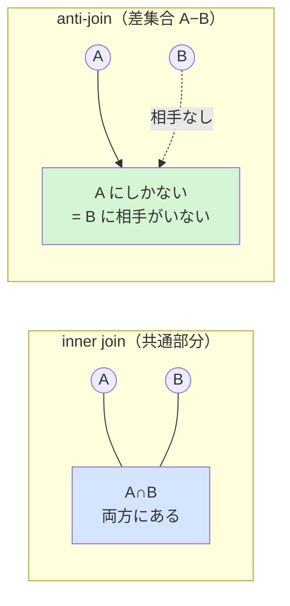
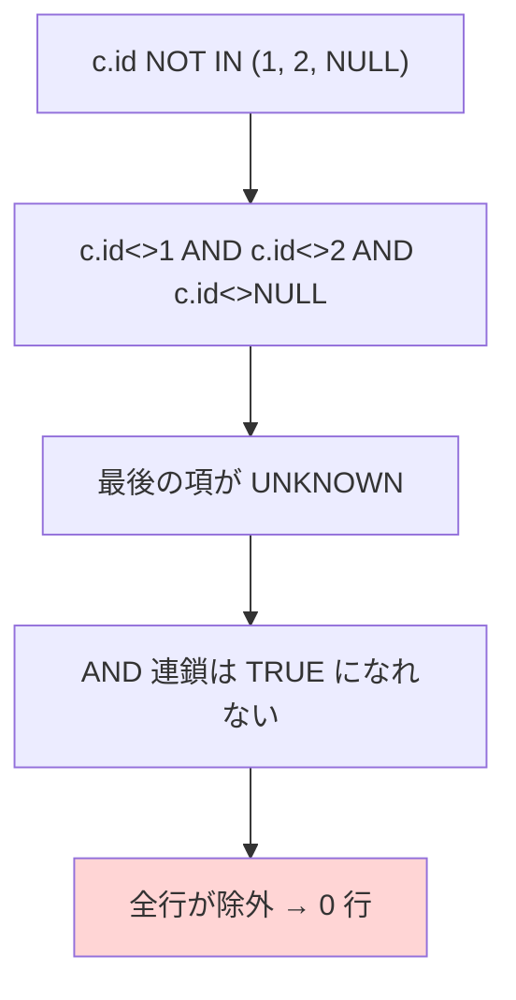

# anti-join パターン（Anti-Join / 存在しない行の抽出）

> **一言で言うと:** 「テーブル A のうち、テーブル B に**対応する行が存在しない**ものだけを取り出す」クエリ技法。`NOT IN` / `NOT EXISTS` / `LEFT JOIN ... IS NULL` / `EXCEPT` の4通りで書けるが、**NULL の扱いとプランナ最適化で結果と速度が変わる**ため、書き方の選択が品質を左右する。

## どんな問題を解くのか

実務では「**ない**ものを探す」要件が頻出する。

- 一度も注文していない顧客を抽出したい（休眠ユーザー分析・キャンペーン対象抽出）
- 親レコードが消えたのに残ってしまった**孤児レコード（orphan record）** を検出したい（データ整合性チェック）
- マスタに存在しないコードを参照している明細を洗い出したい（取り込みデータの検証）

これらは共通して「**集合 A から、集合 B と一致する分を引き算する**」操作になる。SQL の `JOIN` が「両方に存在する行をつなぐ」のに対し、その逆＝「**B に相手がいない A の行だけ残す**」のが anti-join（アンチジョイン、反結合）である。`JOIN`（正確には inner join）が共通部分（積集合）を取るのに対し、anti-join は差集合（A − B）を取ると考えると理解しやすい。



「anti-join」という単語は SQL の構文には存在しない（`ANTI JOIN` というキーワードは書けない）。**クエリプランナ（query planner、SQL を実行計画に変換する最適化エンジン）** が内部的に選ぶ結合アルゴリズムの名前であり、開発者は後述の4つの書き方を通して間接的にそれを引き出す。

## 4つの書き方

題材を固定する。`customers`（顧客）と `orders`（注文）があり、**一度も注文していない顧客**を取り出したい。

```sql
-- 前提スキーマ
CREATE TABLE customers (
    id   BIGINT GENERATED ALWAYS AS IDENTITY PRIMARY KEY,
    name VARCHAR(100) NOT NULL
);
CREATE TABLE orders (
    id          BIGINT GENERATED ALWAYS AS IDENTITY PRIMARY KEY,
    customer_id BIGINT REFERENCES customers(id),  -- あえて NULL 許容（後述の罠の再現用）
    amount      DECIMAL(10,2) NOT NULL
);
```

### ① NOT EXISTS（推奨）

```sql
SELECT c.id, c.name
FROM customers c
WHERE NOT EXISTS (
    SELECT 1 FROM orders o WHERE o.customer_id = c.id
);
```

`EXISTS` は「**相関サブクエリ（correlated subquery、外側の行ごとに評価されるサブクエリ）** が1行でも返すか」を真偽で判定する。`SELECT 1` の `1` は値に意味がなく、「行が存在するか」だけを見るための慣用句。`NOT EXISTS` はそれを反転し「相手が1行もない顧客」を残す。**後述の NULL の罠が原理的に発生しない**のが最大の利点。

### ② LEFT JOIN ... WHERE 右側 IS NULL

```sql
SELECT c.id, c.name
FROM customers c
LEFT JOIN orders o ON o.customer_id = c.id
WHERE o.id IS NULL;   -- 結合相手がいなかった行は右側が全カラム NULL になる
```

`LEFT JOIN`（左外部結合）は「左の全行を残し、相手がいなければ右側を NULL で埋める」。その**右側が NULL になった行＝相手がいなかった行**だけを `WHERE` で拾う。「いったん全部つないでから、つながらなかったものを選ぶ」という発想。`IS NULL` を当てるカラムは、**NULL になりえない右側のカラム**（主キー `o.id` など）を選ぶのがコツ。NULL 許容カラムを指定すると「値が NULL の既存行」と「相手不在」を区別できなくなる。

### ③ EXCEPT（集合演算）

```sql
-- 全顧客IDから「注文を持つ顧客ID」を引き算する
SELECT id FROM customers
EXCEPT
SELECT customer_id FROM orders;
```

`EXCEPT`（MySQL 8.0.31+ も対応、古い MySQL にはない）は集合の差を直接表現する。**重複を自動で除去**し、**NULL を「等しいもの」として扱う**（`NULL IS NOT DISTINCT FROM NULL` の意味論）ため NULL 安全。ただし返せるのは比較に使う列だけで、`name` など他のカラムも欲しいなら結果を再 JOIN する必要があり、用途は限定的。

### ④ NOT IN（罠あり・非推奨になりがち）

```sql
SELECT c.id, c.name
FROM customers c
WHERE c.id NOT IN (
    SELECT o.customer_id FROM orders o   -- customer_id に NULL が混じると全滅する
);
```

一見わかりやすいが、**サブクエリの結果に NULL が1件でも混ざると結果が 0 行になる**致命的な罠を抱える。次節で詳しく見る。

## 最大の山場 — NOT IN と NULL の三値論理

これは anti-join で**最も多くの本番障害を生む**論点である。SQL の `WHERE` は真偽が `TRUE` / `FALSE` の2値ではなく、**`TRUE` / `FALSE` / `UNKNOWN`（不明）の三値論理（three-valued logic）** で動く。NULL（値が不明・未定義）が絡む比較は、真でも偽でもなく `UNKNOWN` になる——これは [[RDB]] 本文「NOT NULL をデフォルトにする」で触れた **NULL の三値論理がバグの温床になる**話の、最も鋭利な実例である。

`x NOT IN (a, b, c)` は内部的に次の `AND` 連鎖に展開される。

```
x <> a  AND  x <> b  AND  x <> c
```

ここで `c` が `NULL` だと、`x <> NULL` は **`UNKNOWN`** になる（「不明な値と等しくないか？」は答えようがない）。`AND` は1つでも `UNKNOWN` があると全体が `TRUE` になれない:

```
TRUE  AND TRUE AND UNKNOWN  →  UNKNOWN   （行は返らない）
FALSE AND ...               →  FALSE     （行は返らない）
```

つまり **どの行も `TRUE` に到達できず、結果が一律 0 行**になる。`orders.customer_id` に NULL が1件でもあると、`NOT IN` 版だけが静かに「未注文顧客は0人です」と嘘をつく。



たちが悪いのは**エラーにならず、それらしく空を返す**点。テスト用の小さなデータでは `customer_id` が全て埋まっていて再現せず、本番でNULLが混ざった瞬間に壊れる。対して `NOT EXISTS` / `LEFT JOIN ... IS NULL` は、相手行の有無だけを見るため NULL があっても正しく動く。

> [!warning] 実務の鉄則
> サブクエリ側のカラムが `NOT NULL` 保証されていない限り、anti-join に `NOT IN (サブクエリ)` を使わない。迷ったら `NOT EXISTS`。これは「好み」ではなく**正しさ**の問題。

## 4方式の比較

| 方式 | NULL 安全性 | プランナの anti-join 変換 | 複数列キー | 他カラム取得 | 可読性 |
|---|---|---|---|---|---|
| **NOT EXISTS** | ◎ 安全 | ◎ されやすい | ◎ 容易（`AND` で並べる） | ◎ | ○ |
| **LEFT JOIN ... IS NULL** | ○ 安全（IS NULL 対象に注意） | ◎ されやすい | ○ 可 | ◎ | △ 意図が伝わりにくい |
| **EXCEPT** | ◎ 安全 | ○ 集合演算として処理 | ○ 行単位で比較 | ✗ 比較列のみ | ◎ |
| **NOT IN** | ✗ **NULL で 0 行** | △ 変換しにくい | △ 書きにくい | ◎ | ◎ |

**「プランナの anti-join 変換」** とは、SQL を実行計画に直すときに専用の高速アルゴリズム（Hash Anti Join / Merge Anti Join）に落とせるか、という意味。`NOT EXISTS` と `LEFT JOIN ... IS NULL` は PostgreSQL・MySQL とも anti-join へ変換しやすい。一方 `NOT IN` は NULL の意味論を厳密に守る必要から**プランナが anti-join に変換できず**、サブプラン（行ごとにサブクエリ結果を走査）になって遅くなりがち——正しさだけでなく速度の面でも不利。`EXPLAIN`（[[RDB]] で学んだ実行計画確認）で `Hash Anti Join` が出ているかを見れば、狙った形になっているか確認できる。

> [!info] 用語ミニ辞典
> - **三値論理（three-valued logic）:** 真偽を TRUE / FALSE / UNKNOWN の3状態で扱う論理体系。NULL を含む比較は UNKNOWN を返す。`WHERE` は UNKNOWN の行を返さない（FALSE 扱いに倒す）
> - **相関サブクエリ（correlated subquery）:** 外側クエリの各行の値（ここでは `c.id`）を参照するサブクエリ。行ごとに評価される概念だが、プランナは多くの場合まとめて anti-join に最適化する
> - **anti-join:** 「結合相手が存在しない行」を返す結合。対になる **semi-join** は「相手が1つでも存在する行」を返す（`EXISTS` / `IN` が対応）
> - **孤児レコード（orphan record）:** 参照先の親行が消えたのに残った子行。外部キー制約があれば防げるが、制約なしや論理削除運用で発生する

## インデックスの効かせ方

anti-join の速度は、**サブクエリ／結合の照合キーにインデックスがあるか**でほぼ決まる。上の例では `orders.customer_id` への [[インデックス]] が要。

```sql
-- これがないと、未注文判定のたびに orders を全件走査しがち
CREATE INDEX idx_orders_customer_id ON orders(customer_id);
```

このインデックスがあると、各顧客について「`orders` にこの `customer_id` があるか」をB-Tree探索で即判定でき、`Hash Anti Join` でも結合相手の探索が効率化される。逆に未作成だと、件数が増えた本番で `Seq Scan`（全件走査）が顔を出す。外部キー列にインデックスを張る——[[RDB]] のベストプラクティスがここでも効く。

## ORM での書き方（TypeScript / Prisma）

ORM では「anti-join をどう表現するか」が製品ごとに異なる。Prisma は `none` フィルタで「関連が1件も無い」という anti-join の**意図**を宣言的に書ける。

```typescript
// Prisma: 一度も注文していない顧客
// orders リレーションが「1件も条件に合致しない（none）」顧客を取得
const inactiveCustomers = await prisma.customer.findMany({
  where: {
    orders: { none: {} },   // none = 関連が1件も存在しない（anti-join の意図）
  },
  select: { id: true, name: true },
});
```

ただし `none` が**実際に生成する SQL**（相関サブクエリか `NOT IN` 相当か）と NULL の扱いは、Prisma のバージョンやリレーション基数（1:1 / 1:many）で挙動が変わってきた経緯がある（生成 SQL が nullable 外部キーで意図せず行を落とす不具合報告もある）。**nullable な外部キーを anti-join するときは、`$on('query')` などで生成 SQL をログ確認**し、不安なら次のように生 SQL の `NOT EXISTS` に倒すのが確実。

```typescript
// 生SQL を書く場合も NOT IN ではなく NOT EXISTS を選ぶ
const rows = await prisma.$queryRaw`
  SELECT c.id, c.name
  FROM customers c
  WHERE NOT EXISTS (
    SELECT 1 FROM orders o WHERE o.customer_id = c.id
  )
`;
```

TypeORM / Sequelize でも生 SQL を埋め込むときは同じ原則——**`NOT IN(サブクエリ)` を避け `NOT EXISTS` を使う**。ORM の `notIn` ヘルパは「静的な配列」に対しては安全だが、サブクエリ結果に対して使う場合は NULL 混入リスクが残るため、配列が DB 由来なら NULL を除いてから渡す。

## 実務での使用シーン

- **休眠顧客抽出** — `customers` から `orders`（直近N日）に出てこない顧客。マーケ施策の対象選定
- **孤児レコード検出** — 外部キー制約のないレガシーDBで、親が消えた子行を `NOT EXISTS` で洗い出す定期バッチ
- **差分取り込み** — 取り込み済みテーブルに存在しない新規行だけを抽出して INSERT（`EXCEPT` や `NOT EXISTS`）
- **マスタ不整合チェック** — 明細の参照コードがマスタに無いものを検出するデータ品質監視

## よくある落とし穴

### 1. `NOT IN (サブクエリ)` を NULL 保証なしに使う
本記事の主題。サブクエリ列に NULL が混ざると静かに0行。**`NOT EXISTS` に置き換える**のが第一選択。どうしても `NOT IN` を使うなら `WHERE o.customer_id IS NOT NULL` をサブクエリに足して NULL を除去する。

### 2. `LEFT JOIN ... IS NULL` で NULL 許容カラムを判定に使う
`WHERE o.amount IS NULL` のように**元から NULL になりうるカラム**を IS NULL 判定に使うと、「結合相手がいない行」と「相手はいるが amount が NULL の行」が混ざる。**主キーなど NOT NULL のカラム**（`o.id`）で判定する。

### 3. anti-join のつもりが重複行で水増しされる
`LEFT JOIN` 方式で、1顧客が複数注文を持つと内部的に行が膨らむ。anti-join では「相手なし＝右が全部 NULL」で1行に収束するため通常は問題ないが、条件を緩めると重複が出る。件数が合わないときは `NOT EXISTS` か `EXCEPT`（重複除去される）で書き直して照合する。

### 4. 照合キーにインデックスがなく本番で激遅
小データのテスト環境では Seq Scan でも速く、見逃される。`EXPLAIN ANALYZE` で大テーブルに `Seq Scan` が出ていないか、`Hash Anti Join` になっているかを確認する。

## AI実装のアンチパターン

| アンチパターン | なぜ問題か | レビュー観点 / 対策 |
|---|---|---|
| 「未〜の抽出」要件に反射的に `NOT IN (サブクエリ)` を生成 | サブクエリ列の NULL で結果が静かに 0 行。テストをすり抜け本番で発覚 | `NOT EXISTS` に統一。`NOT IN` を見たらサブクエリ列の NOT NULL 保証を確認 |
| `LEFT JOIN` の `IS NULL` を NULL 許容カラムに当てる | 「相手なし」と「値が NULL」が混ざり誤抽出 | NOT NULL なカラム（主キー）で判定しているかをレビュー |
| 照合キーのインデックスを張らずに anti-join を量産 | 件数増加で全件走査、レイテンシ破綻 | 外部キー／照合列に [[インデックス]]。`EXPLAIN` で計画確認 |
| 大量の `NOT IN (静的配列)` をアプリ側で巨大生成 | プレースホルダ上限超過・プラン肥大 | 一時テーブル／`VALUES` 結合 + `NOT EXISTS` に切り替え |

→ レイヤー横断のアンチパターン索引: [[_anti-patterns/_index|AIアンチパターン索引]] / [[_anti-patterns/レイヤー別/Layer3|Layer 3 アンチパターン集]]

## 関連トピック

- [[RDB]] — anti-join が前提とする JOIN・SQL の宣言的記述・NULL の三値論理（このトピックの親）
- [[インデックス]] — anti-join の照合キーに張ると全件走査を防げる
- [[正規化と非正規化の判断基準]] — 孤児レコードが生まれる背景（外部キー制約の有無）と整合性設計

## 参考リソース

- [PostgreSQL公式: Subquery Expressions（EXISTS / IN / NOT IN）](https://www.postgresql.org/docs/current/functions-subquery.html) — NULL 時の挙動が明記されている
- [Use The Index, Luke: NOT IN と NULL](https://use-the-index-luke.com/sql/where-clause/null/not-in) — `NOT IN` が NULL で破綻する仕組みの実践的解説
- **書籍**: 『SQLアンチパターン』（Bill Karwin著）— NULL の扱いと集合演算の落とし穴
