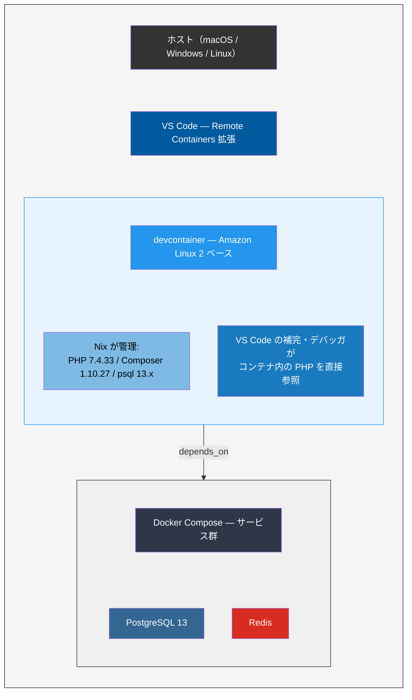
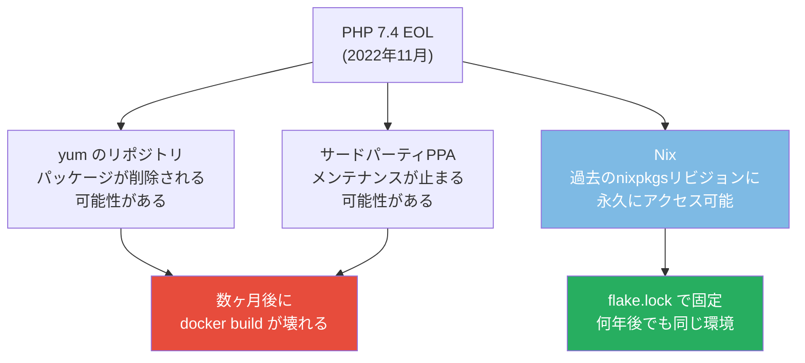

# devcontainer と Nix でレガシー環境を再現する

> **一言で言うと:** 本番が Amazon Linux 2 + PHP 7.4 + Composer 1 + PostgreSQL 13 のようなレガシー構成でも、devcontainer + Nix を組み合わせれば「チーム全員が同じ古い環境を一発で立ち上げられる」状態を作れる。本番のOSを再現するDockerと、EOLバージョンのツール群を正確に固定するNixの併用が鍵。

## この例で学べること

- devcontainer の基本的な構成方法
- Nix Flake で特定バージョン（EOL含む）のツールを固定する手法
- Docker Compose との連携でDB等のサービスを含めた完全な開発環境を構築する方法
- レガシー環境の再現における Docker 単体 vs Docker + Nix の違い

## 想定シナリオ

社内に以下の構成で動いているレガシーなWebアプリケーションがある：

| コンポーネント | バージョン | 備考 |
|-------------|----------|------|
| OS | Amazon Linux 2 | 2025年6月EOL済み |
| PHP | 7.4 | 2022年11月EOL済み |
| Composer | 1.x | Composer 2と互換性のない依存がある |
| PostgreSQL | 13 | クライアント（psql）もサーバーも13 |
| nginx | 1.22 | リバースプロキシとして使用 |

新しいメンバーがこのプロジェクトに参加するたびに「環境構築に2日かかる」「macOSにPHP 7.4が入らない」「psqlのバージョンが合わなくてマイグレーションが動かない」といった問題が発生している。

## アプローチの比較

### Docker 単体で再現する場合の課題

```dockerfile
# Dockerfile.dev（Docker単体アプローチ）
FROM amazonlinux:2

# PHP 7.4 のインストール — amazon-linux-extras は EOL 後に使えなくなる可能性
RUN amazon-linux-extras enable php7.4 && \
    yum install -y php-cli php-fpm php-pgsql php-mbstring php-xml php-zip && \
    yum clean all

# Composer 1 のインストール
RUN curl -sS https://getcomposer.org/installer | php -- --version=1.10.27 && \
    mv composer.phar /usr/local/bin/composer

# psql 13
RUN yum install -y postgresql13 && yum clean all
```

**この方法の問題点:**
- `yum install` はリポジトリの状態に依存する — EOL後にパッケージが消えるとビルドが壊れる
- ホストからコンテナ内のPHPやComposerを直接使えない — IDEの補完・静的解析が効かない
- ファイル同期のオーバーヘッド — 特にmacOSでbind mountが遅い
- コンテナ内での作業は「SSH先のサーバーで作業している」感覚に近く、開発体験が悪い

### devcontainer + Nix で再現する場合

Docker で「OS環境の隔離」を担い、Nix で「ツールのバージョン固定」を担う。



## 完全な構成例

### ディレクトリ構成

```
my-legacy-app/
├── .devcontainer/
│   ├── devcontainer.json    # devcontainer の定義
│   ├── Dockerfile           # Amazon Linux 2 + Nix
│   └── docker-compose.yml   # DB等のサービス
├── flake.nix                # Nix によるツールのバージョン固定
├── flake.lock               # 自動生成される依存ロックファイル
├── .envrc                   # direnv 用（任意）
├── composer.json
├── composer.lock
├── public/
│   └── index.php
├── src/
│   └── ...
└── ...
```

### .devcontainer/Dockerfile

```dockerfile
# Amazon Linux 2 をベースにして本番OSを再現しつつ、
# Nix をインストールしてツール管理を委譲する
FROM amazonlinux:2

# 基本的なツールとNixの前提パッケージ
RUN yum install -y \
      curl \
      git \
      tar \
      gzip \
      xz \
      shadow-utils \
      sudo \
    && yum clean all

# 開発用ユーザーの作成（rootでの作業を避ける）
RUN useradd -m -s /bin/bash developer && \
    echo "developer ALL=(ALL) NOPASSWD:ALL" >> /etc/sudoers

# Nix のインストール（マルチユーザーモード）
RUN curl --proto '=https' --tlsv1.2 -sSf -L \
      https://install.determinate.systems/nix | \
      sh -s -- install linux --no-confirm --init none

# Nix をシェルで使えるようにする
ENV PATH="/nix/var/nix/profiles/default/bin:${PATH}"

# Flake を有効化
RUN mkdir -p /etc/nix && \
    echo "experimental-features = nix-command flakes" >> /etc/nix/nix.conf

USER developer
WORKDIR /workspace
```

### .devcontainer/docker-compose.yml

```yaml
services:
  # 開発コンテナ本体
  app:
    build:
      context: .
      dockerfile: Dockerfile
    volumes:
      - ..:/workspace:cached
    command: sleep infinity
    # Nix store をボリュームに永続化（再ビルド時のダウンロード削減）
    # 初回の nix develop は時間がかかるが、2回目以降はキャッシュが効く
    tmpfs:
      - /tmp
    depends_on:
      - db

  # PostgreSQL 13 — 本番と同じバージョン
  db:
    image: postgres:13
    environment:
      POSTGRES_USER: app_user
      POSTGRES_PASSWORD: dev_password
      POSTGRES_DB: legacy_app
    ports:
      - "5432:5432"
    volumes:
      - pgdata:/var/lib/postgresql/data

volumes:
  pgdata:
```

### .devcontainer/devcontainer.json

```json
{
  "name": "Legacy PHP 7.4 App",

  // Docker Compose を使って起動
  "dockerComposeFile": "docker-compose.yml",
  "service": "app",
  "workspaceFolder": "/workspace",

  // コンテナ作成後に Nix 開発環境を構築
  "postCreateCommand": "nix develop --command echo 'Nix environment ready'",

  // VS Code の設定
  "customizations": {
    "vscode": {
      "extensions": [
        "bmewburn.vscode-intelephense-client",
        "jnoortheen.nix-ide",
        "xdebug.php-debug"
      ],
      "settings": {
        // Nix が配置する PHP のパスは nix develop 内で確認して設定
        "intelephense.environment.phpVersion": "7.4.33",
        "terminal.integrated.defaultProfile.linux": "bash"
      }
    }
  },

  // コンテナに入るたびに Nix 開発シェルを自動起動
  "postStartCommand": "nix develop",

  "remoteUser": "developer"
}
```

### flake.nix

```nix
{
  description = "Legacy PHP 7.4 + Composer 1 + PostgreSQL 13 開発環境";

  inputs = {
    # PHP 7.4 や古いパッケージを含む nixpkgs のリビジョンを指定
    # nixpkgs 23.05 には PHP 7.4 がまだ含まれている
    nixpkgs-legacy.url = "github:NixOS/nixpkgs/nixos-23.05";

    # 最新の nixpkgs（一般的なツール用）
    nixpkgs.url = "github:NixOS/nixpkgs/nixos-24.05";

    flake-utils.url = "github:numtide/flake-utils";
  };

  outputs = { self, nixpkgs, nixpkgs-legacy, flake-utils }:
    flake-utils.lib.eachDefaultSystem (system:
      let
        pkgs = nixpkgs.legacyPackages.${system};
        legacy = nixpkgs-legacy.legacyPackages.${system};
      in {
        devShells.default = pkgs.mkShell {
          packages = [
            # ---- レガシーバージョンのツール（nixpkgs-legacy から） ----
            legacy.php74                    # PHP 7.4.x
            legacy.php74Extensions.pgsql    # PostgreSQL 拡張
            legacy.php74Extensions.mbstring
            legacy.php74Extensions.xml
            legacy.php74Extensions.zip
            legacy.php74Extensions.xdebug   # デバッグ用

            # ---- Composer 1（nixpkgs-legacy から） ----
            # Composer 1 が nixpkgs にない場合は手動でフェッチ
            (pkgs.writeShellScriptBin "composer" ''
              exec ${legacy.php74}/bin/php \
                ${pkgs.fetchurl {
                  url = "https://getcomposer.org/download/1.10.27/composer.phar";
                  sha256 = "sha256-PUT_ACTUAL_HASH_HERE";
                }} "$@"
            '')

            # ---- PostgreSQL 13 クライアント ----
            legacy.postgresql_13

            # ---- 一般的な開発ツール（最新の nixpkgs から） ----
            pkgs.git
            pkgs.curl
            pkgs.jq
            pkgs.direnv
            pkgs.nix-direnv
          ];

          # 環境変数とサービス設定
          shellHook = ''
            echo "========================================="
            echo "  Legacy Development Environment"
            echo "========================================="
            echo "PHP:        $(php -v | head -1)"
            echo "Composer:   $(composer --version 2>/dev/null || echo 'available')"
            echo "psql:       $(psql --version)"
            echo "========================================="

            # DB接続情報（docker-compose の設定と一致させる）
            export DATABASE_URL="postgres://app_user:dev_password@db:5432/legacy_app"
            export PGHOST=db
            export PGUSER=app_user
            export PGPASSWORD=dev_password
            export PGDATABASE=legacy_app

            # Composer のグローバルキャッシュをプロジェクト内に
            export COMPOSER_HOME="$PWD/.composer-cache"

            # 初回の場合は composer install を実行
            if [ ! -d vendor ]; then
              echo ""
              echo "vendor/ が見つかりません。composer install を実行します..."
              composer install --no-interaction
            fi
          '';
        };
      }
    );
}
```

### 実際の使い方

```bash
# 1. VS Code でプロジェクトを開く
code my-legacy-app/

# 2. VS Code が devcontainer.json を検出し「Reopen in Container」を提案
#    → クリックするだけで環境構築が始まる

# 3. 初回は以下が自動で実行される:
#    - Amazon Linux 2 コンテナのビルド
#    - PostgreSQL 13 コンテナの起動
#    - Nix のパッケージダウンロード（初回は数分かかる）
#    - composer install

# 4. ターミナルが開くと Nix 開発シェル内にいる
$ php -v
PHP 7.4.33 (cli) ...

$ composer --version
Composer version 1.10.27

$ psql --version
psql (PostgreSQL) 13.x

# 5. そのまま開発を開始
$ php -S localhost:8080 -t public/
```

## なぜ Docker 単体ではなく Nix を併用するのか

### 問題: EOL パッケージの入手が不安定



Dockerfileの `RUN yum install php74` はリポジトリの状態に依存するため、EOL後にパッケージが消えるとビルドが再現不能になる。Nixは過去の nixpkgs リビジョンが Git で永久に保存されているため、`flake.lock` で固定したバージョンは何年後でもビルド可能。

### 問題: IDE 連携の壁

Docker 単体の場合、PHP の実行バイナリはコンテナ内にあるため、VS Code の Intelephense（PHP補完エンジン）がホストから直接参照できない。devcontainer を使えば VS Code 自体がコンテナ内で動くため、Nix が配置した PHP バイナリを直接参照でき、補完・型チェック・デバッグが完全に動作する。

## 応用: devcontainer を使わない場合（Nix + Docker Compose）

VS Code を使わないチームメンバー（Vim/JetBrains等）向けには、devcontainer なしで Nix + Docker Compose を直接使う構成も可能。

```bash
# DB だけ Docker Compose で起動
docker compose -f .devcontainer/docker-compose.yml up -d db

# ホスト上で Nix 開発シェルに入る（macOS/Linux）
nix develop

# → PHP 7.4, Composer 1, psql 13 が使える
php artisan migrate
php -S localhost:8080 -t public/
```

この場合、ホストOS上にNixがインストールされている必要があるが、Docker Desktop のオーバーヘッドなしでDBを除く全ツールがネイティブ速度で動作する。

## よくある落とし穴

### 1. flake.nix の Composer 1 のハッシュ

`pkgs.fetchurl` で外部のファイルを取得する場合、SHA256 ハッシュの指定が必須。初回は意図的に間違ったハッシュを入れてビルドし、エラーメッセージに表示される正しいハッシュをコピーするのが実務的なやり方。

```bash
# ハッシュの事前計算
nix-prefetch-url https://getcomposer.org/download/1.10.27/composer.phar
```

### 2. Nix store のキャッシュ戦略

初回の `nix develop` は nixpkgs のダウンロードとビルドで数分〜十数分かかる。devcontainer の場合、コンテナを再ビルドするたびに Nix store が消えてしまう。Named Volume で `/nix` をマウントすることでキャッシュを永続化できる。

```yaml
# docker-compose.yml に追加
services:
  app:
    volumes:
      - nix-store:/nix    # Nix store の永続化

volumes:
  nix-store:
```

### 3. PHP 拡張のバージョン一致

`php74Extensions.*` で提供される拡張モジュールは、`php74` 本体と同じ nixpkgs リビジョンから取得する必要がある。異なるリビジョンから取ると ABI 不一致でセグメンテーションフォルトが発生する。

## 関連トピック

- [[Docker]] — コンテナの基本概念。devcontainer の土台
- [[DockerとNix-Flakeによる開発環境管理]] — Docker と Nix の比較と併用パターンの全体像
- [[Linux基本操作]] — コンテナ内のデバッグに必要なコマンド知識
