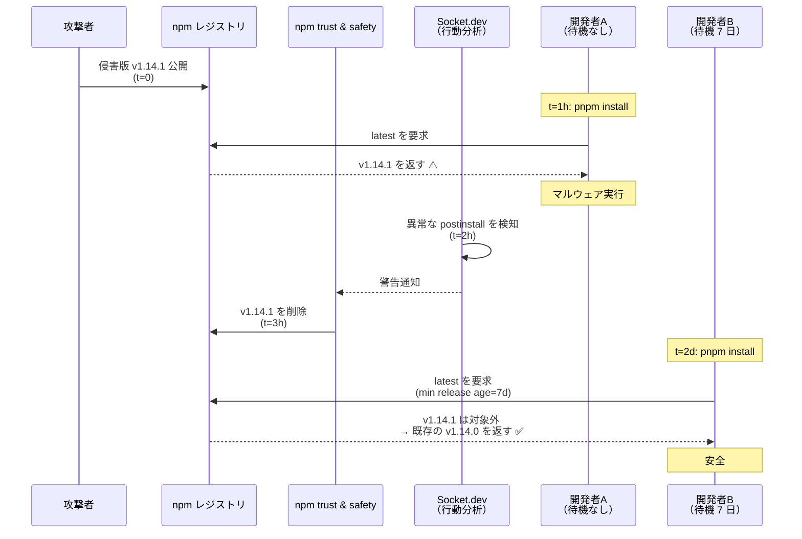
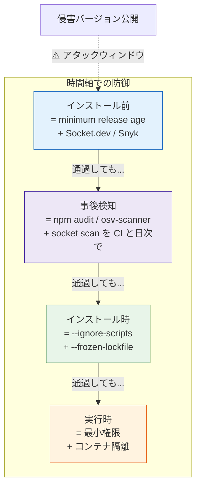

# minimum release age（パッケージ公開後の待機期間）

> **一言で言うと:** パッケージマネージャに「公開されてから N 日経っていないバージョンはインストールしない」と指示する設定。サプライチェーン攻撃のうち**侵害バージョンが公開されてから検出・削除されるまでのウィンドウ**（多くは数時間〜数日）に巻き込まれないための、近年急速に定着した防御層。pnpm が 2025 年に `minimumReleaseAge` を先行導入し、**pnpm 11.0（2026年）で 1 日が標準デフォルトに**。Bun 1.3、Yarn 4.10、npm 11.x も追随し、現在は主要パッケージマネージャすべてが何らかの形で対応している（設定名・単位は異なる — 後述）。

## なぜこの仕組みが生まれたか

[[npmサプライチェーン攻撃事例]]で見た Axios インシデントを思い出すと、**侵害バージョン v1.14.1 が公開されてから npm が削除するまで約 3 時間**だった。この 3 時間の間に CI が走った、あるいは開発者が `npm install` を打ったプロジェクトは、攻撃を受けた可能性が高い。

つまり、**マルウェア入りパッケージは「最新リリースを取りに行く」習慣そのものに付け込んでくる**。`npm install foo@latest` も `npm update`、Renovate / Dependabot の自動 PR も、「公開された瞬間にそれを取りに行く」設計になっている。

> [!info] 用語ミニ辞典
> - **アタックウィンドウ（attack window）**: 悪意あるバージョンが公開されてから、レジストリやセキュリティベンダー（npm の trust & safety、Socket.dev、Snyk など）が検知して**取り下げ・警告**するまでの時間。npm の主要事件では数十分〜数十時間に収まることがほとんど
> - **行動分析（behavioral analysis）**: パッケージ公開時に「postinstall で外部 HTTP を叩いている」「環境変数を読んでいる」など振る舞いを自動分析し、CVE 登録を待たずに警告を出すアプローチ。Socket.dev / Snyk が代表例
> - **`@latest` タグ**: npm の dist-tag のうち、`npm install foo` がバージョン省略時に解決する先。メンテナが新バージョンを公開すると（明示的に他タグを指定しない限り）即座に `latest` が動く
> - **Renovate / Dependabot**: 依存パッケージに新バージョンが出たことを検知して PR を自動作成するボット。便利だがアタックウィンドウ対策と相性が悪い

minimum release age は、この問題を **「パッケージが公開されてから N 日経つまで、そのバージョンは存在しないものとして扱う」** という単純なルールで吸収する。多くの侵害バージョンはその間に検出・削除されるため、結果として「マルウェアが流通しているバージョン」を踏みにくくなる。

## 動作原理



ポイントは **「最新であること」と「安全であること」がほぼ別物**だと割り切る点。最新リリースは実質的に未検証のリリースなので、検証期間を強制的に挟む。これは脆弱性パッチの取り込みを意図的に遅らせる行為でもあるため、後述するトレードオフの理解が必須になる。

## 各パッケージマネージャでの設定方法

各実装は **設定名・単位・デフォルト値・除外フィールド名がすべて異なる**。乗り換えやモノレポでの併用時にコピペすると壊れるので、まずこの一覧で全体像を押さえる。

| マネージャ | 設定名 | 単位 | デフォルト | 除外フィールド | 設定ファイル |
|---|---|---|---|---|---|
| **pnpm 11.0+** | `minimumReleaseAge` | **分** | **1440（1 日、ON）** | `minimumReleaseAgeExclude` | `pnpm-workspace.yaml` / `~/.config/pnpm/config.yaml` |
| **pnpm 10.x** | `minimum-release-age` | 分 | 0（OFF） | `minimum-release-age-exclude[]` | `.npmrc` |
| **npm 11.x** | `min-release-age` (CLI: `--min-release-age`) | 分 | 0（OFF） | **未実装**（v12 で予定） | `.npmrc` |
| **Bun 1.3+** | `minimumReleaseAge` | **秒** | **259200（3 日、ON）** | `minimumReleaseAgeExcludes`（**複数形**） | `bunfig.toml` `[install]` |
| **Yarn 4.10+** | `npmMinimalAgeGate` | 分 | 0（OFF） | `npmRegistries.<scope>.npmMinimalAgeGate` 等で個別 | `.yarnrc.yml` |

> [!warning]+ 単位とフィールド名が違うことに注意
> pnpm/npm/Yarn は**分**、Bun は**秒**。Bun の除外フィールドだけ末尾 `s` の**複数形**。pnpm 11.0 から `.npmrc` は auth/registry 専用になり、`minimumReleaseAge` は `pnpm-workspace.yaml` に書く（pnpm 10.x からの移行で頻発する事故）。Yarn は名前自体が違う（`npmMinimalAgeGate`）。

### pnpm（11.0+）

**pnpm 11.0 で運用方法が大きく変わった**ので、まずそこから。

- **デフォルトで `minimumReleaseAge: 1440`（1 日）が ON** — 何も設定しなくても 1 日待機が効いている。明示的に外したい場合は `0` を設定
- **`.npmrc` は auth/registry 設定専用に** — pnpm 固有設定（`minimumReleaseAge` を含む）は `pnpm-workspace.yaml` か `~/.config/pnpm/config.yaml`（新設）に書く

```yaml
# pnpm-workspace.yaml
minimumReleaseAge: 10080          # 7 日 = 60 * 24 * 7 = 10080 分
minimumReleaseAgeExclude:
  - "@my-org/*"
  - "@my-org/internal-utils"
```

```yaml
# ~/.config/pnpm/config.yaml（マシン全体のデフォルト）
minimumReleaseAge: 10080
```

`minimumReleaseAgeExclude` は glob パターンを受け付ける。社内モノレポやプライベートレジストリで管理しているパッケージは攻撃面が異なる（自分たちでパブリッシュ権限を持っている）ため、待機を強いる必要がない。

### pnpm（10.x — 移行中のチームむけ）

pnpm 10.x までは `.npmrc` のケバブケース構文で書いていた。pnpm 11.0 への移行時に削除する。

```ini
# .npmrc（pnpm 10.x のみ。pnpm 11.0 では無視される）
minimum-release-age=10080
minimum-release-age-exclude[]=@my-org/*
```

### npm（11.x）

npm 11 系で **`--min-release-age` フラグ**（ハイフン省略形）と `.npmrc` の `min-release-age` キーが追加された。

```ini
# .npmrc
min-release-age=10080            # 単位は分
```

```bash
# 一時的に CLI から指定する場合
npm install --min-release-age=10080
```

**重要な制約:** 初版実装には**除外（exclude）機構がない**。社内パッケージや緊急セキュリティパッチを優先したい場合、現状は環境変数や別の `.npmrc` で当該インストールだけ無効化するしかない（[npm/cli#8994](https://github.com/npm/cli/issues/8994) で議論中）。npm CLI v12 で除外機構と「デフォルト ON」が予定されている。

公開時刻ベースの簡易代替として、組み込み前のプロジェクトでは `npm view <pkg> time` で公開日時を取得するスクリプトを CI に組み込むワークアラウンドが使われていた。

### Bun（1.3+）

bunfig.toml の `[install]` セクションで設定。**単位が秒なので注意**（pnpm/npm/Yarn の分とは異なる）。

```toml
# bunfig.toml
[install]
minimumReleaseAge = 259200                  # 秒。259200 = 3 日（Bun 1.3 のデフォルト）
minimumReleaseAgeExcludes = ["@my-org/*"]   # 末尾 s に注意（pnpm の Exclude と異なる）
```

Bun も 1.3 から**デフォルトで 3 日待機が ON**。`minimumReleaseAge = 0` で無効化。

### Yarn（4.10+）

設定名そのものが異なる: **`npmMinimalAgeGate`**（"Minimum" ではなく "Minimal"、"Age" の後に "Gate"）。

```yaml
# .yarnrc.yml
npmMinimalAgeGate: 10080         # 分。10080 = 7 日
```

```bash
# 環境変数でも設定可能
export YARN_NPM_MINIMAL_AGE_GATE=10080
```

Yarn は per-registry / per-scope での粒度設定（`npmRegistries.*.npmMinimalAgeGate` 等）が可能で、pnpm より細かい制御ができる代わりに設定が分散しやすい。

## 推奨期間と「何日にすべきか」の考え方

明確な正解はないが、各社のセキュリティガイドラインや OpenSSF の議論を踏まえると以下のレンジに収束しつつある。

| 待機期間 | 想定環境 | 防御カバー率の体感 | デメリット |
|---|---|---|---|
| **0 日（無効）** | OSS の最新追従が必要な開発環境 | アタックウィンドウに直撃 | — |
| **1 日**（pnpm 11.0 / Bun 1.3 のデフォルト相当） | 標準デフォルト | Axios 系（数時間）の取り下げ事案はカバー | npm worm 系の長時間滞留は防げない |
| **3 日**（Bun 1.3 のデフォルト） | デフォルト + 数日マージン | 大半の取り下げ事案をカバー | パッチ反映が 3 日遅延 |
| **7 日**（コミュニティ推奨上限） | 一般的なプロダクション | 過去の主要事案はほぼ取り下げ済 | セキュリティパッチの取り込みも 7 日遅延 |
| **14〜30 日** | 金融・医療など高セキュリティ要件 | ほぼ全ての公開された侵害事例をカバー | 緊急パッチ適用は別経路で必要 |

**「1〜7 日が落としどころ」と言われる根拠**は、過去の主要 npm インシデント（event-stream, ua-parser-js, Axios, npm worm）の取り下げ所要時間がすべて 7 日以内に収まっているという経験則。pnpm 11.0 / Bun 1.3 が 1〜3 日をデフォルトに採用したのもこの経験則を踏まえた設計判断。一方で、**自分が脆弱性パッチを早く取り込みたい立場**でもあるため、「7 日後に CVE が公開された依存を 7 日 + 監査時間遅らせて取り込む」運用許容が前提になる。

## 例外設定（除外指定の運用）

待機期間を強制すると以下のケースで詰むため、例外指定は事実上必須。**除外フィールド名はマネージャごとに異なる**（pnpm: `minimumReleaseAgeExclude`、Bun: `minimumReleaseAgeExcludes`、Yarn: `npmRegistries.<scope>.npmMinimalAgeGate` 経由、npm: 未実装）。下表は「どんな観点で例外を入れるか」を整理したもの。

| 例外を入れるべきケース | 設定例 | 理由 |
|---|---|---|
| 社内モノレポの自パッケージ | `@my-org/*` | パブリッシュ権限を握っているので、自分のサプライチェーンとして扱う |
| プライベートレジストリのパッケージ | `@verdaccio/*`, `@nexus/*` 等 | 公開レジストリと信頼境界が異なる |
| 検証済みの緊急セキュリティパッチ | 都度 CLI フラグで例外（pnpm: `--ignore-minimum-release-age`、Bun: `--minimum-release-age 0`） | CVE 対応など、待ってる場合じゃない時 |
| プロトタイピング用サブディレクトリ | サブディレクトリに別の `pnpm-workspace.yaml`（pnpm 11.0+）/ 別の `bunfig.toml`（Bun）を配置 | `experiments/` 配下だけ無効化など。pnpm 10.x では別 `.npmrc` でも可 |

> [!warning] npm（11.x）には除外機構が未実装
> npm 公式実装の初版には exclude 機構がない（[npm/cli#8994](https://github.com/npm/cli/issues/8994) で議論中）。緊急パッチを入れたい場合は当該インストールだけ別 `.npmrc` で `min-release-age=0` にする運用が現状の回避策。

## よくある落とし穴

1. **新規プロジェクトの初回 install で全滅する**
   `pnpm install` を新しいマシンで実行すると、ロックファイルにあるバージョンが**設定された待機期間より新しい**ものを大量に検出してエラーになる…と思いきや、**lockfile に記録されたバージョンは公開時刻が古いことがほとんどなので普通は通る**。ただし、最新の依存追加直後に他人が clone すると当該バージョンが弾かれて詰むので、依存追加時に「設定した待機期間（例: 7 日）が経過してから lockfile をマージする」運用を決めておく必要がある

2. **`pnpm add foo` が「待機期間中は入らない」と勘違いされる**
   `minimumReleaseAge` は**バージョン解決のフィルタ**であり、新規追加できないわけではない。`pnpm add foo` は**設定された待機期間を経過しているバージョンの中の最新**を選ぶ（例: 待機期間 7 日で最新版が 5 日前なら、その 1 つ前のバージョンが選ばれる）。AI エージェントが「最新版が入らない」と勘違いして `--ignore-minimum-release-age` を提案してくることがあるが、本来は意図通りの動作

3. **CI ジョブの時刻ズレで挙動が変わる**
   `minimumReleaseAge` は「パッケージマネージャがインストール時刻と公開時刻の差を計算する」設計。CI ランナーの時刻がズレている、あるいはローカルとビルドサーバで判定タイミングが異なると lockfile に微妙な差が出る。**lockfile は明示的にコミットし、CI では `--frozen-lockfile`（pnpm）/ `npm ci` で固定する**運用と組み合わせること

4. **「待機期間を入れたから Socket.dev は不要」ではない**
   minimum release age は**確率的な防御**。npm worm のように数日〜数週間滞留した事例もあるし、攻撃者が事前にダミーパッケージを公開しておいて待機期間後に悪用した事例もある。**行動分析ツールと併用するのが前提**で、「ウィンドウを狭める」のがこの機能の役割

5. **公開時刻の判定ロジックはマネージャ間で微妙に異なる**
   各実装は npm レジストリの `time` フィールド（バージョンごとの公開時刻）を参照するが、**リパブリッシュ（同一バージョンを `npm unpublish` 後に再公開）や dist-tag の張り替えに対する扱いは実装依存**。たとえばリパブリッシュ後の「再公開時刻」を採用するマネージャと初回公開時刻を採用するマネージャがある。移行直後は `--dry-run`（pnpm）/ 該当マネージャの dry-run 相当で実際にどのバージョンが解決されるか確認するのが安全

## コード例: 段階的に厳しくする運用（pnpm 11.0 想定）

pnpm 11.0 はデフォルトで `1440`（1 日）が ON なので、**「無効から始めて段階的に厳しくする」のではなく「デフォルトを許容しつつ徐々に伸ばす」**運用になる。

```yaml
# Phase 1（導入週）: デフォルトのまま（1 日）
# pnpm-workspace.yaml
minimumReleaseAge: 1440          # 24 時間（pnpm 11.0 のデフォルト）
minimumReleaseAgeExclude:
  - "@my-org/*"

# Phase 2（2 週目以降）: 標準
minimumReleaseAge: 10080         # 7 日
minimumReleaseAgeExclude:
  - "@my-org/*"

# Phase 3（高セキュリティ要件のあるプロジェクト）
minimumReleaseAge: 20160         # 14 日
minimumReleaseAgeExclude:
  - "@my-org/*"
  - "@verified-vendor/*"
```

CI で「待機期間設定が抜けていないか・誤って小さすぎる値になっていないか」を検査するワンライナー（BSD/GNU 両対応の POSIX クラス記法）:

```bash
# pnpm-workspace.yaml の minimumReleaseAge が 100 分（最低ライン）以上で設定されているか確認
if ! grep -E "^minimumReleaseAge:[[:space:]]*[1-9][0-9]{2,}" pnpm-workspace.yaml > /dev/null; then
  echo "::error::minimumReleaseAge must be set to at least 100 minutes"
  exit 1
fi
```

`\s` は GNU grep 拡張で macOS の BSD grep では動かないため `[[:space:]]` を使う。`[1-9][0-9]{2,}` で最低 3 桁（100 以上）を要求し、`1` のような「設定したつもり」を弾く。

## AI 実装のアンチパターン

| アンチパターン | なぜ問題か | レビュー観点 / 対策 |
|---|---|---|
| AI が `--ignore-minimum-release-age` を気軽に提案 | 待機期間を無効化することは攻撃面の意図的な再開放 | 例外を使うのは「人間が必要性を判断したケース」のみ。AI には例外フラグを使わず、可能な過去バージョンへのフォールバックを提案させる |
| AI 生成の Renovate / Dependabot 設定で `automerge: true` | 待機期間と組み合わせても、待機後の自動マージは結局 `latest` 追従と同義 | `dependencyDashboardApproval: true` などで人間レビューを挟む |
| 「最新版が入らないので待機期間を `1h` に」 | 0 日近辺ではこの機能の防御効果は事実上ゼロ | 24 時間未満の設定は「設定したつもり」になるだけ |
| `minimumReleaseAgeExclude` に `*` を入れる | 全パッケージ例外 = 機能無効化 | exclude は具体的なスコープ・パッケージ名に限定 |
| 待機期間を入れたから他のサプライチェーン対策を撤去 | 多層防御の一層に過ぎない | lockfile, `--ignore-scripts`, `--frozen-lockfile`, 行動分析ツールの併用は維持 |

## 多層防御における位置付け



minimum release age は **「侵害バージョンを取りに行かない」** という、攻撃チェーンの最も上流での防御。下流の防御（postinstall ブロック、最小権限、コンテナ隔離）が完璧であれば理論上は不要だが、実際には完璧な下流防御は存在しないため、**確率的に「事故に遭遇する数」を減らす**役割を持つ。

ただし、この機能は **「公開時刻」というメタデータに依存した確率的フィルタ**でしかない。具体的に素通りしうる攻撃経路:

- **長期休眠パッケージの活性化**（npm worm 系）: 攻撃者が無害なパッケージを多数長期間公開しておき、十分熟成したものを別の攻撃用パッケージの依存に組み込む。攻撃用パッケージ自体は新鮮なのでブロックされうるが、休眠側は素通り
- **同一バージョン番号の再公開**（`unpublish` + 再 `publish`）: npm では unpublish 後 24 時間以内なら同番号で再公開が可能。**公開時刻の判定基準が「初回公開」か「最新公開」かはマネージャ実装依存**で、初回公開時刻を採用する実装ではこのバージョンは古いとみなされる
- **長く運営してきた信頼性の高いメンテナアカウントの侵害**: アカウント全体は信頼されていても、新しい侵害バージョンは新鮮なので minimum release age 自体は機能する（=これは bypass ではない）。ただし攻撃者が**待機期間より長く待つだけ**で、その間にレジストリ側の検知が間に合わなければ素通りする

**「すり抜けたものを実行前にもう一度ふるう」**ための事後検知層（`npm audit` / `osv-scanner` / `socket scan` の組み合わせ）と必ず併用する。詳細は [[依存パッケージの事後検知ツール比較]] を参照。

## 関連トピック

- [[サプライチェーンセキュリティ]] — 親トピック。多層防御全体の中での位置付け
- [[依存パッケージの事後検知ツール比較]] — 本ドキュメントの対になる事後検知層。両者の併用が前提
- [[npmサプライチェーン攻撃事例]] — Axios の 3 時間ウィンドウなど、待機期間が効く具体的シーン
- [[npmとpnpmの比較]] — pnpm が先行実装した経緯と、`minimumReleaseAge` を pnpm-workspace.yaml で管理する理由
- [[最小権限の原則]] — 「ウィンドウを狭める」「権限を絞る」は同じ防御思想の別側面
