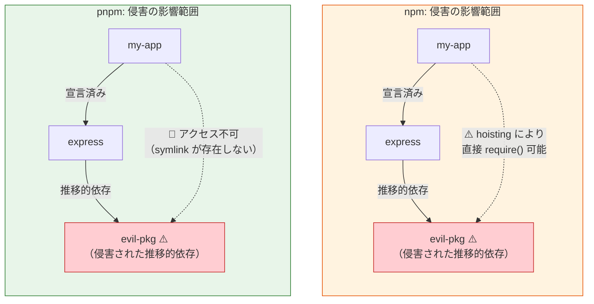

# npm と pnpm の比較（npm vs pnpm — Supply Chain Security Perspective）

> **一言で言うと:** npm と pnpm は同じ npm レジストリを利用するパッケージマネージャだが、依存解決とストレージの設計が根本的に異なる。npm の flat hoisting はファントム依存（Phantom Dependency）を生み、宣言されていないパッケージへの暗黙的なアクセスを許す。pnpm の content-addressable store と symlink ベースの厳密な `node_modules` 構造は、この問題を設計レベルで排除し、[[サプライチェーンセキュリティ]]における攻撃面を構造的に縮小する。

## なぜパッケージマネージャの選択がセキュリティに影響するか

[[サプライチェーンセキュリティ]]で解説した通り、現代の Web アプリケーションは数百〜数千の推移的依存（Transitive Dependency）を持つ。パッケージマネージャは**これらの依存をどのようにディスクに配置し、どのパッケージがどのパッケージにアクセスできるかを決定する**ソフトウェアである。

つまり、パッケージマネージャの設計は**依存間の信頼境界（Trust Boundary）をどう引くか**を決める。npm と pnpm ではこの境界の引き方が根本的に異なり、それがサプライチェーン攻撃の影響範囲に直結する。

## 依存解決の仕組み（Dependency Resolution）

### npm: フラットホイスティング（Flat Hoisting）

npm v3 以降、npm は依存ツリーを**フラット化（hoisting）**して `node_modules` の直下に配置する。これはディスク使用量の削減と重複排除が目的だが、副作用として**宣言していないパッケージに直接アクセスできてしまう**。

### pnpm: Content-Addressable Store + Symlink

pnpm はグローバルな content-addressable store（デフォルト: `~/.local/share/pnpm/store`、XDG Base Directory 準拠）にパッケージの実体を保持し、プロジェクトの `node_modules` にはシンボリックリンクで接続する。各パッケージは自身が宣言した依存にのみアクセスできる。

```mermaid
flowchart TB
    subgraph npm_structure["npm の node_modules"]
        direction TB
        NM1["node_modules/"]
        A1["├── express/"]
        B1["├── accepts/  ← express の依存だが<br/>     トップレベルに hoisting"]
        C1["├── debug/    ← 同上"]
        D1["└── ...（数百パッケージがフラットに並ぶ）"]
    end

    subgraph pnpm_structure["pnpm の node_modules"]
        direction TB
        NM2["node_modules/"]
        A2["├── express/ → .pnpm/express@4.21.0/node_modules/express"]
        P2["└── .pnpm/"]
        PA["    ├── express@4.21.0/node_modules/"]
        PB["    │   ├── express/ ← 実体（store へのハードリンク）"]
        PC["    │   ├── accepts/ → ../.pnpm/accepts@1.3.8/..."]
        PD["    │   └── debug/   → ../.pnpm/debug@2.6.9/..."]
        PE["    └── accepts@1.3.8/node_modules/"]
        PF["        └── accepts/ ← 実体（store へのハードリンク）"]
    end

    Store["~/.local/share/pnpm/store/<br/>content-addressable store<br/>（ハッシュでアドレッシング）"]

    PB -.->|ハードリンク| Store
    PF -.->|ハードリンク| Store

    style npm_structure fill:#fff3e0,stroke:#e65100
    style pnpm_structure fill:#e8f5e9,stroke:#2e7d32
    style Store fill:#e3f2fd,stroke:#1565c0
```



**pnpm の構造のポイント:**
- `node_modules/` 直下にはプロジェクトが `package.json` で宣言した直接依存のシンボリックリンクのみが配置される
- 各パッケージは `.pnpm/パッケージ名@バージョン/node_modules/` 内に隔離され、自身の依存だけがシンボリックリンクで接続される
- パッケージの実体はグローバルストアへのハードリンクであり、ディスク上に重複コピーが存在しない

## ファントム依存問題（Phantom Dependencies）

ファントム依存とは、`package.json` に宣言していないにもかかわらず、npm のホイスティングによって偶然 `require()` できてしまうパッケージのこと。

### 何が問題なのか

```javascript
// my-app/index.js
// package.json には "express" だけが dependencies にある

const express = require('express');    // ✅ 宣言済み
const debug = require('debug');        // ⚠️ ファントム依存！
// debug は express の推移的依存として node_modules/ に hoisting されている
// package.json には宣言されていないが、npm では動作する
```

```bash
# npm の場合: 動作する（debug が hoisting でトップレベルにある）
$ node -e "require('debug')"
[Function: debug]

# pnpm の場合: エラー（宣言していないパッケージにはアクセスできない）
$ node -e "require('debug')"
Error: Cannot find module 'debug'
```

### なぜサプライチェーンセキュリティに関係するか

ファントム依存は以下のリスクを生む:

1. **暗黙的な攻撃面の拡大** — 開発者が意図せず使っている推移的依存が侵害された場合、直接的な影響を受ける
2. **依存の棚卸しが困難** — `package.json` に記載がないため、セキュリティ監査で見落とされる
3. **バージョン固定の不在** — lockfile に直接依存として記録されないため、推移的依存の更新に伴い予告なくバージョンが変わる

pnpm の厳密モードはこれらの問題を**設計レベルで排除**する。宣言していないパッケージには物理的にアクセスできないため、ファントム依存は発生しない。

### `.npmrc` による制御

```ini
# pnpm のデフォルト動作（厳密モード）
# 宣言していない依存へのアクセスを禁止

# npm 互換モード（非推奨 — ファントム依存を許容する）
shamefully-hoist=true

# 特定パッケージのみ hoisting を許可（移行期に使用）
public-hoist-pattern[]=*eslint*
public-hoist-pattern[]=*prettier*
```

## セキュリティ上の違い

### 攻撃面の比較

推移的依存の 1 つが侵害された場合、npm と pnpm で影響範囲が異なる:



### 比較表

| 観点 | npm | pnpm |
|------|-----|------|
| **ファントム依存** | 発生する（hoisting による） | 発生しない（厳密な symlink 構造） |
| **postinstall スクリプト** | デフォルトで全パッケージ実行 | デフォルトで全パッケージ実行（`.pnpmfile.cjs` でフィルタ可能） |
| **lockfile 形式** | `package-lock.json`（JSON、フラット化されたツリー） | `pnpm-lock.yaml`（YAML、真の依存グラフを保持） |
| **ストアの整合性** | `node_modules` に直接展開 | content-addressable store（ハッシュで検証、改ざん検出可能） |
| **依存フィルタリング** | なし | `.pnpmfile.cjs` の `readPackage` フックで依存を動的に書き換え可能 |
| **厳密モード** | なし | デフォルトで有効（`shamefully-hoist=true` で無効化可能） |
| **ピア依存の扱い** | 警告のみ（v7+） | デフォルトで厳密エラー（`auto-install-peers=true` で自動解決も可） |
| **ワークスペースプロトコル** | なし（`file:` や `*` で参照） | `workspace:` プロトコルでモノレポ内参照を明示 |

### `.pnpmfile.cjs` による依存フィルタリング

pnpm 固有の機能として、`.pnpmfile.cjs` で依存の解決をカスタマイズできる。これにより、既知の危険なパッケージをインストール前にブロックできる:

```javascript
// .pnpmfile.cjs
function readPackage(pkg, context) {
  // 既知の悪意あるパッケージをブロック
  const blocklist = ['event-stream', 'flatmap-stream'];
  
  for (const blocked of blocklist) {
    if (pkg.dependencies?.[blocked]) {
      context.log(`Blocked dependency: ${blocked}`);
      delete pkg.dependencies[blocked];
    }
  }
  
  return pkg;
}

module.exports = { hooks: { readPackage } };
```

## lockfile の違い

### package-lock.json（npm）

```json
{
  "packages": {
    "node_modules/express": {
      "version": "4.21.0",
      "resolved": "https://registry.npmjs.org/express/-/express-4.21.0.tgz",
      "integrity": "sha512-VqcNGcj/Id5Zq1+..."
    },
    "node_modules/debug": {
      "version": "2.6.9",
      "resolved": "https://registry.npmjs.org/debug/-/debug-2.6.9.tgz",
      "integrity": "sha512-bC7ElrdJaJnPb..."
    }
  }
}
```

npm の lockfile はフラット化されたツリー構造を記録する。どのパッケージがどのパッケージに依存しているかの**親子関係は暗黙的**。

### pnpm-lock.yaml（pnpm）

```yaml
packages:
  express@4.21.0:
    resolution:
      integrity: sha512-VqcNGcj/Id5Zq1+...
    dependencies:
      accepts: 1.3.8
      debug: 2.6.9
    # ...

  debug@2.6.9:
    resolution:
      integrity: sha512-bC7ElrdJaJnPb...
    dependencies:
      ms: 2.0.0
```

pnpm の lockfile は**真の依存グラフを保持**する。各パッケージが何に依存しているかが明示的に記録されるため、セキュリティ監査時に依存チェーンの追跡が容易。

### CI での使い分け

```bash
# npm: lockfile に厳密に従うインストール
npm ci

# pnpm: 同等のコマンド
pnpm install --frozen-lockfile
```

どちらも lockfile と `package.json` の不一致時にエラーを返す。CI/CD では必ずこれらを使用する（詳細は [[サプライチェーンセキュリティ]] を参照）。

## パフォーマンス

セキュリティが本題だが、パフォーマンスも pnpm を選択する実務的な理由になる:

| 指標 | npm | pnpm |
|------|-----|------|
| **ディスク使用量** | プロジェクトごとに `node_modules` の完全コピー | グローバルストアへのハードリンク（重複なし） |
| **コールドインストール** | 遅い（毎回ダウンロード + 展開） | 高速（ストアにキャッシュがあればリンクのみ） |
| **ウォームインストール** | lockfile あり + キャッシュで高速化 | ストアからのリンクで npm より高速 |
| **CI インストール** | `npm ci` でキャッシュ活用可能 | `pnpm install --frozen-lockfile` + ストアキャッシュ |
| **モノレポ** | workspaces 対応（v7+） | workspaces + content-addressable store でモノレポに最適 |

pnpm のグローバルストアは content-addressable であるため、同じパッケージバージョンは**マシン全体で 1 回だけ保存**される。10 個のプロジェクトが `express@4.21.0` を使っていても、ディスク上の実体は 1 つ。

## npm から pnpm への移行パス

### 基本的な移行手順

```bash
# 1. corepack で pnpm を有効化（Node.js 16.13+ に同梱）
corepack enable

# 2. プロジェクトで使用する pnpm バージョンを設定（package.json に packageManager を書き込む）
corepack use pnpm@latest

# 3. npm の lockfile を pnpm 形式に変換
pnpm import

# 4. npm の lockfile を削除
rm package-lock.json

# 5. pnpm でインストール（ファントム依存が見つかる可能性あり）
pnpm install
```

### ファントム依存の解消

移行時に `pnpm install` がエラーを出す場合、それはファントム依存が存在する証拠。正しい対処は**依存を明示的に宣言する**こと:

```bash
# エラー例: debug が見つからない
# Cannot find module 'debug'

# 対処: 明示的に依存に追加
pnpm add debug
```

`shamefully-hoist=true` は**移行の一時的な回避策**として使えるが、ファントム依存の問題を先送りにするため推奨しない。

### GitHub Actions での CI 設定

```yaml
name: CI
on: [push, pull_request]

jobs:
  build:
    runs-on: ubuntu-latest
    steps:
      - uses: actions/checkout@v4

      - uses: pnpm/action-setup@v5
        # package.json の packageManager フィールドからバージョンを自動検出

      - uses: actions/setup-node@v4
        with:
          node-version: 22
          cache: 'pnpm'  # pnpm のストアをキャッシュ

      - run: pnpm install --frozen-lockfile
      - run: pnpm test
      - run: pnpm build
```

## 誤解されやすいポイント

1. **「pnpm は npm の高速版にすぎない」** — パフォーマンス向上は副次的な効果。本質的な違いは **`node_modules` の構造設計**にある。pnpm の厳密な依存分離はファントム依存を排除し、サプライチェーン攻撃の影響範囲を限定する。速度は移行の動機になるが、セキュリティ上の利点のほうが重要

2. **「`shamefully-hoist=true` を設定すれば npm と同じ」** — hoisting の動作は npm に近づくが、content-addressable store によるハッシュ検証や、lockfile が真の依存グラフを保持する利点は維持される。ただし、ファントム依存の防止というpnpm 最大のセキュリティ利点は失われるため、安易に使うべきではない

3. **「pnpm に移行すればサプライチェーン攻撃は防げる」** — pnpm はファントム依存を排除し攻撃面を縮小するが、**侵害されたパッケージの中身自体は防げない**。[[npmサプライチェーン攻撃事例]]の Axios 事件のように、直接依存が侵害された場合は pnpm でも影響を受ける。`--ignore-scripts`、lockfile ピンニング、行動分析ツール（Socket.dev）との組み合わせが必要

4. **「npm workspaces と pnpm workspaces は同じもの」** — pnpm は `workspace:` プロトコルを提供し、モノレポ内のパッケージ間参照を明示的に管理する。npm workspaces は `file:` リンクや `*` でバージョンを指定するため、パブリッシュ時の挙動が異なる。pnpm は `workspace:^` を `npm publish` 時に実際のバージョン番号に自動変換する

## 関連トピック

- [[サプライチェーンセキュリティ]] — 親トピック。パッケージマネージャの選択はサプライチェーン防御の一部
- [[npmサプライチェーン攻撃事例]] — 実際のインシデント。pnpm の厳密モードがあれば影響範囲を限定できた可能性がある事例を含む
- [[最小権限の原則]] — pnpm の厳密な依存分離は、パッケージレベルでの最小権限の適用
- [[Docker]] — コンテナビルドでの pnpm 利用。マルチステージビルドで `pnpm fetch` + `pnpm install --offline` によるキャッシュ効率化
