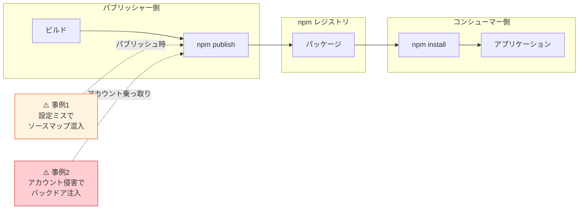
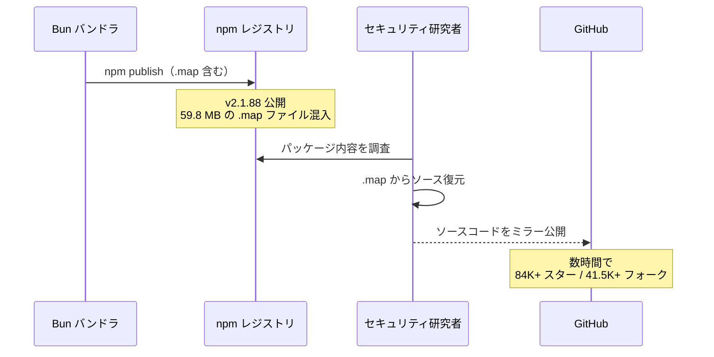
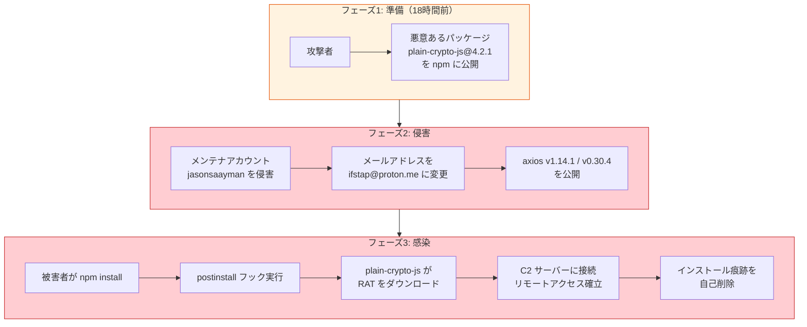
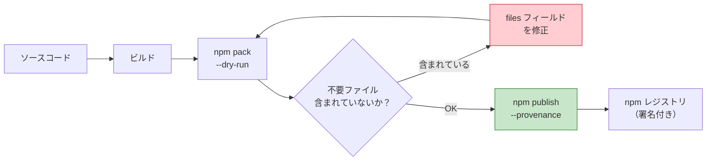
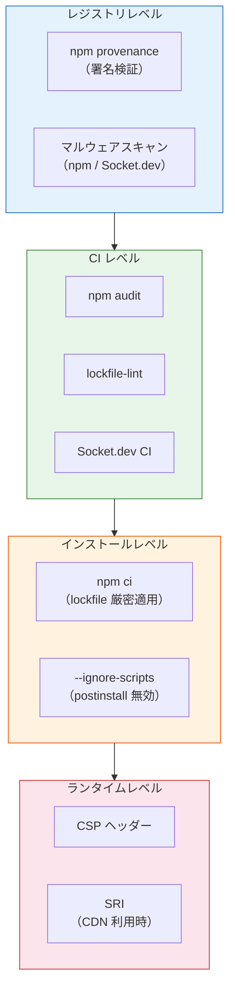

# npm サプライチェーン攻撃事例（npm Supply Chain Incidents — 2026.03）

> **一言で言うと:** 2026 年 3 月 31 日に 2 つの npm インシデントが同時発生した。1 つは設定ミスによるソースコード漏洩（Claude Code）、もう 1 つはアカウント侵害によるバックドア注入（Axios）。人的ミスと意図的攻撃という異なる性質を持ちながら、どちらも npm エコシステムの「信頼の連鎖」の脆さを浮き彫りにした。

## サプライチェーン攻撃とは

ソフトウェアサプライチェーン攻撃とは、アプリケーション本体ではなく**その依存関係（パッケージ、ビルドツール、レジストリ）を経由して侵害を行う攻撃**の総称。標的のコードに直接触れることなく、信頼されたパッケージを汚染することで、そのパッケージを利用するすべてのプロジェクトに被害を及ぼす。



npm が特に攻撃対象になりやすい理由:
- **規模** — 200 万以上のパッケージ、週間 250 億以上のダウンロード
- **推移的依存** — 1 つのパッケージが数十〜数百の間接依存を持つ
- **postinstall フック** — インストール時に任意のスクリプトを自動実行する仕組みがある
- **個人メンテナへの依存** — クリティカルなパッケージが個人の 1 アカウントに依存している

## 事例 1: Claude Code ソースマップ漏洩

### 概要

2026 年 3 月 31 日、Anthropic の `@anthropic-ai/claude-code` v2.1.88 に 59.8 MB のソースマップファイル（`.map`）が含まれた状態で npm に公開された。このソースマップから約 2,000 の TypeScript ファイル、512,000 行以上のソースコードが復元可能だった。

### 原因

Claude Code は Bun をバンドラとして使用しているが、**Bun はデフォルトでソースマップを生成する**。本来は以下のいずれかで除外すべきだった:

1. `package.json` の `files` フィールドで公開ファイルを明示する（allowlist）
2. `.npmignore` に `*.map` を追加する（denylist）
3. バンドラの設定でソースマップ生成を無効にする

いずれの対策も行われていなかったため、ソースマップがそのまま npm レジストリに公開された。

### タイムラインと影響



- **影響範囲:** ソースコードの全量漏洩（知的財産の露出）
- **悪意の有無:** なし（設定ミスによる事故）
- **再発:** 2025 年初頭にも同様の漏洩が発生しており、**2 回目の事故**

### なぜ防げなかったのか

| 防御層 | 期待される対策 | 実際の状況 |
|-------|-------------|-----------|
| バンドラ設定 | `--sourcemap=none` で生成を無効化 | Bun のデフォルト（生成有効）のまま |
| `package.json` | `files` フィールドで allowlist 指定 | 未設定 |
| `.npmignore` | `*.map` を除外 | 未設定または不十分 |
| CI パイプライン | `npm pack --dry-run` で内容検証 | 検証ステップなし |
| コードレビュー | パブリッシュ設定の変更をレビュー | 見落とし |

### 教訓: denylist vs allowlist

`.npmignore`（denylist）は「除外し忘れたファイルが公開される」リスクがある。`package.json` の `files` フィールド（allowlist）は「明示的に許可したファイルだけが公開される」ため、構造的に安全:

```json
{
  "name": "@example/my-package",
  "files": [
    "dist/index.js",
    "dist/cli.js",
    "README.md",
    "LICENSE"
  ]
}
```

さらに CI で `npm pack --dry-run` を実行し、意図しないファイルが含まれていないかを自動チェックする:

```bash
# CI スクリプト: .map ファイルが含まれていたらビルド失敗にする
npm pack --dry-run 2>&1 | grep -E '\.map$' && {
  echo "ERROR: Source map files detected in package"
  exit 1
}
```

## 事例 2: Axios バックドア攻撃

### 概要

2026 年 3 月 30〜31 日、攻撃者が npm 上の axios メンテナ "jasonsaayman" のアカウントを侵害し、バックドア入りのバージョン（v1.14.1 および v0.30.4）を公開した。axios は週間 8,300 万以上のダウンロードを持つ、JavaScript エコシステムで最も広く使われる HTTP クライアントの 1 つ。

### 攻撃者

一部のセキュリティ研究者により、北朝鮮関連のハッキンググループとの関連が指摘されている。暗号通貨・DeFi 企業を標的とした過去のサプライチェーン攻撃（UNC4899 等）との手法的類似性が根拠とされるが、帰属は確定していない。

### 攻撃メカニズム



攻撃の特徴:
- **悪意ある依存の追加:** `plain-crypto-js@^4.2.1` を `dependencies` に追加（正規の axios コードでは一切 import されない）
- **postinstall フックの悪用:** インストール時に自動でスクリプトを実行し、プラットフォーム固有の RAT（Remote Access Trojan）をダウンロード・実行
- **痕跡の自己削除:** マルウェア実行後、インストール痕跡やパッケージメタデータを削除して検出を回避
- **事前準備:** 悪意ある依存パッケージは本体の 18 時間前に公開されており、計画的な攻撃だった

### タイムライン

| 時刻（UTC） | イベント |
|------------|--------|
| 3/30 ~06:00 | `plain-crypto-js@4.2.1` が npm に公開（攻撃の事前準備） |
| 3/31 00:21 | 侵害された axios v1.14.1 / v0.30.4 が npm に公開 |
| 3/31 ~00:30 | Socket.dev が悪意あるパッケージとしてフラグ |
| 3/31 03:29 | npm がパッケージを削除（約 3 時間のウィンドウ） |

### 侵害された場合の対応

この時間帯に axios v1.14.1 または v0.30.4 をインストールしたシステムは**完全に侵害された前提**で対応する必要がある:

1. **即座にすべてのシークレット・認証情報をローテーション**する
2. 安全なバージョン（v1.14.0 または v0.30.3）にダウングレードする
3. 該当マシンのフォレンジック調査を実施する
4. 重要なシステムでは OS のクリーンインストールを検討する

### postinstall フックの危険性

postinstall フックは npm の正当な機能（ネイティブモジュールのビルド等）だが、マルウェア配布の主要経路にもなっている。依存パッケージの postinstall スクリプトを確認するには:

```bash
# 依存ツリー内の postinstall スクリプトを持つパッケージを列挙
npm query ':attr(scripts, [postinstall])' | npx json -a name scripts.postinstall
```

## 2 つの事例の比較

| 観点 | Claude Code ソースマップ漏洩 | Axios バックドア攻撃 |
|------|---------------------------|-------------------|
| **性質** | 事故（Accidental） | 攻撃（Malicious） |
| **攻撃者** | なし（設定ミス） | 北朝鮮関連グループとの関連が指摘（帰属未確定） |
| **ベクトル** | パブリッシュ時の設定不備 | メンテナアカウント侵害 |
| **手法** | ソースマップの除外漏れ | 悪意ある依存 + postinstall フック |
| **影響の種類** | 情報漏洩（ソースコード） | マルウェア配布（RAT） |
| **検出手段** | セキュリティ研究者が手動発見 | Socket.dev が数分で自動検出 |
| **被害期間** | 不明（差し替えまで） | ~3 時間 |
| **影響規模** | 1 社のソースコード | 83M+ 週間 DL のユーザー |
| **根本教訓** | パブリッシュ前の自動チェック | アカウントセキュリティ + 依存監視 |

### 共通の教訓

性質は異なるが、両事例は同じ構造的問題を露呈している:

> **npm の信頼モデルは、個々のパブリッシャーの行動（ミスであれ侵害であれ）に対して脆弱**

- Claude Code の漏洩は `.npmignore` 1 つで防げた
- Axios の攻撃は 2FA 1 つで防げた可能性がある
- どちらも「単一障害点」（Single Point of Failure）の問題

## 防御策 — パブリッシャー側

パッケージを公開する開発者・組織が実施すべき対策:

### パブリッシュ内容の制御



**`files` フィールド（allowlist）を使う:**

```json
{
  "name": "my-package",
  "files": ["dist/", "README.md", "LICENSE"]
}
```

**CI で検証する（GitHub Actions）:**

```yaml
name: Publish
on:
  release:
    types: [published]

jobs:
  publish:
    runs-on: ubuntu-latest
    permissions:
      contents: read
      id-token: write  # provenance に必要
    steps:
      - uses: actions/checkout@v4
      - uses: actions/setup-node@v4
        with:
          node-version: 22
          registry-url: https://registry.npmjs.org
      - run: npm ci
      - run: npm run build

      # パブリッシュ前の内容検証
      - name: Verify package contents
        run: |
          npm pack --dry-run 2>&1 | tee pack-output.txt
          if grep -E '\.(map|env|key|pem)$' pack-output.txt; then
            echo "::error::Sensitive files detected in package"
            exit 1
          fi

      # provenance 付きパブリッシュ
      - run: npm publish --provenance --access public
        env:
          NODE_AUTH_TOKEN: ${{ secrets.NPM_TOKEN }}
```

### アカウントセキュリティ

| 対策 | 実施方法 |
|------|---------|
| 2FA の有効化 | `npm profile enable-2fa auth-and-writes` |
| Granular Access Token | npm の「Granular Access Token」で IP 制限 + パッケージ範囲を限定 |
| 組織アカウントの利用 | 個人アカウントではなく npm Organization で管理し、メンバーの 2FA を強制 |
| provenance の有効化 | GitHub Actions から `--provenance` 付きでパブリッシュし、ビルドとソースの紐付けを証明 |

## 防御策 — コンシューマー側

パッケージを利用する開発者・チームが実施すべき対策:

### lockfile と `npm ci`

lockfile（`package-lock.json`）はインストールされるパッケージの正確なバージョンとハッシュを記録する。**CI/CD では必ず `npm ci` を使う:**

```bash
# ❌ npm install — lockfile を更新する可能性がある
npm install

# ✅ npm ci — lockfile に厳密に従う（不一致時はエラー）
npm ci
```

Axios 事件では、**lockfile が侵害前に作成されていたプロジェクトは影響を受けなかった**。lockfile に v1.14.0 がピンされていれば、`npm ci` は v1.14.1 をインストールしない。

### postinstall スクリプトの制御

`.npmrc` で postinstall スクリプトをデフォルト無効にする:

```ini
# .npmrc
ignore-scripts=true
```

ネイティブモジュール（`bcrypt`, `sharp` 等）のビルドが必要な場合は、個別に許可する:

```bash
# 特定パッケージのスクリプトのみ許可して実行
npm rebuild bcrypt sharp
```

### 依存の監視

```yaml
# GitHub Actions: 依存の安全性チェック
name: Dependency Audit
on:
  pull_request:
    paths:
      - 'package.json'
      - 'package-lock.json'

jobs:
  audit:
    runs-on: ubuntu-latest
    steps:
      - uses: actions/checkout@v4
      - uses: actions/setup-node@v4
        with:
          node-version: 22

      # npm audit で既知の脆弱性をチェック
      - run: npm audit --audit-level=high

      # lockfile の整合性チェック
      - uses: lirantal/lockfile-lint-action@v1
        with:
          path: package-lock.json
          type: npm
          allowed-hosts: npm
          validate-https: true
```

### 多層防御の全体像



## 誤解されやすいポイント

1. **「npm audit が通れば安全」** — `npm audit` は CVE データベースに登録済みの脆弱性のみを検出する。Axios 事件のようなゼロデイ攻撃はアドバイザリ登録前には検出できない。Socket.dev のような**行動分析（Behavioral Analysis）**ベースのツールが、ネットワークアクセス・ファイルシステム操作・難読化コードなどの「疑わしい振る舞い」を検出して数分以内にフラグを立てた

2. **「有名パッケージは安全」** — axios は週間 8,300 万ダウンロードの超メジャーパッケージでも侵害された。2021 年の `ua-parser-js`（週間 800 万 DL）、`event-stream` 事件も同様。パッケージの人気度とセキュリティは相関しない

3. **「`package-lock.json` があればバージョン固定されている」** — lockfile はバージョンを記録するが、`npm install`（`npm ci` ではなく）は新しい依存の追加時などに lockfile を更新しうる。CI/CD では必ず `npm ci` を使い、lockfile を変更不可として扱う

4. **「`.npmignore` で不要ファイルを除外すれば十分」** — Claude Code 事件が示したように、denylist 方式は「除外し忘れたファイルが公開される」リスクがある。`package.json` の `files` フィールドによる allowlist 方式のほうが、**明示的に許可したファイルだけが公開される**ため構造的に安全

## 関連トピック

- [[サプライチェーンセキュリティ]] — 親トピック。サプライチェーンセキュリティの全体像
- [[最小権限の原則]] — npm アカウント権限・自動化トークンの最小化
- [[XSS]] — 侵害された依存経由のスクリプト注入
