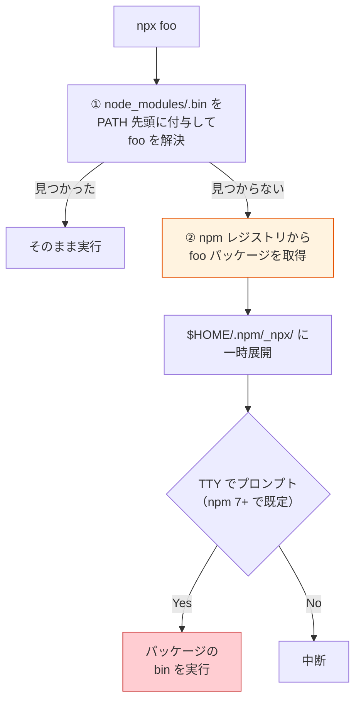

# npx とは（npx — Node Package Executor）

> **一言で言うと:** `npx` は「ローカルにインストールされた CLI を PATH を汚さずに実行する」ためのコマンドだが、同名の実行ファイルが見つからない場合は **npm レジストリから該当パッケージを取得して即座に実行する**。この「取ってきて実行する」挙動こそが npx の正体であり、同時に[[サプライチェーンセキュリティ]]上の最大のリスクでもある。

## なぜ存在するか — 3 つの動機

npx は npm 5.2（2017 年）で追加された。それ以前の Node.js エコシステムには以下の不便があり、npx はそれらをまとめて解決する:

| 問題 | npx 以前の対処 | npx の解決 |
|---|---|---|
| ローカル `node_modules/.bin` を実行するのに相対パスが必要 | `./node_modules/.bin/eslint src/` | `npx eslint src/` |
| CLI を試すためだけにグローバルインストールしてゴミが残る | `npm install -g create-next-app` | `npx create-next-app my-app`（1 回きり） |
| プロジェクトごとに異なるバージョンの CLI を使い分けたい | グローバル版と競合しがち | `npx` は常にローカル優先で解決 |

## 解決アルゴリズム — 2 段階のフォールバック

`npx foo` を実行したとき、npx（= `npm exec`）は `node_modules/.bin` を PATH の先頭に付与した上で単一の PATH 解決を行い、見つからなければレジストリから取得する:



`node_modules/.bin` を PATH 先頭に置く方式なので、ローカル依存がグローバル同名コマンドよりも常に優先される。

### ② の「取ってきて実行する」が曲者

段階 ② に到達したとき、npx は **ユーザーが指定した名前のパッケージをレジストリから素朴に取得**する。タイポスクワッティング（似た名前の悪意あるパッケージ）や依存混同攻撃（Dependency Confusion）で偽装されたパッケージを、**インストールの明示的確認なしに実行してしまう**のがリスクの核心である（[[npmサプライチェーン攻撃事例]]参照）。

npm 7 以降は対話的プロンプト（`Need to install the following packages: ... Ok to proceed? (y)`）が入るようになったが、CI 環境や `--yes` フラグ下ではプロンプトは出ない。

## 実行例 — ローカル bin のケース

`package.json` に以下のような依存があるとする:

```json
{
  "name": "my-app",
  "devDependencies": {
    "typescript": "5.4.5",
    "eslint": "9.0.0"
  }
}
```

```bash
# ① ローカルの node_modules/.bin を実行（推奨用途）
npx tsc --version
# → 5.4.5 が表示される

# 従来の等価な書き方
./node_modules/.bin/tsc --version
```

この使い方は**レジストリへのアクセスを一切発生させない**ため安全。`package.json` の `scripts` 内では冗長なので npx を付けないのが慣例:

```json
{
  "scripts": {
    "build": "tsc",
    "lint": "eslint src/"
  }
}
```

## 実行例 — リモート取得のケース（注意）

```bash
# プロジェクト雛形を生成する典型例
npx create-next-app@15.0.0 my-app

# バージョン未指定は latest が取られる（侵害バージョンに当たるリスク）
npx create-next-app my-app        # ⚠️ 非推奨

# --package で実行ファイル名とパッケージ名を分離
npx --package @scope/tool-cli@1.2.3 tool

# CI での非対話実行（プロンプトをスキップ）
npx --yes create-next-app@15.0.0 my-app
```

## コード例 — TypeScript で npx 相当の挙動を再現

```typescript
// scripts/local-bin.ts
// ローカル node_modules/.bin を優先して CLI を呼び出す最小例
import { execFileSync } from "node:child_process";
import { existsSync } from "node:fs";
import { join } from "node:path";

const [, , cmd, ...args] = process.argv;
const isWindows = process.platform === "win32";
const localBin = join("node_modules", ".bin", isWindows ? `${cmd}.cmd` : cmd);

if (!existsSync(localBin)) {
  console.error(`${cmd} is not installed locally. Run: npm install -D ${cmd}`);
  process.exit(1);
}

// Windows では Node.js 18.20.2 / 20.12.2 以降 .cmd/.bat の直接実行が
// CVE-2024-27980 対策でブロックされるため、cmd.exe 経由で起動する
if (isWindows) {
  execFileSync(process.env.ComSpec ?? "cmd.exe", ["/d", "/s", "/c", localBin, ...args], { stdio: "inherit" });
} else {
  execFileSync(localBin, args, { stdio: "inherit" });
}
```

意図: **「なければ取ってくる」段階 ② をあえて削除する**ことで、npx のリスクを回避する。プロジェクトで使う CLI は `devDependencies` に入れてこのスクリプトで呼ぶ運用にすれば、レジストリからの任意コード取得を禁止できる。

## コード例 — bash での段階 ② 禁止設定

```bash
# .npmrc
# ~/.npmrc またはプロジェクトの .npmrc に設定

# npx がリモート取得する前にプロンプトを強制
# （CI では --no を組み合わせてエラー終了させる）
yes=false

# postinstall スクリプトの自動実行を全面禁止
ignore-scripts=true
```

```bash
# CI で「リモート取得を禁止」する呼び出し
npx --no foo   # ローカルに foo がなければ実行せず終了
```

`--no` は `--yes` の否定形で、インストール確認プロンプトに自動で "no" を返す。結果として、ローカル bin が存在しない場合はリモート取得せずエラーで終わる。CI での npx 呼び出しは常にこれを付けるのが安全。

## 類似ツールとの比較

| ツール | エコシステム | 段階 ② の挙動 | 備考 |
|---|---|---|---|
| `npx`（npm） | Node.js | 自動取得（プロンプトあり） | 既定で「取ってくる」 |
| `pnpm dlx` | Node.js | 毎回クリーンな一時環境で取得 | キャッシュ有だが実行環境は隔離 |
| `yarn dlx` | Node.js（Yarn Berry） | `pnpm dlx` と類似 | Yarn Classic には存在しない |
| `pipx run` | Python | 隔離された venv に取得 | グローバル環境を汚さない設計 |
| `go run pkg@ver` | Go | モジュールキャッシュに取得 | `go.sum` でハッシュ検証される |
| `bundle exec` | Ruby | **取得しない**（Gemfile.lock に忠実） | そもそも段階 ② が存在しない |

Go と Ruby の設計は示唆的で、「ロックファイルで宣言されたものだけ実行する」ほうが構造的に安全。npx の「取ってきて実行する」文化は開発体験の良さと引き換えに、**暗黙のサプライチェーン攻撃面**を生んでいる。

## よくある落とし穴

1. **バージョン未指定** — `npx create-foo` は毎回 latest を取得する。侵害バージョンが公開された瞬間に実行してしまうため、必ず `@バージョン` を付ける（`npx create-foo@1.2.3`）
2. **CI での `--yes` 暗黙化** — TTY 非対応の CI では npm 7+ でもプロンプトが出ず自動で `yes` 扱いになる。`--no` でリモート取得を禁止するか、事前に `devDependencies` に入れる
3. **グローバル版との混同** — `npx eslint` は**ローカル版を優先する**。グローバル版を期待して動作が食い違うことがある。プロジェクト内では常にローカル依存として明示するのが安全
4. **キャッシュの残留** — `$HOME/.npm/_npx/` に実行したパッケージの痕跡が残る。インシデント調査時の証跡になる一方、古いキャッシュを信頼しすぎると侵害バージョンが動き続けるリスクがある
5. **`npm exec` との関係** — npm 7 以降、`npx` は `npm exec` の薄いラッパ。挙動に差異があるため、CI では `npm exec -- foo` のほうが明示的で好ましい場合がある

## AIによる実装のアンチパターン

| アンチパターン | なぜ問題か | 対策 |
|---|---|---|
| README や CI スクリプトで `npx 未知のCLI` を提案 | ユーザーが実行した瞬間にレジストリから任意コードが走る | `devDependencies` に追加してバージョン固定する手順を提示 |
| `npx foo@latest` を例示 | latest は侵害バージョンに当たりうる。再現性もない | 固定バージョン `npx foo@1.2.3` を示す |
| Dockerfile で `RUN npx --yes ...` | ビルドのたびに未検証のパッケージを取得・実行する | `RUN npm ci --ignore-scripts && npx --no ...` に書き換え |
| `npx create-*` を本番デプロイスクリプトに混入 | 本番経路に段階 ② を持ち込むのは典型的な脆弱化 | 雛形生成は開発者の手元で 1 回だけ実行 |

## 実務での使用シーン

- **プロジェクト雛形生成**（`create-next-app`, `create-vite` 等）— 1 回きりの使用で、バージョンを明示するなら許容
- **ローカル CLI 実行** — `npm run` と同等の目的で、ワンショットの実行に便利
- **バージョン切替テスト** — 同じ CLI の複数バージョンを試すときに、グローバルインストール不要で実行できる
- **CI での事前インストール済みツール実行** — `devDependencies` に入れた上で `npx --no` で呼ぶと安全

## 関連トピック

- [[サプライチェーンセキュリティ]] — 親トピック。npx の段階 ② が生む攻撃面を構造的に扱う
- [[npmサプライチェーン攻撃事例]] — 侵害されたパッケージが npx 経由で実行されるリスクの実例
- [[npmとpnpmの比較]] — pnpm の `dlx` は npx と似るが隔離実行で設計が異なる
- [[生成AIコーディングエージェントのセキュリティリスク]] — AI が README に `npx` を気軽に書くリスク

## 参考リソース

- [npm Docs — npx](https://docs.npmjs.com/cli/v11/commands/npx)
- [npm Docs — npm-exec](https://docs.npmjs.com/cli/v11/commands/npm-exec)
