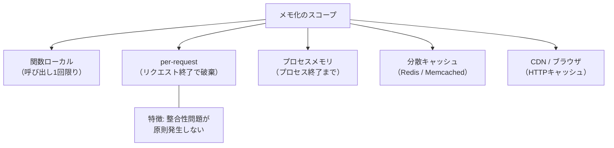
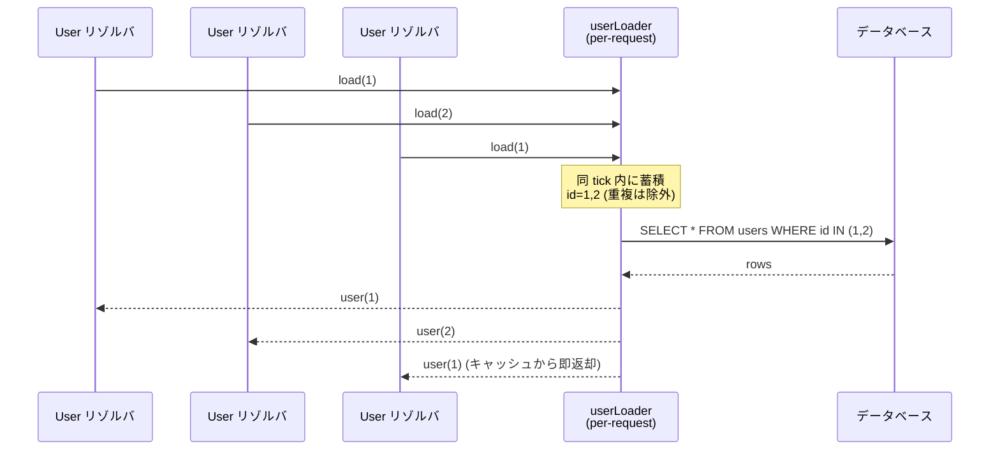

# per-request メモ化（Per-Request Memoization）

> **一言で言うと:** 「1 リクエスト処理中、同じキー（ID／引数）の取得や計算を 2 回目以降スキップする」リクエストスコープのキャッシュ。プロセス全体で共有する Redis キャッシュとは整合性の難易度がまったく違う — リクエストが終われば全部捨てるので、無効化を考えなくてよい。

## なぜ「per-request」なのか — スコープによる対比

「メモ化（memoization）」は同じ入力に対する関数の戻り値を再利用するパターン。Web アプリケーションでは、**どのスコープで結果を保持するか**で性質が大きく変わる。



| スコープ | 寿命 | 整合性の難しさ | 主な用途 |
|---|---|---|---|
| 関数ローカル変数 | 関数の1回の呼び出し | なし（自分しか読まない） | ループ内でのキャッシュ |
| **per-request** | 1 リクエスト | **ほぼなし**（同一トランザクション内） | DataLoader、認可コンテキスト、N+1 回避 |
| プロセスメモリ（モジュール変数 / Singleton） | プロセス終了まで | 高い（複数リクエスト間で共有 + ワーカー間で不整合） | マスタデータ、設定値 |
| 分散キャッシュ（[[MemcachedとRedis]]） | TTL まで | 高い（[[キャッシュ書き込み戦略とTTL設計]]参照） | セッション、ホットなクエリ結果 |
| HTTP キャッシュ（CDN / ブラウザ） | TTL / `Cache-Control` | 高い（無効化が遅延） | 静的アセット、公開 GET API |

per-request メモ化が他のキャッシュと根本的に違うのは、**「読み取った瞬間より前にコミットされた DB 状態と整合する」ことだけが保証されればよい**点。リクエスト処理中に他のトランザクションがデータを変えても、その変更を取り込まないのは「キャッシュのバグ」ではなく「リクエスト時点でのスナップショット」として正しい振る舞いになる。

## 典型的な3パターン

### 1. DataLoader（バッチング + キャッシング）

GraphQL の N+1 問題対策として Facebook が定式化したパターン。リクエストごとに `DataLoader` インスタンスを生成し、

- 同一リクエスト内で **同じ ID** に対する `load(id)` 呼び出しはキャッシュから返す
- イベントループの**1 tick の間に蓄積された ID をバッチ**にして 1 回の SQL（`WHERE id IN (...)`）で取る

の 2 つの最適化を同時に行う。`new DataLoader()` を毎リクエスト作り直す（per-request スコープ）のが鉄則で、プロセス全体で共有してはいけない。



[[EagerロードとLazyロード|Eager Loading の IN句方式]]と発想は完全に同じで、「明示的に `include` を書けない GraphQL のリゾルバ世界」で同等の効果を後付けで実現する仕組みと考えるとよい。

### 2. 単純な per-request キャッシュ（リクエストスコープのメモ化）

「同じ ID のユーザーをコントローラ → サービス → リポジトリの 3 箇所で取り直している」ような典型的な無駄に対する対策。バッチングは不要だが、同一リクエスト内の重複取得だけは消したいケース。

```typescript
// per-request キャッシュ（簡易版）
const cache = new Map<string, Promise<User>>();

function getUser(id: string): Promise<User> {
  if (!cache.has(id)) {
    cache.set(id, db.query("SELECT * FROM users WHERE id = $1", [id]));
  }
  return cache.get(id)!;  // Promise を返すので並列呼び出しでも DB は 1 回
}
```

ポイントは **値ではなく Promise をキャッシュする**こと（in-flight deduplication）。同時呼び出しで DB が複数回叩かれない。

### 3. リクエストコンテキストに乗せた「現在のユーザー」「現在のテナント」

認可で使う `currentUser` / `currentTenant` / `permissions` は、1 リクエスト内で何度も参照されるが内容は変わらない。これらをリクエストの先頭で 1 回だけ取得し、リクエストコンテキストに保持することで、認可チェックのたびに DB を叩かなくて済む。

これも広義の per-request メモ化で、Rails の `Current.user` や Node.js の `AsyncLocalStorage`、Go の `context.Context` に値を乗せる定番イディオムがこれにあたる。

## 「per-request スコープ」の実現手段

per-request メモ化を成立させるには、「同じリクエストで処理しているコードからだけアクセスできる保管場所」が必要。言語・ランタイムごとにアプローチが異なる。

| 言語/ランタイム | リクエストスコープの主な実現手段 | 注意点 |
|---|---|---|
| Node.js | `AsyncLocalStorage`（async_hooks）／GraphQL では `context` 引数 | 古いコードベースは `req` への直接プロパティ代入や `res.locals`（Express）／`ctx.state`（Koa）で運ぶ。Promise チェーンを跨ぐ値の引き回しは AsyncLocalStorage が標準解 |
| Python | `contextvars.ContextVar`（asyncio 安全）／FastAPI は `Depends()` でリクエストスコープ DI | `threading.local` は asyncio で破綻する。`contextvars` を使う |
| Go | `context.Context.Value()` | 「context は optional な関数引数の運搬に乱用しない」という慣習があるが、リクエストスコープの DataLoader は例外的に context.Value で持ち回すのがコミュニティ標準（gqlgen / graph-gophers/dataloader 等の公式パターン） |
| Ruby (Rails) | `CurrentAttributes` ／`request.env` ／スレッドローカル | Puma のスレッドモデルではリクエスト終了時のクリーンアップが必須（`reset` を忘れるとリクエスト間漏洩） |
| PHP | **不要**（Shared-nothing で、グローバル変数すらリクエストごとにリセットされる） | `static` プロパティを per-request キャッシュとして使えるが、Swoole / RoadRunner など常駐型ランタイムでは挙動が変わる |

PHP-FPM の Shared-nothing モデルでは「すべての変数が自動的に per-request スコープ」になるため、他言語で苦労する「リクエスト間漏洩」がそもそも起きない。逆に Node.js / Go / Python の常駐型ランタイムでは、**スコープ管理を間違えると別リクエストにデータが漏れる**ので、`AsyncLocalStorage` や `contextvars` のようなランタイムサポートが必要になる。詳しくは [[Webサーバーとランタイムのリクエスト処理モデル]] を参照。

## コード例

### TypeScript — DataLoader（GraphQL Apollo Server）

```typescript
import DataLoader from "dataloader";
import { ApolloServer } from "@apollo/server";
import { startStandaloneServer } from "@apollo/server/standalone";
import { Pool } from "pg";

const pool = new Pool({ connectionString: process.env.DATABASE_URL });

// 型定義・スキーマ（typeDefs）は別ファイルに切り出している前提
interface User { id: string; name: string; email: string; }
interface Post { id: string; user_id: string; title: string; userId: string; }
declare const typeDefs: string;

// per-request コンテキストの型
interface Context {
  userLoader: DataLoader<string, User | null>;
  postsByUserLoader: DataLoader<string, Post[]>;
}

// バッチ関数: 同 tick で蓄積された keys を 1 クエリで取得
function createUserLoader() {
  return new DataLoader<string, User | null>(async (ids) => {
    const { rows } = await pool.query<User>(
      "SELECT id, name, email FROM users WHERE id = ANY($1::uuid[])",
      [ids]
    );
    const byId = new Map(rows.map((u) => [u.id, u]));
    // 重要: 入力 keys と同じ順序・同じ要素数の配列を返す
    return ids.map((id) => byId.get(id) ?? null);
  });
}

function createPostsByUserLoader() {
  return new DataLoader<string, Post[]>(async (userIds) => {
    const { rows } = await pool.query<Post>(
      "SELECT id, user_id, title FROM posts WHERE user_id = ANY($1::uuid[])",
      [userIds]
    );
    const grouped = new Map<string, Post[]>();
    for (const post of rows) {
      const list = grouped.get(post.user_id) ?? [];
      list.push(post);
      grouped.set(post.user_id, list);
    }
    return userIds.map((id) => grouped.get(id) ?? []);
  });
}

const server = new ApolloServer<Context>({
  typeDefs,
  resolvers: {
    Post: {
      // ❌ DataLoader なしだと posts N 件 × user 取得で N+1
      // ✅ context.userLoader 経由で 1 クエリにバッチング
      author: (post, _, ctx) => ctx.userLoader.load(post.userId),
    },
    User: {
      posts: (user, _, ctx) => ctx.postsByUserLoader.load(user.id),
    },
  },
});

await startStandaloneServer(server, {
  // ★ context は「リクエストごとに呼ばれる」 — ここで loader を毎回作り直すのが per-request メモ化の肝
  context: async () => ({
    userLoader: createUserLoader(),
    postsByUserLoader: createPostsByUserLoader(),
  }),
  listen: { port: 4000 },
});
```

### Python — `contextvars` でリクエストスコープのメモ化（FastAPI）

```python
from __future__ import annotations
import asyncio
from contextvars import ContextVar
from typing import Any
from fastapi import FastAPI, Depends, Request
import asyncpg

app = FastAPI()

# リクエストごとの per-request キャッシュをコンテキストに保持
request_cache: ContextVar[dict[str, Any]] = ContextVar("request_cache")


@app.middleware("http")
async def per_request_cache_middleware(request: Request, call_next):
    # リクエスト開始時に空 dict をセット → リクエスト終了で自動破棄
    token = request_cache.set({})
    try:
        return await call_next(request)
    finally:
        # contextvars は ContextVar 単位で reset。dict 内のオブジェクトは
        # GC が回収するため明示クリアは不要
        request_cache.reset(token)


def get_pool() -> asyncpg.Pool:
    return app.state.pool


async def _fetch_user(user_id: str, pool: asyncpg.Pool) -> dict | None:
    row = await pool.fetchrow(
        "SELECT id, name, email FROM users WHERE id = $1", user_id
    )
    return dict(row) if row else None


async def get_user_cached(user_id: str, pool: asyncpg.Pool) -> dict | None:
    """同一リクエスト内では DB を 1 回しか叩かない。
    ★ Task（最終結果の dict を返す）をキャッシュすることで、同一リクエスト内の
       並行コルーチンが同じキーを問い合わせても DB は 1 回で済む。
       dict 化を Task の中で済ませているため、await を何度繰り返しても
       同じ dict オブジェクトが返り、`is` 比較も成立する。
    """
    cache = request_cache.get()
    key = f"user:{user_id}"

    if key not in cache:
        cache[key] = asyncio.create_task(_fetch_user(user_id, pool))

    return await cache[key]


@app.get("/users/{user_id}/profile")
async def profile(user_id: str, pool: asyncpg.Pool = Depends(get_pool)):
    # 同一ハンドラ内で 3 回呼んでも DB クエリは 1 回
    user = await get_user_cached(user_id, pool)
    user_again = await get_user_cached(user_id, pool)  # キャッシュヒット
    assert user is user_again
    return user
```

### Go — `context.Context` に loader を載せる（GraphQL gqlgen を想定）

```go
package loader

import (
	"context"
	"database/sql"
	"net/http"
	"sync"
)

type User struct {
	ID, Name, Email string
}

type ctxKey struct{}

// Loaders はリクエストごとに生成される per-request キャッシュ群
type Loaders struct {
	UserByID *userLoader
}

type userLoader struct {
	db    *sql.DB
	mu    sync.Mutex
	cache map[string]*User
}

func newUserLoader(db *sql.DB) *userLoader {
	return &userLoader{db: db, cache: make(map[string]*User)}
}

// Load: per-request 内で同じ id は DB を叩かない
//
// ⚠️ 注意: このサンプルは「値」をキャッシュしているため、本記事冒頭で警告した
// 「同じ id に対する並行 Load の in-flight deduplication が効かない」問題を抱える。
// 同時に2つのゴルーチンが同じ id を Load すると、両方が cache miss を見て個別に
// DB クエリを発行する。本番では以下のいずれかを採用する:
//   (a) golang.org/x/sync/singleflight でクエリ重複を抑止
//   (b) graph-gophers/dataloader などのバッチング実装を使う（こちらが本筋）
// 下記は最小メモ化の構造を示すための簡易実装。
func (l *userLoader) Load(ctx context.Context, id string) (*User, error) {
	l.mu.Lock()
	if u, ok := l.cache[id]; ok {
		l.mu.Unlock()
		return u, nil
	}
	l.mu.Unlock()

	row := l.db.QueryRowContext(ctx,
		"SELECT id, name, email FROM users WHERE id = $1", id)
	u := &User{}
	if err := row.Scan(&u.ID, &u.Name, &u.Email); err != nil {
		if err == sql.ErrNoRows {
			return nil, nil
		}
		return nil, err
	}

	l.mu.Lock()
	l.cache[id] = u
	l.mu.Unlock()
	return u, nil
}

// Middleware は HTTP リクエストごとに新しい Loaders を context に詰める
func Middleware(db *sql.DB, next http.Handler) http.Handler {
	return http.HandlerFunc(func(w http.ResponseWriter, r *http.Request) {
		loaders := &Loaders{UserByID: newUserLoader(db)}
		ctx := context.WithValue(r.Context(), ctxKey{}, loaders)
		next.ServeHTTP(w, r.WithContext(ctx))
		// リクエスト終了で ctx が破棄され、loaders もリーチャブルでなくなる → GC 対象
	})
}

// For はリゾルバから loaders を取り出す
func For(ctx context.Context) *Loaders {
	return ctx.Value(ctxKey{}).(*Loaders)
}
```

### Ruby — Rails の `CurrentAttributes` でリクエストスコープを表現

```ruby
# app/models/current.rb
class Current < ActiveSupport::CurrentAttributes
  attribute :user, :tenant
  attribute :user_cache  # per-request キャッシュ用 Hash

  resets { self.user_cache = {} }  # リクエスト終了時に自動リセット
end

# app/controllers/application_controller.rb
class ApplicationController < ActionController::Base
  before_action :set_current

  private

  def set_current
    Current.user       = authenticate_user!
    Current.tenant     = Current.user.tenant
    Current.user_cache = {}
  end
end

# app/services/user_lookup.rb
class UserLookup
  def self.find(id)
    Current.user_cache[id] ||= User.find_by(id: id)
    # Current は CurrentAttributes 経由でリクエスト終了時に reset されるため、
    # 別リクエストにデータが漏れない
  end
end

# 同一リクエスト内のどこから呼んでも DB クエリは 1 回
UserLookup.find(42)  # SELECT
UserLookup.find(42)  # キャッシュヒット
UserLookup.find(99)  # SELECT
```

## よくある落とし穴

### 1. プロセス全体で `DataLoader` を共有してしまう

```typescript
// ❌ モジュールトップで一度だけ生成 — 全リクエスト間で共有される
const userLoader = new DataLoader(batchLoadUsers);
```

DataLoader はキャッシュを内蔵するため、プロセス全体で共有すると「リクエスト A で読んだ古い user が、リクエスト B でも返り続ける」状態になる。さらに認可コンテキストの異なるユーザーに他人のデータが見える事故にも繋がる。**必ずリクエストごとに `new DataLoader()` する**。

### 2. Mutation 後にキャッシュを無効化していない

per-request 内であっても、同じリクエスト内で `UPDATE` を実行した直後にキャッシュ値を返すと「自分の書き込みが見えない」現象になる。GraphQL の Mutation リゾルバでは、書き込み対象のキーを `loader.clear(id)` で明示的に追い出す。

```typescript
const updated = await db.query("UPDATE users SET name = $1 WHERE id = $2 RETURNING *", [name, id]);
ctx.userLoader.clear(id);                  // 古い値を捨てる
ctx.userLoader.prime(id, updated.rows[0]); // 新しい値で温める（任意）
```

### 3. リクエストコンテキストの解放忘れによる「リクエスト間漏洩」

Rails の `CurrentAttributes` で `resets` を書き忘れると、Puma のスレッドが次のリクエストを処理する際に前のリクエストの `Current.user` が残る。最悪の場合、**ユーザー A が見ていた画面のデータが認証なしユーザー B のレスポンスに混入する**。テスト時には `Current.reset` を `after(:each)` で必ず呼ぶ。

### 4. キャッシュサイズの上限を設けず、長時間処理リクエストでメモリ爆発

GraphQL のクエリで巨大なリストを fetch しつつ全件を `userLoader.load(id)` すると、`DataLoader` のキャッシュ Map に全 ID が蓄積される。長時間ストリーミングする処理（バッチエクスポートなど）では `cacheMap` を LRU 制限付き Map に差し替えるか、`new DataLoader(batch, { cache: false })` でキャッシュを切る。

### 5. Promise ではなく値をキャッシュして並列呼び出しで N 回 DB を叩く

```typescript
// ❌ 値をキャッシュ — 同時に2回呼ばれると両方とも DB に行く
async function getUser(id: string): Promise<User> {
  if (cache.has(id)) return cache.get(id)!;
  const user = await db.findUser(id);  // 並列呼び出しではここに2回入る
  cache.set(id, user);
  return user;
}

// ✅ Promise をキャッシュ — in-flight でも 1 回しか DB に行かない
function getUser(id: string): Promise<User> {
  if (!cache.has(id)) cache.set(id, db.findUser(id));
  return cache.get(id)!;
}
```

### 6. `threading.local` を asyncio で使う

Python の `threading.local` は OS スレッド単位の保管場所。asyncio はシングルスレッドで複数のリクエストをコルーチンで並行処理するため、`threading.local` は**全リクエストで同じインスタンスを共有してしまう**。`contextvars.ContextVar` を使う。

### 7. per-request キャッシュの存在を前提にビジネスロジックを書く

「`getUser(id)` は何度呼んでも安いから」と認可チェックでループ内から無制限に呼び出すコードを書くと、キャッシュの実装を変えた瞬間（例: 別サービスへの分離）に N+1 が顕在化する。**呼ぶ側は「1 回呼べば十分」を意識し、per-request キャッシュは保険として機能させる**設計が望ましい。

## AI による実装のアンチパターン

| アンチパターン | なぜ問題か | 対策 |
|---|---|---|
| グローバルに 1 個の `DataLoader` を作って `export default` する | 全リクエスト間でキャッシュが共有され、認可違反データ漏洩・古いデータ返却の両方が起きる | `createContext` 内で毎回 `new DataLoader()` する |
| Mutation 後に `loader.clear(id)` を呼ばない | 同一リクエスト内で「書き込み直後の読み出し」が古い値を返す | 書き込み対象のキーは clear / prime する |
| `cache: new Map()` を渡しっぱなしで上限なし | 長時間バッチリクエストで OOM | LRU や `cache: false` で防御 |
| async サーバーで `threading.local` / グローバル変数 | リクエスト間漏洩・並行処理での値混線 | Node.js は `AsyncLocalStorage`、Python は `contextvars`、Go は `context.Context` |
| 値（解決済みオブジェクト）をキャッシュする | 並行呼び出しでバックエンドへ N 回問い合わせる | Promise / Future / `*sql.Row` ではなく**進行中の取得処理**そのものをキャッシュ |
| バッチ関数の戻り値が入力 keys と順序・要素数が一致しない | DataLoader の規約違反で別 ID のデータが返る重大バグ | 入力 ids の順に並べた配列を返す（Map で引き直す定型句を守る） |

## 実務での使用シーン

- **GraphQL リゾルバの N+1 対策**: GraphQL 採用時の事実上の必須インフラ。Apollo / gqlgen / graphql-ruby いずれもリクエストコンテキストに DataLoader を載せる定型実装が公式ドキュメントにある
- **REST でも認可チェック専用ローダー**: ミドルウェア層と各リソースハンドラで `currentUser` を別々に取得するコードが散在する場合、コンテキスト経由のメモ化で集約する
- **マルチテナント SaaS のテナントメタデータ取得**: ほぼ全エンドポイントで使う `tenant.feature_flags` や `tenant.plan` を、リクエスト先頭で 1 回取って per-request に保持
- **権限ポリシー評価**: Pundit / CASL のような認可ライブラリで `can?(:read, post)` が同じ user/post 組み合わせで何度も呼ばれるケースのキャッシュ
- **GraphQL Federation のサブグラフ**: 同じ `_entities` クエリ内で同一エンティティが複数回参照されたときの重複排除
- **バックグラウンドジョブの「ジョブ単位」スコープ**: HTTP リクエストではないが、1 ジョブ実行を 1 リクエストとみなして同じパターンを適用する

## 関連トピック

- [[データアクセス層]] — 親トピック。N+1 対策の主要手段の一つとして位置づく
- [[EagerロードとLazyロード]] — IN句方式 Eager Loading は per-request メモ化と発想が同一。「ORM で書ける場面は Eager Loading」「ORM で書きづらい GraphQL リゾルバの世界では DataLoader」と棲み分ける
- [[キャッシュ書き込み戦略とTTL設計]] — プロセス間で共有するキャッシュ（Redis）との対比。per-request キャッシュは整合性問題が原則発生しないことを再確認できる
- [[キャッシュ戦略]] — キャッシュ階層全体の中での位置づけ
- [[Webサーバーとランタイムのリクエスト処理モデル]] — PHP 等の Shared-nothing 型と Node.js / Go の常駐型でリクエストスコープの実現難易度がまったく違う背景
- [[コネクションプール]] — N+1 を放置するとプールが枯渇する。per-request メモ化は接続枯渇対策としても効く
- [[トランザクション]] — per-request キャッシュは「トランザクション境界＝リクエスト境界」が成り立つ前提で整合性が保たれる

## 参考リソース

- [graphql/dataloader（公式 GitHub リポジトリ）](https://github.com/graphql/dataloader) — Facebook 製のリファレンス実装。バッチング + キャッシングの API 仕様
- [Apollo Server: Data sources and DataLoader](https://www.apollographql.com/docs/apollo-server/data/fetching-data/) — per-request コンテキストでの DataLoader 利用パターン
- [Node.js AsyncLocalStorage](https://nodejs.org/api/async_context.html) — Promise チェーンを跨いでリクエストスコープ値を持ち回す標準 API
- [Python contextvars — Context Variables](https://docs.python.org/3/library/contextvars.html) — asyncio 安全なコンテキスト管理
- [Rails CurrentAttributes API](https://api.rubyonrails.org/classes/ActiveSupport/CurrentAttributes.html) — Rails 5.2 で導入された per-request コンテナ
