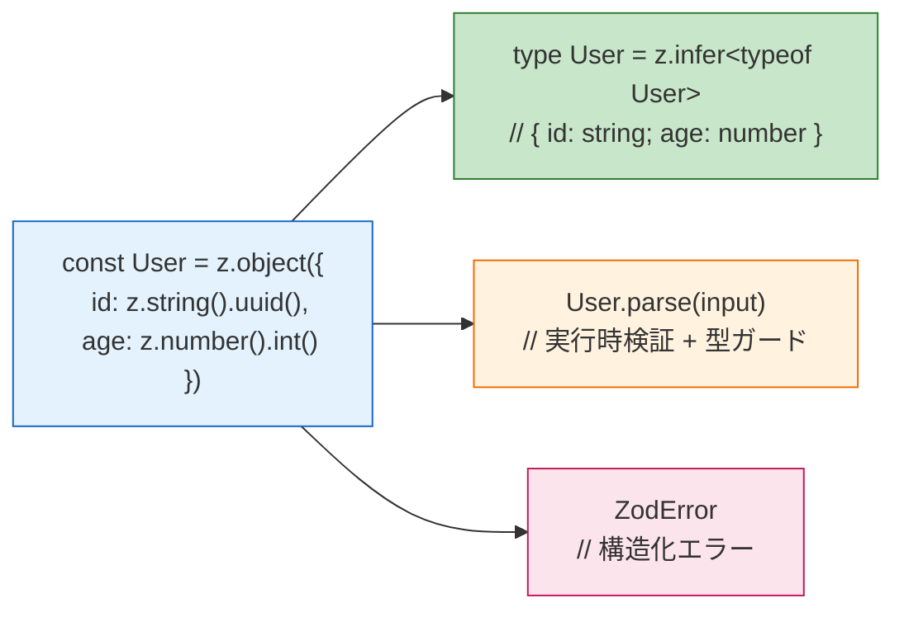
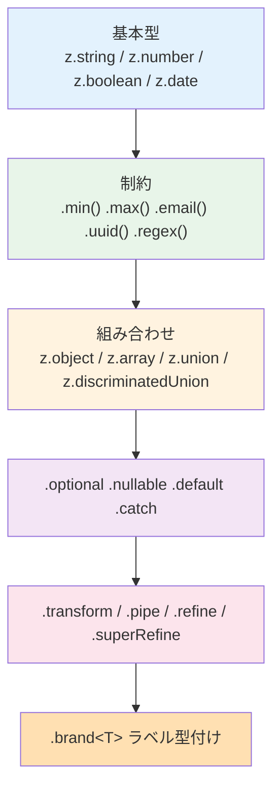

# zod（TypeScript-first Schema Validation）

> **一言で言うと:** zod は TypeScript で**スキーマを書いたらそこから型が導出される**（Type-Inference First）ことを最大の特徴にしたバリデーションライブラリ。スキーマと TS 型を二重管理する必要がなく、`z.infer` 一発で型・実行時検証・エラーメッセージが揃うため、信頼境界（Trust Boundary）の実装コストを劇的に下げる。

## なぜ zod が支持されるのか

TypeScript の型は[[JSON-Schema|コンパイル時にしか存在しない]]ため、HTTP・DB・外部 API から受け取った `unknown` を実行時に検証する手段が別途必要になる。zod は「一つのスキーマ定義から **型・検証・エラー情報** をすべて得られる」という一点に特化しており、同じ目的の他選択肢（Joi / Yup / Pydantic / JSON Schema + Ajv の比較は親トピック [[バリデーション]] 側で扱う）との棲み分けは、**「契約を TypeScript に閉じるか、言語をまたいで共有するか」の一点**に集約される。

| 判断軸 | zod | [[JSON-Schema\|JSON Schema]] + Ajv 等 |
|--------|-----|----------------------|
| スキーマの住所 | TS コードそのもの | 独立した JSON/YAML ファイル |
| 型との整合 | `z.infer` で自動導出、SSOT が 1 本に揃う | 型生成ツールを挟む |
| 可搬性 | TS/JS 内に閉じる | 多言語・多ツールに配布可能 |
| 向いている場面 | フルスタック TypeScript・フォーム・内部 API | 公開 API・多言語チーム・OpenAPI 駆動 |

つまり **単一言語（TypeScript）に閉じている限りは zod が最も開発体験が良い** が、チーム間や異言語間で契約を共有したいなら [[JSON-Schema]] ベースの方が向く、というトレードオフがある。

## スキーマから型が出る、の本質



この「スキーマがコードとしてそのまま書かれ、そこから型・検証・エラーが同時に得られる」性質が、zod と従来の `JSON Schema + 別ファイル + 型生成` ワークフローの最大の違い。

## 中核 API：parse と safeParse

zod の検証は2種類の呼び出し方に集約される。

| メソッド | 成功時 | 失敗時 | 使い分け |
|---------|--------|--------|---------|
| `.parse(input)` | パース済みの値を返す | **`ZodError` を throw** | throw で全体を 400/422 に畳みたい場合、内部関数で例外を投げたい場合 |
| `.safeParse(input)` | `{ success: true, data }` | `{ success: false, error }` | エラーハンドリングを明示的に書きたい HTTP ハンドラ、フォームの fieldごとの表示 |

例外の有無以外の意味は同じ。HTTP 境界では `safeParse` を使ってエラー詳細を構造化し、内部関数では `parse` で throw させる、という役割分担が実務で定着している。

## 表現力の層：基本型 → 組み合わせ → 変換



### refine vs transform vs pipe

この3つは似ているが役割が異なる。

| API | 型の変化 | 用途 |
|-----|---------|------|
| `.refine(fn, message)` | **変化なし**（`T → T`） | カスタム検証（同じ型のまま合否判定） |
| `.superRefine(fn)` | 変化なし | 複数エラー・`path` 指定・早期中断が必要な検証 |
| `.transform(fn)` | **変化あり**（`T → U`） | パース後に型を変換（string → Date、trim、大小文字変換） |
| `.pipe(schema)` | 変化あり | `transform` で生まれた新しい値にさらに別のスキーマを適用 |

「バリデーションしたいだけ」なら `refine`、「パース後に値を加工したい」なら `transform` + `pipe`、「複数フィールドをまたぐチェック」なら `superRefine`、という選び分け。

### 入力型と出力型：`z.input` / `z.output`

`.transform()` を使うとスキーマの**入力側と出力側で型が異なる**。この非対称性を扱うために zod は `z.input<>` と `z.output<>` を提供している。

```typescript
const DateFromString = z.string().transform((s) => new Date(s));

type In  = z.input<typeof DateFromString>;  // string
type Out = z.output<typeof DateFromString>; // Date
type T   = z.infer<typeof DateFromString>;  // Out と同じ = Date
```

`z.infer` は出力側を返すのが既定で、フォームの入力型が欲しいときは `z.input` を明示的に使う。ここを理解していないと「スキーマは string を受けるのに型は Date になっていてフォームと合わない」という混乱に陥る。

## 実用例

HTTP ハンドラでの基本形（Express + safeParse + 422 レスポンス）は親トピック [[バリデーション]] の Zod 節に実例があるため、ここでは**親トピックに載らない角度**を中心に示す。

### TypeScript — `.strict()` と `.brand()` による防御的スキーマ

`.strict()` で未知キーを拒否して Mass Assignment を防ぎ、`.brand<Tag>()` で「普通の string と混ざらない ID 型」を作るパターン。DDD・値オブジェクトの軽量版として実務で使いやすい。

```typescript
import { z } from "zod";

// .brand で nominal 型にする — UserId は string と代入互換がない
const UserId = z.string().uuid().brand<"UserId">();
type UserId = z.infer<typeof UserId>;

const CreateUser = z.object({
  id:    UserId,
  name:  z.string().trim().min(1).max(100),
  email: z.string().email(), // zod v4 では `z.email()` が推奨、v3 では `z.string().email()`
}).strict(); // 未知キーは ZodError にする（デフォルトの .strip は黙って捨てる）

function sendMail(to: UserId) { /* ... */ }

const raw = { id: "550e8400-e29b-41d4-a716-446655440000", name: "A", email: "a@example.com" };
const user = CreateUser.parse(raw);

sendMail(user.id);           // ✅ UserId ブランド付き
// sendMail("plain string"); // ❌ 型エラー — ただの string は渡せない
```

このパターンの価値は**型レベルで「信頼境界を越えた値」と「まだ検証していない値」を区別できる**こと。生の string が飛び交う関数シグネチャよりも、「`UserId` を引数に取る関数」には安全な値しか流れ込まないことが静的に保証される。

### TypeScript — `safeParseAsync` と非同期 `.refine`

DB 一意性チェックのように **I/O を伴うルール** は同期 API では実行できない。zod は `.refine` / `.superRefine` の async 版と、それを呼ぶ `parseAsync` / `safeParseAsync` を提供する。

```typescript
import { z } from "zod";

async function emailIsAvailable(email: string): Promise<boolean> {
  // 実際には DB クエリ
  return !(await db.user.findFirst({ where: { email } }));
}

const SignUp = z.object({
  email:    z.string().email(),
  password: z.string().min(12),
}).superRefine(async (val, ctx) => {
  if (!(await emailIsAvailable(val.email))) {
    ctx.addIssue({
      code: z.ZodIssueCode.custom,
      path: ["email"],
      message: "already registered",
    });
  }
});

// 非同期検証を含むスキーマに .parse を使うと例外になる — 必ず parseAsync を使う
const result = await SignUp.safeParseAsync({ email: "a@example.com", password: "x".repeat(12) });
if (!result.success) {
  console.error(result.error.issues);
}
```

落とし穴: 非同期 `refine` を含むスキーマに対して同期 `.parse()` を呼ぶと**例外になる**。「基本的には同期でよく、特定のフィールドだけ一意性チェックを足したい」場合は、形式検証だけ同期 zod で通し、一意性チェックはアプリ層の別関数に分離する方が分かりやすいことも多い。

### TypeScript — Discriminated Union でドメインを型化

zod は「判別可能ユニオン（discriminated union）」の一級サポートを持ち、イベントソーシングや状態機械のモデリングに強い。

```typescript
import { z } from "zod";

const Event = z.discriminatedUnion("type", [
  z.object({
    type: z.literal("order.created"),
    orderId: z.string().uuid(),
    total:   z.number().positive(),
  }),
  z.object({
    type: z.literal("order.cancelled"),
    orderId: z.string().uuid(),
    reason:  z.string().min(1),
  }),
  z.object({
    type: z.literal("order.shipped"),
    orderId: z.string().uuid(),
    trackingNo: z.string(),
  }),
]);

type Event = z.infer<typeof Event>;

function handle(event: Event) {
  switch (event.type) {
    case "order.created":
      return `created ${event.orderId} (${event.total})`; // trackingNo にはアクセス不可（型レベル）
    case "order.cancelled":
      return `cancelled ${event.orderId}: ${event.reason}`;
    case "order.shipped":
      return `shipped ${event.orderId} via ${event.trackingNo}`;
  }
}
```

`z.discriminatedUnion` は判別キー（ここでは `type`）を最初に見て該当ブランチだけを検証するため、`z.union` より速い。さらに TypeScript 側も型を絞り込んでくれるため、ハンドラ内で安全にフィールドへアクセスできる。

### TypeScript — 複数フィールドをまたぐ検証（superRefine）

単一フィールドの制約は `.refine` で十分だが、「パスワードと確認用が一致」「開始日 < 終了日」のようにフィールド間の関係を見る場合は `.superRefine` を使い、エラーを**該当フィールド側に紐付ける**のが定石。

```typescript
import { z } from "zod";

const PasswordChange = z.object({
  newPassword:     z.string().min(12),
  confirmPassword: z.string(),
})
.superRefine((val, ctx) => {
  if (val.newPassword !== val.confirmPassword) {
    ctx.addIssue({
      code: z.ZodIssueCode.custom,
      path: ["confirmPassword"], // エラーを confirmPassword 側に出す
      message: "パスワードが一致しません",
    });
  }
});
```

`.refine` でも書けるが、`path` を指定しないとオブジェクト全体にエラーが付くだけで、フロントが該当フィールドにメッセージを表示できない。

## スキーマと OpenAPI を繋ぐ

「zod をソースオブトゥルースにしたいが、外部チームには OpenAPI で配布したい」というケースには `zod-to-openapi` / `@asteasolutions/zod-to-openapi` のようなツールがある。これを使うと zod スキーマから OpenAPI 3.1 ドキュメントを出力でき、[[JSON-Schema]]・[[OpenAPIとスキーマ駆動開発]]のワークフローと合流できる。

逆方向（OpenAPI → zod）もあり、`openapi-zod-client` などを使えば **既存の OpenAPI 仕様から型安全な zod ベースクライアント**を生成できる。チーム構成で「どちらを正にするか」を先に決めるのが重要。

## よくある落とし穴

### 1. `.parse` を境界の外で使って例外を上に伝播させる

HTTP ハンドラのいちばん外側で `.parse` を使うと、`ZodError` が Express のエラーミドルウェアまで伝わって 500 として扱われる。**信頼境界（HTTP 入口・キュー消費・外部 API レスポンス）では `.safeParse` を使い、境界内のヘルパーでは `.parse` を使う**と整理できる。境界で握りつぶさずに throw するなら、グローバルエラーハンドラで `ZodError` を検出して 422 に変換する仕組みを置く。

### 2. `z.coerce` を全フィールドに撒く

`z.coerce.number()` は `Number(input)` を先に通すため、`"abc"` → `NaN` は `z.number()` の検証で弾けるが、`""` → `0`、`"true"` → `NaN`、`null` → `0` のような**JavaScript の暗黙変換の奇妙さ**を継承する。JSON ボディでは coerce なし、フォーム・クエリでのみ coerce、という使い分けが安全。

### 3. `.optional()` と `.nullable()` と `.default()` の違い

- `.optional()` — プロパティ自体が存在しなくてよい（`undefined` OK）
- `.nullable()` — 値が `null` でもよい
- `.default(v)` — プロパティが存在しなければ `v` で埋めて**出力側では必須**になる

API の仕様で「キー自体省略可」と「null を明示」を区別したい場合、この3つを誤って使い分けると受け取り側の型が想定と違ってバグになる。`.optional().nullable().default(v)` は「undefined/null/省略のいずれでも v」という最も寛容な指定。

### 4. `.transform` した後に `.refine` を書く場所

```typescript
// ❌ transform の前に refine すると、refine は元の型に対して動く
z.string().refine(s => s.length > 0).transform(s => s.toUpperCase());

// ✅ transform の後に制約をかけたいなら pipe で次のスキーマへ
z.string().transform(s => s.trim()).pipe(z.string().min(1));
```

`transform` は「型を変えるゲート」と捉え、**変換後の値に対する検証は `pipe` で別スキーマに繋ぐ**のが zod の推奨パターン。

### 5. `z.object` の `.strict` / `.passthrough` / `.strip`（既定）を選ばない

デフォルトの `.strip()` は**未知のキーを黙って捨てる**。API の入力で未知のキーを拒否したい場合は `.strict()` を明示する。この挙動は [[JSON-Schema]] の `additionalProperties: false` に相当し、Mass Assignment 対策として重要。

```typescript
const Strict = z.object({ id: z.string() }).strict();
Strict.parse({ id: "a", evil: true }); // ❌ ZodError: Unrecognized key 'evil'
```

### 6. 正規表現でメールを独自検証する

zod v3 の `z.string().email()`（v4 では `z.email()` に改名）は RFC を完全に満たさないが**実務的に十分**な検証を行う。独自正規表現で厳密を狙うと [[バリデーション]] トピックで触れた「RFC 5322 の罠」にはまる。緩めの検証 + 確認メールの方針で押し通す。

### 7. パフォーマンスを意識せず巨大 `.refine` を並べる

`.refine` は TS レベルでは全てシーケンシャルに評価される。深いネストのオブジェクトに大量の `.refine` を乗せると検証コストが積み上がる。**ホットパスでは `.discriminatedUnion` と `.pick` で検証範囲を絞る**、キャッシュが効かない fire-and-forget なイベント処理では特に意識する。なお zod v4（2025 年リリース）は内部実装が刷新され 3.x と比べて大幅に高速化・軽量化しているため、最新バージョンへの追従も効く。

## AIによる実装のアンチパターン

| アンチパターン | なぜ問題か | 対策 |
|---|---|---|
| zod スキーマと TypeScript の interface を両方手書き | 必ずズレる（SSOT 違反） | 必ず `z.infer` で型を導出する |
| `z.any()` や `z.unknown()` をフォールバックで多用 | 検証の意味が消え、後段で `as` アサーションが増える | 不明な外部データも `z.object({}).passthrough()` などで最低限の形を保証 |
| `try { schema.parse() } catch (e) { ... }` でエラー整形 | safeParse で書けば try/catch 不要 | ハンドラ境界では safeParse、内部では parse の方針を明示 |
| `.refine` を fields 間依存に使って `path` を付けない | エラーがオブジェクト全体に付きフロントが表示位置を決められない | `superRefine` + `ctx.addIssue({ path })` を使う |
| zod スキーマを巨大な1ファイルに集中 | 変更時の衝突・レビュー負荷が高い | ドメイン境界ごとにスキーマファイルを分割（`user/schema.ts` `order/schema.ts`） |
| フォームとAPIで別々のスキーマを独自定義 | フォーム入力型とAPI入力型がズレる | 共通スキーマを `base`、フォーム用に `base.pick(...)` や `.extend(...)` で派生 |

## 関連トピック

- 親: [[バリデーション]] — 信頼境界としてのバリデーションの総論と、zod 以外の選択肢（Go validator、Pydantic、Rails、Laravel）との比較
- [[JSON-Schema]] — 多言語で契約を共有するなら JSON Schema、単一言語に閉じるなら zod という棲み分け
- [[OpenAPIとスキーマ駆動開発]] — zod-to-openapi や openapi-zod-client でスキーマ駆動ワークフローと合流可能
- [[バリデーションとサニタイズとエスケープ]] — zod はバリデーションの層の仕事で、サニタイズ・エスケープは別責務
- [[WAF]] — ポジティブセキュリティのスキーマ提供源としても zod を使える

## 参考リソース

- [zod 公式ドキュメント](https://zod.dev/) — API リファレンスとレシピ
- [zod GitHub](https://github.com/colinhacks/zod) — リリースノート、v3 → v4 移行ガイド
- [@asteasolutions/zod-to-openapi](https://github.com/asteasolutions/zod-to-openapi) — zod スキーマから OpenAPI ドキュメントを生成
- [openapi-zod-client](https://github.com/astahmer/openapi-zod-client) — 既存の OpenAPI から zod ベースの型安全クライアントを生成
- [Total TypeScript: Zod Tutorial](https://www.totaltypescript.com/tutorials/zod) — 入門〜中級の体系的なチュートリアル
