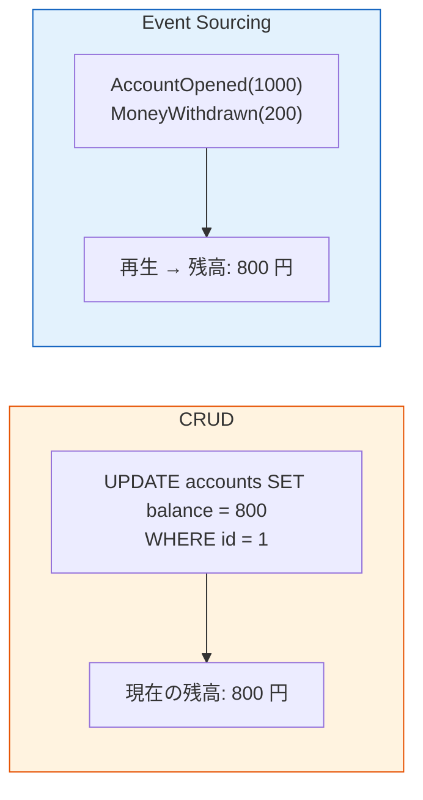
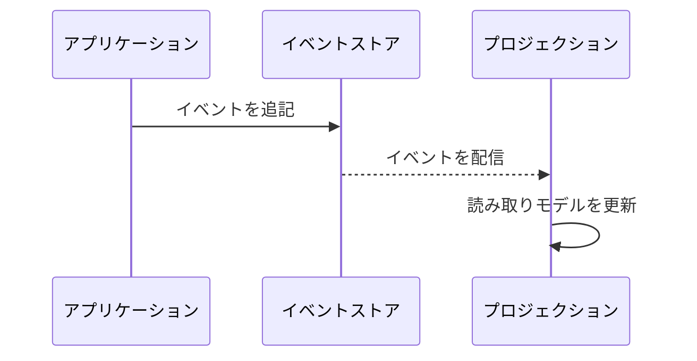
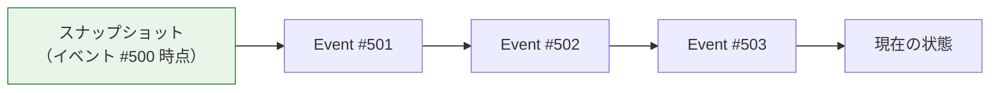
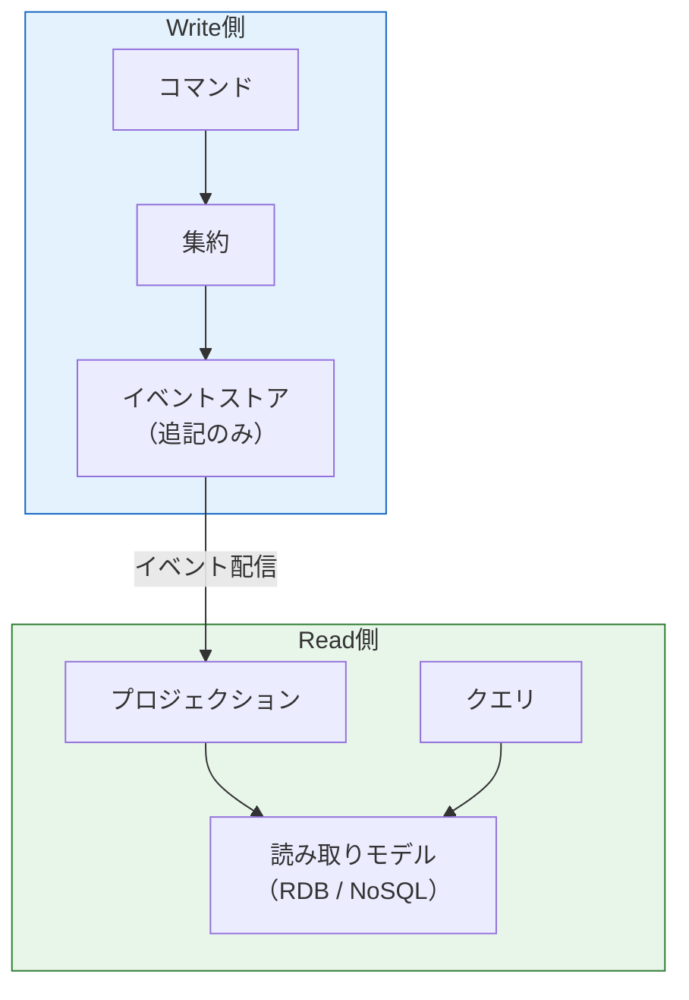

# イベントソーシング（Event Sourcing）

> **一言で言うと:** 状態そのものではなく「状態変化を表すイベントの列」を永続化し、イベントを再生（replay）することで任意の時点の状態を導出するパターン。従来の CRUD が「最新の状態を上書き保存」するのに対し、イベントソーシングは「変化の履歴を追記保存」する。

## 概念

### CRUD との対比



| 観点 | CRUD | Event Sourcing |
|------|------|----------------|
| 永続化対象 | 現在の状態（最新行） | イベントの列（追記のみ） |
| 履歴 | 失われる（上書き） | 完全に保持される |
| 監査ログ | 別途構築が必要 | イベント自体が監査ログ |
| 複雑さ | 低い | 高い（再生・プロジェクション・スキーマ進化） |
| 適用場面 | 大多数のアプリケーション | 監査・履歴・複雑なドメインが要件にある場合 |

### イベントストア（Event Store）

イベントを時系列に格納する専用のストレージ。各イベントは不変（immutable）であり、追記のみ（append-only）が原則。



### 集約の状態復元（Replay）

集約（Aggregate）の現在の状態は、その集約に属するイベントを初期状態から順に適用（apply）することで導出する。

```
初期状態 → apply(AccountOpened) → apply(MoneyDeposited) → apply(MoneyWithdrawn) → 現在の状態
```

### スナップショット（Snapshot）

イベント数が増えると再生コストが増大する。一定間隔で「ある時点の状態」をスナップショットとして保存し、それ以降のイベントだけを再生することでパフォーマンスを最適化する。



## コード例

### TypeScript — 銀行口座

```typescript
// --- イベント定義 ---
type AccountEvent =
  | { type: "AccountOpened"; initialBalance: number; at: Date }
  | { type: "MoneyDeposited"; amount: number; at: Date }
  | { type: "MoneyWithdrawn"; amount: number; at: Date };

// --- 集約の状態 ---
interface AccountState {
  balance: number;
  isOpen: boolean;
}

const initialState: AccountState = { balance: 0, isOpen: false };

// --- apply: イベントを適用して状態を変化させる ---
function apply(state: AccountState, event: AccountEvent): AccountState {
  switch (event.type) {
    case "AccountOpened":
      return { balance: event.initialBalance, isOpen: true };
    case "MoneyDeposited":
      return { ...state, balance: state.balance + event.amount };
    case "MoneyWithdrawn":
      return { ...state, balance: state.balance - event.amount };
  }
}

// --- 状態復元: イベント列を再生 ---
function restore(events: AccountEvent[]): AccountState {
  return events.reduce(apply, initialState);
}

// --- 使用例 ---
const events: AccountEvent[] = [
  { type: "AccountOpened", initialBalance: 1000, at: new Date("2026-01-01") },
  { type: "MoneyDeposited", amount: 500, at: new Date("2026-01-15") },
  { type: "MoneyWithdrawn", amount: 200, at: new Date("2026-02-01") },
];

const current = restore(events);
console.log(current); // { balance: 1300, isOpen: true }
```

### Go — インターフェースベース

```go
package account

import "time"

// --- イベント定義 ---
type Event interface {
	EventType() string
	OccurredAt() time.Time
}

type AccountOpened struct {
	InitialBalance int
	At             time.Time
}
func (e AccountOpened) EventType() string    { return "AccountOpened" }
func (e AccountOpened) OccurredAt() time.Time { return e.At }

type MoneyDeposited struct {
	Amount int
	At     time.Time
}
func (e MoneyDeposited) EventType() string    { return "MoneyDeposited" }
func (e MoneyDeposited) OccurredAt() time.Time { return e.At }

type MoneyWithdrawn struct {
	Amount int
	At     time.Time
}
func (e MoneyWithdrawn) EventType() string    { return "MoneyWithdrawn" }
func (e MoneyWithdrawn) OccurredAt() time.Time { return e.At }

// --- 集約 ---
type Account struct {
	Balance int
	IsOpen  bool
}

// Apply はイベントを適用して状態を変化させる
func (a *Account) Apply(event Event) {
	switch e := event.(type) {
	case AccountOpened:
		a.Balance = e.InitialBalance
		a.IsOpen = true
	case MoneyDeposited:
		a.Balance += e.Amount
	case MoneyWithdrawn:
		a.Balance -= e.Amount
	}
}

// Restore はイベント列から状態を復元する
func Restore(events []Event) *Account {
	a := &Account{}
	for _, e := range events {
		a.Apply(e)
	}
	return a
}
```

### Python — dataclass でイベント定義

```python
from dataclasses import dataclass
from datetime import datetime
from functools import reduce

# Python 3.10+（match 文・ユニオン型構文を使用）

# --- イベント定義 ---
@dataclass(frozen=True)
class AccountOpened:
    initial_balance: int
    at: datetime

@dataclass(frozen=True)
class MoneyDeposited:
    amount: int
    at: datetime

@dataclass(frozen=True)
class MoneyWithdrawn:
    amount: int
    at: datetime

AccountEvent = AccountOpened | MoneyDeposited | MoneyWithdrawn

# --- 集約の状態 ---
@dataclass
class AccountState:
    balance: int = 0
    is_open: bool = False

# --- apply: イベントを適用して状態を変化させる ---
def apply(state: AccountState, event: AccountEvent) -> AccountState:
    match event:
        case AccountOpened(initial_balance=bal):
            return AccountState(balance=bal, is_open=True)
        case MoneyDeposited(amount=amt):
            return AccountState(balance=state.balance + amt, is_open=state.is_open)
        case MoneyWithdrawn(amount=amt):
            return AccountState(balance=state.balance - amt, is_open=state.is_open)

# --- 状態復元 ---
def restore(events: list[AccountEvent]) -> AccountState:
    return reduce(apply, events, AccountState())

# --- 使用例 ---
events = [
    AccountOpened(initial_balance=1000, at=datetime(2026, 1, 1)),
    MoneyDeposited(amount=500, at=datetime(2026, 1, 15)),
    MoneyWithdrawn(amount=200, at=datetime(2026, 2, 1)),
]

current = restore(events)
print(current)  # AccountState(balance=1300, is_open=True)
```

## CQRS との組み合わせ

イベントソーシングは [[イベント駆動-CQRS]] の Write 側として自然に組み合わせられる。



| 側 | 役割 | 特徴 |
|----|------|------|
| Write（Command） | イベントをイベントストアに追記 | 正規化不要。追記のみで高速 |
| Read（Query） | プロジェクションで読み取りモデルを構築 | クエリに最適化した非正規化テーブル |

### プロジェクションと結果整合性（Eventual Consistency）

プロジェクションはイベントを非同期に処理して読み取りモデルを更新する。そのため Write 直後に Read すると最新の状態が反映されていない場合がある。これが結果整合性であり、イベントソーシング + CQRS を採用する場合に受け入れるべきトレードオフ。

## イベントストアの選択肢

| 選択肢 | 特徴 | 適用場面 |
|--------|------|----------|
| **EventStoreDB（現 KurrentDB）** | イベントソーシング専用 DB。ストリーム・サブスクリプション・プロジェクションを組み込みでサポート | イベントソーシングを本格的に採用する場合 |
| **PostgreSQL + イベントテーブル** | `events` テーブルに `aggregate_id`, `type`, `payload`, `version`, `created_at` を格納。既存の [[RDB]] 知識で運用可能 | 小〜中規模。チームに RDB の運用知識がある場合 |
| **Apache Kafka** | ストリーム処理基盤。パーティションによるスケーラビリティが高い。ただしイベントストアとしては集約単位の読み出しが不得意 | マイクロサービス間のイベント配信基盤として |

### PostgreSQL でのイベントテーブル例

```sql
CREATE TABLE events (
    id            BIGSERIAL PRIMARY KEY,
    aggregate_id  UUID NOT NULL,
    aggregate_type VARCHAR(100) NOT NULL,
    event_type    VARCHAR(100) NOT NULL,
    payload       JSONB NOT NULL,
    version       INT NOT NULL,
    created_at    TIMESTAMPTZ NOT NULL DEFAULT NOW(),
    UNIQUE (aggregate_id, version)  -- 楽観的同時実行制御
);

CREATE INDEX idx_events_aggregate ON events (aggregate_id, version);
```

`UNIQUE (aggregate_id, version)` により、同一集約に対して同じバージョンのイベントが重複して書き込まれることを防ぐ。これは楽観的ロック（Optimistic Locking）として機能する。

## 落とし穴

### イベントスキーマの進化（バージョニング）

イベントは不変であるため、過去に保存したイベントの構造を変更できない。スキーマを変える場合はアップキャスティング（upcasting）で古いイベントを新しいバージョンに変換する。

```typescript
// v1 → v2 へのアップキャスト例
function upcast(event: MoneyWithdrawnV1): MoneyWithdrawnV2 {
  return {
    type: "MoneyWithdrawn",
    version: 2,
    amount: event.amount,
    reason: "unknown", // v1 には存在しなかったフィールド
    at: event.at,
  };
}
```

**対策:** イベントにはバージョン番号を含め、読み込み時にアップキャスターを通す設計にしておく。

### イベント数の増大とスナップショット戦略

数百万のイベントを毎回再生するのは現実的でない。

**対策:**
- N イベントごと（例: 100 件）にスナップショットを保存する
- スナップショットからの差分イベントだけを再生する
- スナップショットの保存は非同期で行っても問題ない

### 全てのドメインに必要なわけではない

イベントソーシングは強力だが複雑さも大きい。**多くのアプリケーションでは通常の CRUD で十分**。以下のような要件がある場合にのみ検討すべき。

- 完全な監査証跡（Audit Trail）が必須
- 状態の時系列分析が必要（「3ヶ月前の状態に戻して確認したい」）
- 複雑なドメインロジックで、なぜその状態になったかの追跡が重要

### GDPR とイベントの削除

イベントは不変・追記のみが原則だが、GDPR（一般データ保護規則）等では個人データの削除権（Right to Erasure）が求められる。

**対策:**
- **暗号消去（Crypto Shredding）:** 個人データをユーザー固有の鍵で暗号化し、削除要求時に鍵を破棄する。イベント自体は残るがデータは復号不能になる
- 個人データをイベント外に格納し、イベントからは ID のみ参照する

## 関連トピック

- [[イベント駆動-CQRS]] — CQRS パターンとの組み合わせ
- [[RDB]] — PostgreSQL をイベントストアとして使う場合の基盤
- [[NoSQL]] — 読み取りモデルの格納先として
- [[テスト戦略]] — イベントベースのテスト（Given events → When command → Then events）

## 参考リソース

- Martin Kleppmann『*Designing Data-Intensive Applications*』— Chapter 11: Stream Processing
- Eric Evans『*Domain-Driven Design*』— 集約・ドメインイベントの概念的基盤
- Greg Young の講演・ブログ — CQRS の命名者であり、Event Sourcing パターンの普及に最も貢献した人物。"CQRS Documents" が原典
- [EventStoreDB（現 KurrentDB）公式ドキュメント](https://developers.eventstore.com/) — 専用 DB の設計思想と API リファレンス
