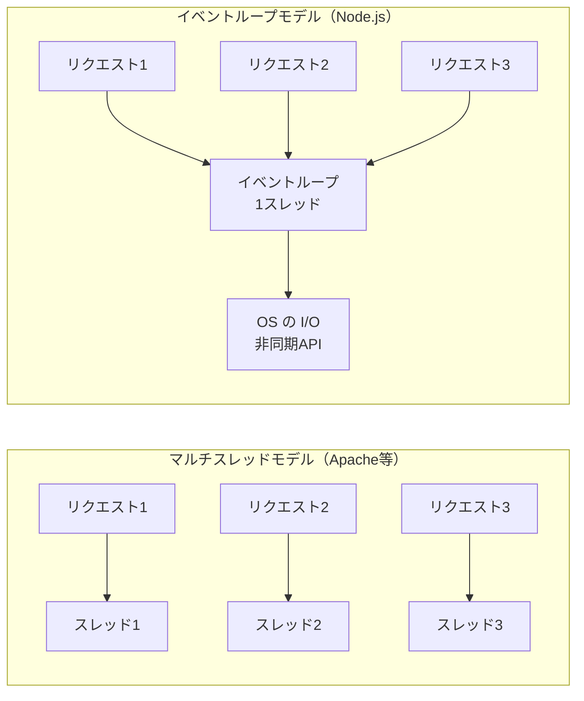
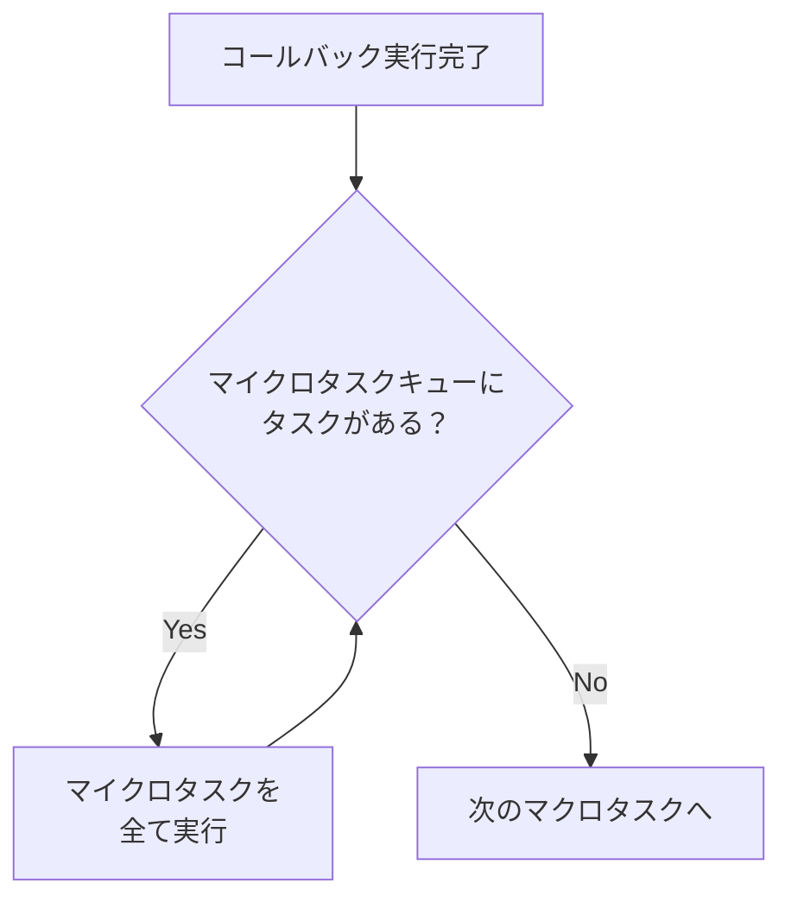

# イベントループ（Event Loop）

> **一言で言うと:** シングルスレッドで大量の I/O を同時に捌く仕組み。「待っている間に別の仕事をする」ことで、スレッドを増やさずに並行処理を実現する。

## 概念

### マルチスレッド vs イベントループ

従来のWebサーバー（Apache など）はリクエストごとにスレッドを割り当てる。Node.js は1つのスレッドで全リクエストを処理する。



| モデル | 同時接続1万の場合 | メモリ消費 | CPU バウンド処理 |
|--------|-----------------|-----------|----------------|
| マルチスレッド | スレッド1万本（各 ~1MB スタック） | ~10GB | 各スレッドで処理 |
| イベントループ | スレッド1本 + 非同期 I/O | ~数十MB | ブロックする（後述） |

### イベントループの動作

Node.js のイベントループは以下のフェーズを繰り返す:

```
   ┌───────────────────────────┐
┌─>│        timers              │  setTimeout, setInterval のコールバック
│  └──────────┬────────────────┘
│  ┌──────────┴────────────────┐
│  │     pending callbacks     │  OS レベルのコールバック
│  └──────────┬────────────────┘
│  ┌──────────┴────────────────┐
│  │        poll               │  I/O イベントの取得・実行（ここで大半の時間を過ごす）
│  └──────────┬────────────────┘
│  ┌──────────┴────────────────┐
│  │        check              │  setImmediate のコールバック
│  └──────────┬────────────────┘
│  ┌──────────┴────────────────┐
│  │     close callbacks       │  socket.on('close') 等
│  └──────────┬────────────────┘
└─────────────┘
```

**重要:** 各フェーズで実行されるコールバックはすべて**同期的に完了するまで**次のコールバックは実行されない。1つのコールバックが長時間ブロックすると、全てのリクエスト処理が停止する。

### マイクロタスクとマクロタスク



| 種類 | 例 | 優先度 |
|------|-----|--------|
| マイクロタスク | `Promise.then()`, `queueMicrotask()`, `process.nextTick()` | 高（現在のタスク直後に実行） |
| マクロタスク | `setTimeout()`, `setInterval()`, `setImmediate()`, I/O コールバック | 低（次のループ反復で実行） |

## コード例

### JavaScript — ブロッキングの問題

```javascript
const http = require("http");

const server = http.createServer((req, res) => {
  if (req.url === "/slow") {
    // ❌ CPU バウンドな処理がイベントループをブロック
    // この間、他の全リクエストが待たされる
    let sum = 0;
    for (let i = 0; i < 1e9; i++) sum += i;
    res.end(`sum: ${sum}`);
  } else {
    // 通常のリクエストも /slow の処理中は応答できない
    res.end("hello");
  }
});

server.listen(3000);
```

```javascript
// ✅ CPU バウンドな処理は Worker Threads に逃がす
const { Worker, isMainThread, parentPort } = require("worker_threads");

if (isMainThread) {
  const http = require("http");
  const server = http.createServer((req, res) => {
    if (req.url === "/slow") {
      const worker = new Worker(__filename);
      worker.on("message", (result) => res.end(`sum: ${result}`));
    } else {
      res.end("hello"); // /slow の処理中もこちらは即座に応答できる
    }
  });
  server.listen(3000);
} else {
  let sum = 0;
  for (let i = 0; i < 1e9; i++) sum += i;
  parentPort.postMessage(sum);
}
```

### JavaScript — マイクロタスク vs マクロタスクの実行順序

```javascript
console.log("1: 同期");

setTimeout(() => console.log("2: setTimeout（マクロタスク）"), 0);

Promise.resolve().then(() => console.log("3: Promise.then（マイクロタスク）"));

queueMicrotask(() => console.log("4: queueMicrotask（マイクロタスク）"));

console.log("5: 同期");

// 出力順序:
// 1: 同期
// 5: 同期
// 3: Promise.then（マイクロタスク）
// 4: queueMicrotask（マイクロタスク）
// 2: setTimeout（マクロタスク）
```

### Python — asyncio のイベントループ

```python
import asyncio
import time

async def fetch_data(name: str, delay: float) -> str:
    print(f"{name}: 開始")
    await asyncio.sleep(delay)  # I/O 待ちをシミュレート（ブロックしない）
    print(f"{name}: 完了")
    return f"{name} のデータ"

async def main():
    start = time.time()

    # ✅ 並行実行: 合計時間 ≈ 最長の1つ分（2秒）
    results = await asyncio.gather(
        fetch_data("API-1", 1.0),
        fetch_data("API-2", 2.0),
        fetch_data("API-3", 0.5),
    )

    print(f"結果: {results}")
    print(f"経過時間: {time.time() - start:.1f}秒")  # ≈ 2.0秒

asyncio.run(main())
```

## ブラウザのイベントループ

ブラウザの JavaScript も同じイベントループモデルだが、**レンダリング**が絡む点が異なる。

```
マクロタスク → マイクロタスク全消化 → レンダリング（必要なら）→ 次のマクロタスク
```

長時間のスクリプト実行はレンダリングもブロックするため、画面がフリーズする。これが「UI スレッドをブロックするな」と言われる理由。

## よくある落とし穴

1. **`await` の逐次実行** — 独立した非同期処理を `await` で1つずつ待つと、並行性の利点が消える。`Promise.all()` で並行実行する。
2. **同期的な JSON パース** — `JSON.parse()` は同期処理。巨大な JSON（数十MB）をパースするとイベントループがブロックされる。ストリーミングパーサーの使用を検討する。
3. **マイクロタスクの無限生成** — `Promise.then()` 内でさらに Promise を resolve し続けると、マイクロタスクが永遠に消化されず、マクロタスクに進めなくなる。
4. **Node.js で `fs.readFileSync` を使う** — `Sync` 系の API はイベントループをブロックする。サーバー起動時以外は非同期版（`fs.readFile` / `fs.promises.readFile`）を使う。

## AIによる実装のアンチパターン

| アンチパターン | なぜ問題か | 対策 |
|---|---|---|
| **全ての `await` を `try-catch` で個別に囲む** | コードが冗長になり、共通のエラーハンドリングが散在する | `Promise.all()` をまとめて try-catch するか、Express のエラーハンドリングミドルウェアに委ねる |
| **`setTimeout(fn, 0)` で「非同期化」する** | マクロタスクキューに送るだけで CPU バウンドな処理は依然ブロックする | CPU バウンドな処理は Worker Threads に分離する |

## 関連トピック

- [[HTTP-HTTPS]] — 親トピック。Node.js の HTTP サーバーはイベントループで動作する
- [[並行性の基本概念]] — イベントループはシングルスレッドによる並行処理モデル
- [[プロセスとスレッド]] — Worker Threads、マルチプロセスとの比較
- [[非同期処理とメッセージキュー]] — 言語レベルの非同期とインフラレベルの非同期の違い
