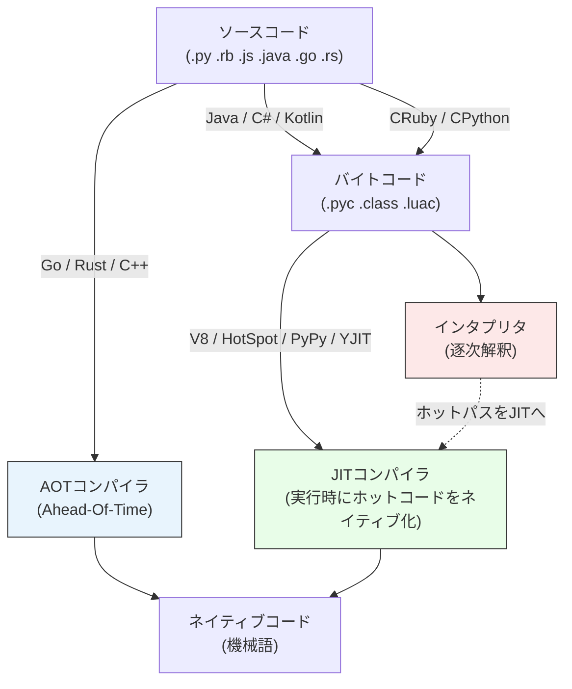

# インタプリタ・コンパイラ・JIT（Interpreter / Compiler / JIT）

> **一言で言うと:** プログラミング言語の実行方式は「事前にネイティブコードへ変換するAOTコンパイラ」「実行時にソース/バイトコードを逐次解釈するインタプリタ」「両者のハイブリッドであるJIT（Just-In-Time）コンパイラ」の3軸で整理でき、起動時間・ピーク性能・配布容易性・メモリ消費のトレードオフがWeb開発の言語選定や[[Webサーバーとランタイムのリクエスト処理モデル]]、サーバーレスのコールドスタートに直結する。

## 全体マップ



実際の言語は「ソースを直接逐次解釈する純粋インタプリタ」ではなく、CRuby や CPython を含むほとんどが**ソース→バイトコード→仮想マシン（VM）上で解釈実行**という段階を経る（配布ファイルは `.rb`/`.py` ソースのままでも、内部では YARV 命令列や `.pyc` に変換されている）。その上で「ホットな関数をJITでネイティブ化するか」「事前にすべてネイティブ化するか」で分岐する。

## 各方式の特徴

| 観点 | AOTコンパイラ | バイトコードVM（純インタプリタ） | JITコンパイラ |
|---|---|---|---|
| **代表例** | Go, Rust, C, C++, Swift | CRuby（〜3.0）, CPython（〜3.12）, PHP（〜7.4 は純Zend VM） | V8 (JS), HotSpot (Java), PyPy, LuaJIT, .NET CLR, PHP 8+ (OPcache JIT), Ruby 3.1+ (YJIT) |
| **起動時間** | 最速（既にネイティブ） | 速い（VM起動のみ） | 中〜遅い（JITウォームアップが必要） |
| **ピーク性能** | 最速 | 遅い（1〜2桁の差） | 長時間稼働ならAOT並み |
| **メモリ消費** | 小 | 小〜中 | 大（コードキャッシュ + プロファイラ） |
| **配布物** | 単一バイナリ（可搬性高） | ランタイム必須 | ランタイム必須 |
| **動的機能** | 制限あり（リフレクション弱い） | 強い（eval, monkey patch） | 強い（ただしdeoptで性能劣化） |
| **デバッグ容易性** | スタックトレースは読みやすいが実行時検査は弱い | 強い（REPL, eval） | 中（JITコードのトレースは難しい） |

### 1. AOT（Ahead-Of-Time）コンパイラ

**仕組み:** ソースコードをビルド時にすべて機械語へ変換し、単一バイナリとして配布する。

**Web開発での意味:**
- **コールドスタート（cold start）最速** — Go/Rust製のLambda関数は数十msで起動できる。Node.js/Python/Javaは数百ms〜数秒かかる
- **[[Docker]]イメージが小さい** — ランタイム不要なので scratch や distroless ベースで数MB〜数十MBに収まる
- **型情報がコンパイル時に消える** — Goのリフレクションは限定的、Rustは実行時型情報をほぼ持たない

### 2. バイトコードVM + 純インタプリタ

**仕組み:** ソースをバイトコード（中間表現）に変換し、VMが1命令ずつ解釈実行する。ネイティブコードは生成しない。

**代表例:**
- **CPython** — `.pyc` にコンパイルして `ceval.c` の巨大 switch 文でディスパッチ。Python 3.11 以降は Specializing Adaptive Interpreter（PEP 659）で高速化。3.13 で copy-and-patch 方式の JIT（PEP 744）が実験的に導入されたが、3.13 時点では性能向上よりも JIT 基盤の整備が主目的で、本格的な高速化は 3.14 以降の目標
- **CRuby (MRI, Matz's Ruby Interpreter)** — YARV（Yet Another Ruby VM）。Ruby 3.1（2021年12月）以降は YJIT（当初 Basic Block Versioning ベース、3.2 で Rust 実装に刷新）がオプションで利用可能
- **PHP (Zend VM)** — リクエスト終了ごとにメモリを破棄する Shared Nothing モデルと相性が良い（[[メモリ管理]]参照）。ただし **PHP 8.0（2020年）以降は OPcache に Tracing JIT / Function JIT が組み込まれており、有効化すれば CPU-bound 処理を高速化できる**（Web リクエスト処理では効果が限定的なため既定では無効）

**トレードオフ:** JITがないためCPU-bound処理は遅いが、起動が速く、リクエスト単位の処理モデル（PHP-FPM など）とは相性が良い。

### 3. JIT（Just-In-Time）コンパイラ

**仕組み:** 最初はインタプリタで実行し、頻繁に呼ばれる「ホットな」関数やループを実行時に機械語へコンパイルする。プロファイル情報を使って投機的最適化を行う。

**代表例:**
- **V8 (JavaScript)** — 現行は Ignition（インタプリタ）→ Sparkplug（非最適化ベースラインJIT、2021年追加）→ Maglev（中間最適化JIT、2023年追加）→ TurboFan（最上位最適化JIT）の4階層
- **HotSpot JVM (Java)** — Level 0（インタプリタ）→ Level 1〜3（C1 の3段階、プロファイリング情報の収集量で分岐）→ Level 4（C2、最上位最適化）の **5段階 tiered compilation**
- **PyPy** — CPythonと同じ意味論で動くがトレーシングJITで5〜10倍高速
- **LuaJIT** — 動的言語で最速クラスのJIT実装

**特徴的な挙動:**
- **ウォームアップ（warm-up）** — 起動直後は遅く、数秒〜数分の実行で本来の性能に達する。ベンチマークで「最初の1000回を捨てる」のはこのため
- **デオプティマイゼーション（Deoptimization）** — 投機的に最適化した前提（「この変数は常に整数」等）が崩れると、インタプリタに戻って再コンパイルする
- **コードキャッシュの膨張** — JITで生成した機械語を保持するためメモリを食う。Javaの `-XX:ReservedCodeCacheSize` などで制御

## コード例

### Python: バイトコードを覗く（純インタプリタ）

```python
import dis

def greet(name: str) -> str:
    return f"hello, {name}"

dis.dis(greet)
# LOAD_CONST, LOAD_FAST, FORMAT_VALUE, BUILD_STRING, RETURN_VALUE ...
# CPython はこれらを ceval.c の switch で逐次実行する
```

### Java: tiered JITの挙動を観察

```java
// java -XX:+PrintCompilation Main.java
// 出力例:
//  142   1   n   java.lang.Object::<init> (1 bytes)
//  156   2   b   java.lang.String::hashCode (55 bytes)
//  180   3 % !   Main::hotLoop @ 5 (40 bytes)   ← % = OSR, ! = 例外ハンドラ
// 数字は tiered level (0=インタプリタ, 1〜3=C1, 4=C2)。ループが回るとレベルが上がる

public class Main {
  static long hotLoop(long n) {
    long sum = 0;
    for (long i = 0; i < n; i++) sum += i * i;  // 何度も回ると C2 にコンパイルされる
    return sum;
  }
  public static void main(String[] args) {
    for (int i = 0; i < 10; i++) hotLoop(1_000_000);
  }
}
```

### Go: AOTコンパイルと単一バイナリ

```go
// main.go
package main

import "fmt"

func main() {
    fmt.Println("hello")
}
```

```bash
# ビルド時にすべて機械語化。ランタイムは含まれるが外部依存なし
go build -ldflags="-s -w" -o app main.go
./app         # 起動は即座（数ms）
file app      # ELF 64-bit executable, statically linked
ls -lh app    # 2MB 程度（distroless や scratch イメージで配布できる）
```

### JavaScript (V8): JITウォームアップを見る

```javascript
// node --trace-opt --trace-deopt bench.js
function compute(a, b) {
  return a * a + b * b;
}

// 最初の数回はインタプリタ（Ignition）
for (let i = 0; i < 100; i++) compute(i, i);

// 数千回呼ぶとTurboFanで最適化される
for (let i = 0; i < 100000; i++) compute(i, i);

// 型が変わるとdeopt: "optimized" → "deoptimized"
compute("str", "ing");  // 想定外の型 → ベースラインに戻る
```

## よくある落とし穴

### 1. 「インタプリタ言語は必ず遅い」は不正確

PyPy（Python）やV8（JS）はJITによりC++の数倍以内に収まるケースもある。逆にCRuby（YJIT off）やCPythonは純インタプリタのため確かに遅い。**「言語」ではなく「実装」で性能が決まる**。

### 2. JITベンチマークでウォームアップを無視する

起動直後の1回目だけ計測して「Javaは遅い」と結論付けるのは間違い。JMH（Java Microbenchmark Harness）のようなツールはウォームアップ期間を明示的に挟む。

### 3. サーバーレスでJIT言語を使う落とし穴

Lambda などのサーバーレスは関数実行ごとにコンテナが生成・破棄されうる。JVM や .NET のJITウォームアップ時間がそのままコールドスタートに現れ、Go/Rust と比べて数倍のレイテンシになる。**GraalVM Native Image** や **CRaC（Coordinated Restore at Checkpoint）** はこの問題の対策技術。

### 4. 「コンパイラ言語なら型安全」は別問題

AOTかJITか（実行方式）と、静的型付けか動的型付けか（型システム）は独立した軸。TypeScript は静的型だがJS（JIT）にトランスパイルされるし、Lisp は動的型だがAOTコンパイルされる実装もある。

### 5. `eval` や動的ロードのJIT無効化

V8 や HotSpot は `eval`、動的クラスロード、リフレクションを多用する関数に対して最適化を諦める（またはdeoptする）ことがある。ホットパスでの動的メタプログラミングは性能の罠。

## 実務での使用シーン

- **サーバーレス関数 (Lambda/Cloud Run)** — 起動頻度が低いならGo/Rust（AOT）。常時ウォームならJava/Node.jsでも問題なし
- **CLIツール** — 起動時間が直接UXなのでGo/Rustが好まれる（`ripgrep`, `fd`, `bat`, `gh` 等）
- **長時間稼働のAPIサーバー** — JVM系やV8（Node.js）は起動後のピーク性能でGo/Rustに肉薄する
- **データ処理バッチ** — PyPyやNumPy（C拡張）で純Pythonのボトルネックを回避
- **エッジコンピューティング** — [[エッジコンピューティング|CloudflareWorkers]] は V8 isolate を再利用することでJITウォームアップを事実上スキップする

## 他の仕組みとどう関係するか

- [[メモリ管理]] — JIT ランタイムはコードキャッシュや投機的最適化のプロファイル情報で追加メモリを消費し、長期稼働で膨らむことがある。AOT はこの種のランタイム起因の増加が原理的に発生しない（ただし[[メモリリーク]]自体は GC の有無や手動管理の誤りで起きるため、実行方式とは独立した軸であることに注意）
- [[Webサーバーとランタイムのリクエスト処理モデル]] — PHPのShared Nothing モデルは純インタプリタ + リクエスト単位GCという組み合わせで成立している
- [[Docker]] — distroless / scratch イメージはAOT言語でこそ真価を発揮する
- [[Goのポインタ]] — Goのエスケープ解析はAOTコンパイラだからこそ実行できる静的最適化

## AIによる実装のアンチパターン

| アンチパターン | なぜ問題か | 対策 |
|---|---|---|
| ベンチマーク1回の結果で言語を選定 | JITはウォームアップ後に性能が大きく変わる。初回だけ見ると誤った結論になる | JMHやHyperfineなど、ウォームアップと反復を明示するツールを使う |
| Lambda で大規模なJVMアプリをコールド運用 | 起動が数秒かかりp99レイテンシを悪化させる | Provisioned Concurrency、GraalVM Native Image、Go/Rustへの書き換えを検討 |
| Python/RubyでCPU-bound処理を純実装 | Python の GIL・Ruby の GVL（Global VM Lock）でスレッド並列化が効かず、さらに純インタプリタで単スレッド性能も出ない | NumPy/Cython/Rust拡張、PyPy、Ruby 3.1+ の YJIT、Ruby 3.0+ の Ractor 等を検討 |
| JIT言語で`eval`を多用 | 投機的最適化がdeoptされホットパスが遅くなる | 静的なコードパスに書き換える |

## 参考リソース

- [V8 Blog: Ignition and TurboFan](https://v8.dev/blog/launching-ignition-and-turbofan) — V8の階層JITの解説
- [The Java HotSpot Performance Engine](https://www.oracle.com/technetwork/java/whitepaper-135217.html) — HotSpot JVMの設計思想
- [PyPy: How it works](https://doc.pypy.org/en/latest/architecture.html) — トレーシングJITの実装
- 書籍: 『Crafting Interpreters』Robert Nystrom著 — ツリーウォークインタプリタからバイトコードVMまでを実装しながら学ぶ定番書
