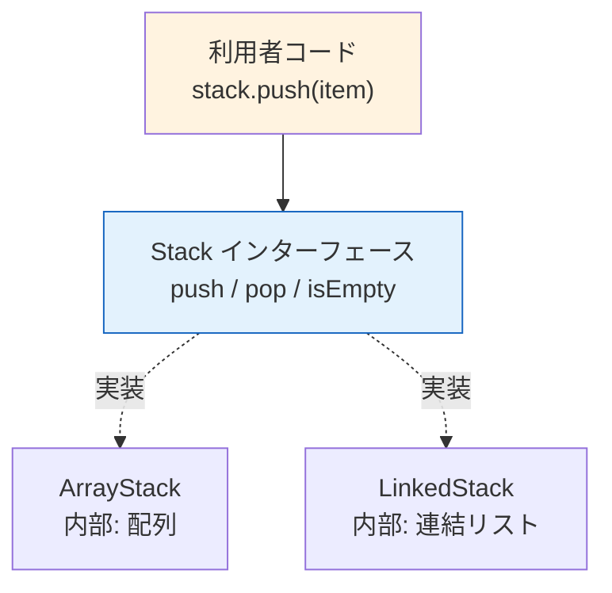
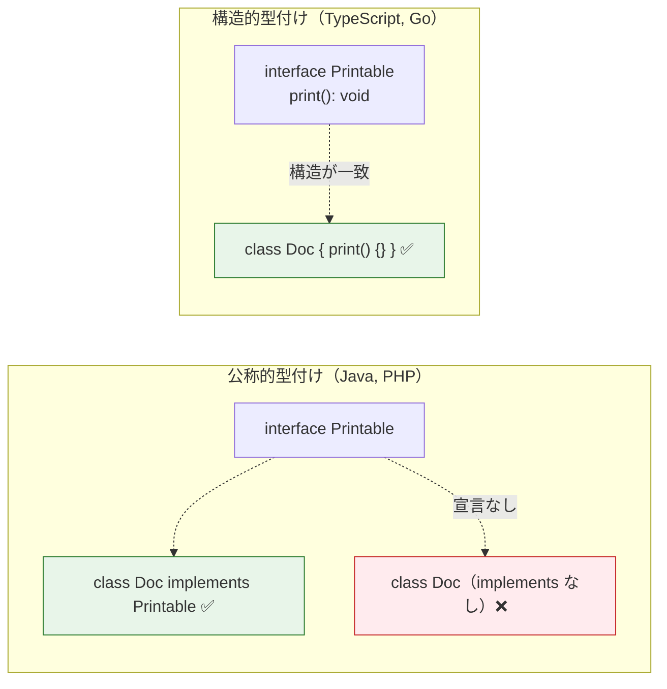

# インターフェース（Interface）

> **一言で言うと:** 「何ができるか」の契約だけを定義し、「どうやるか」の実装を持たない型。データ構造の文脈では抽象データ型（ADT）の仕様にあたり、同じ操作セットに対して複数の実装を差し替え可能にする仕組み。

## なぜ必要か

データ構造を選ぶとき、重要なのは「どんな操作が必要か」であって「内部がどう実装されているか」ではない。

```
スタック（Stack）という「契約」:
  push(item)  — 要素を積む
  pop(): item — 最後に積んだ要素を取り出す
  isEmpty(): boolean

この契約を満たす「実装」は複数ありうる:
  ArrayStack  — 配列で実装。メモリ連続、キャッシュ効率が良い
  LinkedStack — 連結リストで実装。サイズ上限なし、リサイズ不要
```

インターフェースは、この「契約」をコードとして形式化する仕組みである。利用者はインターフェースにのみ依存するため、実装を差し替えてもコードの変更が不要になる。



これはコンピュータサイエンスにおける**抽象データ型（Abstract Data Type / ADT）**の考え方そのものである。ADT は操作の仕様（what）を定義し、具体的なデータ構造（how）はその実装にあたる。

## 構造的型付けと公称的型付け

インターフェースの「満たし方」は言語によって根本的に異なる。

| 方式 | 仕組み | 言語 |
|------|--------|------|
| 公称的型付け（Nominal Typing） | `implements` や `extends` を**明示的に宣言**しないと型を満たさない | Java, PHP, C# |
| 構造的型付け（Structural Typing） | 必要なプロパティ・メソッドを**持っていれば**自動的に型を満たす | TypeScript, Go |



Go のインターフェースは構造的型付けの代表例で、"If it walks like a duck and quacks like a duck, it's a duck"（ダックタイピング）を型安全に実現している。

## インターフェースと抽象クラスの違い

両者は「実装を持たない仕様の定義」という点で似ているが、設計上の役割が異なる。

| 観点 | インターフェース | 抽象クラス |
|------|----------------|-----------|
| 状態（フィールド） | 持たない | 持てる |
| 実装 | 持たない（※言語によりデフォルト実装可） | 一部持てる（テンプレートメソッド等） |
| 多重継承 | 可能（複数 implements） | 不可（多くの言語で単一継承） |
| 関係性 | 「何ができるか」（can-do） | 「何であるか」（is-a） |
| 結合度 | 低い | 高い |

```typescript
// インターフェース: 「シリアライズできる」という能力
interface Serializable {
  serialize(): string;
}

// 抽象クラス: 「データストア」という存在（共通ロジックを持つ）
abstract class DataStore {
  abstract get(key: string): unknown;
  abstract set(key: string, value: unknown): void;

  // 共通実装 — サブクラスが継承する
  has(key: string): boolean {
    return this.get(key) !== undefined;
  }
}
```

**判断基準:** 共通の状態やロジックを共有したいなら抽象クラス、能力や契約だけを定義したいならインターフェース。迷ったらインターフェースを選ぶ方が結合度が低く安全。

## コード例

### TypeScript — 構造的型付けのインターフェース

```typescript
// データ構造の ADT をインターフェースで定義
interface Stack<T> {
  push(item: T): void;
  pop(): T | undefined;
  peek(): T | undefined;
  readonly size: number;
}

// 実装1: 配列ベース
class ArrayStack<T> implements Stack<T> {
  private items: T[] = [];

  push(item: T): void { this.items.push(item); }
  pop(): T | undefined { return this.items.pop(); }
  peek(): T | undefined { return this.items.at(-1); }
  get size(): number { return this.items.length; }
}

// ノード型を別途定義（TypeScript は自身のプロパティ型注釈内で typeof this を使えない）
interface StackNode<T> {
  value: T;
  next: StackNode<T> | null;
}

// 実装2: 連結リストベース
class LinkedStack<T> implements Stack<T> {
  private head: StackNode<T> | null = null;
  private _size = 0;

  push(item: T): void {
    this.head = { value: item, next: this.head };
    this._size++;
  }
  pop(): T | undefined {
    if (!this.head) return undefined;
    const value = this.head.value;
    this.head = this.head.next;
    this._size--;
    return value;
  }
  peek(): T | undefined { return this.head?.value; }
  get size(): number { return this._size; }
}

// 利用者は Stack<T> にのみ依存 — 実装を差し替え可能
function reverseArray<T>(arr: T[], stack: Stack<T>): T[] {
  for (const item of arr) stack.push(item);
  return arr.map(() => stack.pop()!);
}

reverseArray([1, 2, 3], new ArrayStack());
reverseArray([1, 2, 3], new LinkedStack()); // 同じ結果
```

TypeScript は構造的型付けなので、`implements Stack<T>` の宣言は省略しても構造が一致していれば型チェックは通る。ただし明示的に書くことで意図を伝え、実装漏れを早期に検出できる。

### Go — 暗黙的インターフェース

```go
package main

import "fmt"

// インターフェースの定義 — 小さく保つのが Go の流儀
type Reader interface {
	Read(p []byte) (n int, err error)
}

type Writer interface {
	Write(p []byte) (n int, err error)
}

// インターフェースの合成（Composition）
type ReadWriter interface {
	Reader
	Writer
}

// 構造体は implements を書かない — メソッドを持てば自動的に満たす
type Buffer struct {
	data []byte
}

func (b *Buffer) Read(p []byte) (int, error) {
	n := copy(p, b.data)
	b.data = b.data[n:]
	return n, nil
}

func (b *Buffer) Write(p []byte) (int, error) {
	b.data = append(b.data, p...)
	return len(p), nil
}

// ReadWriter を受け取る関数 — Buffer を渡せる
func Process(rw ReadWriter) {
	rw.Write([]byte("hello"))
	buf := make([]byte, 5)
	rw.Read(buf)
	fmt.Println(string(buf)) // "hello"
}

func main() {
	Process(&Buffer{})
}
```

Go の標準ライブラリは `io.Reader`（1メソッド）、`io.Writer`（1メソッド）のように極めて小さなインターフェースを定義し、合成で組み合わせる。これはインターフェース分離原則（ISP）の徹底した適用例。

### PHP — 公称的型付けのインターフェース

```php
<?php

// インターフェース定義
interface Collection
{
    public function add(mixed $item): void;
    public function contains(mixed $item): bool;
    public function count(): int;
}

// 配列ベースの実装
class ArrayCollection implements Collection
{
    private array $items = [];

    public function add(mixed $item): void
    {
        $this->items[] = $item;
    }

    public function contains(mixed $item): bool
    {
        return in_array($item, $this->items, true);
    }

    public function count(): int
    {
        return count($this->items);
    }
}

// ユニーク制約付きの実装
class UniqueCollection implements Collection
{
    private array $items = [];

    public function add(mixed $item): void
    {
        if (!$this->contains($item)) {
            $this->items[] = $item;
        }
    }

    public function contains(mixed $item): bool
    {
        return in_array($item, $this->items, true);
    }

    public function count(): int
    {
        return count($this->items);
    }
}

// 型宣言でインターフェースに依存
function summarize(Collection $collection): string
{
    return "Count: {$collection->count()}";
}
```

### Python — プロトコル（構造的型付け）と ABC（公称的型付け）

```python
from typing import Protocol, runtime_checkable
from abc import ABC, abstractmethod

# --- 方法1: Protocol（構造的型付け、Python 3.8+） ---
# @runtime_checkable を付けると isinstance() で判定可能になる
@runtime_checkable
class Sortable(Protocol):
    def __lt__(self, other: "Sortable") -> bool: ...

def minimum(a: Sortable, b: Sortable) -> Sortable:
    return a if a < b else b

# int は __lt__ を持つので Sortable を自動的に満たす
minimum(3, 5)      # OK
minimum("a", "z")  # OK

# --- 方法2: ABC（公称的型付け） ---
class Repository(ABC):
    @abstractmethod
    def find(self, id: str) -> dict | None: ...

    @abstractmethod
    def save(self, entity: dict) -> None: ...

class InMemoryRepository(Repository):
    def __init__(self) -> None:
        self._store: dict[str, dict] = {}

    def find(self, id: str) -> dict | None:
        return self._store.get(id)

    def save(self, entity: dict) -> None:
        self._store[entity["id"]] = entity
```

Python は `Protocol`（構造的）と `ABC`（公称的）の両方を提供しており、用途に応じて使い分けられる。外部ライブラリの型を制約したい場合は `Protocol`、自プロジェクト内の契約を明示したい場合は `ABC` が適している。

## よくある落とし穴

### 1. 巨大インターフェース（Fat Interface）

```typescript
// ❌ 全てを1つに詰め込む
interface UserService {
  getUser(id: string): User;
  createUser(data: CreateUserDto): User;
  updateUser(id: string, data: UpdateUserDto): User;
  deleteUser(id: string): void;
  sendEmail(userId: string, subject: string): void;
  exportToCsv(userIds: string[]): Buffer;
  generateReport(startDate: Date, endDate: Date): Report;
}

// ✅ 役割ごとに分割する
interface UserReader { getUser(id: string): User; }
interface UserWriter {
  createUser(data: CreateUserDto): User;
  updateUser(id: string, data: UpdateUserDto): User;
  deleteUser(id: string): void;
}
interface UserNotifier { sendEmail(userId: string, subject: string): void; }
```

利用者が必要な部分だけに依存できるようにする。Go 標準ライブラリの `io.Reader` / `io.Writer` が模範例。

### 2. 実装が1つしかないのにインターフェースを作る

```typescript
// ❌ 実装が1つだけなのにインターフェースを挟む
interface IUserRepository { findById(id: string): User | null; }
class UserRepository implements IUserRepository {
  findById(id: string): User | null { /* ... */ }
}

// ✅ テストで差し替える予定がなければ、具象クラスを直接使えばよい
class UserRepository {
  findById(id: string): User | null { /* ... */ }
}
```

インターフェースは「差し替えが必要な場面」で導入する。テストでモックに差し替える、複数の実装を切り替えるなどの具体的な理由がないなら不要。

### 3. Go で利用側ではなく実装側にインターフェースを定義する

```go
// ❌ 実装パッケージでインターフェースを定義
// package mysql
type Repository interface { // ← mysql パッケージ内で定義
    FindUser(id string) (*User, error)
}
type Client struct{}
func (c *Client) FindUser(id string) (*User, error) { /* ... */ }

// ✅ 利用側で必要な分だけインターフェースを定義
// package handler
type UserFinder interface { // ← 利用するパッケージで定義
    FindUser(id string) (*User, error)
}
func NewHandler(finder UserFinder) *Handler { /* ... */ }
```

Go では「Accept interfaces, return structs（インターフェースを受け取り、構造体を返す）」が定石。利用側が必要とするメソッドだけを含む小さなインターフェースを、利用側パッケージに定義する。

### 4. インターフェースと型の混同（TypeScript）

```typescript
// interface と type はほぼ同じことができるが、使い分けの慣習がある
// interface: オブジェクトの形状定義、extends で拡張可能
interface User {
  id: string;
  name: string;
}
interface Admin extends User {
  role: "admin";
}

// type: ユニオン型、交差型、プリミティブのエイリアスなど
type Result<T> = { ok: true; value: T } | { ok: false; error: Error };
type ID = string | number;
```

一般的な慣習: オブジェクトの形状には `interface`、ユニオン型やユーティリティ型には `type` を使う。プロジェクト内で統一されていることが最も重要。

## AIによる実装のアンチパターン

| アンチパターン | なぜ問題か | 対策 |
|---|---|---|
| **全てに `I` プレフィックスを付ける** — `IUserService`, `IRepository` のようにインターフェースに `I` を付ける | C# では .NET 命名ガイドラインの現行規約だが、TypeScript や Go では推奨されない。言語の慣習を無視して一律に適用すると、命名規則だけで抽象と実装を区別する悪習になる | 言語の慣習に従う。TypeScript / Go ではプレフィックスなしで命名し、実装側に具体名を付ける（`UserService` → `PostgresUserService`） |
| **儀式的なインターフェース生成** — 全てのクラスに対応するインターフェースを自動生成する | 実装と1対1対応するインターフェースは抽象化として機能していない。コードベースのファイル数が倍増し、変更時の修正箇所も増える | 差し替えの必要性が生じてからインターフェースを抽出する |
| **getter/setter の羅列をインターフェースにする** — `getName()`, `setName()`, `getEmail()`, `setEmail()` をインターフェースとして定義 | 振る舞いではなくデータ構造をインターフェース化しているだけ。単なる型定義（TypeScript なら `type`）で十分 | 振る舞い（操作・能力）のみをインターフェースとして定義する |

## 関連トピック

- [[データ構造とアルゴリズム]] — インターフェースは ADT（抽象データ型）をコードに落とし込む手段。同じインターフェースに対して異なるデータ構造の実装を選択できる
- [[ジェネリクス]] — インターフェースと組み合わせて型安全かつ汎用的な契約を定義する（例: `Comparable<T>`, `Iterable<T>`）
- [[ポリモーフィズムとストラテジーパターン]] — サブタイプ多態性の基盤がインターフェース。ストラテジーパターンはインターフェースによる振る舞いの差し替え
- [[SOLID原則]] — ISP（インターフェース分離原則）と DIP（依存性逆転原則）がインターフェースの設計指針を与える

## 参考リソース

- [TypeScript Handbook — Interfaces](https://www.typescriptlang.org/docs/handbook/2/objects.html) — TypeScript のオブジェクト型とインターフェース
- [Go Blog — Interfaces](https://go.dev/blog/interfaces) — Go における暗黙的インターフェースの設計思想
- [Go Wiki — Accept interfaces, return structs](https://go.dev/wiki/CodeReviewComments#interfaces) — Go のインターフェース設計の定石
