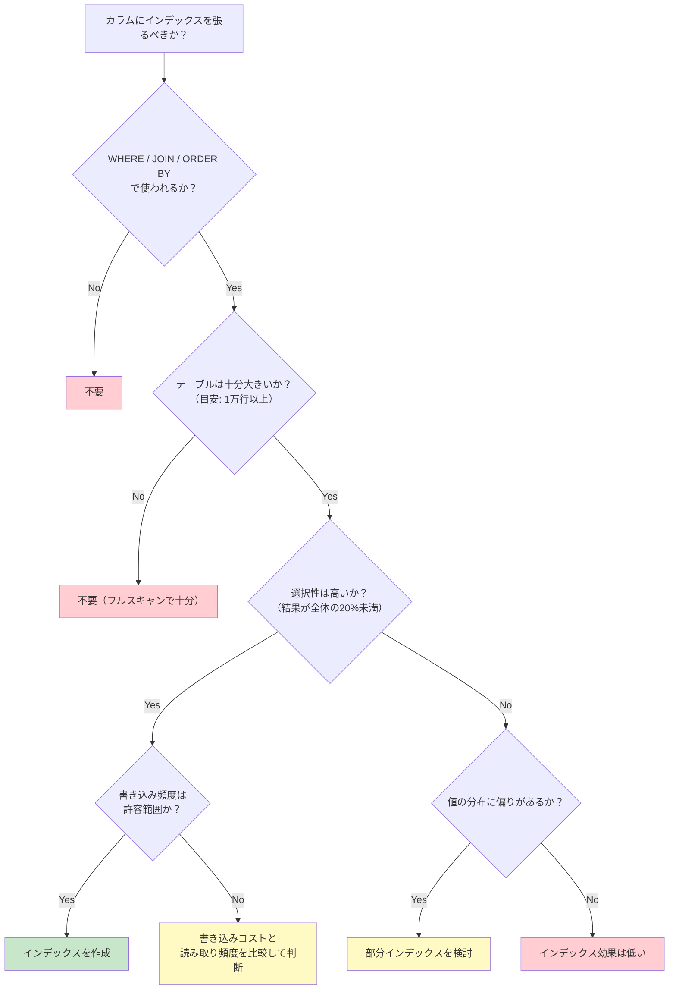
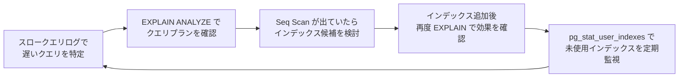

# インデックス設計の判断基準（Index Design Decision Criteria）

> **一言で言うと:** 「どのカラムにインデックスを張るか」は、テーブル構造ではなく実際に発行されるクエリパターンから逆算して決める。闇雲に張るのではなく、選択性・クエリ頻度・書き込み負荷の3軸で判断する。

## インデックスを張るべきカラム

### 1. 外部キー（Foreign Key）

JOINの結合条件とカスケード削除（`ON DELETE CASCADE`）の両方でスキャンが発生するため、外部キーカラムにはほぼ必ずインデックスが必要。PostgreSQLは外部キー制約を作っても自動でインデックスを作成しない（MySQLのInnoDBは自動作成する）。

```sql
-- PostgreSQL: 外部キーには明示的にインデックスを作る
ALTER TABLE orders ADD CONSTRAINT fk_orders_user FOREIGN KEY (user_id) REFERENCES users(id);
CREATE INDEX idx_orders_user_id ON orders (user_id);
```

### 2. WHERE句で頻出する検索条件カラム

アプリケーションが繰り返し検索するカラムがインデックスの最優先候補。

| ユースケース | カラム例 | 理由 |
|------------|---------|------|
| ユーザー検索 | `email`, `username` | ログイン・プロフィール表示で毎回使う |
| ステータスフィルタ | `status`, `is_active` | 一覧画面で条件絞り込みに使う |
| 日時範囲検索 | `created_at`, `updated_at` | 「直近7日」「月次集計」等の範囲クエリ |
| テナント分離 | `tenant_id`, `organization_id` | マルチテナントSaaSで全クエリに付く条件 |

### 3. ORDER BY / GROUP BY 対象カラム

インデックスがなければ全件取得後にメモリ上でソート（filesort）が必要になる。特に `ORDER BY ... LIMIT N` パターンはインデックスの恩恵が大きい。

```sql
-- created_at にインデックスがあれば、末尾からN件読むだけで済む
SELECT * FROM posts WHERE published = TRUE ORDER BY created_at DESC LIMIT 20;
```

### 4. JOINの結合条件カラム

外部キーに限らず、結合に使われるカラムにはインデックスが有効。特に被駆動テーブル（JOIN の右側）のカラム。

```sql
-- tags.post_id にインデックスがないと、posts の各行に対して tags を全件スキャンする
SELECT p.title, t.name
FROM posts p
JOIN tags t ON t.post_id = p.id
WHERE p.user_id = 1;
```

### 5. 高選択性（High Selectivity）のカラム

選択性（Selectivity）= ユニーク値の数 / 全行数。1に近いほどインデックスの効果が高い。

| カラム例 | 選択性 | インデックス効果 |
|---------|--------|----------------|
| `email`（UNIQUE） | 1.0 | 極めて高い |
| `user_id`（多対一） | 0.01〜0.5 | 高い |
| `status`（数種類） | 0.0001程度 | 単体では低い → 部分インデックスで対処 |
| `gender`（2〜3種類） | 極めて低い | 通常は不要 |

### 6. 低選択性でも部分インデックス（Partial Index）で有効なケース

値の分布が偏っている場合、少数派だけにインデックスを張ると効果的。

```sql
-- 全体の95%が processed、5%が pending なら pending だけにインデックス
CREATE INDEX idx_orders_pending ON orders (created_at) WHERE status = 'pending';

-- boolean型でも同様：99%がFALSEなら TRUE だけ
CREATE INDEX idx_users_admin ON users (id) WHERE is_admin = TRUE;
```

## インデックスを張らなくてよいケース

### 1. 小さなテーブル

数百〜数千行程度のテーブルはフルスキャンでも十分高速。インデックスのメンテナンスコストの方が大きくなる場合がある。データベースのオプティマイザも小さなテーブルではインデックスを無視してSeq Scanを選ぶことが多い。

### 2. 書き込みが支配的なテーブル

ログテーブルやイベントストリームのように INSERT が大量で、SELECT がバッチ処理のみのテーブルでは、インデックスが書き込み性能を著しく劣化させる。

```
INSERT 1行のコスト:
  インデックス 0個 → テーブル書き込みのみ
  インデックス 5個 → テーブル + 5つのB+Tree更新
  インデックス10個 → テーブル + 10のB+Tree更新（INSERT性能が半減することも）
```

### 3. ほぼ全行を返すクエリ

テーブルの大部分（目安として20%以上）を返すクエリでは、インデックス経由のランダムI/OよりフルスキャンのシーケンシャルI/Oの方が速い。オプティマイザもこの場合はインデックスを使わない判断をする。

### 4. 頻繁にUPDATEされるカラム

`UPDATE` のたびにインデックスのB+Treeも再構築される。更新頻度が高いカラムにインデックスを張ると、書き込みコストが増大する。

## 判断フローチャート



## 複合インデックスの設計指針

複合インデックスのカラム順序は性能に直結する。以下の優先順位で左から並べる:

1. **等値条件（`=`）のカラム** — 最も絞り込み効果が高い
2. **範囲条件（`>`, `<`, `BETWEEN`）のカラム** — 等値条件の後に配置
3. **ORDER BY のカラム** — ソートコストを回避するために末尾に配置

```sql
-- ユースケース: ユーザーの注文をステータス別に新しい順で表示
-- クエリ: WHERE user_id = ? AND status = ? ORDER BY created_at DESC

-- ✅ 最適な順序: 等値(user_id) → 等値(status) → ソート(created_at)
CREATE INDEX idx_orders_user_status_created
    ON orders (user_id, status, created_at DESC);

-- ❌ 範囲条件を先に置くと、後続カラムが活用できない
CREATE INDEX idx_bad ON orders (created_at, user_id, status);
```

## 実務での確認サイクル



### PostgreSQL — 未使用インデックスの監視

```sql
SELECT indexrelname, idx_scan, pg_size_pretty(pg_relation_size(indexrelid)) AS size
FROM pg_stat_user_indexes
WHERE idx_scan = 0
  AND indexrelname NOT LIKE '%_pkey'
ORDER BY pg_relation_size(indexrelid) DESC;
```

### MySQL — インデックス使用状況の確認

```sql
-- MySQL 8.0+ の sys スキーマで未使用インデックスを検出
SELECT * FROM sys.schema_unused_indexes
WHERE object_schema = 'mydb';
```

## よくある落とし穴

### 1. ORM任せでインデックスを意識しない

ORMが生成するSQLは開発者が意図しないクエリパターンになることがある。`N+1` クエリ問題でインデックスが張られていないカラムに大量のクエリが飛ぶケースが典型的。

```typescript
// ❌ N+1: users を取得後、各 user の orders を個別に取得
const users = await User.findAll();
for (const user of users) {
  const orders = await Order.findAll({ where: { userId: user.id } });
  // orders.user_id にインデックスがなければ毎回フルスキャン
}

// ✅ Eager loading + インデックスで解決
const users = await User.findAll({ include: [Order] });
// → SELECT * FROM orders WHERE user_id IN (1, 2, 3, ...)
// → idx_orders_user_id が効く
```

### 2. 本番環境で無停止インデックス追加を忘れる

通常の `CREATE INDEX` はテーブル全体にロックを取る。本番の大きなテーブルでは必ず非ブロッキングオプションを使う。

```sql
-- PostgreSQL: CONCURRENTLY でロックを回避
CREATE INDEX CONCURRENTLY idx_orders_email ON orders (email);

-- MySQL: ALGORITHM=INPLACE, LOCK=NONE で並行DMLを許可
ALTER TABLE orders ADD INDEX idx_orders_email (email) ALGORITHM=INPLACE, LOCK=NONE;
```

### 3. マイグレーションツールのデフォルトに頼る

多くのORMのマイグレーションツールは `CREATE INDEX`（ブロッキング）をデフォルトで生成する。本番適用前にマイグレーションSQLを確認し、必要に応じて手動で `CONCURRENTLY` や `ALGORITHM=INPLACE, LOCK=NONE` に書き換える。
