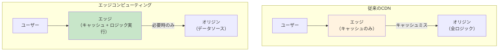
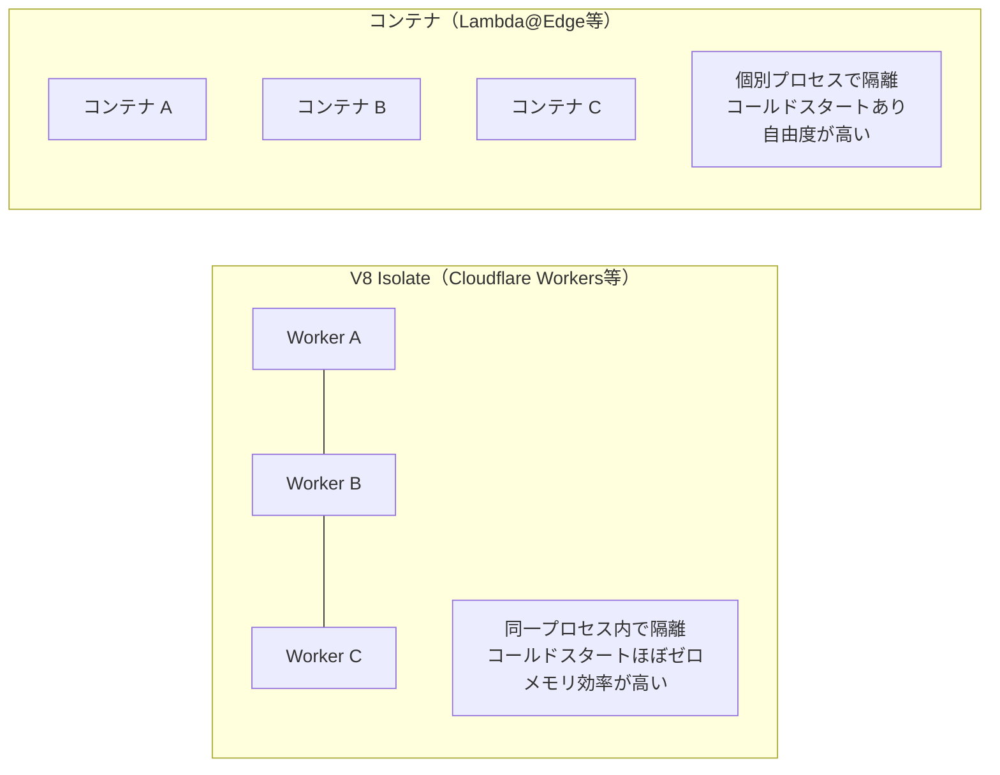
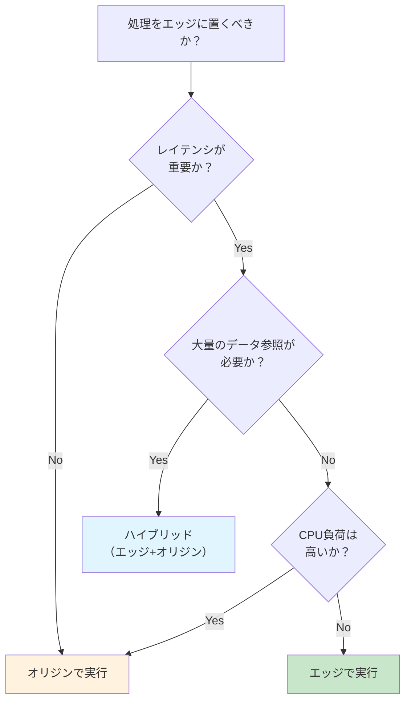

# エッジコンピューティング（Edge Computing）

> **一言で言うと:** CDNのエッジサーバー上でアプリケーションロジックを実行する技術。静的コンテンツの配信だけでなく、動的な処理をユーザーの近くで行うことでレイテンシを削減し、オリジンサーバーの負荷を軽減する。

## 従来のCDNとの違い

従来のCDNは「キャッシュされたファイルを返す」だけの存在だった。エッジコンピューティングはこのエッジサーバー上に**計算能力**を追加し、リクエストの処理・変換・生成をエッジで行えるようにする。



## 主要なエッジコンピューティングプラットフォーム

| プラットフォーム | ランタイム | コールドスタート | 制約 |
|---|---|---|---|
| **Cloudflare Workers** | V8 Isolate（JavaScript/WASM） | ほぼゼロ（< 1ms） | CPU時間10-50ms（プランによる）、メモリ128MB |
| **AWS Lambda@Edge** | Node.js, Python | 数百ms〜数秒 | 実行時間5秒（Viewer）/ 30秒（Origin）、パッケージ1-50MB |
| **AWS CloudFront Functions** | JavaScript（Runtime 1.0: ES5.1+ES6-9一部 / Runtime 2.0: ES6-12対応） | ほぼゼロ | 実行時間1ms以下、機能制限大（ネットワークI/O不可） |
| **Vercel Edge Functions** | V8 Isolate（Web API互換） | ほぼゼロ | Web標準APIに準拠、Node.js APIの一部のみ |
| **Deno Deploy** | V8 Isolate（Deno） | ほぼゼロ | Deno互換API、npmパッケージ利用可 |
| **Fastly Compute** | WASM（Rust, Go, JS等） | ほぼゼロ | WASM対応言語、独自SDK |

### V8 Isolate vs コンテナ

エッジコンピューティングの実行環境は大きく2種類に分かれる。



- **V8 Isolate**: Chrome V8エンジンの軽量サンドボックス内でコードを実行。プロセス起動が不要なためコールドスタートがほぼゼロ。ただしNode.js APIの一部（ファイルシステム等）は使えない
- **コンテナ**: 通常のLambda相当の環境。自由度は高いがコールドスタートが発生する

## 実務での使用シーン

### 1. A/Bテストとパーソナライゼーション

```typescript
// Cloudflare Workers: エッジでA/Bテストの振り分け
export default {
  async fetch(request: Request): Promise<Response> {
    const url = new URL(request.url);

    // CookieでA/B群を判定（既存ユーザー）
    const cookie = request.headers.get('Cookie') || '';
    let variant = cookie.match(/ab_variant=(A|B)/)?.[1];

    // 新規ユーザーはランダムに振り分け
    if (!variant) {
      variant = Math.random() < 0.5 ? 'A' : 'B';
    }

    // バリアントに応じたオリジンにリクエストを転送
    const origin = variant === 'A'
      ? 'https://origin-a.example.com'
      : 'https://origin-b.example.com';

    const response = await fetch(origin + url.pathname, request);
    const newResponse = new Response(response.body, response);

    // 振り分け結果をCookieに保存
    newResponse.headers.append('Set-Cookie',
      `ab_variant=${variant}; Path=/; Max-Age=86400; SameSite=Lax`);

    return newResponse;
  },
};
```

### 2. 地理情報に基づくルーティング

```typescript
// Cloudflare Workers: 国別コンテンツの出し分け
export default {
  async fetch(request: Request): Promise<Response> {
    // Cloudflareが付与する地理情報（cf オブジェクト）
    const country = (request as any).cf?.country || 'US';
    const city = (request as any).cf?.city || 'Unknown';

    // 日本からのアクセスは日本語ページへリダイレクト
    if (country === 'JP' && !request.url.includes('/ja/')) {
      return Response.redirect(
        new URL('/ja' + new URL(request.url).pathname, request.url).toString(),
        302
      );
    }

    // レスポンスヘッダーに地理情報を追加（デバッグ用）
    const response = await fetch(request);
    const newResponse = new Response(response.body, response);
    newResponse.headers.set('X-Edge-Country', country);
    newResponse.headers.set('X-Edge-City', city);

    return newResponse;
  },
};
```

### 3. APIレスポンスのエッジキャッシュ

```typescript
// Cloudflare Workers: APIレスポンスをエッジでキャッシュ
export default {
  async fetch(request: Request): Promise<Response> {
    const cache = caches.default;
    const cacheKey = new Request(request.url, { method: 'GET' });

    // キャッシュヒット確認
    let response = await cache.match(cacheKey);
    if (response) {
      return new Response(response.body, {
        ...response,
        headers: { ...Object.fromEntries(response.headers), 'X-Cache': 'HIT' },
      });
    }

    // キャッシュミス: オリジンに問い合わせ
    response = await fetch(request);
    const body = await response.text();

    // キャッシュに保存（60秒TTL）
    const cachedResponse = new Response(body, {
      headers: {
        ...Object.fromEntries(response.headers),
        'Cache-Control': 'public, max-age=60',
        'X-Cache': 'MISS',
      },
    });
    // waitUntilでレスポンス返却後にキャッシュ書き込み
    (globalThis as any).waitUntil?.(cache.put(cacheKey, cachedResponse.clone()));

    return cachedResponse;
  },
};
```

### 4. Lambda@Edge でのヘッダー操作（Python）

```python
# Lambda@Edge: CloudFront Viewer Responseイベントでセキュリティヘッダーを追加
def lambda_handler(event, context):
    response = event['Records'][0]['cf']['response']
    headers = response['headers']

    # セキュリティヘッダーをエッジで一括追加
    headers['strict-transport-security'] = [{
        'key': 'Strict-Transport-Security',
        'value': 'max-age=63072000; includeSubDomains; preload'
    }]
    headers['x-content-type-options'] = [{
        'key': 'X-Content-Type-Options',
        'value': 'nosniff'
    }]
    headers['x-frame-options'] = [{
        'key': 'X-Frame-Options',
        'value': 'DENY'
    }]

    return response
```

## エッジコンピューティングの適用判断



**エッジに向くもの:**
- ヘッダーの追加・変換（セキュリティヘッダー、CORS）
- リダイレクト・リライト
- A/Bテストの振り分け
- 地理情報に基づくルーティング
- 認証トークンの検証（JWT等）
- 軽量なAPIレスポンスのキャッシュ・変換

**エッジに向かないもの:**
- 大量のDB読み書き（エッジからDBへのレイテンシが問題に）
- 重い計算処理（CPU時間制限に抵触）
- 大きなライブラリやフレームワークの実行（バンドルサイズ制限）

## よくある落とし穴

### 1. エッジからオリジンDBへの接続がボトルネック

エッジでロジックを実行しても、データベースがオリジンリージョンにあればDB問い合わせのレイテンシは変わらない。解決策としてグローバル分散DB（PlanetScale, CockroachDB, Cloudflare D1, Turso等）やエッジKV（Cloudflare KV, Vercel KV）を検討する。

### 2. Node.js APIがそのまま使えると思い込む

V8 Isolateベースのエッジランタイムでは `fs`, `child_process`, `net` 等のNode.js固有APIは使えない。Web標準API（`fetch`, `Request`, `Response`, `crypto.subtle`等）ベースで開発する必要がある。npmパッケージもNode.js APIに依存しているものは動作しない。

### 3. コールドスタートの見積もり違い

Lambda@Edgeのコールドスタートは数百ms〜数秒かかる場合がある。LCPに影響するリクエストパスにLambda@Edgeを置くと、コールドスタート時にパフォーマンスが大幅に悪化する。コールドスタートがほぼゼロのV8 Isolateベース（Cloudflare Workers等）を検討する。

### 4. デバッグとテストの困難さ

エッジ環境のローカル再現が難しい。`wrangler dev`（Cloudflare）や`vercel dev`（Vercel）等のローカルエミュレーターを活用し、本番との差異に注意する。

## 関連トピック

- [[CDN]] --- 親トピック。エッジコンピューティングはCDNの計算能力拡張
- [[ロードバランシング]] --- エッジでのルーティング判断はグローバルなロードバランシングの一形態
- [[キャッシュ戦略]] --- エッジキャッシュの制御はCache-Controlヘッダーとの連携が必要
- [[CoreWebVitals]] --- エッジでのSSRやレスポンス最適化はLCP改善に直結
- [[CORS]] --- CORSヘッダーのエッジでの付与・制御
