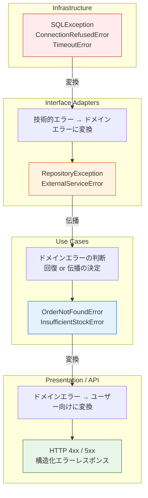
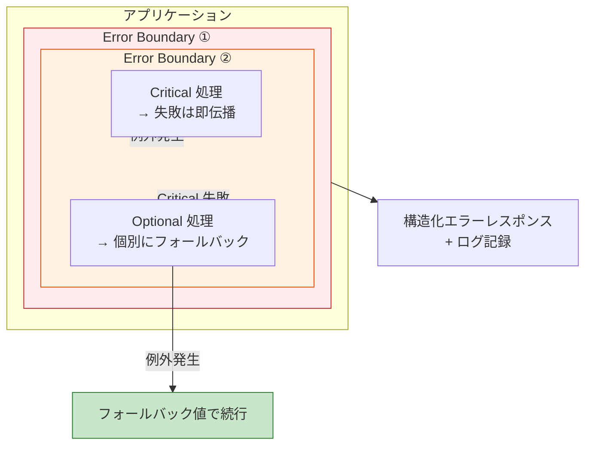

# エラーハンドリングとフォールバックの設計戦略（Error Handling & Fallback Design Strategy）

> **一言で言うと:** エラーハンドリングは横断的関心事（Cross-Cutting Concern）であり、各アーキテクチャ層がどのエラーを・どこで・どう処理するかを設計レベルで決定する必要がある。「全部 try-catch する」のではなく、**エラーの変換・伝播・回復の責務を層ごとに分離する**ことが本質。

## なぜ「設計」が必要か — 実装だけでは解決しない問題

エラーハンドリングを個々の関数やハンドラに任せると、以下の問題が発生する:

| 問題 | 原因 | 設計レベルの解決策 |
|------|------|-------------------|
| エラー処理の散在 | 各ハンドラが独自の catch ロジックを持つ | エラーハンドリングの**集約ポイント**を設計する |
| エラーの隠蔽 | catch で握りつぶして処理を続行する | エラー**伝播のルール**を定める |
| 抽象の漏洩 | DB 例外がそのまま API レスポンスに露出する | 層境界での**エラー変換**を設計する |
| 回復戦略の不統一 | リトライ・フォールバック・中断の判断が場当たり的 | 機能を**Critical/Optional に分類**する |

## エラーの流れ — 層をまたぐ伝播と変換

アーキテクチャの各層は、エラーに対して異なる責務を持つ。[[クリーンアーキテクチャ]]や[[玉ねぎモデル]]では、エラーも依存の方向に従って変換される。



エラーは技術詳細の層（Infrastructure）から発生し、各層で変換されながら最終的に Presentation 層で HTTP レスポンスになる。この図はエラーの**伝播方向**を示しており、[[クリーンアーキテクチャ]]の依存方向（外→内）とは軸が異なる点に注意。

**設計原則:** 各層は隣接する層のエラー型のみを扱い、離れた層の技術的詳細は知らない。`SQLException` が Controller まで到達するのは**抽象の漏洩**であり、層の分離が崩れている証拠。

### 層ごとのエラー責務

| 層 | やるべきこと | やってはいけないこと |
|---|---|---|
| Infrastructure | 技術固有の例外をキャッチし、汎用エラーに変換する | ビジネスロジックの判断をする |
| Adapter | 外部サービスのエラーをドメインのエラーに変換する | HTTP ステータスコードを決定する |
| Use Case | ビジネスルールに基づきリトライ・フォールバック・中断を判断する | 技術固有の例外を直接ハンドリングする |
| Presentation | ドメインエラーを HTTP レスポンスに変換し、ログを記録する | エラーの回復を試みる |

## フォールバックの設計判断

フォールバックを適用するかどうかは、機能の**ビジネス上の重要度（Critical / Optional）**で決まる。この分類は実装時ではなく設計時にチームで合意しておくべき判断であり、各開発者が個別に決めると不統一が生まれる。分類の具体例と実装パターンは [[フォールバックとグレースフルデグラデーション]] を参照。

設計時に決めるべきこと:

1. **機能分類表** — 各機能が Critical か Optional かをドキュメント化する
2. **フォールバック先の定義** — Optional 機能が失敗した場合の代替手段を事前に設計する
3. **データ鮮度の許容範囲** — キャッシュフォールバックを使う場合、何秒（何分）前のデータまで許容するか
4. **フォールバック発動の可観測性** — フォールバックが発動した事実をメトリクスとして記録し、アラートの閾値を設定する

## コード例

### TypeScript — Adapter 層でのエラー変換

このコード例の焦点は **Adapter 層が技術固有の例外をドメインエラーに変換する**部分。Presentation 層でのドメインエラー → HTTP レスポンス変換の実装は [[エラーハンドリング]] の Express コード例を参照。

```typescript
// Use Case 層 — ドメインエラーを定義（内側で型を持つ）
class DomainError extends Error {
  constructor(public readonly code: string, message: string) {
    super(message);
  }
}
class PaymentFailedError extends DomainError {
  constructor(reason: string) {
    super("PAYMENT_FAILED", reason);
  }
}

// Adapter 層 — 外部サービス固有のエラーをドメインエラーに変換
// Use Case は決済プロバイダの存在を知らない
class PaymentGatewayAdapter {
  async charge(amount: number, token: string): Promise<string> {
    try {
      // 外部決済 API の呼び出し（具体的な SDK は Adapter 層に閉じる）
      const result = await paymentClient.createCharge({ amount, source: token });
      return result.id;
    } catch (err: unknown) {
      // 技術固有の例外 → ドメインエラーに変換
      if (err instanceof CardDeclinedError) {
        throw new PaymentFailedError("Card declined");
      }
      if (err instanceof ServiceConnectionError) {
        throw new PaymentFailedError("Payment service temporarily unavailable");
      }
      throw new PaymentFailedError("Unexpected payment error");
    }
  }
}

// Use Case 層 — ビジネスルールとフォールバック判断
class PlaceOrderUseCase {
  constructor(
    private orders: OrderRepository,
    private payment: PaymentGatewayAdapter,
    private recommendations: RecommendationService,
  ) {}

  async execute(input: PlaceOrderInput): Promise<OrderResult> {
    const order = await this.orders.findById(input.orderId);
    if (!order) throw new OrderNotFoundError(input.orderId);

    // Critical: 決済 — PaymentFailedError がそのまま伝播する
    const chargeId = await this.payment.charge(order.total, input.paymentToken);

    // Optional: レコメンド — 失敗しても注文は成立
    let relatedProducts: string[] = [];
    try {
      relatedProducts = await this.recommendations.getRelated(order.productIds);
    } catch (err) {
      console.warn("Recommendations unavailable, degrading gracefully:", err);
    }

    return { orderId: order.id, chargeId, relatedProducts };
  }
}
```

### Go — エラーラッピングによる層間のコンテキスト伝播

Go ではエラーを `%w` でラップすることで、コンテキストを付与しつつ `errors.Is()` での型判別を維持できる。これが層をまたぐエラー変換の Go イディオム。

```go
// Use Case 層 — ドメインエラー（センチネルエラー）
var (
	ErrOrderNotFound = errors.New("order not found")
	ErrPaymentFailed = errors.New("payment failed")
)

// Adapter 層 — 技術エラーをドメインエラーにラップ
type PaymentAdapter struct{}

func (a *PaymentAdapter) Charge(amount int, token string) (string, error) {
	// 外部 API 呼び出し（デモ: 常に失敗）
	err := fmt.Errorf("connection refused")

	// 技術エラーをドメインエラーにラップして返す
	// errors.Is(err, ErrPaymentFailed) で上位層が判別できる
	return "", fmt.Errorf("%w: %v", ErrPaymentFailed, err)
}

// Use Case 層 — ビジネスルールに基づく判断
func PlaceOrder(orderID string, token string) error {
	adapter := &PaymentAdapter{}
	_, err := adapter.Charge(1000, token)
	if err != nil {
		// Critical 機能 → コンテキストを付与して伝播
		return fmt.Errorf("placing order %s: %w", orderID, err)
	}
	return nil
}
```

上位の Presentation 層では `errors.Is()` でドメインエラーの種類を判別し、HTTP ステータスコードに変換する（実装例は [[エラーハンドリング]] の Go コード例を参照）。

### PHP — Adapter 層でのエラー変換

```php
<?php
// Adapter 層 — 外部サービスのエラーをドメインエラーに変換
// app/Adapters/PaymentAdapter.php
class StripePaymentAdapter implements PaymentGateway
{
    public function charge(int $amount, string $token): string
    {
        try {
            // 外部決済 API の呼び出し（具体的な SDK は Adapter 層に閉じる）
            $intent = $this->stripe->paymentIntents->create([
                'amount' => $amount,
                'payment_method' => $token,
                'confirm' => true,
            ]);
            return $intent->id;
        } catch (\Stripe\Exception\CardException $e) {
            // Stripe 固有の例外 → ドメイン例外に変換
            // Use Case は Stripe の存在を知らない
            throw new PaymentFailedException('Card declined');
        } catch (\Stripe\Exception\ApiConnectionException $e) {
            throw new PaymentFailedException('Payment service unavailable');
        }
    }
}
```

Use Case 層は `PaymentGateway` インターフェースにのみ依存し、Stripe 固有の例外型を知らない。Presentation 層でのドメインエラー → HTTP レスポンス変換は [[エラーハンドリング]] の Laravel コード例（`withExceptions`）を参照。

## エラー境界（Error Boundary）の設計

エラー境界とは、「ここでエラーを捕捉して、それ以上の伝播を止める」ポイント。適切なエラー境界の配置がアーキテクチャの安定性を決定する。



**設計原則:**

1. **最外層に必ず1つのグローバル境界を置く** — 未捕捉のエラーがユーザーに生のスタックトレースを見せることを防ぐ
2. **Critical/Optional の分岐点にローカル境界を置く** — Optional 機能の失敗が Critical 機能を巻き込まないようにする
3. **エラー境界では「変換」と「記録」を行う** — エラーの型変換とログ記録をセットで行い、情報の損失を防ぐ

## よくある落とし穴

### 1. 全ての層でエラーを catch して再 throw する

各層で catch → log → throw を繰り返すと、同じエラーが何重にもログに記録される。**エラーのログ記録は1箇所**（通常はグローバルエラーハンドラ）で行い、途中の層はエラーをラップ（コンテキスト付与）して伝播させるだけにする。

### 2. フォールバックの設計判断を実装者に委ねる

「この API が落ちたらどうする？」という判断を各開発者が個別に行うと、Critical 機能にフォールバックを入れてしまったり、Optional 機能でエラーを伝播させてしまったりする。**機能分類表**をチームで合意し、フォールバック方針を事前に決めておく。

### 3. 層境界でのエラー変換を省略する

`SQLException` が Controller に到達し、エラーメッセージにテーブル名やカラム名が含まれるのは、層の分離が機能していない証拠。各層の境界で、上位層が知るべきでない情報を取り除く変換を行う。

### 4. エラー型の爆発

ドメインエラーを細分化しすぎると（`OrderNotFoundError`, `OrderAlreadyCancelledError`, `OrderPaymentPendingError`, ...）、エラー型の管理コストが膨らむ。**呼び出し元が異なる対応をする必要があるか**を基準に、エラーの粒度を決める。

## AIによる実装のアンチパターン

| アンチパターン | なぜ問題か | 対策 |
|---|---|---|
| 各層で独立したログ記録 | 1エラーが3-4行のログになり、調査時にノイズが増える | ログ記録はエラー境界（通常はグローバルハンドラ）に集約 |
| エラーをラップせず再 throw | `throw err` だけだとコンテキスト（どの処理中に・どの入力で）が消える | `fmt.Errorf("context: %w", err)` や `new Error("context", { cause: err })` でラップ |
| エラー型を網羅的に定義 | 使われないエラー型が増え、メンテナンスコストが上がる | 呼び出し元が区別する必要のあるエラーだけ型を分ける |
| Adapter 層でエラー変換せずそのまま伝播 | 技術固有の例外が Use Case に漏洩し、層の分離が崩れる | Adapter 層で必ずドメインエラーに変換する |

## 関連トピック

- [[関心の分離]] — エラーハンドリングは横断的関心事の代表例。ミドルウェアやデコレータで本来のロジックから分離する
- [[エラーハンドリング]] — 実装レベルのエラーハンドリングパターン（ステータスコード、リトライ、構造化レスポンス）
- [[フォールバックとグレースフルデグラデーション]] — フォールバックの実装パターンとサーキットブレーカーとの組み合わせ
- [[クリーンアーキテクチャ]] — 依存性の規則に従ったエラー変換の実践
- [[SOLID原則]] — 依存性逆転の原則（DIP）がエラー型の定義場所を決定する
- [[モニタリング]] — フォールバック発動率やエラー率は可観測性の重要なシグナル

## 参考リソース

- *Release It!* — Michael T. Nygard（安定性パターン: サーキットブレーカー、バルクヘッド、タイムアウト）
- *Clean Architecture* — Robert C. Martin（層間のエラー伝播と依存の方向）
- *A Philosophy of Software Design* — John Ousterhout（例外の扱いと複雑性の管理）
