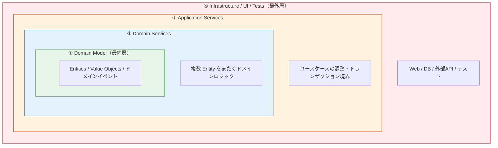

# オニオンアーキテクチャ（Onion Architecture）

> **一言で言うと:** Jeffrey Palermo が 2008 年に提唱した、ドメインモデルを中心に置いた同心円型アーキテクチャ。「インフラへの依存を内側から外側に逆転させる」という思想は[[クリーンアーキテクチャ]]と同じだが、Use Case を独立層とせず、ドメインモデル（DDD のエンティティ・値オブジェクト）を最内層に置く点が異なる。

> **注意:** このページは Jeffrey Palermo の **Onion Architecture（アーキテクチャパターン）** を扱う。Koa 風ミドルウェアの[[玉ねぎモデル]]（リクエストが入れ子で処理される実行モデル）とは別概念。日本語では両方とも「玉ねぎ」と呼ばれることがあり混同されやすい。

## 核心 — ドメインモデルが中心

オニオンアーキテクチャは、伝統的なレイヤードアーキテクチャ（UI → ビジネスロジック → データアクセス）が抱えていた **「ドメインが DB に依存する」問題** への解として生まれた。



依存の方向は **④ → ③ → ② → ①**（外から内へのみ）で、この点は[[クリーンアーキテクチャ]]と完全に一致する。違いは「内側に何を置くか」にある。

| 層 | 役割 | 例 |
|---|---|---|
| ① Domain Model | 永続化・通信・UI から完全に独立したドメインの本体 | `Order`, `Money`, `OrderPlaced` イベント |
| ② Domain Services | 単一 Entity に属さないドメインロジック | `PricingService`（複数商品の価格計算） |
| ③ Application Services | ユースケースのオーケストレーション、トランザクション境界 | `OrderApplicationService.placeOrder()` |
| ④ Infrastructure / UI / Tests | DB 実装、Web フレームワーク、外部 API、テストハーネス | `EfOrderRepository`, `OrderController`, RSpec |

**Palermo の原文の特徴:** Tests を Infrastructure と並ぶ最外層として明示的に図示している。これは「テストもまた一種のアプリケーション利用者である」という DDD 寄りの世界観を反映している。

## クリーンアーキテクチャとの本質的な違い

両者は同じ系譜（同心円・依存性逆転）に属するが、**何を一級市民として扱うか**が異なる。

| 観点 | オニオン（Palermo, 2008） | クリーン（Martin, 2012） |
|------|-------------------------|------------------------|
| 中心に置くもの | **ドメインモデル**（Entity・Value Object） | **Entities + Use Cases** の2層 |
| Use Case の扱い | Application Services 層に**含まれる**（独立した層ではない） | **独立した層**として明示（`PlaceOrderUseCase` など1ユースケース1クラス） |
| Tests の位置付け | 最外層に**明示**（4層図の中に Tests が描かれる） | 図には現れない（ピラミッド戦略は別途） |
| 想定する文脈 | DDD（Eric Evans）と強く結合。エンタープライズ業務システム | より汎用的。CRUD から複雑系まで幅広く適用を想定 |
| 層の数と命名 | Domain Model / Domain Services / Application Services / Infra | Entities / Use Cases / Interface Adapters / Frameworks & Drivers |
| 命名の起源 | DDD 用語をそのまま採用 | OOP の責務単位で命名（Use Case = アプリ固有のルール） |

### 実装上の見え方の違い

同じ「注文をキャンセルする」処理を両者で書くと、**ファイル粒度**に差が出る。

```
オニオン:                          クリーン:
src/                              src/
├── Domain/                       ├── domain/
│   ├── Order.ts                  │   └── Order.ts
│   └── PricingService.ts         ├── usecases/
├── Application/                  │   ├── CancelOrderUseCase.ts    ← 1ユースケース1クラス
│   └── OrderApplicationService   │   └── PlaceOrderUseCase.ts
│       (.cancel, .place ...)     │   └── ports/
└── Infrastructure/               │       └── OrderRepository.ts
    └── EfOrderRepository.ts      └── adapters/
                                      └── PostgresOrderRepository.ts
```

オニオンでは `OrderApplicationService` のような **集約サービス** に複数のユースケースメソッドが集まる傾向がある。クリーンでは `CancelOrderUseCase` `PlaceOrderUseCase` と **ユースケース単位でクラスが分かれる**。これは Single Responsibility Principle の解釈の違いとも言える。

## 同心円型アーキテクチャの系譜

オニオンを単独で覚えるよりも、系譜の中で位置付けると本質が見えやすい。

| 年 | パターン | 提唱者 | 重要な貢献 |
|---|---|---|---|
| 〜1990年代 | レイヤードアーキテクチャ | （伝統的） | 層による分離。ただし Domain が DB に依存しがち |
| 2005 | ヘキサゴナル（Ports & Adapters） | Alistair Cockburn（1994 年に着想、2005 年に文書化） | 「Ports（境界）と Adapters（差し替え可能な実装）」という抽象化。同心円の概念を導入 |
| **2008** | **オニオン** | **Jeffrey Palermo** | **DDD と結合し、ドメインモデルを最内層として明示。同心円を4層で図示** |
| 2012 | クリーン | Robert C. Martin | Use Case を独立層化。「依存性の規則」として原則を明文化 |

> 「ヘキサゴナル → オニオン → クリーン」は **置き換え** ではなく **継承的な発展**。後発のものほど「何を内側に置くか」がより明示的になっている。

Palermo 自身、ブログ記事 *"The Onion Architecture: part 1"* (2008) で、レイヤードアーキテクチャでは「ビジネスロジックがインフラ層を import している」という現実の問題を指摘し、依存方向の反転を提案した。これはほぼヘキサゴナルと同じ着想だが、**DDD の語彙で再構成した**点が広く受け入れられた理由である。

## コード例

### TypeScript — オニオンの構成

```typescript
// ① Domain Model — 永続化を一切知らない純粋なドメイン
// src/Domain/Order.ts
export class Order {
  constructor(
    public readonly id: string,
    public readonly items: OrderItem[],
    private status: OrderStatus,
  ) {}

  cancel(): void {
    if (!this.canBeCancelled()) {
      throw new Error("Order cannot be cancelled");
    }
    this.status = "cancelled";
  }

  canBeCancelled(): boolean {
    return this.status === "pending" || this.status === "confirmed";
  }

  getStatus(): OrderStatus {
    return this.status;
  }
}

// ② Domain Service — 複数 Entity をまたぐドメインロジック
// src/Domain/PricingService.ts
export class PricingService {
  calculateDiscount(order: Order, customer: Customer): Money {
    // VIP かつ大口注文に割引を適用するドメインルール
    if (customer.isVip() && order.totalAmount().greaterThan(Money.of(10000))) {
      return order.totalAmount().multiply(0.1);
    }
    return Money.zero();
  }
}

// インターフェースは Domain 層に置く（依存性逆転の要）
// src/Domain/OrderRepository.ts
export interface OrderRepository {
  findById(id: string): Promise<Order | null>;
  save(order: Order): Promise<void>;
}

// ③ Application Service — ユースケースを集約的に提供
// src/Application/OrderApplicationService.ts
export class OrderApplicationService {
  constructor(private orderRepo: OrderRepository) {}

  async cancel(orderId: string): Promise<void> {
    const order = await this.orderRepo.findById(orderId);
    if (!order) throw new Error("Order not found");
    order.cancel(); // ドメインメソッドを呼ぶだけ
    await this.orderRepo.save(order);
  }

  async place(items: OrderItem[]): Promise<string> {
    const order = new Order(generateId(), items, "pending");
    await this.orderRepo.save(order);
    return order.id;
  }
}

// ④ Infrastructure — Repository の具体実装
// src/Infrastructure/PostgresOrderRepository.ts
export class PostgresOrderRepository implements OrderRepository {
  constructor(private pool: Pool) {}

  async findById(id: string): Promise<Order | null> {
    const r = await this.pool.query("SELECT * FROM orders WHERE id = $1", [id]);
    if (r.rows.length === 0) return null;
    const row = r.rows[0];
    return new Order(row.id, JSON.parse(row.items), row.status);
  }

  async save(order: Order): Promise<void> {
    await this.pool.query(
      "UPDATE orders SET items = $1, status = $2 WHERE id = $3",
      [JSON.stringify(order.items), order.getStatus(), order.id],
    );
  }
}
```

クリーンとの違いは Application Service の粒度。クリーンなら `CancelOrderUseCase` と `PlaceOrderUseCase` の2クラスに分割するところを、オニオンは `OrderApplicationService` に集約する。

### C# — Palermo が想定した文脈に最も近い言語

Palermo は ASP.NET MVC コミュニティの中心人物で、原典の part 1 ブログ記事は概念解説が中心だが、続編の part 2〜4 と付随する .NET サンプルリポジトリでは C# / ASP.NET MVC によって具体的な実装例が示された。

```csharp
// ① Domain — 純粋な POCO
// Domain/Order.cs
namespace MyApp.Domain;

public class Order {
    public Guid Id { get; }
    public OrderStatus Status { get; private set; }

    public Order(Guid id, OrderStatus status) {
        Id = id;
        Status = status;
    }

    public void Cancel() {
        if (Status != OrderStatus.Pending && Status != OrderStatus.Confirmed)
            throw new InvalidOperationException("Cannot cancel");
        Status = OrderStatus.Cancelled;
    }
}

// Domain/IOrderRepository.cs — インターフェースは Domain 層に置く
public interface IOrderRepository {
    Task<Order?> FindByIdAsync(Guid id);
    Task SaveAsync(Order order);
}

// ③ Application — ユースケースの調整
// Application/OrderApplicationService.cs
namespace MyApp.Application;

public class OrderApplicationService {
    private readonly IOrderRepository _repo;
    public OrderApplicationService(IOrderRepository repo) => _repo = repo;

    public async Task CancelAsync(Guid orderId) {
        var order = await _repo.FindByIdAsync(orderId)
            ?? throw new InvalidOperationException("Not found");
        order.Cancel();
        await _repo.SaveAsync(order);
    }
}

// ④ Infrastructure — Entity Framework での Repository 実装
// Infrastructure/EfOrderRepository.cs
namespace MyApp.Infrastructure;

public class EfOrderRepository : IOrderRepository {
    private readonly AppDbContext _ctx;
    public EfOrderRepository(AppDbContext ctx) => _ctx = ctx;

    public Task<Order?> FindByIdAsync(Guid id)
        => _ctx.Orders.SingleOrDefaultAsync(o => o.Id == id);

    public async Task SaveAsync(Order order) {
        _ctx.Orders.Update(order);
        await _ctx.SaveChangesAsync();
    }
}
```

`IOrderRepository` の名前空間が `MyApp.Domain` であり、`MyApp.Infrastructure` がそれを実装する。この **「インターフェースはドメイン層、実装は外側」** という配置がオニオンの依存性逆転の具体形。

## ディレクトリ構成の例

```
src/
├── Domain/                    # ① Domain Model & Domain Services
│   ├── Order.ts
│   ├── Customer.ts
│   ├── PricingService.ts
│   └── OrderRepository.ts     # ← インターフェースもここ
├── Application/               # ③ Application Services
│   └── OrderApplicationService.ts
└── Infrastructure/            # ④ Infrastructure / UI
    ├── Persistence/
    │   └── PostgresOrderRepository.ts
    ├── Web/
    │   └── OrderController.ts
    └── Composition/
        └── DependencyConfig.ts  # [[DIコンテナ]]の設定
```

Domain ディレクトリに **Entity・Domain Service・Repository インターフェース** が同居するのが特徴。クリーンでは `domain/`（Entities）と `usecases/ports/`（インターフェース）が分かれる。

## よくある落とし穴

### 1. ドメインモデルが「貧血症（Anemic Domain Model）」になる

オニオンは DDD と結合しているため、Entity は「データ + 振る舞い」を持つべき。`order.cancel()` をドメインメソッドにせず、Application Service 内で `if (...) order.status = "cancelled"` のように外部から状態を書き換えると、Entity が単なるデータバッグ（getter/setter のみ）になる。これでは層を増やしただけでビジネスロジックが集中しないため、オニオンを採用した意味がない。

### 2. Application Service が肥大化する

Use Case を独立層にしないので、`OrderApplicationService` に20メソッド以上が並びがち。これが起きたら、ユースケース単位でファイルを分割するか、クリーンアーキテクチャ寄りに「1ユースケース1クラス」に切り替える判断が必要。

### 3. Repository インターフェースを Infrastructure 層に置いてしまう

「Repository の実装は DB 関連だから Infrastructure 層」と考えて、インターフェース定義まで Infrastructure に置いてしまうミス。これだと Domain が Infrastructure に依存する形になり、依存方向が逆転する。**インターフェースは必ず内側（Domain 層）に置き、実装だけが外側に出る** のが鉄則。

### 4. 玉ねぎモデル（ミドルウェア）と混同する

日本語で「玉ねぎ」と検索すると[[玉ねぎモデル]]（Koa 風ミドルウェア）の記事が混ざる。両者は無関係なので、議論する際は **「オニオンアーキテクチャ」** とアーキテクチャの方は明示的に呼ぶのが安全。

### 5. 全プロジェクトに適用する

Palermo 自身、原文で「**長期保守する複雑なエンタープライズシステム** に向く」と述べている。スタートアップの MVP や CRUD 中心のアプリでは、`Domain → Application → Infrastructure` の3層が単なるパススルーになりやすい。

## AIによる実装のアンチパターン

| アンチパターン | なぜ問題か | 対策 |
|---|---|---|
| Repository インターフェースを Infrastructure 層に生成 | 依存方向が逆転し、Domain → Infrastructure の参照になる | LLM へのプロンプトで「インターフェースは Domain 層」と明示する |
| Application Service にドメインロジックを書き下ろす | Entity がデータのみの貧血症ドメインモデルになる | `order.cancel()` のような **ドメインメソッド** を先に書かせ、Application は呼び出すだけにする |
| クリーンアーキテクチャと混在生成 | Use Case クラスとApplication Service が両方生成される | チームでどちらかを選択し、プロンプトで明示する |
| Domain 層に ORM デコレータ追加 | `@Entity` `@Column` などで EF Core / TypeORM への依存が混入 | Domain は POCO/プレーンクラスに保ち、マッピングは Infrastructure 側で行う |

## 実務での使用シーン

オニオンが選ばれやすい文脈:

- **DDD ベースの業務システム** — 銀行・保険・物流など、複雑なドメインルールを持ち長期保守するシステム
- **C# / Java / Kotlin の歴史あるエンタープライズプロジェクト** — Palermo のオリジナルコミュニティが C# だった経緯から、.NET 系のドキュメントで頻出
- **Repository パターンが既に根付いているチーム** — オニオンは Repository を中心とした構造と相性が良い

クリーンが選ばれやすい文脈:

- **スタートアップの中規模アプリ** — Use Case が明示的に列挙される構造が、新規メンバーの onboarding に役立つ
- **Node.js / Go の比較的新しいプロジェクト** — Robert C. Martin のクリーン本が普及した時期と重なる
- **CQRS と組み合わせる場合** — 1ユースケース1クラスがコマンド/クエリと自然に対応する

## 関連トピック

- [[関心の分離]] — 親トピック。オニオン/クリーンともこの原則の同心円型実装
- [[クリーンアーキテクチャ]] — 同じ系譜の後発パターン。Use Case を独立層化した点が違い
- [[SOLID原則]] — 特に依存性逆転の原則（DIP）が層間の境界を支える
- [[DIコンテナ]] — 最外層で組み立てる Composition Root を支える仕組み
- [[テスト戦略]] — Palermo はオニオン図に Tests を最外層として描いた。Domain は外部依存なしで単体テスト可能
- [[玉ねぎモデル]] — **別概念**。Koa 風ミドルウェアの実行モデルであり、アーキテクチャパターンではない

## 参考リソース

- [The Onion Architecture: part 1](https://jeffreypalermo.com/2008/07/the-onion-architecture-part-1/) — Jeffrey Palermo（2008-07-29、原典のブログ記事）
- [Onion Architecture 関連投稿一覧（part 1〜4）](https://jeffreypalermo.com/tag/onion-architecture/) — タグページ。続編ではインターフェースの配置、Composition Root、ASP.NET MVC への適用例が解説される
- *Hexagonal Architecture* — Alistair Cockburn（オニオンの直接の先行概念）
- *Domain-Driven Design* — Eric Evans（オニオンが前提とするドメインモデル中心の世界観）
