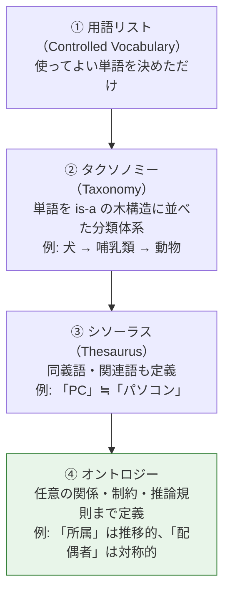
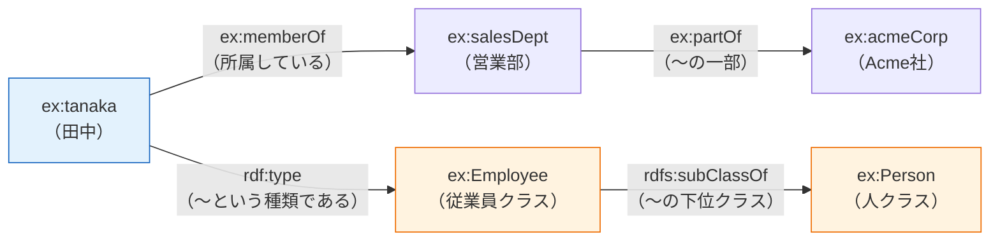

# オントロジーとナレッジグラフ（Ontology and Knowledge Graph）

> **一言で言うと:** **オントロジー**は「この世界にはどんな種類のモノが存在し、それらがどんな関係を結べるか」を機械が読める形で定義した語彙体系。**ナレッジグラフ**は、その定義に沿って実際の事実をノードとエッジとして積み上げたデータ本体。ざっくり言えば **オントロジー＝スキーマ、ナレッジグラフ＝データ** の関係にある（ただしこの喩えは半分正しく半分間違っている。なぜ半分間違いなのかは後述の「RDB のスキーマと何が決定的に違うのか」で扱う）。

> [!info] 用語ミニ辞典
> - **オントロジー（Ontology）** — もとは哲学の「存在論」。情報科学では Gruber (1993) の「**概念化の明示的な仕様**（an explicit specification of a conceptualization）」が原典で、その後 Studer ら (1998) が「**共有された**概念化の、**形式的**かつ明示的な仕様」と精緻化した定義が広く使われている。原典に無かった2語が後から足された経緯そのものが実務上の勘所を示している ——「**形式的**」＝人間が読む文章ではなく機械が解釈できる規則として書かれていること、「**共有された**」＝一人の頭の中ではなく、その領域の関係者が合意していること。この2つを欠いたものは、ただの個人的な用語メモにすぎない。
> - **ナレッジグラフ（Knowledge Graph / 知識グラフ）** — 実体（人・商品・企業など）をノード、実体間の関係をエッジとして表現した知識データベース。Google が 2012 年に検索へ導入して一般化した語。
> - **語彙（Vocabulary）** — 使ってよい用語（クラス名・関係名）の集合。オントロジーの「単語帳」部分。

## なぜ Web エンジニアに関係するのか

「哲学由来の概念」と聞くと実務から遠く感じるが、Web 開発では次の3つの場面で必ず顔を出す。**同じ考え方が別の名前で呼ばれている**だけなので、まとめて押さえると効率がよい。

| 現場 | どこにオントロジーが現れるか |
|---|---|
| **SEO / 構造化データ** | 商品ページに埋め込む `schema.org` の JSON-LD。`Product` `Offer` `Review` という**型と関係の定義**そのものがオントロジー |
| **ドメインモデリング** | DDD の**ユビキタス言語**（チーム内で用語と関係を統一する原則）。「注文とは何か」「注文と請求はどう繋がるか」を決める作業は、実質オントロジー構築 |
| **LLM / RAG** | ベクトル検索だけでは辿れない「AはBの子会社で、BはCを買収した」という関係を、グラフとして持たせて検索させる **GraphRAG** |

つまりオントロジーは、**「用語の意味を人間の頭の中ではなくデータとして外部化する」**技術だと理解すればよい。

## 語彙の表現力には段階がある

「オントロジー」という語は広く使われすぎているため、まず**どこまで形式化されているか**の階段を把握しておくと混乱しにくい。下に行くほど機械にできることが増え、その分だけ構築コストが上がる。



実務で「オントロジーを作る」と言われた場合、実態は ② や ③ で足りることが多い。**④ まで踏み込む価値があるのは、書いていない事実を機械に導出させたいときだけ**である。この見極めができるかどうかが、コストを溶かすか否かの分かれ目になる（[[YAGNI]]）。

## 中核データ構造：RDF トリプル

セマンティック Web の標準である **RDF（Resource Description Framework / W3C 標準）** では、すべての知識を「**主語・述語・目的語**」の3つ組（トリプル）で表す。日本語の文をそのまま分解した形だと考えればよい。

> 「田中（主語）は 所属している（述語） 営業部（目的語）」



トリプルという極端に単純な単位を選んだのには理由がある。テーブルは列を追加するたびにスキーマ変更（[[マイグレーション]]）が要るが、トリプルは**行を足すだけで新しい種類の事実を追加できる**。異なる組織が作ったデータ同士を後から繋ぎ合わせる、というセマンティック Web の目的にはこの柔軟性が必要だった。

> [!info] 用語ミニ辞典
> - **IRI（Internationalized Resource Identifier）** — RDF ではノードや述語を `https://example.com/ns#tanaka` のような URL 形式の一意な識別子で表す。同じ「田中」を指していることを世界中のデータ間で保証するための仕組み。上図の `ex:` はこの長い IRI の省略記法（プレフィックス）。
> - **rdfs:subClassOf / rdf:type** — RDFS（RDF Schema）が定める標準の述語。それぞれ「クラスの継承」「インスタンスの所属クラス」を意味し、後述の推論の材料になる。
> - **OWL（Web Ontology Language）** — RDFS より表現力の高い W3C 標準。「この関係は推移的（transitive）」「この2つのクラスは互いに素（disjoint）」といった規則を書ける。

## RDB のスキーマと何が決定的に違うのか

オントロジーは「グラフ版のテーブル定義」ではない。前提としている**論理の世界観**が違う。ここがシニアとして押さえるべき最重要ポイントになる。

| | RDB のスキーマ（[[RDB]]） | オントロジー（RDFS / OWL） |
|---|---|---|
| **世界の前提** | **閉世界仮説（CWA）** — DB に無い事実は「偽」 | **開世界仮説（OWA）** — 書かれていない事実は「偽」ではなく「**未知**」 |
| **同一性** | 主キーが違えば別物（[[サロゲートキーと自然キー]]） | **一意名仮説を置かない** — IRI が違っても同一かもしれない。同一なら `owl:sameAs` で明示する |
| **定義の役割** | データを**制約する**（違反は INSERT が失敗する） | データから**新しい事実を導出する**（違反しても普通はエラーにならない） |
| **拡張の仕方** | ALTER TABLE（[[マイグレーション]]） | トリプルを追記するだけ |

この違いが実務で牙をむくのが「**OWL で制約を書いたのにバリデーションが効かない**」という事故である。RDB の `NOT NULL` のつもりで「Person は必ず1つの誕生日を持つ」と OWL に書いても、誕生日が無いデータは**エラーにならない**。OWA の世界では「まだ知られていないだけ」と解釈されるからだ。

なぜそんな設計にしたのか。RDF は**世界中の誰もが好き勝手にデータを公開する Web** を想定して作られた。自分の DB に載っていない事実を「存在しない」と断定できる Web など無い、という現実に合わせた結果が OWA である。

> [!note] では検証はどうするのか
> データの妥当性検証には **SHACL（Shapes Constraint Language / W3C 標準）** を使う。「このノードは必ず `name` を1つ持つ」といった形状（shape）を宣言し、違反を検出する。役割としては [[JSON-Schema]] の RDF 版にあたる。**OWL は推論のため、SHACL は検証のため**と役割を切り分けて覚える。

## 推論（Inference）— オントロジーの本領

オントロジーの価値は「**書いていない事実が自動的に導かれる**」点にある。以下の Python 例では、`田中は正社員である` としか書いていないのに `田中は人である` が導出される。

```python
# pip install rdflib owlrl
from rdflib import Graph, Namespace, RDF, RDFS, Literal
from owlrl import DeductiveClosure, RDFS_Semantics

EX = Namespace("https://example.com/ns#")
g = Graph()
g.bind("ex", EX)

# ① オントロジー（語彙の定義）— クラスの階層だけを宣言する
g.add((EX.Employee, RDFS.subClassOf, EX.Person))          # 従業員は人の一種
g.add((EX.FullTimeEmployee, RDFS.subClassOf, EX.Employee))  # 正社員は従業員の一種

# ② 事実（インスタンス）— 「田中は正社員」としか書いていない
g.add((EX.tanaka, RDF.type, EX.FullTimeEmployee))
g.add((EX.tanaka, RDFS.label, Literal("田中")))

print((EX.tanaka, RDF.type, EX.Person) in g)  # False — この時点ではまだ何も導出されていない

# ③ 推論エンジンを適用する
#    rdflib はグラフの保管とクエリだけを行い、推論は行わない。
#    owlrl が RDFS/OWL の規則を適用し、導出された事実を g に書き足す（前向き推論）。
DeductiveClosure(RDFS_Semantics).expand(g)

print((EX.tanaka, RDF.type, EX.Person) in g)  # True — 書いていないのに導かれた

# SPARQL（RDF 用のクエリ言語）で「人であるもの」を検索すると田中がヒットする
#   rdflib は rdfs 等の標準プレフィックスを暗黙に束縛するが、
#   その既定の挙動はバージョンによって変わりうるため、常に明示するのが安全。
for row in g.query("""
    PREFIX ex:   <https://example.com/ns#>
    PREFIX rdfs: <http://www.w3.org/2000/01/rdf-schema#>
    SELECT ?label WHERE { ?s a ex:Person ; rdfs:label ?label }
"""):
    print(row.label)  # 田中
```

RDB で同じことをするなら、`employees` と `persons` の JOIN、あるいは階層を辿る再帰 CTE をアプリ側で書くことになる。オントロジーでは**「階層をどう辿るか」ではなく「階層はこうである」とだけ宣言し、辿り方はエンジンに任せる**。この宣言的な性質が、関係の種類が増え続けるドメインで効いてくる。

OWL ではさらに強い規則を書ける。たとえば `ex:partOf` を `owl:TransitiveProperty`（推移的）と宣言しておけば、「営業部は Acme 社の一部」「田中は営業部に所属」から**田中と Acme 社の繋がりを何段でも自動で辿れる**ようになる。

## 実務での主戦場：schema.org と JSON-LD

Web エンジニアが最も高い確率で触るオントロジーは **schema.org** である。2011 年に Google・Microsoft・Yahoo! が共同で立ち上げた、Web ページの内容を機械に説明するための共通語彙で、検索結果のリッチリザルト（価格や星評価の表示）の入力になる。

記述形式には **JSON-LD（JSON for Linked Data / W3C 標準）** を使う。見た目はただの JSON だが、`@context` が「この JSON のキーはどの語彙の用語か」を宣言することで、**RDF トリプルとして解釈できる JSON** になっている。

```ts
// 商品ページに埋め込む構造化データ
const productJsonLd = {
  "@context": "https://schema.org", // ← 語彙の出典 = オントロジーの指定
  "@type": "Product",               // ← このノードの種類（クラス）
  // ← このノードの IRI。省略すると匿名ノード（blank node）になり、
  //    他ページや他社のデータから「同じ商品」として参照できなくなる
  "@id": "https://example.com/products/x1#product",
  "name": "ノイズキャンセリングヘッドホン X1",
  "brand": { "@type": "Brand", "name": "Acme" }, // ネストは関係（エッジ）になる
  "offers": {
    "@type": "Offer",
    "price": "24800",
    "priceCurrency": "JPY",
    "availability": "https://schema.org/InStock", // 値も IRI で表す
  },
} as const;

// HTML への埋め込み。JSON 内の "<" をエスケープしないと
// 文字列に "</script>" を含む商品名で script タグが閉じられ XSS になる。
const safeJson = JSON.stringify(productJsonLd).replace(/</g, "\\u003c");
const tag = `<script type="application/ld+json">${safeJson}</script>`;
```

この JSON が表現しているのは、結局のところ「`X1` は `Product` である」「`X1` の `brand` は `Acme` である」という**トリプルの集まり**である。RDF を意識せずに使えるよう JSON の皮をかぶせたのが JSON-LD の設計意図で、これがセマンティック Web 系技術の中でほぼ唯一広く普及した理由でもある。

> [!warning] 表示内容と一致させる
> Google の構造化データポリシーは、**ページに表示されていない情報をマークアップすることを禁じている**。「星評価を盛る」ような使い方は手動対策（ペナルティ）の対象になる。構造化データはページ内容の**再表現**であって、追加の主張ではない。

## 2つのグラフモデル：RDF とプロパティグラフ

[[NoSQL]] のグラフ DB を選ぶとき、モデルが2系統あることを知らないと選定を誤る。

| | **RDF グラフ**（Neptune, GraphDB, Virtuoso） | **プロパティグラフ**（Neo4j, Neptune, TigerGraph） |
|---|---|---|
| 単位 | トリプル（主語・述語・目的語） | ノード / エッジに**任意のプロパティを直接持てる** |
| クエリ言語 | SPARQL（W3C 標準） | Cypher / Gremlin、および **GQL**（2024 年に ISO 標準化） |
| 形式的意味論 | **ある**（推論できる） | **ない**（エッジの意味はアプリ側の約束事） |
| 得意 | データ統合・語彙共有・推論 | 経路探索・レコメンド・不正検知 |

```cypher
// プロパティグラフ（Cypher）: エッジに直接プロパティを持たせられる
CREATE (t:Person {name: '田中'})-[:MEMBER_OF {since: 2021}]->(d:Dept {name: '営業部'})

// 「田中から2ホップ以内で辿れる組織」— 経路探索はこちらが圧倒的に書きやすい
MATCH (t:Person {name: '田中'})-[*1..2]->(org) RETURN org
```

RDF でエッジに「所属開始年」のような属性を付けるには、関係自体をノード化する（reification）などの回り道が要る。ただしこの弱点は解消されつつある。**RDF 1.2（策定中の呼称は RDF-star）** は「トリプルについてのトリプル」を書ける triple term と `rdf:reifies` を導入し、正面から対処している。2026 年時点では W3C の Working Draft 段階で Recommendation には至っていないが、主要な RDF ストアは先行実装済みなので、「RDF はエッジ属性が苦手」という数年前の理解のまま選定すると判断を誤る。逆にプロパティグラフには `subClassOf` のような**標準の意味論が無い**ため、推論をしたければ自前で実装することになる。

**「関係を高速に辿りたい」だけならプロパティグラフ、「複数の組織のデータを共通語彙で繋ぎたい・推論したい」なら RDF** という切り分けが実務的な指針になる。

## 歴史的経緯：なぜセマンティック Web は主流にならなかったのか

2001 年、Tim Berners-Lee は「Web 上のあらゆるデータを機械が理解できるようにする」というセマンティック Web 構想を提唱した。RDF・OWL・SPARQL はその実現手段として整備された。しかし当初描かれた「Web 全体が1つの巨大な知識ベースになる」姿は実現していない。理由は技術的な欠陥ではなく、**社会的・経済的なもの**だった。

- **タグ付けのコストを誰が払うのか** — 正確なメタデータを書く手間は書き手が負い、利益は読み手（検索エンジン）が得る。この非対称性を埋めるインセンティブが無かった。
- **語彙の合意形成が難しい** — 「商品」の定義すら組織ごとに違う。全世界で1つのオントロジーに合意するのは政治的に不可能に近い。
- **書き手は必ず嘘をつく** — メタデータは SEO スパムの標的になる（キーワード詰め込みの歴史）。

そして生き残ったのは、**範囲を絞り、インセンティブを明確にした**ものだった。schema.org は「検索結果で目立つ」という直接的な見返りを書き手に与え、Wikidata は編集者コミュニティという労働力を持ち、企業内ナレッジグラフは自社の統制下にあるデータだけを扱う。「壮大な標準より、狭くて得のある標準が勝つ」という、標準化全般に通じる教訓がここにある。

そして 2020 年代、LLM の登場でこの領域は再評価されている。ベクトル検索（[[RAG]]）は「意味が似た文書」は見つけられるが、「A社の親会社の CEO は誰か」のような**多段の関係を辿る問い**には弱い。そこでナレッジグラフを併用し、グラフを辿って集めた事実を LLM に渡す **GraphRAG** が注目された。**曖昧さに強い LLM と、関係の厳密さに強いグラフの組み合わせ**は、それぞれの弱点を補い合う（[[ToolCalling]] でグラフ検索をツールとして公開する形が実装しやすい）。

## よくある落とし穴

### 1. オントロジー構築が目的化する

最初から全社の概念を網羅しようとした「エンタープライズオントロジー」プロジェクトは、高確率で数年かけて何も生まない。**具体的な問い（クエリ）を先に決め、それに答えるのに必要な最小の語彙から始める**。答えたい問いが無い語彙は、ただのメンテナンスコストになる。

### 2. OWL の制約をバリデーションだと思い込む

前述の通り、OWL は開世界仮説の上で**推論する**言語であり、データの不備を弾く仕組みではない。検証には SHACL、アプリケーション境界では通常どおり [[バリデーション]] を使う。

### 3. IRI を安易に変える／内部 ID をそのまま IRI にする

IRI は世界に対する公開識別子であり、他システムから参照される。DB の連番 ID をそのまま IRI にすると、DB 移行やマージのたびに識別子が壊れる。「**Cool URIs don't change**」（W3C）は、この文脈では単なるスローガンでなくデータ整合性の要件になる。

### 4. `owl:sameAs` の乱用

「同じっぽい」程度の判断で `owl:sameAs`（完全に同一の実体である）を張ると、推論エンジンが両者の**全プロパティを混ぜ合わせる**。少しの誤りが「東京都と東京駅は同一」のような破滅的な結論に伝播する。緩い関連には `skos:closeMatch` などの弱い述語を使う。

### 5. グラフ DB を導入すればナレッジグラフになる、という誤解

Neo4j を立てただけでは、エッジの意味は開発者の頭の中にしかない。**語彙の定義と、その語彙を使い続ける運用**があって初めてナレッジグラフとして機能する。逆に言えば、語彙さえ統制されていれば [[RDB]] のテーブルでも小規模なナレッジグラフは十分成立する。

### 6. 構造化データとページ内容の乖離

JSON-LD を CMS で自動生成していると、記事本文の修正が構造化データに反映されず不一致が生じやすい。**同一のデータソースから本文と JSON-LD の両方を描画する**（[[レンダリング戦略]]）のが安全な設計。

## AI 実装のアンチパターン

| AI 生成コードに出やすい傾向 | 何が問題か | どう直すか |
|---|---|---|
| schema.org に**存在しない型**を書く（例: `"@type": "ProductReview"`） | 検索エンジンに無視される。しかも構文エラーにならないので気づかない | schema.org の型一覧と Rich Results Test で実在を確認する |
| `JSON.stringify` の結果を**エスケープせず** `<script>` に直接埋める | 商品名やレビュー本文に `</script>` が含まれると XSS（[[SQLインジェクションとXSS]]） | `<` を `\u003c`（JSON のユニコードエスケープ）に置換してから埋め込む |
| OWL の制約でデータ検証できると説明・実装する | 開世界仮説のため違反が検出されない。「検証しているつもり」が最も危険 | 検証は SHACL / [[JSON-Schema]] / アプリ層の [[バリデーション]] に寄せる |
| 文書からエンティティを自動抽出し、**表記ゆれのまま**ノード化する | 「Acme」「Acme社」「ACME Inc.」が別ノードになり、グラフが繋がらない | 正規化・名寄せ（entity resolution）の工程を必ず挟む |
| 使いもしない深いクラス階層を最初から生成する | 保守対象だけが増える。推論も遅くなる | 答えたいクエリから逆算して階層を削る（[[YAGNI]]） |

→ [[_anti-patterns/_index|AIアンチパターン索引]]

## 関連トピック

- 親: [[NoSQL]] — グラフ DB（RDF ストア / プロパティグラフ）の位置づけ
- [[RDB]] / [[正規化と非正規化の判断基準]] — 閉世界仮説に立つスキーマとの対比
- [[サロゲートキーと自然キー]] — 識別子の設計。IRI 設計は同じ問題の Web スケール版
- [[JSON-Schema]] — 構造の検証。SHACL と役割が対応する
- [[RAG]] / [[ToolCalling]] — GraphRAG。グラフ検索をツールとして LLM に渡す
- [[マークアップ言語とHTML]] / [[レンダリング戦略]] — JSON-LD の埋め込みと SEO
- [[モノリスvsマイクロサービス]] — ユビキタス言語 / Bounded Context は、境界ごとにオントロジーを分ける発想
- [[YAGNI]] — 語彙の過剰設計を抑える判断軸

## 参考リソース

- [schema.org](https://schema.org/) — 実務で最も使う語彙。型と属性の一覧
- [Google 検索セントラル — 構造化データの仕組み](https://developers.google.com/search/docs/appearance/structured-data/intro-structured-data) — リッチリザルトの要件とポリシー
- [W3C — JSON-LD 1.1](https://www.w3.org/TR/json-ld11/) — JSON を RDF として解釈する仕様
- [W3C — SHACL](https://www.w3.org/TR/shacl/) — RDF データの形状検証
- [rdflib](https://rdflib.readthedocs.io/) / [owlrl](https://owl-rl.readthedocs.io/) — Python での RDF 操作と推論
- [Wikidata](https://www.wikidata.org/) — 世界最大級の公開ナレッジグラフ。SPARQL エンドポイントで実際に試せる
