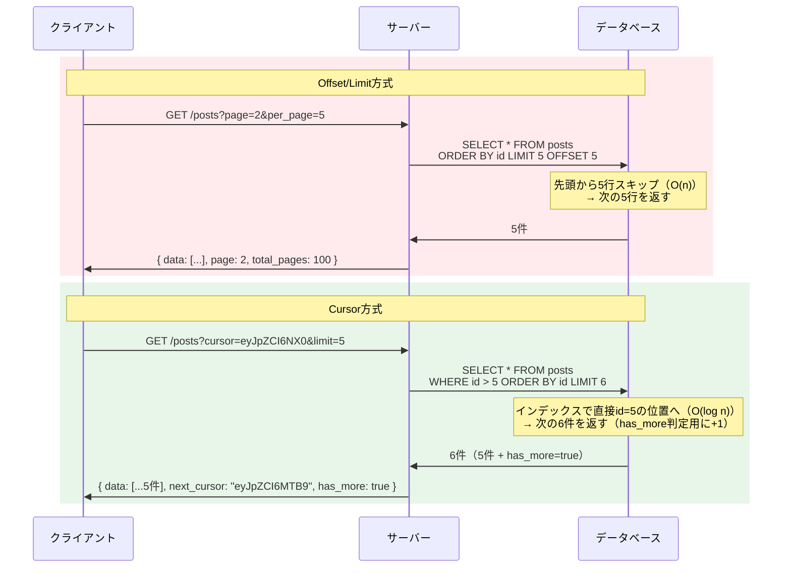
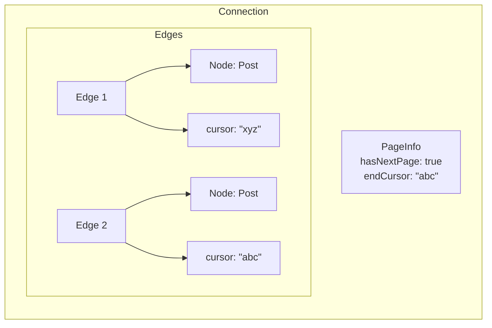

# カーソルベースページネーション（Cursor-based Pagination）

> **一言で言うと:** リスト取得APIで「前回の最後の要素」を起点にして次のページを取得する方式。Offset/Limit方式の「ページ間データ重複・欠落」と「大きなOFFSETでのパフォーマンス劣化」を根本的に解決する。

## Offset/Limit方式の問題点

従来のページネーションは `OFFSET` と `LIMIT` でページを指定する。

```sql
-- 2ページ目（1ページ20件）
SELECT * FROM posts ORDER BY created_at DESC LIMIT 20 OFFSET 20;
```

この方式には2つの構造的な問題がある。

### 問題1: データの重複・欠落

ユーザーが1ページ目を閲覧中に新しいレコードが挿入されると、2ページ目を取得した時に1ページ目と同じレコードが含まれる（重複）。逆に削除が発生すると、どのページにも表示されないレコードが生じる（欠落）。

```
1ページ目取得時:  [A, B, C, D, E]  （OFFSET 0, LIMIT 5）

   → この間に新しいレコード X が先頭に挿入される

2ページ目取得時:  [E, F, G, H, I]  （OFFSET 5, LIMIT 5）
                   ↑ Eが重複して表示される
```

### 問題2: OFFSETのパフォーマンス劣化

`OFFSET n` はデータベースに「先頭からn行スキップ」を指示する。RDBは実際にn行を読み飛ばすため、OFFSETが大きくなるほどO(n)のスキャンコストが発生する。100万件目以降のページ取得は極めて遅くなる。

```sql
-- 内部的には50,000行をスキャンしてから20行を返す
SELECT * FROM posts ORDER BY created_at DESC LIMIT 20 OFFSET 50000;
```

[[B-TreeとB+Tree]]のインデックス構造を活用できないため、テーブルが大きくなるほど深刻になる。

## カーソル方式の仕組み

カーソル方式では、前回取得した最後の要素のIDや値を「カーソル（Cursor）」として次のリクエストに渡す。データベースは `WHERE` 句でカーソル位置から直接スキャンを開始するため、ページの深さに関係なく一定のパフォーマンスを維持できる。

```sql
-- カーソル（前回の最後のID = 1042）より後の20件を取得
-- has_more判定のためにLIMIT n+1で取得する
SELECT * FROM posts WHERE id > 1042 ORDER BY id ASC LIMIT 21;
```

インデックスが `id` に貼られていれば、[[B-TreeとB+Tree]]のツリー探索でO(log n)で目的のレコードに到達し、そこから順にリーフノードを辿るだけで済む。

### Opaque Cursor

クライアントに渡すカーソルは、内部実装（カラム名やID値）を直接露出させず、Base64エンコード等で**不透明（opaque）** にするのが一般的。これにより:

- クライアントがカーソルの構造に依存しない
- サーバー側でカーソルの構造を自由に変更できる
- カーソルの改ざんリスクを軽減できる

```
生のカーソル:    {"id": 1042, "created_at": "2026-03-01T00:00:00Z"}
Opaqueカーソル:  eyJpZCI6IDEwNDIsICJjcmVhdGVkX2F0IjogIjIwMjYtMDMtMDFUMDA6MDA6MDBaIn0=
```

## 比較図: Offset方式 vs Cursor方式



## Relay-style Connection仕様（GraphQL）

GraphQLコミュニティでは、Relay frameworkが定義した **Connection仕様** がカーソルベースページネーションの標準として広く採用されている。

```graphql
type Query {
  posts(first: Int, after: String, last: Int, before: String): PostConnection!
}

type PostConnection {
  edges: [PostEdge!]!
  pageInfo: PageInfo!
  totalCount: Int
}

type PostEdge {
  node: Post!
  cursor: String!    # 各要素に個別のカーソルが付く
}

type PageInfo {
  hasNextPage: Boolean!
  hasPreviousPage: Boolean!
  startCursor: String
  endCursor: String   # 次ページ取得時に after に渡す
}
```



## 各言語での実装例

### TypeScript（Express）

```typescript
import express, { Request, Response } from 'express';
import { Pool } from 'pg';

const pool = new Pool();
const app = express();

interface PaginatedResponse<T> {
  data: T[];
  next_cursor: string | null;
  has_more: boolean;
}

app.get('/api/posts', async (req: Request, res: Response) => {
  const limit = Math.min(Number(req.query.limit) || 20, 100);
  const cursor = req.query.cursor as string | undefined;

  let decodedCursor: number | null = null;
  if (cursor) {
    try {
      decodedCursor = JSON.parse(
        Buffer.from(cursor, 'base64').toString()
      ).id;
    } catch {
      res.status(400).json({ error: 'Invalid cursor' });
      return;
    }
  }

  // LIMIT + 1 で取得し、余分があれば has_more = true
  const query = decodedCursor
    ? 'SELECT * FROM posts WHERE id > $1 ORDER BY id ASC LIMIT $2'
    : 'SELECT * FROM posts ORDER BY id ASC LIMIT $1';

  const params = decodedCursor
    ? [decodedCursor, limit + 1]
    : [limit + 1];

  const { rows } = await pool.query(query, params);

  const hasMore = rows.length > limit;
  const data = hasMore ? rows.slice(0, limit) : rows;

  const nextCursor = hasMore
    ? Buffer.from(JSON.stringify({ id: data[data.length - 1].id })).toString('base64')
    : null;

  const response: PaginatedResponse<typeof data[0]> = {
    data,
    next_cursor: nextCursor,
    has_more: hasMore,
  };

  res.json(response);
});
```

### Go（Chi）

```go
package main

import (
	"database/sql"
	"encoding/base64"
	"encoding/json"
	"net/http"
	"strconv"

	"github.com/go-chi/chi/v5"
	_ "github.com/lib/pq"
)

type Cursor struct {
	ID int64 `json:"id"`
}

type PaginatedResponse struct {
	Data       []Post  `json:"data"`
	NextCursor *string `json:"next_cursor"`
	HasMore    bool    `json:"has_more"`
}

type Post struct {
	ID    int64  `json:"id"`
	Title string `json:"title"`
}

func listPosts(db *sql.DB) http.HandlerFunc {
	return func(w http.ResponseWriter, r *http.Request) {
		limitStr := r.URL.Query().Get("limit")
		limit := 20
		if l, err := strconv.Atoi(limitStr); err == nil && l > 0 && l <= 100 {
			limit = l
		}

		var rows *sql.Rows
		var err error

		cursorParam := r.URL.Query().Get("cursor")
		if cursorParam != "" {
			decoded, err := base64.StdEncoding.DecodeString(cursorParam)
			if err != nil {
				http.Error(w, `{"error":"invalid cursor"}`, http.StatusBadRequest)
				return
			}
			var c Cursor
			if err := json.Unmarshal(decoded, &c); err != nil {
				http.Error(w, `{"error":"invalid cursor"}`, http.StatusBadRequest)
				return
			}
			rows, err = db.Query(
				"SELECT id, title FROM posts WHERE id > $1 ORDER BY id ASC LIMIT $2",
				c.ID, limit+1,
			)
		} else {
			rows, err = db.Query(
				"SELECT id, title FROM posts ORDER BY id ASC LIMIT $1",
				limit+1,
			)
		}
		if err != nil {
			http.Error(w, `{"error":"internal"}`, http.StatusInternalServerError)
			return
		}
		defer rows.Close()

		var posts []Post
		for rows.Next() {
			var p Post
			rows.Scan(&p.ID, &p.Title)
			posts = append(posts, p)
		}

		hasMore := len(posts) > limit
		if hasMore {
			posts = posts[:limit]
		}

		resp := PaginatedResponse{Data: posts, HasMore: hasMore}
		if hasMore {
			cursorJSON, _ := json.Marshal(Cursor{ID: posts[len(posts)-1].ID})
			encoded := base64.StdEncoding.EncodeToString(cursorJSON)
			resp.NextCursor = &encoded
		}

		w.Header().Set("Content-Type", "application/json")
		json.NewEncoder(w).Encode(resp)
	}
}

func main() {
	db, _ := sql.Open("postgres", "postgres://localhost/mydb?sslmode=disable")
	r := chi.NewRouter()
	r.Get("/api/posts", listPosts(db))
	http.ListenAndServe(":3000", r)
}
```

### PHP（Laravel）

```php
<?php

namespace App\Http\Controllers;

use App\Models\Post;
use Illuminate\Http\JsonResponse;
use Illuminate\Http\Request;

class PostController extends Controller
{
    public function index(Request $request): JsonResponse
    {
        $limit = min((int) $request->input('limit', 20), 100);
        $cursor = $request->input('cursor');

        $query = Post::orderBy('id');

        if ($cursor) {
            $decoded = json_decode(base64_decode($cursor), true);
            if (!$decoded || !isset($decoded['id'])) {
                return response()->json(['error' => 'Invalid cursor'], 400);
            }
            $query->where('id', '>', $decoded['id']);
        }

        // LIMIT + 1 で取得して has_more を判定
        $posts = $query->limit($limit + 1)->get();

        $hasMore = $posts->count() > $limit;
        $data = $hasMore ? $posts->slice(0, $limit)->values() : $posts;

        $nextCursor = $hasMore
            ? base64_encode(json_encode(['id' => $data->last()->id]))
            : null;

        return response()->json([
            'data' => $data,
            'next_cursor' => $nextCursor,
            'has_more' => $hasMore,
        ]);
    }
}
```

### Ruby（Rails）

```ruby
class Api::PostsController < ApplicationController
  def index
    limit = [params.fetch(:limit, 20).to_i, 100].min
    cursor_param = params[:cursor]

    scope = Post.order(:id)

    if cursor_param.present?
      decoded = JSON.parse(Base64.decode64(cursor_param))
      scope = scope.where("id > ?", decoded["id"])
    rescue JSON::ParserError, ArgumentError
      return render json: { error: "Invalid cursor" }, status: :bad_request
    end

    # LIMIT + 1 で取得して has_more を判定
    posts = scope.limit(limit + 1).to_a

    has_more = posts.size > limit
    data = has_more ? posts.first(limit) : posts

    next_cursor = if has_more
      Base64.strict_encode64({ id: data.last.id }.to_json)
    end

    render json: {
      data: data.as_json(only: [:id, :title, :created_at]),
      next_cursor: next_cursor,
      has_more: has_more,
    }
  end
end
```

### Python（FastAPI）

```python
import base64
import json
from typing import Any, Generic, TypeVar

from fastapi import FastAPI, HTTPException, Query
from pydantic import BaseModel
from sqlalchemy import select, text
from sqlalchemy.ext.asyncio import AsyncSession, create_async_engine

app = FastAPI()

T = TypeVar("T")


class PaginatedResponse(BaseModel, Generic[T]):
    data: list[T]
    next_cursor: str | None
    has_more: bool


class PostOut(BaseModel):
    id: int
    title: str


def encode_cursor(data: dict[str, Any]) -> str:
    return base64.b64encode(json.dumps(data).encode()).decode()


def decode_cursor(cursor: str) -> dict[str, Any]:
    try:
        return json.loads(base64.b64decode(cursor))
    except Exception:
        raise HTTPException(status_code=400, detail="Invalid cursor")


@app.get("/api/posts", response_model=PaginatedResponse[PostOut])
async def list_posts(
    limit: int = Query(default=20, ge=1, le=100),
    cursor: str | None = Query(default=None),
):
    # 実際にはDIでセッションを注入する
    async with AsyncSession(engine) as session:
        stmt = select(text("id, title")).select_from(text("posts")).order_by(text("id"))

        if cursor:
            decoded = decode_cursor(cursor)
            stmt = stmt.where(text("id > :cursor_id")).params(cursor_id=decoded["id"])

        stmt = stmt.limit(limit + 1)
        result = await session.execute(stmt)
        rows = result.all()

    has_more = len(rows) > limit
    data = rows[:limit] if has_more else rows

    next_cursor = encode_cursor({"id": data[-1].id}) if has_more else None

    return PaginatedResponse(
        data=[PostOut(id=r.id, title=r.title) for r in data],
        next_cursor=next_cursor,
        has_more=has_more,
    )
```

## UIとの対応

ページネーションの方式選択は、UIの要件から逆算すべき。

| UIパターン | 適した方式 | 理由 |
|---|---|---|
| 無限スクロール | **カーソル方式** | 「次の塊」を連続取得するだけ。ページ番号は不要 |
| ページ番号ナビゲーション | **Offset方式** | 「3ページ目に飛ぶ」にはOFFSET計算が必要。カーソル方式では不可能 |
| 「もっと読む」ボタン | **カーソル方式** | 無限スクロールと同じ構造 |
| 管理画面のテーブル（並べ替え付き） | **ケースバイケース** | ソートキーが固定ならカーソル方式、動的に変わるならOffset方式が現実的 |

カーソル方式は**任意のページへのジャンプができない**という制約があるため、UIが「前へ/次へ」のみで成立するケースに適している。

## 落とし穴

### 1. 複合ソートキーでのカーソル実装

`created_at` でソートしつつ同一タイムスタンプのレコードが複数存在する場合、`WHERE created_at > :cursor` だけではレコードが欠落する。タイブレーカー（tiebreaker）として一意なカラム（通常はID）を組み合わせる必要がある。

```sql
-- ❌ created_at が同じレコードがある場合、一部が欠落する
SELECT * FROM posts
WHERE created_at > '2026-03-01'
ORDER BY created_at DESC
LIMIT 21;

-- ✅ 複合キーでカーソルを構成する
SELECT * FROM posts
WHERE (created_at, id) < ('2026-03-01T12:00:00Z', 1042)
ORDER BY created_at DESC, id DESC
LIMIT 21;
```

この場合、カーソルに `created_at` と `id` の両方をエンコードする必要がある。

```json
{"created_at": "2026-03-01T12:00:00Z", "id": 1042}
```

対応する複合インデックスも必要になる:

```sql
CREATE INDEX idx_posts_cursor ON posts (created_at DESC, id DESC);
```

### 2. 削除済みレコードとカーソルの不整合

カーソルが指すレコードが削除されている場合の挙動を考慮する必要がある。`WHERE id > :cursor_id` であれば、カーソルが指すレコード自体は返さないため、削除されていても次のレコードから正しく取得できる。しかし、`created_at` のような非一意キーをカーソルに使っている場合、削除によってカーソル位置が不正になるリスクがある。

**対策:** カーソルには常に一意なキー（または一意な複合キー）を含め、`WHERE` 句の比較が削除の影響を受けないようにする。

### 3. カーソルの改ざん・不正値

クライアントが送信するカーソルは信頼できない入力として扱う。Base64デコード後のバリデーションを必ず行い、不正な値にはエラーを返す。カーソルに署名（HMAC等）を付与して改ざんを検知する方法もあるが、多くの場合はバリデーションだけで十分。

### 4. `ORDER BY` 方向の不一致

「前のページ」を取得する場合、`ORDER BY` の方向を逆にする必要がある。この時、取得した結果を再度反転させてクライアントに返す点を忘れやすい。

```sql
-- 次ページ: カーソルより後を昇順で取得
SELECT * FROM posts WHERE id > 1042 ORDER BY id ASC LIMIT 21;

-- 前ページ: カーソルより前を降順で取得し、結果を反転する
SELECT * FROM posts WHERE id < 1042 ORDER BY id DESC LIMIT 21;
-- → アプリケーション層で結果を昇順に並べ替える
```

## 関連トピック

- [[API設計-REST-GraphQL]] — 親トピック。ページネーションはAPI設計の基本要素
- [[RDB]] — SQLレベルでの `OFFSET` / `WHERE` の動作とパフォーマンス特性
- [[B-TreeとB+Tree]] — カーソル方式が効率的な理由はインデックスのツリー構造に由来する
